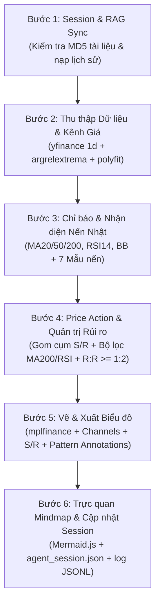

# Quantitative Stock Analysis & Candlestick Intelligence Skill

Kỹ năng này trang bị cho AI Agent năng lực phân tích kỹ thuật định lượng (Quantitative Technical Analysis) kết hợp kỷ luật hành động giá (Price Action) và triết lý nến Nhật thực chiến của Steve Nison. Hệ thống loại bỏ hoàn toàn việc "đoán mò bằng mắt", thay vào đó áp dụng thuật toán toán học chính xác (Cực trị địa phương, Hồi quy tuyến tính, Đo lường sai số độ dốc) và khung quản trị rủi ro tỷ lệ $R:R$ khắt khe.

---

## 1. Danh mục Tham chiếu & Tri thức Chuyên sâu (Reference Directory)

Hệ thống tài liệu tham chiếu cấu trúc hóa theo dạng module YAML được lưu trữ tại `./references/`:

| Module Tri thức | File Tham chiếu | Nội dung & Khi nào cần tra cứu |
|---|---|---|
| **Kênh xu hướng Toán học** | [01_mathematical_trend_channel.yaml](./references/01_mathematical_trend_channel.yaml) | Thuật toán `argrelextrema`, hồi quy `polyfit`, kiểm định độ song song (<15%), phân loại Kênh Tăng / Giảm / Đi ngang |
| **Mô hình Nến Nhật (Steve Nison)** | [02_candlestick_patterns_steve_nison.yaml](./references/02_candlestick_patterns_steve_nison.yaml) | Công thức tỷ lệ thân/bóng nến, tâm lý thị trường, 7 mẫu hình cốt lõi (Doji, Hammer, Shooting Star, Engulfing, Morning/Evening Star) |
| **Khung Quản trị Rủi ro & Khuyến nghị** | [03_risk_management_framework.yaml](./references/03_risk_management_framework.yaml) | Bộ lọc xu hướng dài hạn MA200, điểm Entry, Take Profit, Stop Loss ($\le 7\%$), điều kiện kích hoạt MUA / BÁN / THEO DÕI, tỷ lệ $R:R \ge 1:2$ |
| **Đúc kết 407 Đồ thị Thực chiến** | [04_chart_interpretation_heuristics.yaml](./references/04_chart_interpretation_heuristics.yaml) | Heuristics nhận diện vùng hộp tích lũy (Consolidation Box), hỗ trợ/kháng cự tĩnh, tín hiệu MFI, kịch bản swing trading theo mũi tên dự báo |

---

## 2. Quy trình Vận hành Chuẩn (SOP - 6 Bước Thực thi)

Khi nhận được yêu cầu phân tích một hoặc nhiều mã cổ phiếu, Agent tuân thủ nghiêm ngặt 6 bước:



### Bước 1: Quản lý Session & Đồng bộ RAG
1. Đọc cấu hình từ `yh-fin-monitor/dev/config_analysis.json` hoặc danh sách mã người dùng chỉ định.
2. Nạp session gần nhất từ `yh-fin-monitor/ai-session/agent_session.json`.
3. Kiểm tra thay đổi tài liệu trong `./documents/` qua MD5 hash và đồng bộ `doc_index.json`.

### Bước 2: Thu thập Dữ liệu Khung Ngày & Tính Kênh xu hướng Toán học
1. Lấy dữ liệu OHLCV lịch sử 6-12 tháng qua `yfinance` với khung **NGÀY (`interval="1d"`)** (Bắt buộc dùng khung ngày).
2. Phát hiện các điểm cực trị (Fractals) đỉnh/đáy bằng `scipy.signal.argrelextrema(order=5)`.
3. Khớp 2 đường thẳng hồi quy tuyến tính:
   - Đường biên dưới (Support line): Hồi quy qua các điểm đáy.
   - Đường biên trên (Resistance line): Hồi quy qua các điểm đỉnh.
4. Kiểm định độ song song: Sai số tỷ đối độ dốc $\frac{|Slope_{upper} - Slope_{lower}|}{\max(|Slope_{upper}|, |Slope_{lower}|)} < 0.15$.
5. Phân loại cấu trúc:
   - Độ dốc bình quân $|\text{slope}| < 0.03\%$ giá trung bình: **Kênh đi ngang (Horizontal)**.
   - Độ dốc bình quân $> 0$: **Kênh tăng (Ascending)**.
   - Độ dốc bình quân $< 0$: **Kênh giảm (Descending)**.

### Bước 3: Tính toán Chỉ báo Kỹ thuật & Nhận diện Mô hình Nến Nhật
1. Tính toán các đường trung bình: `MA20` (ngắn hạn), `MA50` (trung hạn), `MA200` (dài hạn).
2. Tính động lượng `RSI(14)` bằng công thức Wilder's Smoothing và dải biến động `Bollinger Bands (20, 2)`.
3. Quét 5 phiên gần nhất (`lookback = 5`) để phát hiện các cụm nến theo thuật toán tỷ lệ thân/bóng nến:
   - **Doji**: Tỷ lệ thân / biên độ $< 10\%$.
   - **Hammer**: Thân nhỏ ở trên, bóng dưới $\ge 2 \times$ thân, bóng trên $\le 0.5 \times$ thân.
   - **Shooting Star**: Thân nhỏ ở dưới, bóng trên $\ge 2 \times$ thân, bóng dưới $\le 0.5 \times$ thân.
   - **Bullish / Bearish Engulfing**: Nến sau ngược chiều và thân nến nhấn chìm trọn vẹn thân nến trước.
   - **Morning / Evening Star**: Cụm 3 nến đảo chiều kinh điển.

### Bước 4: Price Action, Hỗ trợ / Kháng cự & Khung Quản trị Rủi ro
1. Gom cụm các mức giá fractal có độ lệch $\le 1.5\%$ thành vùng Hỗ trợ (Support) và Kháng cự (Resistance).
2. Áp dụng **Bộ lọc Quản trị Rủi ro Kỷ luật**:
   - **MUA**:
     - Điều kiện xu hướng: Giá nằm TRÊN đường `MA200` (Uptrend dài hạn).
     - Điều kiện vị thế: Giá đang pullback về vùng Hỗ trợ mạnh hoặc cạnh dưới của Kênh tăng ($\le 3\%$).
     - Điều kiện động lượng: `RSI(14) < 65` (Chưa quá mua).
     - Điều kiện an toàn: Không xuất hiện Phá vỡ giả (False Breakout).
     - Tỷ lệ R:R: Điểm chốt lời (Cạnh trên kênh / Kháng cự cũ) so với Cắt lỗ (Dưới cạnh kênh $2\%$, tối đa $7\%$ từ giá mua) đạt $\ge 1:2$.
   - **BÁN**: Khi giá nằm dưới `MA200` (Downtrend dài hạn).
   - **THEO DÕI**: Khi chưa hội tụ đủ các điều kiện tối ưu hoặc tỷ lệ R:R $< 1:2$.

### Bước 5: Tự động Vẽ và Xuất Biểu đồ Kỹ thuật
- Sử dụng `mplfinance` xuất biểu đồ nến chuẩn:
  - Các đường MA20 (xanh dương), MA50 (cam), MA200 (tím).
  - Biên trên kênh (đỏ đứt nét), biên dưới kênh (xanh lá đứt nét).
  - Vùng hỗ trợ tĩnh (xanh dương đậm nét liền), vùng kháng cự tĩnh (đỏ đậm nét liền).
  - Chú thích mô hình nến Nhật bằng mũi tên trỏ vào nến.
  - Badge khuyến nghị ở góc trái (Xanh đậm = MUA, Vàng = THEO DÕI, Đỏ = BÁN).
  - Lưu file ảnh: `yh-fin-monitor/output/[TICKER]_analysis.png`.

### Bước 6: Trực quan Mindmap & Ghi nhận Lịch sử
1. Sinh đồ thị tư duy Mermaid.js theo luồng: `Vĩ mô` $\rightarrow$ `Kênh xu hướng` $\rightarrow$ `Mô hình nến` $\rightarrow$ `Hành động & Lý do`.
2. Ghi nhật ký vào `yh-fin-monitor/ai-session/recommendation_log.jsonl`.
3. Cập nhật trạng thái mới nhất vào `yh-fin-monitor/ai-session/agent_session.json`.

---

## 3. Lệnh Thực thi Nhanh (CLI Commands)

Agent có thể chạy trực tiếp bộ công cụ độc lập từ thư mục gốc repo hoặc thư mục `yh-fin-monitor/`:

```bash
# 1. Phân tích nhanh 1 mã cụ thể (khung Ngày mặc định):
python3 yh-fin-monitor/dev/chart_analysis_skill.py STB.VN

# 2. Phân tích hàng loạt theo danh sách trong config_analysis.json:
python3 yh-fin-monitor/dev/chart_analysis_skill.py

# 3. Chạy kiểm tra đồng bộ tài liệu RAG:
python3 -c "import sys; sys.path.insert(0, 'yh-fin-monitor/dev'); from chart_analysis_skill import rag_sync_check; print(rag_sync_check())"
```

---

## 4. Quy định Tuân thủ & Miễn trừ Trách nhiệm (Compliance)

Tất cả báo cáo kỹ thuật do Agent tạo ra **bắt buộc** kèm disclaimer:
> *"Lưu ý: Mọi phân tích kỹ thuật, mô hình nến, vùng giá hỗ trợ/kháng cự và khuyến nghị trên chỉ mang tính chất tham khảo dựa trên dữ liệu quá khứ, không phải lời khuyên đầu tư tài chính. Nhà đầu tư tự chịu trách nhiệm đối với quyết định giao dịch của mình."*
