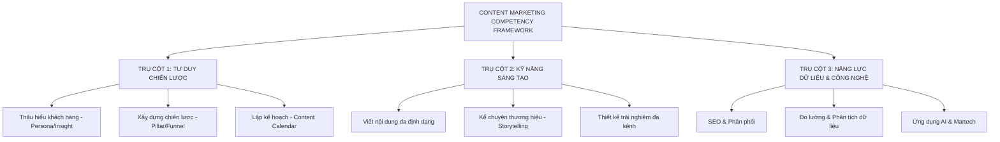
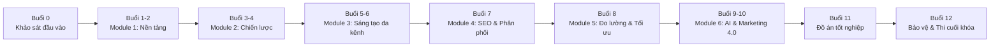
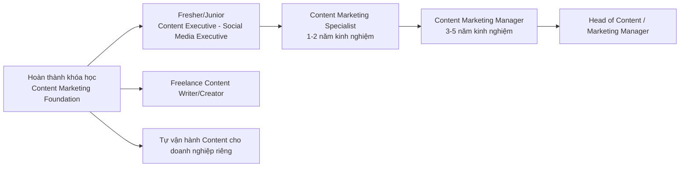

# CHƯƠNG TRÌNH ĐÀO TẠO CONTENT MARKETING CHO NGƯỜI MỚI BẮT ĐẦU
## (Content Marketing Foundation to Advanced — Marketing 4.0 Edition)

> Người biên soạn: Chuyên gia Marketing 4.0
> Phiên bản: 1.0 — Cập nhật 2026
> Đối tượng: Người mới bắt đầu (Fresher/Junior Content, Marketing Executive, chủ doanh nghiệp nhỏ, Freelancer)

---

## MỤC LỤC TOÀN BỘ CHƯƠNG TRÌNH

| # | File | Nội dung | Cấp độ |
|---|------|----------|--------|
| 00 | `00-TONG-QUAN-KHUNG-CHUONG-TRINH.md` | Tổng quan, mục tiêu, khung năng lực, lộ trình | Định hướng |
| 01 | `01-MODULE-1-NEN-TANG-CO-BAN.md` | Nền tảng Content Marketing, khái niệm cốt lõi | Cơ bản |
| 02 | `02-MODULE-2-CHIEN-LUOC-NOI-DUNG.md` | Chiến lược, Content Pillar, Buyer Persona, Customer Journey | Cơ bản → Trung cấp |
| 03 | `03-MODULE-3-SANG-TAO-NOI-DUNG-DA-KENH.md` | Kỹ năng sáng tạo nội dung: viết, hình ảnh, video, đa nền tảng | Trung cấp |
| 04 | `04-MODULE-4-SEO-PHAN-PHOI-NOI-DUNG.md` | SEO, phân phối, Content Repurposing, Influencer/KOL | Trung cấp → Nâng cao |
| 05 | `05-MODULE-5-DO-LUONG-TOI-UU.md` | Đo lường, KPI, phân tích dữ liệu, tối ưu nội dung | Nâng cao |
| 06 | `06-MODULE-6-NANG-CAO-AI-MARKETING-4.0.md` | AI Content, Martech, Personalization, Marketing 4.0/5.0 | Nâng cao |
| 07 | `07-KE-HOACH-DAO-TAO-CHI-TIET.md` | Lịch học, giáo án từng buổi, phương pháp giảng dạy | Vận hành |
| 08 | `08-NGAN-HANG-CAU-HOI-DANH-GIA.md` | Câu hỏi trắc nghiệm/tự luận, rubric chấm điểm, bài thi cuối khóa | Đánh giá |
| 09 | `09-TAI-LIEU-BO-SUNG-CONG-CU-TEMPLATE.md` | Công cụ, template, glossary, tài liệu tham khảo mở rộng | Bổ sung |

**Tổng thời lượng chương trình:** 10 buổi học chính (mỗi buổi 3 giờ) + 2 buổi thực hành/bảo vệ đồ án cuối khóa = **36 giờ đào tạo**, tương đương 4-5 tuần học (2 buổi/tuần) hoặc rút gọn thành khóa cấp tốc 10 ngày liên tục.

---

## PHẦN 1: TẠI SAO CẦN CHƯƠNG TRÌNH NÀY?

### 1.1. Bối cảnh thị trường

Trong kỷ nguyên Marketing 4.0 và 5.0, hành vi khách hàng đã dịch chuyển từ mô hình AIDA (Attention – Interest – Desire – Action) truyền thống sang mô hình **5A** (Aware – Appeal – Ask – Act – Advocate) mà Philip Kotler đề xuất. Nội dung (Content) không còn là công cụ quảng cáo một chiều mà trở thành:

- **Tài sản số (Digital Asset)** giúp doanh nghiệp xây dựng uy tín dài hạn.
- **Cầu nối cảm xúc** giữa thương hiệu và khách hàng, đặc biệt trong bối cảnh khách hàng bị "bội thực" quảng cáo.
- **Kênh bán hàng gián tiếp**: Content-to-Commerce (C2C), Social Commerce, Shoppertainment (TikTok Shop, Livestream bán hàng).
- **Dữ liệu đầu vào cho AI**: Nội dung chất lượng cao giúp thương hiệu được các công cụ AI (ChatGPT, Google AI Overview, Gemini) trích dẫn — khái niệm mới gọi là **GEO (Generative Engine Optimization)** bên cạnh SEO truyền thống.

### 1.2. Vấn đề của người mới bắt đầu

Người mới học Content Marketing thường gặp các vấn đề:

1. Viết theo cảm tính, không có chiến lược, không hiểu khách hàng mục tiêu.
2. Không phân biệt được Content Marketing với Copywriting, Quảng cáo, PR.
3. Không biết đo lường hiệu quả nội dung (chỉ nhìn like/share mà không nhìn chuyển đổi).
4. Thiếu tư duy hệ thống: sản xuất nội dung rời rạc, không có content pillar/topic cluster.
5. Chưa biết ứng dụng AI để tăng năng suất sáng tạo nội dung (viết nhanh gấp 3-5 lần nhưng vẫn giữ chất lượng).
6. Không có kỹ năng đo lường ROI của content, khó thuyết phục cấp trên/khách hàng về ngân sách.

Chương trình này được thiết kế để giải quyết triệt để 6 vấn đề trên theo lộ trình tuần tự, có thực hành và đánh giá sau mỗi phần.

---

## PHẦN 2: MỤC TIÊU CHƯƠNG TRÌNH

### 2.1. Mục tiêu tổng quát

Sau khi hoàn thành khóa học, học viên có thể **độc lập xây dựng, triển khai, đo lường và tối ưu một chiến dịch Content Marketing hoàn chỉnh** cho một thương hiệu/sản phẩm cụ thể, từ khâu nghiên cứu thị trường đến khi ra báo cáo hiệu quả.

### 2.2. Mục tiêu cụ thể (theo mô hình Bloom's Taxonomy)

| Cấp độ tư duy | Mục tiêu học viên đạt được |
|---|---|
| **Nhớ (Remember)** | Nêu được định nghĩa, thuật ngữ, mô hình cốt lõi: Content Pillar, Buyer Persona, Customer Journey, AIDA, 5A, E-E-A-T, Topic Cluster |
| **Hiểu (Understand)** | Giải thích được vai trò của content trong phễu marketing, phân biệt các loại content, hiểu cách thuật toán các nền tảng hoạt động |
| **Áp dụng (Apply)** | Xây dựng được Buyer Persona, Content Calendar, viết bài chuẩn SEO, thiết kế kịch bản video ngắn |
| **Phân tích (Analyze)** | Phân tích đối thủ cạnh tranh (Competitor Content Audit), phân tích dữ liệu hiệu quả nội dung, phân tích customer insight |
| **Đánh giá (Evaluate)** | Đánh giá chất lượng một bài content theo rubric, đánh giá hiệu quả chiến dịch qua KPI, đánh giá ROI |
| **Sáng tạo (Create)** | Xây dựng chiến lược content hoàn chỉnh 3-6 tháng, tự sản xuất bộ nội dung đa kênh, xây dựng hệ thống content vận hành bằng AI |

### 2.3. Chuẩn đầu ra (Learning Outcomes) — Checklist

Sau khóa học, học viên **CÓ THỂ**:

- [ ] Định nghĩa và phân biệt Content Marketing với 5 khái niệm liên quan (Copywriting, Advertising, PR, Branding, SEO)
- [ ] Xây dựng 1 bộ Buyer Persona hoàn chỉnh (tối thiểu 2 persona) cho một ngành hàng cụ thể
- [ ] Vẽ được Customer Journey Map với đầy đủ 5 giai đoạn và content tương ứng từng giai đoạn
- [ ] Xây dựng Content Pillar và Topic Cluster cho 1 thương hiệu (tối thiểu 3 pillar, mỗi pillar 5 sub-topic)
- [ ] Lập được Content Calendar 1 tháng cho đa kênh (Facebook, TikTok, Website, Email)
- [ ] Viết 1 bài blog chuẩn SEO (tối thiểu 1200 từ) đạt điểm Content Score ≥ 80/100 theo rubric
- [ ] Viết kịch bản 1 video ngắn (TikTok/Reels) theo công thức Hook – Body – CTA
- [ ] Thiết kế 1 chiến dịch email marketing tự động (Automation flow) tối thiểu 3 email
- [ ] Thực hiện Competitor Content Audit cho 3 đối thủ
- [ ] Sử dụng tối thiểu 5 công cụ AI/Martech để tăng tốc sản xuất nội dung
- [ ] Đọc hiểu và diễn giải báo cáo Google Analytics 4 / Meta Business Suite cơ bản
- [ ] Xây dựng 1 báo cáo tổng kết chiến dịch (Content Performance Report) có đề xuất tối ưu

---

## PHẦN 3: KHUNG NĂNG LỰC (COMPETENCY FRAMEWORK)

Chương trình xây dựng dựa trên mô hình **3 Trụ Cột — 9 Năng Lực Lõi**:

### 3.1. Trụ cột 1 — Tư duy chiến lược (Strategic Thinking)

Đây là nền móng. Người làm content không có chiến lược sẽ chỉ là "thợ viết". Trụ cột này huấn luyện học viên:
- Nghiên cứu thị trường, phân tích đối thủ, xác định USP (Unique Selling Point).
- Xây dựng chân dung khách hàng (Persona) dựa trên dữ liệu thực (không phỏng đoán).
- Lập bản đồ hành trình khách hàng và gắn content vào từng điểm chạm (touchpoint).
- Xây dựng hệ thống Content Pillar để đảm bảo tính nhất quán và khả năng mở rộng.

### 3.2. Trụ cột 2 — Kỹ năng sáng tạo (Creative Execution)

Đây là phần "tay nghề". Học viên được huấn luyện:
- Kỹ thuật viết cho từng định dạng: bài blog, caption mạng xã hội, kịch bản video, email.
- Công thức storytelling: StoryBrand (SB7), PAS, AIDA, FAB, 4C, Before-After-Bridge.
- Nguyên tắc thiết kế visual cơ bản (dù không chuyên thiết kế) để tự làm được content đơn giản.
- Kỹ năng thích ứng nội dung theo đặc thù từng nền tảng (platform-native content).

### 3.3. Trụ cột 3 — Năng lực dữ liệu & công nghệ (Data & Tech Literacy)

Đây là phần phân biệt Content Marketer 4.0 với người viết content truyền thống:
- Hiểu nguyên lý SEO và thuật toán phân phối nội dung của Google, Facebook, TikTok.
- Biết đọc số liệu, thiết lập KPI, đo lường ROI của content.
- Thành thạo tối thiểu 5-7 công cụ: ChatGPT/Gemini, Canva AI, CapCut, Google Analytics 4, Meta Business Suite, SEMrush/Ahrefs (bản free), Google Search Console.
- Hiểu khái niệm Marketing Automation, Personalization, Generative Engine Optimization (GEO).

---

## PHẦN 4: LỘ TRÌNH HỌC TẬP (LEARNING PATH)

### 4.1. Sơ đồ lộ trình tổng thể

### 4.2. Nguyên tắc thiết kế lộ trình

1. **Từ Tư duy → Chiến lược → Kỹ năng → Công nghệ**: không dạy "viết" trước khi học "hiểu khách hàng".
2. **Học đi đôi với hành**: mỗi buổi học lý thuyết ≤ 40% thời lượng, thực hành ≥ 60%.
3. **Case study thực tế Việt Nam**: sử dụng thương hiệu quen thuộc (Vinamilk, Highlands Coffee, Biti's, Tiki, MoMo, The Coffee House, Shopee, Katinat...) để học viên dễ liên hệ.
4. **Đánh giá liên tục (Continuous Assessment)**: có bài kiểm tra ngắn cuối mỗi module + đồ án tổng hợp cuối khóa.
5. **Cá nhân hóa đầu ra**: học viên chọn 1 ngành hàng/thương hiệu (có thể là sản phẩm cá nhân/công ty đang làm) để áp dụng xuyên suốt toàn bộ khóa học — đảm bảo cuối khóa có 1 bộ hồ sơ chiến lược content thực chiến, không chỉ là bài tập lý thuyết.

### 4.3. Đối tượng học viên và điều kiện tiên quyết

| Tiêu chí | Yêu cầu |
|---|---|
| Trình độ | Không yêu cầu kinh nghiệm marketing trước đó |
| Công cụ cần có | Laptop/điện thoại có kết nối Internet, tài khoản Gmail, Canva (free), ChatGPT (free) |
| Kỹ năng mềm | Khả năng viết tiếng Việt cơ bản, tư duy logic |
| Thời gian tự học | Tối thiểu 3-4 giờ/tuần ngoài giờ học chính thức để làm bài tập |
| Cam kết | Hoàn thành đồ án cá nhân xuyên suốt khóa học (chọn 1 thương hiệu/sản phẩm để thực hành) |

---

## PHẦN 5: PHƯƠNG PHÁP GIẢNG DẠY (TEACHING METHODOLOGY)

### 5.1. Mô hình 70-20-10

- **70% Thực hành (Learning by Doing)**: bài tập tình huống, thực hành viết trực tiếp trên lớp, phản biện chéo (peer review).
- **20% Học từ người khác (Social Learning)**: thảo luận nhóm, phân tích case study, chia sẻ kinh nghiệm giữa học viên, mời khách mời (guest speaker) là chuyên gia thực chiến.
- **10% Lý thuyết chính thống (Formal Learning)**: giảng khái niệm nền tảng, mô hình lý thuyết đã được kiểm chứng (Kotler, HubSpot, Content Marketing Institute).

### 5.2. Cấu trúc một buổi học chuẩn (180 phút)

| Thời gian | Hoạt động |
|---|---|
| 0-10 phút | Khởi động: Warm-up câu hỏi ôn bài cũ + điểm danh |
| 10-40 phút | Giảng lý thuyết cốt lõi (concept + framework + ví dụ) |
| 40-60 phút | Phân tích case study thực tế (thảo luận nhóm 4-5 người) |
| 60-70 phút | Giải lao |
| 70-140 phút | Thực hành cá nhân/nhóm áp dụng ngay vào đồ án cá nhân |
| 140-165 phút | Trình bày sản phẩm, phản biện chéo, giảng viên nhận xét |
| 165-180 phút | Tổng kết, giao bài tập về nhà, keyword ôn tập, Q&A |

### 5.3. Công cụ hỗ trợ giảng dạy

- Slide bài giảng (PowerPoint/Canva) kèm ví dụ trực quan.
- Google Sheet mẫu (Content Calendar, Persona Canvas, Competitor Audit Template).
- Nhóm Zalo/Discord lớp học để hỗ trợ hỏi đáp ngoài giờ.
- Padlet/Miro để học viên nộp bài và xem bài của nhau (học chéo).
- Form Google Forms để làm bài kiểm tra trắc nghiệm nhanh cuối buổi.

---

## PHẦN 6: CẤU TRÚC ĐỒ ÁN CÁ NHÂN XUYÊN SUỐT KHÓA HỌC

Đồ án cá nhân là "sợi chỉ đỏ" xuyên suốt khóa học, được xây dựng dần qua từng module:

| Module | Đồ án phải hoàn thành |
|---|---|
| Module 1 | Chọn thương hiệu/sản phẩm, phân tích bối cảnh thị trường, xác định USP |
| Module 2 | Buyer Persona, Customer Journey Map, Content Pillar, Content Calendar 1 tháng |
| Module 3 | Bộ nội dung mẫu: 1 bài blog, 3 caption social, 1 kịch bản video, 1 email |
| Module 4 | Kế hoạch SEO cơ bản + kế hoạch phân phối đa kênh + đề xuất hợp tác KOL/KOC |
| Module 5 | Thiết lập KPI đo lường + mock báo cáo hiệu quả (dùng dữ liệu giả định hoặc thực tế nếu có) |
| Module 6 | Tích hợp AI vào quy trình sản xuất nội dung + đề xuất hệ thống content tự động hóa |
| Tốt nghiệp | Bộ hồ sơ Content Strategy Deck hoàn chỉnh (30-40 trang trình bày) + Thuyết trình bảo vệ 15 phút |

---

## PHẦN 7: BẢNG QUY ĐỔI ĐIỂM & CHỨNG NHẬN

| Thành phần | Trọng số |
|---|---|
| Điểm chuyên cần & tham gia lớp | 10% |
| Bài kiểm tra cuối mỗi module (6 module) | 30% (5%/module) |
| Bài tập thực hành từng buổi | 20% |
| Đồ án tốt nghiệp (Content Strategy Deck) | 30% |
| Thuyết trình bảo vệ đồ án | 10% |

**Xếp loại:**
- ≥ 90: Xuất sắc
- 80-89: Giỏi
- 70-79: Khá
- 60-69: Trung bình
- < 60: Chưa đạt (cần học lại/bổ sung)

Chi tiết ngân hàng câu hỏi và rubric chấm điểm được trình bày đầy đủ tại file [08-NGAN-HANG-CAU-HOI-DANH-GIA.md](08-NGAN-HANG-CAU-HOI-DANH-GIA.md).

---

## PHẦN 8: DANH SÁCH THUẬT NGỮ CẦN NẮM (PREVIEW GLOSSARY)

Đây là danh sách rút gọn các thuật ngữ sẽ được giải thích chi tiết trong từng module (glossary đầy đủ tại file 09):

**Cấp cơ bản:** Content Marketing, Copywriting, Buyer Persona, Customer Journey, Content Pillar, Brand Voice, Tone of Voice, Content Mix, Editorial Calendar, CTA (Call to Action).

**Cấp trung cấp:** Topic Cluster, Pillar Page, SEO Onpage/Offpage, Content Repurposing, Funnel (TOFU-MOFU-BOFU), Storytelling Framework (AIDA, PAS, FAB, SB7), Native Content, Micro-content, UGC (User Generated Content), KOL/KOC.

**Cấp nâng cao:** E-E-A-T, GEO (Generative Engine Optimization), Marketing Automation, Personalization Engine, Content Score, Share of Voice, Customer Lifetime Value (CLV) từ content, Martech Stack, Prompt Engineering cho content, Agentic AI Content Workflow.

---

## PHẦN 9: CAM KẾT CHẤT LƯỢNG ĐẦU RA

Chương trình cam kết học viên hoàn thành đầy đủ sẽ có trong tay:

1. **01 Portfolio thực chiến**: Bộ hồ sơ Content Strategy hoàn chỉnh có thể dùng để xin việc hoặc áp dụng ngay cho doanh nghiệp.
2. **01 Bộ Template tái sử dụng**: Content Calendar, Persona Canvas, Competitor Audit, Content Brief, Báo cáo hiệu quả.
3. **Kỹ năng ứng dụng AI**: Thành thạo prompt engineering cơ bản để tăng tốc sáng tạo nội dung 3-5 lần.
4. **Tư duy đo lường**: Không còn làm content theo cảm tính, biết đọc số liệu để ra quyết định.
5. **Mạng lưới**: Kết nối với học viên cùng khóa và giảng viên để hỗ trợ nghề nghiệp lâu dài.

---

## PHẦN 10: HƯỚNG DẪN SỬ DỤNG BỘ TÀI LIỆU NÀY

- Học viên nên đọc **tuần tự từ file 00 → 09**, không nên nhảy cóc vì mỗi module xây dựng trên nền tảng của module trước.
- Mỗi file Module (01-06) đều có cấu trúc thống nhất: **(1) Mục tiêu học tập → (2) Nội dung lý thuyết chi tiết → (3) Phân tích case study → (4) Tổng kết & Keyword → (5) Bài tập thực hành → (6) Câu hỏi tự đánh giá nhanh**.
- File 07 dùng cho giảng viên/người tổ chức lớp để lên giáo án chi tiết từng buổi.
- File 08 dùng để kiểm tra, đánh giá học viên — có thể tách ra làm bài thi độc lập.
- File 09 là tài liệu tra cứu mở rộng, nên xem song song trong suốt quá trình học, không cần đọc hết một lần.

---

## PHẦN 11: CHÂN DUNG HỌC VIÊN LÝ TƯỞNG (LEARNER PERSONA)

Để thiết kế đúng nội dung và phương pháp giảng dạy, chương trình xác định 3 nhóm học viên mục tiêu chính:

### Persona A — "Linh, Sinh viên năm cuối muốn làm Content Creator"
- 20-22 tuổi, sắp tốt nghiệp ngành Marketing/Truyền thông hoặc trái ngành nhưng đam mê viết lách/sáng tạo.
- Mục tiêu: Có portfolio thực chiến để xin việc vị trí Content Executive/Social Media Executive.
- Nỗi lo: Không có kinh nghiệm thực tế, chỉ học lý thuyết trên trường, sợ phỏng vấn không có gì để show.
- Điều Linh cần nhất từ khóa học: Sản phẩm đầu ra cụ thể (bài viết, kịch bản, chiến lược) để đưa vào CV/portfolio.

### Persona B — "Anh Minh, chủ shop online muốn tự làm marketing"
- 28-35 tuổi, đang kinh doanh online (thời trang, mỹ phẩm, F&B) quy mô nhỏ, chưa đủ ngân sách thuê agency.
- Mục tiêu: Tự xây dựng và vận hành content cho chính sản phẩm của mình, tiết kiệm chi phí thuê ngoài.
- Nỗi lo: Đã thử tự làm nhưng không hiệu quả, không biết đo lường, sợ lãng phí ngân sách quảng cáo.
- Điều anh Minh cần nhất: Chiến lược áp dụng được ngay cho doanh nghiệp thật, không chỉ lý thuyết suông.

### Persona C — "Chị Hương, nhân viên marketing muốn chuyển hướng chuyên sâu Content"
- 25-30 tuổi, đang làm marketing tổng hợp (chạy ads, làm sự kiện) nhưng muốn chuyên sâu về Content Marketing để phát triển sự nghiệp.
- Mục tiêu: Nâng cấp kỹ năng bài bản, có hệ thống, đặc biệt là ứng dụng AI để tăng năng suất công việc hiện tại.
- Nỗi lo: Đã có kinh nghiệm nhưng làm theo cảm tính, thiếu framework bài bản, sợ bị tụt hậu trước làn sóng AI.
- Điều chị Hương cần nhất: Framework chuyên sâu, kỹ năng đo lường ROI, kỹ năng ứng dụng AI thực chiến.

**Ứng dụng thiết kế chương trình**: Nội dung Module 1-2 được thiết kế dễ tiếp cận cho cả Persona A (chưa có nền tảng); Module 3-4 có tính ứng dụng cao phù hợp Persona B; Module 5-6 mang tính chuyên sâu, phù hợp nâng cấp kỹ năng cho Persona C. Đồ án cá nhân xuyên suốt khóa học được thiết kế linh hoạt để mỗi nhóm học viên đều có thể áp dụng đúng bối cảnh của mình.

---

## PHẦN 12: SO SÁNH CHƯƠNG TRÌNH VỚI CÁC HÌNH THỨC HỌC KHÁC TRÊN THỊ TRƯỜNG

| Tiêu chí | Tự học qua Youtube/Blog | Khóa học online thu phí đơn lẻ | Chương trình này |
|---|---|---|---|
| Tính hệ thống | Rời rạc, thiếu logic tổng thể | Thường chỉ tập trung 1 kỹ năng (VD: chỉ dạy viết Ads) | Hệ thống đầy đủ từ tư duy chiến lược đến kỹ năng thực thi và đo lường |
| Tính thực hành | Không có phản hồi/chấm bài | Có bài tập nhưng ít khi có phản hồi cá nhân hóa | Có đồ án cá nhân xuyên suốt, phản hồi trực tiếp từng buổi |
| Cập nhật xu hướng AI | Thông tin rời rạc, dễ lỗi thời | Tùy khóa học, nhiều khóa chưa cập nhật AI | Có hẳn 1 Module 6 chuyên sâu về AI & Marketing 5.0 |
| Case study thực tế Việt Nam | Ít, chủ yếu case study nước ngoài khó liên hệ | Tùy giảng viên | Toàn bộ case study được chọn lọc từ thị trường Việt Nam, dễ liên hệ áp dụng |
| Đánh giá năng lực đầu ra | Không có | Chứng chỉ hoàn thành đơn thuần | Có bộ câu hỏi đánh giá theo từng module + đồ án tốt nghiệp + bảo vệ trước hội đồng |
| Chi phí | Miễn phí nhưng tốn thời gian tự tổng hợp, dễ sai lệch | Trung bình - cao, tùy giảng viên/thương hiệu | Đầu tư bài bản, phù hợp học viên nghiêm túc muốn theo nghề |

---

## PHẦN 13: YÊU CẦU CƠ SỞ VẬT CHẤT & LOGISTICS TỔ CHỨC LỚP HỌC

### 13.1. Đối với lớp học trực tiếp (offline)

| Hạng mục | Yêu cầu tối thiểu |
|---|---|
| Phòng học | Sức chứa 15-25 học viên, có bàn ghế linh hoạt để chia nhóm 4-5 người |
| Thiết bị trình chiếu | Máy chiếu/màn hình TV, loa đủ nghe rõ, kết nối HDMI/wireless |
| Internet | Đường truyền ổn định, tối thiểu đủ cho 20+ thiết bị truy cập cùng lúc (để demo công cụ trực tuyến) |
| Bảng/Flipchart | Dùng cho hoạt động brainstorm nhóm, vẽ sơ đồ Customer Journey Map trực tiếp |
| Văn phòng phẩm | Giấy note, bút màu cho hoạt động nhóm (đặc biệt hữu ích ở Module 2, 3) |

### 13.2. Đối với lớp học trực tuyến (online)

| Hạng mục | Yêu cầu tối thiểu |
|---|---|
| Nền tảng học | Zoom/Google Meet có tính năng Breakout Room |
| Công cụ tương tác | Padlet, Miro, hoặc Google Jamboard để thực hành nhóm trực tuyến |
| Công cụ khảo sát nhanh | Slido, Mentimeter, Google Forms |
| Lưu trữ tài liệu | Google Drive/Notion workspace chung của lớp để chia sẻ template, bài tập |
| Ghi hình buổi học | Nên ghi lại (có sự đồng ý của học viên) để học viên vắng mặt xem lại |

---

## PHẦN 14: CÂU HỎI THƯỜNG GẶP (FAQ) VỀ CHƯƠNG TRÌNH

**Hỏi 1: Tôi hoàn toàn trái ngành, chưa từng viết content bao giờ, có theo được khóa học không?**
Đáp: Có. Chương trình thiết kế từ Module 1 với giả định học viên chưa có nền tảng, đi từ khái niệm cơ bản nhất. Yêu cầu duy nhất là khả năng viết tiếng Việt cơ bản và tư duy logic.

**Hỏi 2: Tôi chưa có sản phẩm/thương hiệu riêng, có thể tham gia đồ án cá nhân không?**
Đáp: Có. Giảng viên chuẩn bị sẵn 2-3 bộ case giả định kèm dữ liệu mẫu để học viên chưa có sản phẩm thực tế vẫn thực hành đầy đủ.

**Hỏi 3: Khóa học có dạy chạy quảng cáo (Facebook Ads, Google Ads) không?**
Đáp: Chương trình tập trung vào Content Marketing (nội dung tự nhiên/organic là trọng tâm), có đề cập đến Paid Media ở Module 4 dưới góc độ phân phối nội dung, nhưng không đi sâu kỹ thuật thiết lập chiến dịch quảng cáo trả phí (đây là chủ đề của một chương trình Performance Marketing riêng).

**Hỏi 4: Tôi cần công cụ trả phí nào không, hay chỉ dùng công cụ miễn phí là đủ?**
Đáp: 100% bài tập trong khóa học có thể hoàn thành bằng công cụ miễn phí (Canva free, ChatGPT free, Google Sheet, GA4, Meta Business Suite). Công cụ trả phí chỉ là gợi ý mở rộng cho học viên muốn đầu tư chuyên sâu hơn sau khóa học.

**Hỏi 5: Nếu tôi vắng 1-2 buổi học thì sao?**
Đáp: Xem chính sách học bù tại file [07-KE-HOACH-DAO-TAO-CHI-TIET.md](07-KE-HOACH-DAO-TAO-CHI-TIET.md) mục 5 — cần tự học tài liệu và nộp bài tập trong vòng 1 tuần.

**Hỏi 6: Đồ án tốt nghiệp có bắt buộc phải là sản phẩm thật đang kinh doanh không?**
Đáp: Không bắt buộc. Có thể là ý tưởng kinh doanh cá nhân, sản phẩm giả định, hoặc dự án của công ty đang làm việc — miễn là học viên áp dụng đầy đủ framework đã học.

**Hỏi 7: Chứng nhận hoàn thành khóa học có giá trị gì?**
Đáp: Chứng nhận xác nhận học viên đã hoàn thành đầy đủ nội dung, bài tập và đạt yêu cầu tối thiểu (≥60 điểm) theo thang đánh giá tại file 08. Giá trị thực tiễn cao nhất nằm ở portfolio và kỹ năng thực chiến học viên tích lũy được, không chỉ ở tờ chứng nhận.

**Hỏi 8: Sau khóa học, tôi có được hỗ trợ gì thêm không?**
Đáp: Học viên tiếp tục ở lại nhóm chat cộng đồng cựu học viên để trao đổi, cập nhật xu hướng, và có thể tham gia các buổi workshop nâng cao (nếu chương trình tổ chức định kỳ) trong tương lai.

**Hỏi 9: Khóa học này có phù hợp cho người muốn làm Freelance Content Writer không?**
Đáp: Rất phù hợp. Đặc biệt Module 3 (kỹ năng sáng tạo đa định dạng) và Module 6 (ứng dụng AI tăng năng suất) là hai module cốt lõi giúp Freelancer tăng tốc độ và chất lượng sản phẩm giao cho khách hàng.

**Hỏi 10: AI có thay thế hoàn toàn công việc Content Marketing trong tương lai không?**
Đáp: Không. Như đã nhấn mạnh xuyên suốt Module 6, AI đóng vai trò "khuếch đại" (augmented), giúp tăng tốc các khâu thực thi lặp lại, nhưng tư duy chiến lược, thấu hiểu insight khách hàng, và khả năng ra quyết định vẫn là năng lực cốt lõi con người cần nắm vững — đây chính là điều chương trình tập trung huấn luyện xuyên suốt Module 1-5 trước khi đến Module 6.

---

## PHẦN 15: LỘ TRÌNH PHÁT TRIỂN SỰ NGHIỆP SAU KHÓA HỌC (CAREER PATHWAY)

**Gợi ý các vị trí công việc phù hợp sau khi hoàn thành khóa học:**
- Content Executive / Content Writer (Fresher-Junior)
- Social Media Executive / Social Media Coordinator
- SEO Content Writer
- Freelance Content Creator (đa nền tảng: blog, TikTok, Email)
- Marketing Executive phụ trách mảng nội dung tại doanh nghiệp vừa và nhỏ

**Kỹ năng nên tiếp tục trau dồi sau khóa học để phát triển xa hơn:**
- Kỹ năng phân tích dữ liệu chuyên sâu hơn (Excel/Google Sheet nâng cao, SQL cơ bản).
- Kỹ năng quản lý dự án (Project Management) khi phụ trách đội nhóm content lớn hơn.
- Kỹ năng Performance Marketing (chạy quảng cáo trả phí) để bổ trợ toàn diện năng lực Digital Marketing.
- Kỹ năng lãnh đạo/quản lý đội nhóm khi thăng tiến lên vị trí Content Marketing Manager.

---

## PHẦN 16: TIÊU CHUẨN GIẢNG VIÊN (INSTRUCTOR QUALIFICATION)

Để đảm bảo chất lượng đào tạo, giảng viên phụ trách chương trình nên đáp ứng tối thiểu các tiêu chí sau:

| Tiêu chí | Yêu cầu tối thiểu |
|---|---|
| Kinh nghiệm thực chiến | Tối thiểu 3-5 năm làm việc trực tiếp trong lĩnh vực Content Marketing/Digital Marketing |
| Kinh nghiệm đào tạo | Đã từng giảng dạy/mentor tối thiểu 1 khóa học hoặc chương trình đào tạo nội bộ |
| Portfolio thực tế | Có tối thiểu 2-3 case study/chiến dịch content thực tế đã triển khai để minh họa trong bài giảng |
| Am hiểu công nghệ | Thành thạo các công cụ AI, GA4, Meta Business Suite được giảng dạy trong chương trình |
| Kỹ năng sư phạm | Có khả năng thiết kế hoạt động thực hành, phản hồi xây dựng, điều phối thảo luận nhóm hiệu quả |

**Vai trò Trợ giảng (Teaching Assistant)** nên là học viên xuất sắc của các khóa trước hoặc nhân sự content junior-mid level, có nhiệm vụ hỗ trợ kỹ thuật và giải đáp thắc mắc cơ bản, giúp giảng viên chính tập trung vào nội dung chuyên sâu.

---

## PHẦN 17: ƯỚC TÍNH NGÂN SÁCH TỔ CHỨC KHÓA HỌC (THAM KHẢO CHO ĐƠN VỊ TỔ CHỨC)

Bảng dưới đây mang tính tham khảo cho đơn vị/cá nhân tổ chức chương trình đào tạo này (trung tâm đào tạo, phòng nhân sự doanh nghiệp muốn đào tạo nội bộ):

| Hạng mục chi phí | Ghi chú |
|---|---|
| Chi phí giảng viên chính | Theo buổi hoặc trọn gói khóa học, tùy thỏa thuận |
| Chi phí trợ giảng | Theo buổi, thường thấp hơn giảng viên chính |
| Chi phí thuê phòng học (nếu offline) | Tính theo giờ/buổi, tùy địa điểm |
| Chi phí nền tảng học online (nếu online) | Zoom Pro, công cụ tương tác (Miro/Padlet bản trả phí nếu cần) |
| Chi phí công cụ demo (nếu cần bản Pro) | Canva Pro, ChatGPT Plus — có thể dùng bản miễn phí để tối ưu chi phí |
| Chi phí tài liệu in ấn (nếu cần bản cứng) | Tài liệu 10 file có thể phát hành dạng PDF để tiết kiệm chi phí in ấn |
| Chi phí chứng nhận hoàn thành | Thiết kế và in/gửi chứng nhận điện tử hoặc bản cứng |
| Chi phí khách mời chuyên gia (tùy chọn) | Thù lao cho 1-2 buổi chia sẻ khách mời (Buổi 4, Buổi 9) |

**Khuyến nghị**: Với đơn vị mới bắt đầu tổ chức, nên ưu tiên hình thức online qua Zoom kết hợp công cụ miễn phí (Google Workspace, Canva free, ChatGPT free) để tối ưu chi phí vận hành, chỉ nâng cấp công cụ trả phí khi quy mô lớp học mở rộng.

---

## PHẦN 18: MÔ HÌNH TRIỂN KHAI LINH HOẠT THEO NHU CẦU TỔ CHỨC

Chương trình gốc thiết kế cho 12 buổi (36-40 giờ), nhưng có thể điều chỉnh linh hoạt theo nhu cầu của đơn vị tổ chức:

| Mô hình | Thời lượng | Đối tượng phù hợp |
|---|---|---|
| **Full Program (chuẩn)** | 12 buổi, 6 tuần | Khóa học công khai, học viên cá nhân nghiêm túc theo nghề |
| **Bootcamp cấp tốc** | 5 ngày liên tục (2 buổi/ngày) | Đào tạo nội bộ doanh nghiệp, học viên có thể tập trung toàn thời gian |
| **Rút gọn cốt lõi** | 6 buổi (bỏ workshop mở rộng, gộp module 4-5 làm 1 buổi/module) | Ngân sách/thời gian hạn chế, ưu tiên kiến thức cốt lõi nhất |
| **Mở rộng chuyên sâu** | 16-18 buổi (thêm buổi thực hành chuyên đề: chạy quảng cáo cơ bản, dựng video nâng cao) | Học viên muốn đầu tư sâu, có ngân sách và thời gian dài hơn |

**Nguyên tắc khi rút gọn chương trình**: Không nên cắt bỏ hoàn toàn Module 1-2 (nền tảng tư duy) dù rút gọn thời lượng đến đâu — đây là phần quyết định chất lượng toàn bộ các module thực hành sau. Nếu buộc phải cắt giảm, nên ưu tiên rút gọn phần thực hành mở rộng ở Module 3-4 thay vì cắt bỏ nội dung chiến lược nền tảng.

---

## PHẦN 19: TUYÊN BỐ VỀ TÍNH CẬP NHẬT CỦA TÀI LIỆU

Bộ tài liệu này được biên soạn dựa trên các mô hình lý thuyết đã được kiểm chứng (Kotler, HubSpot, Content Marketing Institute) kết hợp xu hướng công nghệ và thực tiễn thị trường Việt Nam tại thời điểm biên soạn (2026). Do lĩnh vực Content Marketing và công nghệ AI thay đổi liên tục, đơn vị/giảng viên sử dụng tài liệu này nên:

- Rà soát định kỳ (khuyến nghị 6 tháng/lần) để cập nhật danh sách công cụ, số liệu thị trường, và case study mới nhất.
- Tham khảo thêm nguồn tin chính thống cập nhật (Meta for Business, TikTok for Business, Google Search Central) trước mỗi khóa học mới để bổ sung thông tin thuật toán/tính năng mới.
- Điều chỉnh case study cho phù hợp với đặc thù ngành hàng của học viên nếu tổ chức đào tạo theo yêu cầu riêng (in-house training) cho doanh nghiệp cụ thể.

---

## PHẦN 20: TÓM TẮT NHANH TOÀN BỘ CHƯƠNG TRÌNH (ONE-PAGE SUMMARY)

Dành cho người bận rộn cần nắm nhanh trước khi quyết định tham gia hoặc tổ chức khóa học:

| Hạng mục | Tóm tắt |
|---|---|
| Đối tượng | Người mới bắt đầu, không yêu cầu kinh nghiệm marketing |
| Thời lượng | 12 buổi, ~37.5 giờ (linh hoạt rút gọn/mở rộng theo nhu cầu) |
| Cấu trúc | 6 Module kiến thức (Nền tảng → Chiến lược → Sáng tạo → SEO/Phân phối → Đo lường → AI/Nâng cao) |
| Phương pháp | 70% thực hành, 20% học từ case study/thảo luận, 10% lý thuyết |
| Đầu ra | Portfolio Content Strategy Deck hoàn chỉnh (30-40 trang) áp dụng cho 1 thương hiệu/sản phẩm thực tế |
| Đánh giá | Quiz 6 module (30%) + Bài tập thực hành (20%) + Thi cuối khóa (10%) + Đồ án (20%) + Bảo vệ (10%) + Chuyên cần (10%) |
| Công cụ sử dụng | 100% có thể hoàn thành bằng công cụ miễn phí: Canva, ChatGPT, Google Sheet, GA4, Meta Business Suite |
| Điểm khác biệt | Case study thực tế Việt Nam, tích hợp AI/Marketing 5.0, có hệ thống đánh giá năng lực đầy đủ |

---

## PHẦN 21: LỜI KẾT MỞ ĐẦU HÀNH TRÌNH

Content Marketing không phải là một kỹ năng có thể thành thạo chỉ sau vài buổi học, mà là một hành trình rèn luyện tư duy chiến lược kết hợp kỹ năng thực thi liên tục. Bộ tài liệu này được thiết kế không chỉ để học viên "biết" mà để học viên "làm được" — mỗi module đều gắn liền với sản phẩm thực hành cụ thể, tích lũy dần thành một hồ sơ năng lực hoàn chỉnh khi kết thúc khóa học.

Hãy xem đồ án cá nhân xuyên suốt khóa học như một "phòng thí nghiệm" an toàn để thử nghiệm, sai và học hỏi — trước khi áp dụng những chiến lược đó vào công việc thực tế với ngân sách và rủi ro thật. Chúc các học viên có một hành trình học tập hiệu quả và biến Content Marketing trở thành một lợi thế cạnh tranh thực sự trong sự nghiệp của mình.

---

## PHỤ LỤC: BẢNG CHỮ VIẾT TẮT SỬ DỤNG XUYÊN SUỐT BỘ TÀI LIỆU

| Viết tắt | Ý nghĩa đầy đủ |
|---|---|
| CMI | Content Marketing Institute |
| USP | Unique Selling Point |
| TOFU/MOFU/BOFU | Top/Middle/Bottom of Funnel |
| KOL/KOC | Key Opinion Leader / Key Opinion Consumer |
| UGC | User Generated Content |
| SEO | Search Engine Optimization |
| GEO | Generative Engine Optimization |
| E-E-A-T | Experience - Expertise - Authoritativeness - Trustworthiness |
| KPI | Key Performance Indicator |
| CTR/CPL/CLV | Click Through Rate / Cost per Lead / Customer Lifetime Value |
| GA4 | Google Analytics 4 |
| CTA | Call To Action |
| R-T-F-C | Role - Task - Format - Context (khung Prompt Engineering) |
| YMYL | Your Money Your Life |
| NPS | Net Promoter Score |

*(Bảng chữ viết tắt này sẽ được nhắc lại chi tiết hơn ở Glossary đầy đủ tại file [09-TAI-LIEU-BO-SUNG-CONG-CU-TEMPLATE.md](09-TAI-LIEU-BO-SUNG-CONG-CU-TEMPLATE.md), mục 4.)*

---

*(Hết file 00 — Tổng quan khung chương trình. Tiếp tục với file 01-MODULE-1-NEN-TANG-CO-BAN.md)*
