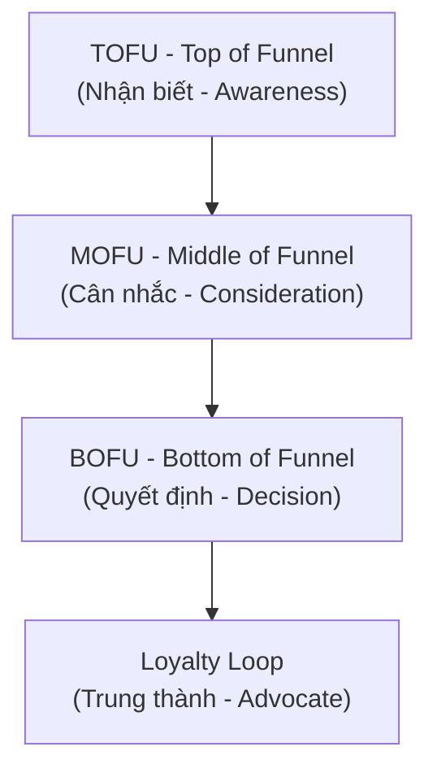
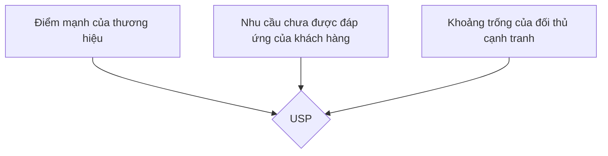
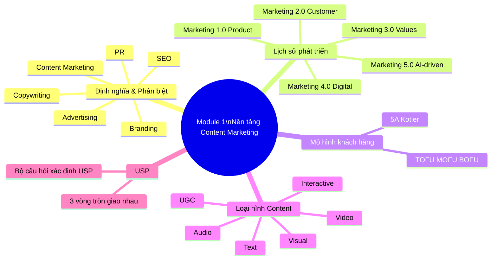

# MODULE 1: NỀN TẢNG CONTENT MARKETING CƠ BẢN
## (Buổi học 1 - 2 | Thời lượng: 6 giờ)

---

## 1. MỤC TIÊU HỌC TẬP

Sau khi hoàn thành Module 1, học viên có thể:

- Phát biểu chính xác định nghĩa Content Marketing theo chuẩn quốc tế (Content Marketing Institute) và giải thích bằng ví dụ Việt Nam.
- Phân biệt rạch ròi Content Marketing với 5 khái niệm dễ nhầm lẫn: Copywriting, Advertising, PR, Branding, SEO.
- Trình bày được lịch sử phát triển và xu hướng Marketing 1.0 → 5.0, vai trò của content trong từng giai đoạn.
- Xác định được các loại hình content phổ biến và ưu-nhược điểm của từng loại.
- Phân tích được vai trò của content trong phễu marketing (Marketing Funnel) và hành trình khách hàng.
- Xác định USP (Unique Selling Point) và bối cảnh thị trường cho một thương hiệu cụ thể (bước đầu của đồ án cá nhân).

---

## 2. NỘI DUNG LÝ THUYẾT CHI TIẾT

### 2.1. Content Marketing là gì?

**Định nghĩa chuẩn (Content Marketing Institute — CMI):**

> "Content Marketing là một phương pháp tiếp thị chiến lược tập trung vào việc tạo ra và phân phối nội dung có giá trị, liên quan và nhất quán để thu hút và giữ chân một đối tượng khán giả được xác định rõ ràng — và cuối cùng, thúc đẩy hành động sinh lời của khách hàng."

**Diễn giải theo 4 từ khóa cốt lõi:**

1. **Chiến lược (Strategic)**: Không phải viết ngẫu hứng, mà có mục tiêu, kế hoạch rõ ràng gắn với mục tiêu kinh doanh.
2. **Giá trị (Valuable)**: Nội dung phải giải quyết vấn đề, giải trí, hoặc giáo dục người đọc — không chỉ nói về sản phẩm.
3. **Nhất quán (Consistent)**: Xuất bản đều đặn, giữ giọng điệu (tone) và thông điệp thống nhất theo thời gian.
4. **Đối tượng xác định (Defined Audience)**: Nội dung nhắm đến một nhóm khách hàng cụ thể, không phải "viết cho tất cả mọi người".

**Ví dụ thực tế tại Việt Nam:**

- **Vinamilk** với chuỗi nội dung "Quỹ sữa vươn cao Việt Nam" — không bán sữa trực tiếp mà xây dựng câu chuyện trách nhiệm xã hội, tạo thiện cảm thương hiệu.
- **Highlands Coffee** với series nội dung về "văn hóa cà phê Việt" trên fanpage — không chỉ đăng giá khuyến mãi mà kể chuyện về hạt cà phê Robusta, thói quen "cà phê vỉa hè".
- **MoMo** với chuỗi content giáo dục tài chính cá nhân (Money Lover, tips tiết kiệm) giúp người dùng trẻ hiểu về quản lý tài chính, gián tiếp tăng lòng tin vào ví điện tử.

### 2.2. Phân biệt Content Marketing với các khái niệm liên quan

| Khái niệm | Định nghĩa | Điểm khác biệt với Content Marketing |
|---|---|---|
| **Copywriting** | Kỹ thuật viết chữ nhằm thúc đẩy hành động mua hàng ngay lập tức (ví dụ: quảng cáo, landing page) | Copywriting là **kỹ năng viết**, Content Marketing là **chiến lược tổng thể**. Copywriting phục vụ chuyển đổi ngắn hạn; Content Marketing xây dựng mối quan hệ dài hạn |
| **Advertising (Quảng cáo)** | Trả tiền để hiển thị thông điệp bán hàng trực tiếp | Advertising là "one-way push" (đẩy thông điệp), gián đoạn trải nghiệm người dùng. Content Marketing là "pull" (kéo khách hàng đến), mang lại giá trị trước khi bán hàng |
| **PR (Public Relations)** | Quản lý hình ảnh, quan hệ với truyền thông và công chúng | PR tập trung vào uy tín, xử lý khủng hoảng, quan hệ báo chí. Content Marketing tập trung vào việc tạo tài sản nội dung sở hữu bởi thương hiệu (owned media) |
| **Branding** | Xây dựng nhận diện, giá trị cốt lõi, cá tính thương hiệu | Branding là "thương hiệu là ai", Content Marketing là "cách thương hiệu giao tiếp với khách hàng qua nội dung" — Content là công cụ để thể hiện Branding |
| **SEO** | Tối ưu hóa để xuất hiện trên công cụ tìm kiếm | SEO là kênh phân phối và kỹ thuật, Content Marketing là nội dung cốt lõi được tối ưu bởi SEO. "Content is the fuel, SEO is the vehicle" |

### 2.3. Lịch sử phát triển: Marketing 1.0 → 5.0 và vai trò của Content

| Giai đoạn | Trọng tâm | Vai trò của Content |
|---|---|---|
| **Marketing 1.0** (Product-centric, thập niên 1950-1960) | Bán sản phẩm, tập trung vào tính năng | Nội dung là thông tin sản phẩm, catalogue, quảng cáo một chiều |
| **Marketing 2.0** (Customer-centric, 1970-1990) | Thỏa mãn nhu cầu khách hàng, phân khúc thị trường | Nội dung bắt đầu cá nhân hóa theo phân khúc (demographic, psychographic) |
| **Marketing 3.0** (Human-centric/Values-driven, 2000s) | Giá trị, sứ mệnh, tác động xã hội | Nội dung kể câu chuyện thương hiệu gắn với giá trị nhân văn, CSR |
| **Marketing 4.0** (Digital, Omnichannel, 2010s-nay) | Kết hợp online-offline, khách hàng là người đồng sáng tạo | Content trở thành trung tâm chiến lược, đa kênh (omnichannel), UGC (User Generated Content) bùng nổ |
| **Marketing 5.0** (Technology-driven, AI, 2021-nay) | Kết hợp công nghệ (AI, Big Data, IoT) để phục vụ con người | Content được cá nhân hóa bằng AI theo thời gian thực, Predictive Content, Agentic AI tự động sản xuất và phân phối nội dung |

**Điểm quan trọng cho học viên**: Chương trình này huấn luyện tư duy Content Marketing **4.0 tiến tới 5.0** — nghĩa là không chỉ biết viết mà phải biết kết hợp dữ liệu và công nghệ AI để tối ưu hiệu quả.

### 2.4. Mô hình 5A của Philip Kotler và vai trò Content trong từng giai đoạn

Mô hình 5A thay thế cho phễu AIDA truyền thống trong bối cảnh khách hàng có tính kết nối cao (connected customers):

| Giai đoạn | Mô tả | Loại Content phù hợp |
|---|---|---|
| **Aware (Nhận biết)** | Khách hàng biết đến thương hiệu một cách thụ động qua quảng cáo, truyền miệng, mạng xã hội | Video viral, bài viết giải trí, content trending, KOL review |
| **Appeal (Thu hút/Ấn tượng)** | Khách hàng ấn tượng và bắt đầu ghi nhớ thương hiệu | Storytelling, content giá trị (how-to, tips), so sánh sản phẩm |
| **Ask (Hỏi/Tìm hiểu)** | Khách hàng chủ động tìm hiểu thêm qua bạn bè, mạng xã hội, tìm kiếm Google | Bài blog chuyên sâu, FAQ, review, so sánh chi tiết, website chuẩn SEO |
| **Act (Hành động)** | Khách hàng quyết định mua và trải nghiệm | Landing page, ưu đãi, hướng dẫn sử dụng, chăm sóc khách hàng |
| **Advocate (Ủng hộ)** | Khách hàng hài lòng và giới thiệu cho người khác | UGC, chương trình giới thiệu bạn bè, testimonial, cộng đồng khách hàng |

### 2.5. Marketing Funnel (Phễu Marketing) và Content Mapping

Phễu marketing truyền thống được chia làm 3 tầng: **TOFU – MOFU – BOFU**



| Tầng phễu | Mục tiêu | Loại Content | Chỉ số đo lường (KPI) |
|---|---|---|---|
| **TOFU** | Thu hút lượng lớn người biết đến thương hiệu | Bài blog giải trí/giáo dục, video ngắn, infographic, social post viral | Reach, Impressions, Traffic, Follow mới |
| **MOFU** | Nuôi dưỡng, xây dựng niềm tin, cung cấp giải pháp | Ebook, Case study, Webinar, Email nurturing, so sánh sản phẩm, review chuyên sâu | Lead, Email subscribe, Time on page, Download |
| **BOFU** | Thúc đẩy quyết định mua hàng | Landing page, demo sản phẩm, testimonial, ưu đãi giới hạn, FAQ | Conversion rate, CTR, Sales, Add to cart |
| **Loyalty** | Giữ chân và biến khách hàng thành người ủng hộ | Content chăm sóc sau bán, chương trình khách hàng thân thiết, UGC | Retention rate, NPS, Referral rate |

### 2.6. Các loại hình Content phổ biến (Content Format Taxonomy)

| Nhóm | Định dạng cụ thể | Kênh phù hợp | Ưu điểm | Nhược điểm |
|---|---|---|---|---|
| **Văn bản (Text)** | Bài blog, bài SEO, ebook, whitepaper, email | Website, LinkedIn, Email | Chi phí thấp, dễ SEO, chuyên sâu | Cần thời gian đọc, khó viral nhanh |
| **Hình ảnh (Visual)** | Infographic, carousel, ảnh sản phẩm, meme | Instagram, Facebook, Pinterest | Dễ tiếp cận, chia sẻ nhanh | Truyền tải thông tin hạn chế |
| **Video** | Video ngắn (Reels/TikTok/Shorts), video dài (YouTube), livestream | TikTok, YouTube, Facebook | Tương tác cao, dễ viral, giữ chân người xem lâu | Chi phí sản xuất cao hơn, cần kỹ năng dựng |
| **Âm thanh (Audio)** | Podcast, audio ads | Spotify, Apple Podcast | Tiếp cận khi đa nhiệm (lái xe, tập gym) | Kén người nghe tại Việt Nam, khó đo lường |
| **Tương tác (Interactive)** | Quiz, khảo sát, minigame, AR filter | Website, Instagram, TikTok | Tăng tương tác, thu thập dữ liệu | Cần đầu tư kỹ thuật |
| **UGC (User Generated Content)** | Review khách hàng, unboxing, hashtag challenge | TikTok, Instagram, Shopee/Lazada review | Độ tin cậy cao, chi phí thấp | Khó kiểm soát chất lượng và thông điệp |
| **Livestream/Shoppertainment** | Livestream bán hàng, gameshow trực tuyến | TikTok Shop, Facebook Live, Shopee Live | Chuyển đổi tức thì, tương tác 2 chiều | Đòi hỏi kỹ năng dẫn dắt, đầu tư thời gian liên tục |

### 2.7. Xác định USP (Unique Selling Point) — Bước khởi đầu chiến lược Content

USP là "lý do khách hàng chọn bạn thay vì đối thủ". Không có USP rõ ràng, content sẽ chung chung và không tạo được khác biệt.

**Công thức xác định USP — mô hình 3 vòng tròn giao nhau:**



**Bộ câu hỏi giúp xác định USP:**
1. Sản phẩm/dịch vụ của bạn giải quyết vấn đề gì mà đối thủ chưa giải quyết tốt?
2. Khách hàng hiện tại khen bạn nhiều nhất ở điểm nào? (dựa vào review thực tế)
3. Nếu bỏ giá cả ra khỏi cuộc chơi, khách hàng chọn bạn vì lý do gì?
4. Điều gì bạn có thể nói mà đối thủ KHÔNG THỂ nói (vì không có/không dám cam kết)?

**Ví dụ USP thực tế:**
- **Katinat**: "Cà phê phong cách sống" — không chỉ bán đồ uống mà bán trải nghiệm không gian sống ảo, chụp ảnh đẹp.
- **Biti's Hunter**: "Đi để trở về" — không chỉ bán giày mà bán câu chuyện về hành trình tuổi trẻ, kết nối cảm xúc gia đình.
- **The Coffee House**: " Giao diện app tiện lợi, đặt trước lấy ngay" — USP về công nghệ trải nghiệm khi ngành F&B còn ít ai làm tốt app riêng.

### 2.8. Golden Circle (Vòng tròn vàng) của Simon Sinek — Why-How-What

Đây là mô hình bổ trợ cực kỳ hữu ích khi xây dựng thông điệp cốt lõi cho Content Marketing, đi kèm với USP đã học ở trên.

**Nguyên lý cốt lõi**: Hầu hết thương hiệu giao tiếp từ ngoài vào trong (What → How → Why): "Chúng tôi bán gì → Chúng tôi làm như thế nào → Tại sao chúng tôi làm điều đó". Nhưng những thương hiệu truyền cảm hứng mạnh nhất lại giao tiếp từ trong ra ngoài (Why → How → What):

| Vòng tròn | Câu hỏi | Ví dụ |
|---|---|---|
| **Why (Tại sao)** | Tại sao thương hiệu tồn tại? Niềm tin cốt lõi là gì? | "Chúng tôi tin rằng mọi người Việt đều xứng đáng được uống cà phê nguyên chất, không pha tạp chất" |
| **How (Làm thế nào)** | Thương hiệu thực hiện niềm tin đó bằng cách nào? | "Chúng tôi trực tiếp làm việc với nông dân, kiểm soát quy trình rang xay minh bạch" |
| **What (Cái gì)** | Sản phẩm/dịch vụ cụ thể là gì? | "Cà phê rang xay nguyên chất 100% Robusta Đắk Lắk" |

**Ứng dụng vào Content Marketing**: Khi xây dựng Content Pillar (sẽ học ở Module 2), pillar về "Why" (giá trị/niềm tin thương hiệu) thường tạo kết nối cảm xúc mạnh nhất và nên được ưu tiên xuất hiện trong Hero Content, trong khi "What" (thông tin sản phẩm) phù hợp hơn với Hygiene Content ở tầng BOFU.

### 2.9. Nền kinh tế chú ý (Attention Economy) — Vì sao Content phải cạnh tranh khốc liệt

Một người dùng trung bình tiếp xúc với hàng nghìn thông điệp quảng cáo/nội dung mỗi ngày, nhưng khả năng chú ý (attention) của con người là hữu hạn. Điều này tạo ra khái niệm "Attention Economy" — nơi sự chú ý của người dùng trở thành tài nguyên khan hiếm và có giá trị nhất mà mọi thương hiệu phải cạnh tranh để giành lấy.

**Hệ quả đối với Content Marketer:**
1. Nội dung phải tạo giá trị **ngay lập tức** (trong vài giây đầu) hoặc sẽ bị lướt qua.
2. Số lượng nội dung không quan trọng bằng chất lượng và mức độ liên quan (relevance) đến đúng đối tượng.
3. Cần liên tục đổi mới định dạng/cách kể chuyện để tránh "mù quảng cáo" (banner blindness) — hiện tượng người dùng vô thức bỏ qua nội dung có dạng thức quảng cáo quen thuộc.

### 2.10. Lỗi thường gặp của người mới bắt đầu làm Content Marketing

| Lỗi thường gặp | Hậu quả | Cách khắc phục |
|---|---|---|
| Viết theo cảm tính, không có persona rõ ràng | Nội dung chung chung, không ai cảm thấy "được nói đến" | Luôn viết cho 1 Persona cụ thể (học ở Module 2) |
| Chỉ tập trung quảng cáo bán hàng (100% BOFU) | Follower cảm thấy bị làm phiền, tỷ lệ unfollow cao | Cân bằng theo mô hình 3H và phễu TOFU-MOFU-BOFU |
| Sao chép nội dung đối thủ | Mất bản sắc thương hiệu, vi phạm bản quyền tiềm ẩn | Luôn có góc nhìn/trải nghiệm riêng khi tham khảo đối thủ |
| Không đo lường, chỉ đăng theo cảm tính | Không biết nội dung nào hiệu quả để nhân rộng | Thiết lập KPI ngay từ đầu (học chi tiết ở Module 5) |
| Đăng không đều đặn, thiếu kế hoạch | Mất đà tương tác, thuật toán giảm ưu tiên phân phối | Xây dựng Content Calendar (học ở Module 2) |
| Nhầm lẫn Content Marketing với "đi seeding/spam" | Gây phản cảm, ảnh hưởng uy tín thương hiệu | Hiểu đúng bản chất "tạo giá trị trước" đã học ở mục 2.1 |

---

## 3. PHÂN TÍCH CASE STUDY THỰC TIỄN

### Case Study 1: Biti's Hunter — "Đi Để Trở Về" (2017-2019)

**Bối cảnh**: Biti's là thương hiệu giày Việt Nam lâu đời nhưng bị xem là "quê mùa", mất thị phần vào tay Nike, Adidas, các brand giày ngoại nhập trong giới trẻ.

**Chiến lược Content:**
- Hợp tác với ca sĩ Soobin Hoàng Sơn, Sơn Tùng M-TP ra MV "Lạc Trôi", "Đi Để Trở Về" lồng ghép sản phẩm một cách tự nhiên (Product Placement + Storytelling).
- Nội dung không nói về "giày tốt, bền, đẹp" mà kể câu chuyện tuổi trẻ đi xa, và tình cảm gia đình khi trở về — đánh trúng insight của Gen Z: muốn đi khám phá nhưng vẫn trân trọng gia đình.
- Kết hợp đa kênh: MV trên YouTube, teaser trên Facebook, KOL mặc sản phẩm, hashtag challenge trên mạng xã hội.

**Kết quả:**
- MV đạt hàng chục triệu lượt xem, trở thành hiện tượng mạng xã hội dịp Tết.
- Biti's Hunter "lột xác" hình ảnh, trở thành thương hiệu giày được giới trẻ yêu thích, cháy hàng nhiều mẫu.

**Bài học rút ra cho học viên:**
1. Content không nhất thiết phải nói trực tiếp về sản phẩm — kể đúng câu chuyện chạm insight còn hiệu quả hơn.
2. Sự nhất quán về thời điểm (dịp Tết — mùa đoàn viên) khuếch đại thông điệp.
3. Kết hợp KOL/Influencer đúng đối tượng mục tiêu (Gen Z) giúp lan tỏa tự nhiên.

### Case Study 2: MoMo — Content Giáo Dục Tài Chính Cá Nhân

**Bối cảnh**: Ví điện tử là sản phẩm công nghệ tài chính (Fintech), khó giải thích và cần xây dựng niềm tin về bảo mật, tiện ích.

**Chiến lược Content:**
- Xây dựng series nội dung giáo dục: "Mẹo tiết kiệm", "Quản lý chi tiêu mùa dịch", lồng ghép tính năng ví MoMo một cách tự nhiên.
- Chiến dịch "Lắc Xì" vào dịp Tết — gamification kết hợp phát lì xì, tăng tương tác và tải app.
- Content phù hợp với insight người dùng trẻ: muốn tiết kiệm nhưng chưa biết cách, muốn nhận lì xì online vui nhộn dịp Tết.

**Kết quả:**
- Chiến dịch Lắc Xì thu hút hàng triệu lượt tham gia mỗi mùa Tết, tăng mạnh số người dùng mới.
- MoMo xây dựng được hình ảnh thân thiện, gắn liền với văn hóa Tết Việt Nam.

**Bài học rút ra:**
1. Nội dung giáo dục (educational content) xây dựng niềm tin hiệu quả hơn quảng cáo trực tiếp với sản phẩm tài chính.
2. Gamification (trò chơi hóa) kết hợp với văn hóa bản địa tạo hiệu ứng lan truyền tự nhiên.
3. Content mùa vụ (seasonal content) tận dụng thời điểm vàng để tối đa hiệu quả.

### Case Study 3: Local Brand thất bại — Bài học từ thương hiệu "chỉ bán hàng"

**Bối cảnh giả định phân tích trên lớp**: Một shop thời trang online chỉ đăng ảnh sản phẩm kèm giá, không có content giá trị, không có câu chuyện thương hiệu.

**Vấn đề:**
- Fanpage có 50,000 follow nhưng tương tác mỗi bài chỉ 5-10 like.
- Khách hàng chỉ nhớ "shop bán rẻ" chứ không nhớ tên thương hiệu.
- Không xây dựng được tệp khách hàng trung thành, phải liên tục chạy quảng cáo giảm giá để có đơn hàng.

**Phân tích nguyên nhân (thảo luận nhóm trên lớp):**
- Thiếu Buyer Persona rõ ràng → nội dung chung chung.
- Không có Content Pillar → nội dung rời rạc, không nhất quán.
- Chỉ tập trung BOFU (bán hàng) mà bỏ qua TOFU-MOFU (xây dựng nhận biết và niềm tin).

**Bài tập nhóm**: Đề xuất 3 giải pháp cải thiện chiến lược content cho case study này (áp dụng framework 5A và phễu TOFU-MOFU-BOFU vừa học).

### Case Study 4: Katinat — Xây dựng USP bằng trải nghiệm không gian thay vì chỉ đồ uống

**Bối cảnh**: Thị trường trà/cà phê tại Việt Nam vô cùng cạnh tranh với hàng trăm thương hiệu (Highlands, Phúc Long, The Coffee House, Trung Nguyên Legend...), rất khó tạo khác biệt chỉ bằng chất lượng đồ uống.

**Chiến lược Content:**
- Katinat xây dựng USP không chỉ dựa trên hương vị mà dựa trên "không gian sống ảo" — thiết kế quán đẹp, góc chụp ảnh check-in, tạo nội dung UGC tự nhiên từ chính khách hàng đăng story/Instagram.
- Content chủ động dẫn dắt xu hướng "cà phê phong cách sống" (lifestyle coffee) thay vì chỉ quảng bá khuyến mãi giá.
- Tận dụng KOL/Influencer trẻ chụp ảnh tại quán, tạo hiệu ứng lan tỏa tự nhiên trên mạng xã hội mà không cần chi phí quảng cáo trực tiếp lớn.

**Kết quả**: Katinat mở rộng nhanh chóng, trở thành điểm đến quen thuộc của giới trẻ dù giá không rẻ hơn đối thủ, nhờ tạo được trải nghiệm khác biệt rõ rệt.

**Bài học rút ra**: USP không nhất thiết phải nằm ở chính sản phẩm cốt lõi — đôi khi nằm ở trải nghiệm xung quanh sản phẩm (không gian, cảm xúc, khả năng chia sẻ trên mạng xã hội). Đây cũng là minh chứng cho khái niệm UGC và Attention Economy đã học ở mục 2.9: nội dung do khách hàng tự tạo có sức lan tỏa tự nhiên mạnh hơn quảng cáo trả phí.

---

## 4. TỔNG KẾT MODULE 1

### 4.1. Tóm tắt kiến thức cốt lõi

1. Content Marketing là chiến lược tạo giá trị dài hạn, khác biệt với Copywriting/Advertising/PR/Branding/SEO nhưng có mối liên hệ mật thiết với tất cả.
2. Marketing đã tiến hóa qua 5 giai đoạn (1.0 → 5.0), và Content ngày càng trở thành trung tâm, được khuếch đại bởi công nghệ và AI.
3. Mô hình 5A (Aware-Appeal-Ask-Act-Advocate) giúp xác định loại content phù hợp với từng giai đoạn nhận thức của khách hàng.
4. Phễu Marketing TOFU-MOFU-BOFU là công cụ thực chiến để phân bổ ngân sách và nội dung hợp lý.
5. USP là nền tảng để mọi nội dung sau này "nói đúng, nói trúng" thay vì chung chung.

### 4.2. Bộ Keyword cần ghi nhớ (Ôn tập nhanh)

`Content Marketing` • `Copywriting` • `Advertising` • `PR` • `Branding` • `SEO` • `Marketing 1.0-5.0` • `Mô hình 5A` • `Aware-Appeal-Ask-Act-Advocate` • `Marketing Funnel` • `TOFU-MOFU-BOFU` • `Owned Media` • `Earned Media` • `Paid Media` • `USP (Unique Selling Point)` • `CSR (Corporate Social Responsibility)` • `UGC (User Generated Content)` • `Shoppertainment` • `Gamification` • `Insight khách hàng`

### 4.3. Sơ đồ tư duy tổng kết Module 1



---

## 5. BÀI TẬP THỰC HÀNH (Buổi 1-2)

### Bài tập 1 (Cá nhân — làm tại lớp, 20 phút)

Chọn 3 fanpage/thương hiệu bạn theo dõi trên mạng xã hội. Với mỗi thương hiệu, xác định:
- Đây là Content Marketing, Advertising, hay chỉ đơn thuần là "đăng bán hàng"? Giải thích tại sao.
- Thương hiệu đang ở giai đoạn nào trong mô hình 5A đối với bạn (là một khách hàng)?

### Bài tập 2 (Cá nhân — về nhà)

Chọn thương hiệu/sản phẩm sẽ dùng xuyên suốt khóa học (đây sẽ là đồ án cá nhân). Yêu cầu:
1. Mô tả ngắn gọn sản phẩm/dịch vụ (tối đa 200 từ).
2. Liệt kê 3 đối thủ cạnh tranh trực tiếp.
3. Áp dụng mô hình "3 vòng tròn giao nhau" để xác định USP của thương hiệu (tối thiểu 3 gạch đầu dòng phân tích).
4. Xác định thương hiệu đang thiên về loại hình content nào (Text/Visual/Video/Audio) và đánh giá mức độ phù hợp.

**Tiêu chí chấm điểm (Rubric nhanh):**

| Tiêu chí | Điểm tối đa |
|---|---|
| Mô tả sản phẩm rõ ràng, đủ thông tin | 2 điểm |
| Xác định đúng 3 đối thủ cạnh tranh thực tế | 2 điểm |
| USP có căn cứ logic, không chung chung | 4 điểm |
| Đánh giá loại hình content hợp lý, có dẫn chứng | 2 điểm |
| **Tổng** | **10 điểm** |

### Bài tập 3 (Nhóm — thảo luận tại lớp, 30 phút)

Phân tích Case Study 3 (thương hiệu thất bại) đã trình bày ở trên. Mỗi nhóm 4-5 người đề xuất:
- 3 nguyên nhân chính khiến content không hiệu quả (áp dụng khung lý thuyết đã học).
- 3 giải pháp cụ thể áp dụng mô hình 5A và phễu TOFU-MOFU-BOFU.

Trình bày 3 phút/nhóm, giảng viên nhận xét trực tiếp.

### Bài tập 4 (Về nhà — chuẩn bị cho Module 2)

Thu thập tối thiểu 10 bình luận/review thực tế của khách hàng (trên fanpage, Shopee, Google Maps...) về thương hiệu đã chọn hoặc đối thủ. Đây sẽ là dữ liệu đầu vào để xây dựng Buyer Persona ở Module 2.
### Bài tập 5 (Cá nhân — mở rộng, không bắt buộc nộp nhưng khuyến khích thực hiện)

Viết thông điệp Golden Circle (Why-How-What) cho thương hiệu đồ án cá nhân, mỗi vòng tròn tối đa 2 câu. So sánh với USP đã xác định ở Bài tập 2 — kiểm tra xem 2 công cụ này có nhất quán/bổ trợ cho nhau không.

**Gợi ý cách trình bày bài tập 5:**

```
WHY (Niềm tin cốt lõi): ___________________________
HOW (Cách thực hiện niềm tin đó): ___________________________
WHAT (Sản phẩm/dịch vụ cụ thể): ___________________________
```
---

## 6. CÂU HỎI TỰ ĐÁNH GIÁ NHANH (Self-Check Quiz — 10 câu)

1. Content Marketing khác Advertising ở điểm cốt lõi nào?
2. Nêu 4 từ khóa trong định nghĩa Content Marketing theo CMI.
3. Marketing 4.0 khác Marketing 3.0 ở điểm gì?
4. Mô hình 5A gồm những giai đoạn nào? Sắp xếp đúng thứ tự.
5. TOFU là viết tắt của gì? Loại content nào phù hợp với TOFU?
6. Nêu 3 ví dụ về UGC (User Generated Content).
7. USP được xác định dựa trên giao điểm của 3 yếu tố nào?
8. Vì sao chiến dịch "Đi Để Trở Về" của Biti's được xem là thành công về mặt Content Marketing?
9. Owned Media, Earned Media, Paid Media khác nhau như thế nào? Cho ví dụ mỗi loại.
10. Tại sao một fanpage 50,000 follow vẫn có thể thất bại về mặt Content Marketing?
11. Mô hình Golden Circle của Simon Sinek gồm 3 vòng tròn nào? Vòng nào nên được ưu tiên giao tiếp trước tiên để tạo cảm xúc mạnh nhất?
12. Attention Economy là gì? Nêu 2 hệ quả của khái niệm này đối với cách content marketer cần thiết kế nội dung.
13. Nêu 3 lỗi thường gặp của người mới bắt đầu làm Content Marketing và cách khắc phục tương ứng.
14. Vì sao USP của Katinat được xem là dựa trên "trải nghiệm" thay vì chỉ dựa trên chất lượng đồ uống? Phân tích liên hệ với khái niệm UGC.
15. "Banner blindness" là gì? Hiện tượng này liên quan như thế nào đến Attention Economy?

*(Đáp án và thang điểm chi tiết cho các câu hỏi này được tổng hợp tại file [08-NGAN-HANG-CAU-HOI-DANH-GIA.md](08-NGAN-HANG-CAU-HOI-DANH-GIA.md), mục "Module 1".)*

---

## 7. KIẾN THỨC BỔ SUNG CẦN ĐỌC THÊM (Extended Reading)

Để nắm vững Module 1, học viên nên tự nghiên cứu thêm các chủ đề sau (tài liệu tham khảo chi tiết tại file 09):

- Sách "Marketing 4.0: Moving from Traditional to Digital" — Philip Kotler, Hermawan Kartajaya, Iwan Setiawan.
- Sách "Content Inc." — Joe Pulizzi (người sáng lập Content Marketing Institute).
- Báo cáo "Vietnam Digital Report" hàng năm của We Are Social/Hootsuite để cập nhật hành vi người dùng số tại Việt Nam.
- Khái niệm "Zero Moment of Truth (ZMOT)" của Google — thời điểm khách hàng tìm kiếm thông tin trước khi quyết định mua.
- Khái niệm "Attention Economy" (Nền kinh tế chú ý) — vì sao content phải cạnh tranh để giành sự chú ý hữu hạn của người dùng.
- Sách "Start with Why" — Simon Sinek (nguồn gốc mô hình Golden Circle).
- Bài viết/nghiên cứu về "Banner Blindness" (Nielsen Norman Group) — hiện tượng người dùng vô thức bỏ qua nội dung dạng quảng cáo quen thuộc.
- Khái niệm "Filter Bubble" và "Algorithm Bias" — hiểu thêm về cách thuật toán mạng xã hội định hình những gì người dùng nhìn thấy, ảnh hưởng đến chiến lược phân phối nội dung.

### Bài tập mở rộng tự học (không bắt buộc, dành cho học viên muốn đào sâu)

1. Viết lại thông điệp Golden Circle (Why-How-What) cho thương hiệu đồ án cá nhân của bạn — mỗi vòng tròn tối đa 2 câu.
2. Quan sát newsfeed cá nhân trong 1 ngày, ghi lại 5 nội dung bạn chú ý nhất và 5 nội dung bạn lướt qua ngay lập tức. Phân tích điểm khác biệt giữa 2 nhóm này dựa trên khái niệm Attention Economy.
3. Tìm 1 ví dụ thực tế khác (ngoài Katinat) về thương hiệu xây dựng USP dựa trên trải nghiệm thay vì sản phẩm cốt lõi.

---

## 8. LƯU Ý CHO GIẢNG VIÊN (Instructor Notes)

- Buổi 1 nên dành 15 phút đầu để khảo sát nhanh học viên: "Bạn nghĩ Content Marketing là gì?" — ghi nhận các câu trả lời sai phổ biến (thường nhầm với Copywriting hoặc chỉ nghĩ là "viết bài seeding") để làm ví dụ phản biện trong bài giảng.
- Nên chuẩn bị sẵn 5-6 ví dụ fanpage thực tế (có thể mở trực tiếp trên lớp) để học viên thấy trực quan sự khác biệt giữa Content Marketing thực thụ và "đăng bài bán hàng".
- Với học viên trái ngành (không có nền tảng marketing), nên dành thêm 15-20 phút giải thích khái niệm phễu marketing bằng ví dụ đời thường (ví dụ: hành trình đi ăn nhà hàng — thấy quảng cáo, hỏi bạn bè, xem review, đặt bàn, quay lại lần sau).
- Bài tập 2 (xác định USP) là bài tập quan trọng nhất, cần giảng viên chấm và phản hồi kỹ vì đây là nền tảng cho toàn bộ đồ án các module sau. Nếu USP sai/mơ hồ ngay từ đầu, toàn bộ chiến lược ở các module sau sẽ lệch hướng.

---

## 9. VÍ DỤ THỰC HÀNH MẪU HOÀN CHỈNH (WORKED EXAMPLE) — ÁP DỤNG TOÀN BỘ MODULE 1

Để học viên hình dung rõ cách áp dụng toàn bộ kiến thức Module 1 vào 1 thương hiệu cụ thể, dưới đây là ví dụ mẫu hoàn chỉnh (học viên có thể dùng làm khuôn tham chiếu khi làm Bài tập 2):

**Thương hiệu giả định**: "Xanh Garden" — cửa hàng rau củ quả hữu cơ giao tận nhà tại khu vực đô thị.

**Bước 1 — Mô tả sản phẩm/dịch vụ:**
> Xanh Garden cung cấp rau củ quả hữu cơ (organic) được trồng theo tiêu chuẩn VietGAP, giao hàng tận nhà trong vòng 4 giờ tại khu vực nội thành. Đối tượng khách hàng chính là các gia đình có con nhỏ quan tâm đến an toàn thực phẩm.

**Bước 2 — Liệt kê 3 đối thủ cạnh tranh:**
1. Các cửa hàng thực phẩm sạch truyền thống (WinMart, Bác Tôm...)
2. Các sàn thương mại điện tử giao thực phẩm tươi sống (đối thủ gián tiếp)
3. Chợ truyền thống/siêu thị gần nhà (đối thủ về thói quen mua sắm)

**Bước 3 — Xác định USP theo mô hình 3 vòng tròn giao nhau:**
- Điểm mạnh: Có chứng nhận VietGAP minh bạch, truy xuất nguồn gốc từng lô hàng qua QR code.
- Nhu cầu khách hàng: Phụ huynh lo lắng về dư lượng thuốc trừ sâu nhưng không có thời gian đi chợ chọn lựa kỹ.
- Khoảng trống đối thủ: Các đối thủ hiện tại chưa minh bạch hóa quy trình truy xuất nguồn gốc theo thời gian thực.
- **USP kết luận**: "Rau củ hữu cơ minh bạch từng lô hàng — quét mã là biết nguồn gốc, giao tận nhà trong 4 giờ."

**Bước 4 — Áp dụng Golden Circle:**
```
WHY: Chúng tôi tin rằng mọi gia đình Việt xứng đáng được ăn thực phẩm sạch một cách minh bạch, không phải "tin vào lời hứa suông".
HOW: Chúng tôi hợp tác trực tiếp với nông trại VietGAP, gắn mã QR truy xuất nguồn gốc cho từng lô rau, kiểm định định kỳ.
WHAT: Dịch vụ rau củ quả hữu cơ giao tận nhà trong 4 giờ, có truy xuất nguồn gốc minh bạch qua app.
```

**Bước 5 — Áp dụng mô hình 5A (định vị khách hàng đang ở giai đoạn nào):**
- Nếu khách hàng mới thấy quảng cáo lần đầu → đang ở giai đoạn **Aware**.
- Nếu khách hàng đã xem video "Cách nhận biết rau ngậm hóa chất" và ấn tượng → đang ở giai đoạn **Appeal**.
- Nếu khách hàng lên Google tìm "rau hữu cơ giao tận nhà quận nào uy tín" → đang ở giai đoạn **Ask**.

**Bước 6 — Xác định loại hình Content phù hợp giai đoạn đầu:**
- TOFU: Video ngắn "3 dấu hiệu nhận biết rau ngậm hóa chất" (giáo dục, dễ viral).
- MOFU: Bài blog "So sánh rau hữu cơ VietGAP và rau thường: khác biệt nằm ở đâu?"
- BOFU: Trang giới thiệu dịch vụ kèm video demo quy trình quét mã QR truy xuất nguồn gốc thực tế.

**Nhận xét sư phạm**: Ví dụ này cho thấy toàn bộ Module 1 không phải các khái niệm rời rạc mà là một quy trình tư duy liền mạch — từ hiểu sản phẩm, xác định USP, đến định vị đúng loại nội dung theo giai đoạn nhận thức khách hàng. Học viên nên làm theo đúng trình tự 6 bước này khi thực hiện Bài tập 2 của mình.

---

## 10. BẢNG TỰ ĐÁNH GIÁ MỨC ĐỘ SẴN SÀNG CHUYỂN SANG MODULE 2

Trước khi chuyển sang Module 2, học viên tự đánh giá theo checklist sau (đánh dấu ✓ nếu tự tin đạt được):

- [ ] Tôi có thể giải thích Content Marketing cho một người chưa biết gì về marketing chỉ trong 2 câu.
- [ ] Tôi có thể chỉ ra ít nhất 1 ví dụ thực tế phân biệt Content Marketing với Advertising.
- [ ] Tôi đã xác định được USP cho thương hiệu đồ án cá nhân, có căn cứ logic rõ ràng (không chung chung).
- [ ] Tôi hiểu vì sao một bài đăng nhiều like chưa chắc là content hiệu quả.
- [ ] Tôi có thể xác định 1 khách hàng bất kỳ đang ở giai đoạn nào trong mô hình 5A.
- [ ] Tôi đã thu thập đủ tối thiểu 10 bình luận/review thực tế để chuẩn bị cho Module 2.

*Nếu có từ 2 mục trở lên chưa tự tin, học viên nên dành thêm thời gian ôn lại phần lý thuyết tương ứng hoặc trao đổi với giảng viên/trợ giảng trước khi bước sang Module 2, vì Module 2 sẽ xây dựng trực tiếp trên các khái niệm này.*

---

## 11. BẢNG PHÂN BIỆT NHANH 5 KHÁI NIỆM DỄ NHẦM LẪN (TRA CỨU NHANH)

Bảng dưới đây tổng hợp lại mục 2.2 dưới dạng dễ tra cứu nhanh khi làm bài tập, kèm câu hỏi tự kiểm tra cho từng cặp khái niệm:

| Cặp khái niệm dễ nhầm | Câu hỏi tự kiểm tra để phân biệt |
|---|---|
| Content Marketing vs Copywriting | "Nội dung này nhằm xây dựng niềm tin dài hạn hay thúc đẩy 1 hành động mua ngay?" |
| Content Marketing vs Advertising | "Người xem có chủ động tìm đến nội dung này hay bị nội dung này làm gián đoạn?" |
| Content Marketing vs PR | "Đây là nội dung do thương hiệu tự sản xuất và sở hữu, hay là tin tức được bên thứ ba viết về thương hiệu?" |
| Content Marketing vs Branding | "Đây là 'thương hiệu là ai' (giá trị cốt lõi) hay 'thương hiệu đang nói gì' (nội dung cụ thể)?" |
| Content Marketing vs SEO | "Đây là bản thân nội dung, hay là kỹ thuật giúp nội dung đó được tìm thấy?" |

**Bài tập tự kiểm tra nhanh (làm miệng tại lớp)**: Giảng viên đọc 5 tình huống ngẫu nhiên (ví dụ: "Một bài PR đăng trên báo Dân Trí về sự kiện ra mắt sản phẩm", "Một quảng cáo Facebook hiển thị giữa newsfeed", "Một bài blog hướng dẫn sử dụng sản phẩm trên website công ty"...), học viên giơ tay xác định đây thuộc khái niệm nào trong 6 khái niệm đã học.

## 12. TÀI NGUYÊN THAM KHẢO NHANH (QUICK REFERENCE CARD)

Học viên có thể in trang này riêng làm thẻ ghi nhớ nhanh (flashcard) mang theo trong quá trình thực hành:

```
✓ Định nghĩa CMI: Chiến lược - Giá trị - Nhất quán - Đối tượng xác định
✓ Mô hình 5A: Aware → Appeal → Ask → Act → Advocate
✓ Phễu: TOFU (Nhận biết) → MOFU (Cân nhắc) → BOFU (Quyết định)
✓ USP = Điểm mạnh ∩ Nhu cầu khách hàng ∩ Khoảng trống đối thủ
✓ Golden Circle: Why → How → What (giao tiếp từ trong ra ngoài)
✓ 3 loại Media: Owned (tự sở hữu) - Earned (lan tỏa tự nguyện) - Paid (trả phí)
```

### Bảng liên hệ Module 1 với các Module tiếp theo

| Khái niệm học ở Module 1 | Sẽ được sử dụng tiếp ở Module nào |
|---|---|
| USP, Golden Circle | Module 2 — làm nền tảng xác định Content Pillar |
| Mô hình 5A, TOFU-MOFU-BOFU | Module 2 — gắn vào Customer Journey Map; Module 4 — phân loại nội dung phân phối |
| Bình luận/review thu thập ở Bài tập 4 | Module 2 — dữ liệu đầu vào xây dựng Persona |
| Attention Economy, Banner Blindness | Module 3 — áp dụng khi thiết kế Hook mở đầu nội dung |
| Owned/Earned/Paid Media | Module 4 — phân tích kênh phân phối nội dung |

---

*(Hết Module 1. Tiếp tục với file 02-MODULE-2-CHIEN-LUOC-NOI-DUNG.md)*
