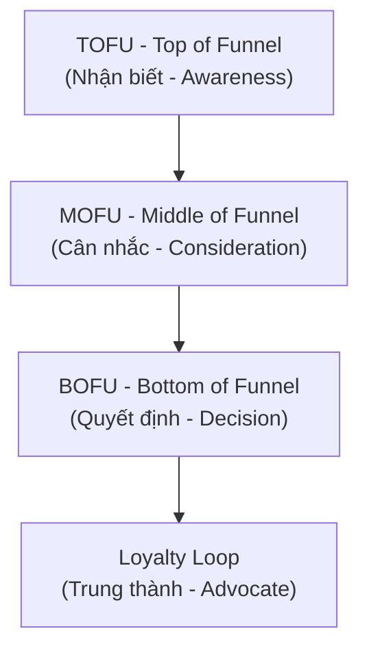
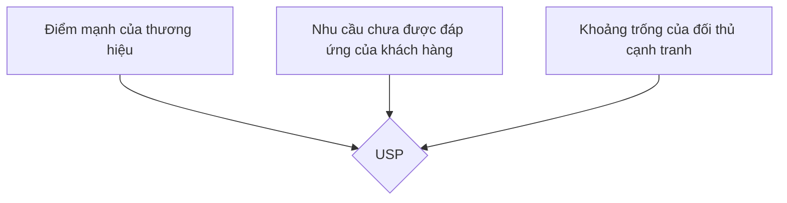
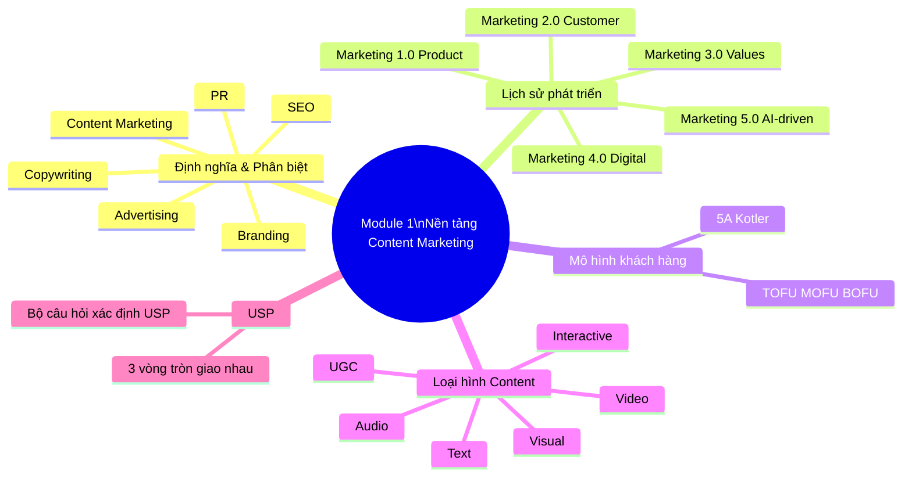

# MODULE 1: NỀN TẢNG CONTENT MARKETING CƠ BẢN
## (Buổi học 1 - 2 | Thời lượng: 6 giờ)

---

## 1. MỤC TIÊU HỌC TẬP

Sau khi hoàn thành Module 1, học viên có thể:

- Phát biểu chính xác định nghĩa Content Marketing theo chuẩn quốc tế (Content Marketing Institute) và giải thích bằng ví dụ Việt Nam.
- Phân biệt rạch ròi Content Marketing với 5 khái niệm dễ nhầm lẫn: Copywriting, Advertising, PR, Branding, SEO.
- Trình bày được lịch sử phát triển và xu hướng Marketing 1.0 → 5.0, vai trò của content trong từng giai đoạn.
- Xác định được các loại hình content phổ biến và ưu-nhược điểm của từng loại.
- Phân tích được vai trò của content trong phễu marketing (Marketing Funnel) và hành trình khách hàng.
- Xác định USP (Unique Selling Point) và bối cảnh thị trường cho một thương hiệu cụ thể (bước đầu của đồ án cá nhân).

---

## 2. NỘI DUNG LÝ THUYẾT CHI TIẾT

### 2.1. Content Marketing là gì?

**Định nghĩa chuẩn (Content Marketing Institute — CMI):**

> "Content Marketing là một phương pháp tiếp thị chiến lược tập trung vào việc tạo ra và phân phối nội dung có giá trị, liên quan và nhất quán để thu hút và giữ chân một đối tượng khán giả được xác định rõ ràng — và cuối cùng, thúc đẩy hành động sinh lời của khách hàng."

**Diễn giải theo 4 từ khóa cốt lõi:**

1. **Chiến lược (Strategic)**: Không phải viết ngẫu hứng, mà có mục tiêu, kế hoạch rõ ràng gắn với mục tiêu kinh doanh.
2. **Giá trị (Valuable)**: Nội dung phải giải quyết vấn đề, giải trí, hoặc giáo dục người đọc — không chỉ nói về sản phẩm.
3. **Nhất quán (Consistent)**: Xuất bản đều đặn, giữ giọng điệu (tone) và thông điệp thống nhất theo thời gian.
4. **Đối tượng xác định (Defined Audience)**: Nội dung nhắm đến một nhóm khách hàng cụ thể, không phải "viết cho tất cả mọi người".

**Ví dụ thực tế tại Việt Nam:**

- **Vinamilk** với chuỗi nội dung "Quỹ sữa vươn cao Việt Nam" — không bán sữa trực tiếp mà xây dựng câu chuyện trách nhiệm xã hội, tạo thiện cảm thương hiệu.
- **Highlands Coffee** với series nội dung về "văn hóa cà phê Việt" trên fanpage — không chỉ đăng giá khuyến mãi mà kể chuyện về hạt cà phê Robusta, thói quen "cà phê vỉa hè".
- **MoMo** với chuỗi content giáo dục tài chính cá nhân (Money Lover, tips tiết kiệm) giúp người dùng trẻ hiểu về quản lý tài chính, gián tiếp tăng lòng tin vào ví điện tử.

**Ví dụ thực tế từ Tôn Hoa Sen (Hoa Sen Group):**

Tôn Hoa Sen triển khai Content Marketing chiến lược bằng cách kết hợp giữa truyền thông trách nhiệm xã hội (CSR) và nội dung giáo dục thị trường, thay vì chỉ đơn thuần quảng cáo tính năng kỹ thuật của sản phẩm.

* **Chuỗi nội dung truyền thông CSR (tiêu biểu: Chương trình *"Lục Lạc Vàng"* và *"Hát Mãi Ước Mơ"*):**
* **Diễn giải:** Hoa Sen đồng hành và sản xuất nội dung xoay quanh các hoàn cảnh khó khăn, hỗ trợ người dân vùng sâu vùng xa dựng nhà, tạo kế sinh nhai.
* **Giá trị tạo ra:** Nội dung chạm đến cảm xúc, truyền tải tinh thần "Mái ấm gia đình Việt". Khách hàng thấy được trách nhiệm xã hội và sự nhân văn của doanh nghiệp, từ đó gia tăng tình cảm và niềm tin đối với thương hiệu.


* **Nội dung giáo dục & hướng dẫn kỹ thuật (Educational Content):**
* **Diễn giải:** Xây dựng các bài viết, video hướng dẫn cách phân biệt tôn thật - tôn giả, độ dày tiêu chuẩn, cách chọn vật liệu xây dựng bền vững cho từng vùng khí hậu (vùng biển, vùng bão).
* **Giá trị tạo ra:** Giải quyết đúng "điểm đau" (pain point) của chủ thầu và gia chủ là sợ mua phải hàng kém chất lượng. Bằng cách chia sẻ kiến thức chuyên môn, Hoa Sen khẳng định vị thế chuyên gia trong ngành tôn thép, gián tiếp thúc đẩy khách hàng quyết định chọn mua sản phẩm chính hãng.

**Ví dụ thực tế từ Vinamilk:**

Vinamilk là một trong những thương hiệu tiên phong tại Việt Nam ứng dụng thành công Content Marketing chiến lược trên cả kênh truyền thông xã hội, chiến dịch thương hiệu và nội dung giáo dục sức khỏe.

* **Chuỗi nội dung trách nhiệm xã hội & Cảm hứng cộng đồng (CSR & Storytelling):**
* **Ví dụ:** Dự án *"Quỹ sữa Vươn cao Việt Nam"* và các chiến dịch truyền cảm hứng về sức khỏe thể chất thế hệ trẻ.
* **Diễn giải:** Thay vì tập trung quảng cáo thông số dinh dưỡng của sữa, Vinamilk kể câu chuyện về hành trình mang sữa đến cho trẻ em vùng cao, khó khăn.
* **Giá trị tạo ra:** Khơi gợi sự đồng cảm, xây dựng hình ảnh một thương hiệu quốc gia tận tụy, gắn liền với sự phát triển của tầm vóc Việt. Tình cảm thương hiệu (Brand Love) này chuyển hóa thành sự ưu tiên lựa chọn khi tiêu dùng.


* **Nội dung giáo dục dinh dưỡng & Chăm sóc gia đình (Educational Content):**
* **Ví dụ:** Các tuyến bài viết, infographic và video ngắn chia sẻ công thức nấu ăn, mẹo chăm con chuẩn khoa học, kiến thức dinh dưỡng theo từng lứa tuổi trên website và fanpage.
* **Diễn giải:** Đóng vai trò là "chuyên gia dinh dưỡng đồng hành cùng mẹ". Nội dung giải quyết trực tiếp các mối lo hàng ngày của đối tượng mục tiêu (các bà mẹ có con nhỏ).
* **Giá trị tạo ra:** Đóng góp giá trị thực tế trước khi bán hàng, giúp Vinamilk duy trì sự tương tác nhất quán và giữ chân tập khách hàng trung thành dài lâu.


* **Chiến dịch tái định vị thương hiệu (Brand Positioning Update):**
* **Ví dụ:** Trào lưu tạo logo theo phong cách Vinamilk (Gen Z / Interactive Content).
* **Diễn giải:** Biến người dùng từ người thưởng thức nội dung thụ động thành người trực tiếp sáng tạo nội dung (UGC - User Generated Content) cùng thương hiệu.
* **Giá trị tạo ra:** Tiếp cận và trẻ hóa hình ảnh thương hiệu trong mắt đối tượng khách hàng trẻ (Gen Z), khẳng định tính hiện đại và đổi mới liên tục.

### 2.2. Phân biệt Content Marketing với các khái niệm liên quan

> **Tình huống áp dụng xuyên suốt:** Chiến dịch ra mắt sản phẩm **Nồi chiên không dầu cao cấp**.

| Khái niệm | Định nghĩa | Điểm khác biệt với Content Marketing | Ví dụ cụ thể (Khái niệm liên quan) | Ví dụ cụ thể (Content Marketing) |
| --- | --- | --- | --- | --- |
| **Copywriting** | Kỹ thuật viết chữ nhằm thúc đẩy hành động mua hàng ngay lập tức (ví dụ: quảng cáo, landing page) | Copywriting là **kỹ năng viết**, Content Marketing là **chiến lược tổng thể**. Copywriting phục vụ chuyển đổi ngắn hạn; Content Marketing xây dựng mối quan hệ dài hạn | Viết tiêu đề Landing page: *"Giảm 30% hôm nay — Nồi chiên X chiên giòn không dầu, bảo vệ tim mạch. Mua ngay!"* | Xuất bản Ebook *"30 công thức món ăn healthy cho người bận rộn"* và bài review so sánh các loại nồi chiên trên thị trường. |
| **Advertising (Quảng cáo)** | Trả tiền để hiển thị thông điệp bán hàng trực tiếp | Advertising là "one-way push" (đẩy thông điệp), gián đoạn trải nghiệm người dùng. Content Marketing là "pull" (kéo khách hàng đến), mang lại giá trị trước khi bán hàng | Trả tiền chạy Pop-up banner hoặc YouTube Ads 15 giây ngắt ngang video: *"Nồi chiên X — Chiên ngon không dầu, giá chỉ 1.990k!"* | Xây dựng kênh TikTok/YouTube chia sẻ *"Biến tấu 100 món ăn bằng nồi chiên không dầu"* thu hút người dùng tự nguyện theo dõi. |
| **PR (Public Relations)** | Quản lý hình ảnh, quan hệ với truyền thông và công chúng | PR tập trung vào uy tín, xử lý khủng hoảng, quan hệ báo chí. Content Marketing tập trung vào việc tạo tài sản nội dung sở hữu bởi thương hiệu (owned media) | Gửi thông cáo báo chí cho các báo uy tín đăng tin: *"Thương hiệu X đạt giải thưởng Công nghệ gia dụng an toàn sức khỏe"*. | Đăng tải bài viết trên Blog/Website chính thức: *"Hành trình nghiên cứu công nghệ luân chuyển khí nóng 360 độ của đội ngũ kỹ sư X"*. |
| **Branding** | Xây dựng nhận diện, giá trị cốt lõi, cá tính thương hiệu | Branding là "thương hiệu là ai", Content Marketing là "cách thương hiệu giao tiếp với khách hàng qua nội dung" — Content là công cụ để thể hiện Branding | Xây dựng định vị: *"Thương hiệu X — Giải pháp bếp thông minh cho gia đình"* với tone giọng ấm áp, màu nhận diện Xanh - Trắng. | Sản xuất series bài viết *"Góc bếp ấm"* chia sẻ chuyện nấu ăn gia đình, sử dụng tone giọng ấm áp và bảng màu chuẩn bộ nhận diện. |
| **SEO** | Tối ưu hóa để xuất hiện trên công cụ tìm kiếm | SEO là kênh phân phối và kỹ thuật, Content Marketing là nội dung cốt lõi được tối ưu bởi SEO. "Content is the fuel, SEO is the vehicle" | Nghiên cứu từ khóa *"cách làm khoai tây chiên bằng nồi chiên không dầu"*, tối ưu thẻ H1, H2, tốc độ tải trang để lên Top Google. | Viết bài hướng dẫn chi tiết từng bước, kèm hình ảnh thực tế và mẹo canh nhiệt độ chuẩn giúp khoai không bị khô để giữ chân người đọc. |

### 2.3. Lịch sử phát triển: Marketing 1.0 → 5.0 và vai trò của Content

Dưới đây là bảng đã được cập nhật thêm nội dung thể hiện rõ **Vai trò của Content** tương ứng ngay trong cột ví dụ:

| Giai đoạn | Trọng tâm | Vai trò của Content | Ví dụ thực tế (Sản phẩm Cà phê) |
| --- | --- | --- | --- |
| **Marketing 1.0** (Product-centric, thập niên 1950-1960) | Bán sản phẩm, tập trung vào tính năng | Nội dung là thông tin sản phẩm, catalogue, quảng cáo một chiều | **Ví dụ:** Tờ rơi, catalogue mô tả *"Cà phê hòa tan X làm từ 100% hạt Robusta, pha nhanh trong 30s, đậm vị tỉnh táo."*→ **Vai trò:** Cung cấp thông tin kỹ thuật, công dụng để người tiêu dùng biết sản phẩm là gì. |
| **Marketing 2.0** (Customer-centric, 1970-1990) | Thỏa mãn nhu cầu khách hàng, phân khúc thị trường | Nội dung bắt đầu cá nhân hóa theo phân khúc (demographic, psychographic) | **Ví dụ:** Quảng cáo *"Cà phê 3in1 tỉnh táo cho dân văn phòng"* vs *"Cà phê Collagen giữ dáng cho phái đẹp"*. → **Vai trò:** Định hướng thông điệp theo đúng tâm lý và nhu cầu riêng của từng nhóm khách hàng. |
| **Marketing 3.0** (Human-centric/Values-driven, 2000s) | Giá trị, sứ mệnh, tác động xã hội | Nội dung kể câu chuyện thương hiệu gắn với giá trị nhân văn, CSR | **Ví dụ:** Chiến dịch *"Mỗi gói cà phê trích 500đ xây trường cho trẻ em vùng cao, tôn vinh nông dân Việt."*→ **Vai trò:** Kể câu chuyện truyền cảm hứng, xây dựng niềm tin và tình cảm thương hiệu (Brand Love) thông qua giá trị nhân văn. |
| **Marketing 4.0** (Digital, Omnichannel, 2010s-nay) | Kết hợp online-offline, khách hàng là người đồng sáng tạo | Content trở thành trung tâm chiến lược, đa kênh (omnichannel), UGC (User Generated Content) bùng nổ | **Ví dụ:** Tạo thử thách TikTok *"Biến tấu 101 món uống với Cà phê X"*, khuyến khích người dùng tự quay video tham gia.→ **Vai trò:** Làm trung tâm kết nối đa kênh, biến khách hàng thành người sáng tạo nội dung (UGC) để lan tỏa thương hiệu tự nhiên. |
| **Marketing 5.0** (Technology-driven, AI, 2021-nay) | Kết hợp công nghệ (AI, Big Data, IoT) để phục vụ con người | Content được cá nhân hóa bằng AI theo thời gian thực, Predictive Content, Agentic AI tự động sản xuất và phân phối nội dung | **Ví dụ:** AI nhận diện trời mưa hoặc thời điểm 14h chiều người dùng mệt mỏi để tự động viết và gửi thông báo: *"Trời mưa lạnh/Đã 2h chiều, pha ngay 1 ly Cà phê X ấm nóng nhé!"*→ **Vai trò:** Tự động hóa sản xuất và phân phối nội dung siêu cá nhân hóa theo thời gian thực (Real-time), đúng người - đúng thời điểm. |

**Điểm quan trọng cho học viên**: Chương trình này huấn luyện tư duy Content Marketing **4.0 tiến tới 5.0** — nghĩa là không chỉ biết viết mà phải biết kết hợp dữ liệu và công nghệ AI để tối ưu hiệu quả.

### 2.4. Mô hình 5A của Philip Kotler và vai trò Content trong từng giai đoạn

Mô hình 5A thay thế cho phễu AIDA truyền thống trong bối cảnh khách hàng có tính kết nối cao (connected customers):

| Giai đoạn | Mô tả | Loại Content phù hợp |
|---|---|---|
| **Aware (Nhận biết)** | Khách hàng biết đến thương hiệu một cách thụ động qua quảng cáo, truyền miệng, mạng xã hội | Video viral, bài viết giải trí, content trending, KOL review |
| **Appeal (Thu hút/Ấn tượng)** | Khách hàng ấn tượng và bắt đầu ghi nhớ thương hiệu | Storytelling, content giá trị (how-to, tips), so sánh sản phẩm |
| **Ask (Hỏi/Tìm hiểu)** | Khách hàng chủ động tìm hiểu thêm qua bạn bè, mạng xã hội, tìm kiếm Google | Bài blog chuyên sâu, FAQ, review, so sánh chi tiết, website chuẩn SEO |
| **Act (Hành động)** | Khách hàng quyết định mua và trải nghiệm | Landing page, ưu đãi, hướng dẫn sử dụng, chăm sóc khách hàng |
| **Advocate (Ủng hộ)** | Khách hàng hài lòng và giới thiệu cho người khác | UGC, chương trình giới thiệu bạn bè, testimonial, cộng đồng khách hàng |

Dưới đây là ví dụ phân tích **Trend Táo đỏ** (đặc biệt là Táo đỏ kẹp sữa/hạt) chiếu theo đúng **Mô hình 5A của Philip Kotler** để bạn thấy rõ nội dung (Content) đã dẫn dắt tâm lý người tiêu dùng qua từng giai đoạn như thế nào:

---

#### Ví dụ thực tế: Trend Táo đỏ kẹp sữa/hạt trên TikTok

**Bước 1 — Aware (Nhận biết): "Ủa, táo đỏ gì mà ai cũng nói tới vậy?"**

* **Hành vi khách hàng:** Người dùng lướt TikTok/Reels hoàn toàn thụ động và liên tục bắt gặp hình ảnh quả táo đỏ.
* **Dạng Content xuất hiện:** Video ngắn đu trend, livestream của các KOC nổi tiếng (như Hằng Du Mục, Phạm Thoại...).
* **Ví dụ Content cụ thể:**
* Video TikTok 15s ghi lại cảnh bóc gói táo đỏ kẹp sữa lạc đà, kéo sợi cheese/sữa dẻo quánh kèm âm thanh giòn rụm (ASMR).
* Các đoạn cắt (short clip) từ phiên livestream với tiêu đề gây tò mò: *"Bán hết 10 tấn táo đỏ chỉ trong 5 phút"*.


* **Vai trò Content:** Đánh mạnh vào thị giác và thính giác, tạo hiệu ứng đám đông (FOMO) để quả táo đỏ lọt vào sự chú ý của người xem.

---

**Bước 2 — Appeal (Thu hút / Ấn tượng): "Hình như ngon mà còn bổ nữa, nhìn thèm quá!"**

* **Hành vi khách hàng:** Khách hàng bắt đầu nảy sinh sự thích thú, chuyển từ "xem cho biết" sang "muốn thử" vì thấy sản phẩm vừa ngon vừa tốt cho sức khỏe.
* **Dạng Content xuất hiện:** Content đánh vào điểm đau (health/snack), storytelling về nguồn gốc, video biến tấu món ăn.
* **Ví dụ Content cụ thể:**
* Bài viết/Video: *"Thay thế bánh kẹo ngọt bằng Táo đỏ Tân Cương kẹp hạt điều — Đồ ăn vặt bổ dưỡng, đẹp da cho chị em công sở"*.
* Video hướng dẫn: *"Mẹo chưng yến táo đỏ dưỡng nhan đúng cách tại nhà"*.


* **Vai trò Content:** Biến sự tò mò thành ấn tượng tích cực, gắn liền táo đỏ với giá trị "ăn vặt lành mạnh" (Healthy snack).

---

**Bước 3 — Ask (Hỏi / Tìm hiểu): "Loại này ăn có ngon thật không? Mua ở đâu chuẩn Táo đỏ Tân Cương?"**

* **Hành vi khách hàng:** Khách hàng hoài nghi (sợ hàng giả, táo ngâm hóa chất, quá ngọt...) nên chủ động tìm kiếm thêm thông tin trước khi xuống tiền.
* **Dạng Content xuất hiện:** Video Review/Unbox chân thực từ nhiều KOC khác nhau, bài so sánh chất lượng, bình luận (comment) của cộng đồng.
* **Ví dụ Content cụ thể:**
* Video Youtube/TikTok: *"Review thực tế 3 loại Táo đỏ kẹp sữa hot nhất TikTok: Loại nào đáng tiền nhất?"*.
* Bài viết trên Facebook: *"Cách phân biệt Táo đỏ Tân Cương xịn size đại với táo kém chất lượng bị sấy khô ép đường"*.

* **Vai trò Content:** Giải đáp thắc mắc, đập tan sự nghi ngờ về chất lượng và độ an toàn vệ sinh thực phẩm, giúp khách hàng yên tâm.

---

**Bước 4 — Act (Hành động): "Thấy giảm giá lại sẵn mã freeship, chốt đơn thử 1 kg!"**

* **Hành vi khách hàng:** Khách hàng quyết định bấm mua hàng.
* **Dạng Content xuất hiện:** Thông điệp chốt đơn trên Livestream, ưu đãi độc quyền, Deal hời, giỏ hàng đếm ngược.
* **Ví dụ Content cụ thể:**
* Lời thoại Livestream: *"Duy nhất phiên chợ hôm nay: Mua 1 kg Táo đỏ size king tặng 1 gói kẹo táo kẹp sữa + Miễn phí vận chuyển. Chỉ còn 50 suất cuối cùng!"*.
* Nút Kêu gọi hành động (CTA): *"Bấm vào giỏ hàng góc trái để nhận voucher giảm 30k"*.


* **Vai trò Content:** Tạo sự cấp bách (Urgency) và hời về giá để thúc đẩy khách hàng hoàn thành hành vi thanh toán ngay lập tức.

---

**Bước 5 — Advocate (Ủng hộ / Lan tỏa): "Ngon thật mọi người ơi, quay clip khoe góc làm việc thôi!"**

* **Hành vi khách hàng:** Nhận hàng, ăn thử thấy ngon và giòn đúng như quảng cáo nên muốn chia sẻ lên mạng xã hội hoặc giới thiệu cho đồng nghiệp.
* **Dạng Content xuất hiện:** Nội dung do người dùng tự tạo (UGC), đánh giá 5 sao kèm hình ảnh/video trên sàn Shopee/TikTok Shop, bài viết khoe thành quả.
* **Ví dụ Content cụ thể:**
* Khách hàng tự quay clip Unboxing đăng TikTok: *"Đu trend táo đỏ kẹp sữa theo Hằng Du Mục và cái kết... ngon không tưởng!"*.
* Đồng nghiệp rủ nhau gom đơn mua chung trong văn phòng.


* **Vai trò Content:** Người mua trở thành "kênh truyền thông miễn phí", tạo ra vô số content thực tế tiếp tục kéo những người dùng mới quay lại bước **Aware (Nhận biết)**, tạo thành vòng lặp viral cho cả trend.

### 2.5. Marketing Funnel (Phễu Marketing) và Content Mapping

Phễu marketing truyền thống được chia làm 3 tầng: **TOFU – MOFU – BOFU**



| Tầng phễu | Mục tiêu | Loại Content | Chỉ số đo lường (KPI) |
|---|---|---|---|
| **TOFU** | Thu hút lượng lớn người biết đến thương hiệu | Bài blog giải trí/giáo dục, video ngắn, infographic, social post viral | Reach, Impressions, Traffic, Follow mới |
| **MOFU** | Nuôi dưỡng, xây dựng niềm tin, cung cấp giải pháp | Ebook, Case study, Webinar, Email nurturing, so sánh sản phẩm, review chuyên sâu | Lead, Email subscribe, Time on page, Download |
| **BOFU** | Thúc đẩy quyết định mua hàng | Landing page, demo sản phẩm, testimonial, ưu đãi giới hạn, FAQ | Conversion rate, CTR, Sales, Add to cart |
| **Loyalty** | Giữ chân và biến khách hàng thành người ủng hộ | Content chăm sóc sau bán, chương trình khách hàng thân thiết, UGC | Retention rate, NPS, Referral rate |

#### Ví dụ mở rộng A — Case giả định: Sản phẩm Bột ngũ cốc Eat Clean theo mô hình TOFU – MOFU – BOFU

Hãy tưởng tượng **Hành trình của chị Mai — một phụ nữ văn phòng 30 tuổi, tìm giải pháp giảm cân, giữ dáng an toàn tại nhà.**

---

**a. TOFU (Top of the Funnel) — Đỉnh phễu: Nhận biết**

* **Mục tiêu:** Thu hút lượng lớn người dùng tiềm năng, giúp họ biết đến thương hiệu mà **chưa cần đề cập trực tiếp đến việc bán hàng**.
* **Hành vi chị Mai:** Lướt Facebook/TikTok buổi tối, thấy mình dạo này ngồi nhiều, vòng 2 hơi đầy đặn nên hay chú ý đến các nội dung sức khỏe.
* **Ví dụ Content:**
* Video ngắn TikTok 30 giây: *"5 thói quen ăn sáng khiến chị em văn phòng tích mỡ bụng mà không hay biết"*.
* Infographic trên Fanpage: *"Bảng calo của các món ăn sáng phổ biến ở Việt Nam (Bánh mì, Phở, Xôi)"*.


* **Chỉ số đo lường (KPI):** Video đạt 500.000 lượt xem (Reach/Impressions), bài viết thu về 2.000 lượt chia sẻ và 500 người bấm "Follow" trang.

---

**b. MOFU (Middle of the Funnel) — Giữa phễu: Cân nhắc & Nuôi dưỡng**

* **Mục tiêu:** Giải quyết vấn đề cụ thể, xây dựng niềm tin, giúp khách hàng hiểu rõ các giải pháp và thu thập thông tin liên hệ (Lead).
* **Hành vi chị Mai:** Chị Mai nhận ra vấn đề của mình và muốn tìm giải pháp thực sự hiệu quả chứ không muốn ăn kiêng khắt nghiệt.
* **Ví dụ Content:**
* **Ebook miễn phí:** *"Thực đơn Eat Clean 7 ngày cho người bận rộn"* (Chị Mai để lại Email/SĐT để tải về).
* **Email Nurturing (Nuôi dưỡng):** Chuỗi 3 email tự động gửi cho chị Mai chia sẻ kiến thức về tính chỉ số TDEE, cách chọn thực phẩm lành mạnh.
* **Bài blog so sánh:** *"So sánh phương pháp Eat Clean và Intermittent Fasting (Nhịn ăn gián đoạn): Phương pháp nào phù hợp cho dân văn phòng?"*


* **Chỉ số đo lường (KPI):** 150 người điền form tải Ebook (Leads/Email subscribe), tỷ lệ mở email đạt 40%, thời gian đọc bài blog trung bình 4 phút (Time on page).

---

**c. BOFU (Bottom of the Funnel) — Đáy phễu: Chuyển đổi (Bán hàng)**

* **Mục tiêu:** Đập tan rào cản cuối cùng, tạo động lực để khách hàng xuống tiền ngay lập tức.
* **Hành vi chị Mai:** Chị Mai đã tin tưởng thương hiệu và muốn mua một **Gói bột ngũ cốc Eat Clean thay thế bữa sáng**. Chị chỉ cần thêm một cú hích về giá hoặc sự an tâm.
* **Ví dụ Content:**
* **Landing Page bán hàng:** Nêu rõ công dụng, bảng thành phần minh bạch, chứng nhận an toàn thực phẩm.

* **Testimonial (Đánh giá thực tế):** Hình ảnh Before/After và cảm nhận của 10 chị em văn phòng khác đã giảm 2-3kg sau 1 tháng sử dụng.
* **Ưu đãi giới hạn (Urgency):** *"Giảm 20% cho đơn hàng đầu tiên + Tặng kèm bình lắc cao cấp (Chỉ áp dụng cho 50 người đăng ký hôm nay)"*.


* **Chỉ số đo lường (KPI):** Tỷ lệ chuyển đổi (Conversion rate) đạt 5%, có 25 đơn hàng mới được tạo (Sales), tỷ lệ bấm vào nút mua hàng (CTR) cao.

---

**d. Loyalty — Sau phễu: Giữ chân & Bắt đầu vòng lặp mới**

* **Mục tiêu:** Chăm sóc khách hàng sau khi mua, biến họ thành khách hàng trung thành và tự nguyện giới thiệu cho người khác.
* **Hành vi chị Mai:** Nhận hàng, dùng thử thấy ngon, dễ pha và có kết quả tốt sau 2 tuần.
* **Ví dụ Content:**
* **Content chăm sóc:** Mã QR dán trên hộp sản phẩm dẫn đến Video hướng dẫn 3 cách biến tấu bột ngũ cốc thành món smoothie/yến mạch ngâm qua đêm.
* **Chương trình tích điểm/Cộng đồng:** Mời chị Mai tham gia *"Group Zalo 21 Ngày Thử Thách Sống Khỏe"*, nơi mọi người cùng chia sẻ hình ảnh bữa ăn (UGC).
* **Voucher Referral:** *"Tặng voucher 50k cho chị Mai và bạn bè khi giới thiệu đồng nghiệp mua hàng"*.


* **Chỉ số đo lường (KPI):** 80% khách hàng quay lại mua lần 2 (Retention rate), chị Mai tự đăng ảnh hộp ngũ cốc lên Facebook khen sản phẩm (UGC/Referral rate).

#### Ví dụ mở rộng B — Case giả định: Khoá học Ngoại ngữ (Tiếng Anh giao tiếp cho người đi làm) theo mô hình TOFU – MOFU – BOFU – Loyalty

**Hành trình của chị Linh — 28 tuổi, Chuyên viên Marketing tại Đà Nẵng, muốn học Tiếng Anh để săn học bổng / nhảy việc sang công ty đa quốc gia.**

---

**a. TOFU (Đỉnh phễu): Nhận biết**

* **Mục tiêu:** Tiếp cận số lượng lớn dân văn phòng có nhu cầu học tiếng Anh nhưng hay trì hoãn, giúp họ biết đến trung tâm mà **chưa cần ép họ mua khóa học ngay**.
* **Hành vi chị Linh:** Lướt Facebook/TikTok sau giờ làm, hay gặp khó khăn khi viết email cho sếp nước ngoài hoặc ngập ngừng khi giao tiếp.
* **Ví dụ Content:**
* **Video ngắn TikTok/Reels:** *"5 câu tiếng Anh 'sang chảnh' thay thế cho 'I think' trong các buổi họp"*.
* **Infographic bóc phốt lỗi sai:** *"10 từ tiếng Anh dân văn phòng Việt Nam hay phát âm sai nhất"*.


* **KPIs:** 400.000 lượt xem (Reach/Impressions), 3.000 lượt lưu/chia sẻ bài viết, 1.200 lượt theo dõi mới.

---

**b. MOFU (Giữa phễu): Cân nhắc & Nuôi dưỡng**

* **Mục tiêu:** Cung cấp tài liệu học tập thực tế, giúp chị Linh thấy được lộ trình cải thiện và **thu thập thông tin liên hệ (Lead)**.
* **Hành vi chị Linh:** Chị Linh nhận ra điểm yếu của mình và bắt đầu chủ động tìm tài liệu tự học hoặc tìm kiếm một khóa học có lộ trình tinh gọn cho người bận rộn.
* **Ví dụ Content:**
* **Tài liệu tải về:** Ebook *"Bộ 100 mẫu câu & template email giao tiếp thương mại chuẩn doanh nghiệp"* (Điền SĐT và Email để nhận PDF qua Zalo/Email).
* **Bài test năng lực miễn phí:** *"Bài kiểm tra trình độ Tiếng Anh giao tiếp chuẩn CEFR trong 15 phút"*.
* **Webinar/Workshop online:** *"Bí quyết tự tin thuyết trình tiếng Anh với đối tác nước ngoài sau 3 tháng"*.


* **KPIs:** 350 người điền form nhận Ebook & làm bài test (Leads), tỷ lệ tham gia Webinar đạt 35%, thời gian làm test trung bình 12 phút.

---

**c. BOFU (Đáy phễu): Chuyển đổi (Đăng ký học)**

* **Mục tiêu:** Giải quyết mối bận tâm về học phí, thời gian học linh hoạt và độ hiệu quả để **thúc đẩy chị Linh xuống tiền đăng ký khóa học ngay**.
* **Hành vi chị Linh:** Chị Linh đã biết trình độ của mình qua bài test, ấn tượng với phương pháp giảng dạy và chỉ cần cú hích cuối cùng để quyết định.
* **Ví dụ Content:**

* **Học thử miễn phí (Class Demo):** *"Đăng ký học thử 1 buổi trực tiếp với giảng viên bản xứ để trải nghiệm phương pháp Reflex (Phản xạ)"*.
* **Testimonial / Case Study:** Video phỏng vấn học viên cũ: *"Hành trình từ mất gốc đến tự tin phỏng vấn đậu công ty đa quốc gia sau 4 tháng của chị An"*.
* **Cam kết & Ưu đãi chốt đơn (Urgency):** *"Cam kết đầu ra bằng hợp đồng + Tặng 100% học phí lớp Luyện phát âm chuẩn cho 20 người hoàn thành học phí tuần này"*.


* **KPIs:** 40 lượt đăng ký học thử, 8 học viên chính thức chốt hợp đồng khóa học (Sales), Tỷ lệ chuyển đổi từ Lead sang Học viên đạt 8%.

---

**d. Loyalty (Sau phễu): Giữ chân & Giới thiệu**

* **Mục tiêu:** Đảm bảo chất lượng trải nghiệm trong quá trình học, biến chị Linh thành học viên trung thành (mua tiếp khóa nâng cao) và tự nguyện giới thiệu đồng nghiệp.
* **Hành vi chị Linh:** Học đến tháng thứ 2, thấy bản thân nói tiếng Anh trôi chảy hơn hẳn, hài lòng với sự hỗ trợ của trợ giảng.
* **Ví dụ Content:**
* **Cộng đồng học viên (Community Content):** Thử thách *"21 ngày quay video nói tiếng Anh theo chủ đề"* trong nhóm Zalo/Facebook riêng của lớp để tương tác và nhận quà.
* **Nội dung chăm sóc cá nhân hóa:** Báo cáo tiến độ học tập hàng tháng gửi riêng cho chị Linh kèm lời nhận xét chi tiết từ giáo viên bản xứ.
* **Chương trình Referral:** *"Mời đồng nghiệp cùng học — Cả hai cùng nhận voucher giảm 500.000đ cho khóa học tiếp theo"*.

* **KPIs:** Tỷ lệ học viên hoàn thành khóa học đạt 90%, 30% học viên tái đăng ký khóa nâng cao, chị Linh giới thiệu thêm 2 đồng nghiệp cùng công ty đăng ký học (Referral rate).

#### So sánh mô hình 5A và TOFU/MOFU/BOFU

Mô hình 5A và mô hình phễu TOFU - MOFU - BOFU đều là các công cụ kinh điển để theo dõi hành trình khách hàng. Tuy nhiên, chúng có triết lý tiếp cận và góc nhìn hoàn toàn khác biệt.
Sự khác biệt cốt lõi nằm ở chỗ: TOFU-MOFU-BOFU là góc nhìn của doanh nghiệp (quản lý doanh số và phễu lọc), còn 5A là góc nhìn của chính khách hàng trong thời đại mạng xã hội (tập trung vào trải nghiệm và sự kết nối).
Dưới đây là bảng so sánh chi tiết giữa hai mô hình:

**a. Bảng so sánh tổng quan**

| Tiêu chí | Mô hình TOFU - MOFU - BOFU | Mô hình 5A (Philip Kotler) |
|---|---|---|
| Góc nhìn (Perspective) | Doanh nghiệp nhìn xuống: Lọc bỏ những người không tiềm năng để tìm ra người mua hàng. | Khách hàng nhìn ra: Trải nghiệm thực tế của người tiêu dùng trong thế giới số. |
| Bản chất mô hình | Hình phễu thuôn dài (Số lượng người giảm dần qua từng tầng). | Linh hoạt theo nhiều hình dạng (Hình thắt nơ, hình chiếc phễu, hình cá vàng,...). |
| Điểm kết thúc | Thường dừng lại ở bước Mua hàng (Conversion). | Kéo dài đến bước Ủng hộ thương hiệu (Advocate). |
| Yếu tố tác động chính | Lực đẩy từ marketing của doanh nghiệp (Quảng cáo, khuyến mãi). | Sự chủ động của khách hàng và sức mạnh từ cộng đồng (Review, lời khuyên). |

------------------------------
**b. Sự khác biệt chi tiết trong từng giai đoạn**
Mối quan hệ giữa hai mô hình có thể được hình dung bằng cách ánh xạ 5A vào các tầng của phễu:

[ TOFU ] ------------->  Aware (Nhận biết) & Appeal (Thu hút)
[ MOFU ] ------------->  Ask (Tìm hiểu/Cân nhắc)
[ BOFU ] ------------->  Act (Hành động/Mua hàng)
[ SAU PHỄU ] --------->  Advocate (Ủng hộ/Truyền miệng)

*TOFU (Top of Funnel - Đầu phễu) vs. Aware & Appeal*

* TOFU: Doanh nghiệp cố gắng tiếp cận càng nhiều người càng tốt thông qua chạy quảng cáo, viết bài SEO, tài trợ sự kiện. Mục tiêu duy nhất là tăng lượng truy cập (Traffic).
* Aware & Appeal (5A): Không chỉ dừng lại ở việc người dùng thấy quảng cáo, mô hình 5A nhấn mạnh xem thông điệp đó có đủ sức hút cảm xúc để khách hàng ghi nhớ và tách biệt thương hiệu của bạn ra khỏi hàng ngàn quảng cáo khác ngoài kia hay không.

*MOFU (Middle of Funnel - Giữa phễu) vs. Ask*

* MOFU: Doanh nghiệp định nghĩa đây là giai đoạn giáo dục khách hàng, thu thập thông tin (Lead Generation) bằng cách tặng tài liệu, tổ chức hội thảo (Webinar) để chứng minh năng lượng.
* Ask (5A): Trong 5A, giai đoạn này hoàn toàn thuộc quyền chủ động của khách hàng. Khách hàng không ngồi yên để doanh nghiệp giáo dục. Họ tự lên Google, đọc review trên hội nhóm, hỏi ý kiến bạn bè. Doanh nghiệp không còn là nguồn thông tin duy nhất.

*BOFU (Bottom of Funnel - Cuối phễu) vs. Act*

* BOFU: Doanh nghiệp tung ra các đòn quyết định để chốt đơn: giảm giá, dùng thử miễn phí, tư vấn 1-1. Mục tiêu tối thượng là doanh số.
* Act (5A): Hành động mua hàng chỉ là một phần. 5A coi "Act" là toàn bộ trải nghiệm khi mua và sử dụng sản phẩm. Việc mở hộp (unboxing) có sướng không, phần mềm kích hoạt có dễ không, bảo hành có nhanh không đều nằm ở đây.

**Sự thiếu hụt của mô hình phễu: Giai đoạn Advocate (Ủng hộ)**
Đây là điểm khác biệt lớn nhất. Mô hình phễu truyền thống coi khách hàng mua xong là "ra khỏi phễu" (kết thúc nhiệm vụ của marketing).
Ngược lại, mô hình 5A mở rộng thêm một bước tối quan trọng trong kỷ nguyên số: Advocate. Một khách hàng trung thành sẽ chia sẻ, khen ngợi thương hiệu trên mạng xã hội, từ đó kéo thêm hàng ngàn người mới vào giai đoạn Aware của những người khác. Khách hàng cũ chính là người làm marketing hiệu quả nhất cho doanh nghiệp.
Nếu bạn muốn, tôi có thể:

#### Mô hình 5A tối ưu — Cấu trúc thắt nơ (Bow-tie)

**a. Bản chất của cấu trúc hình thắt nơ**
Trong mô hình 5A tiêu chuẩn, số lượng người ở mỗi giai đoạn thường có xu hướng giảm dần (Aware > Appeal > Ask > Act). Tuy nhiên, ở cấu trúc hình thắt nơ, tỷ lệ chuyển đổi đạt mức hoàn hảo tại hai đầu:

* Tỷ lệ Nhận biết bằng tỷ lệ Ủng hộ ($Aware = Advocate$): Cứ 100 người biết đến thương hiệu thì có đúng 100 người sẵn sàng lên tiếng giới thiệu, bảo vệ và khen ngợi thương hiệu đó (ngay cả khi một số người trong số họ chưa từng mua hàng).
* Tỷ lệ Thu hút bằng tỷ lệ Hành động ($Appeal = Act$): Cứ những ai cảm thấy thích thú với thông điệp của thương hiệu thì 100% họ sẽ xuống tiền mua sản phẩm, không có sự do dự hay phân tâm.
* Giai đoạn Tìm hiểu ($Ask$) bằng không ($Ask = 0$): Khách hàng không cần phải lên mạng tìm kiếm review, không cần so sánh giá, không cần hỏi ý kiến ai khác. Họ tin tưởng thương hiệu một cách tuyệt đối.

       AWARE (Nhận biết)                         ACT (Hành động)
         \         /                                 \         /
          \       /                                   \       /
           \     /                                     \     /
         APPEAL (Thu hút) ------------------------- ADVOCATE (Ủng hộ)
                                 ASK = 0
                            (Không cần tìm hiểu)

------------------------------
**b. Tại sao giai đoạn "ASK" lại bằng 0?**
Đây là điểm thắt nút quan trọng nhất tạo nên hình dáng chiếc thắt nơ. Trong thực tế, khách hàng phải "Ask" (Tìm hiểu) vì họ thiếu thông tin hoặc thiếu lòng tin vào thương hiệu.
Khi một thương hiệu đạt đến đẳng cấp "Thắt nơ", giai đoạn Ask biến mất vì:

* Thương hiệu đã được bảo chứng: Danh tiếng của doanh nghiệp quá mạnh và nhất quán. Khách hàng mặc định tin tưởng vào chất lượng sản phẩm.
* Sức mạnh của lời truyền miệng (Word-of-Mouth): Khách hàng được bao vây bởi những người ủng hộ (Advocate) xung quanh họ. Khi những người xung quanh đều khen ngợi, nhu cầu tự tìm kiếm và xác thực thông tin của cá nhân đó không còn cần thiết nữa.

------------------------------
**c. Ví dụ minh họa kinh điển: Apple & Tesla**
Rất hiếm doanh nghiệp đạt được cấu trúc thắt nơ hoàn hảo cho toàn bộ dải sản phẩm, nhưng Apple (ở giai đoạn hoàng kim của iPhone) và Tesla là hai ví dụ tiệm cận nhất.

*Ví dụ về Apple (Dòng sản phẩm iPhone)*

* Aware & Appeal: Apple ra mắt iPhone mới. Hàng triệu người biết đến (Aware) và ngay lập tức bị thu hút bởi thiết kế hoặc tính năng mới (Appeal).
* Ask = 0: Các "iFan" không cần lên các diễn đàn công nghệ để hỏi "Có nên mua iPhone năm nay không?" hay so sánh thông số chip với Samsung. Họ bỏ qua hoàn toàn bước cân nhắc này.
* Act: Họ xếp hàng dài từ 4-5 giờ sáng trước Apple Store để quẹt thẻ mua máy (Act).
* Advocate: Sau khi mua, họ chụp ảnh "đập hộp" khoe lên mạng xã hội, tự hào sử dụng và sẵn sàng tranh luận để bảo vệ Apple trước các anti-fan (Advocate).

------------------------------
**d. Làm thế nào để doanh nghiệp xây dựng cấu trúc hình thắt nơ?**
Để biến hành trình khách hàng từ dạng phễu thông thường sang dạng thắt nơ, doanh nghiệp cần tập trung vào 3 chiến lược cốt lõi:

* Xây dựng định vị dựa trên "WHY" (Golden Circle): Sản phẩm có tốt đến mấy cũng chỉ dừng lại ở bước Act. Chỉ có những thương hiệu đại diện cho một lý tưởng, một phong cách sống hoặc một giá trị nhân văn mới có thể biến người mua hàng (Act) thành người ủng hộ (Advocate).
* Tối ưu hóa trải nghiệm khách hàng (O2O - Online to Offline): Đảm bảo mọi điểm chạm từ lúc khách hàng nhìn thấy quảng cáo trên mạng cho đến khi bước vào cửa hàng vật lý đều đồng nhất, mượt mà và vượt kỳ vọng.
* Nuôi dưỡng cộng đồng (Community Building): Tạo ra các không gian (Group, câu lạc bộ, hệ sinh thái) để những khách hàng trung thành có cơ hội giao lưu, chia sẻ trải nghiệm. Khi cộng đồng đủ lớn, họ sẽ tự động thực hiện việc "giáo dục" và "thuyết phục" những khách hàng mới thay cho doanh nghiệp.

#### Mô hình 5A cho sản phẩm phức tạp — Cấu trúc cá vàng (Golden Fish)

**a. Bản chất của cấu trúc hình cá vàng**
Trong cấu trúc này, mối quan hệ giữa các giai đoạn biến đổi rất đặc thù:

* Giai đoạn Tìm hiểu phình rất to ($Ask \gg Appeal$): Đây là đặc điểm nhận dạng quan trọng nhất. Số lượng người chủ động tìm kiếm, hỏi han và đào sâu thông tin lớn hơn rất nhiều so với số lượng người ban đầu cảm thấy bị thu hút bởi quảng cáo.
* Khách hàng không mua bằng cảm xúc: Sự thu hút ban đầu (Appeal) đối với họ là chưa đủ. Họ cần những bằng chứng logic, thông số kỹ thuật, lời khuyên từ chuyên gia và sự kiểm định khắt khe trước khi đưa ra quyết định.
* Tỷ lệ Ủng hộ thấp ($Advocate < Act$): Khách hàng mua sản phẩm xong chưa chắc đã đi giới thiệu cho người khác. Lòng trung thành trong ngành này rất khó xây dựng vì khách hàng có xu hướng xem xét lại toàn bộ thị trường mỗi khi có nhu cầu mua mới.

                  [ ASK (Tìm hiểu) ]
                 /                  \
                /                    \
[ AWARE ] -- [ APPEAL ]        [ ACT ] -- [ ADVOCATE ]
                \                    /
                 \                  /
                  [ ASK (Tìm hiểu) ]

------------------------------
**b. Cấu trúc này thường xuất hiện ở ngành hàng nào?**
Mô hình cá vàng là đặc trưng kinh điển của hai nhóm ngành lớn:

* Ngành B2B (Doanh nghiệp bán cho Doanh nghiệp): Mua máy móc nhà xưởng, phần mềm quản lý (ERP), dịch vụ logistics. Quy trình duyệt mua phải qua nhiều phòng ban (kế toán, kỹ thuật, giám đốc) nên việc "hỏi" và soi xét hồ sơ năng lượng là bắt buộc.
* Ngành hàng có giá trị cao / Rủi ro lớn (High-involvement): Bất động sản, bảo hiểm nhân thọ, xe hơi hạng sang, du học hoặc phẫu thuật thẩm mỹ. Khách hàng sợ sai lầm vì hậu quả tài chính và tinh thần quá lớn.

------------------------------
**c. Ví dụ minh họa thực tế: Mua một căn hộ chung cư**
Hãy xem cách một khách hàng trải qua hành trình "cá vàng" này:

   1. Aware (Nhận biết): Bạn lướt mạng và biết đến dự án chung cư Green Valley qua một bài đăng quảng cáo.
   2. Appeal (Thu hút): Bạn thấy thiết kế 3D của tòa nhà khá đẹp, vị trí gần trung tâm. Bạn thấy hơi thích thích.
   3. Ask (Tìm hiểu - Bụng cá vàng): Đây là lúc hành trình kéo dài. Bạn không bao giờ ra ngay sàn giao dịch để đặt cọc. Bạn bắt đầu:
   * Lên mạng tra cứu uy tín của chủ đầu tư, tính pháp lý của dự án.
      * Vào các hội nhóm cư dân để hỏi về chất lượng xây dựng, phí dịch vụ.
      * Nhờ người quen làm ngân hàng kiểm tra gói vay liên kết.
      * Đi xem nhà mẫu 3-4 lần, so sánh giá từng mét vuông với 5 dự án đối thủ xung quanh.
   4. Act (Hành động): Sau 3 tháng ròng rã tìm hiểu và đàm phán, bạn quyết định ký hợp đồng mua nhà.
   5. Advocate (Ủng hộ): Khi bạn bè hỏi, bạn có thể chỉ chia sẻ trung lập: "Ở đây cũng tạm ổn, dịch vụ hơi đắt". Bạn hiếm khi đi chào mời, thúc ép người khác mua chung cư giống mình trừ khi chủ đầu tư có chính sách tặng hoa hồng giới thiệu cực cao.

------------------------------
**d. Chiến lược Marketing tối ưu cho doanh nghiệp "Cá vàng"**
Nếu doanh nghiệp của bạn đang sở hữu hành trình khách hàng dạng cá vàng, việc đổ tiền vào quảng cáo đại trà (Aware/Appeal) sẽ rất lãng phí. Thay vào đó, bạn phải tập trung toàn lực vào giai đoạn ASK:

* Cung cấp thông tin minh bạch và chi tiết: Xây dựng tài liệu kỹ thuật, bảng so sánh tính năng, các bài viết phân tích chuyên sâu (Case study, Whitepaper) để khách hàng tự do "nghiên cứu".
* Tối ưu hóa các kênh xác thực độc lập: Chăm sóc tốt các trang review, quản lý khủng hoảng trên hội nhóm công đồng, vì khách hàng tin lời người ngoài hơn tin quảng cáo của bạn.
* Nâng cao năng lực Đội ngũ bán hàng (Sales/Consultant): Giai đoạn Ask cần những chuyên gia tư vấn có kiến thức sâu rộng để giải bớt áp lực, trả lời mọi chất vấn hóc búa của khách hàng một cách thuyết phục nhất, từ đó thúc đẩy họ chuyển sang bước Act.

### 2.6. Các loại hình Content phổ biến (Content Format Taxonomy)

| Nhóm | Định dạng cụ thể | Kênh phù hợp | Ưu điểm | Nhược điểm |
|---|---|---|---|---|
| **Văn bản (Text)** | Bài blog, bài SEO, ebook, whitepaper, email | Website, LinkedIn, Email | Chi phí thấp, dễ SEO, chuyên sâu | Cần thời gian đọc, khó viral nhanh |
| **Hình ảnh (Visual)** | Infographic, carousel, ảnh sản phẩm, meme | Instagram, Facebook, Pinterest | Dễ tiếp cận, chia sẻ nhanh | Truyền tải thông tin hạn chế |
| **Video** | Video ngắn (Reels/TikTok/Shorts), video dài (YouTube), livestream | TikTok, YouTube, Facebook | Tương tác cao, dễ viral, giữ chân người xem lâu | Chi phí sản xuất cao hơn, cần kỹ năng dựng |
| **Âm thanh (Audio)** | Podcast, audio ads | Spotify, Apple Podcast | Tiếp cận khi đa nhiệm (lái xe, tập gym) | Kén người nghe tại Việt Nam, khó đo lường |
| **Tương tác (Interactive)** | Quiz, khảo sát, minigame, AR filter | Website, Instagram, TikTok | Tăng tương tác, thu thập dữ liệu | Cần đầu tư kỹ thuật |
| **UGC (User Generated Content)** | Review khách hàng, unboxing, hashtag challenge | TikTok, Instagram, Shopee/Lazada review | Độ tin cậy cao, chi phí thấp | Khó kiểm soát chất lượng và thông điệp |
| **Livestream/Shoppertainment** | Livestream bán hàng, gameshow trực tuyến | TikTok Shop, Facebook Live, Shopee Live | Chuyển đổi tức thì, tương tác 2 chiều | Đòi hỏi kỹ năng dẫn dắt, đầu tư thời gian liên tục |

### 2.7. Xác định USP (Unique Selling Point) — Bước khởi đầu chiến lược Content

USP là "lý do khách hàng chọn bạn thay vì đối thủ". Không có USP rõ ràng, content sẽ chung chung và không tạo được khác biệt.

### 2.7.1. Công thức xác định USP — mô hình 3 vòng tròn giao nhau



**Bộ câu hỏi giúp xác định USP:**
1. Sản phẩm/dịch vụ của bạn giải quyết vấn đề gì mà đối thủ chưa giải quyết tốt?
2. Khách hàng hiện tại khen bạn nhiều nhất ở điểm nào? (dựa vào review thực tế)
3. Nếu bỏ giá cả ra khỏi cuộc chơi, khách hàng chọn bạn vì lý do gì?
4. Điều gì bạn có thể nói mà đối thủ KHÔNG THỂ nói (vì không có/không dám cam kết)?

**Ví dụ USP thực tế:**
- **Katinat**: "Cà phê phong cách sống" — không chỉ bán đồ uống mà bán trải nghiệm không gian sống ảo, chụp ảnh đẹp.
- **Biti's Hunter**: "Đi để trở về" — không chỉ bán giày mà bán câu chuyện về hành trình tuổi trẻ, kết nối cảm xúc gia đình.
- **The Coffee House**: " Giao diện app tiện lợi, đặt trước lấy ngay" — USP về công nghệ trải nghiệm khi ngành F&B còn ít ai làm tốt app riêng.

- **Kem Mixue**
Dưới đây là bảng tổng hợp phân tích USP của Mixue theo bộ câu hỏi cốt lõi:

| Bộ câu hỏi xác định USP | Câu trả lời cụ thể của Mixue | Ý nghĩa chiến lược |
|---|---|---|
| 1. Giải quyết vấn đề gì mà đối thủ chưa làm tốt? | • Cung cấp không gian ăn vặt "ngon - sạch - hiện đại" tại các khu vực ngoại thành, thị trấn, trường học vùng ven. • Lấp đầy khoảng trống giữa trà sữa cao cấp (chỉ ở trung tâm) và quán vỉa hè (không đảm bảo vệ sinh). | Phân khúc thị trường ngách đại chúng: Đưa trải nghiệm thương hiệu quốc tế đến tận cửa nhà nhóm khách hàng thu nhập trung bình thấp. |
| 2. Khách hàng khen nhiều nhất ở điểm nào? (Review thực tế) | • Vị kem: Béo ngậy vị sữa, mịn, ngon hơn kem cửa hàng tiện lợi. • Trà chanh: Sử dụng chanh tươi thật, chua ngọt vừa vặn, giải khát tốt. • Tốc độ: Hương vị đồng nhất và thời gian lấy đồ cực nhanh (1-2 phút). | Sản phẩm cốt lõi xuất sắc: Chất lượng sản phẩm vượt trội so với kỳ vọng của một thương hiệu bình dân. |
| 3. Nếu bỏ giá cả ra, khách hàng chọn vì lý do gì? | • Sự tiện lợi tối đa: Độ phủ dày đặc, dễ dàng tìm thấy ở bất cứ góc phố nào. • Sự kết nối cảm xúc: Sự vui nhộn từ linh vật Tuyết Vương (Snow King) và giai điệu bài hát thương hiệu bắt tai. | Tạo giá trị gia tăng: Biến việc mua đồ uống thành một trải nghiệm giải trí năng động và tiện lợi mỗi ngày. |
| 4. Điều đối thủ KHÔNG THỂ nói hoặc không dám cam kết? | • "Chúng tôi tự sản xuất 100% nguyên liệu tại nhà máy riêng và tự vận chuyển không qua trung gian." • "Chúng tôi có mô hình tinh gọn cho phép phủ dày đặc một khu vực mà hệ thống không bị sụp đổ." | Rào cản độc quyền: Làm chủ chuỗi cung ứng khép kín giúp Mixue kiểm soát tuyệt đối chi phí và tốc độ mở rộng toàn cầu. |


**Diễn giải trực quan — Vì sao gọi là "3 vòng tròn GIAO NHAU" chứ không phải "3 danh sách riêng biệt"?**

Sai lầm phổ biến nhất khi làm bài tập xác định USP là liệt kê riêng rẽ 3 danh sách (điểm mạnh / nhu cầu khách hàng / khoảng trống đối thủ) rồi **chọn đại 1 ý trong từng danh sách** thay vì tìm đúng điểm GIAO NHAU của cả 3. USP thực sự chỉ tồn tại ở vùng giao nhau — thiếu 1 trong 3 yếu tố sẽ dẫn đến hậu quả chiến lược khác nhau:

```
            Điểm mạnh                    Nhu cầu chưa được
            thương hiệu                    đáp ứng của KH
                ╭──────────╮            ╭──────────╮
                │            │            │            │
                │      A     │            │     B      │
                │    (Tự tin │  ═══════   │  Kiêu ngạo │
                │   ảo)      │     USP    │  thất bại  │
                ╰──────────╮ (vùng giao) ╭──────────╯
                            │            │
                            │     C      │
                            │  Rủi ro bị │
                            │  sao chép  │
                            ╰──────────╯
                       Khoảng trống
                    của đối thủ cạnh tranh
```

| Nếu chỉ có... | Hậu quả chiến lược |
|---|---|
| Điểm mạnh + Khoảng trống đối thủ (thiếu Nhu cầu KH) | "Tự tin ảo tưởng" (Vùng A) — thương hiệu tự hào về điều không ai cần. Ví dụ: tự hào "công thức pha chế gia truyền 3 đời" nhưng khách hàng Gen Z hoàn toàn không quan tâm đến yếu tố này |
| Nhu cầu KH + Khoảng trống đối thủ (thiếu Điểm mạnh thật) | "Kiêu ngạo thất bại" (Vùng B) — nhận ra đúng cơ hội thị trường nhưng thương hiệu không thật sự có năng lực đủ để đáp ứng — hứa mà không làm được, dẫn đến mất niềm tin nghiêm trọng hơn là không hứa gì cả |
| Điểm mạnh + Nhu cầu KH (thiếu Khoảng trống đối thủ) | "Rủi ro bị sao chép" (Vùng C) — đáp ứng đúng nhu cầu và có năng lực, nhưng đối thủ cũng đang làm tốt điều này → không có sự khác biệt thực sự, dễ rơi vào cạnh tranh giá (price war) |


### 2.7.2. Case thực chiến và phân loại cấp độ USP theo chiều sâu khác biệt

**Case thực chiến minh họa "tự tin ảo tưởng" (Vùng A)**: Một thương hiệu mỹ phẩm nội địa từng đầu tư rất nhiều content nhấn mạnh "quy trình sản xuất đạt chuẩn GMP châu Âu" — đây là điểm mạnh thật (có chứng nhận) và cũng là khoảng trống đối thủ (đối thủ chưa có chứng nhận này), nhưng qua khảo sát thực tế, Persona mục tiêu (nữ sinh viên 18-22 tuổi) lại quan tâm đến "mùi hương dễ chịu" và "giá sinh viên" hơn là chứng nhận GMP (khái niệm quá kỹ thuật, không chạm đúng insight). Kết quả: content đầu tư nhiều nhưng tỷ lệ chuyển đổi thấp vì không chạm đúng điểm giao của cả 3 vòng tròn.

**Công cụ chuyên gia — Bảng kiểm tra "USP thật" vs "USP giả" (USP Validation Test)**

Một USP viết ra trên giấy nghe hay chưa chắc là USP đúng — cần kiểm chứng qua 4 phép thử sau trước khi đưa vào chiến lược content:

| Phép thử | Câu hỏi kiểm chứng | Nếu trả lời "KHÔNG" → |
|---|---|---|
| 1. Phép thử đảo ngược (Reversal Test) | Nếu đổi câu USP này thành câu đối nghịch, có nghe vô lý không? (VD: "Chúng tôi bán rau KHÔNG tươi" — nghe vô lý → đây không phải USP thật vì đối thủ nào cũng nói được "rau tươi") | USP chỉ là điều hiển nhiên (table stakes), không phải sự khác biệt thật |
| 2. Phép thử đối thủ (Competitor Test) | Đối thủ trực tiếp có thể tuyên bố câu USP này y hệt không? | USP chưa đủ khác biệt, cần đào sâu thêm |
| 3. Phép thử bằng chứng (Proof Test) | Có bằng chứng cụ thể (chứng nhận, số liệu, case study) để chứng minh USP này không chỉ là lời nói suông? | USP rủi ro trở thành lời hứa suông, mất niềm tin nếu bị chất vấn |
| 4. Phép thử insight (Insight Test) | USP này có trực tiếp giải quyết đúng NỖI ĐAU đã xác định ở Persona (sẽ học Mục 2.1 Module 2) hay chỉ là điểm mạnh kỹ thuật mà khách hàng không quan tâm? | Rơi vào "tự tin ảo tưởng" (Vùng A trên sơ đồ) |

**Lưu ý sư phạm**: Nên yêu cầu học viên áp dụng ngay 4 phép thử này cho USP đã viết ở Bài tập 2 — đây là bước "stress-test" giúp phát hiện USP hời hợt trước khi đi tiếp sang Module 2 xây dựng toàn bộ Content Pillar dựa trên USP sai.

**Phân loại 4 cấp độ USP theo chiều sâu khác biệt (USP Depth Ladder) — công cụ giúp nâng cấp USP hời hợt**

Không phải USP nào cũng có giá trị chiến lược ngang nhau. Có 4 cấp độ USP từ nông đến sâu, cấp độ càng cao càng khó sao chép và càng bền vững theo thời gian:

```
Cấp 4 — USP DỰA TRÊN NIỀM TIN/LẬP TRƯỜNG      ▲ Khó sao chép nhất
         (VD: Biti's Hunter - "đi để trở về")     │  Bền vững nhất
                                                    │
Cấp 3 — USP DỰA TRÊN TRẢI NGHIỆM                  │
         (VD: Katinat - không gian sống ảo)         │
                                                    │
Cấp 2 — USP DỰA TRÊN QUY TRÌNH/DỊCH VỤ             │
         (VD: The Coffee House - app đặt trước)      │
                                                    │
Cấp 1 — USP DỰA TRÊN TÍNH NĂNG SẢN PHẨM            ▼ Dễ sao chép nhất
         (VD: "Rang xay nguyên chất 100%")             Ngắn hạn nhất
```

**Tại sao phải leo lên cấp cao hơn?** USP Cấp 1 (tính năng) thường bị đối thủ sao chép chỉ trong vài tháng vì không đòi hỏi thay đổi cơ cấu vận hành lớn (chỉ cần đổi nhà cung cấp nguyên liệu là đối thủ cũng nói được câu tương tự). USP Cấp 4 (niềm tin) gần như không thể sao chép vì gắn với toàn bộ câu chuyện thương hiệu, đội ngũ sáng lập, và hành trình xây dựng nhiều năm — đây cũng chính là điểm kết nối trực tiếp với khái niệm **Golden Circle (Why)** sẽ học ngay sau đây — USP Cấp 4 về bản chất chính là câu trả lời cho "Why" của thương hiệu.

**Bài tập áp dụng nhanh**: Với USP đã xác định ở Bài tập 2, học viên tự đánh giá xem USP của mình đang ở cấp độ nào trong 4 cấp trên, và thử viết thêm 1 phiên bản "leo cao hơn 1 cấp" — ví dụ nếu đang ở Cấp 1 (tính năng), hãy thử viết lại thành Cấp 2 (gắn với quy trình/dịch vụ đặc trưng).

### 2.8. Golden Circle (Vòng tròn vàng) của Simon Sinek — Why-How-What

### 2.8.1. Golden Circle là gì?

**Golden Circle** (Vòng tròn vàng) là mô hình do **Simon Sinek** giới thiệu trong bài TED Talk "How Great Leaders Inspire Action" (2009), giải thích tại sao một số cá nhân/thương hiệu (Apple, Martin Luther King, anh em nhà Wright...) có khả năng truyền cảm hứng và tạo ảnh hưởng vượt trội so với các đối thủ có sản phẩm/nguồn lực tương đương.

**Nguyên lý cốt lõi**: Mô hình gồm 3 vòng tròn đồng tâm, từ trong ra ngoài


| Vòng tròn | Câu hỏi | Ví dụ |
|---|---|---|
| **Why (Tại sao)** | Tại sao thương hiệu tồn tại? Niềm tin cốt lõi là gì? | "Chúng tôi tin rằng mọi người Việt đều xứng đáng được uống cà phê nguyên chất, không pha tạp chất" |
| **How (Làm thế nào)** | Thương hiệu thực hiện niềm tin đó bằng cách nào? | "Chúng tôi trực tiếp làm việc với nông dân, kiểm soát quy trình rang xay minh bạch" |
| **What (Cái gì)** | Sản phẩm/dịch vụ cụ thể là gì? | "Cà phê rang xay nguyên chất 100% Robusta Đắk Lắk" |

Điểm mấu chốt của Sinek: **hầu hết mọi tổ chức đều biết WHAT mình làm, một số biết HOW, nhưng rất ít biết rõ WHY** — và chính WHY là yếu tố tạo ra sự khác biệt và lòng trung thành thực sự.

### 2.8.2. Cơ sở khoa học: Vì sao "Why" tạo cảm hứng còn "What" thì không?

Sinek đối chiếu Golden Circle với cấu trúc não bộ con người:

| Vòng tròn | Vùng não tương ứng | Chức năng | Loại quyết định tạo ra |
|-----------|----------------------|-----------|---------------------------|
| **WHAT** | Neocortex (vỏ não mới) | Suy nghĩ lý trí, phân tích, ngôn ngữ | Quyết định *dựa trên dữ kiện, số liệu* — dễ bị so sánh, cân đo |
| **HOW** | Vùng viền limbic (giao giữa lý trí và cảm xúc) | Cảm giác tin tưởng, đánh giá năng lực | Quyết định *dựa trên uy tín, phương pháp* |
| **WHY** | Hệ limbic (limbic brain) | Cảm xúc, hành vi, lòng tin, sự trung thành — **không có khả năng ngôn ngữ** | Quyết định *bản năng, "cảm thấy đúng"* — khó diễn giải bằng lời nhưng ảnh hưởng hành vi mạnh nhất |

**Ý nghĩa thực tiễn:**
- Khi giao tiếp từ **WHAT → HOW → WHY** (ngoài vào trong), thông tin chỉ chạm đến neocortex → não bộ tiếp nhận dữ kiện, dễ dàng *so sánh giá, tính năng* với đối thủ, không tạo được cảm xúc gắn bó.
- Khi giao tiếp từ **WHY → HOW → WHAT** (trong ra ngoài), thông tin chạm trực tiếp vào hệ limbic → tạo cảm giác *"đúng"*, *"đồng cảm"* trước khi lý trí kịp phân tích → khách hàng ra quyết định bằng cảm xúc rồi mới dùng lý trí (What) để biện minh cho quyết định đó.

---

### 2.8.3. So sánh hai chiều áp dụng

| Tiêu chí | **Từ ngoài vào trong**<br>(What → How → Why) | **Từ trong ra ngoài**<br>(Why → How → What) |
|----------|-----------------------------------------------|----------------------------------------------|
| **Điểm khởi đầu giao tiếp** | Sản phẩm/dịch vụ cụ thể | Niềm tin, mục đích, giá trị sống |
| **Vùng não được kích hoạt trước** | Neocortex (lý trí) | Hệ limbic (cảm xúc) |
| **Bản chất thông điệp** | Thông tin, dữ kiện, thông số | Câu chuyện, giá trị, cảm xúc |
| **Cảm nhận của người nhận** | "Sản phẩm này có gì hơn sản phẩm khác?" | "Thương hiệu này hiểu và đại diện cho tôi" |
| **Cơ chế ra quyết định** | So sánh lý tính (giá, tính năng) | Cảm xúc dẫn dắt, lý trí biện minh sau |
| **Mức độ trung thành tạo ra** | Thấp — dễ bị thay thế bởi đối thủ rẻ/tốt hơn | Cao — khách hàng gắn bó vì cùng giá trị, ít nhạy cảm về giá |
| **Rủi ro / hạn chế** | Thông điệp dễ nhàm chán, hòa lẫn vào thị trường; phải cạnh tranh bằng giá và tính năng liên tục | Cần đầu tư dài hạn xây dựng niềm tin; nếu "Why" không thực chất (chỉ là khẩu hiệu) sẽ mất uy tín nhanh |
| **Phù hợp với** | Sản phẩm tiện dụng, thị trường ít cạnh tranh về thương hiệu, bán hàng ngắn hạn | Xây dựng thương hiệu dài hạn, thị trường cạnh tranh cao, muốn tạo cộng đồng khách hàng trung thành |
| **Ai thường dùng** | Đa số doanh nghiệp (mặc định, theo bản năng) | Thương hiệu dẫn đầu, có tầm nhìn rõ ràng (Apple, Nike, Southwest Airlines...) |

**Lưu ý quan trọng:** Golden Circle không phủ nhận vai trò của WHAT và HOW — sản phẩm vẫn phải tốt, giá vẫn phải hợp lý. Mô hình chỉ thay đổi **thứ tự và trọng tâm giao tiếp**: WHY xuất hiện trước để tạo kết nối cảm xúc, còn WHAT/HOW là minh chứng và hiện thực hóa cho niềm tin đó.

---

### 2.8.4. Case phân tích mô hình Golden Rings

**Case 1: phân tích chiến lược của Mixue**

Dưới đây là bảng phân tích chiến lược của Mixue dựa trên mô hình Vòng tròn vàng (Golden Circle) của Simon Sinek, đi từ giá trị cốt lõi bên trong ra biểu hiện sản phẩm bên ngoài:

| Thành phần Golden Circle | Nội dung chiến lược của Mixue | Biểu hiện thực tế tại doanh nghiệp | Ý nghĩa cốt lõi |
|---|---|---|---|
| WHY (Tại sao - Mục đích, Niềm tin) | • Phổ cập hóa niềm vui ăn vặt cho mọi người. • Xóa bỏ rào cản về giá để học sinh, sinh viên và người thu nhập thấp đều được thưởng thức kem và trà sữa chất lượng, an toàn. | • Khẩu hiệu hành động hướng về số đông. • Không định vị sang chảnh, luôn giữ hình ảnh bình dân, gần gũi và vui vẻ. | Động lực nội tại: Tạo ra sự bình đẳng trong việc tiếp cận các sản phẩm giải khát xu hướng. |
| HOW (Như thế nào - Phương pháp, Năng lực) | • Tự chủ chuỗi cung ứng: Xây dựng nhà máy nguyên liệu riêng, tự vận hành hệ thống kho vận (logistics) khép kín. • Nhượng quyền tối ưu: Cắt giảm chi phí trung gian, tinh gọn bộ máy vận hành để tối đa hóa biên lợi nhuận cho đại lý dù giá bán thấp. | • Sở hữu Công ty Kho vận Đại Gia Thế giới cung ứng nguyên liệu trực tiếp. • Mô hình cửa hàng diện tích nhỏ, tập trung vào bán mang đi (take-away) để giảm chi phí mặt bằng. | Lợi thế cạnh tranh: Dùng sức mạnh công nghiệp và quy mô để triệt tiêu chi phí, tạo ra rào cản giá mà đối thủ không thể bắt chước. |
| WHAT (Cái gì - Sản phẩm, Dịch vụ) | • Kem tươi ốc quế vị sữa đậm đà. • Trà trái cây tươi (trà chanh, trà đào) và trà sữa trân châu. • Trải nghiệm giải trí thông qua linh vật Tuyết Vương (Snow King) và giai điệu bắt tai. | • Kem ốc quế giá từ 10.000 VNĐ. • Trà chanh, trà sữa giá từ 20.000 - 25.000 VNĐ. • Các chiến dịch âm nhạc và bộ nhận diện thương hiệu phủ sóng mạng xã hội (TikTok, Facebook). | Kết quả đầu ra: Sản phẩm ngon, rẻ, phục vụ siêu nhanh kết hợp với truyền thông mang tính giải trí cao. |

---

**Case 2: phân tích chiến lược Apple**

### a. So sánh hai cách xây dựng thông điệp

| | ❌ Từ ngoài vào trong (What → How → Why)<br>*(Cách các hãng máy tính thông thường giao tiếp)* | 🌟 Từ trong ra ngoài (Why → How → What)<br>*(Cách Apple thực sự giao tiếp)* |
|---|---|---|
| **What** | "Chúng tôi sản xuất máy tính tuyệt vời." | "...và chúng tôi tình cờ tạo ra những chiếc máy tính tuyệt vời." |
| **How** | "Máy được thiết kế đẹp, đơn giản, dễ sử dụng." | "Cách chúng tôi thách thức hiện trạng là tạo ra sản phẩm được thiết kế đẹp, đơn giản khi sử dụng và thân thiện với người dùng." |
| **Why** | "Bạn có muốn mua một chiếc không?" | "Trong mọi việc chúng tôi làm, chúng tôi tin vào việc thách thức hiện trạng. Chúng tôi tin vào việc suy nghĩ khác biệt." |
| **Cảm nhận người đọc** | Chỉ là một hãng máy tính như bao hãng khác — dễ bị so sánh cấu hình, giá | Cảm thấy được truyền cảm hứng, muốn trở thành một phần của tư duy "khác biệt" |
| **Hành vi khách hàng** | So sánh thông số kỹ thuật, chọn hãng rẻ/mạnh hơn | Trung thành lâu dài, sẵn sàng trả giá cao, mua cả sản phẩm ngoài ngành máy tính (điện thoại, đồng hồ...) của Apple |

> Nguyên văn thông điệp Apple (Simon Sinek, TED Talk 2009):
> *"Everything we do, we believe in challenging the status quo. We believe in thinking differently. The way we challenge the status quo is by making our products beautifully designed, simple to use, and user-friendly. We just happen to make great computers."*
> ("Trong mọi việc chúng tôi làm, chúng tôi tin vào việc thách thức hiện trạng. Chúng tôi tin vào việc suy nghĩ khác biệt. Cách chúng tôi thách thức hiện trạng là tạo ra sản phẩm được thiết kế đẹp, đơn giản khi dùng và thân thiện với người dùng. Chúng tôi chỉ tình cờ tạo ra những chiếc máy tính tuyệt vời.")

### b. Chi tiết 3 tầng Golden Circle của Apple

| Tầng | Câu hỏi | Thông điệp của Apple | Minh chứng thực tế |
|-------|----------|------------------------|----------------------|
| **Why** — Niềm tin & Sứ mệnh | Tại sao Apple làm điều này? | "Chúng tôi tin vào việc thách thức hiện trạng (status quo). Chúng tôi tin vào việc suy nghĩ khác biệt (Think Different)." | Slogan "Think Different" (1997-2002), chiến dịch quảng cáo tôn vinh những người dám khác biệt (Einstein, Gandhi, Picasso...) |
| **How** — Phương pháp & Lợi thế | Apple hiện thực hóa niềm tin đó ra sao? | "Thách thức hiện trạng bằng cách thiết kế sản phẩm đẹp, đơn giản khi dùng, thân thiện với người dùng." | Triết lý thiết kế tối giản của Jony Ive; loại bỏ nút Home, cổng kết nối truyền thống, chuột rời trên iMac đời đầu |
| **What** — Kết quả đầu ra | Cụ thể Apple bán sản phẩm gì? | "Chúng tôi tình cờ tạo ra những chiếc máy tính tuyệt vời." | Mac, iPhone, iPad, Apple Watch — sản phẩm chỉ là "bằng chứng" cho niềm tin, không phải điểm khởi đầu của thông điệp |

### c. Kết quả kinh doanh phản ánh sức mạnh của "bắt đầu từ Why"

**Chỉ số**
| Chỉ số | Ý nghĩa |
|--------|----------|
| Khách hàng xếp hàng qua đêm trước ngày mở bán iPhone mới | Quyết định mua được thúc đẩy bởi cảm xúc/niềm tin vào thương hiệu, không chờ đọc đánh giá thông số kỹ thuật |
| Mức độ trung thành thương hiệu cao nhất ngành công nghệ (theo nhiều khảo sát thị trường) | Khách hàng tiếp tục mua sản phẩm mới của Apple dù giá cao hơn đối thủ có thông số tương đương |
| Mở rộng thành công sang các ngành hàng khác (điện thoại, đồng hồ, tai nghe) | Khách hàng tin vào "Why" của Apple, không chỉ mua "What" (máy tính) — nên dễ dàng đón nhận sản phẩm mới ở ngành hàng khác |

**Tổng kế ví dụ**
| Nguyên tắc | Giải thích | Minh chứng từ Apple |
|------------|-------------|------------------------|
| **Bắt đầu bằng Why** | Xác định rõ niềm tin/mục đích trước khi nói về sản phẩm — Why phải chân thực, không phải khẩu hiệu marketing suông | "Thách thức hiện trạng, suy nghĩ khác biệt" được duy trì nhất quán qua nhiều thập kỷ, không chỉ là một chiến dịch quảng cáo |
| **How là minh chứng, không phải lời hứa** | Phương pháp/quy trình phải thực sự phản ánh và bảo vệ được niềm tin đã tuyên bố | Triết lý thiết kế tối giản được áp dụng xuyên suốt từ phần cứng đến phần mềm, không chỉ ở khâu marketing |
| **What là kết quả, không phải điểm khởi đầu** | Sản phẩm cụ thể chỉ nên xuất hiện sau khi đã xây dựng được sự đồng cảm với Why và độ tin cậy với How | Apple giới thiệu sản phẩm mới (iPhone, Apple Watch) bằng cách kể lại câu chuyện "tại sao", không mở đầu bằng bảng thông số |
| **Nhất quán trên mọi điểm chạm** | Why cần được thể hiện xuyên suốt từ quảng cáo, thiết kế sản phẩm, cửa hàng, đến trải nghiệm hậu mãi | Apple Store, hộp sản phẩm, giao diện phần mềm đều theo cùng triết lý thiết kế tối giản, nhất quán với "Why" |

---

### 2.8.5. Bài học ứng dụng cho Content

* **Simon Sinek từng nói:** *"People don't buy what you do; they buy why you do it."* (Người ta không mua **CÁI BẠN BÁN**, họ mua **LÝ DO BẠN BÁN IT**).
* Khi làm Content, nếu bài đăng nào cũng chỉ chăm chăm nói về **What** (*"Sản phẩm này có tính năng A, giá B, mua ngay đi"*), thương hiệu sẽ rất nhanh bị khách hàng ngó lơ vì ngập tràn quảng cáo.
* Nhưng khi thương hiệu liên tục truyền tải thông điệp về **Why** (*"Tầm nhìn của chúng tôi, niềm tin của chúng tôi đối với sức khỏe/cuộc sống của bạn"*), khách hàng sẽ tìm thấy sự đồng điệu về mặt giá trị, từ đó trở thành những người ủng hộ (Advocate) trung thành nhất.


### a. Ứng dụng vào Content Marketing
Khi xây dựng Content Pillar (sẽ học ở Module 2), pillar về "Why" (giá trị/niềm tin thương hiệu) thường tạo kết nối cảm xúc mạnh nhất và nên được ưu tiên xuất hiện trong Hero Content, trong khi "What" (thông tin sản phẩm) phù hợp hơn với Hygiene Content ở tầng BOFU.

### b. Liên kết Golden Circle với hành trình khách hàng (mô hình 5A của Philip Kotler)

Golden Circle không chỉ dùng để viết 1 bài định vị rồi thôi — nó cần được "rải" xuyên suốt hành trình khách hàng để tạo hiệu ứng nhất quán và cộng hưởng. Dưới đây là cách ánh xạ Why-How-What vào 5 giai đoạn 5A (Aware - Appeal - Ask - Act - Advocate):

| Giai đoạn 5A | Vòng tròn tương ứng | Vai trò trong hành trình | Ví dụ content |
|---|---|---|---|
| **Aware (Nhận biết)** | Why | Gây ấn tượng đầu tiên bằng niềm tin/giá trị, không phải quảng cáo sản phẩm | Video/bài viết kể chuyện về sứ mệnh (như Ví dụ 1, 2 ở trên) |
| **Appeal (Thu hút)** | Why + How | Củng cố lý do khách hàng nên tiếp tục quan tâm bằng cách chứng minh niềm tin bằng hành động | Content hậu trường, CSR, quy trình minh bạch (như Ví dụ 3) |
| **Ask (Tìm hiểu)** | How | Khách hàng chủ động tìm hiểu sâu hơn về phương pháp/lợi thế cạnh tranh | Bài so sánh, FAQ, chứng nhận chất lượng |
| **Act (Hành động)** | What | Chốt đơn bằng thông tin sản phẩm cụ thể, giá, CTA rõ ràng | Landing page, bài viết BOFU, ưu đãi |
| **Advocate (Ủng hộ)** | Why | Khách hàng lan tỏa niềm tin/giá trị (không chỉ giới thiệu sản phẩm) tới người khác | UGC, review có cảm xúc, chia sẻ câu chuyện cá nhân gắn với thương hiệu |

### c. Nhận xét chuyên gia
Đây chính là lý do vì sao nhiều thương hiệu chỉ tập trung content ở giai đoạn Act (What) mà bỏ qua Why sẽ khó tạo được khách hàng trung thành thực sự ở giai đoạn Advocate — vì Advocate cần sự đồng điệu giá trị (Why), không chỉ sự hài lòng về sản phẩm (What).


**Lỗi thường gặp khi áp dụng Golden Circle vào Content (cần lưu ý để tránh)**

| Lỗi | Biểu hiện | Cách khắc phục |
|---|---|---|
| "Why giả tạo" (Fake Why) | Tuyên bố sứ mệnh sáo rỗng, chung chung kiểu "vì sự hài lòng của khách hàng" — câu nào cũng nói được, không có gì khác biệt | Why phải cụ thể, gắn với 1 niềm tin/lập trường rõ ràng có thể bị phản đối bởi ai đó — nếu ai cũng đồng ý 100% thì chưa đủ sắc |
| Nói Why nhưng không có How chứng minh | Tuyên bố sứ mệnh hay nhưng hành động thực tế (quy trình, chính sách) không khớp | Luôn kèm bằng chứng cụ thể (case Ví dụ 3 ở trên — CSR thực tế, không chỉ lời nói) |
| Dùng Why cho MỌI bài đăng | Bài nào cũng "kể chuyện sứ mệnh" khiến nội dung trở nên nặng nề, thiếu thông tin thực dụng cần thiết ở tầng BOFU | Phân bổ theo tỷ lệ 3H (Hero dùng Why, Hub dùng How, Hygiene dùng What) đã học ở Module 2 |
| Nhầm lẫn Why của THƯƠNG HIỆU với Why của SẢN PHẨM | Nói về lý do ra đời sản phẩm (tính năng) thay vì lý do thương hiệu tồn tại (giá trị/niềm tin) | Kiểm tra: nếu đổi sản phẩm khác mà câu Why vẫn đúng thì đó mới là Why thật của thương hiệu |

### 2.9. Nền kinh tế chú ý (Attention Economy) — Vì sao Content phải cạnh tranh khốc liệt

### 2.9.1. Attention Economy là gì?

**Attention Economy** (Nền kinh tế chú ý) là khái niệm mô tả sự chú ý của con người như một **tài nguyên khan hiếm và có giá trị kinh tế**, tương tự tiền bạc hay thời gian. Thuật ngữ được nhà kinh tế học/tâm lý học **Herbert A. Simon** đặt nền tảng từ năm 1971 với nhận định: *"Trong một thế giới giàu thông tin, sự dư thừa thông tin tạo ra sự khan hiếm của thứ mà thông tin tiêu thụ — đó chính là sự chú ý của người tiếp nhận."*

Trong thời đại số, khái niệm này trở nên cấp thiết vì:

| Đặc điểm | Số liệu / Biểu hiện thực tế |
|----------|------------------------------|
| Lượng thông tin tăng theo cấp số nhân | Người dùng trung bình tiếp xúc hàng nghìn thông điệp quảng cáo/nội dung mỗi ngày trên đa kênh (social, search, email, OOH) |
| Khả năng chú ý con người không đổi (hữu hạn) | Trí nhớ ngắn hạn và thời gian trong ngày là cố định, không thể mở rộng theo lượng nội dung |
| Nền tảng số cạnh tranh trực tiếp cho từng giây chú ý | Thuật toán các platform (Facebook, TikTok, YouTube) được thiết kế để tối ưu "thời gian xem", biến sự chú ý thành hàng hoá có thể mua bán qua quảng cáo |
| Chi phí thu hút chú ý ngày càng tăng (CPM/CPC leo thang) | Doanh nghiệp phải trả nhiều tiền hơn mỗi năm để có cùng lượng tiếp cận, do cung (nội dung) tăng nhanh hơn cầu (chú ý) |

**Hệ quả:** Trong nền kinh tế chú ý, thương hiệu không còn cạnh tranh chỉ với đối thủ cùng ngành, mà cạnh tranh với **mọi nội dung khác** đang giành lấy vài giây chú ý của người dùng — từ video giải trí, tin tức, đến tin nhắn của người thân.

### 2.9.2. Vì sao Golden Circle là lợi thế trong Attention Economy?

Trong môi trường bị bão hòa thông tin, người dùng phát triển cơ chế tự vệ tâm lý gọi là **banner blindness** (mù quảng cáo) — vô thức bỏ qua bất kỳ nội dung nào có "dạng thức" giống quảng cáo bán hàng thông thường (What-first). Đây chính là điểm giao thoa quan trọng giữa Golden Circle và Attention Economy:

| Vấn đề của Attention Economy | Cách Golden Circle giải quyết |
|-------------------------------|----------------------------------|
| Người dùng lướt qua nội dung trong 1-3 giây, không đủ thời gian xử lý lý trí (neocortex) | Thông điệp **Why-first** chạm trực tiếp vào hệ limbic (cảm xúc) — não bộ phản ứng cảm xúc *nhanh hơn* xử lý lý trí, nên "kịp" tạo ấn tượng trước khi bị lướt qua |
| Nội dung dạng "bán hàng" (What-first) bị lọc bỏ vô thức (banner blindness) | Nội dung bắt đầu bằng câu chuyện/niềm tin (Why) không có "hình dạng" quảng cáo quen thuộc → vượt qua được cơ chế tự vệ tâm lý này |
| Quá nhiều thương hiệu nói cùng một điều về What/How (tính năng, giá) | Why là yếu tố **khó sao chép nhất** — không đối thủ nào có cùng niềm tin/câu chuyện, tạo sự khác biệt thực sự giữa biển nội dung giống nhau |
| Chi phí quảng cáo trả tiền (paid attention) ngày càng cao | Nội dung dựa trên Why tạo ra "chú ý tự nguyện" — người dùng chủ động tìm xem, chia sẻ (earned attention), giảm phụ thuộc vào ngân sách trả tiền |

### 2.9.3. Ứng dụng thực tế: Ưu tiên nội dung theo Golden Circle để tối ưu chú ý

| Nguyên tắc | Áp dụng cho Content trong Attention Economy |
|------------|-----------------------------------------------|
| **3 giây đầu quyết định** | Câu mở đầu/hình ảnh đầu tiên phải gợi Why (câu hỏi, niềm tin, mâu thuẫn cảm xúc) — không mở đầu bằng tên sản phẩm hay giá bán |
| **Chất lượng & liên quan quan trọng hơn số lượng** | Một nội dung Why rõ ràng, đúng insight của đúng đối tượng, hiệu quả hơn nhiều bài đăng chung chung về What |
| **Đa dạng hoá định dạng để tránh bị "lọc"** | Luân phiên giữa Hero Content (Why), Hub Content (How), Hygiene Content (What) — tránh lặp lại một khuôn mẫu khiến người dùng quen và bỏ qua |
| **Xây "chú ý tự nguyện" thay vì chỉ mua chú ý** | Đầu tư dài hạn vào Why nhất quán giúp thương hiệu được chủ động tìm đến (organic), giảm áp lực chi phí quảng cáo trong dài hạn |

> **Tóm lại:** Golden Circle không chỉ là mô hình truyền cảm hứng — trong bối cảnh Attention Economy, đây còn là **chiến lược sinh tồn**, giúp nội dung vượt qua cơ chế tự vệ tâm lý và sự bão hòa thông tin để thực sự giành được, và giữ được, sự chú ý của người dùng.

---

### 2.9.4. Chuyên sâu: Khoa học thần kinh về Attention trong quảng cáo thực tiễn

*Tổng hợp và tham khảo từ bài viết ["Attention Economy: Áp dụng khoa học thần kinh vào Marketing thực tiễn"](https://www.brandsvietnam.com/congdong/topic/attention-economy-ap-dung-khoa-hoc-than-kinh-hoc-vao-marketing-thuc-tien) — Brands Vietnam, nguồn dữ liệu: Neurons, MGID, Lumen Research.*

### 2.9.4.1. Attention là "chiếc vé vàng" quyết định hành vi mua hàng

Theo nghiên cứu từ **Lumen Research**, chỉ **35%** quảng cáo kỹ thuật số thực sự được nhìn thấy (viewable), và trong số đó **91%** chỉ nhận được chú ý dưới 1 giây. Theo **Nielsen**, yếu tố sáng tạo (creative) của quảng cáo chiếm đến **90% hiệu quả chi tiêu** — nghĩa là targeting chính xác đến đâu cũng không cứu được một nội dung nhạt nhẽo.


*Bộ não chỉ cần chưa đến 1 giây để hình thành ký ức có thể đo lường được về nội dung trên di động — Nguồn: Neurons, qua Brands Vietnam*

Ba chủ đề cốt lõi rút ra được:

| Nhận định | Ý nghĩa |
|-----------|----------|
| Sự chú ý quyết định mua hàng | Attention là bước đầu tiên trong hành trình nhận biết → cân nhắc → hành động |
| "Earned attention" tạo tác động thương hiệu lớn nhất | Chú ý tự nguyện (không ép buộc) hiệu quả hơn chú ý bị mua/ép bằng quảng cáo |
| Creative chi phối ROI | Nội dung sáng tạo quan trọng hơn độ chính xác của targeting |

### 2.9.4.2. 3 yếu tố thần kinh học điều khiển Attention (Salience — Relevance — Control)

Não bộ dùng 3 bộ lọc để quyết định "chú ý cái gì, bỏ qua cái gì":

| Yếu tố | Định nghĩa | Cơ chế thần kinh | Ứng dụng trong quảng cáo |
|--------|-------------|---------------------|------------------------------|
| **Salience** (độ nổi bật) | Cái gì đập vào mắt trước — màu sắc, độ tương phản, chuyển động | Hệ thị giác có đơn vị xử lý riêng cho màu sắc/tương phản/chuyển động, tự động "bắt" sự chú ý mà không cần nỗ lực có ý thức | Thiết kế ít thành phần, tập trung mạnh vào 1 đối tượng chính để dẫn ánh mắt |
| **Relevance** (mức độ liên quan) | Nội dung có khớp với nhu cầu/cảm xúc hiện tại của người xem không | Kích thích liên quan kích hoạt phản ứng cảm xúc/nhận thức *trước khi* người xem nhận thức đầy đủ — giống phản xạ với tiếng động lớn | Quảng cáo đồ ăn hiệu quả hơn khi người xem đang đói; đúng thời điểm quan trọng hơn đúng thông điệp |
| **Control** (mức độ chủ động) | Người xem chủ động tìm kiếm (top-down) hay bị tiếp cận thụ động | Chú ý chủ động vẫn dễ mất nếu nội dung phức tạp/lộn xộn | Dù chủ động hay thụ động, thông điệp vẫn phải rõ ràng, dễ hiểu, đúng lúc |


*Bản đồ nhiệt (heatmap) theo dõi chuyển động mắt cho thấy tác động kết hợp của Salience, Relevance và Control lên sự chú ý — Nguồn: Neurons, qua Brands Vietnam*

**Vì sao Attention quan trọng:**

| Vai trò của Attention | Diễn giải |
|--------------------------|------------|
| Tạo ra thay đổi hành vi | Chú ý → nhận biết → cân nhắc → hành động (click, mua hàng) |
| Là đơn vị đo giá trị quảng cáo | Không ai chú ý = quảng cáo vô nghĩa; được nhớ = thành công |
| Gắn liền với cảm xúc & ghi nhớ dài hạn | Creative tốt tạo cảm xúc → cảm xúc mã hoá thương hiệu vào trí nhớ dài hạn |

### 2.9.4.3. 5 phát hiện khoa học then chốt về Attention trong quảng cáo

| # | Phát hiện | Dữ liệu / Cơ chế | Hàm ý cho Content/Creative |
|---|------------|----------------------|-------------------------------|
| 1 | **Attention có tính toàn cầu** | Qua eye-tracking đa thị trường, 97% heatmap giữa nam và nữ trùng khớp; sản phẩm/logo/tiêu đề được xử lý theo cùng cơ chế bất kể văn hoá | Có thể áp dụng một chiến lược sáng tạo nhất quán trên nhiều quốc gia/thị trường |
| 2 | **Khuôn mặt thu hút Attention mạnh mẽ** | Con người có xu hướng bẩm sinh chú ý đến gương mặt; gương mặt thân thiện tăng cảm giác tin cậy | Dùng gương mặt để tạo kết nối, nhưng tránh để người nổi tiếng lấn át sản phẩm — attention phải thuộc về sản phẩm |
| 3 | **Tránh "Góc chết" (Corner of Death)** | Yếu tố đặt ở góc dưới-phải chỉ được 0-4% người xem nhìn thấy, dù có nhiều thời gian quan sát | Không đặt logo/CTA ở góc dưới-phải; ưu tiên vùng trên-trái, trung tâm, hoặc gần tiêu đề |
| 4 | **Chiến lược 1 giây cho social media** | 200ms: 25% quảng cáo mobile đã được xem; 400ms: 67% đã tạo phản ứng cảm xúc/nhận thức; 1s: hơn 50% đã tạo ký ức đo lường được; trung bình 1 quảng cáo chỉ giữ chú ý 3,4 giây | Đưa yếu tố ấn tượng nhất lên ngay đầu — không "để dành" nội dung hay nhất đến cuối video/bài đăng |
| 5 | **Băng thông chú ý hữu hạn** | Nội dung yêu cầu xử lý nhận thức cao (quá phức tạp/lộn xộn) khiến người dùng bỏ qua ngay | Tối giản hình ảnh, tập trung 1 thông điệp/CTA rõ ràng, dùng độ tương phản cao và hệ thống phân cấp thị giác rõ |


*Các yếu tố nhận diện thương hiệu đặt ở "góc chết" (dưới-phải) hầu như không được chú ý — Nguồn: Neurons, qua Brands Vietnam*


*Bản đồ nhiệt cho thấy tiêu đề được chú ý mạnh trong 2 giây đầu, sau đó chú ý chuyển sang logo/hình ảnh minh hoạ — Nguồn: Neurons, qua Brands Vietnam*

> **Lưu ý về hình ảnh:** Do trang Brands Vietnam áp dụng cơ chế chống truy cập tự động (HTTP 403 khi crawl), các ảnh trên được dẫn trực tiếp về bài viết gốc thay vì nhúng file ảnh độc lập. Để xem hình ảnh gốc (heatmap, minh hoạ Corner of Death, biểu đồ 1-giây...), vui lòng truy cập link bài viết ở đầu mục 7.

### 2.9.4.4. Liên kết với Golden Circle: Attention khoa học + Why-first

Kết hợp phát hiện khoa học thần kinh (mục 7) với mô hình Golden Circle (mục 1-6) cho ra nguyên tắc thực thi cụ thể:

| Nguyên tắc Golden Circle | Nguyên tắc khoa học Attention | Cách kết hợp trong 1 nội dung |
|-----------------------------|-----------------------------------|-----------------------------------|
| Mở đầu bằng Why (niềm tin, câu chuyện) | Salience — phải đập vào mắt trong 200-400ms đầu | Hình ảnh/câu mở đầu thể hiện Why cần có độ tương phản cao, ít chi tiết gây nhiễu |
| Why phải đúng insight khách hàng | Relevance — nội dung phải khớp đúng thời điểm/cảm xúc người xem | Chọn đúng bối cảnh phát hành nội dung Why (thời điểm, nền tảng, tâm trạng đối tượng) |
| How là minh chứng, cần rõ ràng dễ hiểu | Băng thông chú ý hữu hạn — tránh nội dung phức tạp | Trình bày How bằng hình ảnh/video đơn giản, một thông điệp trọng tâm, không dồn nhiều ý |
| What là điểm chốt, thường ở cuối phễu | Chiến lược 1 giây — đừng để điều tốt nhất ở cuối | What/CTA vẫn cần xuất hiện đủ sớm và đủ rõ để không bị bỏ lỡ trong 3,4 giây chú ý trung bình |
| Nhất quán trên mọi điểm chạm | Attention có tính toàn cầu (Salience xử lý giống nhau) | Áp dụng cùng nguyên tắc bố cục/màu sắc thể hiện Why trên mọi thị trường, mọi kênh |


### 2.10. Lỗi thường gặp của người mới bắt đầu làm Content Marketing

| Lỗi thường gặp | Hậu quả | Cách khắc phục |
|---|---|---|
| Viết theo cảm tính, không có persona rõ ràng | Nội dung chung chung, không ai cảm thấy "được nói đến" | Luôn viết cho 1 Persona cụ thể (học ở Module 2) |
| Chỉ tập trung quảng cáo bán hàng (100% BOFU) | Follower cảm thấy bị làm phiền, tỷ lệ unfollow cao | Cân bằng theo mô hình 3H và phễu TOFU-MOFU-BOFU |
| Sao chép nội dung đối thủ | Mất bản sắc thương hiệu, vi phạm bản quyền tiềm ẩn | Luôn có góc nhìn/trải nghiệm riêng khi tham khảo đối thủ |
| Không đo lường, chỉ đăng theo cảm tính | Không biết nội dung nào hiệu quả để nhân rộng | Thiết lập KPI ngay từ đầu (học chi tiết ở Module 5) |
| Đăng không đều đặn, thiếu kế hoạch | Mất đà tương tác, thuật toán giảm ưu tiên phân phối | Xây dựng Content Calendar (học ở Module 2) |
| Nhầm lẫn Content Marketing với "đi seeding/spam" | Gây phản cảm, ảnh hưởng uy tín thương hiệu | Hiểu đúng bản chất "tạo giá trị trước" đã học ở mục 2.1 |

---

## 3. PHÂN TÍCH CASE STUDY THỰC TIỄN

> **Cách đọc mỗi case study**: Mỗi case đều được ánh xạ (map) lại vào đúng những framework vừa học ở Mục 2 (5A, TOFU-MOFU-BOFU, USP, Golden Circle) bằng bảng và timeline trực quan, thay vì chỉ kể chuyện suông — giúp học viên thấy rõ "lý thuyết đang chạy ở đâu" trong ví dụ thực tế.

### Case Study 1: Biti's Hunter — "Đi Để Trở Về" (2017-2019)

**Bối cảnh**: Biti's là thương hiệu giày Việt Nam lâu đời nhưng bị xem là "quê mùa", mất thị phần vào tay Nike, Adidas, các brand giày ngoại nhập trong giới trẻ.

**Timeline chiến dịch (trực quan hóa theo mô hình 5A):**

```
AWARE            APPEAL              ASK               ACT                 ADVOCATE
  │                 │                  │                  │                    │
Teaser MV     MV "Lạc Trôi"      Khán giả tìm      Fanpage tràn         Khách quay
"sắp ra mắt"   + "Đi Để Trở      hiểu "giày         ngập bình luận      video mở hộp,
trên Facebook  Về" ra mắt         trong MV           "giày này mua       khoe hashtag
               đúng dịp Tết       hiệu gì?"          ở đâu?"             #DiDeTroVe
```

| Giai đoạn 5A | Hoạt động Content cụ thể | Vai trò trong chiến dịch |
|---|---|---|
| **Aware** | Teaser, poster nhá hàng MV trên Facebook/YouTube trước Tết 2 tuần | Gây tò mò, không lộ sản phẩm ngay |
| **Appeal** | MV ca nhạc "Lạc Trôi" (Sơn Tùng M-TP), "Đi Để Trở Về" (Soobin Hoàng Sơn) — giày xuất hiện tự nhiên, không phải quảng cáo lộ liễu | Chạm insight Gen Z: "đi xa nhưng vẫn nhớ nhà" |
| **Ask** | KOL/Fan bình luận hỏi mẫu giày, trang review giày vào cuộc phân tích | Tạo hiệu ứng tìm kiếm tự nhiên (organic search tăng vọt) |
| **Act** | Cửa hàng, sàn TMĐT đẩy mạnh mẫu giày xuất hiện trong MV | Chuyển hóa sự tò mò thành đơn hàng, một số mẫu cháy hàng |
| **Advocate** | Khách hàng tự quay clip "unbox", dùng hashtag chia sẻ trải nghiệm | Lan tỏa tự nhiên, không cần trả thêm chi phí quảng cáo |

**Kết quả nổi bật** (theo ghi nhận truyền thông tại thời điểm): MV trở thành hiện tượng mạng xã hội mùa Tết, hàng chục triệu lượt xem trên YouTube; hình ảnh Biti's Hunter "lột xác" từ "giày của bố mẹ" thành thương hiệu giới trẻ yêu thích.

**Bài học rút ra cho học viên:**
1. Content không nhất thiết phải nói trực tiếp về sản phẩm — kể đúng câu chuyện chạm insight còn hiệu quả hơn.
2. Sự nhất quán về thời điểm (dịp Tết — mùa đoàn viên) khuếch đại thông điệp.
3. Kết hợp KOL/Influencer đúng đối tượng mục tiêu (Gen Z) giúp lan tỏa tự nhiên.
4. **USP đằng sau case này**: Đây là ví dụ điển hình của USP Cấp 4 (Niềm tin/Lập trường) đã học ở Mục 2.7 — Biti's Hunter không bán "giày bền đẹp" (USP Cấp 1) mà bán niềm tin về hành trình tuổi trẻ.

---

### Case Study 2: MoMo — Content Giáo Dục Tài Chính Cá Nhân

**Bối cảnh**: Ví điện tử là sản phẩm công nghệ tài chính (Fintech), khó giải thích và cần xây dựng niềm tin về bảo mật, tiện ích.

**So sánh Before/After để thấy rõ sự chuyển đổi chiến lược content:**

| Tiêu chí | Content kiểu cũ (giả định nếu MoMo chỉ quảng cáo tính năng) | Content thực tế MoMo đã triển khai |
|---|---|---|
| **Thông điệp chính** | "Tải app MoMo — thanh toán nhanh, nhiều ưu đãi" | "Mẹo tiết kiệm mùa dịch", "Quản lý chi tiêu thông minh" |
| **Cảm xúc khách hàng** | Bị quảng cáo làm phiền, dễ lướt qua | Cảm thấy được giúp đỡ, chủ động tìm đọc |
| **Vị trí trong phễu** | Chỉ tập trung BOFU (thúc tải app) | Phủ đều TOFU (giáo dục) → MOFU (Lắc Xì tăng tương tác) → BOFU (chuyển đổi tải app) |
| **Kết quả kỳ vọng** | Chi phí quảng cáo cao, hiệu quả ngắn hạn | Xây dựng niềm tin dài hạn, chi phí thu hút người dùng mới giảm dần |

**Sơ đồ ánh xạ chiến dịch "Lắc Xì" vào phễu TOFU-MOFU-BOFU:**

```
TOFU (Nhận biết)  →   MOFU (Tương tác/Nuôi dưỡng)   →   BOFU (Chuyển đổi)
Bài viết "Mẹo          Minigame Lắc Xì nhận             Mở app MoMo nhận lì xì
tiết kiệm Tết"    →    lì xì mỗi ngày trong Tết    →    thật → kích hoạt ví,
                                                          mời bạn bè cùng lắc
```

**Bài học rút ra:**
1. Nội dung giáo dục (educational content) xây dựng niềm tin hiệu quả hơn quảng cáo trực tiếp với sản phẩm tài chính.
2. Gamification (trò chơi hóa) kết hợp với văn hóa bản địa tạo hiệu ứng lan truyền tự nhiên.
3. Content mùa vụ (seasonal content) tận dụng thời điểm vàng để tối đa hiệu quả.

---

### Case Study 3: Local Brand thất bại — Bài học từ thương hiệu "chỉ bán hàng"

**Bối cảnh giả định phân tích trên lớp**: Một shop thời trang online chỉ đăng ảnh sản phẩm kèm giá, không có content giá trị, không có câu chuyện thương hiệu.

**Bảng "chẩn đoán bệnh" — đối chiếu triệu chứng với nguyên nhân gốc rễ (rất trực quan để học viên tự soi chiếu case của mình):**

| Triệu chứng quan sát được | Con số minh họa | Nguyên nhân gốc rễ (map với framework đã học) |
|---|---|---|
| Follow đông nhưng tương tác thấp | 50.000 follow, chỉ 5-10 like/bài | Thiếu Buyer Persona rõ ràng (Mục 2.1) → nội dung chung chung, không ai thấy "được nói đến" |
| Khách nhớ giá, không nhớ tên thương hiệu | "Ở đâu rẻ mua đó" | Không có Content Pillar/USP (Mục 2.7) → không có lý do để nhớ và trung thành |
| Phải liên tục giảm giá mới có đơn | Chi phí quảng cáo tăng dần mỗi tháng | 100% content nằm ở BOFU, bỏ trống hoàn toàn TOFU-MOFU (Mục 2.5) |
| Không có ai review/chia sẻ tự nhiên | UGC = 0 | Không tạo trải nghiệm đáng nhớ để khách chủ động lan tỏa (Attention Economy — Mục 2.9) |

**Phân tích nguyên nhân (thảo luận nhóm trên lớp):**
- Thiếu Buyer Persona rõ ràng → nội dung chung chung.
- Không có Content Pillar → nội dung rời rạc, không nhất quán.
- Chỉ tập trung BOFU (bán hàng) mà bỏ qua TOFU-MOFU (xây dựng nhận biết và niềm tin).

**Bài tập nhóm**: Đề xuất 3 giải pháp cải thiện chiến lược content cho case study này (áp dụng framework 5A và phễu TOFU-MOFU-BOFU vừa học), trình bày dưới dạng bảng "Vấn đề → Giải pháp → Framework áp dụng" để dễ chấm điểm.

---

### Case Study 4: Katinat — Xây dựng USP bằng trải nghiệm không gian thay vì chỉ đồ uống

**Bối cảnh**: Thị trường trà/cà phê tại Việt Nam vô cùng cạnh tranh với hàng trăm thương hiệu (Highlands, Phúc Long, The Coffee House, Trung Nguyên Legend...), rất khó tạo khác biệt chỉ bằng chất lượng đồ uống.

**Bảng định vị USP — Katinat so với các đối thủ cùng phân khúc (giúp hình dung "khoảng trống đối thủ" đã học ở mô hình 3 vòng tròn giao nhau):**

| Thương hiệu | USP chủ đạo | Cấp độ USP (theo thang 2.7) |
|---|---|---|
| Highlands Coffee | Tiện lợi, phủ sóng rộng khắp mọi góc phố | Cấp 2 — Dịch vụ/Quy trình |
| Phúc Long | Trà + cà phê kết hợp, gắn với chuỗi Winmart | Cấp 2 — Dịch vụ/Quy trình |
| The Coffee House | App đặt trước, lấy ngay | Cấp 2 — Dịch vụ/Quy trình |
| **Katinat** | **Không gian sống ảo — "cà phê phong cách sống"** | **Cấp 3 — Trải nghiệm** |

**Vòng lặp UGC tự lan tỏa (visual hóa cách content của Katinat "tự chạy" mà không cần quảng cáo trả phí):**

```
Không gian đẹp, góc chụp ảnh          Khách hàng tự chụp ảnh,
"triệu view" được thiết kế    ──►     đăng story/Instagram
sẵn tại quán                          gắn hashtag quán
        ▲                                      │
        │                                      ▼
Bạn bè thấy story, tò mò          KOL/Influencer trẻ đến
muốn đến check-in tương tự  ◄──   quay chụp nội dung
                                   lan tỏa diện rộng
```

**Kết quả**: Katinat mở rộng nhanh chóng, trở thành điểm đến quen thuộc của giới trẻ dù giá không rẻ hơn đối thủ, nhờ tạo được trải nghiệm khác biệt rõ rệt.

**Bài học rút ra**: USP không nhất thiết phải nằm ở chính sản phẩm cốt lõi — đôi khi nằm ở trải nghiệm xung quanh sản phẩm (không gian, cảm xúc, khả năng chia sẻ trên mạng xã hội). Đây cũng là minh chứng cho khái niệm UGC và Attention Economy đã học ở mục 2.9: nội dung do khách hàng tự tạo có sức lan tỏa tự nhiên mạnh hơn quảng cáo trả phí.

---

### Case Study 5: Môi giới Bất động sản — Ứng dụng mô hình "Cá vàng" vào Content thực chiến

**Bối cảnh**: Đây là case study bám sát ngành mà nhiều học viên sẽ làm đồ án — môi giới/sàn giao dịch bất động sản, ngành hàng điển hình của mô hình "Cá vàng" (golden fish) đã học ở Mục 2.4, nơi giai đoạn Ask kéo dài nhiều tháng và quyết định phần lớn kết quả bán hàng.

**Vấn đề thường gặp**: Nhiều môi giới cá nhân/sàn giao dịch nhỏ chỉ tập trung quảng cáo ở giai đoạn Aware-Appeal (chạy ads hình ảnh dự án, video 3D) nhưng bỏ trống hoàn toàn nội dung phục vụ giai đoạn Ask — dẫn đến khách hàng tự đi tìm thông tin ở nguồn khác (hội nhóm, review độc lập) và dễ bị đối thủ "cướp khách" ngay tại giai đoạn quyết định.

**Bảng phân bổ Content theo đúng độ dài hành trình "Cá vàng" (đối chiếu with case chung cư Green Valley đã phân tích ở Mục 2.4):**

| Giai đoạn | Thời gian trung bình khách trải qua | Loại Content cần chuẩn bị | Sai lầm phổ biến nếu bỏ qua |
|---|---|---|---|
| Aware | 1-2 tuần | Quảng cáo hình ảnh dự án, video 3D phối cảnh | — |
| Appeal | Vài ngày | Bài viết vị trí, tiện ích xung quanh dự án | — |
| **Ask (bụng cá vàng — dài nhất)** | **1-3 tháng** | Bài phân tích pháp lý minh bạch, video "đi thực tế nhà mẫu", bảng so sánh giá/m² với dự án lân cận, review khách đã mua, giải đáp câu hỏi về gói vay ngân hàng | Không đầu tư Content cho giai đoạn này → khách rời sang đối thủ có thông tin minh bạch hơn |
| Act | 1 buổi ký hợp đồng | Tư vấn 1:1 chốt các băn khoăn cuối, hỗ trợ thủ tục vay | — |
| Advocate | Thấp, khó chủ động | Chính sách hoa hồng giới thiệu, chăm sóc sau bán (bàn giao, hỗ trợ pháp lý) | Không có chính sách giới thiệu → mất cơ hội referral dù khách hài lòng |

**Ứng dụng USP + Golden Circle vào content giai đoạn Ask (nơi quyết định thắng-thua):**

- **USP cấp thấp (dễ bị đối thủ sao chép)**: "Căn hộ view đẹp, gần trung tâm" — ai cũng nói được.
- **USP cấp cao hơn (khó sao chép — theo thang 2.7)**: "Cam kết hoàn 100% phí môi giới nếu phát hiện sai lệch pháp lý trong 12 tháng" — đây là USP Cấp 2 (Dịch vụ) có thể nâng lên Cấp 4 nếu gắn với niềm tin dài hạn: *"Chúng tôi tin rằng mua nhà là quyết định lớn nhất đời người, nên minh bạch tuyệt đối không phải là lựa chọn — đó là điều bắt buộc."* (Why theo Golden Circle — Mục 2.8).
- **Content tương ứng**: Loạt bài "Kiểm tra pháp lý dự án trong 5 phút", video "Đi thực tế cùng khách hàng xem nhà mẫu", bảng so sánh minh bạch giá/m² với 3-5 dự án lân cận (Hub Content phục vụ đúng giai đoạn Ask kéo dài).

**Bài học rút ra**:
1. Ngành BĐS không thể áp dụng chiến lược content của ngành FMCG/F&B (vốn thuộc mô hình bow-tie, quyết định nhanh) — phải nhận diện đúng mô hình hành trình khách hàng trước khi phân bổ ngân sách content.
2. Đầu tư content minh bạch, có bằng chứng (Proof Test đã học ở Mục 2.7) tại giai đoạn Ask quan trọng hơn nhiều so với quảng cáo hình ảnh đẹp ở giai đoạn Aware.
3. Đây chính là bài tập nền tảng học viên sẽ cần vận dụng khi làm đồ án cá nhân ở các Module tiếp theo nếu chọn ngành BĐS.

---

## 4. TỔNG KẾT MODULE 1

### 4.1. Tóm tắt kiến thức cốt lõi

1. Content Marketing là chiến lược tạo giá trị dài hạn, khác biệt với Copywriting/Advertising/PR/Branding/SEO nhưng có mối liên hệ mật thiết với tất cả.
2. Marketing đã tiến hóa qua 5 giai đoạn (1.0 → 5.0), và Content ngày càng trở thành trung tâm, được khuếch đại bởi công nghệ và AI.
3. Mô hình 5A (Aware-Appeal-Ask-Act-Advocate) giúp xác định loại content phù hợp với từng giai đoạn nhận thức của khách hàng.
4. Phễu Marketing TOFU-MOFU-BOFU là công cụ thực chiến để phân bổ ngân sách và nội dung hợp lý.
5. USP là nền tảng để mọi nội dung sau này "nói đúng, nói trúng" thay vì chung chung.

### 4.2. Bộ Keyword cần ghi nhớ (Ôn tập nhanh)

`Content Marketing` • `Copywriting` • `Advertising` • `PR` • `Branding` • `SEO` • `Marketing 1.0-5.0` • `Mô hình 5A` • `Aware-Appeal-Ask-Act-Advocate` • `Marketing Funnel` • `TOFU-MOFU-BOFU` • `Owned Media` • `Earned Media` • `Paid Media` • `USP (Unique Selling Point)` • `CSR (Corporate Social Responsibility)` • `UGC (User Generated Content)` • `Shoppertainment` • `Gamification` • `Insight khách hàng`

### 4.3. Sơ đồ tư duy tổng kết Module 1



---

## 5. BÀI TẬP THỰC HÀNH (Buổi 1-2)

### Bài tập 1 (Cá nhân — làm tại lớp, 20 phút)

Chọn 3 fanpage/thương hiệu bạn theo dõi trên mạng xã hội. Với mỗi thương hiệu, xác định:
- Đây là Content Marketing, Advertising, hay chỉ đơn thuần là "đăng bán hàng"? Giải thích tại sao.
- Thương hiệu đang ở giai đoạn nào trong mô hình 5A đối với bạn (là một khách hàng)?

### Bài tập 2 (Cá nhân — về nhà)

Chọn thương hiệu/sản phẩm sẽ dùng xuyên suốt khóa học (đây sẽ là đồ án cá nhân). Yêu cầu:
1. Mô tả ngắn gọn sản phẩm/dịch vụ (tối đa 200 từ).
2. Liệt kê 3 đối thủ cạnh tranh trực tiếp.
3. Áp dụng mô hình "3 vòng tròn giao nhau" để xác định USP của thương hiệu (tối thiểu 3 gạch đầu dòng phân tích).
4. Xác định thương hiệu đang thiên về loại hình content nào (Text/Visual/Video/Audio) và đánh giá mức độ phù hợp.

**Tiêu chí chấm điểm (Rubric nhanh):**

| Tiêu chí | Điểm tối đa |
|---|---|
| Mô tả sản phẩm rõ ràng, đủ thông tin | 2 điểm |
| Xác định đúng 3 đối thủ cạnh tranh thực tế | 2 điểm |
| USP có căn cứ logic, không chung chung | 4 điểm |
| Đánh giá loại hình content hợp lý, có dẫn chứng | 2 điểm |
| **Tổng** | **10 điểm** |

### Bài tập 3 (Nhóm — thảo luận tại lớp, 30 phút)

Phân tích Case Study 3 (thương hiệu thất bại) đã trình bày ở trên. Mỗi nhóm 4-5 người đề xuất:
- 3 nguyên nhân chính khiến content không hiệu quả (áp dụng khung lý thuyết đã học).
- 3 giải pháp cụ thể áp dụng mô hình 5A và phễu TOFU-MOFU-BOFU.

Trình bày 3 phút/nhóm, giảng viên nhận xét trực tiếp.

### Bài tập 4 (Về nhà — chuẩn bị cho Module 2)

Thu thập tối thiểu 10 bình luận/review thực tế của khách hàng (trên fanpage, Shopee, Google Maps...) về thương hiệu đã chọn hoặc đối thủ. Đây sẽ là dữ liệu đầu vào để xây dựng Buyer Persona ở Module 2.
### Bài tập 5 (Cá nhân — mở rộng, không bắt buộc nộp nhưng khuyến khích thực hiện)

Viết thông điệp Golden Circle (Why-How-What) cho thương hiệu đồ án cá nhân, mỗi vòng tròn tối đa 2 câu. So sánh với USP đã xác định ở Bài tập 2 — kiểm tra xem 2 công cụ này có nhất quán/bổ trợ cho nhau không.

**Gợi ý cách trình bày bài tập 5:**

```
WHY (Niềm tin cốt lõi): ___________________________
HOW (Cách thực hiện niềm tin đó): ___________________________
WHAT (Sản phẩm/dịch vụ cụ thể): ___________________________
```
---

## 6. CÂU HỎI TỰ ĐÁNH GIÁ NHANH (Self-Check Quiz — 10 câu)

1. Content Marketing khác Advertising ở điểm cốt lõi nào?
2. Nêu 4 từ khóa trong định nghĩa Content Marketing theo CMI.
3. Marketing 4.0 khác Marketing 3.0 ở điểm gì?
4. Mô hình 5A gồm những giai đoạn nào? Sắp xếp đúng thứ tự.
5. TOFU là viết tắt của gì? Loại content nào phù hợp với TOFU?
6. Nêu 3 ví dụ về UGC (User Generated Content).
7. USP được xác định dựa trên giao điểm của 3 yếu tố nào?
8. Vì sao chiến dịch "Đi Để Trở Về" của Biti's được xem là thành công về mặt Content Marketing?
9. Owned Media, Earned Media, Paid Media khác nhau như thế nào? Cho ví dụ mỗi loại.
10. Tại sao một fanpage 50,000 follow vẫn có thể thất bại về mặt Content Marketing?
11. Mô hình Golden Circle của Simon Sinek gồm 3 vòng tròn nào? Vòng nào nên được ưu tiên giao tiếp trước tiên để tạo cảm xúc mạnh nhất?
12. Attention Economy là gì? Nêu 2 hệ quả của khái niệm này đối với cách content marketer cần thiết kế nội dung.
13. Nêu 3 lỗi thường gặp của người mới bắt đầu làm Content Marketing và cách khắc phục tương ứng.
14. Vì sao USP của Katinat được xem là dựa trên "trải nghiệm" thay vì chỉ dựa trên chất lượng đồ uống? Phân tích liên hệ với khái niệm UGC.
15. "Banner blindness" là gì? Hiện tượng này liên quan như thế nào đến Attention Economy?

*(Đáp án và thang điểm chi tiết cho các câu hỏi này được tổng hợp tại file [08-NGAN-HANG-CAU-HOI-DANH-GIA.md](08-NGAN-HANG-CAU-HOI-DANH-GIA.md), mục "Module 1".)*

---

## 7. KIẾN THỨC BỔ SUNG CẦN ĐỌC THÊM (Extended Reading)

Để nắm vững Module 1, học viên nên tự nghiên cứu thêm các chủ đề sau (tài liệu tham khảo chi tiết tại file 09):

- Sách "Marketing 4.0: Moving from Traditional to Digital" — Philip Kotler, Hermawan Kartajaya, Iwan Setiawan.
- Sách "Content Inc." — Joe Pulizzi (người sáng lập Content Marketing Institute).
- Báo cáo "Vietnam Digital Report" hàng năm của We Are Social/Hootsuite để cập nhật hành vi người dùng số tại Việt Nam.
- Khái niệm "Zero Moment of Truth (ZMOT)" của Google — thời điểm khách hàng tìm kiếm thông tin trước khi quyết định mua.
- Khái niệm "Attention Economy" (Nền kinh tế chú ý) — vì sao content phải cạnh tranh để giành sự chú ý hữu hạn của người dùng.
- Sách "Start with Why" — Simon Sinek (nguồn gốc mô hình Golden Circle).
- Bài viết/nghiên cứu về "Banner Blindness" (Nielsen Norman Group) — hiện tượng người dùng vô thức bỏ qua nội dung dạng quảng cáo quen thuộc.
- Khái niệm "Filter Bubble" và "Algorithm Bias" — hiểu thêm về cách thuật toán mạng xã hội định hình những gì người dùng nhìn thấy, ảnh hưởng đến chiến lược phân phối nội dung.

### Bài tập mở rộng tự học (không bắt buộc, dành cho học viên muốn đào sâu)

1. Viết lại thông điệp Golden Circle (Why-How-What) cho thương hiệu đồ án cá nhân của bạn — mỗi vòng tròn tối đa 2 câu.
2. Quan sát newsfeed cá nhân trong 1 ngày, ghi lại 5 nội dung bạn chú ý nhất và 5 nội dung bạn lướt qua ngay lập tức. Phân tích điểm khác biệt giữa 2 nhóm này dựa trên khái niệm Attention Economy.
3. Tìm 1 ví dụ thực tế khác (ngoài Katinat) về thương hiệu xây dựng USP dựa trên trải nghiệm thay vì sản phẩm cốt lõi.

---

## 8. LƯU Ý CHO GIẢNG VIÊN (Instructor Notes)

- Buổi 1 nên dành 15 phút đầu để khảo sát nhanh học viên: "Bạn nghĩ Content Marketing là gì?" — ghi nhận các câu trả lời sai phổ biến (thường nhầm với Copywriting hoặc chỉ nghĩ là "viết bài seeding") để làm ví dụ phản biện trong bài giảng.
- Nên chuẩn bị sẵn 5-6 ví dụ fanpage thực tế (có thể mở trực tiếp trên lớp) để học viên thấy trực quan sự khác biệt giữa Content Marketing thực thụ và "đăng bài bán hàng".
- Với học viên trái ngành (không có nền tảng marketing), nên dành thêm 15-20 phút giải thích khái niệm phễu marketing bằng ví dụ đời thường (ví dụ: hành trình đi ăn nhà hàng — thấy quảng cáo, hỏi bạn bè, xem review, đặt bàn, quay lại lần sau).
- Bài tập 2 (xác định USP) là bài tập quan trọng nhất, cần giảng viên chấm và phản hồi kỹ vì đây là nền tảng cho toàn bộ đồ án các module sau. Nếu USP sai/mơ hồ ngay từ đầu, toàn bộ chiến lược ở các module sau sẽ lệch hướng.

---

## 9. VÍ DỤ THỰC HÀNH MẪU HOÀN CHỈNH (WORKED EXAMPLE) — ÁP DỤNG TOÀN BỘ MODULE 1

Để học viên hình dung rõ cách áp dụng toàn bộ kiến thức Module 1 vào 1 thương hiệu cụ thể, dưới đây là ví dụ mẫu hoàn chỉnh (học viên có thể dùng làm khuôn tham chiếu khi làm Bài tập 2):

**Thương hiệu giả định**: "Xanh Garden" — cửa hàng rau củ quả hữu cơ giao tận nhà tại khu vực đô thị.

**Bước 1 — Mô tả sản phẩm/dịch vụ:**
> Xanh Garden cung cấp rau củ quả hữu cơ (organic) được trồng theo tiêu chuẩn VietGAP, giao hàng tận nhà trong vòng 4 giờ tại khu vực nội thành. Đối tượng khách hàng chính là các gia đình có con nhỏ quan tâm đến an toàn thực phẩm.

**Bước 2 — Liệt kê 3 đối thủ cạnh tranh:**
1. Các cửa hàng thực phẩm sạch truyền thống (WinMart, Bác Tôm...)
2. Các sàn thương mại điện tử giao thực phẩm tươi sống (đối thủ gián tiếp)
3. Chợ truyền thống/siêu thị gần nhà (đối thủ về thói quen mua sắm)

**Bước 3 — Xác định USP theo mô hình 3 vòng tròn giao nhau:**
- Điểm mạnh: Có chứng nhận VietGAP minh bạch, truy xuất nguồn gốc từng lô hàng qua QR code.
- Nhu cầu khách hàng: Phụ huynh lo lắng về dư lượng thuốc trừ sâu nhưng không có thời gian đi chợ chọn lựa kỹ.
- Khoảng trống đối thủ: Các đối thủ hiện tại chưa minh bạch hóa quy trình truy xuất nguồn gốc theo thời gian thực.
- **USP kết luận**: "Rau củ hữu cơ minh bạch từng lô hàng — quét mã là biết nguồn gốc, giao tận nhà trong 4 giờ."

**Bước 4 — Áp dụng Golden Circle:**
```
WHY: Chúng tôi tin rằng mọi gia đình Việt xứng đáng được ăn thực phẩm sạch một cách minh bạch, không phải "tin vào lời hứa suông".
HOW: Chúng tôi hợp tác trực tiếp với nông trại VietGAP, gắn mã QR truy xuất nguồn gốc cho từng lô rau, kiểm định định kỳ.
WHAT: Dịch vụ rau củ quả hữu cơ giao tận nhà trong 4 giờ, có truy xuất nguồn gốc minh bạch qua app.
```

**Bước 5 — Áp dụng mô hình 5A (định vị khách hàng đang ở giai đoạn nào):**
- Nếu khách hàng mới thấy quảng cáo lần đầu → đang ở giai đoạn **Aware**.
- Nếu khách hàng đã xem video "Cách nhận biết rau ngậm hóa chất" và ấn tượng → đang ở giai đoạn **Appeal**.
- Nếu khách hàng lên Google tìm "rau hữu cơ giao tận nhà quận nào uy tín" → đang ở giai đoạn **Ask**.

**Bước 6 — Xác định loại hình Content phù hợp giai đoạn đầu:**
- TOFU: Video ngắn "3 dấu hiệu nhận biết rau ngậm hóa chất" (giáo dục, dễ viral).
- MOFU: Bài blog "So sánh rau hữu cơ VietGAP và rau thường: khác biệt nằm ở đâu?"
- BOFU: Trang giới thiệu dịch vụ kèm video demo quy trình quét mã QR truy xuất nguồn gốc thực tế.

**Nhận xét sư phạm**: Ví dụ này cho thấy toàn bộ Module 1 không phải các khái niệm rời rạc mà là một quy trình tư duy liền mạch — từ hiểu sản phẩm, xác định USP, đến định vị đúng loại nội dung theo giai đoạn nhận thức khách hàng. Học viên nên làm theo đúng trình tự 6 bước này khi thực hiện Bài tập 2 của mình.

---

## 10. BẢNG TỰ ĐÁNH GIÁ MỨC ĐỘ SẴN SÀNG CHUYỂN SANG MODULE 2

Trước khi chuyển sang Module 2, học viên tự đánh giá theo checklist sau (đánh dấu ✓ nếu tự tin đạt được):

- [ ] Tôi có thể giải thích Content Marketing cho một người chưa biết gì về marketing chỉ trong 2 câu.
- [ ] Tôi có thể chỉ ra ít nhất 1 ví dụ thực tế phân biệt Content Marketing với Advertising.
- [ ] Tôi đã xác định được USP cho thương hiệu đồ án cá nhân, có căn cứ logic rõ ràng (không chung chung).
- [ ] Tôi hiểu vì sao một bài đăng nhiều like chưa chắc là content hiệu quả.
- [ ] Tôi có thể xác định 1 khách hàng bất kỳ đang ở giai đoạn nào trong mô hình 5A.
- [ ] Tôi đã thu thập đủ tối thiểu 10 bình luận/review thực tế để chuẩn bị cho Module 2.

*Nếu có từ 2 mục trở lên chưa tự tin, học viên nên dành thêm thời gian ôn lại phần lý thuyết tương ứng hoặc trao đổi với giảng viên/trợ giảng trước khi bước sang Module 2, vì Module 2 sẽ xây dựng trực tiếp trên các khái niệm này.*

---

## 11. BẢNG PHÂN BIỆT NHANH 5 KHÁI NIỆM DỄ NHẦM LẪN (TRA CỨU NHANH)

Bảng dưới đây tổng hợp lại mục 2.2 dưới dạng dễ tra cứu nhanh khi làm bài tập, kèm câu hỏi tự kiểm tra cho từng cặp khái niệm:

| Cặp khái niệm dễ nhầm | Câu hỏi tự kiểm tra để phân biệt |
|---|---|
| Content Marketing vs Copywriting | "Nội dung này nhằm xây dựng niềm tin dài hạn hay thúc đẩy 1 hành động mua ngay?" |
| Content Marketing vs Advertising | "Người xem có chủ động tìm đến nội dung này hay bị nội dung này làm gián đoạn?" |
| Content Marketing vs PR | "Đây là nội dung do thương hiệu tự sản xuất và sở hữu, hay là tin tức được bên thứ ba viết về thương hiệu?" |
| Content Marketing vs Branding | "Đây là 'thương hiệu là ai' (giá trị cốt lõi) hay 'thương hiệu đang nói gì' (nội dung cụ thể)?" |
| Content Marketing vs SEO | "Đây là bản thân nội dung, hay là kỹ thuật giúp nội dung đó được tìm thấy?" |

**Bài tập tự kiểm tra nhanh (làm miệng tại lớp)**: Giảng viên đọc 5 tình huống ngẫu nhiên (ví dụ: "Một bài PR đăng trên báo Dân Trí về sự kiện ra mắt sản phẩm", "Một quảng cáo Facebook hiển thị giữa newsfeed", "Một bài blog hướng dẫn sử dụng sản phẩm trên website công ty"...), học viên giơ tay xác định đây thuộc khái niệm nào trong 6 khái niệm đã học.

## 12. TÀI NGUYÊN THAM KHẢO NHANH (QUICK REFERENCE CARD)

Học viên có thể in trang này riêng làm thẻ ghi nhớ nhanh (flashcard) mang theo trong quá trình thực hành:

```
✓ Định nghĩa CMI: Chiến lược - Giá trị - Nhất quán - Đối tượng xác định
✓ Mô hình 5A: Aware → Appeal → Ask → Act → Advocate
✓ Phễu: TOFU (Nhận biết) → MOFU (Cân nhắc) → BOFU (Quyết định)
✓ USP = Điểm mạnh ∩ Nhu cầu khách hàng ∩ Khoảng trống đối thủ
✓ Golden Circle: Why → How → What (giao tiếp từ trong ra ngoài)
✓ 3 loại Media: Owned (tự sở hữu) - Earned (lan tỏa tự nguyện) - Paid (trả phí)
```

### Bảng liên hệ Module 1 với các Module tiếp theo

| Khái niệm học ở Module 1 | Sẽ được sử dụng tiếp ở Module nào |
|---|---|
| USP, Golden Circle | Module 2 — làm nền tảng xác định Content Pillar |
| Mô hình 5A, TOFU-MOFU-BOFU | Module 2 — gắn vào Customer Journey Map; Module 4 — phân loại nội dung phân phối |
| Bình luận/review thu thập ở Bài tập 4 | Module 2 — dữ liệu đầu vào xây dựng Persona |
| Attention Economy, Banner Blindness | Module 3 — áp dụng khi thiết kế Hook mở đầu nội dung |
| Owned/Earned/Paid Media | Module 4 — phân tích kênh phân phối nội dung |

---

*(Hết Module 1. Tiếp tục với file 02-MODULE-2-CHIEN-LUOC-NOI-DUNG.md)*
