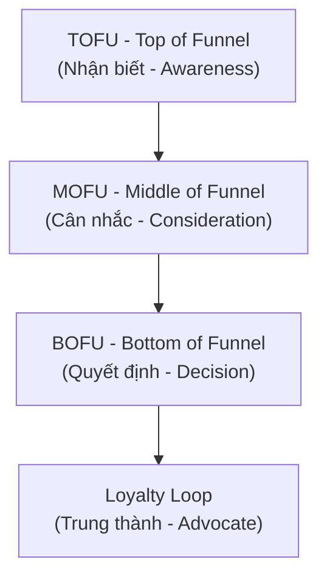
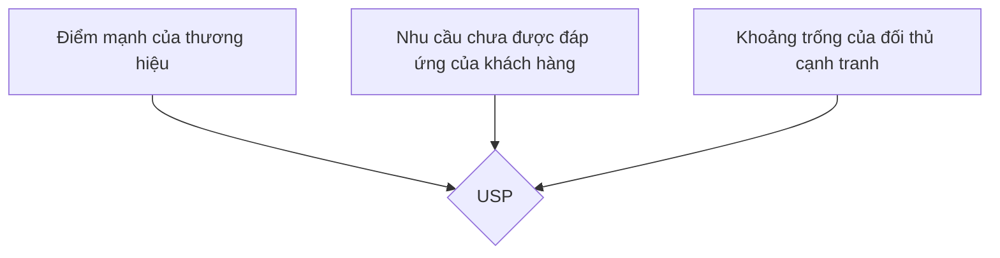
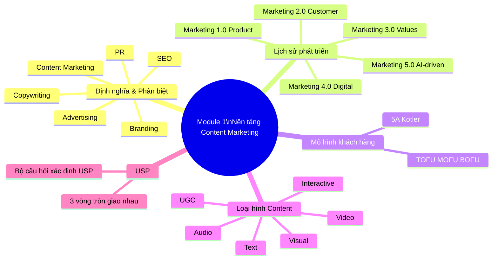

# MODULE 1: NỀN TẢNG CONTENT MARKETING CƠ BẢN
## (Buổi học 1 - 2 | Thời lượng: 6 giờ)

---

## 1. MỤC TIÊU HỌC TẬP

Sau khi hoàn thành Module 1, học viên có thể:

- Phát biểu chính xác định nghĩa Content Marketing theo chuẩn quốc tế (Content Marketing Institute) và giải thích bằng ví dụ Việt Nam.
- Phân biệt rạch ròi Content Marketing với 5 khái niệm dễ nhầm lẫn: Copywriting, Advertising, PR, Branding, SEO.
- Trình bày được lịch sử phát triển và xu hướng Marketing 1.0 → 5.0, vai trò của content trong từng giai đoạn.
- Xác định được các loại hình content phổ biến và ưu-nhược điểm của từng loại.
- Phân tích được vai trò của content trong phễu marketing (Marketing Funnel) và hành trình khách hàng.
- Xác định USP (Unique Selling Point) và bối cảnh thị trường cho một thương hiệu cụ thể (bước đầu của đồ án cá nhân).

---

## 2. NỘI DUNG LÝ THUYẾT CHI TIẾT

### 2.1. Content Marketing là gì?

**Định nghĩa chuẩn (Content Marketing Institute — CMI):**

> "Content Marketing là một phương pháp tiếp thị chiến lược tập trung vào việc tạo ra và phân phối nội dung có giá trị, liên quan và nhất quán để thu hút và giữ chân một đối tượng khán giả được xác định rõ ràng — và cuối cùng, thúc đẩy hành động sinh lời của khách hàng."

**Diễn giải theo 4 từ khóa cốt lõi:**

1. **Chiến lược (Strategic)**: Không phải viết ngẫu hứng, mà có mục tiêu, kế hoạch rõ ràng gắn với mục tiêu kinh doanh.
2. **Giá trị (Valuable)**: Nội dung phải giải quyết vấn đề, giải trí, hoặc giáo dục người đọc — không chỉ nói về sản phẩm.
3. **Nhất quán (Consistent)**: Xuất bản đều đặn, giữ giọng điệu (tone) và thông điệp thống nhất theo thời gian.
4. **Đối tượng xác định (Defined Audience)**: Nội dung nhắm đến một nhóm khách hàng cụ thể, không phải "viết cho tất cả mọi người".

**Ví dụ thực tế tại Việt Nam:**

- **Vinamilk** với chuỗi nội dung "Quỹ sữa vươn cao Việt Nam" — không bán sữa trực tiếp mà xây dựng câu chuyện trách nhiệm xã hội, tạo thiện cảm thương hiệu.
- **Highlands Coffee** với series nội dung về "văn hóa cà phê Việt" trên fanpage — không chỉ đăng giá khuyến mãi mà kể chuyện về hạt cà phê Robusta, thói quen "cà phê vỉa hè".
- **MoMo** với chuỗi content giáo dục tài chính cá nhân (Money Lover, tips tiết kiệm) giúp người dùng trẻ hiểu về quản lý tài chính, gián tiếp tăng lòng tin vào ví điện tử.

**Ví dụ thực tế từ Tôn Hoa Sen (Hoa Sen Group):**

Tôn Hoa Sen triển khai Content Marketing chiến lược bằng cách kết hợp giữa truyền thông trách nhiệm xã hội (CSR) và nội dung giáo dục thị trường, thay vì chỉ đơn thuần quảng cáo tính năng kỹ thuật của sản phẩm.

* **Chuỗi nội dung truyền thông CSR (tiêu biểu: Chương trình *"Lục Lạc Vàng"* và *"Hát Mãi Ước Mơ"*):**
* **Diễn giải:** Hoa Sen đồng hành và sản xuất nội dung xoay quanh các hoàn cảnh khó khăn, hỗ trợ người dân vùng sâu vùng xa dựng nhà, tạo kế sinh nhai.
* **Giá trị tạo ra:** Nội dung chạm đến cảm xúc, truyền tải tinh thần "Mái ấm gia đình Việt". Khách hàng thấy được trách nhiệm xã hội và sự nhân văn của doanh nghiệp, từ đó gia tăng tình cảm và niềm tin đối với thương hiệu.


* **Nội dung giáo dục & hướng dẫn kỹ thuật (Educational Content):**
* **Diễn giải:** Xây dựng các bài viết, video hướng dẫn cách phân biệt tôn thật - tôn giả, độ dày tiêu chuẩn, cách chọn vật liệu xây dựng bền vững cho từng vùng khí hậu (vùng biển, vùng bão).
* **Giá trị tạo ra:** Giải quyết đúng "điểm đau" (pain point) của chủ thầu và gia chủ là sợ mua phải hàng kém chất lượng. Bằng cách chia sẻ kiến thức chuyên môn, Hoa Sen khẳng định vị thế chuyên gia trong ngành tôn thép, gián tiếp thúc đẩy khách hàng quyết định chọn mua sản phẩm chính hãng.

**Ví dụ thực tế từ Vinamilk:**

Vinamilk là một trong những thương hiệu tiên phong tại Việt Nam ứng dụng thành công Content Marketing chiến lược trên cả kênh truyền thông xã hội, chiến dịch thương hiệu và nội dung giáo dục sức khỏe.

* **Chuỗi nội dung trách nhiệm xã hội & Cảm hứng cộng đồng (CSR & Storytelling):**
* **Ví dụ:** Dự án *"Quỹ sữa Vươn cao Việt Nam"* và các chiến dịch truyền cảm hứng về sức khỏe thể chất thế hệ trẻ.
* **Diễn giải:** Thay vì tập trung quảng cáo thông số dinh dưỡng của sữa, Vinamilk kể câu chuyện về hành trình mang sữa đến cho trẻ em vùng cao, khó khăn.
* **Giá trị tạo ra:** Khơi gợi sự đồng cảm, xây dựng hình ảnh một thương hiệu quốc gia tận tụy, gắn liền với sự phát triển của tầm vóc Việt. Tình cảm thương hiệu (Brand Love) này chuyển hóa thành sự ưu tiên lựa chọn khi tiêu dùng.


* **Nội dung giáo dục dinh dưỡng & Chăm sóc gia đình (Educational Content):**
* **Ví dụ:** Các tuyến bài viết, infographic và video ngắn chia sẻ công thức nấu ăn, mẹo chăm con chuẩn khoa học, kiến thức dinh dưỡng theo từng lứa tuổi trên website và fanpage.
* **Diễn giải:** Đóng vai trò là "chuyên gia dinh dưỡng đồng hành cùng mẹ". Nội dung giải quyết trực tiếp các mối lo hàng ngày của đối tượng mục tiêu (các bà mẹ có con nhỏ).
* **Giá trị tạo ra:** Đóng góp giá trị thực tế trước khi bán hàng, giúp Vinamilk duy trì sự tương tác nhất quán và giữ chân tập khách hàng trung thành dài lâu.


* **Chiến dịch tái định vị thương hiệu (Brand Positioning Update):**
* **Ví dụ:** Trào lưu tạo logo theo phong cách Vinamilk (Gen Z / Interactive Content).
* **Diễn giải:** Biến người dùng từ người thưởng thức nội dung thụ động thành người trực tiếp sáng tạo nội dung (UGC - User Generated Content) cùng thương hiệu.
* **Giá trị tạo ra:** Tiếp cận và trẻ hóa hình ảnh thương hiệu trong mắt đối tượng khách hàng trẻ (Gen Z), khẳng định tính hiện đại và đổi mới liên tục.

### 2.2. Phân biệt Content Marketing với các khái niệm liên quan

> **Tình huống áp dụng xuyên suốt:** Chiến dịch ra mắt sản phẩm **Nồi chiên không dầu cao cấp**.

| Khái niệm | Định nghĩa | Điểm khác biệt với Content Marketing | Ví dụ cụ thể (Khái niệm liên quan) | Ví dụ cụ thể (Content Marketing) |
| --- | --- | --- | --- | --- |
| **Copywriting** | Kỹ thuật viết chữ nhằm thúc đẩy hành động mua hàng ngay lập tức (ví dụ: quảng cáo, landing page) | Copywriting là **kỹ năng viết**, Content Marketing là **chiến lược tổng thể**. Copywriting phục vụ chuyển đổi ngắn hạn; Content Marketing xây dựng mối quan hệ dài hạn | Viết tiêu đề Landing page: *"Giảm 30% hôm nay — Nồi chiên X chiên giòn không dầu, bảo vệ tim mạch. Mua ngay!"* | Xuất bản Ebook *"30 công thức món ăn healthy cho người bận rộn"* và bài review so sánh các loại nồi chiên trên thị trường. |
| **Advertising (Quảng cáo)** | Trả tiền để hiển thị thông điệp bán hàng trực tiếp | Advertising là "one-way push" (đẩy thông điệp), gián đoạn trải nghiệm người dùng. Content Marketing là "pull" (kéo khách hàng đến), mang lại giá trị trước khi bán hàng | Trả tiền chạy Pop-up banner hoặc YouTube Ads 15 giây ngắt ngang video: *"Nồi chiên X — Chiên ngon không dầu, giá chỉ 1.990k!"* | Xây dựng kênh TikTok/YouTube chia sẻ *"Biến tấu 100 món ăn bằng nồi chiên không dầu"* thu hút người dùng tự nguyện theo dõi. |
| **PR (Public Relations)** | Quản lý hình ảnh, quan hệ với truyền thông và công chúng | PR tập trung vào uy tín, xử lý khủng hoảng, quan hệ báo chí. Content Marketing tập trung vào việc tạo tài sản nội dung sở hữu bởi thương hiệu (owned media) | Gửi thông cáo báo chí cho các báo uy tín đăng tin: *"Thương hiệu X đạt giải thưởng Công nghệ gia dụng an toàn sức khỏe"*. | Đăng tải bài viết trên Blog/Website chính thức: *"Hành trình nghiên cứu công nghệ luân chuyển khí nóng 360 độ của đội ngũ kỹ sư X"*. |
| **Branding** | Xây dựng nhận diện, giá trị cốt lõi, cá tính thương hiệu | Branding là "thương hiệu là ai", Content Marketing là "cách thương hiệu giao tiếp với khách hàng qua nội dung" — Content là công cụ để thể hiện Branding | Xây dựng định vị: *"Thương hiệu X — Giải pháp bếp thông minh cho gia đình"* với tone giọng ấm áp, màu nhận diện Xanh - Trắng. | Sản xuất series bài viết *"Góc bếp ấm"* chia sẻ chuyện nấu ăn gia đình, sử dụng tone giọng ấm áp và bảng màu chuẩn bộ nhận diện. |
| **SEO** | Tối ưu hóa để xuất hiện trên công cụ tìm kiếm | SEO là kênh phân phối và kỹ thuật, Content Marketing là nội dung cốt lõi được tối ưu bởi SEO. "Content is the fuel, SEO is the vehicle" | Nghiên cứu từ khóa *"cách làm khoai tây chiên bằng nồi chiên không dầu"*, tối ưu thẻ H1, H2, tốc độ tải trang để lên Top Google. | Viết bài hướng dẫn chi tiết từng bước, kèm hình ảnh thực tế và mẹo canh nhiệt độ chuẩn giúp khoai không bị khô để giữ chân người đọc. |

### 2.3. Lịch sử phát triển: Marketing 1.0 → 5.0 và vai trò của Content

Dưới đây là bảng đã được cập nhật thêm nội dung thể hiện rõ **Vai trò của Content** tương ứng ngay trong cột ví dụ:

| Giai đoạn | Trọng tâm | Vai trò của Content | Ví dụ thực tế (Sản phẩm Cà phê) |
| --- | --- | --- | --- |
| **Marketing 1.0** (Product-centric, thập niên 1950-1960) | Bán sản phẩm, tập trung vào tính năng | Nội dung là thông tin sản phẩm, catalogue, quảng cáo một chiều | **Ví dụ:** Tờ rơi, catalogue mô tả *"Cà phê hòa tan X làm từ 100% hạt Robusta, pha nhanh trong 30s, đậm vị tỉnh táo."*→ **Vai trò:** Cung cấp thông tin kỹ thuật, công dụng để người tiêu dùng biết sản phẩm là gì. |
| **Marketing 2.0** (Customer-centric, 1970-1990) | Thỏa mãn nhu cầu khách hàng, phân khúc thị trường | Nội dung bắt đầu cá nhân hóa theo phân khúc (demographic, psychographic) | **Ví dụ:** Quảng cáo *"Cà phê 3in1 tỉnh táo cho dân văn phòng"* vs *"Cà phê Collagen giữ dáng cho phái đẹp"*. → **Vai trò:** Định hướng thông điệp theo đúng tâm lý và nhu cầu riêng của từng nhóm khách hàng. |
| **Marketing 3.0** (Human-centric/Values-driven, 2000s) | Giá trị, sứ mệnh, tác động xã hội | Nội dung kể câu chuyện thương hiệu gắn với giá trị nhân văn, CSR | **Ví dụ:** Chiến dịch *"Mỗi gói cà phê trích 500đ xây trường cho trẻ em vùng cao, tôn vinh nông dân Việt."*→ **Vai trò:** Kể câu chuyện truyền cảm hứng, xây dựng niềm tin và tình cảm thương hiệu (Brand Love) thông qua giá trị nhân văn. |
| **Marketing 4.0** (Digital, Omnichannel, 2010s-nay) | Kết hợp online-offline, khách hàng là người đồng sáng tạo | Content trở thành trung tâm chiến lược, đa kênh (omnichannel), UGC (User Generated Content) bùng nổ | **Ví dụ:** Tạo thử thách TikTok *"Biến tấu 101 món uống với Cà phê X"*, khuyến khích người dùng tự quay video tham gia.→ **Vai trò:** Làm trung tâm kết nối đa kênh, biến khách hàng thành người sáng tạo nội dung (UGC) để lan tỏa thương hiệu tự nhiên. |
| **Marketing 5.0** (Technology-driven, AI, 2021-nay) | Kết hợp công nghệ (AI, Big Data, IoT) để phục vụ con người | Content được cá nhân hóa bằng AI theo thời gian thực, Predictive Content, Agentic AI tự động sản xuất và phân phối nội dung | **Ví dụ:** AI nhận diện trời mưa hoặc thời điểm 14h chiều người dùng mệt mỏi để tự động viết và gửi thông báo: *"Trời mưa lạnh/Đã 2h chiều, pha ngay 1 ly Cà phê X ấm nóng nhé!"*→ **Vai trò:** Tự động hóa sản xuất và phân phối nội dung siêu cá nhân hóa theo thời gian thực (Real-time), đúng người - đúng thời điểm. |

**Điểm quan trọng cho học viên**: Chương trình này huấn luyện tư duy Content Marketing **4.0 tiến tới 5.0** — nghĩa là không chỉ biết viết mà phải biết kết hợp dữ liệu và công nghệ AI để tối ưu hiệu quả.

### 2.4. Mô hình 5A của Philip Kotler và vai trò Content trong từng giai đoạn

Mô hình 5A thay thế cho phễu AIDA truyền thống trong bối cảnh khách hàng có tính kết nối cao (connected customers):

| Giai đoạn | Mô tả | Loại Content phù hợp |
|---|---|---|
| **Aware (Nhận biết)** | Khách hàng biết đến thương hiệu một cách thụ động qua quảng cáo, truyền miệng, mạng xã hội | Video viral, bài viết giải trí, content trending, KOL review |
| **Appeal (Thu hút/Ấn tượng)** | Khách hàng ấn tượng và bắt đầu ghi nhớ thương hiệu | Storytelling, content giá trị (how-to, tips), so sánh sản phẩm |
| **Ask (Hỏi/Tìm hiểu)** | Khách hàng chủ động tìm hiểu thêm qua bạn bè, mạng xã hội, tìm kiếm Google | Bài blog chuyên sâu, FAQ, review, so sánh chi tiết, website chuẩn SEO |
| **Act (Hành động)** | Khách hàng quyết định mua và trải nghiệm | Landing page, ưu đãi, hướng dẫn sử dụng, chăm sóc khách hàng |
| **Advocate (Ủng hộ)** | Khách hàng hài lòng và giới thiệu cho người khác | UGC, chương trình giới thiệu bạn bè, testimonial, cộng đồng khách hàng |

Dưới đây là ví dụ phân tích **Trend Táo đỏ** (đặc biệt là Táo đỏ kẹp sữa/hạt) chiếu theo đúng **Mô hình 5A của Philip Kotler** để bạn thấy rõ nội dung (Content) đã dẫn dắt tâm lý người tiêu dùng qua từng giai đoạn như thế nào:

---
### Ví dụ thực tế: Trend Táo đỏ kẹp sữa/hạt trên TikTok
### 1. Aware (Nhận biết): "Ủa, táo đỏ gì mà ai cũng nói tới vậy?"

* **Hành vi khách hàng:** Người dùng lướt TikTok/Reels hoàn toàn thụ động và liên tục bắt gặp hình ảnh quả táo đỏ.
* **Dạng Content xuất hiện:** Video ngắn đu trend, livestream của các KOC nổi tiếng (như Hằng Du Mục, Phạm Thoại...).
* **Ví dụ Content cụ thể:**
* Video TikTok 15s ghi lại cảnh bóc gói táo đỏ kẹp sữa lạc đà, kéo sợi cheese/sữa dẻo quánh kèm âm thanh giòn rụm (ASMR).
* Các đoạn cắt (short clip) từ phiên livestream với tiêu đề gây tò mò: *"Bán hết 10 tấn táo đỏ chỉ trong 5 phút"*.


* **Vai trò Content:** Đánh mạnh vào thị giác và thính giác, tạo hiệu ứng đám đông (FOMO) để quả táo đỏ lọt vào sự chú ý của người xem.

---

### 2. Appeal (Thu hút / Ấn tượng): "Hình như ngon mà còn bổ nữa, nhìn thèm quá!"

* **Hành vi khách hàng:** Khách hàng bắt đầu nảy sinh sự thích thú, chuyển từ "xem cho biết" sang "muốn thử" vì thấy sản phẩm vừa ngon vừa tốt cho sức khỏe.
* **Dạng Content xuất hiện:** Content đánh vào điểm đau (health/snack), storytelling về nguồn gốc, video biến tấu món ăn.
* **Ví dụ Content cụ thể:**
* Bài viết/Video: *"Thay thế bánh kẹo ngọt bằng Táo đỏ Tân Cương kẹp hạt điều — Đồ ăn vặt bổ dưỡng, đẹp da cho chị em công sở"*.
* Video hướng dẫn: *"Mẹo chưng yến táo đỏ dưỡng nhan đúng cách tại nhà"*.


* **Vai trò Content:** Biến sự tò mò thành ấn tượng tích cực, gắn liền táo đỏ với giá trị "ăn vặt lành mạnh" (Healthy snack).

---

### 3. Ask (Hỏi / Tìm hiểu): "Loại này ăn có ngon thật không? Mua ở đâu chuẩn Táo đỏ Tân Cương?"

* **Hành vi khách hàng:** Khách hàng hoài nghi (sợ hàng giả, táo ngâm hóa chất, quá ngọt...) nên chủ động tìm kiếm thêm thông tin trước khi xuống tiền.
* **Dạng Content xuất hiện:** Video Review/Unbox chân thực từ nhiều KOC khác nhau, bài so sánh chất lượng, bình luận (comment) của cộng đồng.
* **Ví dụ Content cụ thể:**
* Video Youtube/TikTok: *"Review thực tế 3 loại Táo đỏ kẹp sữa hot nhất TikTok: Loại nào đáng tiền nhất?"*.
* Bài viết trên Facebook: *"Cách phân biệt Táo đỏ Tân Cương xịn size đại với táo kém chất lượng bị sấy khô ép đường"*.

* **Vai trò Content:** Giải đáp thắc mắc, đập tan sự nghi ngờ về chất lượng và độ an toàn vệ sinh thực phẩm, giúp khách hàng yên tâm.

---

### 4. Act (Hành động): "Thấy giảm giá lại sẵn mã freeship, chốt đơn thử 1 kg!"

* **Hành vi khách hàng:** Khách hàng quyết định bấm mua hàng.
* **Dạng Content xuất hiện:** Thông điệp chốt đơn trên Livestream, ưu đãi độc quyền, Deal hời, giỏ hàng đếm ngược.
* **Ví dụ Content cụ thể:**
* Lời thoại Livestream: *"Duy nhất phiên chợ hôm nay: Mua 1 kg Táo đỏ size king tặng 1 gói kẹo táo kẹp sữa + Miễn phí vận chuyển. Chỉ còn 50 suất cuối cùng!"*.
* Nút Kêu gọi hành động (CTA): *"Bấm vào giỏ hàng góc trái để nhận voucher giảm 30k"*.


* **Vai trò Content:** Tạo sự cấp bách (Urgency) và hời về giá để thúc đẩy khách hàng hoàn thành hành vi thanh toán ngay lập tức.

---

### 5. Advocate (Ủng hộ / Lan tỏa): "Ngon thật mọi người ơi, quay clip khoe góc làm việc thôi!"

* **Hành vi khách hàng:** Nhận hàng, ăn thử thấy ngon và giòn đúng như quảng cáo nên muốn chia sẻ lên mạng xã hội hoặc giới thiệu cho đồng nghiệp.
* **Dạng Content xuất hiện:** Nội dung do người dùng tự tạo (UGC), đánh giá 5 sao kèm hình ảnh/video trên sàn Shopee/TikTok Shop, bài viết khoe thành quả.
* **Ví dụ Content cụ thể:**
* Khách hàng tự quay clip Unboxing đăng TikTok: *"Đu trend táo đỏ kẹp sữa theo Hằng Du Mục và cái kết... ngon không tưởng!"*.
* Đồng nghiệp rủ nhau gom đơn mua chung trong văn phòng.


* **Vai trò Content:** Người mua trở thành "kênh truyền thông miễn phí", tạo ra vô số content thực tế tiếp tục kéo những người dùng mới quay lại bước **Aware (Nhận biết)**, tạo thành vòng lặp viral cho cả trend.

### 2.5. Marketing Funnel (Phễu Marketing) và Content Mapping

Phễu marketing truyền thống được chia làm 3 tầng: **TOFU – MOFU – BOFU**



| Tầng phễu | Mục tiêu | Loại Content | Chỉ số đo lường (KPI) |
|---|---|---|---|
| **TOFU** | Thu hút lượng lớn người biết đến thương hiệu | Bài blog giải trí/giáo dục, video ngắn, infographic, social post viral | Reach, Impressions, Traffic, Follow mới |
| **MOFU** | Nuôi dưỡng, xây dựng niềm tin, cung cấp giải pháp | Ebook, Case study, Webinar, Email nurturing, so sánh sản phẩm, review chuyên sâu | Lead, Email subscribe, Time on page, Download |
| **BOFU** | Thúc đẩy quyết định mua hàng | Landing page, demo sản phẩm, testimonial, ưu đãi giới hạn, FAQ | Conversion rate, CTR, Sales, Add to cart |
| **Loyalty** | Giữ chân và biến khách hàng thành người ủng hộ | Content chăm sóc sau bán, chương trình khách hàng thân thiết, UGC | Retention rate, NPS, Referral rate |

## Case giả định #1: Sản phẩm Bột ngũ cốc Eat Clean theo mô hình TOFU – MOFU – BOFU

Hãy tưởng tượng **Hành trình của chị Mai — một phụ nữ văn phòng 30 tuổi, tìm giải pháp giảm cân, giữ dáng an toàn tại nhà.**

---

### 1. TOFU (Top of the Funnel) — Đỉnh phễu: Nhận biết

* **Mục tiêu:** Thu hút lượng lớn người dùng tiềm năng, giúp họ biết đến thương hiệu mà **chưa cần đề cập trực tiếp đến việc bán hàng**.
* **Hành vi chị Mai:** Lướt Facebook/TikTok buổi tối, thấy mình dạo này ngồi nhiều, vòng 2 hơi đầy đặn nên hay chú ý đến các nội dung sức khỏe.
* **Ví dụ Content:**
* Video ngắn TikTok 30 giây: *"5 thói quen ăn sáng khiến chị em văn phòng tích mỡ bụng mà không hay biết"*.
* Infographic trên Fanpage: *"Bảng calo của các món ăn sáng phổ biến ở Việt Nam (Bánh mì, Phở, Xôi)"*.


* **Chỉ số đo lường (KPI):** Video đạt 500.000 lượt xem (Reach/Impressions), bài viết thu về 2.000 lượt chia sẻ và 500 người bấm "Follow" trang.

---

### 2. MOFU (Middle of the Funnel) — Giữa phễu: Cân nhắc & Nuôi dưỡng

* **Mục tiêu:** Giải quyết vấn đề cụ thể, xây dựng niềm tin, giúp khách hàng hiểu rõ các giải pháp và thu thập thông tin liên hệ (Lead).
* **Hành vi chị Mai:** Chị Mai nhận ra vấn đề của mình và muốn tìm giải pháp thực sự hiệu quả chứ không muốn ăn kiêng khắt nghiệt.
* **Ví dụ Content:**
* **Ebook miễn phí:** *"Thực đơn Eat Clean 7 ngày cho người bận rộn"* (Chị Mai để lại Email/SĐT để tải về).
* **Email Nurturing (Nuôi dưỡng):** Chuỗi 3 email tự động gửi cho chị Mai chia sẻ kiến thức về tính chỉ số TDEE, cách chọn thực phẩm lành mạnh.
* **Bài blog so sánh:** *"So sánh phương pháp Eat Clean và Intermittent Fasting (Nhịn ăn gián đoạn): Phương pháp nào phù hợp cho dân văn phòng?"*


* **Chỉ số đo lường (KPI):** 150 người điền form tải Ebook (Leads/Email subscribe), tỷ lệ mở email đạt 40%, thời gian đọc bài blog trung bình 4 phút (Time on page).

---

### 3. BOFU (Bottom of the Funnel) — Đáy phễu: Chuyển đổi (Bán hàng)

* **Mục tiêu:** Đập tan rào cản cuối cùng, tạo động lực để khách hàng xuống tiền ngay lập tức.
* **Hành vi chị Mai:** Chị Mai đã tin tưởng thương hiệu và muốn mua một **Gói bột ngũ cốc Eat Clean thay thế bữa sáng**. Chị chỉ cần thêm một cú hích về giá hoặc sự an tâm.
* **Ví dụ Content:**
* **Landing Page bán hàng:** Nêu rõ công dụng, bảng thành phần minh bạch, chứng nhận an toàn thực phẩm.

* **Testimonial (Đánh giá thực tế):** Hình ảnh Before/After và cảm nhận của 10 chị em văn phòng khác đã giảm 2-3kg sau 1 tháng sử dụng.
* **Ưu đãi giới hạn (Urgency):** *"Giảm 20% cho đơn hàng đầu tiên + Tặng kèm bình lắc cao cấp (Chỉ áp dụng cho 50 người đăng ký hôm nay)"*.


* **Chỉ số đo lường (KPI):** Tỷ lệ chuyển đổi (Conversion rate) đạt 5%, có 25 đơn hàng mới được tạo (Sales), tỷ lệ bấm vào nút mua hàng (CTR) cao.

---

### 4. Loyalty — Sau phễu: Giữ chân & Bắt đầu vòng lặp mới

* **Mục tiêu:** Chăm sóc khách hàng sau khi mua, biến họ thành khách hàng trung thành và tự nguyện giới thiệu cho người khác.
* **Hành vi chị Mai:** Nhận hàng, dùng thử thấy ngon, dễ pha và có kết quả tốt sau 2 tuần.
* **Ví dụ Content:**
* **Content chăm sóc:** Mã QR dán trên hộp sản phẩm dẫn đến Video hướng dẫn 3 cách biến tấu bột ngũ cốc thành món smoothie/yến mạch ngâm qua đêm.
* **Chương trình tích điểm/Cộng đồng:** Mời chị Mai tham gia *"Group Zalo 21 Ngày Thử Thách Sống Khỏe"*, nơi mọi người cùng chia sẻ hình ảnh bữa ăn (UGC).
* **Voucher Referral:** *"Tặng voucher 50k cho chị Mai và bạn bè khi giới thiệu đồng nghiệp mua hàng"*.


* **Chỉ số đo lường (KPI):** 80% khách hàng quay lại mua lần 2 (Retention rate), chị Mai tự đăng ảnh hộp ngũ cốc lên Facebook khen sản phẩm (UGC/Referral rate).

## Case giả định #2: Khoá học Ngoại ngữ (Tiếng Anh giao tiếp cho người đi làm) theo mô hình TOFU – MOFU – BOFU – Loyalty

**Hành trình của chị Linh — 28 tuổi, Chuyên viên Marketing tại Đà Nẵng, muốn học Tiếng Anh để săn học bổng / nhảy việc sang công ty đa quốc gia.**

---

### 1. TOFU (Đỉnh phễu): Nhận biết

* **Mục tiêu:** Tiếp cận số lượng lớn dân văn phòng có nhu cầu học tiếng Anh nhưng hay trì hoãn, giúp họ biết đến trung tâm mà **chưa cần ép họ mua khóa học ngay**.
* **Hành vi chị Linh:** Lướt Facebook/TikTok sau giờ làm, hay gặp khó khăn khi viết email cho sếp nước ngoài hoặc ngập ngừng khi giao tiếp.
* **Ví dụ Content:**
* **Video ngắn TikTok/Reels:** *"5 câu tiếng Anh 'sang chảnh' thay thế cho 'I think' trong các buổi họp"*.
* **Infographic bóc phốt lỗi sai:** *"10 từ tiếng Anh dân văn phòng Việt Nam hay phát âm sai nhất"*.


* **KPIs:** 400.000 lượt xem (Reach/Impressions), 3.000 lượt lưu/chia sẻ bài viết, 1.200 lượt theo dõi mới.

---

### 2. MOFU (Giữa phễu): Cân nhắc & Nuôi dưỡng

* **Mục tiêu:** Cung cấp tài liệu học tập thực tế, giúp chị Linh thấy được lộ trình cải thiện và **thu thập thông tin liên hệ (Lead)**.
* **Hành vi chị Linh:** Chị Linh nhận ra điểm yếu của mình và bắt đầu chủ động tìm tài liệu tự học hoặc tìm kiếm một khóa học có lộ trình tinh gọn cho người bận rộn.
* **Ví dụ Content:**
* **Tài liệu tải về:** Ebook *"Bộ 100 mẫu câu & template email giao tiếp thương mại chuẩn doanh nghiệp"* (Điền SĐT và Email để nhận PDF qua Zalo/Email).
* **Bài test năng lực miễn phí:** *"Bài kiểm tra trình độ Tiếng Anh giao tiếp chuẩn CEFR trong 15 phút"*.
* **Webinar/Workshop online:** *"Bí quyết tự tin thuyết trình tiếng Anh với đối tác nước ngoài sau 3 tháng"*.


* **KPIs:** 350 người điền form nhận Ebook & làm bài test (Leads), tỷ lệ tham gia Webinar đạt 35%, thời gian làm test trung bình 12 phút.

---

### 3. BOFU (Đáy phễu): Chuyển đổi (Đăng ký học)

* **Mục tiêu:** Giải quyết mối bận tâm về học phí, thời gian học linh hoạt và độ hiệu quả để **thúc đẩy chị Linh xuống tiền đăng ký khóa học ngay**.
* **Hành vi chị Linh:** Chị Linh đã biết trình độ của mình qua bài test, ấn tượng với phương pháp giảng dạy và chỉ cần cú hích cuối cùng để quyết định.
* **Ví dụ Content:**

* **Học thử miễn phí (Class Demo):** *"Đăng ký học thử 1 buổi trực tiếp với giảng viên bản xứ để trải nghiệm phương pháp Reflex (Phản xạ)"*.
* **Testimonial / Case Study:** Video phỏng vấn học viên cũ: *"Hành trình từ mất gốc đến tự tin phỏng vấn đậu công ty đa quốc gia sau 4 tháng của chị An"*.
* **Cam kết & Ưu đãi chốt đơn (Urgency):** *"Cam kết đầu ra bằng hợp đồng + Tặng 100% học phí lớp Luyện phát âm chuẩn cho 20 người hoàn thành học phí tuần này"*.


* **KPIs:** 40 lượt đăng ký học thử, 8 học viên chính thức chốt hợp đồng khóa học (Sales), Tỷ lệ chuyển đổi từ Lead sang Học viên đạt 8%.

---

### 4. Loyalty (Sau phễu): Giữ chân & Giới thiệu

* **Mục tiêu:** Đảm bảo chất lượng trải nghiệm trong quá trình học, biến chị Linh thành học viên trung thành (mua tiếp khóa nâng cao) và tự nguyện giới thiệu đồng nghiệp.
* **Hành vi chị Linh:** Học đến tháng thứ 2, thấy bản thân nói tiếng Anh trôi chảy hơn hẳn, hài lòng với sự hỗ trợ của trợ giảng.
* **Ví dụ Content:**
* **Cộng đồng học viên (Community Content):** Thử thách *"21 ngày quay video nói tiếng Anh theo chủ đề"* trong nhóm Zalo/Facebook riêng của lớp để tương tác và nhận quà.
* **Nội dung chăm sóc cá nhân hóa:** Báo cáo tiến độ học tập hàng tháng gửi riêng cho chị Linh kèm lời nhận xét chi tiết từ giáo viên bản xứ.
* **Chương trình Referral:** *"Mời đồng nghiệp cùng học — Cả hai cùng nhận voucher giảm 500.000đ cho khóa học tiếp theo"*.

* **KPIs:** Tỷ lệ học viên hoàn thành khóa học đạt 90%, 30% học viên tái đăng ký khóa nâng cao, chị Linh giới thiệu thêm 2 đồng nghiệp cùng công ty đăng ký học (Referral rate).

## So sánh mô hình 5A và TOFU/MOFU/BOFU:
Mô hình 5A và mô hình phễu TOFU - MOFU - BOFU đều là các công cụ kinh điển để theo dõi hành trình khách hàng. Tuy nhiên, chúng có triết lý tiếp cận và góc nhìn hoàn toàn khác biệt.
Sự khác biệt cốt lõi nằm ở chỗ: TOFU-MOFU-BOFU là góc nhìn của doanh nghiệp (quản lý doanh số và phễu lọc), còn 5A là góc nhìn của chính khách hàng trong thời đại mạng xã hội (tập trung vào trải nghiệm và sự kết nối).
Dưới đây là bảng so sánh chi tiết giữa hai mô hình:
## 1. Bảng so sánh tổng quan

| Tiêu chí | Mô hình TOFU - MOFU - BOFU | Mô hình 5A (Philip Kotler) |
|---|---|---|
| Góc nhìn (Perspective) | Doanh nghiệp nhìn xuống: Lọc bỏ những người không tiềm năng để tìm ra người mua hàng. | Khách hàng nhìn ra: Trải nghiệm thực tế của người tiêu dùng trong thế giới số. |
| Bản chất mô hình | Hình phễu thuôn dài (Số lượng người giảm dần qua từng tầng). | Linh hoạt theo nhiều hình dạng (Hình thắt nơ, hình chiếc phễu, hình cá vàng,...). |
| Điểm kết thúc | Thường dừng lại ở bước Mua hàng (Conversion). | Kéo dài đến bước Ủng hộ thương hiệu (Advocate). |
| Yếu tố tác động chính | Lực đẩy từ marketing của doanh nghiệp (Quảng cáo, khuyến mãi). | Sự chủ động của khách hàng và sức mạnh từ cộng đồng (Review, lời khuyên). |

------------------------------
## 2. Sự khác biệt chi tiết trong từng giai đoạn
Mối quan hệ giữa hai mô hình có thể được hình dung bằng cách ánh xạ 5A vào các tầng của phễu:

[ TOFU ] ------------->  Aware (Nhận biết) & Appeal (Thu hút)
[ MOFU ] ------------->  Ask (Tìm hiểu/Cân nhắc)
[ BOFU ] ------------->  Act (Hành động/Mua hàng)
[ SAU PHỄU ] --------->  Advocate (Ủng hộ/Truyền miệng)

## TOFU (Top of Funnel - Đầu phễu) vs. Aware & Appeal

* TOFU: Doanh nghiệp cố gắng tiếp cận càng nhiều người càng tốt thông qua chạy quảng cáo, viết bài SEO, tài trợ sự kiện. Mục tiêu duy nhất là tăng lượng truy cập (Traffic).
* Aware & Appeal (5A): Không chỉ dừng lại ở việc người dùng thấy quảng cáo, mô hình 5A nhấn mạnh xem thông điệp đó có đủ sức hút cảm xúc để khách hàng ghi nhớ và tách biệt thương hiệu của bạn ra khỏi hàng ngàn quảng cáo khác ngoài kia hay không.

## MOFU (Middle of Funnel - Giữa phễu) vs. Ask

* MOFU: Doanh nghiệp định nghĩa đây là giai đoạn giáo dục khách hàng, thu thập thông tin (Lead Generation) bằng cách tặng tài liệu, tổ chức hội thảo (Webinar) để chứng minh năng lượng.
* Ask (5A): Trong 5A, giai đoạn này hoàn toàn thuộc quyền chủ động của khách hàng. Khách hàng không ngồi yên để doanh nghiệp giáo dục. Họ tự lên Google, đọc review trên hội nhóm, hỏi ý kiến bạn bè. Doanh nghiệp không còn là nguồn thông tin duy nhất.

## BOFU (Bottom of Funnel - Cuối phễu) vs. Act

* BOFU: Doanh nghiệp tung ra các đòn quyết định để chốt đơn: giảm giá, dùng thử miễn phí, tư vấn 1-1. Mục tiêu tối thượng là doanh số.
* Act (5A): Hành động mua hàng chỉ là một phần. 5A coi "Act" là toàn bộ trải nghiệm khi mua và sử dụng sản phẩm. Việc mở hộp (unboxing) có sướng không, phần mềm kích hoạt có dễ không, bảo hành có nhanh không đều nằm ở đây.

## Sự thiếu hụt của mô hình phễu: Giai đoạn Advocate (Ủng hộ)
Đây là điểm khác biệt lớn nhất. Mô hình phễu truyền thống coi khách hàng mua xong là "ra khỏi phễu" (kết thúc nhiệm vụ của marketing).
Ngược lại, mô hình 5A mở rộng thêm một bước tối quan trọng trong kỷ nguyên số: Advocate. Một khách hàng trung thành sẽ chia sẻ, khen ngợi thương hiệu trên mạng xã hội, từ đó kéo thêm hàng ngàn người mới vào giai đoạn Aware của những người khác. Khách hàng cũ chính là người làm marketing hiệu quả nhất cho doanh nghiệp.
Nếu bạn muốn, tôi có thể:

## Mô hình 5A tối ưu - mô hình thắt nơ (bow-tie)

## 1. Bản chất của cấu trúc hình thắt nơ
Trong mô hình 5A tiêu chuẩn, số lượng người ở mỗi giai đoạn thường có xu hướng giảm dần (Aware > Appeal > Ask > Act). Tuy nhiên, ở cấu trúc hình thắt nơ, tỷ lệ chuyển đổi đạt mức hoàn hảo tại hai đầu:

* Tỷ lệ Nhận biết bằng tỷ lệ Ủng hộ ($Aware = Advocate$): Cứ 100 người biết đến thương hiệu thì có đúng 100 người sẵn sàng lên tiếng giới thiệu, bảo vệ và khen ngợi thương hiệu đó (ngay cả khi một số người trong số họ chưa từng mua hàng).
* Tỷ lệ Thu hút bằng tỷ lệ Hành động ($Appeal = Act$): Cứ những ai cảm thấy thích thú với thông điệp của thương hiệu thì 100% họ sẽ xuống tiền mua sản phẩm, không có sự do dự hay phân tâm.
* Giai đoạn Tìm hiểu ($Ask$) bằng không ($Ask = 0$): Khách hàng không cần phải lên mạng tìm kiếm review, không cần so sánh giá, không cần hỏi ý kiến ai khác. Họ tin tưởng thương hiệu một cách tuyệt đối.

       AWARE (Nhận biết)                         ACT (Hành động)
         \         /                                 \         /
          \       /                                   \       /
           \     /                                     \     /
         APPEAL (Thu hút) ------------------------- ADVOCATE (Ủng hộ)
                                 ASK = 0
                            (Không cần tìm hiểu)

------------------------------
## 2. Tại sao giai đoạn "ASK" lại bằng 0?
Đây là điểm thắt nút quan trọng nhất tạo nên hình dáng chiếc thắt nơ. Trong thực tế, khách hàng phải "Ask" (Tìm hiểu) vì họ thiếu thông tin hoặc thiếu lòng tin vào thương hiệu.
Khi một thương hiệu đạt đến đẳng cấp "Thắt nơ", giai đoạn Ask biến mất vì:

* Thương hiệu đã được bảo chứng: Danh tiếng của doanh nghiệp quá mạnh và nhất quán. Khách hàng mặc định tin tưởng vào chất lượng sản phẩm.
* Sức mạnh của lời truyền miệng (Word-of-Mouth): Khách hàng được bao vây bởi những người ủng hộ (Advocate) xung quanh họ. Khi những người xung quanh đều khen ngợi, nhu cầu tự tìm kiếm và xác thực thông tin của cá nhân đó không còn cần thiết nữa.

------------------------------
## 3. Ví dụ minh họa kinh điển: Apple & Tesla
Rất hiếm doanh nghiệp đạt được cấu trúc thắt nơ hoàn hảo cho toàn bộ dải sản phẩm, nhưng Apple (ở giai đoạn hoàng kim của iPhone) và Tesla là hai ví dụ tiệm cận nhất.
## Ví dụ về Apple (Dòng sản phẩm iPhone)

* Aware & Appeal: Apple ra mắt iPhone mới. Hàng triệu người biết đến (Aware) và ngay lập tức bị thu hút bởi thiết kế hoặc tính năng mới (Appeal).
* Ask = 0: Các "iFan" không cần lên các diễn đàn công nghệ để hỏi "Có nên mua iPhone năm nay không?" hay so sánh thông số chip với Samsung. Họ bỏ qua hoàn toàn bước cân nhắc này.
* Act: Họ xếp hàng dài từ 4-5 giờ sáng trước Apple Store để quẹt thẻ mua máy (Act).
* Advocate: Sau khi mua, họ chụp ảnh "đập hộp" khoe lên mạng xã hội, tự hào sử dụng và sẵn sàng tranh luận để bảo vệ Apple trước các anti-fan (Advocate).

------------------------------
## 4. Làm thế nào để doanh nghiệp xây dựng cấu trúc hình thắt nơ?
Để biến hành trình khách hàng từ dạng phễu thông thường sang dạng thắt nơ, doanh nghiệp cần tập trung vào 3 chiến lược cốt lõi:

* Xây dựng định vị dựa trên "WHY" (Golden Circle): Sản phẩm có tốt đến mấy cũng chỉ dừng lại ở bước Act. Chỉ có những thương hiệu đại diện cho một lý tưởng, một phong cách sống hoặc một giá trị nhân văn mới có thể biến người mua hàng (Act) thành người ủng hộ (Advocate).
* Tối ưu hóa trải nghiệm khách hàng (O2O - Online to Offline): Đảm bảo mọi điểm chạm từ lúc khách hàng nhìn thấy quảng cáo trên mạng cho đến khi bước vào cửa hàng vật lý đều đồng nhất, mượt mà và vượt kỳ vọng.
* Nuôi dưỡng cộng đồng (Community Building): Tạo ra các không gian (Group, câu lạc bộ, hệ sinh thái) để những khách hàng trung thành có cơ hội giao lưu, chia sẻ trải nghiệm. Khi cộng đồng đủ lớn, họ sẽ tự động thực hiện việc "giáo dục" và "thuyết phục" những khách hàng mới thay cho doanh nghiệp.

## Mô hình 5A sản phẩm phức tạp - mô hình cá vàng (golden fish)

## 1. Bản chất của cấu trúc hình cá vàng
Trong cấu trúc này, mối quan hệ giữa các giai đoạn biến đổi rất đặc thù:

* Giai đoạn Tìm hiểu phình rất to ($Ask \gg Appeal$): Đây là đặc điểm nhận dạng quan trọng nhất. Số lượng người chủ động tìm kiếm, hỏi han và đào sâu thông tin lớn hơn rất nhiều so với số lượng người ban đầu cảm thấy bị thu hút bởi quảng cáo.
* Khách hàng không mua bằng cảm xúc: Sự thu hút ban đầu (Appeal) đối với họ là chưa đủ. Họ cần những bằng chứng logic, thông số kỹ thuật, lời khuyên từ chuyên gia và sự kiểm định khắt khe trước khi đưa ra quyết định.
* Tỷ lệ Ủng hộ thấp ($Advocate < Act$): Khách hàng mua sản phẩm xong chưa chắc đã đi giới thiệu cho người khác. Lòng trung thành trong ngành này rất khó xây dựng vì khách hàng có xu hướng xem xét lại toàn bộ thị trường mỗi khi có nhu cầu mua mới.

                  [ ASK (Tìm hiểu) ]
                 /                  \
                /                    \
[ AWARE ] -- [ APPEAL ]        [ ACT ] -- [ ADVOCATE ]
                \                    /
                 \                  /
                  [ ASK (Tìm hiểu) ]

------------------------------
## 2. Cấu trúc này thường xuất hiện ở ngành hàng nào?
Mô hình cá vàng là đặc trưng kinh điển của hai nhóm ngành lớn:

* Ngành B2B (Doanh nghiệp bán cho Doanh nghiệp): Mua máy móc nhà xưởng, phần mềm quản lý (ERP), dịch vụ logistics. Quy trình duyệt mua phải qua nhiều phòng ban (kế toán, kỹ thuật, giám đốc) nên việc "hỏi" và soi xét hồ sơ năng lượng là bắt buộc.
* Ngành hàng có giá trị cao / Rủi ro lớn (High-involvement): Bất động sản, bảo hiểm nhân thọ, xe hơi hạng sang, du học hoặc phẫu thuật thẩm mỹ. Khách hàng sợ sai lầm vì hậu quả tài chính và tinh thần quá lớn.

------------------------------
## 3. Ví dụ minh họa thực tế: Mua một căn hộ chung cư
Hãy xem cách một khách hàng trải qua hành trình "cá vàng" này:

   1. Aware (Nhận biết): Bạn lướt mạng và biết đến dự án chung cư Green Valley qua một bài đăng quảng cáo.
   2. Appeal (Thu hút): Bạn thấy thiết kế 3D của tòa nhà khá đẹp, vị trí gần trung tâm. Bạn thấy hơi thích thích.
   3. Ask (Tìm hiểu - Bụng cá vàng): Đây là lúc hành trình kéo dài. Bạn không bao giờ ra ngay sàn giao dịch để đặt cọc. Bạn bắt đầu:
   * Lên mạng tra cứu uy tín của chủ đầu tư, tính pháp lý của dự án.
      * Vào các hội nhóm cư dân để hỏi về chất lượng xây dựng, phí dịch vụ.
      * Nhờ người quen làm ngân hàng kiểm tra gói vay liên kết.
      * Đi xem nhà mẫu 3-4 lần, so sánh giá từng mét vuông với 5 dự án đối thủ xung quanh.
   4. Act (Hành động): Sau 3 tháng ròng rã tìm hiểu và đàm phán, bạn quyết định ký hợp đồng mua nhà.
   5. Advocate (Ủng hộ): Khi bạn bè hỏi, bạn có thể chỉ chia sẻ trung lập: "Ở đây cũng tạm ổn, dịch vụ hơi đắt". Bạn hiếm khi đi chào mời, thúc ép người khác mua chung cư giống mình trừ khi chủ đầu tư có chính sách tặng hoa hồng giới thiệu cực cao.

------------------------------
## 4. Chiến lược Marketing tối ưu cho doanh nghiệp "Cá vàng"
Nếu doanh nghiệp của bạn đang sở hữu hành trình khách hàng dạng cá vàng, việc đổ tiền vào quảng cáo đại trà (Aware/Appeal) sẽ rất lãng phí. Thay vào đó, bạn phải tập trung toàn lực vào giai đoạn ASK:

* Cung cấp thông tin minh bạch và chi tiết: Xây dựng tài liệu kỹ thuật, bảng so sánh tính năng, các bài viết phân tích chuyên sâu (Case study, Whitepaper) để khách hàng tự do "nghiên cứu".
* Tối ưu hóa các kênh xác thực độc lập: Chăm sóc tốt các trang review, quản lý khủng hoảng trên hội nhóm công đồng, vì khách hàng tin lời người ngoài hơn tin quảng cáo của bạn.
* Nâng cao năng lực Đội ngũ bán hàng (Sales/Consultant): Giai đoạn Ask cần những chuyên gia tư vấn có kiến thức sâu rộng để giải bớt áp lực, trả lời mọi chất vấn hóc búa của khách hàng một cách thuyết phục nhất, từ đó thúc đẩy họ chuyển sang bước Act.

### 2.6. Các loại hình Content phổ biến (Content Format Taxonomy)

| Nhóm | Định dạng cụ thể | Kênh phù hợp | Ưu điểm | Nhược điểm |
|---|---|---|---|---|
| **Văn bản (Text)** | Bài blog, bài SEO, ebook, whitepaper, email | Website, LinkedIn, Email | Chi phí thấp, dễ SEO, chuyên sâu | Cần thời gian đọc, khó viral nhanh |
| **Hình ảnh (Visual)** | Infographic, carousel, ảnh sản phẩm, meme | Instagram, Facebook, Pinterest | Dễ tiếp cận, chia sẻ nhanh | Truyền tải thông tin hạn chế |
| **Video** | Video ngắn (Reels/TikTok/Shorts), video dài (YouTube), livestream | TikTok, YouTube, Facebook | Tương tác cao, dễ viral, giữ chân người xem lâu | Chi phí sản xuất cao hơn, cần kỹ năng dựng |
| **Âm thanh (Audio)** | Podcast, audio ads | Spotify, Apple Podcast | Tiếp cận khi đa nhiệm (lái xe, tập gym) | Kén người nghe tại Việt Nam, khó đo lường |
| **Tương tác (Interactive)** | Quiz, khảo sát, minigame, AR filter | Website, Instagram, TikTok | Tăng tương tác, thu thập dữ liệu | Cần đầu tư kỹ thuật |
| **UGC (User Generated Content)** | Review khách hàng, unboxing, hashtag challenge | TikTok, Instagram, Shopee/Lazada review | Độ tin cậy cao, chi phí thấp | Khó kiểm soát chất lượng và thông điệp |
| **Livestream/Shoppertainment** | Livestream bán hàng, gameshow trực tuyến | TikTok Shop, Facebook Live, Shopee Live | Chuyển đổi tức thì, tương tác 2 chiều | Đòi hỏi kỹ năng dẫn dắt, đầu tư thời gian liên tục |

### 2.7. Xác định USP (Unique Selling Point) — Bước khởi đầu chiến lược Content

USP là "lý do khách hàng chọn bạn thay vì đối thủ". Không có USP rõ ràng, content sẽ chung chung và không tạo được khác biệt.

**Công thức xác định USP — mô hình 3 vòng tròn giao nhau:**



**Bộ câu hỏi giúp xác định USP:**
1. Sản phẩm/dịch vụ của bạn giải quyết vấn đề gì mà đối thủ chưa giải quyết tốt?
2. Khách hàng hiện tại khen bạn nhiều nhất ở điểm nào? (dựa vào review thực tế)
3. Nếu bỏ giá cả ra khỏi cuộc chơi, khách hàng chọn bạn vì lý do gì?
4. Điều gì bạn có thể nói mà đối thủ KHÔNG THỂ nói (vì không có/không dám cam kết)?

**Ví dụ USP thực tế:**
- **Katinat**: "Cà phê phong cách sống" — không chỉ bán đồ uống mà bán trải nghiệm không gian sống ảo, chụp ảnh đẹp.
- **Biti's Hunter**: "Đi để trở về" — không chỉ bán giày mà bán câu chuyện về hành trình tuổi trẻ, kết nối cảm xúc gia đình.
- **The Coffee House**: " Giao diện app tiện lợi, đặt trước lấy ngay" — USP về công nghệ trải nghiệm khi ngành F&B còn ít ai làm tốt app riêng.

### 2.8. Golden Circle (Vòng tròn vàng) của Simon Sinek — Why-How-What

Đây là mô hình bổ trợ cực kỳ hữu ích khi xây dựng thông điệp cốt lõi cho Content Marketing, đi kèm với USP đã học ở trên.

**Nguyên lý cốt lõi**: Hầu hết thương hiệu giao tiếp từ ngoài vào trong (What → How → Why): "Chúng tôi bán gì → Chúng tôi làm như thế nào → Tại sao chúng tôi làm điều đó". Nhưng những thương hiệu truyền cảm hứng mạnh nhất lại giao tiếp từ trong ra ngoài (Why → How → What):

| Vòng tròn | Câu hỏi | Ví dụ |
|---|---|---|
| **Why (Tại sao)** | Tại sao thương hiệu tồn tại? Niềm tin cốt lõi là gì? | "Chúng tôi tin rằng mọi người Việt đều xứng đáng được uống cà phê nguyên chất, không pha tạp chất" |
| **How (Làm thế nào)** | Thương hiệu thực hiện niềm tin đó bằng cách nào? | "Chúng tôi trực tiếp làm việc với nông dân, kiểm soát quy trình rang xay minh bạch" |
| **What (Cái gì)** | Sản phẩm/dịch vụ cụ thể là gì? | "Cà phê rang xay nguyên chất 100% Robusta Đắk Lắk" |

## Ví dụ phân biệt **Golden Circle (Vòng tròn vàng) từ Trong ra Ngoài (Why → How → What)** so với cách làm truyền thống.

---

### 💡 Câu chuyện: Thương hiệu Bánh mì Việt Nam

Hãy cùng so sánh hai cách xây dựng thông điệp cho cùng một thương hiệu bánh mì:

#### ❌ Cách giao tiếp truyền thống (Từ ngoài vào trong: What → How → Why)

Thương hiệu bắt đầu bằng sản phẩm và cố gắng thuyết phục khách hàng mua nó.

* **What:** *"Chúng tôi bán bánh mì thịt nướng giá 35.000đ/ổ."*
* **How:** *"Bánh mì được nướng giòn bằng lò đối lưu, thịt heo ướp theo công thức sốt đặc biệt và rau sạch thu gom trong ngày."*
* **Why:** *"Vì chúng tôi muốn mang đến cho bạn một bữa ăn sáng ngon miệng và tiện lợi."*

> **Cảm nhận của người đọc:** Bánh mì ở đâu chẳng có thịt và rau sạch? Thông điệp này mờ nhạt, chỉ giống như vô số quảng cáo bán hàng thông thường.

---

#### 🌟 Cách giao tiếp truyền cảm hứng (Từ trong ra ngoài: Why → How → What)

Thương hiệu bắt đầu bằng niềm tin cốt lõi — thứ chạm trực tiếp vào cảm xúc và giá trị sống của người đọc.

#### 1. Why (Tại sao thương hiệu tồn tại?) — Niềm tin & Sứ mệnh

* **Câu hỏi:** Tại sao chúng tôi làm điều này?
* **Thông điệp:** *"Chúng tôi tin rằng bữa sáng của người Việt bận rộn không nên là sự thỏa hiệp giữa 'nhanh tiện' và 'sức khỏe'. Mọi người đều xứng đáng bắt đầu ngày mới bằng nguồn năng lượng an lành, tử tế nhất."*
* **Ứng dụng Content:** Xuất hiện trong các bài viết định vị thương hiệu (Hero Content), video kể chuyện (Storytelling), tuyến bài trách nhiệm xã hội.

Để bạn nắm thật rõ cách biến **WHY (Niềm tin & Sứ mệnh)** thành các bài đăng thực tế chứ không chỉ dừng lại ở lý thuyết suông, dưới đây là **3 ví dụ kịch bản/bài viết chi tiết** đại diện cho 3 dạng Content ứng dụng đã nêu:

---

### Ví dụ 1: Bài viết Định vị Thương hiệu (Hero Content - Fanpage/Website)

* **Dạng bài:** Bài ghim (Pinned Post) trên Fanpage hoặc bài viết Giới thiệu (About Us) trên Website.
* **Mục tiêu:** Tuyên bố lý do tiệm bánh mì tồn tại, giúp khách hàng mới ghé trang hiểu ngay giá trị cốt lõi của thương hiệu.

> **[Bài đăng Fanpage]**
> **TIỆM BÁNH MÌ X: VÌ SAO CHÚNG TÔI TỪ CHỐI BÁN NHỮNG Ổ BÁNH MÌ "ĂN TẠM"?**
> Có bao giờ bạn tự hỏi: *Lần cuối cùng bạn thực sự tận hưởng một bữa sáng lành mạnh là khi nào?*
> Trong guồng quay vội vã của đô thị, bữa sáng của người đi làm dường như đã trở thành một thủ tục "ăn tạm cho xong bữa". Chúng ta dễ dàng tạt vào một gánh hàng rong, mua vội chiếc bánh mì ngập tràn phẩm màu, dầu mỡ tái chế hay thịt nguội không rõ nguồn gốc, rồi vừa chạy xe vừa ăn trong sự lo lắng âm thầm về sức khỏe.
> **Tại Tiệm Bánh Mì X, chúng tôi từ chối chấp nhận điều đó.**
> Chúng tôi tin rằng: **"Bận rộn" không đồng nghĩa với "Sự thỏa hiệp".** Bạn vất vả làm việc mỗi ngày, và cơ thể bạn xứng đáng nhận được nguồn năng lượng tử tế nhất ngay từ 15 phút đầu tiên của ngày mới.
> Tiệm Bánh Mì X ra đời không phải để tạo thêm một chuỗi bán đồ ăn nhanh, mà để trao cho bạn một sự lựa chọn: *Vừa nhanh gọn cho kịp giờ làm, vừa an lành tuyệt đối cho sức khỏe.*
> Mỗi ổ bánh rời khỏi căn bếp của Tiệm là một lời cam kết về sự tử tế — để bữa sáng không còn là sự chịu đựng vội vã, mà là khởi đầu tràn đầy cảm hứng cho ngày mới của bạn.
> ---
> 
> 
> *(Hình ảnh đi kèm: Bộ ảnh nghệ thuật góc quay rộng ghi lại nụ cười rạng rỡ của một nhân viên văn phòng đang thưởng thức ổ bánh mì nóng hổi trong không gian tràn ngập ánh nắng buổi sáng).*

---

### Ví dụ 2: Video Kể chuyện / Phim ngắn (Storytelling - TikTok/Reels/YouTube)

* **Dạng bài:** Kịch bản Video ngắn thời lượng 45 - 60 giây.
* **Mục tiêu:** Khơi gợi sự đồng cảm sâu sắc về mặt cảm xúc thông qua hình ảnh đời thường.

> **[Kịch bản Video ngắn: "Ổ Bánh MÌ Lúc 7H30 SÁNG"]**

> * **[0-5s] Cảnh quay:** Tiếng chuông báo thức dồn dập. Một bạn trẻ cuống cuồng mặc áo sơ mi, xỏ giày, tay cầm laptop chạy lao ra khỏi nhà dưới trời mưa nhẹ.
> * **[5-15s] Cảnh quay:** Cảnh tắc đường chật cứng. Bạn trẻ tạt nhanh vào một xe đẩy ven đường, nhận chiếc bánh mì bọc trong tờ giấy báo lem luốc, mặt hiện rõ sự mệt mỏi và tặc lưỡi ăn vội.
> * **[15-25s] Voice-over (Giọng đọc trầm ấm, truyền cảm):** *"Chúng ta đã quá quen với việc tặc lưỡi: 'Bận quá, ăn tạm cái gì cũng được'. Nhưng tại sao bữa sáng — nguồn năng lượng đầu tiên nuôi dưỡng cơ thể bạn — lại luôn phải chịu sự gác lại và thỏa hiệp?"*
> * **[25-40s] Cảnh quay:** Chuyển cảnh ánh sáng ấm áp bên trong căn bếp Tiệm Bánh Mì X. Đôi tay thợ bánh cẩn thận xếp từng lát rau củ hữu cơ tươi xanh, miếng thịt nướng hổi vào ổ bánh nguyên cám, bọc chỉn chu bằng giấy Kraft nâu sạch sẽ.
> * **[40-50s] Voice-over & Cảnh cuối:** Bạn trẻ nhận ổ bánh từ tay nhân viên Tiệm với nụ cười ấm áp, cắn một miếng giòn rụm và mỉm cười tự tin bước vào công ty.
> * *Lời thoại kết:* **"Tiệm Bánh Mì X — Vì bạn xứng đáng bắt đầu ngày mới bằng sự tử tế."**
> 
> 
> 
> 

---

### Ví dụ 3: Tuyến bài Trách nhiệm Xã hội (CSR Content)

* **Dạng bài:** Chiến dịch truyền thông hành động thực tế vì cộng đồng.
* **Mục tiêu:** Chứng minh "Niềm tin & Sứ mệnh" không chỉ là lời nói suông mà được hiện thực hóa bằng hành động cụ thể vì sức khỏe người tiêu dùng và môi trường.

> **[Bài đăng Fanpage - Chiến dịch CSR]**
> **DỰ ÁN "XANH TỪ BỮA SÁNG": KHI SỰ TỬ TẾ KHÔNG CHỈ DỪNG LẠI Ở THỰC PHẨM**
> Khi chúng tôi tuyên bố niềm tin về một *"Bữa sáng an lành cho người Việt"*, an lành đó không chỉ nằm ở miếng ăn lành sạch, mà còn là một môi trường sống lành mạnh cho thế hệ tương lai.
> Mỗi ngày, hàng triệu túi nilon và hộp xốp từ bữa sáng vội vã bị thải ra môi trường. Để bảo vệ niềm tin ấy đến cùng, Tiệm Bánh Mì X chính thức khởi động chiến dịch **"Xanh Từ Bữa Sáng"**:
> 🍃 **100% Bao bì phân hủy sinh học:** Toàn bộ túi xách, bọc bánh và ly uống tại Tiệm được thay thế hoàn toàn bằng giấy Kraft không tẩy trắng và nhựa sinh học làm từ tinh bột ngô.
> 🚴 **Đội giao hàng xanh:** Ưu tiên sử dụng xe điện cho các đơn hàng bán kính 3km để giảm thiểu khí thải carbon buổi sáng.

> 💚 **Tích điểm đổi cây xanh:** Với mỗi 10 vỏ bao bì giấy bạn gom gửi lại Tiệm, chúng tôi sẽ tặng bạn 1 chậu cây xanh để bàn làm việc.
> Sự tử tế với sức khỏe của bạn phải đi đôi với sự tử tế dành cho Trái Đất. Cùng Tiệm Bánh Mì X chọn sống xanh ngay từ bữa sáng hôm nay!

---

### 💡 Tóm lại điểm cốt lõi của ví dụ trên:

| Đặc điểm | Content thông thường (WHAT) | Content theo GOLDEN CIRCLE (WHY) |
| --- | --- | --- |
| **Nói về cái gì?** | Bánh mì có thịt gì, giá 30k, ship nhanh. | **Nỗi đau của nhịp sống vội vã** và **Quyền được ăn uống lành mạnh của khách hàng**. |
| **Cảm xúc mang lại** | Mua bán sòng phẳng, không có ấn tượng. | Cảm thấy **được thấu hiểu, được trân trọng** và **tin tưởng vào thương hiệu**. |
| **Hành vi khách hàng** | Đi so sánh giá với quán khác. | Sẵn sàng **trả giá cao hơn** và **chỉ mua tại tiệm này** vì có cùng giá trị sống. |

#### 2. How (Làm thế nào để thực hiện niềm tin đó?) — Phương pháp & Lợi thế

* **Câu hỏi:** Chúng tôi hiện thực hóa niềm tin đó ra sao?
* **Thông điệp:** *"Bằng cách tự tay chuẩn bị nguyên liệu từ 4 giờ sáng, nói 'Không' tuyệt đối với chất bảo quản/phụ gia, và sử dụng 100% bao bì giấy thân thiện với môi trường."*
* **Ứng dụng Content:** Xuất hiện trong các bài viết dạng "Hậu trường" (Behind-the-scenes), video quy trình sản xuất minh bạch, nội dung chứng minh cam kết chất lượng (Hub Content).

#### 3. What (Sản phẩm cụ thể là gì?) — Kết quả đầu ra

* **Câu hỏi:** Cụ thể chúng tôi cung cấp sản phẩm gì?
* **Thông điệp:** *"Ổ Bánh mì Thịt nướng Rau củ hữu cơ tươi ngon, giòn rụm chỉ sau 3 phút gọi món."*

* **Ứng dụng Content:** Xuất hiện ở tầng đáy phễu (BOFU) trên Landing Page, bài viết chốt đơn (Hygiene Content), hình ảnh sản phẩm kèm bảng giá và nút Call-to-Action (CTA).

---

### 🎯 Tóm lại bài học ứng dụng cho Content:

* **Simon Sinek từng nói:** *"People don't buy what you do; they buy why you do it."* (Người ta không mua **CÁI BẠN BÁN**, họ mua **LÝ DO BẠN BÁN IT**).
* Khi làm Content, nếu bài đăng nào cũng chỉ chăm chăm nói về **What** (*"Sản phẩm này có tính năng A, giá B, mua ngay đi"*), thương hiệu sẽ rất nhanh bị khách hàng ngó lơ vì ngập tràn quảng cáo.
* Nhưng khi thương hiệu liên tục truyền tải thông điệp về **Why** (*"Tầm nhìn của chúng tôi, niềm tin của chúng tôi đối với sức khỏe/cuộc sống của bạn"*), khách hàng sẽ tìm thấy sự đồng điệu về mặt giá trị, từ đó trở thành những người ủng hộ (Advocate) trung thành nhất.

**Ứng dụng vào Content Marketing**: Khi xây dựng Content Pillar (sẽ học ở Module 2), pillar về "Why" (giá trị/niềm tin thương hiệu) thường tạo kết nối cảm xúc mạnh nhất và nên được ưu tiên xuất hiện trong Hero Content, trong khi "What" (thông tin sản phẩm) phù hợp hơn với Hygiene Content ở tầng BOFU.

### 2.9. Nền kinh tế chú ý (Attention Economy) — Vì sao Content phải cạnh tranh khốc liệt

Một người dùng trung bình tiếp xúc với hàng nghìn thông điệp quảng cáo/nội dung mỗi ngày, nhưng khả năng chú ý (attention) của con người là hữu hạn. Điều này tạo ra khái niệm "Attention Economy" — nơi sự chú ý của người dùng trở thành tài nguyên khan hiếm và có giá trị nhất mà mọi thương hiệu phải cạnh tranh để giành lấy.

**Hệ quả đối với Content Marketer:**
1. Nội dung phải tạo giá trị **ngay lập tức** (trong vài giây đầu) hoặc sẽ bị lướt qua.
2. Số lượng nội dung không quan trọng bằng chất lượng và mức độ liên quan (relevance) đến đúng đối tượng.
3. Cần liên tục đổi mới định dạng/cách kể chuyện để tránh "mù quảng cáo" (banner blindness) — hiện tượng người dùng vô thức bỏ qua nội dung có dạng thức quảng cáo quen thuộc.

### 2.10. Lỗi thường gặp của người mới bắt đầu làm Content Marketing

| Lỗi thường gặp | Hậu quả | Cách khắc phục |
|---|---|---|
| Viết theo cảm tính, không có persona rõ ràng | Nội dung chung chung, không ai cảm thấy "được nói đến" | Luôn viết cho 1 Persona cụ thể (học ở Module 2) |
| Chỉ tập trung quảng cáo bán hàng (100% BOFU) | Follower cảm thấy bị làm phiền, tỷ lệ unfollow cao | Cân bằng theo mô hình 3H và phễu TOFU-MOFU-BOFU |
| Sao chép nội dung đối thủ | Mất bản sắc thương hiệu, vi phạm bản quyền tiềm ẩn | Luôn có góc nhìn/trải nghiệm riêng khi tham khảo đối thủ |
| Không đo lường, chỉ đăng theo cảm tính | Không biết nội dung nào hiệu quả để nhân rộng | Thiết lập KPI ngay từ đầu (học chi tiết ở Module 5) |
| Đăng không đều đặn, thiếu kế hoạch | Mất đà tương tác, thuật toán giảm ưu tiên phân phối | Xây dựng Content Calendar (học ở Module 2) |
| Nhầm lẫn Content Marketing với "đi seeding/spam" | Gây phản cảm, ảnh hưởng uy tín thương hiệu | Hiểu đúng bản chất "tạo giá trị trước" đã học ở mục 2.1 |

---

## 3. PHÂN TÍCH CASE STUDY THỰC TIỄN

### Case Study 1: Biti's Hunter — "Đi Để Trở Về" (2017-2019)

**Bối cảnh**: Biti's là thương hiệu giày Việt Nam lâu đời nhưng bị xem là "quê mùa", mất thị phần vào tay Nike, Adidas, các brand giày ngoại nhập trong giới trẻ.

**Chiến lược Content:**
- Hợp tác với ca sĩ Soobin Hoàng Sơn, Sơn Tùng M-TP ra MV "Lạc Trôi", "Đi Để Trở Về" lồng ghép sản phẩm một cách tự nhiên (Product Placement + Storytelling).
- Nội dung không nói về "giày tốt, bền, đẹp" mà kể câu chuyện tuổi trẻ đi xa, và tình cảm gia đình khi trở về — đánh trúng insight của Gen Z: muốn đi khám phá nhưng vẫn trân trọng gia đình.
- Kết hợp đa kênh: MV trên YouTube, teaser trên Facebook, KOL mặc sản phẩm, hashtag challenge trên mạng xã hội.

**Kết quả:**
- MV đạt hàng chục triệu lượt xem, trở thành hiện tượng mạng xã hội dịp Tết.
- Biti's Hunter "lột xác" hình ảnh, trở thành thương hiệu giày được giới trẻ yêu thích, cháy hàng nhiều mẫu.

**Bài học rút ra cho học viên:**
1. Content không nhất thiết phải nói trực tiếp về sản phẩm — kể đúng câu chuyện chạm insight còn hiệu quả hơn.
2. Sự nhất quán về thời điểm (dịp Tết — mùa đoàn viên) khuếch đại thông điệp.
3. Kết hợp KOL/Influencer đúng đối tượng mục tiêu (Gen Z) giúp lan tỏa tự nhiên.

### Case Study 2: MoMo — Content Giáo Dục Tài Chính Cá Nhân

**Bối cảnh**: Ví điện tử là sản phẩm công nghệ tài chính (Fintech), khó giải thích và cần xây dựng niềm tin về bảo mật, tiện ích.

**Chiến lược Content:**
- Xây dựng series nội dung giáo dục: "Mẹo tiết kiệm", "Quản lý chi tiêu mùa dịch", lồng ghép tính năng ví MoMo một cách tự nhiên.
- Chiến dịch "Lắc Xì" vào dịp Tết — gamification kết hợp phát lì xì, tăng tương tác và tải app.
- Content phù hợp với insight người dùng trẻ: muốn tiết kiệm nhưng chưa biết cách, muốn nhận lì xì online vui nhộn dịp Tết.

**Kết quả:**
- Chiến dịch Lắc Xì thu hút hàng triệu lượt tham gia mỗi mùa Tết, tăng mạnh số người dùng mới.
- MoMo xây dựng được hình ảnh thân thiện, gắn liền với văn hóa Tết Việt Nam.

**Bài học rút ra:**
1. Nội dung giáo dục (educational content) xây dựng niềm tin hiệu quả hơn quảng cáo trực tiếp với sản phẩm tài chính.
2. Gamification (trò chơi hóa) kết hợp với văn hóa bản địa tạo hiệu ứng lan truyền tự nhiên.
3. Content mùa vụ (seasonal content) tận dụng thời điểm vàng để tối đa hiệu quả.

### Case Study 3: Local Brand thất bại — Bài học từ thương hiệu "chỉ bán hàng"

**Bối cảnh giả định phân tích trên lớp**: Một shop thời trang online chỉ đăng ảnh sản phẩm kèm giá, không có content giá trị, không có câu chuyện thương hiệu.

**Vấn đề:**
- Fanpage có 50,000 follow nhưng tương tác mỗi bài chỉ 5-10 like.
- Khách hàng chỉ nhớ "shop bán rẻ" chứ không nhớ tên thương hiệu.
- Không xây dựng được tệp khách hàng trung thành, phải liên tục chạy quảng cáo giảm giá để có đơn hàng.

**Phân tích nguyên nhân (thảo luận nhóm trên lớp):**
- Thiếu Buyer Persona rõ ràng → nội dung chung chung.
- Không có Content Pillar → nội dung rời rạc, không nhất quán.
- Chỉ tập trung BOFU (bán hàng) mà bỏ qua TOFU-MOFU (xây dựng nhận biết và niềm tin).

**Bài tập nhóm**: Đề xuất 3 giải pháp cải thiện chiến lược content cho case study này (áp dụng framework 5A và phễu TOFU-MOFU-BOFU vừa học).

### Case Study 4: Katinat — Xây dựng USP bằng trải nghiệm không gian thay vì chỉ đồ uống

**Bối cảnh**: Thị trường trà/cà phê tại Việt Nam vô cùng cạnh tranh với hàng trăm thương hiệu (Highlands, Phúc Long, The Coffee House, Trung Nguyên Legend...), rất khó tạo khác biệt chỉ bằng chất lượng đồ uống.

**Chiến lược Content:**
- Katinat xây dựng USP không chỉ dựa trên hương vị mà dựa trên "không gian sống ảo" — thiết kế quán đẹp, góc chụp ảnh check-in, tạo nội dung UGC tự nhiên từ chính khách hàng đăng story/Instagram.
- Content chủ động dẫn dắt xu hướng "cà phê phong cách sống" (lifestyle coffee) thay vì chỉ quảng bá khuyến mãi giá.
- Tận dụng KOL/Influencer trẻ chụp ảnh tại quán, tạo hiệu ứng lan tỏa tự nhiên trên mạng xã hội mà không cần chi phí quảng cáo trực tiếp lớn.

**Kết quả**: Katinat mở rộng nhanh chóng, trở thành điểm đến quen thuộc của giới trẻ dù giá không rẻ hơn đối thủ, nhờ tạo được trải nghiệm khác biệt rõ rệt.

**Bài học rút ra**: USP không nhất thiết phải nằm ở chính sản phẩm cốt lõi — đôi khi nằm ở trải nghiệm xung quanh sản phẩm (không gian, cảm xúc, khả năng chia sẻ trên mạng xã hội). Đây cũng là minh chứng cho khái niệm UGC và Attention Economy đã học ở mục 2.9: nội dung do khách hàng tự tạo có sức lan tỏa tự nhiên mạnh hơn quảng cáo trả phí.

---

## 4. TỔNG KẾT MODULE 1

### 4.1. Tóm tắt kiến thức cốt lõi

1. Content Marketing là chiến lược tạo giá trị dài hạn, khác biệt với Copywriting/Advertising/PR/Branding/SEO nhưng có mối liên hệ mật thiết với tất cả.
2. Marketing đã tiến hóa qua 5 giai đoạn (1.0 → 5.0), và Content ngày càng trở thành trung tâm, được khuếch đại bởi công nghệ và AI.
3. Mô hình 5A (Aware-Appeal-Ask-Act-Advocate) giúp xác định loại content phù hợp với từng giai đoạn nhận thức của khách hàng.
4. Phễu Marketing TOFU-MOFU-BOFU là công cụ thực chiến để phân bổ ngân sách và nội dung hợp lý.
5. USP là nền tảng để mọi nội dung sau này "nói đúng, nói trúng" thay vì chung chung.

### 4.2. Bộ Keyword cần ghi nhớ (Ôn tập nhanh)

`Content Marketing` • `Copywriting` • `Advertising` • `PR` • `Branding` • `SEO` • `Marketing 1.0-5.0` • `Mô hình 5A` • `Aware-Appeal-Ask-Act-Advocate` • `Marketing Funnel` • `TOFU-MOFU-BOFU` • `Owned Media` • `Earned Media` • `Paid Media` • `USP (Unique Selling Point)` • `CSR (Corporate Social Responsibility)` • `UGC (User Generated Content)` • `Shoppertainment` • `Gamification` • `Insight khách hàng`

### 4.3. Sơ đồ tư duy tổng kết Module 1



---

## 5. BÀI TẬP THỰC HÀNH (Buổi 1-2)

### Bài tập 1 (Cá nhân — làm tại lớp, 20 phút)

Chọn 3 fanpage/thương hiệu bạn theo dõi trên mạng xã hội. Với mỗi thương hiệu, xác định:
- Đây là Content Marketing, Advertising, hay chỉ đơn thuần là "đăng bán hàng"? Giải thích tại sao.
- Thương hiệu đang ở giai đoạn nào trong mô hình 5A đối với bạn (là một khách hàng)?

### Bài tập 2 (Cá nhân — về nhà)

Chọn thương hiệu/sản phẩm sẽ dùng xuyên suốt khóa học (đây sẽ là đồ án cá nhân). Yêu cầu:
1. Mô tả ngắn gọn sản phẩm/dịch vụ (tối đa 200 từ).
2. Liệt kê 3 đối thủ cạnh tranh trực tiếp.
3. Áp dụng mô hình "3 vòng tròn giao nhau" để xác định USP của thương hiệu (tối thiểu 3 gạch đầu dòng phân tích).
4. Xác định thương hiệu đang thiên về loại hình content nào (Text/Visual/Video/Audio) và đánh giá mức độ phù hợp.

**Tiêu chí chấm điểm (Rubric nhanh):**

| Tiêu chí | Điểm tối đa |
|---|---|
| Mô tả sản phẩm rõ ràng, đủ thông tin | 2 điểm |
| Xác định đúng 3 đối thủ cạnh tranh thực tế | 2 điểm |
| USP có căn cứ logic, không chung chung | 4 điểm |
| Đánh giá loại hình content hợp lý, có dẫn chứng | 2 điểm |
| **Tổng** | **10 điểm** |

### Bài tập 3 (Nhóm — thảo luận tại lớp, 30 phút)

Phân tích Case Study 3 (thương hiệu thất bại) đã trình bày ở trên. Mỗi nhóm 4-5 người đề xuất:
- 3 nguyên nhân chính khiến content không hiệu quả (áp dụng khung lý thuyết đã học).
- 3 giải pháp cụ thể áp dụng mô hình 5A và phễu TOFU-MOFU-BOFU.

Trình bày 3 phút/nhóm, giảng viên nhận xét trực tiếp.

### Bài tập 4 (Về nhà — chuẩn bị cho Module 2)

Thu thập tối thiểu 10 bình luận/review thực tế của khách hàng (trên fanpage, Shopee, Google Maps...) về thương hiệu đã chọn hoặc đối thủ. Đây sẽ là dữ liệu đầu vào để xây dựng Buyer Persona ở Module 2.
### Bài tập 5 (Cá nhân — mở rộng, không bắt buộc nộp nhưng khuyến khích thực hiện)

Viết thông điệp Golden Circle (Why-How-What) cho thương hiệu đồ án cá nhân, mỗi vòng tròn tối đa 2 câu. So sánh với USP đã xác định ở Bài tập 2 — kiểm tra xem 2 công cụ này có nhất quán/bổ trợ cho nhau không.

**Gợi ý cách trình bày bài tập 5:**

```
WHY (Niềm tin cốt lõi): ___________________________
HOW (Cách thực hiện niềm tin đó): ___________________________
WHAT (Sản phẩm/dịch vụ cụ thể): ___________________________
```
---

## 6. CÂU HỎI TỰ ĐÁNH GIÁ NHANH (Self-Check Quiz — 10 câu)

1. Content Marketing khác Advertising ở điểm cốt lõi nào?
2. Nêu 4 từ khóa trong định nghĩa Content Marketing theo CMI.
3. Marketing 4.0 khác Marketing 3.0 ở điểm gì?
4. Mô hình 5A gồm những giai đoạn nào? Sắp xếp đúng thứ tự.
5. TOFU là viết tắt của gì? Loại content nào phù hợp với TOFU?
6. Nêu 3 ví dụ về UGC (User Generated Content).
7. USP được xác định dựa trên giao điểm của 3 yếu tố nào?
8. Vì sao chiến dịch "Đi Để Trở Về" của Biti's được xem là thành công về mặt Content Marketing?
9. Owned Media, Earned Media, Paid Media khác nhau như thế nào? Cho ví dụ mỗi loại.
10. Tại sao một fanpage 50,000 follow vẫn có thể thất bại về mặt Content Marketing?
11. Mô hình Golden Circle của Simon Sinek gồm 3 vòng tròn nào? Vòng nào nên được ưu tiên giao tiếp trước tiên để tạo cảm xúc mạnh nhất?
12. Attention Economy là gì? Nêu 2 hệ quả của khái niệm này đối với cách content marketer cần thiết kế nội dung.
13. Nêu 3 lỗi thường gặp của người mới bắt đầu làm Content Marketing và cách khắc phục tương ứng.
14. Vì sao USP của Katinat được xem là dựa trên "trải nghiệm" thay vì chỉ dựa trên chất lượng đồ uống? Phân tích liên hệ với khái niệm UGC.
15. "Banner blindness" là gì? Hiện tượng này liên quan như thế nào đến Attention Economy?

*(Đáp án và thang điểm chi tiết cho các câu hỏi này được tổng hợp tại file [08-NGAN-HANG-CAU-HOI-DANH-GIA.md](08-NGAN-HANG-CAU-HOI-DANH-GIA.md), mục "Module 1".)*

---

## 7. KIẾN THỨC BỔ SUNG CẦN ĐỌC THÊM (Extended Reading)

Để nắm vững Module 1, học viên nên tự nghiên cứu thêm các chủ đề sau (tài liệu tham khảo chi tiết tại file 09):

- Sách "Marketing 4.0: Moving from Traditional to Digital" — Philip Kotler, Hermawan Kartajaya, Iwan Setiawan.
- Sách "Content Inc." — Joe Pulizzi (người sáng lập Content Marketing Institute).
- Báo cáo "Vietnam Digital Report" hàng năm của We Are Social/Hootsuite để cập nhật hành vi người dùng số tại Việt Nam.
- Khái niệm "Zero Moment of Truth (ZMOT)" của Google — thời điểm khách hàng tìm kiếm thông tin trước khi quyết định mua.
- Khái niệm "Attention Economy" (Nền kinh tế chú ý) — vì sao content phải cạnh tranh để giành sự chú ý hữu hạn của người dùng.
- Sách "Start with Why" — Simon Sinek (nguồn gốc mô hình Golden Circle).
- Bài viết/nghiên cứu về "Banner Blindness" (Nielsen Norman Group) — hiện tượng người dùng vô thức bỏ qua nội dung dạng quảng cáo quen thuộc.
- Khái niệm "Filter Bubble" và "Algorithm Bias" — hiểu thêm về cách thuật toán mạng xã hội định hình những gì người dùng nhìn thấy, ảnh hưởng đến chiến lược phân phối nội dung.

### Bài tập mở rộng tự học (không bắt buộc, dành cho học viên muốn đào sâu)

1. Viết lại thông điệp Golden Circle (Why-How-What) cho thương hiệu đồ án cá nhân của bạn — mỗi vòng tròn tối đa 2 câu.
2. Quan sát newsfeed cá nhân trong 1 ngày, ghi lại 5 nội dung bạn chú ý nhất và 5 nội dung bạn lướt qua ngay lập tức. Phân tích điểm khác biệt giữa 2 nhóm này dựa trên khái niệm Attention Economy.
3. Tìm 1 ví dụ thực tế khác (ngoài Katinat) về thương hiệu xây dựng USP dựa trên trải nghiệm thay vì sản phẩm cốt lõi.

---

## 8. LƯU Ý CHO GIẢNG VIÊN (Instructor Notes)

- Buổi 1 nên dành 15 phút đầu để khảo sát nhanh học viên: "Bạn nghĩ Content Marketing là gì?" — ghi nhận các câu trả lời sai phổ biến (thường nhầm với Copywriting hoặc chỉ nghĩ là "viết bài seeding") để làm ví dụ phản biện trong bài giảng.
- Nên chuẩn bị sẵn 5-6 ví dụ fanpage thực tế (có thể mở trực tiếp trên lớp) để học viên thấy trực quan sự khác biệt giữa Content Marketing thực thụ và "đăng bài bán hàng".
- Với học viên trái ngành (không có nền tảng marketing), nên dành thêm 15-20 phút giải thích khái niệm phễu marketing bằng ví dụ đời thường (ví dụ: hành trình đi ăn nhà hàng — thấy quảng cáo, hỏi bạn bè, xem review, đặt bàn, quay lại lần sau).
- Bài tập 2 (xác định USP) là bài tập quan trọng nhất, cần giảng viên chấm và phản hồi kỹ vì đây là nền tảng cho toàn bộ đồ án các module sau. Nếu USP sai/mơ hồ ngay từ đầu, toàn bộ chiến lược ở các module sau sẽ lệch hướng.

---

## 9. VÍ DỤ THỰC HÀNH MẪU HOÀN CHỈNH (WORKED EXAMPLE) — ÁP DỤNG TOÀN BỘ MODULE 1

Để học viên hình dung rõ cách áp dụng toàn bộ kiến thức Module 1 vào 1 thương hiệu cụ thể, dưới đây là ví dụ mẫu hoàn chỉnh (học viên có thể dùng làm khuôn tham chiếu khi làm Bài tập 2):

**Thương hiệu giả định**: "Xanh Garden" — cửa hàng rau củ quả hữu cơ giao tận nhà tại khu vực đô thị.

**Bước 1 — Mô tả sản phẩm/dịch vụ:**
> Xanh Garden cung cấp rau củ quả hữu cơ (organic) được trồng theo tiêu chuẩn VietGAP, giao hàng tận nhà trong vòng 4 giờ tại khu vực nội thành. Đối tượng khách hàng chính là các gia đình có con nhỏ quan tâm đến an toàn thực phẩm.

**Bước 2 — Liệt kê 3 đối thủ cạnh tranh:**
1. Các cửa hàng thực phẩm sạch truyền thống (WinMart, Bác Tôm...)
2. Các sàn thương mại điện tử giao thực phẩm tươi sống (đối thủ gián tiếp)
3. Chợ truyền thống/siêu thị gần nhà (đối thủ về thói quen mua sắm)

**Bước 3 — Xác định USP theo mô hình 3 vòng tròn giao nhau:**
- Điểm mạnh: Có chứng nhận VietGAP minh bạch, truy xuất nguồn gốc từng lô hàng qua QR code.
- Nhu cầu khách hàng: Phụ huynh lo lắng về dư lượng thuốc trừ sâu nhưng không có thời gian đi chợ chọn lựa kỹ.
- Khoảng trống đối thủ: Các đối thủ hiện tại chưa minh bạch hóa quy trình truy xuất nguồn gốc theo thời gian thực.
- **USP kết luận**: "Rau củ hữu cơ minh bạch từng lô hàng — quét mã là biết nguồn gốc, giao tận nhà trong 4 giờ."

**Bước 4 — Áp dụng Golden Circle:**
```
WHY: Chúng tôi tin rằng mọi gia đình Việt xứng đáng được ăn thực phẩm sạch một cách minh bạch, không phải "tin vào lời hứa suông".
HOW: Chúng tôi hợp tác trực tiếp với nông trại VietGAP, gắn mã QR truy xuất nguồn gốc cho từng lô rau, kiểm định định kỳ.
WHAT: Dịch vụ rau củ quả hữu cơ giao tận nhà trong 4 giờ, có truy xuất nguồn gốc minh bạch qua app.
```

**Bước 5 — Áp dụng mô hình 5A (định vị khách hàng đang ở giai đoạn nào):**
- Nếu khách hàng mới thấy quảng cáo lần đầu → đang ở giai đoạn **Aware**.
- Nếu khách hàng đã xem video "Cách nhận biết rau ngậm hóa chất" và ấn tượng → đang ở giai đoạn **Appeal**.
- Nếu khách hàng lên Google tìm "rau hữu cơ giao tận nhà quận nào uy tín" → đang ở giai đoạn **Ask**.

**Bước 6 — Xác định loại hình Content phù hợp giai đoạn đầu:**
- TOFU: Video ngắn "3 dấu hiệu nhận biết rau ngậm hóa chất" (giáo dục, dễ viral).
- MOFU: Bài blog "So sánh rau hữu cơ VietGAP và rau thường: khác biệt nằm ở đâu?"
- BOFU: Trang giới thiệu dịch vụ kèm video demo quy trình quét mã QR truy xuất nguồn gốc thực tế.

**Nhận xét sư phạm**: Ví dụ này cho thấy toàn bộ Module 1 không phải các khái niệm rời rạc mà là một quy trình tư duy liền mạch — từ hiểu sản phẩm, xác định USP, đến định vị đúng loại nội dung theo giai đoạn nhận thức khách hàng. Học viên nên làm theo đúng trình tự 6 bước này khi thực hiện Bài tập 2 của mình.

---

## 10. BẢNG TỰ ĐÁNH GIÁ MỨC ĐỘ SẴN SÀNG CHUYỂN SANG MODULE 2

Trước khi chuyển sang Module 2, học viên tự đánh giá theo checklist sau (đánh dấu ✓ nếu tự tin đạt được):

- [ ] Tôi có thể giải thích Content Marketing cho một người chưa biết gì về marketing chỉ trong 2 câu.
- [ ] Tôi có thể chỉ ra ít nhất 1 ví dụ thực tế phân biệt Content Marketing với Advertising.
- [ ] Tôi đã xác định được USP cho thương hiệu đồ án cá nhân, có căn cứ logic rõ ràng (không chung chung).
- [ ] Tôi hiểu vì sao một bài đăng nhiều like chưa chắc là content hiệu quả.
- [ ] Tôi có thể xác định 1 khách hàng bất kỳ đang ở giai đoạn nào trong mô hình 5A.
- [ ] Tôi đã thu thập đủ tối thiểu 10 bình luận/review thực tế để chuẩn bị cho Module 2.

*Nếu có từ 2 mục trở lên chưa tự tin, học viên nên dành thêm thời gian ôn lại phần lý thuyết tương ứng hoặc trao đổi với giảng viên/trợ giảng trước khi bước sang Module 2, vì Module 2 sẽ xây dựng trực tiếp trên các khái niệm này.*

---

## 11. BẢNG PHÂN BIỆT NHANH 5 KHÁI NIỆM DỄ NHẦM LẪN (TRA CỨU NHANH)

Bảng dưới đây tổng hợp lại mục 2.2 dưới dạng dễ tra cứu nhanh khi làm bài tập, kèm câu hỏi tự kiểm tra cho từng cặp khái niệm:

| Cặp khái niệm dễ nhầm | Câu hỏi tự kiểm tra để phân biệt |
|---|---|
| Content Marketing vs Copywriting | "Nội dung này nhằm xây dựng niềm tin dài hạn hay thúc đẩy 1 hành động mua ngay?" |
| Content Marketing vs Advertising | "Người xem có chủ động tìm đến nội dung này hay bị nội dung này làm gián đoạn?" |
| Content Marketing vs PR | "Đây là nội dung do thương hiệu tự sản xuất và sở hữu, hay là tin tức được bên thứ ba viết về thương hiệu?" |
| Content Marketing vs Branding | "Đây là 'thương hiệu là ai' (giá trị cốt lõi) hay 'thương hiệu đang nói gì' (nội dung cụ thể)?" |
| Content Marketing vs SEO | "Đây là bản thân nội dung, hay là kỹ thuật giúp nội dung đó được tìm thấy?" |

**Bài tập tự kiểm tra nhanh (làm miệng tại lớp)**: Giảng viên đọc 5 tình huống ngẫu nhiên (ví dụ: "Một bài PR đăng trên báo Dân Trí về sự kiện ra mắt sản phẩm", "Một quảng cáo Facebook hiển thị giữa newsfeed", "Một bài blog hướng dẫn sử dụng sản phẩm trên website công ty"...), học viên giơ tay xác định đây thuộc khái niệm nào trong 6 khái niệm đã học.

## 12. TÀI NGUYÊN THAM KHẢO NHANH (QUICK REFERENCE CARD)

Học viên có thể in trang này riêng làm thẻ ghi nhớ nhanh (flashcard) mang theo trong quá trình thực hành:

```
✓ Định nghĩa CMI: Chiến lược - Giá trị - Nhất quán - Đối tượng xác định
✓ Mô hình 5A: Aware → Appeal → Ask → Act → Advocate
✓ Phễu: TOFU (Nhận biết) → MOFU (Cân nhắc) → BOFU (Quyết định)
✓ USP = Điểm mạnh ∩ Nhu cầu khách hàng ∩ Khoảng trống đối thủ
✓ Golden Circle: Why → How → What (giao tiếp từ trong ra ngoài)
✓ 3 loại Media: Owned (tự sở hữu) - Earned (lan tỏa tự nguyện) - Paid (trả phí)
```

### Bảng liên hệ Module 1 với các Module tiếp theo

| Khái niệm học ở Module 1 | Sẽ được sử dụng tiếp ở Module nào |
|---|---|
| USP, Golden Circle | Module 2 — làm nền tảng xác định Content Pillar |
| Mô hình 5A, TOFU-MOFU-BOFU | Module 2 — gắn vào Customer Journey Map; Module 4 — phân loại nội dung phân phối |
| Bình luận/review thu thập ở Bài tập 4 | Module 2 — dữ liệu đầu vào xây dựng Persona |
| Attention Economy, Banner Blindness | Module 3 — áp dụng khi thiết kế Hook mở đầu nội dung |
| Owned/Earned/Paid Media | Module 4 — phân tích kênh phân phối nội dung |

---

*(Hết Module 1. Tiếp tục với file 02-MODULE-2-CHIEN-LUOC-NOI-DUNG.md)*
