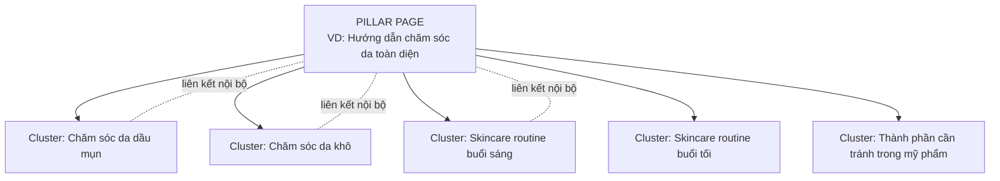
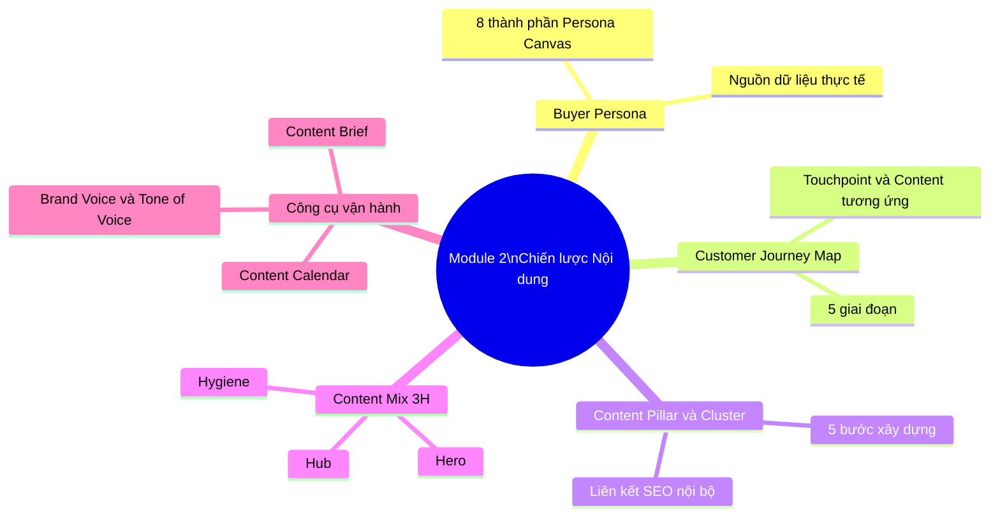

# MODULE 2: CHIẾN LƯỢC NỘI DUNG (CONTENT STRATEGY)
## (Buổi học 3 - 4 | Thời lượng: 6 giờ)

---

## 1. MỤC TIÊU HỌC TẬP

Sau khi hoàn thành Module 2, học viên có thể:

- Xây dựng hoàn chỉnh Buyer Persona (chân dung khách hàng) dựa trên dữ liệu thực tế, không phỏng đoán cảm tính.
- Vẽ được Customer Journey Map (Bản đồ hành trình khách hàng) đầy đủ 5 giai đoạn, gắn content vào từng điểm chạm.
- Xây dựng hệ thống Content Pillar và Topic Cluster cho một thương hiệu cụ thể.
- Áp dụng mô hình Content Mix 3H (Hero – Hub – Hygiene) để phân bổ loại nội dung hợp lý.
- Lập được Content Calendar (lịch nội dung) chi tiết cho 1 tháng trên đa kênh.
- Xây dựng Content Brief chuẩn để giao việc/sản xuất nội dung nhất quán.

---

## 2. NỘI DUNG LÝ THUYẾT CHI TIẾT

### 2.1. Buyer Persona — Chân dung khách hàng mục tiêu

**Định nghĩa**: Buyer Persona là hồ sơ bán hư cấu (semi-fictional) mô tả khách hàng lý tưởng, được xây dựng dựa trên dữ liệu thực tế (nghiên cứu thị trường, phỏng vấn khách hàng, dữ liệu bán hàng) kết hợp với suy luận có căn cứ.

**Vì sao Persona quan trọng?**
- Giúp đội ngũ content "viết cho một người cụ thể" thay vì viết chung chung cho "tất cả mọi người" → nội dung có cảm xúc và trúng đích hơn.
- Là căn cứ để chọn kênh phân phối (ví dụ: Persona là Gen Z thì ưu tiên TikTok, Persona là dân văn phòng 30-40 tuổi thì ưu tiên Facebook/LinkedIn).
- Là căn cứ để chọn giọng điệu (tone of voice), định dạng nội dung, thời điểm đăng bài.

**Khung xây dựng Persona Canvas — 8 thành phần bắt buộc:**

| Thành phần | Nội dung cần xác định | Ví dụ (Persona ngành F&B - trà sữa) |
|---|---|---|
| 1. Thông tin nhân khẩu học | Tuổi, giới tính, nghề nghiệp, thu nhập, khu vực sống | Nữ, 18-24 tuổi, sinh viên/nhân viên văn phòng mới đi làm, thu nhập 5-10 triệu/tháng, sống tại thành phố lớn |
| 2. Mục tiêu (Goals) | Điều họ muốn đạt được liên quan đến sản phẩm/ngành hàng | Muốn thư giãn sau giờ học/làm, muốn có ảnh đẹp để đăng story |
| 3. Nỗi đau (Pain Points) | Vấn đề, khó khăn họ đang gặp phải | Ít tiền nhưng vẫn muốn "sang", sợ tăng cân, ngại xếp hàng lâu |
| 4. Hành vi tiêu dùng | Thói quen mua sắm, kênh tiếp cận thông tin | Xem review trên TikTok trước khi thử quán mới, đặt qua app GrabFood/ShopeeFood |
| 5. Kênh thông tin ưa thích | Nền tảng mạng xã hội, nguồn tin họ tin tưởng | TikTok, Instagram, group review đồ ăn trên Facebook |
| 6. Rào cản mua hàng (Objections) | Lý do khiến họ chần chừ không mua | Giá cao hơn dự kiến, không tin review "seeding" |
| 7. Câu nói điển hình (Quote) | Một câu trích dẫn thể hiện tâm lý persona | "Đồ uống ngon thì phải đẹp nữa, để còn đăng story" |
| 8. Tên & hình ảnh đại diện | Đặt tên và tìm ảnh minh họa để nhân cách hóa | "Chi — Nàng công sở mê trà sữa" |

**Lưu ý quan trọng**: Một thương hiệu nên xây dựng **2-4 Persona chính** (không nên quá nhiều gây loãng chiến lược). Với mỗi Persona, cần thu thập dữ liệu từ tối thiểu 3 nguồn: (1) phỏng vấn/khảo sát khách hàng thực tế, (2) phân tích bình luận/review trên mạng xã hội, (3) dữ liệu Insight có sẵn từ nền tảng quảng cáo (Meta Audience Insights, TikTok Audience).

### 2.2. Customer Journey Map (Bản đồ hành trình khách hàng)

**Định nghĩa**: Là công cụ trực quan hóa toàn bộ trải nghiệm của khách hàng qua các điểm chạm (touchpoint) với thương hiệu, từ lúc chưa biết đến cho đến sau khi mua hàng.

**5 giai đoạn chuẩn của Customer Journey (mapping với mô hình 5A đã học ở Module 1):**

| Giai đoạn | Câu hỏi khách hàng đang tự hỏi | Điểm chạm (Touchpoint) | Content tương ứng | Cảm xúc cần tạo ra |
|---|---|---|---|---|
| **1. Awareness** | "Tôi có vấn đề/nhu cầu gì đó..." | Mạng xã hội, quảng cáo, truyền miệng | Video ngắn viral, bài viết giải trí/giáo dục | Tò mò, thích thú |
| **2. Consideration** | "Có những giải pháp nào? Ai cung cấp tốt?" | Google search, fanpage, group cộng đồng | Bài blog so sánh, review, infographic | Tin tưởng, an tâm |
| **3. Decision** | "Tôi nên chọn ai trong số các lựa chọn?" | Website, landing page, tư vấn trực tiếp | Case study, testimonial, ưu đãi, demo | Tự tin, chắc chắn |
| **4. Purchase/Action** | "Quy trình mua như thế nào?" | Checkout, cửa hàng, app | Hướng dẫn sử dụng, FAQ, chính sách đổi trả | Thuận tiện, an toàn |
| **5. Retention/Advocacy** | "Tôi có hài lòng không? Có nên giới thiệu không?" | Email chăm sóc, group khách hàng, CSKH | Content cảm ơn, ưu đãi thành viên, khảo sát | Được trân trọng, tự hào |

**Công cụ vẽ Customer Journey Map thực hành:**

```
[Giai đoạn] → [Suy nghĩ/Cảm xúc khách hàng] → [Điểm chạm] → [Content/Hành động của thương hiệu] → [KPI đo lường]
```

**Ví dụ áp dụng — Ngành mỹ phẩm:**

| Giai đoạn | Suy nghĩ khách hàng | Điểm chạm | Content | KPI |
|---|---|---|---|---|
| Awareness | "Da mình dạo này xỉn màu quá" | TikTok, bạn bè | Video "5 dấu hiệu da cần detox" | Views, Reach |
| Consideration | "Sản phẩm nào detox da hiệu quả, an toàn?" | Google, review | Bài blog "So sánh 5 serum vitamin C" | Traffic, Time on page |
| Decision | "Shop A hay Shop B uy tín hơn?" | Website, fanpage | Case study khách hàng thật, giấy chứng nhận | CTR, Add to cart |
| Purchase | "Đặt hàng thế nào, có ship nhanh không?" | Shopee/Website | FAQ, chính sách đổi trả rõ ràng | Conversion rate |
| Retention | "Dùng có hiệu quả không, có nên mua tiếp?" | Email, Zalo OA | Hướng dẫn dùng đúng cách, ưu đãi mua lại | Repeat purchase rate |

### 2.3. Content Pillar và Topic Cluster

**Content Pillar (Trụ cột nội dung)** là các chủ đề lớn, cốt lõi mà thương hiệu sẽ xoay quanh để sản xuất nội dung xuyên suốt. Mỗi Pillar cần liên quan trực tiếp đến: (1) USP của thương hiệu, (2) Nỗi đau/mục tiêu của Persona, (3) Từ khóa có lượng tìm kiếm tại các công cụ tìm kiếm.

**Topic Cluster (Cụm chủ đề)** là các bài viết/nội dung con xoay quanh 1 Pillar, liên kết nội bộ (internal link) với nhau và với 1 "Pillar Page" trung tâm — đây cũng là chiến thuật SEO hiện đại (Topic Cluster Model của HubSpot).

**Sơ đồ minh họa mô hình Pillar - Cluster:**



**Quy trình xây dựng Content Pillar (5 bước):**

1. **Bước 1 — Liệt kê chủ đề tiềm năng**: Dựa trên USP, Persona, brainstorm tối thiểu 10-15 chủ đề lớn liên quan đến ngành hàng.
2. **Bước 2 — Nghiên cứu từ khóa (Keyword Research)**: Dùng công cụ (Google Keyword Planner, Google Trends, Ahrefs/SEMrush bản free, hoặc gõ thử trên thanh tìm kiếm Google/TikTok để xem gợi ý tự động) để đánh giá mức độ tìm kiếm của từng chủ đề.
3. **Bước 3 — Chọn lọc 3-5 Pillar chính**: Ưu tiên chủ đề vừa có lượng tìm kiếm tốt, vừa liên quan trực tiếp đến sản phẩm/USP.
4. **Bước 4 — Phát triển Topic Cluster**: Với mỗi Pillar, brainstorm 5-10 sub-topic cụ thể hơn (long-tail keyword).
5. **Bước 5 — Lên kế hoạch xuất bản**: Xác định thứ tự ưu tiên, format (blog/video/social) và tần suất xuất bản cho từng cluster.

**Ví dụ Content Pillar cho thương hiệu "Cà phê rang xay nguyên chất":**

| Pillar | Topic Cluster (5 bài mỗi Pillar) |
|---|---|
| **1. Kiến thức cà phê** | Phân biệt Arabica vs Robusta / Cách rang cà phê ảnh hưởng hương vị / Cà phê đặc sản (specialty coffee) là gì / Chỉ số TDS trong pha chế / Lịch sử cà phê Việt Nam |
| **2. Hướng dẫn pha chế tại nhà** | Cách pha cà phê phin chuẩn vị / Pha cold brew tại nhà / Dụng cụ pha cà phê cơ bản cho người mới / Tỷ lệ nước-cà phê chuẩn / Lỗi thường gặp khi pha cà phê |
| **3. Lối sống & Văn hóa cà phê** | Văn hóa cà phê vỉa hè Sài Gòn / Không gian làm việc lý tưởng với cà phê / Cà phê và năng suất làm việc / Trend cà phê muối, cà phê trứng / Cà phê và sức khỏe (lợi ích, tác hại) |
| **4. Sản phẩm & Thương hiệu** | Quy trình rang xay nguyên chất của thương hiệu / Câu chuyện vùng nguyên liệu (Đắk Lắk, Lâm Đồng) / So sánh cà phê nguyên chất và cà phê trộn / Đánh giá từ khách hàng thật / Chứng nhận chất lượng, organic |

### 2.4. Content Mix 3H — Hero, Hub, Hygiene (Mô hình của Google)

Mô hình 3H giúp phân bổ tỷ lệ nội dung hợp lý, tránh tình trạng chỉ tập trung 1 loại nội dung gây nhàm chán hoặc thiếu hiệu quả kinh doanh.

| Loại | Mục đích | Tần suất | Tỷ lệ ngân sách/nội dung đề xuất | Ví dụ |
|---|---|---|---|---|
| **Hero Content** | Tạo tiếng vang lớn, tiếp cận tối đa, xây dựng nhận diện thương hiệu | Hiếm (1-4 lần/năm) | 20-30% ngân sách, đầu tư cao | TVC dịp Tết, chiến dịch lớn (như "Đi Để Trở Về") |
| **Hub Content** | Nội dung xuất bản đều đặn, xây dựng cộng đồng, giữ tương tác | Định kỳ (1-3 lần/tuần) | 50-60% ngân sách, đầu tư trung bình | Series video hàng tuần, chương trình podcast định kỳ |
| **Hygiene Content** | Nội dung phản hồi nhu cầu tìm kiếm tức thời, luôn sẵn sàng (always-on) | Liên tục, theo nhu cầu | 20-30% ngân sách, đầu tư thấp nhưng số lượng nhiều | FAQ, bài blog SEO, hướng dẫn sử dụng, trả lời câu hỏi thường gặp |

**Áp dụng thực tế cho lịch nội dung 1 tháng:**
- 1 Hero content (nếu tháng có dịp lễ/sự kiện lớn) hoặc bỏ qua nếu không có sự kiện đặc biệt trong tháng.
- 8-12 Hub content (2-3 bài/tuần) theo Content Pillar đã xây dựng.
- 10-15 Hygiene content (bài ngắn, trả lời câu hỏi, FAQ, tối ưu SEO từ khóa dài).

### 2.5. Content Calendar (Lịch nội dung) — Công cụ vận hành cốt lõi

**Cấu trúc một Content Calendar chuyên nghiệp cần có các cột:**

| Cột thông tin | Mô tả |
|---|---|
| Ngày đăng | Ngày/giờ cụ thể xuất bản |
| Kênh | Facebook/TikTok/Website/Email/Instagram... |
| Pillar/Chủ đề | Thuộc Content Pillar nào |
| Loại nội dung | Hero/Hub/Hygiene, định dạng (video/bài viết/hình ảnh) |
| Tiêu đề/Ý tưởng | Tên bài viết hoặc mô tả ngắn |
| Mục tiêu phễu | TOFU/MOFU/BOFU |
| CTA (Call To Action) | Hành động mong muốn khách hàng thực hiện |
| Người phụ trách | Ai viết, ai thiết kế, ai duyệt |
| Trạng thái | Draft/Review/Approved/Published |
| KPI dự kiến | Reach/Engagement/Click dự kiến đạt được |

**Nguyên tắc lập Content Calendar:**
1. Cân bằng giữa các Pillar (không dồn hết vào 1 chủ đề trong 1 tháng).
2. Cân bằng giữa 3H (Hero-Hub-Hygiene).
3. Gắn với sự kiện/mùa vụ (seasonal moment): lễ Tết, Black Friday, ngày lễ ngành hàng riêng (Ngày của Mẹ, Valentine, khai giảng...).
4. Đăng vào khung giờ vàng theo từng nền tảng (Facebook: 12h-13h, 19h-21h; TikTok: 6h-8h, 11h-13h, 19h-23h; Instagram: 11h-13h, 19h-21h — cần điều chỉnh theo dữ liệu Insight thực tế của từng fanpage).
5. Chừa khoảng trống linh hoạt (buffer) cho content thời sự/trending (newsjacking).

### 2.6. Content Brief — Tài liệu giao việc chuẩn hóa

Content Brief là tài liệu tóm tắt yêu cầu trước khi sản xuất nội dung, đảm bảo người viết/thiết kế hiểu đúng mục tiêu, tránh sửa đi sửa lại nhiều lần.

**Mẫu Content Brief chuẩn:**

```
1. Tên bài/chủ đề:
2. Mục tiêu (TOFU/MOFU/BOFU):
3. Persona mục tiêu:
4. Từ khóa chính (nếu là bài SEO):
5. Tone giọng điệu:
6. Độ dài mong muốn:
7. Outline/dàn ý chính:
8. CTA mong muốn:
9. Tài liệu tham khảo/nguồn dữ liệu:
10. Deadline:
```

### 2.7. Brand Voice và Tone of Voice

- **Brand Voice**: Tính cách nhất quán, xuyên suốt của thương hiệu (giống như "tính cách của một con người") — không thay đổi theo từng bài viết.
- **Tone of Voice**: Sắc thái giọng điệu có thể linh hoạt thay đổi theo ngữ cảnh/kênh nhưng vẫn giữ đúng Brand Voice gốc.

**Ví dụ:**
- Brand Voice của một thương hiệu trà sữa Gen Z: "Trẻ trung, hài hước, gần gũi, dùng ngôn ngữ mạng xã hội".
- Tone of Voice linh hoạt: Trên TikTok — hài hước, dùng trend; Trên email chăm sóc khách hàng — thân thiện nhưng chuyên nghiệp hơn, ít dùng slang.

**Bộ 5 tính từ xác định Brand Voice** (bài tập thực hành): Chọn 5 tính từ mô tả tính cách thương hiệu nếu nó là một con người (ví dụ: Thông minh - Hài hước - Đáng tin cậy - Gần gũi - Táo bạo), sau đó với mỗi tính từ, viết ví dụ 1 câu "NÊN nói" và 1 câu "KHÔNG NÊN nói".

### 2.8. Empathy Map và Jobs to be Done (JTBD) — Công cụ bổ trợ cho Persona

**Empathy Map (Bản đồ thấu cảm)** là công cụ thay thế/bổ sung cho Persona Canvas khi cần hiểu sâu hơn về mặt tâm lý khách hàng, tập trung vào 4 góc:

| Góc phần tư | Câu hỏi khai thác |
|---|---|
| **Say (Nói)** | Khách hàng nói gì về vấn đề/nhu cầu của họ (trích nguyên văn từ bình luận, phỏng vấn)? |
| **Think (Nghĩ)** | Họ thực sự nghĩ gì nhưng không nói ra (lo lắng ngầm, kỳ vọng thầm kín)? |
| **Do (Làm)** | Hành động thực tế của họ (tìm kiếm Google, hỏi bạn bè, so sánh giá)? |
| **Feel (Cảm nhận)** | Cảm xúc đi kèm (lo lắng, phấn khích, hoài nghi, áp lực)? |

**Jobs to be Done (JTBD)** — mô hình của Clayton Christensen: thay vì hỏi "khách hàng là ai", JTBD hỏi "khách hàng đang thuê sản phẩm này để hoàn thành công việc gì trong cuộc sống của họ". Câu thần chú JTBD: *"Khách hàng không mua sản phẩm 6mm — họ mua lỗ khoan 6mm"* (ý tưởng gốc của Theodore Levitt được Christensen phát triển thêm).

**Cấu trúc câu JTBD chuẩn:**

```
Khi [tình huống], tôi muốn [động lực/mục tiêu], để tôi có thể [kết quả mong muốn].
```

**Ví dụ áp dụng ngành trà sữa**: *"Khi tôi cảm thấy mệt mỏi giữa giờ làm (tình huống), tôi muốn có một thức uống vừa ngon vừa 'sang' để chụp ảnh (động lực), để tôi có thể vừa thư giãn vừa thể hiện gu sống của mình trên story (kết quả mong muốn)".* Insight này giúp thương hiệu nhận ra: khách hàng không chỉ mua "trà sữa" mà đang "thuê" sản phẩm để giải quyết nhu cầu thể hiện bản thân — từ đó content nên nhấn vào yếu tố hình ảnh đẹp, dễ chia sẻ, không chỉ nhấn vào hương vị.

**Khi nào dùng Persona, khi nào dùng Empathy Map/JTBD?** Persona phù hợp khi cần phân khúc rõ theo nhân khẩu học để chọn kênh phân phối. Empathy Map/JTBD phù hợp khi cần đào sâu insight cảm xúc/động lực thật sự để viết thông điệp chạm đúng tâm lý. Trong thực tế, nên kết hợp cả 3 công cụ.

---

## 3. PHÂN TÍCH CASE STUDY THỰC TIỄN

### Case Study 1: Vinamilk — Content Pillar đa dạng nhưng nhất quán

Vinamilk xây dựng nhiều Content Pillar khác nhau cho các dòng sản phẩm (sữa tươi, sữa bột trẻ em, sữa organic) nhưng vẫn giữ nhất quán giá trị cốt lõi "Vươn cao Việt Nam" xuyên suốt: từ Quỹ sữa vươn cao, đến các chiến dịch thể thao học đường. Đây là minh chứng cho việc Pillar có thể đa dạng theo persona (mẹ bỉm sữa, người lớn tuổi, vận động viên) nhưng Brand Voice phải nhất quán.

**Bài học**: Doanh nghiệp lớn với nhiều dòng sản phẩm cần xây dựng Pillar riêng cho từng persona/sản phẩm nhưng phải có 1 sợi dây giá trị cốt lõi xuyên suốt để không bị phân mảnh thương hiệu.

### Case Study 2: Tiki — Customer Journey Map trong thương mại điện tử

Tiki xây dựng content xuyên suốt hành trình khách hàng rất rõ ràng:
- **Awareness**: Quảng cáo, mạng xã hội giới thiệu chương trình khuyến mãi lớn (Sale sinh nhật Tiki, 9.9, 11.11).
- **Consideration**: Trang so sánh sản phẩm, review có đánh giá sao và bình luận thật.
- **Decision**: Badge "Tiki Trading", "Giao nhanh 2 giờ" tạo niềm tin về tốc độ và chính hãng.
- **Purchase**: Quy trình checkout đơn giản, nhiều phương thức thanh toán, theo dõi đơn hàng real-time.
- **Retention**: Chương trình Tiki Xu, email gợi ý sản phẩm dựa trên lịch sử mua hàng.

**Bài học**: Content không chỉ là "bài viết" mà còn là toàn bộ trải nghiệm thông tin xuyên suốt journey — kể cả giao diện UX, badge tin cậy, thông báo đơn hàng đều là một dạng "content" phục vụ hành trình khách hàng.

### Case Study 3: Bài tập phân tích thực chiến — Local brand mỹ phẩm

Giảng viên cung cấp cho học viên bộ dữ liệu giả định gồm: 20 bình luận khách hàng, thông tin sản phẩm, đối thủ cạnh tranh. Yêu cầu học viên nhóm thực hành:
1. Xây dựng 2 Persona từ bộ bình luận (phân tích ngôn từ, mối quan tâm khách hàng thể hiện qua comment).
2. Vẽ Customer Journey Map cho 1 Persona.
3. Đề xuất 3 Content Pillar phù hợp.

### Case Study 4: Highlands Coffee — Content Pillar gắn với "không gian làm việc" cho dân văn phòng

**Bối cảnh**: Highlands Coffee nhắm đến 2 nhóm Persona chính: (1) người đi làm cần chỗ họp/làm việc, (2) gia đình/nhóm bạn gặp gỡ cuối tuần.

**Chiến lược Content**: Thay vì chỉ xoay quanh chủ đề "đồ uống ngon", Highlands xây dựng Content Pillar về "không gian làm việc lý tưởng", "cà phê và năng suất", kết hợp với các vị trí quán tại tòa nhà văn phòng trung tâm — giải quyết đúng JTBD của dân văn phòng: *"Khi tôi cần họp với khách hàng ngoài văn phòng, tôi muốn một nơi vừa yên tĩnh vừa chuyên nghiệp, để tôi có thể gây ấn tượng tốt mà không cần đặt phòng họp."*

**Kết quả**: Highlands trở thành lựa chọn mặc định cho các cuộc hẹn công việc không chính thức tại nhiều thành phố lớn, tạo ra tần suất quay lại (retention) cao từ nhóm khách hàng văn phòng.

**Bài học**: Việc áp dụng JTBD giúp phát hiện ra Pillar nội dung không hiển nhiên (không gian làm việc) nhưng lại đúng với động lực thật sự của khách hàng hơn là chỉ nói về chất lượng đồ uống.

---

## 4. TỔNG KẾT MODULE 2

### 4.1. Tóm tắt kiến thức cốt lõi

1. Buyer Persona là nền tảng để "viết cho một người cụ thể" — cần xây dựng từ dữ liệu thật, không phỏng đoán.
2. Customer Journey Map giúp gắn đúng loại content vào đúng thời điểm tâm lý của khách hàng.
3. Content Pillar và Topic Cluster tạo hệ thống nội dung có chiều sâu, hỗ trợ SEO và tránh sản xuất nội dung rời rạc.
4. Mô hình 3H (Hero-Hub-Hygiene) giúp phân bổ ngân sách và tần suất nội dung hợp lý.
5. Content Calendar và Content Brief là 2 công cụ vận hành không thể thiếu để đảm bảo tính nhất quán và hiệu quả khi làm việc nhóm.
6. Brand Voice cần nhất quán; Tone of Voice có thể linh hoạt theo kênh/ngữ cảnh.

### 4.2. Bộ Keyword cần ghi nhớ

`Buyer Persona` • `Persona Canvas` • `Customer Journey Map` • `Touchpoint` • `Content Pillar` • `Topic Cluster` • `Pillar Page` • `Long-tail Keyword` • `Content Mix 3H` • `Hero Content` • `Hub Content` • `Hygiene Content` • `Content Calendar` • `Content Brief` • `Brand Voice` • `Tone of Voice` • `Newsjacking` • `Internal Link` • `Keyword Research` • `Seasonal Content`

### 4.3. Sơ đồ tư duy tổng kết Module 2



---

## 5. BÀI TẬP THỰC HÀNH (Buổi 3-4)

### Bài tập 1 (Cá nhân — tại lớp, 45 phút)

Dựa trên dữ liệu 10 bình luận/review đã thu thập từ Module 1, xây dựng **2 Buyer Persona hoàn chỉnh** theo mẫu Persona Canvas 8 thành phần cho thương hiệu/sản phẩm đồ án cá nhân.

### Bài tập 2 (Cá nhân — về nhà)

Vẽ Customer Journey Map hoàn chỉnh (5 giai đoạn) cho 1 trong 2 Persona vừa xây dựng, xác định rõ touchpoint và loại content tương ứng từng giai đoạn.

### Bài tập 3 (Cá nhân — về nhà)

Xây dựng hệ thống Content Pillar cho thương hiệu đồ án: tối thiểu 3 Pillar, mỗi Pillar có 5 Topic Cluster cụ thể (tổng tối thiểu 15 chủ đề nội dung con).

### Bài tập 4 (Cá nhân — tại lớp + về nhà hoàn thiện)

Lập Content Calendar chi tiết cho 1 tháng (tối thiểu 20 nội dung) trên tối thiểu 2 kênh (ví dụ: Facebook + Website, hoặc TikTok + Email), áp dụng đầy đủ mô hình 3H và gắn với ít nhất 1 sự kiện/mùa vụ trong tháng.

**Tiêu chí chấm điểm (Rubric):**

| Tiêu chí | Điểm tối đa |
|---|---|
| Persona đầy đủ 8 thành phần, có căn cứ dữ liệu | 2 điểm |
| Customer Journey Map đầy đủ 5 giai đoạn, content phù hợp | 2 điểm |
| Content Pillar logic, liên quan USP và Persona | 2 điểm |
| Content Calendar đầy đủ, cân bằng 3H, đúng định dạng | 3 điểm |
| Trình bày rõ ràng, chuyên nghiệp | 1 điểm |
| **Tổng** | **10 điểm** |

### Bài tập 5 (Nhóm — thảo luận tại lớp)

Mỗi nhóm chọn 1 thương hiệu Việt Nam nổi tiếng, phân tích và tái hiện lại Customer Journey Map thực tế của thương hiệu đó (dựa trên trải nghiệm cá nhân của thành viên nhóm khi từng là khách hàng). Trình bày 5 phút/nhóm.

---

## 6. CÂU HỎI TỰ ĐÁNH GIÁ NHANH (Self-Check Quiz — 10 câu)

1. Nêu 8 thành phần của một Persona Canvas hoàn chỉnh.
2. Vì sao một thương hiệu không nên xây dựng quá nhiều Persona (>4-5 persona)?
3. Customer Journey Map gồm mấy giai đoạn? Mối liên hệ với mô hình 5A đã học ở Module 1 là gì?
4. Phân biệt Content Pillar và Topic Cluster.
5. Nêu ví dụ về "Pillar Page" và giải thích vai trò trong SEO.
6. Mô hình 3H là viết tắt của gì? Nêu tỷ lệ ngân sách đề xuất cho từng loại.
7. Một Content Calendar chuyên nghiệp cần có tối thiểu bao nhiêu cột thông tin? Kể tên 5 cột.
8. Content Brief khác gì với Content Calendar? Vì sao cần cả hai công cụ?
9. Brand Voice và Tone of Voice khác nhau như thế nào? Cho ví dụ minh họa.
10. Newsjacking là gì? Rủi ro khi áp dụng newsjacking không phù hợp là gì?
11. Empathy Map gồm 4 góc phần tư nào? Góc nào khó khai thác nhất và vì sao?
12. Viết cấu trúc câu JTBD chuẩn và giải thích ý nghĩa từng phần.
13. Vì sao nói "khách hàng không mua sản phẩm 6mm mà mua lỗ khoan 6mm" lại liên quan đến JTBD?
14. Trong case study Highlands Coffee, Content Pillar "không gian làm việc" giải quyết JTBD nào của dân văn phòng?
15. Khi nào nên dùng Persona, khi nào nên dùng Empathy Map/JTBD? Có thể kết hợp cả 3 công cụ không?

---

## 7. KIẾN THỨC BỔ SUNG CẦN ĐỌC THÊM

- Mô hình "Jobs to be Done" (JTBD) của Clayton Christensen — cách tiếp cận khác để hiểu động lực mua hàng của khách hàng, bổ trợ cho Persona. Sách gốc: "Competing Against Luck".
- Công cụ "Empathy Map" (Bản đồ thấu cảm) — công cụ thay thế/bổ sung cho Persona Canvas, tập trung vào Say-Think-Do-Feel (nguồn gốc từ Xplane, phổ biến qua Gamestorming).
- HubSpot Topic Cluster Model — tài liệu gốc về mô hình Pillar-Cluster phục vụ SEO.
- Random Act of Content Calendar templates: Google Sheet, Notion, Trello, Asana — học viên nên thử nghiệm ít nhất 1 công cụ quản lý lịch nội dung ngoài Excel/Google Sheet.
- Google Trends và TikTok Creative Center — công cụ miễn phí để nghiên cứu xu hướng và từ khóa theo mùa vụ.
- Bài viết "Marketing Myopia" của Theodore Levitt (1960) — nguồn gốc ý tưởng "khách hàng mua giải pháp, không mua sản phẩm".

### Bài tập mở rộng tự học (không bắt buộc)

1. Viết 1 câu JTBD cho chính bản thân bạn khi mua 1 sản phẩm/dịch vụ bất kỳ gần đây — phân tích xem quyết định mua có thực sự do JTBD chi phối hay chỉ do giá/khuyến mãi.
2. Vẽ Empathy Map cho 1 Persona đã xây dựng ở Bài tập 1, so sánh xem có phát hiện thêm insight nào mới không có trong Persona Canvas ban đầu.
3. Tìm 1 thương hiệu Việt Nam khác (ngoài Highlands) xây dựng Content Pillar dựa trên JTBD thay vì chỉ dựa trên đặc tính sản phẩm.

## 9. VÍ DỤ THỰC HÀNH MẪU HOÀN CHỈNH — ÁP DỤNG TOÀN BỘ MODULE 2

**Thương hiệu giả định**: "Xanh Garden" (tiếp nối ví dụ ở Module 1) — rau củ hữu cơ giao tận nhà.

**Bước 1 — Persona Canvas rút gọn:**

| Thành phần | Nội dung |
|---|---|
| Nhân khẩu học | Nữ, 28-40 tuổi, đã lập gia đình, có con nhỏ, thu nhập khá |
| Mục tiêu | Đảm bảo an toàn thực phẩm cho con, tiết kiệm thời gian đi chợ |
| Nỗi đau | Không có thời gian, sợ mua phải rau không rõ nguồn gốc |
| Hành vi | Đặt hàng qua app buổi tối, tham khảo group "Mẹ và bé" trên Facebook |
| Kênh ưa thích | Facebook Group, Zalo OA |
| Rào cản | Giá cao hơn chợ, chưa quen mua rau online |
| Câu nói điển hình | "Con còn nhỏ nên mình sợ nhất là thực phẩm bẩn" |
| Tên gọi | "Chị Lan — Mẹ bỉm sữa quan tâm sức khỏe gia đình" |

**Bước 2 — JTBD**: *"Khi tôi chuẩn bị bữa ăn cho con mỗi ngày, tôi muốn chắc chắn rau củ an toàn mà không mất thời gian đi chọn lựa ở chợ, để tôi có thể yên tâm và dành thời gian đó chăm sóc con nhiều hơn."*

**Bước 3 — Content Pillar (3 pillar, rút gọn mỗi pillar 3 cluster):**

| Pillar | Cluster |
|---|---|
| An toàn thực phẩm cho gia đình | Cách nhận biết rau ngậm hóa chất / Rau VietGAP là gì / Câu chuyện truy xuất nguồn gốc qua QR |
| Mẹo nấu ăn nhanh cho mẹ bận rộn | Thực đơn 15 phút cho bé / Công thức súp rau củ dinh dưỡng / Cách bảo quản rau tươi lâu hơn |
| Câu chuyện nông trại | Ghé thăm nông trại đối tác / Người nông dân đứng sau lô rau của bạn / Quy trình thu hoạch - đóng gói |

**Bước 4 — Trích đoạn Content Calendar tuần đầu (mẫu rút gọn):**

| Ngày | Kênh | Pillar | Loại (3H) | Tiêu đề | CTA |
|---|---|---|---|---|---|
| Thứ 2 | Facebook | An toàn thực phẩm | Hygiene | "3 dấu hiệu rau ngậm hóa chất mẹ cần biết" | Bình luận chia sẻ kinh nghiệm |
| Thứ 4 | Zalo OA | Mẹo nấu ăn | Hub | "Thực đơn 15 phút cho bé tuần này" | Đặt hàng nguyên liệu trong bài |
| Thứ 6 | Facebook | Câu chuyện nông trại | Hub | Video ghé thăm nông trại đối tác | Theo dõi để xem tập tiếp theo |

**Nhận xét sư phạm**: Ví dụ này minh họa cách JTBD (Bước 2) trực tiếp định hình Pillar (Bước 3) — Pillar "Mẹo nấu ăn nhanh" xuất phát từ insight "muốn dành thời gian chăm con nhiều hơn" trong câu JTBD, chứ không phải suy nghĩ ngẫu nhiên.

---

## 10. BẢNG TỰ ĐÁNH GIÁ MỨC ĐỘ SẴN SÀNG CHUYỂN SANG MODULE 3

- [ ] Tôi đã xây dựng được tối thiểu 2 Persona đầy đủ 8 thành phần, có căn cứ từ dữ liệu thật.
- [ ] Tôi hiểu rõ 5 giai đoạn Customer Journey Map và có thể gắn đúng loại content cho từng giai đoạn.
- [ ] Tôi đã xây dựng hệ thống Content Pillar - Topic Cluster tối thiểu 3 pillar, mỗi pillar 5 cluster.
- [ ] Tôi hiểu và có thể áp dụng mô hình 3H để phân bổ tỷ lệ nội dung hợp lý.
- [ ] Tôi đã lập được Content Calendar 1 tháng hoàn chỉnh cho tối thiểu 2 kênh.
- [ ] Tôi hiểu sự khác biệt giữa Persona, Empathy Map và JTBD, biết khi nào nên dùng công cụ nào.

*Nếu chưa tự tin ở mục Content Pillar hoặc Content Calendar, nên hoàn thiện trước khi bước sang Module 3, vì Module 3 sẽ yêu cầu sáng tạo nội dung cụ thể dựa trực tiếp trên Content Calendar đã lập ở đây.*

---

## 11. BẢNG TRA CỨU NHANH — QUICK REFERENCE CARD MODULE 2

```
✓ Persona Canvas: Nhân khẩu học - Mục tiêu - Nỗi đau - Hành vi - Kênh - Rào cản - Quote - Tên/Ảnh
✓ Customer Journey: Awareness → Consideration → Decision → Purchase → Retention
✓ Pillar - Cluster: Pillar = chủ đề lớn | Cluster = bài viết con liên kết nội bộ
✓ Content Mix 3H: Hero (hiếm, tạo tiếng vang) - Hub (định kỳ, giữ tương tác) - Hygiene (liên tục, luôn sẵn sàng)
✓ JTBD: "Khi [tình huống], tôi muốn [động lực], để tôi có thể [kết quả mong muốn]"
✓ Empathy Map: Say - Think - Do - Feel
```

### Bảng phân biệt nhanh Content Brief và Content Calendar

| Tiêu chí | Content Calendar | Content Brief |
|---|---|---|
| Phạm vi | Toàn bộ kế hoạch nội dung theo thời gian (tuần/tháng) | Chi tiết cho 1 nội dung cụ thể |
| Mục đích | Quản lý tổng thể, tránh trùng lặp/bỏ sót | Giao việc chính xác cho người sản xuất |
| Người dùng chính | Trưởng nhóm content/Marketing Manager | Content Writer/Designer/Editor |
| Cập nhật | Theo tuần/tháng | Theo từng bài viết/dự án |

### Bảng liên hệ Module 2 với các Module tiếp theo

| Khái niệm học ở Module 2 | Sẽ được sử dụng tiếp ở Module nào |
|---|---|
| Persona, Empathy Map, JTBD | Module 3 — chọn đúng công thức storytelling và giọng văn phù hợp với insight khách hàng |
| Content Pillar - Topic Cluster | Module 4 — làm nền tảng cho chiến lược SEO on-page và Pillar Page |
| Content Calendar | Module 3 — là khung để sản xuất nội dung cụ thể theo từng kênh; Module 5 — là căn cứ đo lường hiệu quả theo từng bài |
| Content Brief | Module 3 — tài liệu đầu vào bắt buộc trước khi viết nội dung |
| Content Mix 3H | Module 5 — đánh giá hiệu quả từng loại nội dung theo đúng vai trò của nó (không so sánh Hero với Hygiene cùng 1 thang KPI) |

---

## 12. LƯU Ý CHO GIẢNG VIÊN

- Đây là module "xương sống" của cả khóa học — nếu học viên làm Persona/Pillar sai/hời hợt, các module thực hành sau (Module 3-4) sẽ không có nền tảng để bám vào. Nên dành thời gian phản hồi 1-1 (feedback cá nhân) cho từng học viên ở bài tập Persona và Content Pillar.
- Gợi ý chia lớp thành các nhóm ngành hàng tương đồng (F&B, thời trang, mỹ phẩm, dịch vụ B2B...) để học viên có thể tham khảo chéo case study cùng ngành, dễ hình dung hơn.
- Nên chuẩn bị sẵn 2-3 bộ dữ liệu bình luận mẫu (đã ẩn danh) cho học viên chưa có sản phẩm/thương hiệu cụ thể để thực hành (ví dụ: học viên là sinh viên chưa kinh doanh).
- Kiểm tra kỹ Content Calendar của học viên để đảm bảo họ hiểu đúng bản chất 3H, tránh tình trạng chỉ liệt kê bài đăng mà không phân loại được Hero/Hub/Hygiene.
- Với phần JTBD/Empathy Map (mới bổ sung), giảng viên nên nhấn mạnh đây là công cụ *bổ trợ*, không thay thế Persona — tránh học viên nhầm lẫn phải chọn 1 trong 3 công cụ.

---

*(Hết Module 2. Tiếp tục với file 03-MODULE-3-SANG-TAO-NOI-DUNG-DA-KENH.md)*
