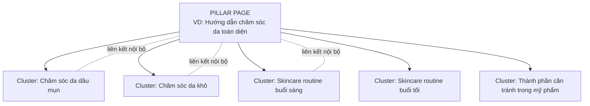
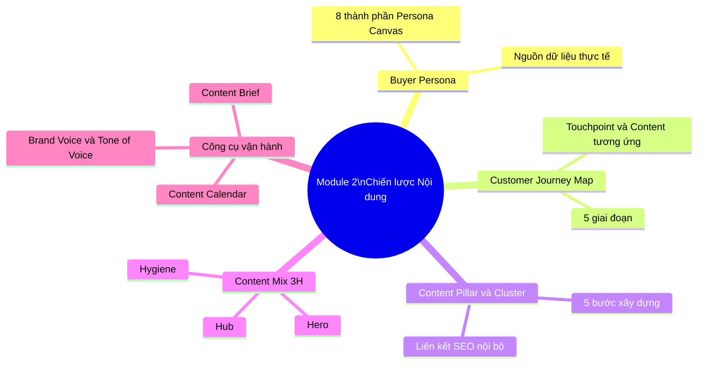

# MODULE 2: CHIẾN LƯỢC NỘI DUNG (CONTENT STRATEGY)
## (Buổi học 3 - 4 | Thời lượng: 6 giờ)

---

## 1. MỤC TIÊU HỌC TẬP

Sau khi hoàn thành Module 2, học viên có thể:

- Xây dựng hoàn chỉnh Buyer Persona (chân dung khách hàng) dựa trên dữ liệu thực tế, không phỏng đoán cảm tính.
- Vẽ được Customer Journey Map (Bản đồ hành trình khách hàng) đầy đủ 5 giai đoạn, gắn content vào từng điểm chạm.
- Xây dựng hệ thống Content Pillar và Topic Cluster cho một thương hiệu cụ thể.
- Áp dụng mô hình Content Mix 3H (Hero – Hub – Hygiene) để phân bổ loại nội dung hợp lý.
- Lập được Content Calendar (lịch nội dung) chi tiết cho 1 tháng trên đa kênh.
- Xây dựng Content Brief chuẩn để giao việc/sản xuất nội dung nhất quán.

---

## 2. NỘI DUNG LÝ THUYẾT CHI TIẾT

### 2.1. Buyer Persona — Chân dung khách hàng mục tiêu

**Định nghĩa**: Buyer Persona là hồ sơ bán hư cấu (semi-fictional) mô tả khách hàng lý tưởng, được xây dựng dựa trên dữ liệu thực tế (nghiên cứu thị trường, phỏng vấn khách hàng, dữ liệu bán hàng) kết hợp với suy luận có căn cứ.

**Vì sao Persona quan trọng?**
- Giúp đội ngũ content "viết cho một người cụ thể" thay vì viết chung chung cho "tất cả mọi người" → nội dung có cảm xúc và trúng đích hơn.
- Là căn cứ để chọn kênh phân phối (ví dụ: Persona là Gen Z thì ưu tiên TikTok, Persona là dân văn phòng 30-40 tuổi thì ưu tiên Facebook/LinkedIn).
- Là căn cứ để chọn giọng điệu (tone of voice), định dạng nội dung, thời điểm đăng bài.

**Khung xây dựng Persona Canvas — 8 thành phần bắt buộc:**

| Thành phần | Nội dung cần xác định | Ví dụ (Persona ngành F&B - trà sữa) |
|---|---|---|
| 1. Thông tin nhân khẩu học | Tuổi, giới tính, nghề nghiệp, thu nhập, khu vực sống | Nữ, 18-24 tuổi, sinh viên/nhân viên văn phòng mới đi làm, thu nhập 5-10 triệu/tháng, sống tại thành phố lớn |
| 2. Mục tiêu (Goals) | Điều họ muốn đạt được liên quan đến sản phẩm/ngành hàng | Muốn thư giãn sau giờ học/làm, muốn có ảnh đẹp để đăng story |
| 3. Nỗi đau (Pain Points) | Vấn đề, khó khăn họ đang gặp phải | Ít tiền nhưng vẫn muốn "sang", sợ tăng cân, ngại xếp hàng lâu |
| 4. Hành vi tiêu dùng | Thói quen mua sắm, kênh tiếp cận thông tin | Xem review trên TikTok trước khi thử quán mới, đặt qua app GrabFood/ShopeeFood |
| 5. Kênh thông tin ưa thích | Nền tảng mạng xã hội, nguồn tin họ tin tưởng | TikTok, Instagram, group review đồ ăn trên Facebook |
| 6. Rào cản mua hàng (Objections) | Lý do khiến họ chần chừ không mua | Giá cao hơn dự kiến, không tin review "seeding" |
| 7. Câu nói điển hình (Quote) | Một câu trích dẫn thể hiện tâm lý persona | "Đồ uống ngon thì phải đẹp nữa, để còn đăng story" |
| 8. Tên & hình ảnh đại diện | Đặt tên và tìm ảnh minh họa để nhân cách hóa | "Chi — Nàng công sở mê trà sữa" |

**Lưu ý quan trọng**: Một thương hiệu nên xây dựng **2-4 Persona chính** (không nên quá nhiều gây loãng chiến lược). Với mỗi Persona, cần thu thập dữ liệu từ tối thiểu 3 nguồn: (1) phỏng vấn/khảo sát khách hàng thực tế, (2) phân tích bình luận/review trên mạng xã hội, (3) dữ liệu Insight có sẵn từ nền tảng quảng cáo (Meta Audience Insights, TikTok Audience).

### 2.2. Customer Journey Map (Bản đồ hành trình khách hàng)

**Định nghĩa**: Là công cụ trực quan hóa toàn bộ trải nghiệm của khách hàng qua các điểm chạm (touchpoint) với thương hiệu, từ lúc chưa biết đến cho đến sau khi mua hàng.

**5 giai đoạn chuẩn của Customer Journey (mapping với mô hình 5A đã học ở Module 1):**

| Giai đoạn | Câu hỏi khách hàng đang tự hỏi | Điểm chạm (Touchpoint) | Content tương ứng | Cảm xúc cần tạo ra |
|---|---|---|---|---|
| **1. Awareness** | "Tôi có vấn đề/nhu cầu gì đó..." | Mạng xã hội, quảng cáo, truyền miệng | Video ngắn viral, bài viết giải trí/giáo dục | Tò mò, thích thú |
| **2. Consideration** | "Có những giải pháp nào? Ai cung cấp tốt?" | Google search, fanpage, group cộng đồng | Bài blog so sánh, review, infographic | Tin tưởng, an tâm |
| **3. Decision** | "Tôi nên chọn ai trong số các lựa chọn?" | Website, landing page, tư vấn trực tiếp | Case study, testimonial, ưu đãi, demo | Tự tin, chắc chắn |
| **4. Purchase/Action** | "Quy trình mua như thế nào?" | Checkout, cửa hàng, app | Hướng dẫn sử dụng, FAQ, chính sách đổi trả | Thuận tiện, an toàn |
| **5. Retention/Advocacy** | "Tôi có hài lòng không? Có nên giới thiệu không?" | Email chăm sóc, group khách hàng, CSKH | Content cảm ơn, ưu đãi thành viên, khảo sát | Được trân trọng, tự hào |

**Công cụ vẽ Customer Journey Map thực hành:**

```
[Giai đoạn] → [Suy nghĩ/Cảm xúc khách hàng] → [Điểm chạm] → [Content/Hành động của thương hiệu] → [KPI đo lường]
```

**Ví dụ áp dụng — Ngành mỹ phẩm:**

| Giai đoạn | Suy nghĩ khách hàng | Điểm chạm | Content | KPI |
|---|---|---|---|---|
| Awareness | "Da mình dạo này xỉn màu quá" | TikTok, bạn bè | Video "5 dấu hiệu da cần detox" | Views, Reach |
| Consideration | "Sản phẩm nào detox da hiệu quả, an toàn?" | Google, review | Bài blog "So sánh 5 serum vitamin C" | Traffic, Time on page |
| Decision | "Shop A hay Shop B uy tín hơn?" | Website, fanpage | Case study khách hàng thật, giấy chứng nhận | CTR, Add to cart |
| Purchase | "Đặt hàng thế nào, có ship nhanh không?" | Shopee/Website | FAQ, chính sách đổi trả rõ ràng | Conversion rate |
| Retention | "Dùng có hiệu quả không, có nên mua tiếp?" | Email, Zalo OA | Hướng dẫn dùng đúng cách, ưu đãi mua lại | Repeat purchase rate |

**Diễn giải trực quan — Vì sao phải vẽ Journey Map dưới dạng "phễu" (funnel) chứ không phải danh sách phẳng?**

Nhiều học viên mới chỉ dừng ở việc liệt kê bảng 5 dòng như trên mà không hình dung được bản chất **thu hẹp dần về số lượng người** qua từng giai đoạn — đây mới là giá trị cốt lõi của công cụ này.

```
           ┌────────────────────────────────────┐
           │      AWARENESS (Biết đến)           │  ████████████████████  100%
           │      "Da mình dạo này xỉn màu quá"  │
           └──────────────────┬───────────────────┘
                              ▼
              ┌────────────────────────────────┐
              │  CONSIDERATION (Cân nhắc)       │  ██████████████  60-70%
              │  "Sản phẩm nào an toàn, hiệu quả?"│
              └────────────────┬───────────────┘
                              ▼
                  ┌──────────────────────────┐
                  │  DECISION (Quyết định)   │  ████████  30-40%
                  │  "Shop A hay Shop B?"    │
                  └────────────┬─────────────┘
                              ▼
                      ┌───────────────────┐
                      │  PURCHASE         │  ████  10-15%
                      │  "Đặt hàng ra sao?"│
                      └────────┬──────────┘
                              ▼
                          ┌─────────┐
                          │RETENTION│ ██  3-5%
                          │"Mua lại?"│
                          └─────────┘
```

Mỗi tầng phễu càng đi xuống càng hẹp lại — nghĩa là **content ở tầng dưới phải "nặng đô" hơn về niềm tin, nhưng số lượng người tiếp cận sẽ ít hơn**. Đây là lý do vì sao một sai lầm rất phổ biến là: đội content dồn 80% ngân sách và nhân lực vào tầng Awareness (vì dễ đo, dễ viral) trong khi tầng Consideration/Decision — nơi quyết định doanh thu thực sự — lại bị bỏ ngỏ, chỉ có 1-2 bài review sơ sài.

**Bảng chẩn đoán nhanh — "Content nào đang thiếu ở tầng nào?"** (công cụ thực hành ngay tại lớp):

| Tầng phễu | Câu hỏi tự kiểm tra | Nếu THIẾU → hậu quả |
|---|---|---|
| Awareness | Có nội dung nào giúp khách hàng *nhận ra vấn đề* của họ chưa (không phải quảng cáo sản phẩm trực tiếp)? | Khách hàng không biết mình cần sản phẩm này, thương hiệu vô hình |
| Consideration | Có bài so sánh, review độc lập, số liệu minh chứng chưa? | Khách rời đi tìm đối thủ có nội dung thuyết phục hơn |
| Decision | Có case study khách hàng thật, giấy chứng nhận, chính sách bảo hành rõ ràng chưa? | Khách do dự, bỏ giỏ hàng (cart abandonment) |
| Purchase | Quy trình mua có FAQ, hướng dẫn từng bước, hỗ trợ real-time chưa? | Khách bỏ ngang giữa chừng vì bối rối |
| Retention | Có nội dung chăm sóc hậu mãi, ưu đãi tái mua chưa? | Khách mua 1 lần rồi không quay lại, CAC (chi phí thu hút khách mới) luôn cao vì phải tìm khách mới liên tục |

**Lưu ý sư phạm khi thực hành vẽ Journey Map trên lớp**: Yêu cầu học viên không chỉ điền vào bảng mà phải **vẽ tay phễu thu hẹp dần** (như sơ đồ trên) và ước lượng tỷ lệ % rơi rụng ở mỗi tầng (dù là ước lượng định tính ban đầu) — thao tác này buộc học viên phải tư duy "tầng nào đang yếu nhất" thay vì chỉ liệt kê thông tin một cách máy móc.

### 2.3. Content Pillar và Topic Cluster

**Content Pillar (Trụ cột nội dung)** là các chủ đề lớn, cốt lõi mà thương hiệu sẽ xoay quanh để sản xuất nội dung xuyên suốt. Mỗi Pillar cần liên quan trực tiếp đến: (1) USP của thương hiệu, (2) Nỗi đau/mục tiêu của Persona, (3) Từ khóa có lượng tìm kiếm tại các công cụ tìm kiếm.

**Topic Cluster (Cụm chủ đề)** là các bài viết/nội dung con xoay quanh 1 Pillar, liên kết nội bộ (internal link) với nhau và với 1 "Pillar Page" trung tâm — đây cũng là chiến thuật SEO hiện đại (Topic Cluster Model của HubSpot).

Dưới đây là bảng phân biệt chi tiết giữa Content Pillar (Trang trụ cột) và Content Cluster (Bài viết vệ tinh) để bạn dễ dàng phân loại trong chiến lược Content Marketing:

### Bảng phân biệt Content Pillar và Content Cluster

| Tiêu chí | Content Pillar (Trang trụ cột) | Content Cluster (Bài viết vệ tinh) |
|---|---|---|
| Khái niệm | Là bài viết bao quát, tổng hợp toàn bộ thông tin về một chủ đề lớn. | Là các bài viết triển khai chi tiết từng khía cạnh nhỏ từ bài viết bao quát. |
| Mục đích | Định hình cấu trúc chủ đề, làm nền tảng cốt lõi cho toàn bộ ngách nội dung. | Giải quyết triệt để một từ khóa ngách hoặc một thắc mắc cụ thể của người dùng. |
| Phạm vi nội dung | Rộng và khái quát, chỉ chạm vào bề nổi của các chủ đề con. | Hẹp và chuyên sâu, tập trung phân tích kỹ một vấn đề duy nhất. |
| Từ khóa mục tiêu | Từ khóa chính, dung lượng tìm kiếm cao, độ cạnh tranh lớn (Ví dụ: Content Marketing). | Từ khóa phụ, từ khóa dài (Long-tail), độ cạnh tranh thấp (Ví dụ: Cách viết bài cluster). |
| Độ dài bài viết | Thường rất dài, chi tiết (khoảng 2.000 - 5.000 từ hoặc hơn). | Độ dài trung bình, vừa đủ để giải quyết vấn đề (khoảng 800 - 1.500 từ). |
| Mô hình liên kết | Nhận liên kết từ tất cả các bài Cluster trỏ về để tích lũy sức mạnh SEO. | Đặt liên kết trỏ về bài Pillar chính và liên kết ngang hàng với các bài Cluster khác. |
| Số lượng | Ít (Chỉ có vài trang Pillar chính tương ứng với vài danh mục lớn trên web). | Nhiều (Có thể lên tới hàng chục bài Cluster cho mỗi một trang Pillar). |

### Ví dụ minh họa thực tế

* Content Pillar: Cẩm nang hướng dẫn giảm cân lành mạnh từ A-Z.
* Content Cluster (Các bài viết xung quanh):
* Thực đơn Keto 7 ngày cho người mới bắt đầu.
   * 5 bài tập Cardio đốt mỡ bụng hiệu quả tại nhà.
   * Tác hại của việc nhịn ăn sáng để giảm cân là gì?


**Sơ đồ minh họa mô hình Pillar - Cluster:**



**Quy trình xây dựng Content Pillar (5 bước):**

1. **Bước 1 — Liệt kê chủ đề tiềm năng**: Dựa trên USP, Persona, brainstorm tối thiểu 10-15 chủ đề lớn liên quan đến ngành hàng.
2. **Bước 2 — Nghiên cứu từ khóa (Keyword Research)**: Dùng công cụ (Google Keyword Planner, Google Trends, Ahrefs/SEMrush bản free, hoặc gõ thử trên thanh tìm kiếm Google/TikTok để xem gợi ý tự động) để đánh giá mức độ tìm kiếm của từng chủ đề.
3. **Bước 3 — Chọn lọc 3-5 Pillar chính**: Ưu tiên chủ đề vừa có lượng tìm kiếm tốt, vừa liên quan trực tiếp đến sản phẩm/USP.
4. **Bước 4 — Phát triển Topic Cluster**: Với mỗi Pillar, brainstorm 5-10 sub-topic cụ thể hơn (long-tail keyword).
5. **Bước 5 — Lên kế hoạch xuất bản**: Xác định thứ tự ưu tiên, format (blog/video/social) và tần suất xuất bản cho từng cluster.

**Ví dụ Content Pillar cho thương hiệu "Cà phê rang xay nguyên chất":**

| Pillar | Topic Cluster (5 bài mỗi Pillar) |
|---|---|
| **1. Kiến thức cà phê** | Phân biệt Arabica vs Robusta / Cách rang cà phê ảnh hưởng hương vị / Cà phê đặc sản (specialty coffee) là gì / Chỉ số TDS trong pha chế / Lịch sử cà phê Việt Nam |
| **2. Hướng dẫn pha chế tại nhà** | Cách pha cà phê phin chuẩn vị / Pha cold brew tại nhà / Dụng cụ pha cà phê cơ bản cho người mới / Tỷ lệ nước-cà phê chuẩn / Lỗi thường gặp khi pha cà phê |
| **3. Lối sống & Văn hóa cà phê** | Văn hóa cà phê vỉa hè Sài Gòn / Không gian làm việc lý tưởng với cà phê / Cà phê và năng suất làm việc / Trend cà phê muối, cà phê trứng / Cà phê và sức khỏe (lợi ích, tác hại) |
| **4. Sản phẩm & Thương hiệu** | Quy trình rang xay nguyên chất của thương hiệu / Câu chuyện vùng nguyên liệu (Đắk Lắk, Lâm Đồng) / So sánh cà phê nguyên chất và cà phê trộn / Đánh giá từ khách hàng thật / Chứng nhận chất lượng, organic |

**Diễn giải trực quan — Vì sao gọi là "Pillar" (trụ cột) chứ không phải "chủ đề" thông thường?**

Ẩn dụ kiến trúc rất hữu ích để hiểu bản chất mô hình này: hãy tưởng tượng toàn bộ hệ thống nội dung của một thương hiệu như một **tòa nhà**:

```
                    ╔═══════════════════════╗
                    ║   MÁI NHÀ = Brand Voice   ║  (nhất quán xuyên suốt mọi Pillar)
                    ╚═══════════════════════╝
            ┌─────────┬─────────┬─────────┬─────────┐
            │ PILLAR 1│ PILLAR 2│ PILLAR 3│ PILLAR 4│   ← Các trụ cột chịu lực chính
            │ (Kiến   │ (Pha chế│ (Lối    │ (Sản    │      của cả tòa nhà nội dung
            │  thức)  │  tại nhà│  sống)  │  phẩm)  │
            └────┬────┴────┬────┴────┬────┴────┬────┘
                 │         │         │         │
          [5 Cluster] [5 Cluster] [5 Cluster] [5 Cluster]   ← Từng viên gạch (bài viết con)
                 │         │         │         │
        ═══════════════ NỀN MÓNG = Persona + JTBD ═══════════════
```

Nếu thiếu 1 Pillar, tòa nhà vẫn có thể đứng nhưng "lệch trọng tâm" — ví dụ nếu thương hiệu cà phê chỉ tập trung Pillar 2 (Hướng dẫn pha chế) mà bỏ hoàn toàn Pillar 4 (Sản phẩm & Thương hiệu), khách hàng sẽ biết cách pha cà phê ngon nhưng không có lý do gì để chọn mua *đúng thương hiệu này* thay vì mua nguyên liệu ở nơi khác — đây là lỗi "dạy kiến thức miễn phí cho đối thủ" khá phổ biến.

**Diễn giải trực quan thứ hai — "Silo Content" (Nội dung cô lập) là kẻ thù của Pillar-Cluster:**

Sai lầm phổ biến nhất khi triển khai thực tế là viết bài Cluster xong nhưng **quên liên kết nội bộ (internal link)** về Pillar Page — khi đó, dù có 50 bài viết hay, chúng vẫn tồn tại như 50 hòn đảo rời rạc (silo), không hỗ trợ nhau về SEO và không dẫn dắt khách hàng đi sâu hơn vào phễu.

```
SAI (Silo Content):                     ĐÚNG (Pillar-Cluster liên kết):

  [Bài A]  [Bài B]  [Bài C]                        [PILLAR PAGE]
     (không liên kết gì cả)                       ↗    ↑    ↖
  [Bài D]  [Bài E]  [Bài F]                  [Cluster A][Cluster B][Cluster C]
                                                    ↘    ↓    ↙
  → Google không hiểu đâu là                   (mỗi Cluster đều link ngược
    trang "thẩm quyền" (authority)                về Pillar Page + link chéo
    của chủ đề này                                giữa các Cluster liên quan)
  → Khách đọc xong 1 bài rồi thoát              → Google hiểu đây là 1 cụm chủ đề
    (bounce), không đi tiếp                        chuyên sâu → tăng thứ hạng SEO
                                                  → Khách đọc xong 1 bài, thấy gợi ý
                                                    liên quan, đọc tiếp bài khác
                                                    → tăng Time on Site
```

**Case thực chiến minh họa**: Một Pillar Page "Hướng dẫn chăm sóc da toàn diện" đạt thứ hạng top Google không phải nhờ bản thân trang đó dài hay hay, mà nhờ **5-10 bài Cluster xung quanh đều trỏ link về nó** — tín hiệu này giúp Google hiểu đây là nguồn thông tin đầy đủ nhất (comprehensive resource) về chủ đề, từ đó ưu tiên xếp hạng cao hơn các đối thủ chỉ có 1 bài đơn lẻ dù nội dung bài đó cũng tốt không kém. *Chiến lược SEO bằng blog trên Website/Google Search*

### 2.4. Content Mix 3H — Hero, Hub, Hygiene (Mô hình của Google)

Mô hình 3H giúp phân bổ tỷ lệ nội dung hợp lý, tránh tình trạng chỉ tập trung 1 loại nội dung gây nhàm chán hoặc thiếu hiệu quả kinh doanh.

| Loại | Mục đích | Tần suất | Tỷ lệ ngân sách/nội dung đề xuất | Ví dụ |
|---|---|---|---|---|
| **Hero Content** | Tạo tiếng vang lớn, tiếp cận tối đa, xây dựng nhận diện thương hiệu | Hiếm (1-4 lần/năm) | 20-30% ngân sách, đầu tư cao | TVC dịp Tết, chiến dịch lớn (như "Đi Để Trở Về") |
| **Hub Content** | Nội dung xuất bản đều đặn, xây dựng cộng đồng, giữ tương tác | Định kỳ (1-3 lần/tuần) | 50-60% ngân sách, đầu tư trung bình | Series video hàng tuần, chương trình podcast định kỳ |
| **Hygiene Content** | Nội dung phản hồi nhu cầu tìm kiếm tức thời, luôn sẵn sàng (always-on) | Liên tục, theo nhu cầu | 20-30% ngân sách, đầu tư thấp nhưng số lượng nhiều | FAQ, bài blog SEO, hướng dẫn sử dụng, trả lời câu hỏi thường gặp |

**Áp dụng thực tế cho lịch nội dung 1 tháng:**
- 1 Hero content (nếu tháng có dịp lễ/sự kiện lớn) hoặc bỏ qua nếu không có sự kiện đặc biệt trong tháng.
- 8-12 Hub content (2-3 bài/tuần) theo Content Pillar đã xây dựng.
- 10-15 Hygiene content (bài ngắn, trả lời câu hỏi, FAQ, tối ưu SEO từ khóa dài).

**Diễn giải trực quan — Mô hình 3H là "Kim Tự Tháp Ngược" so với trực giác thông thường**

Trực giác của người mới làm content thường nghĩ "nội dung hay nhất, đầu tư nhất phải chiếm số lượng nhiều nhất". Mô hình 3H lật ngược trực giác này: nội dung được đầu tư CAO NHẤT (Hero) lại có TẦN SUẤT THẤP NHẤT, còn nội dung đầu tư THẤP NHẤT (Hygiene) lại cần SỐ LƯỢNG NHIỀU NHẤT.

```
                    ▲  MỨC ĐỘ ĐẦU TƯ/CHẤT LƯỢNG SẢN XUẤT
                    │
              ╱─────────────╲
             ╱   HERO         ╲        1-4 lần/NĂM
            ╱   (Đỉnh tháp)     ╲       Đầu tư cực cao (TVC, đạo diễn,
           ╱─────────────────────╲      diễn viên, media budget lớn)
          ╱                       ╲
         ╱          HUB            ╲   1-3 lần/TUẦN
        ╱      (Thân tháp)           ╲   Đầu tư trung bình (quay dựng
       ╱───────────────────────────────╲  đều đặn, chi phí ổn định)
      ╱                                 ╲
     ╱            HYGIENE                ╲  LIÊN TỤC/HÀNG NGÀY
    ╱          (Đáy tháp - rộng nhất)      ╲  Đầu tư thấp/bài (nhưng
   ╱─────────────────────────────────────────╲ tổng khối lượng lớn nhất)
                    ▼
                    SỐ LƯỢNG/TẦN SUẤT XUẤT BẢN
```

Hình ảnh "kim tự tháp" giúp lý giải một nguyên tắc bị hiểu sai phổ biến: **Hero không phải là "nội dung tốt nhất" và Hygiene không phải "nội dung kém nhất"** — chúng chỉ đơn giản có VAI TRÒ khác nhau trong hệ sinh thái nội dung, giống như 3 tầng của kim tự tháp cùng nâng đỡ lẫn nhau, thiếu tầng nào cũng khiến cấu trúc mất cân bằng:

- **Thiếu Hero** → thương hiệu có traffic đều nhưng không bao giờ "nổi bật", nhận diện thương hiệu (brand awareness) yếu, khó cạnh tranh khi cần tạo cú hích lớn (ra mắt sản phẩm mới, mùa cao điểm).
- **Thiếu Hub** → khoảng cách giữa các đợt Hero quá xa (vài tháng đến 1 năm) khiến cộng đồng "quên" thương hiệu giữa các chiến dịch lớn — không có gì giữ chân, nuôi dưỡng mối quan hệ hàng ngày.
- **Thiếu Hygiene** → mất hoàn toàn nguồn traffic tự nhiên (organic) từ tìm kiếm, phải phụ thuộc 100% vào quảng cáo trả phí để có khách truy cập, đẩy chi phí marketing lên rất cao về dài hạn.

**Ví dụ trực quan minh họa 3H cho một thương hiệu trà sữa cụ thể (ứng dụng thực chiến):**

| Loại | Ví dụ nội dung cụ thể | Thời điểm | Vai trò chiến lược |
|---|---|---|---|
| **Hero** | TVC "Trà Sữa Và Ký Ức Tuổi Thơ" phát dịp Trung Thu, hợp tác KOL lớn quay MV theo trend | 1 lần/quý (mùa vụ lớn) | Tạo làn sóng nhận diện thương hiệu diện rộng, thường đi kèm ra mắt sản phẩm/bao bì mới theo mùa |
| **Hub** | Series TikTok "Thử Thách Uống Trà Sữa 7 Ngày Không Trùng Vị", đăng đều thứ 3-thứ 6 hàng tuần | 2 lần/tuần | Duy trì tương tác, xây cộng đồng người theo dõi trung thành, tạo thói quen "chờ tập mới" |
| **Hygiene** | Bài "Trà sữa bao nhiêu calo?", "Trà sữa để được bao lâu?", FAQ về ship hàng, chính sách đổi trả | Liên tục, publish ngay khi có câu hỏi lặp lại từ khách | Bắt trọn nhu cầu tìm kiếm tức thời trên Google/TikTok Search, giảm tải cho đội CSKH |

**Bài tập tư duy nhanh tại lớp (gợi ý cho giảng viên)**: Cho học viên xem 5-10 bài đăng thật của 1 fanpage bất kỳ (ẩn tên thương hiệu), yêu cầu phân loại từng bài vào đúng nhóm Hero/Hub/Hygiene chỉ dựa vào: (1) mức đầu tư sản xuất thấy được qua hình ảnh/video, (2) tần suất loại nội dung đó xuất hiện trên fanpage, (3) mục đích rõ ràng của bài đăng (viral hay giữ chân hay trả lời nhu cầu tức thời). Đây là cách rèn "con mắt phân loại 3H" thực chiến, tránh học lý thuyết suông.

**Bảng phân bổ 3H theo quy mô ngân sách marketing** (mở rộng thực tế, không chỉ áp dụng cứng nhắc tỷ lệ 20-60-20 cho mọi doanh nghiệp):

| Quy mô doanh nghiệp | % Hero | % Hub | % Hygiene | Lý do điều chỉnh |
|---|---|---|---|---|
| Startup/SME ngân sách hạn chế | 5-10% | 40-50% | 40-55% | Chưa đủ ngân sách làm Hero chất lượng cao, ưu tiên Hygiene để "câu" traffic miễn phí từ SEO/search, Hub vừa phải để giữ cộng đồng nhỏ ban đầu |
| Doanh nghiệp vừa, đã có thị phần ổn định | 15-25% | 50-60% | 20-30% | Đã có nền tảng khách hàng, cần đầu tư Hub đều đặn để giữ chân, Hero vừa phải theo mùa vụ chính trong năm |
| Tập đoàn lớn, ngân sách dồi dào, cạnh tranh khốc liệt | 25-35% | 45-55% | 15-25% | Cần Hero mạnh để giữ vị thế dẫn đầu nhận diện trước đối thủ, Hygiene có thể thuê ngoài/tự động hóa một phần (AI, chatbot FAQ) |

**Cảnh báo chuyên gia**: Tỷ lệ 20-60-20 hoặc 30-50-20 trong sách vở chỉ là điểm khởi đầu tham khảo (baseline) — doanh nghiệp cần tự điều chỉnh dựa trên (1) ngân sách thực tế, (2) mức độ cạnh tranh ngành, (3) giai đoạn vòng đời thương hiệu (mới ra mắt cần nhiều Hero hơn để tạo nhận diện; thương hiệu đã ổn định cần nhiều Hub/Hygiene hơn để duy trì và tối ưu chi phí).

### 2.5. Content Calendar (Lịch nội dung) — Công cụ vận hành cốt lõi

**Cấu trúc một Content Calendar chuyên nghiệp cần có các cột:**

| Cột thông tin | Mô tả |
|---|---|
| Ngày đăng | Ngày/giờ cụ thể xuất bản |
| Kênh | Facebook/TikTok/Website/Email/Instagram... |
| Pillar/Chủ đề | Thuộc Content Pillar nào |
| Loại nội dung | Hero/Hub/Hygiene, định dạng (video/bài viết/hình ảnh) |
| Tiêu đề/Ý tưởng | Tên bài viết hoặc mô tả ngắn |
| Mục tiêu phễu | TOFU/MOFU/BOFU |
| CTA (Call To Action) | Hành động mong muốn khách hàng thực hiện |
| Người phụ trách | Ai viết, ai thiết kế, ai duyệt |
| Trạng thái | Draft/Review/Approved/Published |
| KPI dự kiến | Reach/Engagement/Click dự kiến đạt được |

**Nguyên tắc lập Content Calendar:**
1. Cân bằng giữa các Pillar (không dồn hết vào 1 chủ đề trong 1 tháng).
2. Cân bằng giữa 3H (Hero-Hub-Hygiene).
3. Gắn với sự kiện/mùa vụ (seasonal moment): lễ Tết, Black Friday, ngày lễ ngành hàng riêng (Ngày của Mẹ, Valentine, khai giảng...).
4. Đăng vào khung giờ vàng theo từng nền tảng (Facebook: 12h-13h, 19h-21h; TikTok: 6h-8h, 11h-13h, 19h-23h; Instagram: 11h-13h, 19h-21h — cần điều chỉnh theo dữ liệu Insight thực tế của từng fanpage).
5. Chừa khoảng trống linh hoạt (buffer) cho content thời sự/trending (newsjacking).

**Diễn giải trực quan — Content Calendar là "bản đồ giao thông", không phải "danh sách việc cần làm"**

Sai lầm phổ biến nhất của người mới làm content là xem Content Calendar chỉ như một to-do list xếp theo ngày mà không nhìn thấy được bức tranh tổng thể theo 2 trục: trục thời gian (hàng ngang) và trục cân bằng Pillar/3H (hàng dọc). Hãy hình dung Calendar dưới dạng lưới (grid) sau để kiểm tra sự cân bằng ngay từ cái nhìn đầu tiên:

```
                T2        T3        T4        T5        T6        T7      CN
            ┌────────┬────────┬────────┬────────┬────────┬────────┬────────┐
Pillar 1    │  H2    │        │        │  H2    │        │        │        │
(Kiến thức) │(Hygiene)│        │        │(Hub)   │        │        │        │
            ├────────┼────────┼────────┼────────┼────────┼────────┼────────┤
Pillar 2    │        │  H2    │        │        │  H2    │        │        │
(Pha chế)   │        │(Hub)   │        │        │(Hygiene)│        │        │
            ├────────┼────────┼────────┼────────┼────────┼────────┼────────┤
Pillar 3    │        │        │  H2    │        │        │  H2    │        │
(Lối sống)  │        │        │(Hygiene)│        │        │(Hub)   │        │
            ├────────┼────────┼────────┼────────┼────────┼────────┼────────┤
Pillar 4    │        │        │        │  H2    │        │        │  HERO  │
(Thương     │        │        │        │(Hygiene)│        │        │(cuối    │
hiệu)       │        │        │        │        │        │        │tuần)   │
            └────────┴────────┴────────┴────────┴────────┴────────┴────────┘
```

**Cách đọc lưới này để chẩn đoán nhanh** (kỹ thuật "quét mắt" 5 giây mà trưởng nhóm content chuyên nghiệp nên rèn luyện):
- **Quét theo hàng ngang** (từng Pillar theo thời gian): Nếu một hàng có quá nhiều ô trống hoặc dồn hết vào 1-2 ngày → Pillar đó đang bị bỏ bê/không đều.
- **Quét theo cột dọc** (từng ngày theo Pillar): Nếu 1 ngày có 3-4 Pillar cùng đăng một lúc → quá tải thông tin, loãng sự chú ý của người xem, nên dàn đều ra các ngày khác.
- **Đếm nhãn 3H trong toàn bảng**: Nếu quét hết lưới mà không thấy nhãn "Hero" nào trong cả tháng (trừ khi có lý do rõ ràng như không có sự kiện lớn) hoặc ngược lại toàn bộ là Hygiene → mất cân bằng 3H đã học ở mục 2.4.

**Biểu mẫu kiểm tra chéo (Cross-check Checklist) trước khi chốt Calendar 1 tháng** — công cụ thực chiến nên dùng mỗi lần lập lịch:

| Câu hỏi kiểm tra | Đạt | Chưa đạt → hành động điều chỉnh |
|---|---|---|
| Mỗi Pillar có ít nhất 3-5 bài trong tháng? | ✓ | Nếu Pillar nào < 2 bài → bổ sung thêm từ Topic Cluster chưa dùng |
| Có tối thiểu 1 Hero (nếu có sự kiện/mùa vụ trong tháng)? | ✓ | Nếu không → xác nhận lại có thật sự không có sự kiện nào không, hay chỉ do quên lập kế hoạch |
| Tỷ lệ Hygiene chiếm đủ 20-30% tổng số bài? | ✓ | Nếu quá ít → traffic SEO dài hạn sẽ yếu dần |
| Không có 2 Pillar trùng chủ đề đăng cùng ngày? | ✓ | Nếu trùng → giãn cách ra các ngày khác nhau |
| Có chuẩn bị buffer cho newsjacking (~10-15% lịch để trống)? | ✓ | Nếu kín 100% lịch → không thể bắt trend bất ngờ, mất cơ hội viết đi viết lại |

**Case thực chiến — Hậu quả của Calendar "kín lịch" không buffer**: Một thương hiệu F&B từng lập lịch kín 100% cho cả tháng ngay từ đầu tháng. Khi có 1 trend bất ngờ liên quan trực tiếp đến ngành hàng nổ ra trên mạng xã hội, đội content không có "ô trống" nào để phản ứng kịp thời (phải hủy/dời bài đã lên sẵn, gây xáo trộn quy trình duyệt) — đến khi bài newsjacking được đăng thì trend đã nguội, mất hoàn toàn giá trị thời sự. Đây là lý do nguyên tắc "chừa buffer 10-15%" không phải là tùy chọn mà là yêu cầu bắt buộc với các ngành hàng có tính thời sự/trend cao (F&B, thời trang, giải trí).

### 2.6. Content Brief — Tài liệu giao việc chuẩn hóa

Content Brief là tài liệu tóm tắt yêu cầu trước khi sản xuất nội dung, đảm bảo người viết/thiết kế hiểu đúng mục tiêu, tránh sửa đi sửa lại nhiều lần.

**Mẫu Content Brief chuẩn:**

```
1. Tên bài/chủ đề:
2. Mục tiêu (TOFU/MOFU/BOFU):
3. Persona mục tiêu:
4. Từ khóa chính (nếu là bài SEO):
5. Tone giọng điệu:
6. Độ dài mong muốn:
7. Outline/dàn ý chính:
8. CTA mong muốn:
9. Tài liệu tham khảo/nguồn dữ liệu:
10. Deadline:
```

**Diễn giải trực quan — Content Brief là "bản vẽ kỹ thuật", không phải "gợi ý mơ hồ"**

Sự khác biệt giữa một đội content vận hành chuyên nghiệp và một đội làm việc theo cảm hứng nằm ở đúng 1 điểm: **độ cụ thể của Content Brief**. Hãy so sánh trực quan hai brief cho cùng một bài viết:

```
┌───────────────────────────────┐     ┌────────────────────────────────────────┐
│   BRIEF MƠ HỒ (SAI)          │     │   BRIEF CHUẨN CHUYÊN NGHIỆP (ĐÚNG)     │
├───────────────────────────────┤     ├────────────────────────────────────────┤
│ "Viết 1 bài về cà phê         │     │ 1. Tên bài: "5 sai lầm khi pha cà phê   │
│  cho fanpage tuần này nhé"    │     │    phin khiến cà phê bị đắng gắt"        │
│                               │     │ 2. Mục tiêu: MOFU (Consideration)       │
│  → Người viết phải TỰ ĐOÁN:   │     │ 3. Persona: "Anh Tuấn - Dân văn phòng    │
│    - Viết cho ai?             │     │    tự pha cà phê tại nhà, mới tập chơi"  │
│    - Giọng văn ra sao?        │     │ 4. Từ khóa chính: "pha cà phê phin
│    - Dài ngắn thế nào?        │     │    bị đắng", "lỗi pha cà phê phin"       │
│    - Kêu gọi hành động gì?    │     │ 5. Tone: Gần gũi, có chút hài hước,     │
│                               │     │    xưng "mình - bạn", tránh thuật ngữ   │
│  → KẾT QUẢ: 3 lần sửa bài,    │     │    kỹ thuật khó hiểu                    │
│    trễ deadline, người viết   │     │ 6. Độ dài: 700-900 từ                   │
│    và người duyệt hiểu khác   │     │ 7. Outline: Mở bài (hook: "Bạn từng pha  │
│    nhau về "cà phê" là góc    │     │    cà phê mà đắng nghét chưa?") → 5 lỗi │
│    độ gì (pha chế? thương     │     │    thường gặp (mỗi lỗi 1 đoạn ngắn +     │
│    hiệu? sức khỏe?)           │     │    cách khắc phục) → CTA                │
│                               │     │ 8. CTA: Dẫn link bộ dụng cụ pha phin     │
│                               │     │    chuẩn của shop                        │
│                               │     │ 9. Tài liệu tham khảo: Link 2 bài Cluster│
│                               │     │    liên quan trong Pillar "Pha chế"      │
│                               │     │ 10. Deadline: Thứ 4 17h để duyệt kịp     │
│                               │     │     đăng thứ 6                           │
└───────────────────────────────┘     └────────────────────────────────────────┘
```

**Nguyên tắc chuyên gia khi viết Brief — "Đủ chi tiết để 2 người viết khác nhau ra 2 bài giống nhau về CHIẾN LƯỢC (dù khác nhau về câu chữ)"**: Đây là phép thử nhanh để đánh giá một Brief có đạt chuẩn hay không. Nếu đưa cùng 1 Brief cho 2 copywriter khác nhau mà ra 2 bài lệch hẳn về persona, tone, hoặc CTA — Brief đó chưa đủ cụ thể, cần bổ sung thêm.

**Sơ đồ luồng vận hành thực tế giữa Content Calendar và Content Brief** (làm rõ mối quan hệ 2 công cụ, tránh nhầm lẫn như một số học viên hay hỏi):

```
Content Calendar (nhìn tổng thể cả tháng)
        │
        │  Mỗi dòng trong Calendar = 1 nội dung cần sản xuất
        ▼
Content Brief #1 ──► Giao cho Writer A ──► Draft ──► Review ──► Approved ──► Published
Content Brief #2 ──► Giao cho Writer B ──► Draft ──► Review ──► Approved ──► Published
Content Brief #3 ──► Giao cho Designer ──► Draft ──► Review ──► Approved ──► Published
        │
        ▼
Cập nhật trạng thái ngược lại vào Content Calendar (cột "Trạng thái")
```

→ Content Calendar giống như **bảng điều khiển (dashboard)** để Trưởng nhóm nhìn tổng quan tiến độ; Content Brief giống như **phiếu công việc (work order)** chi tiết cho từng nội dung cụ thể. Thiếu Calendar → không ai biết bức tranh tổng thể có cân bằng Pillar/3H hay chưa. Thiếu Brief → người sản xuất phải đoán mò, dẫn đến chất lượng không đồng đều và mất thời gian sửa đi sửa lại.

### 2.7. Brand Voice và Tone of Voice

- **Brand Voice**: Tính cách nhất quán, xuyên suốt của thương hiệu (giống như "tính cách của một con người") — không thay đổi theo từng bài viết.
- **Tone of Voice**: Sắc thái giọng điệu có thể linh hoạt thay đổi theo ngữ cảnh/kênh nhưng vẫn giữ đúng Brand Voice gốc.

**Ví dụ:**
- Brand Voice của một thương hiệu trà sữa Gen Z: "Trẻ trung, hài hước, gần gũi, dùng ngôn ngữ mạng xã hội".
- Tone of Voice linh hoạt: Trên TikTok — hài hước, dùng trend; Trên email chăm sóc khách hàng — thân thiện nhưng chuyên nghiệp hơn, ít dùng slang.

**Bộ 5 tính từ xác định Brand Voice** (bài tập thực hành): Chọn 5 tính từ mô tả tính cách thương hiệu nếu nó là một con người (ví dụ: Thông minh - Hài hước - Đáng tin cậy - Gần gũi - Táo bạo), sau đó với mỗi tính từ, viết ví dụ 1 câu "NÊN nói" và 1 câu "KHÔNG NÊN nói".

**Diễn giải trực quan — Ẩn dụ "Con người mặc nhiều bộ trang phục"**

Đây là cách hình dung dễ nhớ nhất để phân biệt hai khái niệm hay bị nhầm lẫn này: **Brand Voice là TÍNH CÁCH con người (không đổi)**, còn **Tone of Voice là TRANG PHỤC người đó mặc tùy hoàn cảnh (thay đổi linh hoạt)**.

```
                    ┌─────────────────────────────┐
                    │   BRAND VOICE (Tính cách)    │
                    │   "Trẻ trung - Hài hước -    │
                    │    Chân thành - Táo bạo"     │
                    │   (KHÔNG BAO GIỜ đổi)        │
                    └───────────────┬─────────────┘
                                    │
        ┌───────────────┬──────────┼──────────┬───────────────┐
        ▼               ▼          ▼          ▼               ▼
  ┌──────────┐   ┌──────────┐ ┌──────────┐ ┌──────────┐ ┌──────────────┐
  │  TikTok   │   │ Facebook │ │  Website │ │  Email   │ │ Xử lý khủng  │
  │  (Trang   │   │ (Trang   │ │ (Trang   │ │ CSKH     │ │ hoảng/Khiếu  │
  │  phục dạo │   │ phục dự  │ │ phục vest│ │ (Trang   │ │ nại (Trang   │
  │  phố, năng│   │ tiệc, vui│ │ công sở, │ │ phục lịch│ │ phục trang   │
  │  động)    │   │ vẻ)      │ │ tin cậy) │ │ sự nhẹ)  │ │ trọng, xin lỗi)│
  └──────────┘   └──────────┘ └──────────┘ └──────────┘ └──────────────┘
   "Ê bạn ơi,      "Cảm ơn cả    "Chúng tôi   "Cảm ơn bạn   "Chúng tôi thành
   thử ngay đi,    nhà đã ủng   cam kết       đã tin        thật xin lỗi vì
   ngon xỉu 🔥"    hộ nha ❤️"   chất lượng    tưởng..."     trải nghiệm chưa
                                từng ly..."                 tốt vừa qua..."
```

Dù "trang phục" (câu chữ, mức độ trang trọng, emoji) thay đổi hoàn toàn giữa 5 kênh, người đọc tinh ý vẫn nhận ra **cùng một "con người"/thương hiệu** đứng sau — đó chính là Brand Voice nhất quán xuyên suốt: sự chân thành, thái độ tôn trọng khách hàng, cách xưng hô đặc trưng. Nếu Tone of Voice thay đổi đến mức làm mất luôn Brand Voice gốc (ví dụ: bình thường vui vẻ trẻ trung, nhưng khi viết email lại trở thành khô khan, quan liêu như một công ty hoàn toàn khác) — đây chính là dấu hiệu **"đứt gãy nhận diện thương hiệu" (brand voice fragmentation)**, một lỗi khá phổ biến khi doanh nghiệp có nhiều người phụ trách các kênh khác nhau mà không có tài liệu hướng dẫn chung.

**Case thực chiến — Khi Tone of Voice "phản chủ" Brand Voice trong khủng hoảng truyền thông**: Một sai lầm kinh điển là thương hiệu vốn có Brand Voice "hài hước, bắt trend" nhưng khi gặp khủng hoảng (sản phẩm lỗi, bị khách hàng phàn nàn công khai) vẫn cố giữ tone hài hước trong phản hồi chính thức — gây phản cảm nghiêm trọng vì sai ngữ cảnh. Đây là lý do vì sao trong bảng "5 trang phục" ở trên có riêng cột "Xử lý khủng hoảng": **Tone of Voice PHẢI đổi sang nghiêm túc, xin lỗi chân thành trong tình huống khủng hoảng, dù Brand Voice gốc là hài hước** — linh hoạt tone nhưng không đánh mất sự chân thành (yếu tố cốt lõi của Brand Voice).

**Công cụ chuyên gia — Ma trận "Voice Chart" (Bảng phổ giọng điệu 2 trục)**

Để tránh tình trạng Brand Voice chỉ là 3-4 tính từ chung chung ("trẻ trung", "gần gũi" — ai cũng viết được như vậy), các agency chuyên nghiệp dùng ma trận 2 trục để định vị chính xác giọng điệu thương hiệu, tránh mơ hồ:

```
                    NGHIÊM TÚC (Serious)
                            ▲
                            │
          Ngân hàng, Bảo hiểm │  Y tế, Giáo dục cao cấp
          (VD: Vietcombank)   │  (VD: Vinmec)
                            │
    TRANG TRỌNG ◄───────────┼───────────► SUỒNG SÃ
    (Formal)                │              (Casual)
                            │
          B2B SaaS, Tư vấn   │  F&B Gen Z, Thời trang trẻ
          (VD: phần mềm DN)  │  (VD: Katinat, Mixue)
                            │
                            ▼
                    HÀI HƯỚC (Playful)
```

**Cách dùng**: Đặt một dấu chấm trên ma trận thể hiện đúng vị trí thương hiệu của bạn — vị trí này phải nhất quán với Persona đã xây dựng (mục 2.1) và ngành hàng. Ví dụ: nếu Persona là "dân văn phòng 35-45 tuổi, thu nhập cao, quan tâm sự uy tín" nhưng Brand Voice lại đặt ở góc Suồng sã-Hài hước — đây là dấu hiệu **lệch pha giữa Persona và Brand Voice**, cần điều chỉnh lại một trong hai.

**Bảng đối chiếu 5 tính từ Brand Voice — mở rộng bài tập thực hành với ví dụ đầy đủ (mẫu cho thương hiệu trà sữa Gen Z):**

| Tính từ | Câu "NÊN nói" (đúng Brand Voice) | Câu "KHÔNG NÊN nói" (sai Brand Voice, dù nội dung tương tự) |
|---|---|---|
| Trẻ trung | "Uống ly trà này là thấy cả bầu trời tuổi 20 luôn á 🌈" | "Sản phẩm phù hợp với đối tượng khách hàng trẻ tuổi." |
| Hài hước | "Trưa nắng mà không có ly này thì đúng là bi kịch cuộc đời 😩" | "Sản phẩm giúp giải nhiệt hiệu quả vào buổi trưa." |
| Gần gũi | "Ê, bạn ơi, hôm nay đã uống nước đủ chưa đó?" | "Kính gửi Quý khách hàng, chúng tôi xin thông báo..." |
| Chân thành | "Tụi mình biết lần trước giao trễ, thật sự xin lỗi bạn nha 🙏" | "Công ty ghi nhận phản ánh và sẽ xử lý theo quy trình." |
| Táo bạo | "Không thích vị cũ? Thử vị mới đi, không ngon đền tiền luôn!" | "Chúng tôi giới thiệu sản phẩm mới, mời quý khách dùng thử." |

**Lưu ý sư phạm quan trọng**: Khi chấm bài tập này, giảng viên nên kiểm tra xem học viên có mắc lỗi "viết câu KHÔNG NÊN NÓI quá lố/giả tạo để dễ phân biệt" hay không — bài tập chỉ thực sự có giá trị khi câu "KHÔNG NÊN NÓI" là loại câu **rất dễ vô tình viết ra** trong thực tế công việc hàng ngày (đặc biệt khi học viên/nhân viên mới, chưa quen văn phong thương hiệu), chứ không phải câu sai rõ ràng ai cũng nhận ra ngay.

### 2.8. Empathy Map và Jobs to be Done (JTBD) — Công cụ bổ trợ cho Persona

**Empathy Map (Bản đồ thấu cảm)** là công cụ thay thế/bổ sung cho Persona Canvas khi cần hiểu sâu hơn về mặt tâm lý khách hàng, tập trung vào 4 góc:

| Góc phần tư | Câu hỏi khai thác |
|---|---|
| **Say (Nói)** | Khách hàng nói gì về vấn đề/nhu cầu của họ (trích nguyên văn từ bình luận, phỏng vấn)? |
| **Think (Nghĩ)** | Họ thực sự nghĩ gì nhưng không nói ra (lo lắng ngầm, kỳ vọng thầm kín)? |
| **Do (Làm)** | Hành động thực tế của họ (tìm kiếm Google, hỏi bạn bè, so sánh giá)? |
| **Feel (Cảm nhận)** | Cảm xúc đi kèm (lo lắng, phấn khích, hoài nghi, áp lực)? |

**Jobs to be Done (JTBD)** — mô hình của Clayton Christensen: thay vì hỏi "khách hàng là ai", JTBD hỏi "khách hàng đang thuê sản phẩm này để hoàn thành công việc gì trong cuộc sống của họ". Câu thần chú JTBD: *"Khách hàng không mua sản phẩm 6mm — họ mua lỗ khoan 6mm"* (ý tưởng gốc của Theodore Levitt được Christensen phát triển thêm).

**Cấu trúc câu JTBD chuẩn:**

```
Khi [tình huống], tôi muốn [động lực/mục tiêu], để tôi có thể [kết quả mong muốn].
```

**Ví dụ áp dụng ngành trà sữa**: *"Khi tôi cảm thấy mệt mỏi giữa giờ làm (tình huống), tôi muốn có một thức uống vừa ngon vừa 'sang' để chụp ảnh (động lực), để tôi có thể vừa thư giãn vừa thể hiện gu sống của mình trên story (kết quả mong muốn)".* Insight này giúp thương hiệu nhận ra: khách hàng không chỉ mua "trà sữa" mà đang "thuê" sản phẩm để giải quyết nhu cầu thể hiện bản thân — từ đó content nên nhấn vào yếu tố hình ảnh đẹp, dễ chia sẻ, không chỉ nhấn vào hương vị.

**Khi nào dùng Persona, khi nào dùng Empathy Map/JTBD?** Persona phù hợp khi cần phân khúc rõ theo nhân khẩu học để chọn kênh phân phối. Empathy Map/JTBD phù hợp khi cần đào sâu insight cảm xúc/động lực thật sự để viết thông điệp chạm đúng tâm lý. Trong thực tế, nên kết hợp cả 3 công cụ.

**Diễn giải trực quan — Empathy Map là "tảng băng trôi" của Persona**

Persona Canvas thường chỉ khai thác được phần **NỔI (Say/Do)** — những gì khách hàng thể hiện ra bên ngoài. Nhưng insight thực sự có giá trị chiến lược thường nằm ở phần **CHÌM (Think/Feel)** — những suy nghĩ/cảm xúc thật sự khách hàng không nói ra (hoặc chính họ cũng chưa ý thức rõ ràng):

```
                    Phần NỔI (nhìn thấy được, dễ thu thập qua khảo sát/bình luận)
              ═══════════════════════════════════════════
                    ▲ SAY (Nói)          ▲ DO (Làm)
                    │ "Tôi ngại mua      │ So sánh giá 3-4
                    │  rau online"       │ shop trước khi mua
              ~~~~~~~~~~~~~~~~ MẶT NƯỚC ~~~~~~~~~~~~~~~~~~~~~~~~~~~~
                    │                    │
                    ▼ THINK (Nghĩ)       ▼ FEEL (Cảm nhận)
                    "Phải chi có ai      "Sợ bị động, không
                    đảm bảo cho mình    có phương án dự
                    nếu có sự cố giữ    phòng khi con đói
                    chừng thực phẩm"    mà rau chưa tới"

                    Phần CHÌM (ẩn sâu, chỉ khai thác được qua phỏng vấn sâu,
                    quan sát hành vi thực tế, kỹ thuật "5 Whys")
```

Đây chính là lý do Empathy Map không thể xây dựng chỉ bằng khảo sát online (form Google Form) — form khảo sát thường chỉ thu được phần "Nổi" (Say/Do), còn phần "Chìm" (Think/Feel) đòi hỏi phỏng vấn trực tiếp, quan sát thực địa, hoặc đọc sâu bình luận/khiếu nại để "đọc giữa những dòng chữ" (read between the lines).

**Bảng hướng dẫn khai thác từng góc Empathy Map — câu hỏi gợi mở cụ thể (thay vì chỉ đặt tên góc chung chung):**

| Góc | Câu hỏi khó khai thác nhất | Kỹ thuật gợi mở | Ví dụ câu hỏi phỏng vấn thực tế |
|---|---|---|---|
| Say | Khách thường nói xã giao, không thật lòng (social desirability bias) | Hỏi về trải nghiệm cụ thể đã xảy ra, không hỏi ý kiến chung chung | "Lần gần nhất bạn mua hàng online bị thất vọng là khi nào? Kể chi tiết đi" |
| Think | Khách thường không tự nhận thức được nỗi lo thật của mình | Dùng kỹ thuật "5 Whys" (mục 8.1) để đào đến insight gốc | Hỏi liên tiếp "Tại sao?" sau mỗi câu trả lời |
| Do | Hành vi thực tế thường khác với lời nói (khoảng cách giữa nói và làm) | Quan sát dữ liệu hành vi thật (heatmap website, lịch sử mua hàng) thay vì chỉ tin lời khách tự kể | Xem session recording xem khách thật sự lướt đến đâu trước khi thoát trang |
| Feel | Cảm xúc thường bị khách hàng "hợp lý hóa" bằng lý do logic | Chú ý ngôn ngữ cơ thể, từ ngữ cảm xúc trong bình luận (từ ngữ như "sợ", "lo", "mệt mỏi") | Đọc kỹ các bình luận phàn nàn trên fanpage, chú ý từ ngữ cảm xúc thay vì chỉ nội dung |

**Diễn giải trực quan — JTBD như một "hợp đồng thuê mướn" (Hiring Contract)**

Clayton Christensen dùng ẩn dụ rất mạnh: mỗi lần mua hàng, khách hàng giống như đang "phỏng vấn tuyển dụng" nhiều ứng viên (sản phẩm/dịch vụ khác nhau) để "thuê" đúng người hoàn thành 1 công việc (job) cụ thể trong cuộc sống họ. Nếu sản phẩm "làm tốt công việc" → được "thuê lại" (mua lại); nếu không → bị "sa thải" (chuyển sang đối thủ khác).

```
ĐĂNG TUYỂN: "Cần thuê một giải pháp giúp tôi thể hiện
           gu sống trên mạng xã hội giữa giờ làm mệt mỏi"

           ↓ Các ứng viên (sản phẩm) đến "phỏng vấn" ↓

  [Trà sữa Pillar]      [Cà phê đẹp mắt]      [Trà trái cây]     [Tự pha ở nhà]
        │                      │                      │                  │
        ▼                      ▼                      ▼                  ▼
  "Đẹp, dễ chụp,        "Ngon nhưng          "Đẹp, đa dạng       "Rẻ nhưng không
   nhưng hơi ngọt,       hình ảnh không        vị, giá vừa         có gì để chụp
   giá vừa phải"         nổi bật lắm"          phải"               ảnh khoe"
        │                      │                      │                  │
        ▼                      ▼                      ▼                  ▼
   ĐƯỢC THUÊ ✓            BỊ LOẠI ✗              CẠNH TRANH TRỰC        BỊ LOẠI ✗
   (Ứng viên phù           (Không đáp ứng         TIẾP (Ứng viên         (Không đáp ứng
   hợp nhất với            đúng "job"             gần giống nhất,        "job" thể hiện
   "job" thể hiện          thể hiện bản           đây mới là đối         bản thân)
   bản thân + thư          thân dù ngon)          thủ thật sự cần
   giãn)                                          theo dõi)
```

**Ứng dụng chiến lược từ ẩn dụ này**: Khi hiểu đúng "job" mà khách hàng đang cần thuê giải pháp, thương hiệu sẽ nhận ra **đối thủ cạnh tranh thật sự không phải luôn là đối thủ cùng ngành hàng** — ví dụ trong trường hợp trên, "Trà trái cây" (khác phân loại sản phẩm với trà sữa) lại là đối thủ cạnh tranh trực tiếp hơn là "Cà phê đẹp mắt" — vì cả hai cùng đáp ứng đúng "job" thể hiện bản thân qua hình ảnh. Đây là góc nhìn chiến lược quan trọng mà phân tích đối thủ theo ngành hàng truyền thống (competitor theo category) thường bỏ sót.

**Bài tập thực hành nâng cao (gợi ý cho giảng viên)**: Yêu cầu học viên liệt kê 3 "ứng viên" (sản phẩm khác ngành hàng) có thể cùng cạnh tranh đáp ứng đúng câu JTBD của Persona họ vừa xây dựng — giúp nhận ra đối thủ "nằm ngoài tầm ngắm truyền thống" mà thương hiệu thường bỏ qua khi phân tích cạnh tranh.

---

## 3. PHÂN TÍCH CASE STUDY THỰC TIỄN

### Case Study 1: Vinamilk — Content Pillar đa dạng nhưng nhất quán

Vinamilk xây dựng nhiều Content Pillar khác nhau cho các dòng sản phẩm (sữa tươi, sữa bột trẻ em, sữa organic) nhưng vẫn giữ nhất quán giá trị cốt lõi "Vươn cao Việt Nam" xuyên suốt: từ Quỹ sữa vươn cao, đến các chiến dịch thể thao học đường. Đây là minh chứng cho việc Pillar có thể đa dạng theo persona (mẹ bỉm sữa, người lớn tuổi, vận động viên) nhưng Brand Voice phải nhất quán.

**Bài học**: Doanh nghiệp lớn với nhiều dòng sản phẩm cần xây dựng Pillar riêng cho từng persona/sản phẩm nhưng phải có 1 sợi dây giá trị cốt lõi xuyên suốt để không bị phân mảnh thương hiệu.

### Case Study 2: Tiki — Customer Journey Map trong thương mại điện tử

Tiki xây dựng content xuyên suốt hành trình khách hàng rất rõ ràng:
- **Awareness**: Quảng cáo, mạng xã hội giới thiệu chương trình khuyến mãi lớn (Sale sinh nhật Tiki, 9.9, 11.11).
- **Consideration**: Trang so sánh sản phẩm, review có đánh giá sao và bình luận thật.
- **Decision**: Badge "Tiki Trading", "Giao nhanh 2 giờ" tạo niềm tin về tốc độ và chính hãng.
- **Purchase**: Quy trình checkout đơn giản, nhiều phương thức thanh toán, theo dõi đơn hàng real-time.
- **Retention**: Chương trình Tiki Xu, email gợi ý sản phẩm dựa trên lịch sử mua hàng.

**Bài học**: Content không chỉ là "bài viết" mà còn là toàn bộ trải nghiệm thông tin xuyên suốt journey — kể cả giao diện UX, badge tin cậy, thông báo đơn hàng đều là một dạng "content" phục vụ hành trình khách hàng.

### Case Study 3: Bài tập phân tích thực chiến — Local brand mỹ phẩm

Giảng viên cung cấp cho học viên bộ dữ liệu giả định gồm: 20 bình luận khách hàng, thông tin sản phẩm, đối thủ cạnh tranh. Yêu cầu học viên nhóm thực hành:
1. Xây dựng 2 Persona từ bộ bình luận (phân tích ngôn từ, mối quan tâm khách hàng thể hiện qua comment).
2. Vẽ Customer Journey Map cho 1 Persona.
3. Đề xuất 3 Content Pillar phù hợp.

### Case Study 4: Highlands Coffee — Content Pillar gắn với "không gian làm việc" cho dân văn phòng

**Bối cảnh**: Highlands Coffee nhắm đến 2 nhóm Persona chính: (1) người đi làm cần chỗ họp/làm việc, (2) gia đình/nhóm bạn gặp gỡ cuối tuần.

**Chiến lược Content**: Thay vì chỉ xoay quanh chủ đề "đồ uống ngon", Highlands xây dựng Content Pillar về "không gian làm việc lý tưởng", "cà phê và năng suất", kết hợp với các vị trí quán tại tòa nhà văn phòng trung tâm — giải quyết đúng JTBD của dân văn phòng: *"Khi tôi cần họp với khách hàng ngoài văn phòng, tôi muốn một nơi vừa yên tĩnh vừa chuyên nghiệp, để tôi có thể gây ấn tượng tốt mà không cần đặt phòng họp."*

**Kết quả**: Highlands trở thành lựa chọn mặc định cho các cuộc hẹn công việc không chính thức tại nhiều thành phố lớn, tạo ra tần suất quay lại (retention) cao từ nhóm khách hàng văn phòng.

**Bài học**: Việc áp dụng JTBD giúp phát hiện ra Pillar nội dung không hiển nhiên (không gian làm việc) nhưng lại đúng với động lực thật sự của khách hàng hơn là chỉ nói về chất lượng đồ uống.

---

## 4. TỔNG KẾT MODULE 2

### 4.1. Tóm tắt kiến thức cốt lõi

1. Buyer Persona là nền tảng để "viết cho một người cụ thể" — cần xây dựng từ dữ liệu thật, không phỏng đoán.
2. Customer Journey Map giúp gắn đúng loại content vào đúng thời điểm tâm lý của khách hàng.
3. Content Pillar và Topic Cluster tạo hệ thống nội dung có chiều sâu, hỗ trợ SEO và tránh sản xuất nội dung rời rạc.
4. Mô hình 3H (Hero-Hub-Hygiene) giúp phân bổ ngân sách và tần suất nội dung hợp lý.
5. Content Calendar và Content Brief là 2 công cụ vận hành không thể thiếu để đảm bảo tính nhất quán và hiệu quả khi làm việc nhóm.
6. Brand Voice cần nhất quán; Tone of Voice có thể linh hoạt theo kênh/ngữ cảnh.

### 4.2. Bộ Keyword cần ghi nhớ

`Buyer Persona` • `Persona Canvas` • `Customer Journey Map` • `Touchpoint` • `Content Pillar` • `Topic Cluster` • `Pillar Page` • `Long-tail Keyword` • `Content Mix 3H` • `Hero Content` • `Hub Content` • `Hygiene Content` • `Content Calendar` • `Content Brief` • `Brand Voice` • `Tone of Voice` • `Newsjacking` • `Internal Link` • `Keyword Research` • `Seasonal Content`

### 4.3. Sơ đồ tư duy tổng kết Module 2



---

## 5. BÀI TẬP THỰC HÀNH (Buổi 3-4)

### Bài tập 1 (Cá nhân — tại lớp, 45 phút)

Dựa trên dữ liệu 10 bình luận/review đã thu thập từ Module 1, xây dựng **2 Buyer Persona hoàn chỉnh** theo mẫu Persona Canvas 8 thành phần cho thương hiệu/sản phẩm đồ án cá nhân.

### Bài tập 2 (Cá nhân — về nhà)

Vẽ Customer Journey Map hoàn chỉnh (5 giai đoạn) cho 1 trong 2 Persona vừa xây dựng, xác định rõ touchpoint và loại content tương ứng từng giai đoạn.

### Bài tập 3 (Cá nhân — về nhà)

Xây dựng hệ thống Content Pillar cho thương hiệu đồ án: tối thiểu 3 Pillar, mỗi Pillar có 5 Topic Cluster cụ thể (tổng tối thiểu 15 chủ đề nội dung con).

### Bài tập 4 (Cá nhân — tại lớp + về nhà hoàn thiện)

Lập Content Calendar chi tiết cho 1 tháng (tối thiểu 20 nội dung) trên tối thiểu 2 kênh (ví dụ: Facebook + Website, hoặc TikTok + Email), áp dụng đầy đủ mô hình 3H và gắn với ít nhất 1 sự kiện/mùa vụ trong tháng.

**Tiêu chí chấm điểm (Rubric):**

| Tiêu chí | Điểm tối đa |
|---|---|
| Persona đầy đủ 8 thành phần, có căn cứ dữ liệu | 2 điểm |
| Customer Journey Map đầy đủ 5 giai đoạn, content phù hợp | 2 điểm |
| Content Pillar logic, liên quan USP và Persona | 2 điểm |
| Content Calendar đầy đủ, cân bằng 3H, đúng định dạng | 3 điểm |
| Trình bày rõ ràng, chuyên nghiệp | 1 điểm |
| **Tổng** | **10 điểm** |

### Bài tập 5 (Nhóm — thảo luận tại lớp)

Mỗi nhóm chọn 1 thương hiệu Việt Nam nổi tiếng, phân tích và tái hiện lại Customer Journey Map thực tế của thương hiệu đó (dựa trên trải nghiệm cá nhân của thành viên nhóm khi từng là khách hàng). Trình bày 5 phút/nhóm.

---

## 6. CÂU HỎI TỰ ĐÁNH GIÁ NHANH (Self-Check Quiz — 10 câu)

1. Nêu 8 thành phần của một Persona Canvas hoàn chỉnh.
2. Vì sao một thương hiệu không nên xây dựng quá nhiều Persona (>4-5 persona)?
3. Customer Journey Map gồm mấy giai đoạn? Mối liên hệ với mô hình 5A đã học ở Module 1 là gì?
4. Phân biệt Content Pillar và Topic Cluster.
5. Nêu ví dụ về "Pillar Page" và giải thích vai trò trong SEO.
6. Mô hình 3H là viết tắt của gì? Nêu tỷ lệ ngân sách đề xuất cho từng loại.
7. Một Content Calendar chuyên nghiệp cần có tối thiểu bao nhiêu cột thông tin? Kể tên 5 cột.
8. Content Brief khác gì với Content Calendar? Vì sao cần cả hai công cụ?
9. Brand Voice và Tone of Voice khác nhau như thế nào? Cho ví dụ minh họa.
10. Newsjacking là gì? Rủi ro khi áp dụng newsjacking không phù hợp là gì?
11. Empathy Map gồm 4 góc phần tư nào? Góc nào khó khai thác nhất và vì sao?
12. Viết cấu trúc câu JTBD chuẩn và giải thích ý nghĩa từng phần.
13. Vì sao nói "khách hàng không mua sản phẩm 6mm mà mua lỗ khoan 6mm" lại liên quan đến JTBD?
14. Trong case study Highlands Coffee, Content Pillar "không gian làm việc" giải quyết JTBD nào của dân văn phòng?
15. Khi nào nên dùng Persona, khi nào nên dùng Empathy Map/JTBD? Có thể kết hợp cả 3 công cụ không?

---

## 7. KIẾN THỨC BỔ SUNG CẦN ĐỌC THÊM

- Mô hình "Jobs to be Done" (JTBD) của Clayton Christensen — cách tiếp cận khác để hiểu động lực mua hàng của khách hàng, bổ trợ cho Persona. Sách gốc: "Competing Against Luck".
- Công cụ "Empathy Map" (Bản đồ thấu cảm) — công cụ thay thế/bổ sung cho Persona Canvas, tập trung vào Say-Think-Do-Feel (nguồn gốc từ Xplane, phổ biến qua Gamestorming).
- HubSpot Topic Cluster Model — tài liệu gốc về mô hình Pillar-Cluster phục vụ SEO.
- Random Act of Content Calendar templates: Google Sheet, Notion, Trello, Asana — học viên nên thử nghiệm ít nhất 1 công cụ quản lý lịch nội dung ngoài Excel/Google Sheet.
- Google Trends và TikTok Creative Center — công cụ miễn phí để nghiên cứu xu hướng và từ khóa theo mùa vụ.
- Bài viết "Marketing Myopia" của Theodore Levitt (1960) — nguồn gốc ý tưởng "khách hàng mua giải pháp, không mua sản phẩm".

### Bài tập mở rộng tự học (không bắt buộc)

1. Viết 1 câu JTBD cho chính bản thân bạn khi mua 1 sản phẩm/dịch vụ bất kỳ gần đây — phân tích xem quyết định mua có thực sự do JTBD chi phối hay chỉ do giá/khuyến mãi.
2. Vẽ Empathy Map cho 1 Persona đã xây dựng ở Bài tập 1, so sánh xem có phát hiện thêm insight nào mới không có trong Persona Canvas ban đầu.
3. Tìm 1 thương hiệu Việt Nam khác (ngoài Highlands) xây dựng Content Pillar dựa trên JTBD thay vì chỉ dựa trên đặc tính sản phẩm.

---

## 8. GÓC NHÌN CHUYÊN GIA — PHÂN TÍCH CHUYÊN SÂU & VÍ DỤ TRỰC QUAN NÂNG CAO

> *Phần này được biên soạn từ kinh nghiệm thực chiến triển khai content strategy cho nhiều ngành hàng (F&B, mỹ phẩm, thương mại điện tử, B2B SaaS) trong hơn một thập kỷ. Mục tiêu là giúp học viên không chỉ "biết framework" mà hiểu được **vì sao** framework hoạt động, và **khi nào nó thất bại** trong thực tế.*

### 8.1. Sai lầm phổ biến nhất khi xây dựng Persona — "Persona trang trí" (Decorative Persona)

Kinh nghiệm thực chiến cho thấy hơn 70% Persona được các đội marketing trẻ tạo ra chỉ là **"Persona trang trí"**: một file PDF đẹp mắt, có ảnh đại diện, tên gọi dễ thương ("Chị Lan", "Bạn Mai"), nhưng sau khi tạo xong thì... cất vào Drive và không ai dùng lại. Nguyên nhân gốc rễ:

| Dấu hiệu Persona "trang trí" (SAI) | Dấu hiệu Persona "tác chiến" (ĐÚNG) |
|---|---|
| Xây dựng từ đoán mò/brainstorm nội bộ, không phỏng vấn khách hàng thật | Tối thiểu 5-8 cuộc phỏng vấn/khảo sát khách hàng thật trước khi viết persona |
| Mục tiêu/Nỗi đau viết chung chung ("muốn sản phẩm tốt", "sợ mua phải hàng kém chất lượng") | Trích dẫn **nguyên văn** câu nói của khách hàng thật (verbatim quote), càng cụ thể càng tốt |
| Không ai trong team content tra cứu lại persona khi lên ý tưởng bài viết | Persona được in dán ở góc màn hình/Notion, mọi buổi brainstorm content đều mở lại để check "Persona X có thực sự quan tâm chủ đề này không?" |
| Không có cơ chế cập nhật | Review và cập nhật Persona mỗi quý dựa trên dữ liệu bình luận/insight mới |

**Kỹ thuật chuyên gia — "5 Whys cho Pain Point"**: Khi khai thác Nỗi đau (Pain Point), đừng dừng ở câu trả lời đầu tiên. Áp dụng kỹ thuật hỏi "Tại sao?" liên tiếp 5 lần để đào sâu đến insight thật:

```
Khách hàng nói: "Tôi ngại mua rau online"
→ Tại sao? "Vì sợ không tươi như ngoài chợ"
→ Tại sao lại sợ điều đó? "Vì từng bị giao rau héo 1 lần"
→ Tại sao trải nghiệm đó ám ảnh vậy? "Vì lúc đó đang nấu cho con, không kịp đổi trả"
→ Tại sao không kịp đổi trả lại quan trọng? "Vì con đói, không thể chờ được"
→ INSIGHT THẬT (sau 4 lần why): Nỗi sợ không phải là "rau không tươi" mà là
   "sợ bị động, không có phương án dự phòng khi có sự cố giao hàng vào giờ cao điểm nấu ăn cho con"
```

→ Insight này dẫn đến một Content Pillar hoàn toàn khác so với insight bề mặt: thay vì chỉ viết "cam kết rau tươi 100%", thương hiệu nên xây dựng nội dung về **"chính sách đổi trả trong 30 phút"**, **"tổng đài hotline ưu tiên khung giờ 17h-19h"** — đây là ví dụ kinh điển về cách phân tích hời hợt (chỉ hỏi 1 lần "why") dẫn đến content sai trọng tâm.

### 8.2. Phân tích chuyên sâu Customer Journey Map — Vấn đề "phễu rò rỉ" (Leaky Funnel) và cách chẩn đoán

Đa số học viên khi vẽ Customer Journey Map chỉ dừng ở việc liệt kê 5 giai đoạn mà bỏ qua bước quan trọng nhất: **chẩn đoán điểm rò rỉ (drop-off point)** — nơi khách hàng rời bỏ hành trình nhiều nhất.

**Ví dụ trực quan — Phân tích phễu thực tế của một thương hiệu mỹ phẩm online (số liệu minh họa mang tính giáo dục):**

```
Awareness (Reach quảng cáo)        : 100.000 người tiếp cận
        │  Tỷ lệ chuyển đổi: 5%  ← ĐIỂM RÒ RỈ NHẸ (bình thường với TOFU)
        ▼
Consideration (Click vào website)  :   5.000 người
        │  Tỷ lệ chuyển đổi: 8%  ← ĐIỂM RÒ RỈ NẶNG NHẤT! (chuẩn ngành thường 15-20%)
        ▼
Decision (Thêm vào giỏ hàng)       :     400 người
        │  Tỷ lệ chuyển đổi: 60%
        ▼
Purchase (Hoàn tất đơn hàng)       :     240 người
        │  Tỷ lệ quay lại mua lần 2: 12% ← ĐIỂM RÒ RỈ NẶNG THỨ 2 (chuẩn ngành 25-30%)
        ▼
Retention (Mua lại)                :      29 người
```

**Quy trình chẩn đoán chuyên gia (Diagnostic Framework):**

1. **Xác định điểm rò rỉ nặng nhất bằng dữ liệu** (không phỏng đoán): Ở ví dụ trên, tỷ lệ Consideration → Decision chỉ 8% (thấp hơn nhiều so với benchmark ngành 15-20%) — đây là "nút thắt cổ chai" thực sự, không phải Awareness.
2. **Đặt câu hỏi "Content nào đang thiếu ở đúng điểm rò rỉ này?"**: Với case trên, vấn đề nằm ở giai đoạn Consideration — khách vào website nhưng không đủ niềm tin để thêm vào giỏ hàng. Thường do: thiếu review/testimonial thật, thiếu bảng so sánh sản phẩm, thiếu chính sách bảo hành rõ ràng.
3. **Thiết kế content "vá lỗ hổng" (Gap-filling Content)** thay vì tiếp tục đổ thêm ngân sách vào Awareness (sai lầm phổ biến nhất của marketer thiếu kinh nghiệm: thấy phễu yếu thì tăng quảng cáo TOFU thay vì sửa MOFU).
4. **Đo lại sau 2-4 tuần** để xác nhận content mới có cải thiện tỷ lệ chuyển đổi tại đúng điểm nghẽn hay không.

**Bài học chuyên gia**: *"Đừng đổ thêm nước vào một cái phễu bị thủng ở giữa"* — 80% ngân sách content của các đội marketing thiếu kinh nghiệm bị lãng phí vào Awareness (vì đây là giai đoạn "nhìn thấy rõ nhất" — nhiều view, nhiều like) trong khi điểm nghẽn thật sự nằm ở Consideration/Decision, nơi các chỉ số ít "hào nhoáng" hơn nhưng quyết định doanh thu thực tế.

### 8.3. Phân tích sâu Content Pillar — Ma trận ưu tiên hóa (Prioritization Matrix)

Một sai lầm phổ biến khác: chọn Content Pillar theo cảm tính "thấy hay thì làm" thay vì dựa trên ma trận ưu tiên khách quan. Chuyên gia dùng **Ma trận 2 trục: Search Volume (Nhu cầu tìm kiếm) × Business Relevance (Mức độ liên quan đến sản phẩm/doanh thu)**:

```
Business Relevance (Liên quan sản phẩm/doanh thu)
        ▲
  Cao   │   [Ô 2: ƯU TIÊN 2]        │   [Ô 1: ƯU TIÊN SỐ 1]
        │   Search thấp, Relevance   │   Search cao, Relevance cao
        │   cao → Làm nhưng ít       │   → PILLAR CHÍNH, đầu tư
        │   ưu tiên, dùng để nuôi    │   mạnh nhất, làm trước
        │   dưỡng khách hàng hiện có │
        │───────────────────────────┼───────────────────────────
  Thấp  │   [Ô 4: LOẠI BỎ]          │   [Ô 3: ƯU TIÊN 3 - THẬN TRỌNG]
        │   Search thấp, Relevance   │   Search cao nhưng Relevance thấp
        │   thấp → Không nên làm,    │   → Coi chừng "content viral nhưng
        │   lãng phí nguồn lực       │   không bán được hàng" (vanity content)
        └───────────────────────────┴──────────────────────────► 
                                    Search Volume (Nhu cầu tìm kiếm)
                                Thấp                          Cao
```

**Ví dụ thực chiến — Thương hiệu cà phê rang xay (tiếp nối ví dụ ở mục 2.3):**

| Chủ đề tiềm năng | Search Volume | Business Relevance | Góc phần tư | Quyết định |
|---|---|---|---|---|
| "Cách pha cà phê phin chuẩn vị" | Cao | Cao | Ô 1 | Pillar chính, đầu tư mạnh, làm video series |
| "Trend cà phê muối, cà phê trứng" | Rất cao (viral) | Thấp (không phải sản phẩm chủ lực) | Ô 3 | Cẩn trọng — chỉ làm 1-2 bài bắt trend nhẹ, KHÔNG biến thành Pillar vì không dẫn về sản phẩm cốt lõi |
| "Câu chuyện vùng nguyên liệu Đắk Lắk" | Thấp | Cao (khác biệt hóa thương hiệu) | Ô 2 | Vẫn làm đều đặn vì xây dựng lòng tin dài hạn, dù ít traffic ngay lập tức |
| "Lịch sử cà phê thế giới" | Trung bình | Thấp | Ô 4 | Cân nhắc loại bỏ khỏi Pillar chính thức, chỉ làm khi rảnh nguồn lực |

**Cảnh báo chuyên gia về "Vanity Content" (nội dung phù phiếm)**: Đây là cái bẫy lớn nhất khi đội content bị áp lực KPI reach/view — dễ sa đà vào Ô 3 (bắt trend viral nhưng lệch hoàn toàn khỏi USP sản phẩm). Hậu quả: fanpage có nhiều follow nhưng tỷ lệ chuyển đổi thành khách hàng cực thấp vì follower đến vì trend, không vì sản phẩm — đây chính là nguyên nhân gốc rễ của hiện tượng "trang có trăm nghìn like nhưng bán hàng ế" mà nhiều thương hiệu Việt Nam từng gặp phải giai đoạn 2020-2023.

### 8.4. Phân tích chuyên sâu Content Mix 3H — Sai lầm "co giãn KPI sai vai trò"

Kinh nghiệm tư vấn cho nhiều thương hiệu cho thấy sai lầm nghiêm trọng nhất khi áp dụng mô hình 3H là **dùng chung một bộ KPI cho cả 3 loại nội dung**, dẫn đến đánh giá sai hiệu quả và ra quyết định cắt ngân sách nhầm chỗ.

**Bảng KPI chuyên biệt theo từng loại (điều mà giáo trình phổ thông thường bỏ sót):**

| Loại | KPI đúng nên dùng | KPI SAI thường bị áp nhầm | Hậu quả nếu áp nhầm KPI |
|---|---|---|---|
| **Hero** | Reach, Brand Lift Study (khảo sát nhận diện thương hiệu trước/sau), Share of Voice | Conversion rate, Sales trực tiếp | Cắt ngân sách Hero vì "không ra đơn hàng ngay" — trong khi Hero vốn dĩ không có nhiệm vụ bán hàng trực tiếp mà xây dựng tài sản thương hiệu dài hạn |
| **Hub** | Engagement rate, Returning visitor rate, Community growth, Watch time | Reach thuần túy (so với Hero) | So sánh Hub với Hero về reach sẽ luôn "thua", khiến team hiểu nhầm Hub "không hiệu quả" và ngừng đầu tư series dài hạn (vốn cần thời gian tích lũy 3-6 tháng mới thấy hiệu quả cộng đồng) |
| **Hygiene** | Organic search traffic, Time on page, Số câu hỏi CSKH giảm | Engagement (like/share) | Bài FAQ/SEO thường ít like/share nhưng đóng góp traffic bền vững qua Google — nếu đánh giá theo like sẽ bị coi là "nội dung nhàm chán" và bị loại bỏ, dù đây là nguồn traffic ổn định nhất |

**Chú thích thuật ngữ**

| Thuật ngữ | Khái niệm | Ý nghĩa |
|---|---|---|
| Engagement rate (Tỷ lệ tương tác) | Phần trăm số người thực hiện hành động (Thích, Bình luận, Chia sẻ, Click) trên tổng số người tiếp cận hoặc theo dõi bài viết. | Đo lường độ hấp dẫn của nội dung. Chỉ số cao giúp bài viết được thuật toán ưu tiên phân phối rộng rãi hơn. |
| Returning visitor rate (Tỷ lệ khách quay lại) | Phần trăm số người dùng từng truy cập website/ứng dụng trước đây, nay tiếp tục quay trở lại trong một khoảng thời gian nhất định. | Đo lường lòng trung thành của khách hàng. Chỉ số cao chứng tỏ sản phẩm/dịch vụ tốt, giúp giảm chi phí marketing tìm khách mới. |
| Community growth (Tăng trưởng cộng đồng) | Tốc độ tăng trưởng về số lượng thành viên (Followers, Subscribers, Members) của một kênh mạng xã hội trong một khoảng thời gian. | Đo lường mức độ mở rộng sức ảnh hưởng của thương hiệu. Tăng trưởng đều đặn cho thấy tệp khách hàng tiềm năng đang lớn mạnh. |
| Watch time (Thời gian xem) | Tổng thời lượng (giây, phút, giờ) mà người xem đã dành ra để xem một video hoặc một danh sách phát. | Đo lường giá trị thực tế của video. Đây là chỉ số cốt lõi để các nền tảng (YouTube, TikTok) đánh giá và đề xuất video lên xu hướng. |


**Ví dụ trực quan minh họa hậu quả thực tế**: Một chuỗi F&B từng cắt toàn bộ ngân sách bài blog SEO (Hygiene) sau 2 tháng vì "ít like, ít share" để dồn hết vào TVC viral (Hero). Kết quả sau 6 tháng: traffic tự nhiên (organic) từ Google sụt giảm 40%, chi phí thu hút khách hàng mới (CAC) tăng gấp đôi vì phải phụ thuộc hoàn toàn vào quảng cáo trả phí thay vì traffic miễn phí tích lũy từ SEO. Đây là bài học kinh điển về việc đánh giá sai vai trò của từng loại nội dung trong mô hình 3H.

### 8.5. Ví dụ trực quan tổng hợp — "Content Strategy Canvas" một trang (One-page Framework)

Để tổng hợp toàn bộ Module 2 thành một công cụ tác chiến duy nhất, chuyên gia thường dùng khung nhìn một trang sau khi tư vấn cho khách hàng doanh nghiệp:

```
┌─────────────────────────────────────────────────────────────────────┐
│                    CONTENT STRATEGY CANVAS                          │
├───────────────────────────┬───────────────────────────────────────┤
│  1. PERSONA (Ai?)          │  2. JTBD (Vì sao họ "thuê" sản phẩm?)  │
│  - Tên/Nhân khẩu học        │  - Câu JTBD chuẩn                     │
│  - Top 3 Pain Points        │  - Insight sau "5 Whys"                │
├───────────────────────────┼───────────────────────────────────────┤
│  3. JOURNEY & ĐIỂM RÒ RỈ    │  4. PILLAR ƯU TIÊN (theo ma trận Ô 1-4)│
│  - Vẽ phễu 5 giai đoạn       │  - Pillar 1 (Ô 1 - chính)              │
│  - Đánh dấu điểm nghẽn nhất │  - Pillar 2 (Ô 1 hoặc Ô 2)              │
├───────────────────────────┼───────────────────────────────────────┤
│  5. PHÂN BỔ 3H              │  6. KPI THEO ĐÚNG VAI TRÒ               │
│  - % Hero / Hub / Hygiene   │  - KPI riêng cho từng loại              │
│  - Tần suất từng loại        │  - Chu kỳ đo lường (tuần/tháng/quý)     │
└───────────────────────────┴───────────────────────────────────────┘
```

**Cách dùng**: Đây là công cụ nên hoàn thiện *trước khi* mở Content Calendar (mục 2.5) — vì Content Calendar chỉ là "bản thi công" (execution), còn Content Strategy Canvas mới là "bản thiết kế" (strategy). Kinh nghiệm thực chiến cho thấy đội ngũ nào bỏ qua bước Canvas này và lao thẳng vào lập lịch đăng bài thường rơi vào tình trạng "sản xuất nội dung theo cảm hứng", thiếu định hướng dài hạn và khó đo lường ROI tổng thể.

### 8.6. Case Study chuyên sâu bổ sung — Katinat và bài học về "Content Pillar theo mùa vụ cảm xúc" (Emotional Seasonality)

**Bối cảnh**: Katinat (chuỗi trà/cà phê) nổi bật với chiến lược đặt tên món theo cảm xúc/thời điểm ("Sen Đá", "Trà Sen Vàng Hoàng Kim"...) và thường xuyên đổi bao bì theo mùa/sự kiện (Trung Thu, Giáng Sinh, Tết).

**Phân tích chuyên sâu qua lăng kính Module 2**:
- **Persona**: Nhắm đến Gen Z/Millennials yêu thích "cái đẹp có thể chụp ảnh" (aesthetic-driven persona) — tương tự JTBD đã phân tích ở mục 2.8 ("mua trà sữa để thể hiện gu sống trên story").
- **Content Pillar theo mùa vụ cảm xúc**: Thay vì xây Pillar cố định quanh năm như ví dụ cà phê rang xay, Katinat áp dụng chiến lược **Pillar xoay vòng theo mùa vụ** — mỗi mùa (Trung Thu, Giáng Sinh, Tết, Valentine) trở thành một "Pillar tạm thời" với trọn bộ bao bì, tên món, không gian quán đồng bộ.
- **Điểm mạnh chiến lược**: Tạo lý do quay lại liên tục (mỗi mùa là một "lý do mới để ghé quán") — giải quyết trực tiếp bài toán Retention (giai đoạn 5 trong Journey Map) mà không cần giảm giá, chỉ cần "làm mới trải nghiệm cảm xúc".
- **Rủi ro cần lưu ý (góc nhìn phản biện của chuyên gia)**: Chiến lược này đòi hỏi tốc độ sản xuất nội dung/bao bì rất nhanh và chi phí đổi mới liên tục — nếu không có hệ thống Content Calendar chuẩn hóa (mục 2.5) để lên kế hoạch trước 2-3 tháng cho mỗi mùa vụ, rất dễ rơi vào tình trạng làm gấp, thiếu nhất quán về Brand Voice giữa các mùa.

**Bài học rút ra**: Content Pillar không nhất thiết phải "cố định vĩnh viễn" như lý thuyết cơ bản mô tả — với ngành hàng có tính cảm xúc/trải nghiệm cao (F&B, thời trang, lifestyle), Pillar có thể được thiết kế theo chu kỳ mùa vụ, miễn là vẫn giữ nhất quán Brand Voice cốt lõi xuyên suốt (bài học lặp lại từ case Vinamilk ở mục 3, nhưng áp dụng ở cấp độ vi mô hơn — theo mùa thay vì theo năm).

---

## 9. VÍ DỤ THỰC HÀNH MẪU HOÀN CHỈNH — ÁP DỤNG TOÀN BỘ MODULE 2

**Thương hiệu giả định**: "Xanh Garden" (tiếp nối ví dụ ở Module 1) — rau củ hữu cơ giao tận nhà.

**Bước 1 — Persona Canvas rút gọn:**

| Thành phần | Nội dung |
|---|---|
| Nhân khẩu học | Nữ, 28-40 tuổi, đã lập gia đình, có con nhỏ, thu nhập khá |
| Mục tiêu | Đảm bảo an toàn thực phẩm cho con, tiết kiệm thời gian đi chợ |
| Nỗi đau | Không có thời gian, sợ mua phải rau không rõ nguồn gốc |
| Hành vi | Đặt hàng qua app buổi tối, tham khảo group "Mẹ và bé" trên Facebook |
| Kênh ưa thích | Facebook Group, Zalo OA |
| Rào cản | Giá cao hơn chợ, chưa quen mua rau online |
| Câu nói điển hình | "Con còn nhỏ nên mình sợ nhất là thực phẩm bẩn" |
| Tên gọi | "Chị Lan — Mẹ bỉm sữa quan tâm sức khỏe gia đình" |

**Bước 2 — JTBD**: *"Khi tôi chuẩn bị bữa ăn cho con mỗi ngày, tôi muốn chắc chắn rau củ an toàn mà không mất thời gian đi chọn lựa ở chợ, để tôi có thể yên tâm và dành thời gian đó chăm sóc con nhiều hơn."*

**Bước 3 — Content Pillar (3 pillar, rút gọn mỗi pillar 3 cluster):**

| Pillar | Cluster |
|---|---|
| An toàn thực phẩm cho gia đình | Cách nhận biết rau ngậm hóa chất / Rau VietGAP là gì / Câu chuyện truy xuất nguồn gốc qua QR |
| Mẹo nấu ăn nhanh cho mẹ bận rộn | Thực đơn 15 phút cho bé / Công thức súp rau củ dinh dưỡng / Cách bảo quản rau tươi lâu hơn |
| Câu chuyện nông trại | Ghé thăm nông trại đối tác / Người nông dân đứng sau lô rau của bạn / Quy trình thu hoạch - đóng gói |

**Bước 4 — Trích đoạn Content Calendar tuần đầu (mẫu rút gọn):**

| Ngày | Kênh | Pillar | Loại (3H) | Tiêu đề | CTA |
|---|---|---|---|---|---|
| Thứ 2 | Facebook | An toàn thực phẩm | Hygiene | "3 dấu hiệu rau ngậm hóa chất mẹ cần biết" | Bình luận chia sẻ kinh nghiệm |
| Thứ 4 | Zalo OA | Mẹo nấu ăn | Hub | "Thực đơn 15 phút cho bé tuần này" | Đặt hàng nguyên liệu trong bài |
| Thứ 6 | Facebook | Câu chuyện nông trại | Hub | Video ghé thăm nông trại đối tác | Theo dõi để xem tập tiếp theo |

**Nhận xét sư phạm**: Ví dụ này minh họa cách JTBD (Bước 2) trực tiếp định hình Pillar (Bước 3) — Pillar "Mẹo nấu ăn nhanh" xuất phát từ insight "muốn dành thời gian chăm con nhiều hơn" trong câu JTBD, chứ không phải suy nghĩ ngẫu nhiên.

---

## 10. BẢNG TỰ ĐÁNH GIÁ MỨC ĐỘ SẴN SÀNG CHUYỂN SANG MODULE 3

- [ ] Tôi đã xây dựng được tối thiểu 2 Persona đầy đủ 8 thành phần, có căn cứ từ dữ liệu thật.
- [ ] Tôi hiểu rõ 5 giai đoạn Customer Journey Map và có thể gắn đúng loại content cho từng giai đoạn.
- [ ] Tôi đã xây dựng hệ thống Content Pillar - Topic Cluster tối thiểu 3 pillar, mỗi pillar 5 cluster.
- [ ] Tôi hiểu và có thể áp dụng mô hình 3H để phân bổ tỷ lệ nội dung hợp lý.
- [ ] Tôi đã lập được Content Calendar 1 tháng hoàn chỉnh cho tối thiểu 2 kênh.
- [ ] Tôi hiểu sự khác biệt giữa Persona, Empathy Map và JTBD, biết khi nào nên dùng công cụ nào.

*Nếu chưa tự tin ở mục Content Pillar hoặc Content Calendar, nên hoàn thiện trước khi bước sang Module 3, vì Module 3 sẽ yêu cầu sáng tạo nội dung cụ thể dựa trực tiếp trên Content Calendar đã lập ở đây.*

---

## 11. BẢNG TRA CỨU NHANH — QUICK REFERENCE CARD MODULE 2

```
✓ Persona Canvas: Nhân khẩu học - Mục tiêu - Nỗi đau - Hành vi - Kênh - Rào cản - Quote - Tên/Ảnh
✓ Customer Journey: Awareness → Consideration → Decision → Purchase → Retention
✓ Pillar - Cluster: Pillar = chủ đề lớn | Cluster = bài viết con liên kết nội bộ
✓ Content Mix 3H: Hero (hiếm, tạo tiếng vang) - Hub (định kỳ, giữ tương tác) - Hygiene (liên tục, luôn sẵn sàng)
✓ JTBD: "Khi [tình huống], tôi muốn [động lực], để tôi có thể [kết quả mong muốn]"
✓ Empathy Map: Say - Think - Do - Feel
```

### Bảng phân biệt nhanh Content Brief và Content Calendar

| Tiêu chí | Content Calendar | Content Brief |
|---|---|---|
| Phạm vi | Toàn bộ kế hoạch nội dung theo thời gian (tuần/tháng) | Chi tiết cho 1 nội dung cụ thể |
| Mục đích | Quản lý tổng thể, tránh trùng lặp/bỏ sót | Giao việc chính xác cho người sản xuất |
| Người dùng chính | Trưởng nhóm content/Marketing Manager | Content Writer/Designer/Editor |
| Cập nhật | Theo tuần/tháng | Theo từng bài viết/dự án |

### Bảng liên hệ Module 2 với các Module tiếp theo

| Khái niệm học ở Module 2 | Sẽ được sử dụng tiếp ở Module nào |
|---|---|
| Persona, Empathy Map, JTBD | Module 3 — chọn đúng công thức storytelling và giọng văn phù hợp với insight khách hàng |
| Content Pillar - Topic Cluster | Module 4 — làm nền tảng cho chiến lược SEO on-page và Pillar Page |
| Content Calendar | Module 3 — là khung để sản xuất nội dung cụ thể theo từng kênh; Module 5 — là căn cứ đo lường hiệu quả theo từng bài |
| Content Brief | Module 3 — tài liệu đầu vào bắt buộc trước khi viết nội dung |
| Content Mix 3H | Module 5 — đánh giá hiệu quả từng loại nội dung theo đúng vai trò của nó (không so sánh Hero với Hygiene cùng 1 thang KPI) |

---

## 12. LƯU Ý CHO GIẢNG VIÊN

- Đây là module "xương sống" của cả khóa học — nếu học viên làm Persona/Pillar sai/hời hợt, các module thực hành sau (Module 3-4) sẽ không có nền tảng để bám vào. Nên dành thời gian phản hồi 1-1 (feedback cá nhân) cho từng học viên ở bài tập Persona và Content Pillar.
- Gợi ý chia lớp thành các nhóm ngành hàng tương đồng (F&B, thời trang, mỹ phẩm, dịch vụ B2B...) để học viên có thể tham khảo chéo case study cùng ngành, dễ hình dung hơn.
- Nên chuẩn bị sẵn 2-3 bộ dữ liệu bình luận mẫu (đã ẩn danh) cho học viên chưa có sản phẩm/thương hiệu cụ thể để thực hành (ví dụ: học viên là sinh viên chưa kinh doanh).
- Kiểm tra kỹ Content Calendar của học viên để đảm bảo họ hiểu đúng bản chất 3H, tránh tình trạng chỉ liệt kê bài đăng mà không phân loại được Hero/Hub/Hygiene.
- Với phần JTBD/Empathy Map (mới bổ sung), giảng viên nên nhấn mạnh đây là công cụ *bổ trợ*, không thay thế Persona — tránh học viên nhầm lẫn phải chọn 1 trong 3 công cụ.

---

*(Hết Module 2. Tiếp tục với file 03-MODULE-3-SANG-TAO-NOI-DUNG-DA-KENH.md)*
