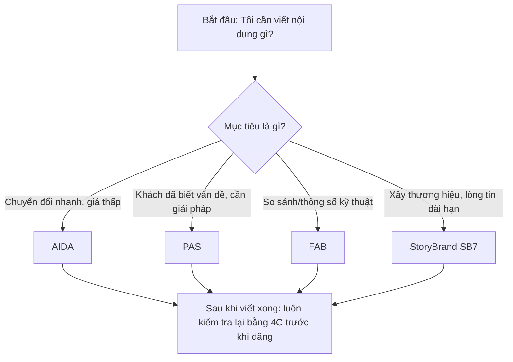
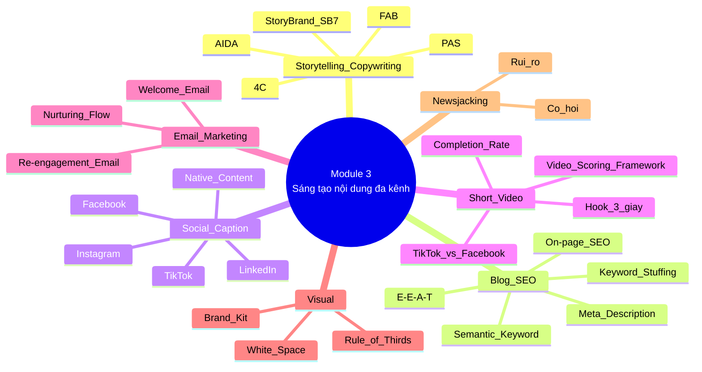

# MODULE 3: SÁNG TẠO NỘI DUNG ĐA KÊNH (MULTI-CHANNEL CONTENT CREATION)
> **(Buổi học 5 - 6 | Thời lượng: 6 giờ)**

> Module này chuyển hóa toàn bộ đầu vào chiến lược từ Module 2 (Persona, Journey, Pillar, Content Calendar, Content Brief) thành sản phẩm nội dung cụ thể: bài blog chuẩn SEO, caption mạng xã hội, video ngắn, email marketing và visual cơ bản. Đồng thời, đây là cầu nối trực tiếp sang Module 4 vì học viên sẽ hiểu rõ cách viết nội dung vừa đúng nền tảng vừa sẵn sàng cho SEO, phân phối và đo lường.

---

## 1. MỤC TIÊU HỌC TẬP

Sau khi hoàn thành Module 3, học viên có thể:

- Chọn đúng công thức storytelling/copywriting theo loại sản phẩm, mục tiêu phễu và độ dài định dạng nội dung.
- Viết được bài blog chuẩn SEO với cấu trúc rõ ràng, đúng checklist On-page SEO và thể hiện E-E-A-T phù hợp.
- Viết caption mạng xã hội theo tư duy native content cho từng nền tảng thay vì copy-paste một nội dung cho mọi kênh.
- Xây dựng kịch bản video ngắn theo cấu trúc Hook - Body - CTA và biết cách đánh giá video trên TikTok/Facebook bằng khung điểm thực chiến.
- Thiết kế được chuỗi nội dung email marketing cơ bản gồm nurturing flow, welcome email và re-engagement email.
- Áp dụng các nguyên tắc visual nền tảng để phối hợp hiệu quả với designer hoặc tự làm nội dung ở mức cơ bản.
- Nhận diện cơ hội và rủi ro khi triển khai newsjacking trend cho thương hiệu.

---

## 2. NỘI DUNG LÝ THUYẾT CHI TIẾT

### 2.1. 5 công thức Storytelling/Copywriting — cách chọn đúng trước khi viết

> **Nguyên tắc cốt lõi:** không có công thức nào tốt nhất cho mọi trường hợp. Cần chọn theo 3 biến số: **(1) loại sản phẩm**, **(2) giai đoạn phễu khách hàng**, **(3) độ dài và định dạng nội dung**. Sai lầm phổ biến của người mới là dùng AIDA cho mọi thứ, kể cả bài blog giáo dục dài, khiến bài viết vừa mỏng vừa thiếu chiều sâu.

#### 2.1.1. AIDA (Attention - Interest - Desire - Action)

**Định nghĩa & cơ chế hoạt động:**
AIDA là mô hình cổ điển mô phỏng 4 trạng thái tâm lý tuần tự của khách hàng: từ chú ý → quan tâm → khao khát → hành động. Cơ chế của AIDA dựa trên **phễu tuyến tính**: nếu không thu hút được Attention, sẽ không tạo được Interest; nếu Interest không đủ mạnh, Desire không hình thành; khi Desire chưa rõ, Action rất khó xảy ra.

| Tiêu chí | Chi tiết |
|---|---|
| Loại sản phẩm phù hợp | FMCG (Fast Moving Consumer Goods), sản phẩm tiêu dùng nhanh, impulse-buy, mỹ phẩm giá thấp, thời trang, đồ ăn vặt, khóa học online giá thấp |
| Hoàn cảnh áp dụng tốt nhất | Quảng cáo trả phí, landing page bán hàng, email flash-sale, livestream chốt đơn nhanh |
| Hoàn cảnh không phù hợp | Sản phẩm B2B phức tạp, giá trị cao; nội dung xây dựng thương hiệu dài hạn |
| Độ dài định dạng | Ngắn: 1 câu ads, 1 landing page, 1 email; không lý tưởng cho bài blog giáo dục dài |

**Ưu điểm:** dễ nhớ, dễ dạy, triển khai nhanh; hiệu quả với nội dung cần hành động tức thời; dễ chuyển thành layout landing page.

**Nhược điểm:** quá tuyến tính so với hành vi hiện đại; dễ biến thành clickbait (chiêu trò giật tít câu khách) nếu Attention quá giật gân nhưng Interest/Desire không đủ lực; thiếu chiều sâu để xây lòng tin dài hạn.

**Đo lường hiệu quả:**

| Bước | Chỉ số đo | Ngưỡng tham khảo |
|---|---|---|
| Attention | CTR tiêu đề/quảng cáo | Facebook Ads: 1-2% tốt, >2% rất tốt |
| Interest | Avg. Time on Page, Scroll Depth | >50% scroll qua nửa trang là tín hiệu tốt |
| Desire | Add-to-cart rate, tỷ lệ điền form | TMĐT: 5-10% add-to-cart trên tổng visit |
| Action | Conversion Rate (CVR) | TMĐT VN: 1-3%; landing page tối ưu tốt: 5-10% |

**Ví dụ áp dụng:**
##### Ví dụ 1: Sản phẩm Robot hút bụi thông minh (Gia dụng/Công nghệ)

* A (Attention): “Bạn đã bao giờ đi làm về muộn mà nhà cửa vẫn đầy bụi và lông thú cưng?”
* I (Interest): “Nhiều người nghĩ robot hút bụi nào cũng giống nhau, cho đến khi họ phải tự gỡ tóc rối ở chổi quét 3 lần một ngày...”
* D (Desire): “Dòng robot X9 có khả năng tự gỡ rối tóc, tự giặt và sấy khô giẻ bằng khí nóng, giúp bạn hoàn toàn rảnh tay suốt 60 ngày.”
* A (Action): “Đặt mua hôm nay để được tặng kèm bộ phụ kiện trị giá 1 triệu đồng.”

##### Ví dụ 2: Dịch vụ Thức ăn giảm cân lành mạnh (F&B/Sức khỏe)

* A (Attention): “Bạn đã bao giờ nhịn ăn khổ sở cả tuần liền mà cân nặng vẫn đứng yên một chỗ?”
* I (Interest): “95% mọi người thất bại khi giảm cân vì họ cố gắng cắt bỏ hoàn toàn tinh bột thay vì kiểm tra tổng lượng calo nạp vào...”
* D (Desire): “Gói ăn 7 ngày được thiết kế cá nhân hóa bởi chuyên gia dinh dưỡng, giao tận nơi mỗi sáng, giúp bạn giảm 1-2kg tự nhiên mà không bị mệt mỏi.”
* A (Action): “Nhận thực đơn dùng thử ngay bằng cách nhắn tin cho chúng tôi.”

##### Ví dụ 3: Phần mềm Quản lý bán hàng cho chủ shop (B2B/SaaS)

* A (Attention): “Bạn đã bao giờ mất cả tiếng đồng hồ cuối ngày chỉ để kiểm kho và đối soát doanh thu bằng sổ tay?”
* I (Interest): “Hầu hết các chủ shop bị thất thoát từ 5-10% doanh thu mỗi tháng chỉ vì sai sót trong lúc tính tiền và quản lý tồn kho thủ công...”
* D (Desire): “Phần mềm X-Shop giúp tự động hóa 100% quy trình quét mã vạch, quản lý đơn hàng đa kênh trên một màn hình, đã có hơn 2.000 chủ shop tin dùng.”
* A (Action): “Đăng ký dùng thử miễn phí 14 ngày ngay tại đây.”


#### 2.1.2. PAS (Problem - Agitate - Solution)

**Định nghĩa & cơ chế hoạt động:**
PAS khai thác tâm lý **loss aversion** — con người sợ mất mát hơn là hứng thú với lợi ích tương đương. Điểm then chốt là bước **Agitate**: khoét sâu hậu quả của việc không hành động, rồi giải tỏa áp lực bằng Solution.

| Tiêu chí | Chi tiết |
|---|---|
| Loại sản phẩm phù hợp | Sản phẩm giải quyết nỗi đau rõ: dược mỹ phẩm trị mụn/nám, bảo hiểm, pháp lý, phần mềm giải quyết pain point vận hành, khóa học “chữa” điểm yếu cụ thể |
| Hoàn cảnh áp dụng tốt nhất | Bài blog dạng vấn đề, quảng cáo remarketing, email giải quyết pain point, video cảnh báo |
| Hoàn cảnh không phù hợp | Sản phẩm lifestyle/quà tặng/du lịch/giải trí thuần cảm xúc tích cực; sản phẩm xa xỉ mua vì khát vọng hơn là nỗi đau |
| Độ dài định dạng | Trung bình: mở đầu blog 150-300 từ, long-form ad, email 1 chủ đề |

**Ưu điểm:** chuyển đổi tốt với khách đã nhận thức vấn đề; tạo cảm giác được thấu hiểu; dễ kết hợp với FAB ở phần Solution.

**Nhược điểm:** rủi ro đạo đức cao nhất nếu khuấy động (agitate) quá đà; gây mệt mỏi cảm xúc nếu lặp lại thường xuyên; kém hiệu quả với cold audience chưa nhận ra vấn đề.

**Đo lường hiệu quả:**

| Chỉ số | Ý nghĩa |
|---|---|
| Relevance Score / Quality Ranking | Phát hiện sớm nội dung gây phản cảm hay không |
| Tỷ lệ comment tiêu cực / report | Cảnh báo nếu Agitate bị đẩy quá tay |
| CVR theo từng nhóm remarketing | PAS thường mạnh hơn rõ rệt ở nhóm đã biết vấn đề |
| Heatmap/scroll map đoạn Agitate | Nếu thoát mạnh ở đây, cách viết đang gây khó chịu |

**Ví dụ áp dụng:**
> **P**: “Da bạn xuất hiện mụn ẩn nhưng chưa biết nguyên nhân?”  
> **A**: “Nếu xử lý sai cách, mụn ẩn có thể thành mụn viêm, để lại thâm sẹo và làm bạn mất tự tin lâu dài.”  
> **S**: “Serum X với BHA 2% giúp làm sạch sâu lỗ chân lông, giảm nguy cơ hình thành mụn ẩn mới chỉ sau 2 tuần sử dụng đúng cách.”

##### Ví dụ 1: Gối công thái học chống đau cổ vai gáy (Sức khỏe/Đời sống)

* P (Problem): “Bạn thường xuyên thức dậy với cảm giác đau mỏi cổ và ê ẩm khắp bả vai?”
* A (Agitate): “Nếu kéo dài, tình trạng này sẽ dẫn đến thoái hóa đốt sống cổ, gây mất ngủ kinh niên và làm bạn kiệt sức mỗi ngày đi làm.”
* S (Solve): “Gối công thái học Memory Foam giúp định hình tư thế ngủ chuẩn y khoa, nâng đỡ tối đa vùng cổ để bạn ngủ sâu giấc và thức dậy tràn đầy năng lượng.”

##### Ví dụ 2: Khóa học Tiếng Anh giao tiếp (Giáo dục)

* P (Problem): “Bạn học tiếng Anh nhiều năm nhưng luôn ngập ngừng, sợ hãi khi phải nói chuyện với người nước ngoài?”
* A (Agitate): “Sự tự ti này đang khiến bạn đánh mất những cơ hội thăng tiến xứng đáng, mãi dậm chân tại chỗ với mức lương trung bình.”
* S (Solve): “Khóa học giao tiếp phản xạ 1 kèm 1 giúp bạn làm chủ 500 mẫu câu thông dụng nhất, tự tin làm việc với sếp Tây chỉ sau 3 tháng.”

##### Ví dụ 3: Bộ lọc nước tại vòi (Gia dụng)

* P (Problem): “Nước sinh hoạt nhà bạn thỉnh thoảng có mùi clo nồng nặc hoặc chuyển màu vàng nhạt?”
* A (Agitate): “Dùng nguồn nước nhiễm tạp chất này để nấu ăn, tắm rửa hàng ngày sẽ âm thầm tích tụ độc tố vào cơ thể và gây kích ứng da nghiêm trọng cho trẻ nhỏ.”
* S (Solve): “Bộ lọc nước tại vòi 5 lõi nano giúp loại bỏ 99% vi khuẩn, kim loại nặng và mùi hôi ngay lập tức, trả lại nguồn nước thanh mát an toàn cho cả gia đình.”

#### 2.1.3. FAB (Feature - Advantage - Benefit)

**Định nghĩa & cơ chế hoạt động:**
FAB (Feature – Advantage – Benefit) là kỹ thuật dịch thuật ngữ chuyên môn sang ngôn ngữ của khách hàng. Công thức này biến các thông số kỹ thuật khô khan thành những lý do thuyết phục khiến khách hàng muốn mua hàng ngay lập tức.
Mô hình này gồm 3 phần cốt lõi:

* F - Feature (Tính năng): Sản phẩm có cái gì? (Thông số, thành phần, đặc điểm kỹ thuật).
* A - Advantage (Ưu thế): Tính năng đó giúp sản phẩm làm được gì tốt hơn, khác biệt gì so với đối thủ?
* B - Benefit (Lợi ích): Khách hàng nhận được giá trị gì? Cuộc sống/công việc của họ tốt lên như thế nào? (Đây là phần quan trọng nhất giúp chốt đơn).


| Tiêu chí | Chi tiết |
|---|---|
| Loại sản phẩm phù hợp | Điện tử, đồ gia dụng, ô tô, SaaS B2B, bất động sản, thực phẩm chức năng, sản phẩm có thông số rõ |
| Hoàn cảnh áp dụng tốt nhất | Trang chi tiết sản phẩm, nội dung so sánh, brochure, tư vấn bán hàng, catalogue |
| Hoàn cảnh không phù hợp | Sản phẩm cảm xúc thuần túy như nghệ thuật, nước hoa, trải nghiệm dịch vụ khó diễn đạt bằng thông số |
| Độ dài định dạng | Ngắn - trung bình, đặc biệt hợp bullet point và bảng so sánh |

**Ví dụ:**
Feature: “Bình giữ nhiệt 2 lớp Inox 304” → Advantage: “Giữ nhiệt tới 12 giờ, chống trầy xước, an toàn thực phẩm” → Benefit: “Bạn có thể mang cà phê nóng theo suốt ngày làm việc mà không lo nguội hoặc ảnh hưởng sức khỏe.”

**Ưu điểm:** logic, dễ kiểm chứng, hợp buyer lý tính; dễ tái sử dụng theo module; giảm rủi ro “nói quá” vì luôn neo vào fact.

**Nhược điểm:** dễ khô khan nếu không đẩy đến Benefit rõ; ít tạo cảm xúc dài hạn; dễ hòa lẫn nếu đối thủ có thông số tương tự nhưng bạn không làm rõ USP thực sự.

**Đo lường hiệu quả:**

| Chỉ số | Ý nghĩa |
|---|---|
| Time on Product Detail Page | FAB tốt giữ người đọc ở lại lâu hơn |
| Compare Rate | Khách tự tin hơn khi đặt sản phẩm vào bàn so sánh |
| Tỷ lệ câu hỏi lặp lại trong chat/inbox | Nếu khách vẫn hỏi lại, FAB chưa đủ Clear |
| Tỷ lệ hoàn/đổi trả vì “không đúng kỳ vọng” | Phản ánh Benefit có bị thổi phồng hay không |


##### Ví dụ 1. Apple iPod (Chiến dịch marketing đi vào lịch sử)

* Feature: Bộ nhớ trong dung lượng 5GB.
* Advantage: Chứa được dung lượng dữ liệu lớn hơn tất cả các máy MP3 thời bấy giờ trong một thiết bị nhỏ gọn.
* Benefit: "1.000 bài hát ngay trong túi quần của bạn" (Khách hàng không quan tâm 5GB là gì, họ chỉ quan tâm họ mang được toàn bộ kho nhạc đi khắp nơi).

##### Ví dụ 2. Xe máy điện VinFast Evo200

* Feature: Sử dụng pin LFP tiên tiến kết hợp động cơ công suất 1500W.
* Advantage: Giúp xe có khả năng di chuyển quãng đường lên tới 203 km chỉ sau một lần sạc đầy và vận tốc tối đa 70 km/h.
* Benefit: Bạn thoải mái đi làm, đi chơi cả tuần không lo hết điện, tiết kiệm tối đa chi phí nhiên liệu so với xe xăng và không sợ chết máy khi đường ngập lụt.

------------------------------
##### 📐 Tóm tắt tư duy viết FAB
Khi viết nội dung theo FAB, bạn hãy dùng các từ nối thần thánh sau để liên kết các vế:

* [Tính năng] + "giúp cho/cho phép" + [Ưu thế] + "nhờ đó bạn có thể/mang lại cho bạn" + [Lợi ích]


#### 2.1.4. 4C (Clear - Concise - Compelling - Credible)

**Định nghĩa & cơ chế hoạt động:**
4C không phải công thức viết theo trình tự mà là **bộ lọc chất lượng** để kiểm tra bất kỳ nội dung nào trước khi đăng. Vai trò của 4C giống một “quality gate” trong quy trình biên tập.

| Tiêu chí | Chi tiết |
|---|---|
| Loại sản phẩm phù hợp | Mọi loại sản phẩm |
| Hoàn cảnh áp dụng tốt nhất | Bước biên tập/kiểm duyệt cuối cùng trước khi xuất bản |
| Hoàn cảnh không phù hợp | Không dùng thay thế AIDA/PAS/FAB/SB7 khi bắt đầu viết nháp |
| Độ dài định dạng | Áp dụng cho mọi độ dài |

**Ưu điểm:** chuẩn hóa chất lượng team content; dễ biến thành rubric chấm điểm; phát hiện lỗi mà công thức khác không tự phát hiện.

**Nhược điểm:** vẫn có yếu tố chủ quan nếu không có rubric; không hỗ trợ khi bí ý tưởng ở giai đoạn viết nháp.

**Gợi ý thang điểm 4C (1-5/tiêu chí):**

| Tiêu chí | 1 điểm | 3 điểm | 5 điểm |
|---|---|---|---|
| Clear | Phải đọc lại mới hiểu | Hiểu được nhưng còn gợn | Hiểu ngay lần đọc đầu |
| Concise | Nhiều ý thừa, lặp | Còn 1-2 câu dư | Không câu nào thừa |
| Compelling | Không kích hoạt cảm xúc/hành động | Có chú ý nhưng chưa kéo tiếp | Muốn đọc tiếp/hành động ngay |
| Credible | Không nguồn, không minh chứng | Có dẫn chứng nhưng mờ | Có số liệu, nguồn uy tín, ví dụ cụ thể |

**Đo lường hiệu quả:** Bounce Rate, Time on Page, Revision Rate nội bộ và điểm rubric trung bình qua từng tháng.

#### 2.1.5. StoryBrand SB7 (Donald Miller) & nguyên tắc Hero - Guide

**Định nghĩa & cơ chế hoạt động:**
SB7 dựa trên logic của **Hero’s Journey**, nhưng đơn giản hóa thành 7 bước cho marketing. Trọng tâm quan trọng nhất là:

> **Khách hàng là Hero, thương hiệu là Guide.** Hero có mục tiêu và vấn đề; Guide chỉ xuất hiện để thấu hiểu và dẫn đường. Sai lầm phổ biến của thương hiệu là biến mình thành nhân vật chính, nói quá nhiều về “chúng tôi” thay vì “bạn sẽ đạt được điều gì”.

**Một Guide đáng tin cần có 2 yếu tố:**
- **Empathy:** “Chúng tôi hiểu bạn đang gặp vấn đề gì.”
- **Authority:** “Chúng tôi có đủ năng lực/chứng cứ để giúp bạn.”

**Khung 7 bước SB7:**

| Bước | Vai trò |
|---|---|
| 1. Character | Khách hàng là nhân vật chính, có mục tiêu rõ |
| 2. Problem | Vấn đề bên ngoài, bên trong và triết lý |
| 3. Guide | Thương hiệu xuất hiện với empathy + authority |
| 4. Plan | Các bước đơn giản, dễ làm theo |
| 5. Call to Action | CTA trực tiếp và CTA chuyển tiếp |
| 6. Failure | Hậu quả nếu không hành động |
| 7. Success | Viễn cảnh thành công sau khi dùng giải pháp |

| Tiêu chí | Chi tiết |
|---|---|
| Loại sản phẩm phù hợp | Giáo dục, tài chính cá nhân, sức khỏe, coaching/tư vấn, personal branding, sản phẩm chu kỳ mua dài |
| Hoàn cảnh áp dụng tốt nhất | Homepage, About Us, chuỗi email nurturing, video thương hiệu, content pillar dài kỳ |
| Hoàn cảnh không phù hợp | Flash-sale, quảng cáo cần chuyển đổi tức thì |
| Độ dài định dạng | Dài: website, series nội dung, video thương hiệu, email nhiều kỳ |

**Ưu điểm:** xây lòng tin bền vững; tránh lỗi “tự sướng”; dễ chuyển thành outline cho chuỗi nội dung.

**Nhược điểm:** phức tạp hơn AIDA/PAS; cần luyện để không rơi vào giọng Hero; khó đo hiệu quả bằng chỉ số ngắn hạn.

**Đo lường hiệu quả:**

| Chỉ số | Ý nghĩa |
|---|---|
| CVR của Homepage/Landing Page thương hiệu | So sánh trước/sau khi viết lại theo SB7 |
| Time on Page + Scroll Depth trang giới thiệu | Đo độ cuốn vào câu chuyện |
| Brand Lift Survey | Đo thiện cảm và mức ghi nhớ thương hiệu |
| Customer Lifetime Value (CLV) | SB7 mạnh ở giữ chân và xây niềm tin dài hạn |

------------------------------
##### Ví dụ áp dụng

StoryBrand SB7 là một framework marketing đi vào lịch sử của Donald Miller [💡]. Triết lý cốt lõi của mô hình này là: Khách hàng là Anh hùng (Hero), còn Doanh nghiệp là Người dẫn đường (Guide).
Trong ngành Thẩm mỹ viện (TMV), các thương hiệu thường mắc sai lầm lớn là tự biến mình thành "Hero" (khoe khoang công nghệ triệu đô, cúp giải thưởng, bác sĩ giỏi nhất). Điều này khiến khách hàng thờ ơ. Theo SB7, khách hàng chỉ quan tâm đến bản thân họ, và họ đang tìm một "Guide" có đủ tâm và tầm để giúp họ giải quyết nỗi đau [💡].


##### 🧱 Sơ đồ 7 bước StoryBrand SB7 trong ngành Thẩm mỹ viện

###### Bước 1: A Character (Nhân vật chính - Hero)

* Định nghĩa: Khách hàng mục tiêu của bạn. Họ muốn gì?
* Ví dụ: Phụ nữ tuổi 30-45, làm văn phòng hoặc kinh doanh, mong muốn sở hữu một làn da sạch nám, trẻ trung để tự tin trong giao tiếp và giữ lửa hạnh phúc gia đình.

###### Bước 2: Has a Problem (Gặp một Vấn đề)
SB7 chia vấn đề thành 3 cấp độ:

* Vấn đề bên ngoài (External): Da bị nám mảng, tàn nhang đậm màu sau sinh. Đã dùng nhiều kem trộn, đi nhiều nơi không khỏi.
* Vấn đề bên trong (Internal): Cảm thấy tự ti, già nua trước tuổi, sợ chồng chán, ngại đứng trước đám đông.
* Vấn đề triết học (Philosophical - Điều này thật bất công!): Phụ nữ hiện đại vừa lo việc nước vừa đảm việc nhà, họ xứng đáng được xinh đẹp và hạnh phúc chứ không phải gánh chịu làn da tàn phai vì hy sinh cho gia đình.

###### Bước 3: And Meets a Guide (Và gặp Người dẫn đường - TMV của bạn)
Đây là lúc TMV xuất hiện ở vai trò Guide dựa trên 2 yếu tố:

* Sự đồng cảm (Empathy): "Chúng tôi hiểu rằng nám không chỉ làm đau làn da, mà còn bào mòn sự tự tin bên trong bạn suốt nhiều năm qua."
* Năng lực (Authority): Minh chứng bằng hình ảnh trước/sau (Before/After) của 5.000 ca điều trị thành công, chứng nhận phác đồ chuẩn y khoa từ Bộ Y tế.

###### Bước 4: Who Gives Them a Plan (Người đưa ra một Kế hoạch)
Khách hàng sợ bị lừa hoặc sợ quy trình phức tạp. Bạn phải cho họ một kế hoạch 3 bước cực kỳ đơn giản để xóa bỏ nỗi sợ:

* Bước 1 (Khám): Soi da đa tầng miễn phí bằng máy AI để định vị chính xác gốc nám.
* Bước 2 (Trị): Điều trị 1-on-1 bằng phác đồ cá nhân hóa (không bong tróc, không nghỉ dưỡng).
* Bước 3 (Dưỡng): Cấp thẻ bảo hành văn bản và hướng dẫn chăm sóc da miễn phí tại nhà.

###### Bước 5: And Calls Them to Action (Thúc đẩy họ Hành động)

* Kêu gọi trực tiếp (Direct CTA): "Đặt lịch soi da và nhận phác đồ miễn phí ngay hôm nay."
* Kêu gọi chuyển tiếp (Transitional CTA - Dành cho người chưa sẵn sàng mua ngay): Tặng Ebook miễn phí: "7 sai lầm kinh điển tại nhà khiến nám đậm màu hơn gấp 2 lần".

###### Bước 6: That Helps Them Avoid Failure (Giúp họ Tránh khỏi Thất bại)
Vẽ ra viễn cảnh tồi tệ nếu họ không hành động hoặc chọn sai nơi:

* Nám ăn sâu vào tầng hạ bì, thể nám biến chứng thành nám đen rất khó chữa trị.
* Tốn thêm hàng chục triệu đồng cho các cơ sở kem trộn kém chất lượng làm hỏng hàng rào bảo vệ da vĩnh viễn.

###### Bước 7: And Results in Success (Và dẫn đến Kết quả Thành công)
Bức tranh rực rỡ ở cuối câu chuyện:

* Sở hữu làn da mộc sáng hồng, mịn màng, trẻ trung ra 5-7 tuổi.
* Tự tin diện những bộ váy yêu thích, ngẩng cao đầu thăng tiến trong công việc và rạng rỡ hạnh phúc bên người bạn đời.

------------------------------
##### ✍️ Ví dụ kịch bản Landing Page / Bài viết bán hàng chuẩn StoryBrand SB7
Dưới đây là bảng chuyển hóa nội dung bài viết và kịch bản quảng cáo theo đúng 7 bước của framework StoryBrand SB7 để bạn dễ dàng theo dõi và đối chiếu:

| Bước trong SB7 | Vai trò / Yếu tố cốt lõi | Nội dung bài viết (Landing Page / Post) | Kịch bản Video ngắn (60 giây) |
|---|---|---|---|
| 1. Character (Nhân vật) | Hero: Nhắm vào chân dung và mong muốn lớn nhất của khách hàng. | [Tiêu đề] Đánh thức làn da sáng mịn tuổi 20: Tự tin rạng rỡ, làm chủ hạnh phúc của chính bạn! | Hình ảnh: Chị Mai (35 tuổi) đượm buồn đứng trước gương, sờ lên má. Voiceover: Đây là chị Mai. Suốt 3 năm qua, chị không dám soi gương quá 5 giây... |
| 2. Problem (Vấn đề) | Nỗi đau: Gọi tên khó khăn (External), sự tự ti (Internal) và sự bất công (Philosophical). | Bạn có đang trốn tránh chiếc gương vì nám mảng sau sinh? Đi đủ spa nhưng vẫn tái phát, để lại cảm giác bất an trước bạn đời? Điều này thật bất công với những hy sinh của bạn! | Hình ảnh: Chị Mai tủi thân từ chối lời mời đi tiệc của đồng nghiệp. Voiceover: Chị tốn hàng chục triệu dùng thử đủ loại kem nhưng nám ngày càng đậm màu. Chị thấy bất an và hoàn toàn bế tắc. |
| 3. Meets a Guide (Gặp người dẫn đường) | Thương hiệu: Thể hiện sự đồng cảm (Empathy) và năng lực chuyên môn (Authority). | Tại TMV [X], chúng tôi tin mọi phụ nữ đều xứng đáng có làn da không tì vết. Với sự đồng cảm dành cho 5.000 phụ nữ Việt, đội ngũ bác sĩ mang đến giải pháp chuẩn y khoa. | Hình ảnh: Chị Mai bước vào TMV [X]. Bác sĩ mỉm cười đón tiếp, ân cần lắng nghe và soi da cho chị. Voiceover: Cho đến khi chị gặp bác sĩ tại TMV [X] với sự thấu hiểu sâu sắc... |
| 4. Gives Them a Plan (Trao một kế hoạch) | Vũ khí: Đưa ra lộ trình ngắn gọn (thường là 3 bước) để xóa bỏ sự mơ hồ, lo lắng. | Hành trình xóa nám chưa bao giờ đơn giản đến thế: 1. Soi da AI phân tích gốc nám. 2. Trị liệu laser cá nhân hóa. 3. Cam kết bảo hành bằng văn bản. | Hình ảnh: Tua nhanh cảnh bác sĩ chỉ gốc nám trên máy AI, điều trị laser nhẹ nhàng và hướng dẫn chị bôi kem dưỡng tại nhà. Voiceover: Một kế hoạch 3 bước chuẩn y khoa, không bong tróc, an toàn tận gốc. |
| 5. Calls to Action (Kêu gọi hành động) | Chốt đơn: Đưa ra lời kêu gọi rõ ràng, trực tiếp kèm theo yếu tố thúc giục giới hạn. | 👉 Nhấp vào nút "ĐĂNG KÝ NGAY" bên dưới để nhận 1 suất soi da miễn phí và giảm giá 50%! (Chỉ áp dụng cho 20 người đăng ký sớm nhất tuần này). | Hình ảnh: Bác sĩ và chị Mai cùng mỉm cười, màn hình hiện nút đăng ký. Voiceover: Đừng để nám làm mờ sự tự tin. Nhấp vào nút Đăng ký ngay để bác sĩ tư vấn miễn phí hôm nay! |
| 6. Avoid Failure (Tránh khỏi thất bại) | Hậu quả: Cảnh báo rủi ro nếu họ trì hoãn hoặc chọn sai giải pháp trôi nổi. | Đừng tiếp tục đánh cược làn da vào những hũ kem trộn trôi nổi khiến da bị bào mòn và tổn thương vĩnh viễn. | Hình ảnh: Cảnh quay nhanh các hũ kem không nhãn mác, da mặt mô phỏng bị đỏ ửng. Voiceover: Nếu cứ bôi kem trộn sai cách, làn da sẽ bị bào mòn và tổn thương vĩnh viễn. |
| 7. Results in Success (Kết quả thành công) | Phần thưởng: Bức tranh tương lai rực rỡ, viên mãn sau khi người hùng chiến thắng. | [Lồng ghép ở phần tiêu đề và kết bài]: Lấy lại 10 năm thanh xuân một cách an toàn, sở hữu làn da mộc sáng hồng, tự tin tỏa sáng. | Hình ảnh: Chị Mai diện váy đẹp, làn da mộc sáng mịn không còn vết nám, tự tin cười rạng rỡ chụp ảnh. Voiceover: Và đây là kết quả! Chị Mai của ngày hôm nay: tự tin, hạnh phúc với làn da mộc tuổi đôi mươi. |


------------------------------
##### 🎬 Kịch bản Video ngắn: "Hành trình lột xác của Hero"

* Bối cảnh: Tại Thẩm mỹ viện và phòng ngủ của khách hàng.
* Nhân vật: Chị Mai (35 tuổi) - Da bị nám nặng sau sinh (Đóng vai Hero). Bạn - Bác sĩ/Chuyên gia (Đóng vai Guide).

| Thời lượng | Hình ảnh (Video) | Âm thanh / Lời thoại (Voiceover) | Bước SB7 áp dụng |
|---|---|---|---|
| 0s - 10s | Cận cảnh gương mặt đượm buồn của chị Mai đang đứng trước gương, tay sờ lên những mảng nám đậm màu trên má. Sau đó là cảnh chị Mai cúi gục đầu từ chối lời mời đi tiệc của đồng nghiệp qua điện thoại. | "Đây là chị Mai. Suốt 3 năm qua, chị không dám soi gương quá 5 giây và luôn từ chối mọi buổi tiệc tùng chỉ vì những mảng nám sau sinh đáng ghét này..." | 1. Character & 2. Problem (Mở đầu bằng nhân vật và nỗi đau thầm kín của họ). |
| 10s - 20s | Chị Mai mở tủ ra thấy đầy rẫy các hũ kem không rõ nguồn gốc, cảnh da mặt bị đỏ ửng, bong tróc do dùng sai cách. | "Chị đã thử đủ loại kem trộn, tốn hàng chục triệu đi các spa nhỏ nhưng nám ngày càng đậm màu hơn. Chị bất an, sợ chồng chán và cảm thấy hoàn toàn bế tắc." | 6. Avoid Failure (Xoáy sâu vào hậu quả nếu tự chữa sai cách). |
| 20s - 35s | Cảnh chị Mai bước vào TMV của bạn. Bác sĩ (chính là bạn) mỉm cười đón tiếp, ân cần lắng nghe, soi da bằng máy AI và chỉ cho chị thấy gốc nám trên màn hình máy tính. | "Cho đến khi chị gặp bác sĩ tại TMV [X]. Với sự thấu hiểu và phác đồ trị nám đa tầng chuẩn y khoa, chúng tôi đã trao cho chị một kế hoạch 3 bước rõ ràng để lấy lại làn da thanh xuân." | 3. Meets a Guide & 4. Gives a Plan (Người dẫn đường xuất hiện đồng cảm và đưa ra vũ khí). |
| 35s - 50s | Cảnh tua nhanh (Time-lapse) chị Mai đang nằm điều trị bằng máy laser (rất nhẹ nhàng, chị Mai cười tươi trò chuyện). Cảnh chị Mai tự tin bôi kem dưỡng tại nhà. | "Không bong tróc, không đau rát. Gốc nám sâu dưới da được bóc tách và phân hủy tận gốc một cách an toàn nhất." | 4. Gives a Plan (Hành động theo kế hoạch) |
| 50s - 55s | Cảnh quay cận cảnh làn da hiện tại: sáng hồng, mịn màng, không còn vết nám. Chị Mai diện một chiếc váy thật đẹp, tự tin cười rạng rỡ và tự sướng trước gương. | "Và đây là kết quả! Chị Mai của ngày hôm nay: tự tin, hạnh phúc và rạng rỡ với làn da mộc sáng mịn như tuổi đôi mươi." | 7. Results in Success (Bức tranh chiến thắng rực rỡ của người hùng). |
| 55s - 60s | Bác sĩ xuất hiện bên cạnh chị Mai, chỉ tay vào nút đăng ký trên màn hình. Hiển thị chữ: "Đăng ký soi da miễn phí". | "Đừng để nám làm mờ đi sự tự tin của bạn. Nhấp vào nút Đăng ký ngay để bác sĩ tư vấn phác đồ miễn phí cho riêng bạn hôm nay nhé!" | 5. Calls to Action (Lời kêu gọi hành động quyết định). |

------------------------------
##### 💡 3 Lưu ý "sống còn" khi làm video theo dạng này

   1. Dùng góc nhìn thứ nhất của Hero: Hãy để khách hàng tự nói lên nỗi đau của họ (hoặc dùng giọng Voiceover kể chuyện trầm ấm, đồng cảm). Tuyệt đối không để bác sĩ nhảy vào "cướp diễn đàn" nói quá nhiều về thông số máy móc ở 15 giây đầu.
   2. Kỹ thuật tương phản (Contrast): Nửa đầu video tông màu nên hơi tối, nhạc trầm buồn để lột tả sự bế tắc của Hero. Nửa sau video (sau khi gặp Guide) tông màu sáng bừng, nhạc vui tươi, năng động để đẩy cảm xúc người xem lên cao.
   3. Vũ khí hóa dịch vụ của bạn: Trong bộ phim Star Wars, cụ già Yoda (Guide) trao cho Luke Skywalker (Hero) cây kiếm ánh sáng (Vũ khí). Tại TMV của bạn cũng vậy, phác đồ điều trị hay chiếc máy Laser chính là "cây kiếm ánh sáng" mà bạn trao cho khách hàng để họ tự chiến đấu với tên quái vật mang tên "Nám da".

Dạng video "Hành trình lột xác của Hero" này có tỷ lệ chuyển đổi khách hàng cực kỳ cao vì người xem nhìn thấy chính họ trong câu chuyện của nhân vật.

##### Kịch bản video TikTok
Dưới đây là bảng chi tiết kịch bản và cấu trúc quay dựng cho cả 3 dạng video TikTok ngắn hiệu quả nhất trong ngành thẩm mỹ viện, giúp tối ưu tỷ lệ giữ chân người xem và chuyển đổi thành khách hàng:
###### Bảng cấu trúc 3 kịch bản TikTok thực chiến

| Tiêu chí | Kiểu 1: Kịch bản "Trước - Sau" (Thị giác) | Kiểu 2: Kịch bản "Tâm sự / POV" (Cảm xúc) | Kiểu 3: Kịch bản "Bác sĩ bóc phốt" (Chuyên gia) |
|---|---|---|---|
| 0s - 3s (Hook / Giữ chân) | Hình ảnh: Cận cảnh mảng nám đậm màu, sần sùi của khách hàng (Hero). Lời thoại: "Đừng vội đi laser nếu chưa biết bí mật này về nám sau sinh!" | Hình ảnh: Khách ngồi phòng tư vấn tối đèn, quay lưng/góc nghiêng đượm buồn. Lời thoại: "Nhiều lúc em chỉ muốn đập hết gương trong nhà, không muốn chồng nhìn thẳng mặt..." | Hình ảnh: Bác sĩ (Guide) chỉ tay vào hũ kem trộn hoặc clip lột da độc hại trên mạng. Lời thoại: "Dừng ngay việc bôi thứ này nếu không muốn nám đen ăn hỏng cả da!" |
| 3s - 15s (Xoáy nỗi đau / Tránh thất bại) | Hình ảnh: Cảnh khách dùng kem trôi nổi, da mặt mô phỏng bị đỏ ửng, rát. Lời thoại: "Chị khách này đã đổi 5 loại kem, mặt bong tróc nhưng gốc nám ngày càng đậm do làm sai cách." | Hình ảnh: Khách lấy tay lau nước mắt, đan chặt ngón tay thể hiện sự bất an. Lời thoại: "Từ lúc sinh bé xong nám lên đầy 2 má. Đi làm đồng nghiệp quở, về nhà ngại với chồng. Em stress mất ngủ." | Hình ảnh: Bác sĩ cầm mô hình da hoặc vẽ sơ đồ mô phỏng tầng hạ bì bị tổn thương. Lời thoại: "Nhiều bạn thấy nám là mua kem lột tẩy. Nó chỉ làm trắng ảo bề mặt, nhưng lại kích thích gốc nám hạ bì trồi lên." |
| 15s - 30s (Giải pháp / Trao kế hoạch) | Hình ảnh: Bác sĩ đón tiếp, dùng máy AI quét da và đi máy laser công nghệ cao nhẹ nhàng. Lời thoại: "Tại [X], bác sĩ dùng máy AI định vị gốc nám sâu tầng hạ bì để lên phác đồ cá nhân hóa, không bào mòn da." | Hình ảnh: Bác sĩ bật đèn phòng lên, ân cần đưa khăn giấy và bắt đầu soi da cho khách. Lời thoại: "Nám không chỉ là bệnh lý, nó là vết thương tâm lý của phụ nữ. Chúng tôi ở đây để trả lại sự tự tin cho bạn." | Hình ảnh: Bác sĩ chỉ tay vào bảng quy trình 3 bước chuẩn y khoa hiển thị trên màn hình. Lời thoại: "Trị nám đúng cách phải qua 3 bước: Một là soi da AI, hai là laser xung ngắn, ba là phục hồi hàng rào bảo vệ da." |
| 30s - 45s (Kết quả & Lời kêu gọi) | Hình ảnh: Cận cảnh da mộc khách hàng trắng hồng, căng bóng. Khách diện váy đẹp cười tươi. Lời thoại: "Và đây là kết quả! Da sạch nám, tự tin đón Tết. Nhấp vào link tiểu sử để nhận suất soi da AI miễn phí!" | Hình ảnh: Khách hàng quay mặt lại nhìn thẳng ống kính, cười rạng rỡ, tự tin vuốt tóc. Lời thoại: "Biết thế em đã đi điều trị sớm hơn tại [X]. Giờ em tự tin để mặt mộc ra đường rồi!" | Hình ảnh: Bác sĩ mỉm cười, giơ điện thoại hiển thị trang đặt lịch hoặc chỉ xuống góc màn hình. Lời thoại: "Ai đang bị nám mảng sau sinh, để lại tình trạng da bên dưới, bác sĩ tư vấn phác đồ miễn phí cho nhé!" |

------------------------------
###### 🛠️ Bảng quy tắc kỹ thuật vận hành video TikTok
Để các kịch bản trên đạt hiệu quả hiển thị tốt nhất trên thuật toán TikTok, bạn cần tuân thủ các tiêu chuẩn kỹ thuật sau:

| Yếu tố kỹ thuật | Tiêu chuẩn bắt buộc | Mục đích thực chiến |
|---|---|---|
| Hình ảnh & Ánh sáng | Quay dọc tỷ lệ 9:16, độ phân giải 1080p hoặc 4K. Sử dụng đèn Ring-light hoặc Softbox chiếu góc 45 độ để da khách hàng và bác sĩ sáng đều, không bị đổ bóng che khuất khuyết điểm da. | Ngành thẩm mỹ đòi hỏi tính "sạch sẽ, cao cấp". Video mờ, tối sẽ bị người xem đánh giá là cơ sở kém uy tín và quẹt qua ngay. |
| Âm thanh & Nhạc nền | Giọng nói (Voiceover) thu bằng mic cài áo (Wireless mic) rõ ràng, không lẫn tạp âm. Nhạc nền lấy từ danh sách Trending Audio của TikTok, hạ âm lượng xuống mức 5% - 10% để làm nền. | Giọng nói rõ ràng giúp giữ chân người xem lâu hơn. Nhạc xu hướng giúp thuật toán của TikTok dễ dàng nhận diện và đẩy video vào luồng đề xuất. |
| Chữ hiển thị (Text On Screen) | Chạy phụ đề (Subtitle) toàn bộ video. Tận dụng các từ khóa kích thích thị giác như: [Nám sau sinh], [Hỏng da], [Xóa sạch] và tô màu nổi bật (Vàng hoặc Đỏ). | 80% người dùng có thói quen đọc chữ trước khi nghe, hoặc xem TikTok ở chế độ tắt tiếng tại nơi công cộng. Chữ to, rõ giúp họ nắm bắt nội dung ngay lập tức. |
| Tiêu đề & Hashtag (SEO TikTok) | Đặt tiêu đề mô tả chứa từ khóa chính (Ví dụ: Cách trị nám sau sinh hiệu quả). Gắn 4-5 Hashtag chuẩn: #trimun [địa_phương], #kinhnghiemlamdep, #reviewspa, #[ten_thuong_hieu_cua_ban]. | Giúp video của bạn hiển thị đầu tiên khi khách hàng chủ động tìm kiếm các từ khóa về điều trị da trên thanh tìm kiếm của TikTok. |


#### 2.1.6. Bảng so sánh tổng hợp 5 công thức

| Công thức | Cơ chế tâm lý | Loại sản phẩm lý tưởng | Giai đoạn phễu | Ưu điểm nổi bật | Nhược điểm chính | KPI chính |
|---|---|---|---|---|---|---|
| **AIDA** | Phễu tuyến tính, kích thích tức thời | FMCG, impulse-buy, giá thấp | TOFU → BOFU nhanh | Dễ dùng, chuyển đổi nhanh | Dễ clickbait, thiếu chiều sâu | CTR, CVR |
| **PAS** | Loss aversion, áp lực vấn đề | Sản phẩm giải pain point rõ | MOFU → BOFU | Chuyển đổi cao với remarketing | Rủi ro fear-mongering | CVR, report rate |
| **FAB** | Suy luận lý tính | Sản phẩm kỹ thuật/thông số | MOFU | Logic, dễ kiểm chứng | Dễ khô nếu thiếu Benefit | Time on PDP, compare rate |
| **4C** | Bộ lọc chất lượng | Mọi sản phẩm | Mọi giai đoạn | Chuẩn hóa team content | Chủ quan nếu thiếu rubric | Bounce Rate, revision rate |
| **StoryBrand SB7** | Hero’s Journey, xây lòng tin | Giáo dục, tài chính, sức khỏe, personal brand | TOFU → Retention | Kết nối cảm xúc dài hạn | Phức tạp, không hợp chốt nhanh | Brand Lift, CLV, CVR Homepage |

#### 2.1.7. Cây quyết định chọn công thức



<a id="module3-seo-blog"></a>
### 2.2. Viết bài blog chuẩn SEO — từ checklist đến chiều sâu On-page SEO

#### 2.2.1. Checklist bài blog chuẩn SEO trước khi bấm “Publish”

| Hạng mục | Yêu cầu kiểm tra |
|---|---|
| Search Intent | Xác định đúng bài này giải quyết intent Informational, Commercial Investigation hay Transactional |
| Title/H1 | Chứa từ khóa chính, ưu tiên ở đầu tiêu đề, độ dài hợp lý |
| Meta Description | 140-160 ký tự, nêu lợi ích rõ, tăng CTR |
| URL | Ngắn gọn, không dấu, dùng gạch nối |
| Mở bài | Trong 100 từ đầu nêu rõ vấn đề + giá trị nhận được |
| Heading | Cấu trúc H2/H3 logic, bao quát đủ chủ đề con |
| Từ khóa ngữ nghĩa | Dùng LSI/semantic keyword tự nhiên, không nhồi nhét |
| Internal link | Ít nhất 2-3 liên kết nội bộ liên quan |
| External link | Dẫn nguồn uy tín nếu bài có số liệu/chuyên môn |
| Hình ảnh | Có alt text mô tả đúng chủ đề |
| FAQ | Có 3-5 câu hỏi ngắn để hỗ trợ featured snippet |
| E-E-A-T | Có tác giả, nguồn dẫn, tính cập nhật, dấu hiệu tin cậy |
| Readability | Đoạn ngắn 2-4 dòng, có bullet/table khi cần |

#### 2.2.2. On-page SEO

**Định nghĩa:** Tập hợp kỹ thuật tối ưu ngay trên trang nội dung để giúp công cụ tìm kiếm hiểu đúng chủ đề và người đọc có trải nghiệm tốt hơn.

**Cơ chế hoạt động:** Bot tìm kiếm đọc Title, Heading, Alt text, Internal Link, cấu trúc HTML, tốc độ tải, schema... rồi đối chiếu với tín hiệu hành vi và tín hiệu ngoài trang để xếp hạng trên SERP.

| Loại nội dung | Trọng tâm On-page SEO |
|---|---|
| Blog giáo dục | Heading rõ, FAQ, độ sâu nội dung, internal link |
| Trang sản phẩm | Title/Meta có intent mua hàng, schema Product, tốc độ tải |
| Trang local SEO | Từ khóa gắn địa danh, schema LocalBusiness, thông tin liên hệ |

**Ưu điểm:** chi phí thấp, hiệu quả bền, tăng trust so với ads.

**Nhược điểm:** cần 3-6 tháng để thấy rõ; thuật toán thay đổi liên tục; không kiểm soát tuyệt đối vị trí xếp hạng.

**Đo lường hiệu quả:** vị trí từ khóa, Organic Traffic, Organic CTR, Time on Page, Bounce Rate, Core Web Vitals.

#### 2.2.3. Meta Description

**Định nghĩa:** Đoạn mô tả ngắn hiển thị dưới Title trên SERP, thường 140-160 ký tự.

**Lưu ý quan trọng:** Meta Description **không phải yếu tố xếp hạng trực tiếp**, nhưng ảnh hưởng mạnh đến CTR. Google có thể tự viết lại nếu thấy đoạn khác phù hợp hơn với truy vấn.

**Công thức gợi ý:**
`[Vấn đề/lợi ích chính] + [từ khóa chính] + [yếu tố khác biệt/số liệu] + [CTA ngắn]`

> Ví dụ: “Mất ngủ kéo dài ảnh hưởng sức khỏe? Tìm hiểu 7 nguyên nhân mất ngủ phổ biến và cách khắc phục tự nhiên đã được 10.000+ người áp dụng. Đọc ngay!”

**Đo lường hiệu quả:** so sánh Organic CTR trước/sau khi thay Meta Description trong Google Search Console; A/B test theo chu kỳ 2-4 tuần.

#### 2.2.4. LSI Keyword / Semantic Keyword

**Định nghĩa:** Các từ/cụm từ liên quan ngữ nghĩa với từ khóa chính, giúp Google hiểu bài viết bao quát chủ đề sâu hơn thay vì chỉ lặp 1 cụm từ khóa.

> Ví dụ với từ khóa chính “máy pha cà phê”: semantic keyword có thể gồm “espresso”, “áp suất bar”, “sữa tươi đánh bọt”, “vệ sinh máy pha cà phê”, “hạt rang xay”.

**Lưu ý kỹ thuật:** thuật ngữ “LSI” theo nghĩa thuật toán đã lỗi thời, vì Google hiện dùng NLP hiện đại hơn như BERT/MUM. Tuy vậy, về thực hành SEO, nguyên tắc **viết đa dạng ngữ nghĩa thay vì lặp máy móc** vẫn hoàn toàn đúng.

**Cách tìm:** Related Searches, People Also Ask, autocomplete, AnswerThePublic, Ahrefs/SEMrush mục “also rank for”.

**Đo lường hiệu quả:** số lượng truy vấn phụ mà bài viết xếp hạng được trong Google Search Console.

#### 2.2.5. Keyword Stuffing

**Định nghĩa:** Lặp từ khóa chính quá mức tự nhiên nhằm thao túng xếp hạng, làm câu văn gượng ép và giảm trải nghiệm đọc.

> Ví dụ lỗi: “Máy pha cà phê là lựa chọn tốt nhất cho ai cần mua máy pha cà phê giá rẻ. Máy pha cà phê giúp bạn pha cà phê ngon...”

**Vì sao nguy hiểm:** Google xem đây là spam thao túng nội dung; có thể bị giảm hạng mạnh, thậm chí de-index ở trường hợp nghiêm trọng.

**Ngưỡng an toàn tham khảo:** Keyword Density khoảng **1-2%**; với bài 1.500 từ, từ khóa chính xuất hiện khoảng 15-30 lần tính cả biến thể/semantic keyword là hợp lý.

**Cách tự kiểm tra:** đọc to đoạn văn; nếu nghe cấn tai, đó là tín hiệu cảnh báo; dùng Yoast/SEMrush hoặc kiểm tra thủ công theo nguyên tắc “viết cho người trước, tối ưu cho máy sau”.

#### 2.2.6. E-E-A-T (Experience - Expertise - Authoritativeness - Trustworthiness)

**Định nghĩa:** Bộ tiêu chuẩn chất lượng nội dung đặc biệt quan trọng với các chủ đề YMYL (sức khỏe, tài chính, pháp lý, an toàn...).

| Thành phần | Ý nghĩa | Cách thể hiện |
|---|---|---|
| Experience | Người viết có trải nghiệm thực tế | Ảnh/video tự chụp, case thật, review đã dùng thật |
| Expertise | Có kiến thức/chuyên môn | Tác giả rõ danh tính, bằng cấp, thuật ngữ dùng đúng |
| Authoritativeness | Có uy tín trong ngành | Được trích dẫn/backlink, xuất hiện trên nguồn uy tín |
| Trustworthiness | Chính xác, minh bạch, an toàn | HTTPS, chính sách rõ, thông tin liên hệ, nguồn dẫn, ngày cập nhật |

**Đặc thù theo ngành:** ngành YMYL đòi hỏi chuẩn E-E-A-T cao nhất; ngành lifestyle/giải trí vẫn cần Trustworthiness cơ bản nhưng mức nghiêm ngặt thấp hơn.

**Ưu điểm khi đầu tư E-E-A-T:** bền vững trước Core Update/Helpful Content Update; xây thương hiệu dài hạn; tăng khả năng được trích dẫn ở featured snippet hoặc AI Overview.

**Nhược điểm:** tốn chi phí và thời gian; không thể “giả lập” hoàn toàn bằng AI; khó đo bằng 1 chỉ số duy nhất.

**Đo lường hiệu quả:** độ ổn định Organic Traffic qua các đợt cập nhật thuật toán, số backlink chất lượng, số lượt tác giả được trích dẫn, tần suất xuất hiện ở featured snippet/AI Overview.

#### 2.2.7. Khung cấu trúc blog chuẩn SEO khuyến nghị

```text
H1: Tiêu đề chứa từ khóa chính
  Mở bài: nêu pain point + promise + phạm vi bài viết
  H2: Giải thích/định nghĩa cốt lõi
  H2: Các nguyên nhân/yếu tố chính
    H3: Triển khai từng ý
  H2: Giải pháp/quy trình/checklist
  H2: Sai lầm/rủi ro thường gặp
  H2: FAQ
  Kết luận + CTA mềm
```

**Nguyên tắc triển khai:**
1. Viết theo search intent trước, từ khóa sau.
2. Ưu tiên chiều sâu chủ đề hơn số lần lặp keyword.
3. Bài YMYL phải có nguồn dẫn và người chịu trách nhiệm nội dung.
4. CTA nên là **CTA mềm** ở bài giáo dục; đừng biến bài blog thành sales page trá hình.

<a id="module3-social-caption"></a>
### 2.3. Caption mạng xã hội theo nền tảng — tư duy Native Content trước khi nghĩ đến câu chữ

#### 2.3.1. Native Content là gì?

**Định nghĩa:** Nội dung được thiết kế riêng theo định dạng, hành vi và văn hóa của từng nền tảng thay vì copy-paste một phiên bản cho tất cả kênh.

**Vì sao quan trọng:**
- Mỗi nền tảng có thuật toán khác nhau.
- Mỗi cộng đồng có ngôn ngữ và mức kỳ vọng khác nhau.
- Cùng một thông điệp, cách kể trên TikTok, Facebook, LinkedIn hay email phải khác nhau nếu muốn hiệu quả.

| Nền tảng | Yêu cầu Native Content |
|---|---|
| TikTok | Video dọc, ít cảm giác TVC, không watermark nền tảng khác, hook mạnh |
| Facebook | Native upload, caption tự nhiên, ưu tiên comment có ý nghĩa, tránh spam link ngoài |
| LinkedIn | Giọng chuyên môn, ít meme thuần, ưu tiên góc nhìn cá nhân và carousel/document |

**Ưu điểm:** tăng organic reach, tăng cảm giác chân thực, giảm “mùi quảng cáo”.

**Nhược điểm:** tốn công sản xuất hơn; khó đo ROI gộp nếu team không tách KPI theo kênh.

**Đo lường hiệu quả:** so sánh reach/impression giữa nội dung native và nội dung tái sử dụng nguyên bản.

#### 2.3.2. Khung viết caption theo từng nền tảng

| Nền tảng | Mục tiêu caption | Cấu trúc gợi ý | Lưu ý |
|---|---|---|---|
| Facebook | Gợi bình luận, chia sẻ, xây cộng đồng | Hook gần gũi → nội dung chính 3-5 dòng → câu hỏi mở/CTA comment | Có thể để link ở comment đầu tiên nếu sợ giảm reach |
| Instagram | Tạo save/share, hỗ trợ visual | Hook ngắn → insight hoặc tips dạng bullet → CTA save/share | 2 dòng đầu phải đủ mạnh vì hiển thị ngắn |
| TikTok/Reels | Giải thích nhanh, hỗ trợ video | 1 câu mở khớp hook trên video → CTA nhẹ | Caption ngắn, đừng “cướp” vai trò của video |
| LinkedIn | Thể hiện chuyên môn | Mở bằng quan điểm/số liệu → phân tích → bài học/CTA thảo luận | Ưu tiên tính chuyên sâu hơn giải trí |
| Zalo OA | Thông báo/nuôi dưỡng | Thông tin ngắn, lợi ích rõ, CTA trực tiếp | Phù hợp cập nhật khuyến mãi/sự kiện |

#### 2.3.3. 3 công thức caption nên dùng thường xuyên

1. **Hook - Value - CTA**  
   Dùng cho Facebook/Instagram khi cần truyền tải một ý chính thật nhanh.
2. **Problem - Insight - Suggestion**  
   Dùng cho bài giáo dục, tips, mini-case.
3. **Story - Lesson - Action**  
   Dùng cho founder brand, personal branding, LinkedIn.

#### 2.3.4. Ví dụ chuyển hóa cùng 1 thông điệp sang nhiều nền tảng

**Thông điệp gốc:** “Serum mới giúp kiểm soát dầu và làm dịu mụn ẩn.”

- **Facebook:** “Bạn có thấy càng rửa mặt nhiều thì da càng bóng dầu hơn không? Đây là dấu hiệu routine đang sai, không phải da bạn ‘quá khó chiều’. Serum mới của DermaCare kết hợp BHA 2% + Niacinamide 5% để vừa làm sạch lỗ chân lông vừa hỗ trợ kiểm soát dầu. Nếu bạn đang bị mụn ẩn vùng cằm, bình luận `mụn ẩn` để mình gửi routine tham khảo.”
- **Instagram:** “Da dầu không có nghĩa là phải rửa mặt liên tục. 3 điều nên ưu tiên: làm sạch đúng - kiểm soát dầu - phục hồi da. Save lại routine nếu bạn đang bị mụn ẩn 👇”
- **TikTok/Reels caption:** “Da càng rửa càng đổ dầu? Đây có thể là lý do. Xem hết video để biết routine đúng.”
- **LinkedIn:** “Một sản phẩm skincare bán tốt không chỉ nhờ công thức, mà còn nhờ cách content biến thông số hoạt chất thành lợi ích người dùng hiểu được. Đây là ví dụ điển hình của FAB trong ngành dược mỹ phẩm...” 

#### 2.3.5. Nguyên tắc kiểm tra caption trước khi đăng

- Có khớp đúng vai trò của bài trong Content Calendar không?
- Có khớp đúng persona và tone of voice không?
- 2 dòng đầu có đủ lực dừng mắt không?
- CTA có hợp nền tảng không (comment, save, click, inbox, xem link)?
- Có vô tình copy y nguyên từ nền tảng khác không?

<a id="module3-video"></a>
### 2.4. Kịch bản video ngắn (Hook - Body - CTA) và khung đánh giá TikTok/Facebook

#### 2.4.1. Cấu trúc chuẩn Hook - Body - CTA

| Phần | Vai trò | Câu hỏi cần trả lời |
|---|---|---|
| Hook | Giữ người xem ở lại trong 1-3 giây đầu | “Vì sao tôi phải xem tiếp?” |
| Body | Trả giá trị, demo, kể chuyện, giải quyết vấn đề | “Video này giúp tôi điều gì?” |
| CTA | Chuyển sang hành động | “Tôi cần làm gì tiếp theo?” |

#### 2.4.2. Hook 3 giây

**Định nghĩa:** 3 giây đầu là giai đoạn quyết định người xem ở lại hay vuốt qua. Với TikTok/Reels, đây là cửa ải sống còn.

**Cơ chế với thuật toán:** tỷ lệ lướt ngay và retention ở giây 1-3 là tín hiệu chất lượng sớm. Nếu rớt mạnh từ đầu, video thường thất bại dù phần sau tốt.

**5 kỹ thuật hook phổ biến:**

| Kỹ thuật | Cách làm | Ví dụ |
|---|---|---|
| Câu hỏi gây tò mò | Đặt câu hỏi sát pain point | “Vì sao da luôn bóng dầu dù bạn rửa mặt 5 lần/ngày?” |
| Số liệu/sự thật gây sốc | Mở bằng số cụ thể | “90% người Việt thiếu vitamin D mà không biết” |
| Pattern interrupt | Hành động/hình ảnh bất ngờ | Đập sản phẩm để chứng minh độ bền |
| Text hook | Chữ lớn ở khung đầu | “SAI LẦM SỐ 1 KHI TRỒNG RAU TẠI NHÀ” |
| Open loop | Mở giữa tình huống dang dở | Cảnh sản phẩm “gặp sự cố” rồi mới giải thích |

**Ưu điểm:** ROI cao nhất trong video ngắn; tối ưu hook thường cho hiệu quả nhanh hơn tối ưu thiết bị quay.

**Nhược điểm:** hook “lừa dối” dễ làm rớt retention ở giây 4-5, tăng report và hại uy tín kênh.

**Đo lường:** xem retention graph; nếu retention tại giây 3 dưới 50%, nên sửa hook trước khi sửa các phần khác.

#### 2.4.3. Completion Rate

**Định nghĩa:** `Completion Rate = (Số lượt xem hết / Tổng lượt xem) × 100%`

**Vì sao cực quan trọng:** đây là 1 trong những tín hiệu cốt lõi để TikTok/Reels quyết định có mở rộng phân phối hay không.

**Lưu ý quan trọng:** chỉ so sánh Completion Rate giữa các video **cùng dải độ dài**.

| Completion Rate | Đánh giá |
|---|---|
| < 10% | Hook thất bại nghiêm trọng |
| 10-20% | Hook yếu |
| 20-35% | Trung bình |
| 35-50% | Giữ chân tốt |
| 50-70% | Rất tốt, có tiềm năng viral |
| > 70% | Xuất sắc, thường ở video rất ngắn hoặc cực hấp dẫn |

**Yếu tố ảnh hưởng:** Hook 3 giây, nhịp dựng, breakpoint, độ dài video so với giá trị truyền tải.

#### 2.4.4. Khác biệt triển khai video: TikTok vs Facebook

##### a) Khác biệt về thuật toán phân phối

| Yếu tố | TikTok | Facebook (Reels + Newsfeed Video) |
|---|---|---|
| Cơ chế chính | For You Page, test với batch nhỏ, content-based | Newsfeed network-based + Reels content-based |
| Vai trò follower | Thấp | Trung bình-cao ở Newsfeed, thấp hơn ở Reels |
| Tín hiệu ưu tiên | Completion Rate, Watch Time, Share, tốc độ tương tác giờ đầu | Comment, Share, Dwell Time ở Newsfeed; Completion/Share ở Reels |
| Viral velocity | Rất nhanh trong 24-48 giờ | Newsfeed chậm hơn; Reels gần TikTok hơn |
| Vòng đời nội dung | Ngắn, đỉnh trong 2-5 ngày | Dài hơn, nhất là nội dung được share trong nhóm/cộng đồng |

##### b) Khác biệt về định dạng & phong cách sản xuất

| Yếu tố | TikTok | Facebook |
|---|---|---|
| Tỷ lệ khung hình | 9:16 gần như bắt buộc | Reels 9:16; Newsfeed có thể 1:1, 4:5, 16:9 |
| Độ dài lý tưởng | 15-34 giây cho bán hàng nhanh; 1-3 phút cho giáo dục/storytelling | Reels 15-30 giây; Newsfeed 30-90 giây thường dễ chấp nhận hơn |
| Phong cách hình ảnh | Thô mộc, raw, cảm giác creator | Chấp nhận cả raw và polished |
| Watermark | Tối kỵ | Ít nhạy hơn nhưng vẫn nên tránh |
| Âm thanh | Nhạc trend, thư viện TikTok | Voice-over/nhạc Meta, ít phụ thuộc trend âm thanh hơn |
| Text on screen | Gần như bắt buộc | Cũng quan trọng vì nhiều người xem tắt tiếng |

##### c) Khác biệt về hành vi khán giả

| Yếu tố | TikTok | Facebook |
|---|---|---|
| Độ tuổi phổ biến | Gen Z, đầu Millennials | Millennials, Gen X, tệp rộng hơn |
| Tâm lý xem | Giải trí, khám phá nội dung người lạ | Kết nối xã hội trước, tin nội dung từ mạng lưới/nhóm |
| Hành vi mua hàng | Quyết định nhanh, in-app, cảm tính hơn | Cân nhắc kỹ hơn, hay dẫn về Messenger/website |
| Vai trò comment | Có thể tạo thêm viral | Quan trọng cho cộng đồng và CSKH trực tiếp |

##### d) Nguyên tắc triển khai thực chiến

**Khi làm TikTok:**
1. Ưu tiên tốc độ thử nghiệm hơn độ bóng bẩy.
2. Theo dõi retention graph như chỉ số chẩn đoán số 1.
3. Bắt trend âm thanh nhưng phải gắn tự nhiên với thương hiệu.
4. Không dùng watermark nền tảng khác.

**Khi làm Facebook:**
1. Đăng video trực tiếp lên nền tảng; nếu cần link ngoài, ưu tiên comment đầu tiên.
2. Tận dụng cả Reels lẫn Newsfeed Video.
3. Khuyến khích bình luận chủ động vì comment là tín hiệu Newsfeed mạnh.
4. Hook có thể mềm hơn TikTok nhưng vẫn phải rõ giá trị rất sớm.

#### 2.4.5. Khung chấm điểm video TikTok/Facebook (7 nhóm A-G + H)

> File Excel áp dụng trực tiếp khung này: [EXCEL/Video_Scoring_TikTok_Facebook_Template.xlsx](EXCEL/Video_Scoring_TikTok_Facebook_Template.xlsx)

| Nhóm | Tên | Trọng số | Ghi chú |
|---|---|---|---|
| A | Thông tin định danh | Không chấm | STT, link, ngày đăng, nền tảng, mùa vụ, loại quảng cáo, ngành hàng |
| B | Metadata video | Không chấm | Thời lượng, thể loại, sản phẩm/dịch vụ, CTA, hashtag, âm nhạc |
| C | Chỉ số tương tác | 35% | Views, ER, Completion Rate, CTR |
| D | Tăng trưởng | 10% | Follow mới, điểm bắt trend/sự kiện |
| E | Chất lượng Hook | 25% | 0-3 giây đầu |
| F | Chất lượng Thân bài | 20% | Logic, demo, bằng chứng, breakpoint |
| G | Chất lượng Kết/CTA | 10% | Rõ hành động, offer, urgency |
| H | Composite Score | 100% | Điểm tổng hợp cuối cùng |

##### a) Nhóm A - Thông tin định danh

| Tiêu chí | Mô tả |
|---|---|
| STT | Số thứ tự video |
| Link video | URL đầy đủ |
| Ngày đăng | Phục vụ phân tích theo thời gian/mùa vụ |
| Nền tảng | TikTok / Facebook Reels / Facebook Newsfeed |
| Mùa/Dịp lễ | Tết, Black Friday, 8/3, Giáng sinh... |
| Loại quảng cáo | Organic / Paid / Boosted |
| Ngành hàng | Mỹ phẩm, thời trang, điện tử, giáo dục, BĐS... |

##### b) Nhóm B - Metadata Video

| Tiêu chí | Mô tả |
|---|---|
| Thời lượng | <15s / 15-30s / 30-60s / >60s |
| Thể loại nội dung | Demo / Testimonial / So sánh / Giáo dục / Challenge / Unboxing / Storytelling / BTS |
| Sản phẩm/Dịch vụ | Tên cụ thể được nhắc tới |
| CTA chính | Link bio, comment từ khóa, inbox, đến cửa hàng... |
| Hashtag chính | 3-5 hashtag chính |
| Âm nhạc | Tên bài/hướng âm thanh/voice-over |

##### c) Nhóm C - Chỉ số tương tác (35%)

**Công thức cốt lõi:**
```text
Engagement Rate (ER) = (Likes + Comments + Shares + Saves) / Views × 100%
Completion Rate = Lượt xem hết / Tổng Views × 100%
CTR Link/Giỏ hàng = Lượt bấm link / Views × 100%
```

**Chỉ số bổ sung riêng cho Facebook:**

| Chỉ số | Ý nghĩa |
|---|---|
| Dwell Time | Thời gian dừng lại ở bài đăng/video |
| Share to Group/Message | Phản ánh đúng bản chất mạng lưới của Facebook |
| Comment Sentiment Ratio | Theo dõi chất lượng phản hồi, đặc biệt khi comment là kênh CSKH |

**Trọng số con trong Nhóm C:**

| Chỉ số | Trọng số con |
|---|---|
| Views | 8% |
| Engagement Rate | 10% |
| Completion Rate | 8% |
| CTR Link/Giỏ hàng | 9% |

##### d) Nhóm D - Tăng trưởng (10%)

| Tiêu chí | Trọng số | Ghi chú |
|---|---|---|
| Follow mới từ video | 5% | Chuẩn hóa về thang 1-10 theo ngành/nền tảng |
| Điểm bắt trend/sự kiện | 5% | TikTok/Reels ưu tiên trend; Facebook Newsfeed thay bằng độ phù hợp sự kiện/thời sự |

##### e) Nhóm E/F/G - Chất lượng nội dung

**Lưu ý quan trọng:** Hook TikTok và Hook Facebook cùng nhìn vào 0-3 giây đầu, nhưng benchmark không giống nhau. TikTok cần sốc/nhanh/bất ngờ hơn; Facebook Newsfeed có thể mềm hơn nếu vẫn rõ giá trị.

- **Nhóm E - Hook (25%)**: lời thoại, text, góc máy, hành động, âm thanh, pain point, breakpoint ở 0-3 giây.
- **Nhóm F - Thân bài (20%)**: tính logic, demo, bằng chứng, nhịp dựng, điểm gãy nội dung.
- **Nhóm G - Kết/CTA (10%)**: CTA rõ không, urgency có hợp lý không, offer có cụ thể không.

#### 2.4.6. Công thức tính Composite Score

```text
Content Score = Hook × 0.45 + Thân bài × 0.35 + Kết/CTA × 0.20

Composite = ER_score × 0.35
          + CompletionRate_score × 0.15
          + CTR_score × 0.15
          + ContentScore × 0.25
          + GrowthScore × 0.10
```

> Lưu ý: ER, Completion Rate và CTR cần được normalize về thang 1-10 trước khi tính Composite.

#### 2.4.7. Thang điểm chi tiết theo từng chỉ số

**Views**

| Điểm | Ngưỡng | Ý nghĩa |
|---|---|---|
| 1-2 | < 1.000 | Phân phối thất bại |
| 3-4 | 1K-10K | Đang được phân phối |
| 5-6 | 10K-50K | Bình thường |
| 7-8 | 50K-200K | Viral nhỏ |
| 9 | 200K-1M | Viral lớn |
| 10 | > 1M | Mega viral |

> Với Facebook Newsfeed, nên hạ benchmark xuống 30-50% so với TikTok/Reels nếu so sánh nghiêm ngặt.

**Engagement Rate**

| Điểm | ER |
|---|---|
| 1-2 | < 0.5% |
| 3-4 | 0.5-1% |
| 5-6 | 1-3% |
| 7-8 | 3-5% |
| 9 | 5-10% |
| 10 | > 10% |

**Completion Rate**

| Điểm | Tỷ lệ |
|---|---|
| 1-2 | < 10% |
| 3-4 | 10-20% |
| 5-6 | 20-35% |
| 7-8 | 35-50% |
| 9 | 50-70% |
| 10 | > 70% |

**CTR Link/Giỏ hàng**

| Điểm | CTR |
|---|---|
| 1-2 | < 0.3% |
| 3-4 | 0.3-0.7% |
| 5-6 | 0.7-1.5% |
| 7-8 | 1.5-3% |
| 9 | 3-5% |
| 10 | > 5% |

#### 2.4.8. Phân loại video theo điểm tổng

| Composite | Phân loại | Hành động |
|---|---|---|
| ≥ 8.0 | 🏆 Xuất sắc | Nhân bản, tăng ngân sách, tạo biến thể |
| 6.0-7.9 | ✅ Tốt | Tối ưu thêm CTA, test biến thể |
| 4.0-5.9 | ⚠️ Trung bình | Xem điểm gãy, edit lại |
| < 4.0 | ❌ Cần cải thiện | Không đầu tư tiếp, rút bài học |

#### 2.4.9. Công thức tương quan trong Excel

```excel
=CORREL('Phân tích Phân cảnh'!L3:L52, 'Dữ liệu Video'!Q3:Q52)   # Hook vs CTR
=CORREL('Dữ liệu Video'!R3:R52, 'Dữ liệu Video'!S3:S52)         # Completion Rate vs ER
=LARGE('Bảng Điểm Tổng hợp'!M6:M52, 1)                          # Video tốt nhất
=AVERAGEIF('Dữ liệu Video'!D3:D52, "TikTok", 'Bảng Điểm Tổng hợp'!M6:M52)
=AVERAGEIF('Dữ liệu Video'!D3:D52, "Facebook", 'Bảng Điểm Tổng hợp'!M6:M52)
=AVERAGEIF('Dữ liệu Video'!H3:H52, "Tên ngành hàng", 'Bảng Điểm Tổng hợp'!M6:M52)
```

**Diễn giải Pearson r:**

| r | Ý nghĩa |
|---|---|
| 0.7-1.0 | Tương quan mạnh |
| 0.4-0.7 | Tương quan vừa |
| 0.0-0.4 | Tương quan yếu |
| < 0 | Tương quan nghịch |

#### 2.4.10. Quy trình sử dụng khung đánh giá video

1. Ghi URL, nền tảng, ngành hàng vào sheet dữ liệu.
2. Lấy số liệu từ TikTok Studio hoặc Meta Business Suite.
3. Xem lại video lần 2 để chấm Hook - Thân - Kết.
4. Để sheet tổng hợp tự động tính Composite.
5. Lọc theo nền tảng/ngành hàng/thời lượng để so sánh đúng nhóm tương đồng.
6. Định kỳ 2-4 tuần chạy lại phân tích tương quan để tối ưu vòng nội dung kế tiếp.

<a id="module3-email"></a>
### 2.5. Email Marketing Content — Nurturing, Welcome, Re-engagement

#### 2.5.1. Email Nurturing Flow

**Định nghĩa:** Chuỗi email tự động gửi theo thời gian và điều kiện hành vi để dẫn khách qua phễu từ nhận biết → cân nhắc → quyết định.

**Cơ chế:** kích hoạt bằng trigger (đăng ký, tải tài liệu, bỏ giỏ hàng...) và rẽ nhánh theo hành vi mở/click/mua.

| Loại sản phẩm | Dạng flow phù hợp |
|---|---|
| TMĐT giá thấp | 3-5 email trong 7-10 ngày, trọng ưu đãi/urgency |
| BĐS/B2B/giá cao | 10-20+ email trong 30-90 ngày, trọng giáo dục + case study + trust |
| SaaS free trial | Onboarding theo hành vi sử dụng sản phẩm |

**Ưu điểm:** ROI cao, cá nhân hóa sâu, tự động hóa 24/7.

**Nhược điểm:** cần data sạch; không được mua data trôi nổi; hiệu quả giảm nếu không làm mới nội dung.

**Đo lường:** Open Rate, CTOR, Conversion Rate cuối flow, Unsubscribe Rate, Revenue per Email (RPE).

#### 2.5.2. Welcome Email

**Định nghĩa:** Email đầu tiên gửi ngay sau khi đăng ký/tạo tài khoản/tải tài liệu.

**Vì sao quan trọng:** thường có Open Rate cao nhất toàn vòng đời email vì gửi đúng lúc mức quan tâm cao nhất.

**Nội dung nên có:**
- Cảm ơn và xác nhận hành động vừa hoàn tất.
- Giới thiệu ngắn giá trị thương hiệu.
- Quà chào mừng nếu có.
- Thiết lập kỳ vọng về tần suất và loại nội dung sẽ nhận.

**Đặc thù:** TMĐT thường kèm mã giảm giá; SaaS thường là checklist onboarding; giáo dục thường là lộ trình học.

**Đo lường:** Open Rate (thường 50%+ là tốt), thời gian mở sau khi gửi, tỷ lệ dùng mã chào mừng.

#### 2.5.3. Re-engagement Email

**Định nghĩa:** Email tái kích hoạt người nhận đã ngừng tương tác trong 30-90 ngày trước khi làm sạch danh sách.

**Vì sao cần:** gửi mãi cho người không mở email sẽ làm xấu Sender Reputation, tăng nguy cơ vào spam cho cả các email khác.

**Chiến thuật thường dùng:**
- Hỏi trực tiếp liệu họ còn muốn nhận tin không.
- Ưu đãi quay lại mạnh hơn bình thường.
- Tóm tắt giá trị mới trong thời gian họ vắng mặt.
- Cho lựa chọn: tiếp tục nhận / giảm tần suất / hủy đăng ký.

**Đo lường:** Reactivation Rate, Unsubscribe Rate sau chiến dịch, thay đổi Domain Reputation/Sender Reputation.

<a id="module3-visual"></a>
### 2.6. Nguyên tắc thiết kế Visual cho người làm Content

#### 2.6.1. Rule of Thirds

**Định nghĩa:** Chia khung hình thành 9 ô bằng nhau và ưu tiên đặt chủ thể ở 1 trong 4 giao điểm thay vì chính giữa.

**Đặc thù áp dụng:** chụp sản phẩm, thumbnail, khung đầu video, carousel.

**Ưu điểm:** dễ áp dụng ngay với người không chuyên; phần lớn điện thoại đã có grid hỗ trợ.

**Nhược điểm:** chỉ là quy tắc tham khảo; không nên dùng máy móc vì bố cục đối xứng đôi khi hiệu quả hơn.

**Đo lường:** A/B test Save Rate hoặc Share Rate giữa bố cục 1/3 và bố cục trung tâm.

#### 2.6.2. White Space

**Định nghĩa:** Khoảng trống có chủ đích quanh chữ, hình và CTA để mắt người xem có “chỗ nghỉ” và biết tập trung vào đâu.

**Cơ chế thị giác:** nếu thiếu khoảng trắng, các yếu tố cạnh tranh nhau và gây cognitive overload.

**Đặc thù áp dụng:** static ad, slide, landing page, poster, thumbnail.

**Ưu điểm:** tăng tính Clear, tạo cảm giác cao cấp/chuyên nghiệp.

**Nhược điểm:** chiếm diện tích khung hình; không phù hợp nếu bắt buộc nhồi nhiều thông tin chi tiết.

**Đo lường:** A/B test CTR/Conversion Rate; heatmap để xem mắt người dùng có tập trung đúng điểm chính không.

#### 2.6.3. Brand Kit

**Định nghĩa:** Bộ quy chuẩn thị giác cố định gồm màu, font, logo, style ảnh, cách đặt logo, quy tắc sử dụng, có thể mở rộng sang tone of voice.

**Vì sao quan trọng:** giúp tăng brand recall ngay cả khi không thấy logo; giữ mọi đầu ra nhất quán khi nhiều người cùng sản xuất.

**Đặc thù áp dụng:**
- SME/freelancer: tối thiểu 3-5 màu chính, 2 font, logo cơ bản trong Canva Brand Kit.
- Doanh nghiệp lớn: brand guideline đầy đủ hàng chục trang.

**Ưu điểm:** tiết kiệm thời gian, tăng tính chuyên nghiệp, là nền tảng để scale đội ngũ.

**Nhược điểm:** quá cứng nhắc có thể bó sáng tạo; cần refresh định kỳ khi thương hiệu rebrand.

**Đo lường:** Brand Recall Survey, thời gian thiết kế trung bình trước/sau khi có Brand Kit.

<a id="module3-newsjacking"></a>
### 2.7. Newsjacking Trend — tận dụng xu hướng đúng lúc nhưng không đánh đổi đạo đức

**Định nghĩa:** Chiến thuật tận dụng các tin tức/sự kiện/trend đang nóng để gắn với thông điệp thương hiệu, nhằm “mượn” sự chú ý sẵn có của cộng đồng.

**Cơ chế:** khi một chủ đề đạt đỉnh thảo luận, lượng tìm kiếm và tương tác tăng mạnh trong thời gian ngắn. Thương hiệu phản ứng đủ nhanh và đủ liên quan có thể hưởng lợi về organic reach.

| Loại trend | Mức rủi ro | Ví dụ ứng dụng |
|---|---|---|
| Trend giải trí/meme/thử thách | Thấp | Lồng thông điệp vào âm thanh/trào lưu đang viral |
| Sự kiện thể thao/văn hóa lớn | Trung bình | Bắt nhịp theo sự kiện nhưng tránh tranh cãi thái quá |
| Tin tức xã hội nhạy cảm, thiên tai, tai nạn | **Rất cao - nên tránh** | Không dùng để bán hàng hoặc tăng reach |

**Ưu điểm:** chi phí thấp hơn so với tự tạo một làn sóng chú ý; tăng cảm giác thương hiệu bắt nhịp thời đại.

**Nhược điểm & rủi ro:**
- Phải phản ứng cực nhanh, thường trong 24-48 giờ.
- Dễ khủng hoảng nếu “ăn theo” bi kịch hay chủ đề nhạy cảm.
- Có thể phát sinh rủi ro bản quyền âm thanh/hình ảnh.

**Checklist an toàn trước khi đăng:**
1. Trend có liên quan tự nhiên đến thương hiệu không?
2. Trend có nhạy cảm về chính trị, tôn giáo, mất mát, thiên tai không?
3. Thời điểm đăng còn kịp đỉnh sóng không?
4. Đã kiểm tra bản quyền âm thanh/hình ảnh chưa?
5. Đã có ít nhất 1 người duyệt nhanh trước khi đăng chưa?

**Đo lường hiệu quả:** so sánh Reach/Impression với mức trung bình bài thường; theo dõi follow mới 24-48 giờ; đọc sentiment bình luận kỹ hơn bình thường.

---

## 3. PHÂN TÍCH CASE STUDY THỰC TIỄN

### 3.1. Case Study 1: Bài blog chuẩn SEO ngành dược mỹ phẩm

- **Tài liệu chi tiết:** [../CASE-STUDY/04-case-study-bai-blog-chuan-seo.md](../CASE-STUDY/04-case-study-bai-blog-chuan-seo.md)
- **Tóm tắt:** Case study dùng thương hiệu giả định DermaCare VN để minh họa cách viết bài blog cho từ khóa “mụn ẩn ở cằm”, kết hợp checklist On-page SEO, Meta Description, semantic keyword, tránh Keyword Stuffing và chuẩn E-E-A-T trong bối cảnh ngành da liễu mang tính YMYL-liền-kề.
- **Điểm học được:** Cùng là blog SEO nhưng CTA phải mềm; bài giáo dục không nên biến thành sales page. PAS chỉ nên dùng nhẹ ở mở bài, còn thân bài phải ưu tiên Clear + Credible.

### 3.2. Case Study 2: Bài blog chuẩn SEO ngành bất động sản

- **Tài liệu chi tiết:** [../CASE-STUDY/05-case-study-bai-blog-chuan-seo-bat-dong-san.md](../CASE-STUDY/05-case-study-bai-blog-chuan-seo-bat-dong-san.md)
- **Tóm tắt:** Case study dựa trên mô hình content phổ biến của Batdongsan.com.vn cho chủ đề “thủ tục sang tên Sổ đỏ”, cho thấy cách triển khai blog pháp lý/tra cứu thủ tục bằng checklist On-page SEO, semantic keyword và E-E-A-T trong nhóm nội dung YMYL.
- **Điểm học được:** Với bài tra cứu pháp lý, ưu tiên hàng đầu là độ chính xác, tính cập nhật và nguồn dẫn. FAB thường hợp hơn AIDA/PAS ở phần chi phí, hồ sơ, thời gian vì đây là nhóm thông tin mang tính lý tính.

---

## 4. TỔNG KẾT MODULE 3

### 4.1. Tóm tắt kiến thức cốt lõi

1. Công thức viết chỉ hiệu quả khi chọn đúng bối cảnh: AIDA để chốt nhanh, PAS cho pain point rõ, FAB cho sản phẩm giàu thông số, SB7 để xây lòng tin dài hạn, 4C để hậu kiểm chất lượng.
2. Blog chuẩn SEO không chỉ là “có từ khóa”, mà là đúng search intent, đủ chiều sâu chủ đề, tránh keyword stuffing và thể hiện E-E-A-T rõ ràng.
3. Caption đa nền tảng phải theo tư duy native content; cùng một thông điệp nhưng cách kể trên Facebook, TikTok, Instagram, LinkedIn không thể giống nhau.
4. Video ngắn sống còn ở 3 giây đầu, nhưng chỉ Hook mạnh là chưa đủ; Completion Rate, Body logic và CTA rõ mới tạo video thắng bền vững.
5. TikTok và Facebook cùng là video dọc ngắn nhưng thuật toán, hành vi người xem và cách chấm hiệu quả khác nhau.
6. Email marketing mạnh ở tự động hóa và nuôi dưỡng dài hạn; welcome email và re-engagement email là hai mắt xích không được xem nhẹ.
7. Visual tốt giúp content rõ hơn, dễ nhớ hơn; Rule of Thirds, White Space và Brand Kit là 3 nguyên tắc nền tảng nhất.
8. Newsjacking có thể tạo bứt phá organic nhưng luôn phải đi cùng bộ lọc đạo đức và tốc độ phản ứng.

<a id="module3-glossary"></a>
### 4.2. Bảng tra cứu nhanh toàn bộ 20 thuật ngữ

| Thuật ngữ | Nhóm | Dùng khi nào (1 câu) |
|---|---|---|
| AIDA | Copywriting | Cần chuyển đổi nhanh, sản phẩm giá thấp/impulse-buy |
| PAS | Copywriting | Khách đã nhận biết vấn đề, cần giải pháp gấp |
| FAB | Copywriting | Sản phẩm có thông số kỹ thuật cần “dịch” sang lợi ích |
| 4C | Copywriting (QA) | Kiểm tra chất lượng mọi nội dung trước khi đăng |
| StoryBrand SB7 / Hero and Guide | Storytelling | Xây thương hiệu, Homepage, About Us, nuôi dưỡng lòng tin |
| On-page SEO | SEO | Tối ưu trang nội dung để lên top Google |
| Meta Description | SEO | Tăng CTR từ trang kết quả tìm kiếm |
| LSI Keyword | SEO | Viết đa dạng ngữ nghĩa, tránh lặp từ khóa máy móc |
| Keyword Stuffing | SEO (lỗi cần tránh) | Cảnh báo không nhồi từ khóa quá mức |
| E-E-A-T | SEO | Xây độ tin cậy nội dung, đặc biệt ở ngành YMYL |
| Native Content | Đa nền tảng | Thiết kế nội dung riêng cho từng nền tảng |
| Hook 3 giây | Video | Tối ưu 3 giây đầu để giữ người xem ở lại |
| Completion Rate | Video | Đo tỷ lệ người xem hết video |
| Email Nurturing Flow | Email | Nuôi dưỡng khách tự động theo phễu |
| Welcome Email | Email | Email đầu tiên ngay sau đăng ký |
| Re-engagement Email | Email | Kích hoạt lại người nhận không còn tương tác |
| Rule of Thirds | Thiết kế | Sắp bố cục theo điểm 1/3 để hút mắt hơn |
| White Space | Thiết kế | Tạo khoảng thở và điểm nhấn cho thông điệp |
| Brand Kit | Thiết kế | Chuẩn hóa màu/font/logo để giữ nhất quán thương hiệu |
| Newsjacking Trend | Chiến thuật | Tận dụng trend/tin nóng nhưng phải cân nhắc đạo đức |

### 4.3. Sơ đồ tư duy tổng kết Module 3



---

## 5. BÀI TẬP THỰC HÀNH (Buổi 5 - 6)

### 5.1. Bài tập 1 (Cá nhân — tại lớp, 30 phút)

Chọn 1 sản phẩm/thương hiệu trong đồ án cá nhân và viết 4 mở bài ngắn theo 4 công thức **AIDA, PAS, FAB, SB7** cho cùng một chủ đề. Sau đó tự review bằng rubric **4C** và giải thích vì sao bạn chọn 1 phiên bản tốt nhất.

### 5.2. Bài tập 2 (Cá nhân — về nhà)

Viết 1 bài blog chuẩn SEO tối thiểu 1.200 từ theo đúng checklist mục [2.2](#module3-seo-blog): có Title, Meta Description, H2/H3, FAQ, internal link đề xuất và ghi chú E-E-A-T.

### 5.3. Bài tập 3 (Cá nhân — tại lớp, 25 phút)

Từ 1 ý tưởng trong Content Calendar Module 2, viết lại **3 caption** cho **Facebook, Instagram và TikTok/Reels** theo tư duy native content; nêu rõ CTA khác nhau của từng nền tảng.

### 5.4. Bài tập 4 (Nhóm — tại lớp, 45 phút)

Xây dựng 1 kịch bản video ngắn 30 giây theo cấu trúc Hook - Body - CTA cho TikTok hoặc Facebook Reels. Nhóm còn lại chấm thử video bằng khung điểm mục [2.4](#module3-video).

### 5.5. Bài tập 5 (Cá nhân — về nhà)

Thiết kế 1 mini **Email Nurturing Flow** gồm tối thiểu 3 email: Welcome Email, 1 email giáo dục/nuôi dưỡng và 1 email CTA mềm hoặc Re-engagement Email.

### 5.6. Bài tập 6 (Cá nhân — bonus nâng cao)

Tìm 1 trend đang nổi phù hợp ngành hàng của bạn, đề xuất 1 ý tưởng newsjacking kèm phân tích: **(1)** vì sao liên quan, **(2)** rủi ro đạo đức, **(3)** cửa sổ thời gian đăng phù hợp.

**Tiêu chí chấm điểm (Rubric):**

| Tiêu chí | Điểm tối đa |
|---|---|
| Chọn công thức storytelling đúng bối cảnh | 2 điểm |
| Bài blog chuẩn SEO đủ chiều sâu, đúng checklist | 3 điểm |
| Caption thể hiện rõ native content theo nền tảng | 1.5 điểm |
| Kịch bản video có hook mạnh, body logic, CTA rõ | 2 điểm |
| Flow email hợp lý, đúng mục tiêu từng email | 1 điểm |
| Trình bày rõ ràng, chuyên nghiệp, có ý thức về E-E-A-T/rủi ro trend | 0.5 điểm |
| **Tổng** | **10 điểm** |

---

## 6. CÂU HỎI TỰ ĐÁNH GIÁ NHANH (Self-Check Quiz)

1. Khi nào nên dùng AIDA thay vì StoryBrand SB7?
2. Vì sao PAS mạnh với nhóm khách đã nhận ra vấn đề nhưng có thể phản tác dụng với cold audience?
3. FAB khác gì với cách mô tả sản phẩm chỉ liệt kê tính năng?
4. 4C là công thức viết hay bộ lọc chất lượng? Giải thích vai trò đúng của nó.
5. Meta Description có phải là yếu tố xếp hạng trực tiếp của Google không? Nếu không, vì sao nó vẫn quan trọng?
6. Thuật ngữ “LSI Keyword” ngày nay nên được hiểu thực hành như thế nào?
7. Keyword Stuffing gây hại gì cho trải nghiệm đọc và hiệu quả SEO?
8. E-E-A-T gồm 4 yếu tố nào? Trong đó yếu tố nào mang tính bao trùm nhất và vì sao?
9. Native Content là gì? Cho 1 ví dụ về việc cùng 1 thông điệp nhưng phải viết khác nhau trên Facebook và TikTok.
10. Vì sao Completion Rate chỉ nên so sánh giữa các video cùng dải độ dài?
11. Nêu 3 khác biệt quan trọng giữa TikTok và Facebook khi triển khai video ngắn.
12. Welcome Email khác gì với Re-engagement Email về mục tiêu và thời điểm gửi?
13. Rule of Thirds và White Space hỗ trợ người làm content không chuyên thiết kế như thế nào?
14. Trong Newsjacking, vì sao tốc độ quan trọng nhưng chưa bao giờ quan trọng hơn đạo đức?
15. Khi nào nên dùng file [EXCEL/Video_Scoring_TikTok_Facebook_Template.xlsx](EXCEL/Video_Scoring_TikTok_Facebook_Template.xlsx) thay vì chỉ nhìn view/like cảm tính?

---

## 7. KIẾN THỨC BỔ SUNG CẦN ĐỌC THÊM

- Google Search Quality Rater Guidelines — tài liệu gốc về E-E-A-T.
- Google Search Central Documentation — nền tảng chính thức về SEO on-page.
- Donald Miller - *Building a StoryBrand* — nền tảng gốc của SB7.
- HubSpot Blog / Ahrefs Blog / Backlinko — tham khảo thêm về SEO content và semantic search.
- TikTok for Business, Meta Business Suite Help Center — tài liệu chính thức về chỉ số video, retention và phân phối nội dung.
- Mailchimp / ActiveCampaign / HubSpot Academy — tài liệu thực hành email nurturing và automation.
- Canva Brand Kit và tài liệu cơ bản về visual hierarchy, bố cục, readability cho non-designer.

---

## 8. LƯU Ý CHO GIẢNG VIÊN

- Đây là module “tay nghề”, nên giảm giảng một chiều và tăng phản biện trực tiếp trên sản phẩm viết của học viên.
- Khi dạy 5 công thức copywriting, không chỉ yêu cầu học viên “thuộc” công thức; bắt buộc họ giải thích **vì sao** công thức đó phù hợp với persona, phễu và định dạng đã chọn.
- Với phần blog SEO, nên cho học viên đối chiếu trực tiếp 1 bài viết tốt và 1 bài viết lỗi keyword stuffing/E-E-A-T yếu để thấy khác biệt.
- Với phần video, nên demo cách đọc retention graph và cách nhập dữ liệu vào file [EXCEL/Video_Scoring_TikTok_Facebook_Template.xlsx](EXCEL/Video_Scoring_TikTok_Facebook_Template.xlsx) để học viên hiểu vì sao chỉ nhìn view là chưa đủ.
- Ở phần Newsjacking, cần nhấn mạnh bộ lọc đạo đức: trend không phù hợp thì bỏ qua, dù có tiềm năng reach cao đến đâu.
- Có thể tổ chức hoạt động peer review theo cặp: mỗi học viên chấm bài blog/caption/video script của bạn bên cạnh bằng 4C hoặc khung video scoring để tăng khả năng tự đánh giá.

---

*(Hết Module 3. Tiếp tục với file 04-MODULE-4-SEO-PHAN-PHOI-NOI-DUNG.md)*
