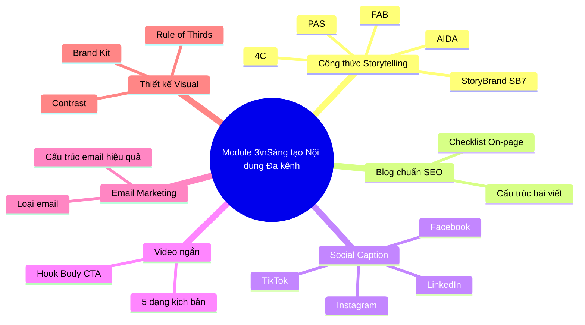

# MODULE 3: SÁNG TẠO NỘI DUNG ĐA KÊNH (CONTENT CREATION)
## (Buổi học 5 - 6 | Thời lượng: 6 giờ)

---

## 1. MỤC TIÊU HỌC TẬP

Sau khi hoàn thành Module 3, học viên có thể:

- Áp dụng thành thạo 5 công thức storytelling/copywriting phổ biến (AIDA, PAS, FAB, 4C, StoryBrand SB7) vào viết nội dung thực tế.
- Viết được 1 bài blog chuẩn SEO tối thiểu 1200 từ, có cấu trúc rõ ràng, dễ đọc.
- Viết caption mạng xã hội phù hợp đặc thù từng nền tảng (Facebook, Instagram, TikTok, LinkedIn).
- Xây dựng kịch bản video ngắn (TikTok/Reels/Shorts) theo công thức Hook – Body – CTA.
- Thiết kế chuỗi email marketing (email nurturing) cơ bản.
- Áp dụng nguyên tắc thiết kế visual cơ bản (dù không chuyên) để tự sản xuất nội dung hình ảnh đơn giản.

---

## 2. NỘI DUNG LÝ THUYẾT CHI TIẾT

### 2.1. Các công thức Storytelling/Copywriting kinh điển

#### a) AIDA (Attention – Interest – Desire – Action)

Công thức cổ điển nhất, phù hợp với quảng cáo, landing page, email bán hàng.

| Bước | Mục đích | Kỹ thuật |
|---|---|---|
| **Attention (Chú ý)** | Dừng ngón tay lướt của người đọc | Câu hỏi gây tò mò, số liệu gây sốc, hình ảnh bắt mắt |
| **Interest (Thích thú)** | Khiến người đọc muốn đọc tiếp | Kể vấn đề họ đang gặp, insight trúng tâm lý |
| **Desire (Khao khát)** | Khiến họ muốn có giải pháp | Trình bày lợi ích, minh chứng, cảm xúc tích cực khi có giải pháp |
| **Action (Hành động)** | Thúc đẩy hành động cụ thể | CTA rõ ràng: "Đặt hàng ngay", "Đăng ký hôm nay" |

**Ví dụ áp dụng (quảng cáo khóa học online):**
> **A**: "Bạn đã bao giờ viết content cả buổi mà vẫn không ai tương tác?"

> **I**: "90% người mới làm content mắc phải 3 sai lầm này mà không biết..."

> **D**: "Khóa học giúp bạn xây dựng chiến lược content chuyên nghiệp trong 30 ngày, được 500+ học viên áp dụng thành công"

> **A**: "Đăng ký ngay hôm nay để nhận ưu đãi 30%"

#### b) PAS (Problem – Agitate – Solution)

Phù hợp với bài viết giải quyết nỗi đau khách hàng (blog, quảng cáo, email).

| Bước | Mục đích |
|---|---|
| **Problem (Vấn đề)** | Nêu ra vấn đề khách hàng đang gặp |
| **Agitate (Khoét sâu)** | Khoét sâu hậu quả nếu không giải quyết vấn đề, tăng mức độ cấp thiết |
| **Solution (Giải pháp)** | Đưa ra giải pháp (sản phẩm/dịch vụ của bạn) |

**Ví dụ:**
> **P**: "Da bạn xuất hiện mụn ẩn nhưng chưa biết nguyên nhân?"
> **A**: "Nếu không xử lý đúng cách, mụn ẩn có thể phát triển thành mụn viêm, để lại thâm sẹo khó hồi phục, ảnh hưởng đến sự tự tin của bạn."
> **S**: "Serum X với công thức BHA 2% giúp làm sạch sâu lỗ chân lông, ngăn ngừa mụn ẩn hình thành chỉ sau 2 tuần sử dụng."

#### c) FAB (Feature – Advantage – Benefit)

Phù hợp khi giới thiệu sản phẩm/tính năng cụ thể.

| Bước | Nội dung |
|---|---|
| **Feature (Tính năng)** | Sản phẩm có gì (đặc điểm kỹ thuật) |
| **Advantage (Ưu điểm)** | Tính năng đó mang lại ưu thế gì so với thông thường |
| **Benefit (Lợi ích)** | Khách hàng thực sự nhận được điều gì (giá trị cảm xúc/thực tế) |

**Ví dụ:** Feature: "Bình giữ nhiệt 2 lớp Inox 304" → Advantage: "Giữ nhiệt tới 12 giờ, chống trầy xước, an toàn thực phẩm" → Benefit: "Bạn có thể mang cà phê nóng theo suốt cả ngày làm việc mà không lo bị nguội hay ảnh hưởng sức khỏe."

#### d) 4C (Clear – Concise – Compelling – Credible)

Đây không phải là công thức trình tự mà là 4 tiêu chuẩn để đánh giá/kiểm tra chất lượng bất kỳ đoạn content nào:
- **Clear (Rõ ràng)**: Người đọc hiểu ngay không cần suy nghĩ nhiều.
- **Concise (Súc tích)**: Không lan man, đủ ý cần thiết.
- **Compelling (Thuyết phục)**: Đủ hấp dẫn để người đọc quan tâm/hành động.
- **Credible (Đáng tin)**: Có dẫn chứng, số liệu, không "chém gió".

#### e) StoryBrand SB7 Framework (Donald Miller)

Đây là công thức nâng cao, đặt khách hàng làm "nhân vật chính" (Hero) và thương hiệu là "người hướng dẫn" (Guide) — không phải ngược lại.

| Bước | Vai trò |
|---|---|
| 1. Nhân vật chính (Character) | Khách hàng — có một mong muốn/mục tiêu |
| 2. Gặp vấn đề (Problem) | Vấn đề bên ngoài, bên trong, và triết lý (external, internal, philosophical problem) |
| 3. Gặp người hướng dẫn (Guide) | Thương hiệu xuất hiện với sự thấu hiểu (empathy) và uy tín (authority) |
| 4. Đưa ra kế hoạch (Plan) | Các bước đơn giản, rõ ràng để đạt được mục tiêu |
| 5. Kêu gọi hành động (Call to Action) | CTA trực tiếp (mua ngay) và CTA gián tiếp (tải tài liệu, đăng ký tư vấn) |
| 6. Giúp tránh thất bại (Failure) | Chỉ ra hậu quả nếu không hành động |
| 7. Kết thúc thành công (Success) | Vẽ ra viễn cảnh thành công sau khi dùng giải pháp |

**Nguyên tắc cốt lõi cần nhớ**: "Khách hàng là Luke Skywalker, thương hiệu là Yoda — không bao giờ để thương hiệu trở thành nhân vật chính của câu chuyện."

### 2.2. Viết bài Blog chuẩn SEO

**Cấu trúc bài blog chuẩn (1200-1800 từ):**

```
1. Tiêu đề (Title) - chứa từ khóa chính, hấp dẫn, dưới 60 ký tự
2. Meta Description - tóm tắt 150-160 ký tự, chứa từ khóa, có CTA
3. Đoạn mở đầu (Introduction) - 100-150 từ, nêu vấn đề + hứa hẹn giải pháp
4. Heading H2, H3 rõ ràng - chia nhỏ nội dung, chứa từ khóa phụ (LSI keyword)
5. Nội dung thân bài - giải quyết từng ý theo outline, có ví dụ/số liệu/hình ảnh minh họa
6. Đoạn kết luận (Conclusion) - tóm tắt + CTA
7. FAQ (nếu có) - trả lời câu hỏi thường gặp liên quan từ khóa (tối ưu Featured Snippet)
```

**Checklist On-page SEO cơ bản khi viết bài:**

| Yếu tố | Yêu cầu |
|---|---|
| Từ khóa chính | Xuất hiện trong Title, H1, đoạn mở đầu, 1-2 lần trong thân bài, URL |
| Mật độ từ khóa | 1-2%, tránh nhồi nhét (keyword stuffing) |
| Độ dài | Tối thiểu 1000-1200 từ cho bài chuyên sâu (tùy chủ đề) |
| Hình ảnh | Có alt text chứa từ khóa, nén dung lượng ảnh |
| Internal link | Liên kết tối thiểu 2-3 bài viết nội bộ liên quan |
| External link | Liên kết 1-2 nguồn uy tín (tăng độ tin cậy E-E-A-T) |
| Readability | Câu ngắn, đoạn văn ngắn (3-4 dòng), có bullet point |
| Mobile-friendly | Định dạng dễ đọc trên điện thoại (chiếm >70% traffic tại VN) |

### 2.3. Viết Caption mạng xã hội theo đặc thù nền tảng

| Nền tảng | Đặc điểm thuật toán | Nguyên tắc viết Caption | Độ dài đề xuất |
|---|---|---|---|
| **Facebook** | Ưu tiên nội dung giữ chân người dùng trên nền tảng (native video, tương tác bình luận) | Câu chuyện, câu hỏi tương tác, dùng emoji vừa phải, tránh link ngoài trong bài (giảm reach) | 100-250 từ |
| **Instagram** | Ưu tiên hình ảnh đẹp, Reels, tỷ lệ save/share | Caption ngắn gọn, dùng hashtag chiến lược (5-10 hashtag), storytelling ngắn | 50-150 từ |
| **TikTok** | Ưu tiên watch time, hoàn thành video (completion rate), Hook 3 giây đầu | Caption ngắn, gây tò mò, dùng câu hỏi hoặc thử thách, hashtag trending | 20-50 từ |
| **LinkedIn** | Ưu tiên nội dung chuyên môn, network chuyên nghiệp | Văn phong chuyên nghiệp nhưng gần gũi, chia sẻ insight/case study cá nhân, đặt câu hỏi cuối bài | 150-300 từ |
| **Zalo OA** | Kênh CSKH, thông báo trực tiếp | Ngắn gọn, thông tin rõ ràng, có CTA cụ thể (đặt hàng, xem thêm) | 50-100 từ |

**Công thức Caption Facebook thực chiến (Hook - Story - CTA):**
1. **Hook** (dòng đầu tiên phải dừng được ngón tay lướt — quan trọng nhất vì Facebook chỉ hiện 2-3 dòng đầu trước khi bị ẩn "Xem thêm"):
   - Dạng câu hỏi: "Bạn có đang mắc phải sai lầm này khi...?"
   - Dạng số liệu: "90% người dùng không biết rằng..."
   - Dạng phản đề: "Đừng mua [sản phẩm] nếu bạn chưa đọc bài này"
2. **Story/Body**: Kể câu chuyện/thông tin giá trị, dùng đoạn ngắn, xuống dòng nhiều để dễ đọc.
3. **CTA**: Kêu gọi hành động cụ thể (bình luận, inbox, click link, tag bạn bè).

### 2.4. Kịch bản Video ngắn (TikTok/Reels/Shorts) — Công thức Hook-Body-CTA

**Cấu trúc thời lượng chuẩn cho video 15-60 giây:**

| Phần | Thời lượng | Mục đích | Kỹ thuật |
|---|---|---|---|
| **Hook (0-3 giây)** | 3 giây đầu | Giữ chân người xem không lướt qua | Câu hỏi gây sốc, hình ảnh bất ngờ, chuyển động nhanh, chữ to nổi bật trên màn hình |
| **Body (3-45 giây)** | Phần thân | Truyền tải giá trị/thông tin/giải trí | Chia nhỏ thành 2-3 điểm chính, dùng caption chữ hỗ trợ, nhịp độ dựng nhanh (cắt cảnh 2-4s/cảnh) |
| **CTA (cuối video)** | 3-5 giây cuối | Thúc đẩy hành động | "Follow để xem phần 2", "Comment nếu bạn cũng gặp vấn đề này", "Link trong bio" |

**Mẫu kịch bản chi tiết (Template quay dựng):**

```
STT | Thời gian | Hình ảnh/Hành động | Lời thoại/Voice over | Chữ trên màn hình | Nhạc/SFX
1   | 0:00-0:03 | Cận cảnh sản phẩm, biểu cảm ngạc nhiên | "Bạn có biết..." | "SỰ THẬT VỀ..." | Nhạc trend, âm thanh "whoosh"
2   | 0:03-0:15 | ... | ... | ... | ...
```

**5 dạng kịch bản TikTok phổ biến, dễ áp dụng cho người mới:**
1. **Dạng liệt kê (Listicle)**: "3 sai lầm khi..." / "5 mẹo giúp bạn..."
2. **Dạng before-after**: Thể hiện sự thay đổi/kết quả rõ rệt.
3. **Dạng storytime**: Kể một câu chuyện có thật liên quan đến sản phẩm/ngành hàng.
4. **Dạng behind-the-scenes**: Hậu trường sản xuất, quy trình làm việc.
5. **Dạng reaction/duet/trend**: Bắt trend âm thanh/hiệu ứng đang thịnh hành và lồng ghép thông điệp thương hiệu.

### 2.5. Email Marketing Content

**Các loại email cơ bản trong 1 chuỗi Email Automation (Nurturing Flow):**

| Loại email | Mục đích | Thời điểm gửi |
|---|---|---|
| **Welcome Email** | Chào mừng, giới thiệu thương hiệu | Ngay sau khi khách hàng đăng ký |
| **Educational Email** | Cung cấp giá trị, xây dựng niềm tin | 2-3 ngày sau Welcome Email |
| **Social Proof Email** | Chia sẻ review/case study khách hàng | 5-7 ngày sau |
| **Offer Email** | Đưa ra ưu đãi, thúc đẩy chuyển đổi | 7-10 ngày sau |
| **Re-engagement Email** | Kéo lại khách hàng không tương tác | Sau 30 ngày không mở email |

**Cấu trúc 1 email hiệu quả:**
- Subject line: Ngắn gọn, gây tò mò, tránh từ ngữ spam ("miễn phí 100%", "!!!"). Độ dài lý tưởng 40-50 ký tự.
- Preview text: Bổ sung cho Subject line, hiện ngay dưới tiêu đề trong hộp thư.
- Nội dung: 1 thông điệp chính/email, không nhồi nhét nhiều CTA.
- CTA button: Rõ ràng, nổi bật, chỉ 1 hành động chính.

### 2.6. Nguyên tắc thiết kế Visual cơ bản (cho người không chuyên thiết kế)

| Nguyên tắc | Giải thích | Ứng dụng thực hành |
|---|---|---|
| **Quy tắc 1/3 (Rule of Thirds)** | Chia khung hình thành 9 phần, đặt chủ thể vào các điểm giao | Chụp ảnh sản phẩm, bố cục thumbnail |
| **Đối lập (Contrast)** | Màu chữ và màu nền phải tương phản đủ để dễ đọc | Chữ trắng trên nền tối, chữ đen trên nền sáng |
| **Khoảng trắng (White Space)** | Không nhồi nhét quá nhiều chi tiết/chữ trong 1 khung hình | Giữ tối đa 1 thông điệp chính/khung hình |
| **Nhất quán bộ nhận diện (Brand Kit)** | Dùng cùng 1 bộ màu, font chữ, logo xuyên suốt | Thiết lập Brand Kit trong Canva để tái sử dụng |
| **Kích thước chuẩn từng nền tảng** | Mỗi nền tảng có tỷ lệ khung hình tối ưu riêng | Story/Reels: 9:16, Feed Instagram: 1:1 hoặc 4:5, Facebook cover: 16:9 |

**Công cụ thiết kế miễn phí đề xuất cho người mới:** Canva (template có sẵn, AI design), CapCut (dựng video, phụ đề tự động), Adobe Express, Figma (cho nhóm chuyên sâu hơn).

---

## 3. PHÂN TÍCH CASE STUDY THỰC TIỄN

### Case Study 1: The Coffee House — Storytelling qua Series "Chuyện của Chúng Ta"

The Coffee House xây dựng series nội dung dài kỳ trên Facebook, kể những câu chuyện đời thường, cảm xúc gắn với không gian quán cà phê (tình bạn, tình yêu, khởi nghiệp). Mỗi bài viết áp dụng công thức gần giống StoryBrand: khách hàng là nhân vật chính, quán cà phê là bối cảnh/người bạn đồng hành chứ không phải nhân vật chính.

**Bài học**: Thương hiệu F&B/lifestyle có thể tận dụng storytelling cảm xúc dài kỳ để xây dựng cộng đồng trung thành, thay vì chỉ đăng khuyến mãi.

### Case Study 2: Duolingo TikTok (tham chiếu quốc tế, phổ biến tại VN)

Duolingo (ứng dụng học ngôn ngữ) nổi tiếng với chiến lược TikTok dùng linh vật (con cú Duo) tham gia trend, hài hước, đôi khi "meme hóa" chính thương hiệu. Mỗi video áp dụng Hook mạnh trong 1-2 giây đầu (hành động bất ngờ của linh vật), Body ngắn gọn hài hước, CTA ẩn dụ (khiến người xem tự nguyện follow vì muốn xem tiếp "drama" của Duo).

**Bài học cho học viên**: Không phải lúc nào nội dung cũng cần "dạy dỗ" nghiêm túc — với TikTok, nội dung giải trí gắn nhẹ nhàng với thương hiệu có thể hiệu quả viral hơn nội dung giáo dục thuần túy, miễn là vẫn giữ được nhận diện thương hiệu nhất quán.

### Case Study 3: Phân tích thực hành trên lớp — Mổ xẻ 1 bài blog kém hiệu quả

Giảng viên cung cấp 1 bài blog SEO mẫu (viết cố tình mắc nhiều lỗi: không có heading rõ ràng, nhồi nhét từ khóa, đoạn văn quá dài, không có CTA). Học viên làm việc nhóm để:
1. Liệt kê tối thiểu 5 lỗi vi phạm checklist On-page SEO đã học.
2. Viết lại đoạn mở đầu (introduction) theo đúng chuẩn.
3. Đề xuất cấu trúc heading (H2/H3) hợp lý hơn.

---

## 4. TỔNG KẾT MODULE 3

### 4.1. Tóm tắt kiến thức cốt lõi

1. Có 5 công thức storytelling/copywriting nền tảng cần thành thạo: AIDA, PAS, FAB, 4C, StoryBrand SB7 — mỗi công thức phù hợp với mục đích và định dạng nội dung khác nhau.
2. Bài blog chuẩn SEO cần tuân thủ cấu trúc rõ ràng và checklist on-page SEO cụ thể.
3. Mỗi nền tảng mạng xã hội có đặc thù thuật toán và hành vi người dùng riêng — không thể copy-paste 1 nội dung cho tất cả các kênh (native content).
4. Video ngắn cần Hook mạnh trong 3 giây đầu — đây là yếu tố quyết định thành bại của nội dung video hiện đại.
5. Email Marketing cần được thiết kế theo chuỗi (flow) có mục đích rõ ràng từng email, không gửi ngẫu nhiên.
6. Kỹ năng thiết kế visual cơ bản (dù không chuyên) là bắt buộc với content marketer hiện đại.

### 4.2. Bộ Keyword cần ghi nhớ

`AIDA` • `PAS` • `FAB` • `4C` • `StoryBrand SB7` • `Hero and Guide` • `On-page SEO` • `Meta Description` • `LSI Keyword` • `Keyword Stuffing` • `Native Content` • `Hook 3 giây` • `Completion Rate` • `Email Nurturing Flow` • `Welcome Email` • `Re-engagement Email` • `Rule of Thirds` • `White Space` • `Brand Kit` • `Newsjacking Trend`

### 4.3. Sơ đồ tư duy tổng kết Module 3



---

## 5. BÀI TẬP THỰC HÀNH (Buổi 5-6)

### Bài tập 1 (Cá nhân — tại lớp, 30 phút)

Chọn 1 Topic Cluster từ Content Pillar đã xây dựng ở Module 2. Viết 1 đoạn mở đầu (introduction) 100-150 từ áp dụng công thức PAS.

### Bài tập 2 (Cá nhân — về nhà)

Viết hoàn chỉnh 1 bài blog chuẩn SEO (tối thiểu 1200 từ) cho thương hiệu đồ án, tuân thủ đầy đủ cấu trúc và checklist On-page SEO đã học.

### Bài tập 3 (Cá nhân — tại lớp)

Từ cùng 1 nội dung/thông điệp, viết 3 phiên bản caption khác nhau cho 3 nền tảng: Facebook, Instagram, TikTok — thể hiện rõ sự khác biệt về văn phong, độ dài, hashtag phù hợp đặc thù từng nền tảng.

### Bài tập 4 (Cá nhân — về nhà)

Viết kịch bản chi tiết (dạng bảng: thời gian - hình ảnh - lời thoại - chữ trên màn hình) cho 1 video ngắn 30 giây theo 1 trong 5 dạng kịch bản đã học.

### Bài tập 5 (Cá nhân — về nhà)

Thiết kế chuỗi 3 email marketing (Welcome → Educational → Offer) cho thương hiệu đồ án, viết đầy đủ Subject line, Preview text và nội dung từng email.

**Tiêu chí chấm điểm (Rubric):**

| Tiêu chí | Điểm tối đa |
|---|---|
| Bài blog SEO đúng cấu trúc, đạt độ dài yêu cầu, checklist SEO đầy đủ | 3 điểm |
| Caption 3 nền tảng thể hiện rõ sự khác biệt phù hợp đặc thù | 2 điểm |
| Kịch bản video rõ ràng, có Hook mạnh, CTA cụ thể | 3 điểm |
| Chuỗi email logic, đúng mục đích từng email | 2 điểm |
| **Tổng** | **10 điểm** |

---

## 6. CÂU HỎI TỰ ĐÁNH GIÁ NHANH (Self-Check Quiz — 10 câu)

1. Nêu 4 bước của công thức AIDA và ứng dụng phù hợp nhất.
2. PAS khác AIDA ở điểm nào? Khi nào nên dùng PAS thay vì AIDA?
3. Trong StoryBrand SB7, ai là "nhân vật chính" và ai là "người hướng dẫn"? Vì sao thứ tự này quan trọng?
4. Nêu 5 yếu tố trong checklist On-page SEO cần kiểm tra khi viết bài blog.
5. Vì sao không nên copy-paste 1 caption cho tất cả các nền tảng mạng xã hội?
6. "Hook 3 giây đầu" trong video ngắn quan trọng như thế nào? Nêu 2 kỹ thuật tạo Hook hiệu quả.
7. Kể tên 5 loại email trong 1 chuỗi Email Nurturing Flow chuẩn và mục đích của từng loại.
8. Rule of Thirds là gì? Ứng dụng trong thiết kế content như thế nào?
9. Brand Kit gồm những thành phần nào? Vì sao cần thiết lập Brand Kit ngay từ đầu?
10. Nêu 5 dạng kịch bản TikTok phổ biến và cho ví dụ thực tế mỗi dạng.

---

## 7. KIẾN THỨC BỔ SUNG CẦN ĐỌC THÊM

- Sách "Building a StoryBrand" — Donald Miller (chi tiết mô hình SB7).
- Sách "Everybody Writes" — Ann Handley (kỹ năng viết content chuyên nghiệp).
- Nghiên cứu về "Attention Span" trên mạng xã hội — vì sao Hook 3 giây ngày càng quan trọng hơn.
- TikTok Creative Center — kho video trending, công thức được TikTok công bố chính thức.
- Tài liệu Email Marketing Benchmark của Mailchimp/HubSpot — tỷ lệ mở email (Open rate), tỷ lệ click (CTR) trung bình theo ngành để tham chiếu.
- Nguyên tắc thiết kế cơ bản trong sách "The Non-Designer's Design Book" — Robin Williams (rất phù hợp cho người không chuyên thiết kế).

---

## 8. LƯU Ý CHO GIẢNG VIÊN

- Đây là module có khối lượng thực hành lớn nhất — nên chia buổi 5 tập trung vào Text-based content (blog, caption, storytelling) và buổi 6 tập trung vào Video + Email + Visual.
- Khuyến khích học viên đọc to caption/kịch bản của mình trước lớp để tự nhận ra điểm chưa tự nhiên/gượng ép trong văn phong.
- Với bài tập kịch bản video, nếu lớp có điều kiện, nên khuyến khích học viên quay thử bằng điện thoại (dù chưa cần dựng chuyên nghiệp) để cảm nhận rõ nhịp độ Hook-Body-CTA trong thực tế, không chỉ trên giấy.
- Chấm bài blog SEO cần kiểm tra thực tế bằng công cụ (ví dụ dán vào Yoast SEO giả lập hoặc công cụ đếm từ khóa) để phản hồi chính xác, tránh chỉ đánh giá cảm tính.

---

*(Hết Module 3. Tiếp tục với file 04-MODULE-4-SEO-PHAN-PHOI-NOI-DUNG.md)*
