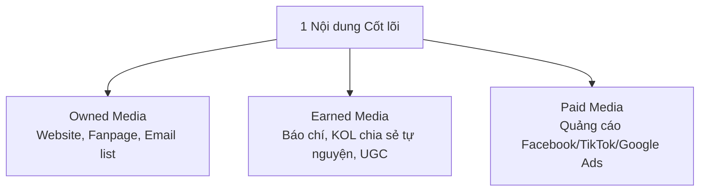
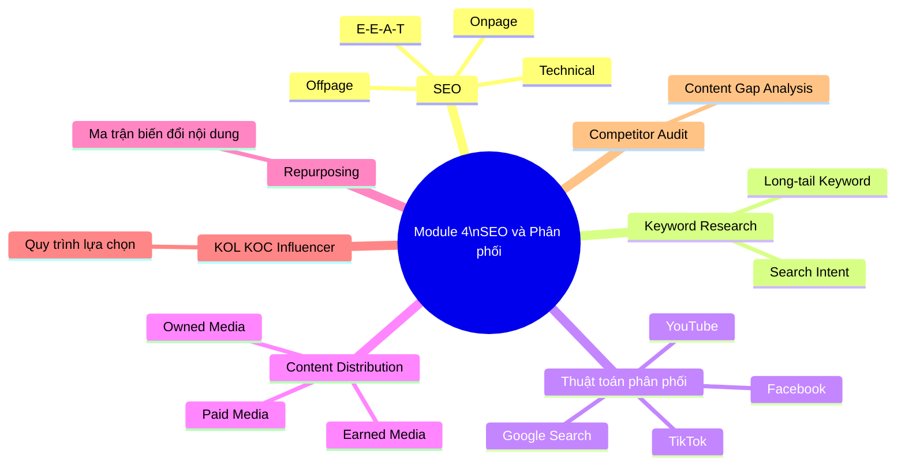

# MODULE 4: SEO & PHÂN PHỐI NỘI DUNG (SEO & CONTENT DISTRIBUTION)
## (Buổi học 7 | Thời lượng: 3 giờ — có thể mở rộng thành 2 buổi nếu lớp cần chuyên sâu)

---

## 1. MỤC TIÊU HỌC TẬP

Sau khi hoàn thành Module 4, học viên có thể:

- Hiểu nguyên lý hoạt động cơ bản của công cụ tìm kiếm (Google) và thuật toán phân phối nội dung mạng xã hội.
- Thực hiện nghiên cứu từ khóa (Keyword Research) cơ bản bằng công cụ miễn phí.
- Phân biệt và áp dụng SEO Onpage, Offpage, Technical SEO ở mức cơ bản.
- Xây dựng kế hoạch phân phối nội dung đa kênh (Content Distribution Plan).
- Hiểu và áp dụng Content Repurposing (tái sử dụng nội dung) để tối ưu nguồn lực sản xuất.
- Đánh giá và lựa chọn hình thức hợp tác với KOL/KOC/Influencer phù hợp ngân sách và mục tiêu.
- Thực hiện Competitor Content Audit (kiểm toán nội dung đối thủ) cơ bản.

---

## 2. NỘI DUNG LÝ THUYẾT CHI TIẾT

### 2.1. Nguyên lý hoạt động của SEO (Search Engine Optimization)

**SEO là gì?** Là tập hợp các kỹ thuật giúp nội dung/website xuất hiện thứ hạng cao trên trang kết quả tìm kiếm (SERP - Search Engine Result Page) một cách tự nhiên (không trả phí trực tiếp cho vị trí hiển thị).

**3 trụ cột của SEO:**

| Trụ cột | Nội dung | Ví dụ hành động |
|---|---|---|
| **Onpage SEO** | Tối ưu ngay trên trang nội dung | Tối ưu Title, Meta description, Heading, mật độ từ khóa, hình ảnh, tốc độ tải trang, cấu trúc URL |
| **Offpage SEO** | Tối ưu các yếu tố bên ngoài trang | Backlink (liên kết từ website khác trỏ về), guest post, PR, social signal |
| **Technical SEO** | Tối ưu kỹ thuật nền tảng website | Tốc độ tải trang (Core Web Vitals), responsive di động, sitemap.xml, robots.txt, HTTPS |

**Khái niệm E-E-A-T (Google's Quality Rater Guidelines):**

Google đánh giá chất lượng nội dung dựa trên 4 tiêu chí:
- **Experience (Trải nghiệm)**: Người viết có trải nghiệm thực tế với chủ đề không?
- **Expertise (Chuyên môn)**: Người viết có kiến thức chuyên sâu không?
- **Authoritativeness (Uy tín)**: Trang web/tác giả có được công nhận là nguồn uy tín trong ngành không?
- **Trustworthiness (Đáng tin cậy)**: Thông tin có chính xác, minh bạch, có nguồn dẫn chứng không?

Đây là lý do vì sao content chỉ viết hay chưa đủ — cần có yếu tố chuyên môn thật, dẫn nguồn rõ ràng, tác giả có thông tin minh bạch (Author Bio).

### 2.2. Quy trình Nghiên cứu từ khóa (Keyword Research) cơ bản

**Quy trình 5 bước:**

1. **Bước 1 — Xác định Seed Keyword (từ khóa hạt giống)**: Từ khóa gốc liên quan trực tiếp đến sản phẩm/ngành hàng (ví dụ: "kem chống nắng").
2. **Bước 2 — Mở rộng từ khóa**: Dùng Google Suggest (gõ từ khóa và xem gợi ý tự động), People Also Ask, Google Keyword Planner (miễn phí khi có tài khoản Google Ads), Google Trends, AnswerThePublic (bản free giới hạn).
3. **Bước 3 — Phân loại từ khóa theo Search Intent (mục đích tìm kiếm)**:
   - **Informational** (tìm hiểu thông tin): "kem chống nắng là gì", "cách chọn kem chống nắng"
   - **Navigational** (tìm thương hiệu cụ thể): "kem chống nắng Anessa"
   - **Commercial Investigation** (so sánh trước khi mua): "kem chống nắng nào tốt nhất 2026", "so sánh kem chống nắng A và B"
   - **Transactional** (sẵn sàng mua): "mua kem chống nắng Anessa chính hãng", "kem chống nắng giá rẻ"
4. **Bước 4 — Đánh giá độ khó và lượng tìm kiếm**: Ưu tiên từ khóa có lượng tìm kiếm ổn định, độ cạnh tranh phù hợp với năng lực website (website mới nên ưu tiên long-tail keyword ít cạnh tranh hơn).
5. **Bước 5 — Ánh xạ từ khóa vào Content Pillar/Calendar**: Mỗi từ khóa chính nên gắn với 1 bài viết cụ thể, tránh 2 bài cùng nhắm 1 từ khóa (keyword cannibalization).

**Bảng phân loại Search Intent và loại Content tương ứng:**

| Search Intent | Loại Content phù hợp | Vị trí trong phễu |
|---|---|---|
| Informational | Bài blog giáo dục, hướng dẫn, định nghĩa | TOFU |
| Commercial Investigation | Bài so sánh, review, bảng xếp hạng "Top 10..." | MOFU |
| Transactional | Trang sản phẩm, landing page, trang danh mục | BOFU |
| Navigational | Trang chủ, trang thương hiệu | Nhận diện/Retention |

### 2.3. Thuật toán phân phối nội dung trên mạng xã hội (Distribution Algorithm)

Mỗi nền tảng có thuật toán riêng nhưng đều dựa trên nguyên lý chung: **ưu tiên nội dung giữ người dùng ở lại nền tảng lâu nhất và tạo tương tác thật.**

| Nền tảng | Yếu tố thuật toán ưu tiên | Điều nên làm | Điều nên tránh |
|---|---|---|---|
| **Facebook** | Thời gian xem, bình luận có ý nghĩa (meaningful comment), share, native video | Đặt câu hỏi mở, khuyến khích bình luận, hạn chế để link ngoài trong bài viết chính | Đăng liên tục nội dung giống nhau, spam link, dùng "engagement bait" bị cấm |
| **Instagram** | Save, share qua tin nhắn, thời gian xem Reels, tỷ lệ theo dõi từ Explore | Nội dung có giá trị lưu lại (tips, infographic), Reels bắt trend âm thanh | Hình ảnh chất lượng thấp, hashtag không liên quan |
| **TikTok** | Watch time, completion rate, re-watch, chia sẻ | Hook mạnh, video ngắn gọn đúng trọng tâm, tương tác trả lời bình luận bằng video | Quảng cáo lộ liễu ngay đầu video, nội dung vi phạm cộng đồng |
| **YouTube** | Watch time, session time (giữ chân người xem sang video khác), CTR thumbnail | Thumbnail hấp dẫn, tiêu đề rõ giá trị, playlist giữ chân người xem | Thumbnail sai sự thật (clickbait quá đà), tiêu đề giật gân không đúng nội dung |
| **Google Search** | Relevance, E-E-A-T, tốc độ tải trang, trải nghiệm di động | Nội dung chuyên sâu, cập nhật thường xuyên, backlink chất lượng | Nội dung sao chép, nhồi nhét từ khóa, mua backlink kém chất lượng |

### 2.4. Content Distribution Plan — Kế hoạch phân phối nội dung

**Mô hình phân phối theo 3 loại kênh (Owned – Earned – Paid Media):**

| Loại kênh | Định nghĩa | Ưu điểm | Nhược điểm |
|---|---|---|---|
| **Owned Media** | Kênh thương hiệu tự sở hữu và kiểm soát | Miễn phí, kiểm soát hoàn toàn thông điệp | Cần thời gian xây dựng lượng theo dõi/traffic |
| **Earned Media** | Được bên thứ ba lan tỏa tự nguyện (báo chí, khách hàng chia sẻ) | Độ tin cậy cao nhất, chi phí thấp | Không kiểm soát được nội dung/thời điểm |
| **Paid Media** | Trả phí để hiển thị | Kiểm soát tốc độ và đối tượng tiếp cận | Chi phí liên tục, dừng chi là dừng hiệu quả |

**Chiến lược phân phối 1 nội dung Hero (ví dụ áp dụng thực tế):**
1. Xuất bản bản đầy đủ trên Website (Owned) — bài blog Pillar Page chuẩn SEO.
2. Cắt thành 3-5 đoạn video ngắn đăng TikTok/Reels (Owned, tối ưu cho từng nền tảng).
3. Tóm tắt thành carousel đăng Instagram/LinkedIn (Owned).
4. Gửi email đến danh sách khách hàng hiện tại giới thiệu nội dung (Owned).
5. Gửi cho 2-3 KOL/nhóm cộng đồng liên quan để chia sẻ (Earned).
6. Chạy quảng cáo boost bài viết/video hiệu quả nhất đến đối tượng mục tiêu mở rộng (Paid).

### 2.5. Content Repurposing (Tái sử dụng nội dung)

**Định nghĩa**: Biến đổi 1 nội dung gốc thành nhiều định dạng khác nhau để tối đa hóa giá trị và tiết kiệm nguồn lực sản xuất.

**Ma trận Repurposing — Từ 1 bài viết dài thành 10+ nội dung:**

| Nội dung gốc | Có thể biến đổi thành |
|---|---|
| 1 bài blog 1500 từ | → 1 video YouTube dài giải thích chi tiết |
| | → 3-5 video TikTok/Reels ngắn (mỗi đoạn 1 ý chính) |
| | → 1 carousel Instagram/LinkedIn (mỗi slide 1 ý) |
| | → 1 infographic tóm tắt |
| | → 3-5 caption Facebook (trích đoạn hay nhất) |
| | → 1 email newsletter |
| | → 1 câu hỏi thảo luận đăng lên group cộng đồng |
| | → 1 podcast episode (đọc và mở rộng bàn luận) |
| | → Slide thuyết trình/webinar |

**Lợi ích của Content Repurposing:**
- Tiết kiệm 60-70% thời gian sản xuất so với làm nội dung mới hoàn toàn mỗi lần.
- Tăng tần suất xuất hiện trước khách hàng trên nhiều kênh mà không cần nhiều ý tưởng mới.
- Tối đa hóa ROI của công sức nghiên cứu/sản xuất ban đầu (đặc biệt với nội dung cần đầu tư nhiều: phỏng vấn chuyên gia, nghiên cứu số liệu...).

### 2.6. Hợp tác KOL – KOC – Influencer

| Loại | Đặc điểm | Lượng theo dõi | Chi phí | Phù hợp mục tiêu |
|---|---|---|---|---|
| **KOL (Key Opinion Leader)** | Người có chuyên môn/uy tín trong lĩnh vực cụ thể (bác sĩ da liễu, chuyên gia tài chính...) | Đa dạng, không nhất thiết follow lớn | Trung bình - Cao | Xây dựng niềm tin, độ uy tín (Trust) |
| **Celebrity/Influencer lớn** | Người nổi tiếng, follow triệu | Rất lớn (>1 triệu) | Rất cao | Nhận diện thương hiệu (Awareness) diện rộng |
| **Micro-Influencer** | Follow vừa phải, cộng đồng gắn kết cao | 10,000 - 100,000 | Trung bình | Tương tác chất lượng, target theo ngách (niche) |
| **KOC (Key Opinion Consumer)** | Người tiêu dùng có ảnh hưởng qua trải nghiệm thật, review chân thực | Đa dạng, có thể follow nhỏ | Thấp - Trung bình | Độ tin cậy cao, thúc đẩy quyết định mua (Decision) |

**Quy trình lựa chọn KOL/KOC (5 bước):**
1. Xác định mục tiêu chiến dịch (Awareness/Consideration/Conversion).
2. Xác định persona mục tiêu → tìm KOL/KOC có tệp follow trùng khớp.
3. Đánh giá chất lượng tương tác thật (không chỉ số follow) — kiểm tra tỷ lệ tương tác thực (Engagement Rate), soi bình luận có phải người thật không.
4. Thương lượng nội dung: cho KOL sáng tạo theo phong cách riêng (native), tránh ép kịch bản cứng nhắc gây phản cảm.
5. Đo lường qua mã giảm giá riêng/link tracking riêng cho từng KOL để đánh giá hiệu quả thực tế.

### 2.7. Competitor Content Audit (Kiểm toán nội dung đối thủ)

**Quy trình thực hiện:**
1. Liệt kê 3-5 đối thủ cạnh tranh trực tiếp và gián tiếp.
2. Thu thập dữ liệu: tần suất đăng bài, loại nội dung, engagement trung bình, top 5 bài viết hiệu quả nhất trong 3-6 tháng gần nhất.
3. Phân tích Content Pillar của đối thủ đang tập trung vào đâu.
4. Xác định khoảng trống (Content Gap) — chủ đề đối thủ chưa khai thác hoặc khai thác chưa tốt.
5. Đề xuất chiến lược khác biệt hóa (không sao chép, mà học hỏi + làm khác biệt).

**Mẫu bảng Competitor Content Audit:**

| Tiêu chí | Đối thủ A | Đối thủ B | Thương hiệu của bạn |
|---|---|---|---|
| Tần suất đăng bài/tuần | | | |
| Kênh mạnh nhất | | | |
| Content Pillar chính | | | |
| Engagement Rate trung bình | | | |
| Điểm mạnh nổi bật | | | |
| Điểm yếu/khoảng trống | | | |

---

## 3. PHÂN TÍCH CASE STUDY THỰC TIỄN

### Case Study 1: Chiến lược SEO của các trang tin tức/blog tài chính tại Việt Nam

Các trang như CafeF, VnExpress Kinh doanh xây dựng lượng lớn bài viết informational với mật độ xuất bản dày đặc và backlink tự nhiên từ độ uy tín lâu năm — đây là ví dụ về Domain Authority cao. Với người mới bắt đầu/website nhỏ, học viên cần hiểu chiến lược khả thi hơn: tập trung **long-tail keyword** (từ khóa dài, ít cạnh tranh) thay vì cạnh tranh trực tiếp với các "ông lớn" ở từ khóa ngắn, cạnh tranh cao.

### Case Study 2: Chiến dịch KOC bùng nổ trên TikTok Shop

Nhiều thương hiệu mỹ phẩm/thực phẩm chức năng Việt Nam áp dụng chiến lược "rải" hàng trăm KOC nhỏ (follow 1,000-20,000) thay vì chi toàn bộ ngân sách cho 1-2 Influencer lớn. Chiến lược này dựa trên nguyên lý: mỗi KOC review chân thực tạo ra "bằng chứng xã hội" (social proof) phân tán trên nhiều cộng đồng nhỏ, tổng hiệu ứng tin cậy cao hơn 1 quảng cáo lớn từ celebrity.

**Bài học**: Với ngân sách hạn chế (phù hợp người mới bắt đầu/doanh nghiệp nhỏ), chiến lược "nhiều KOC nhỏ" thường hiệu quả hơn về ROI so với 1 Influencer lớn.

### Case Study 3: Bài tập thực hành Competitor Audit

Học viên thực hành audit trực tiếp 3 đối thủ của thương hiệu đồ án cá nhân (dùng fanpage/website thật, không dùng dữ liệu giả định), điền đầy đủ bảng Competitor Content Audit, trình bày 5 phút kết quả phát hiện Content Gap.

---

## 4. TỔNG KẾT MODULE 4

### 4.1. Tóm tắt kiến thức cốt lõi

1. SEO gồm 3 trụ cột: Onpage, Offpage, Technical — cần hiểu tổng thể dù không chuyên sâu kỹ thuật.
2. E-E-A-T là tiêu chuẩn chất lượng nội dung hiện đại của Google — chuyên môn thật và độ tin cậy ngày càng quan trọng hơn kỹ thuật SEO thuần túy.
3. Search Intent quyết định loại nội dung cần sản xuất cho mỗi từ khóa — sai Intent thì dù SEO tốt cũng không chuyển đổi được.
4. Mỗi nền tảng mạng xã hội có thuật toán riêng, cần hiểu để tối ưu phân phối tự nhiên (organic).
5. Content Repurposing giúp tối đa hóa giá trị từ 1 nội dung gốc, tiết kiệm nguồn lực đáng kể.
6. Lựa chọn KOL/KOC cần dựa trên mục tiêu chiến dịch và persona, không chỉ dựa vào số lượng follow.
7. Competitor Content Audit giúp tìm ra khoảng trống thị trường (Content Gap) để tạo khác biệt.

### 4.2. Bộ Keyword cần ghi nhớ

`Onpage SEO` • `Offpage SEO` • `Technical SEO` • `E-E-A-T` • `Search Intent` • `Long-tail Keyword` • `Keyword Cannibalization` • `SERP` • `Core Web Vitals` • `Owned/Earned/Paid Media` • `Content Distribution Plan` • `Content Repurposing` • `KOL` • `KOC` • `Micro-Influencer` • `Engagement Rate` • `Competitor Content Audit` • `Content Gap` • `Domain Authority` • `Backlink`

### 4.3. Sơ đồ tư duy tổng kết Module 4

---

## 5. BÀI TẬP THỰC HÀNH (Buổi 7)

### Bài tập 1 (Cá nhân — tại lớp, 30 phút)

Thực hiện nghiên cứu từ khóa cơ bản cho thương hiệu đồ án: xác định 1 Seed Keyword, mở rộng thành tối thiểu 10 từ khóa liên quan (dùng Google Suggest/People Also Ask), phân loại theo 4 loại Search Intent.

### Bài tập 2 (Cá nhân — về nhà)

Xây dựng Content Distribution Plan cho 1 nội dung Hero đã có trong Content Calendar (Module 2): liệt kê chi tiết cách phân phối qua Owned/Earned/Paid Media, tối thiểu 6 hình thức phân phối cụ thể.

### Bài tập 3 (Cá nhân — về nhà)

Áp dụng Ma trận Content Repurposing: từ 1 bài blog đã viết ở Module 3, đề xuất tối thiểu 8 định dạng nội dung khác có thể tái sử dụng.

### Bài tập 4 (Nhóm — tại lớp, 45 phút)

Thực hiện Competitor Content Audit hoàn chỉnh cho 3 đối thủ (dùng bảng mẫu đã học), xác định tối thiểu 2 Content Gap và đề xuất chiến lược khai thác.

### Bài tập 5 (Cá nhân — về nhà)

Đề xuất kế hoạch hợp tác KOL/KOC: chọn 3 KOL/KOC phù hợp persona (có thể là ví dụ thực tế trên mạng xã hội), giải thích lý do lựa chọn và ngân sách/hình thức hợp tác dự kiến.

**Tiêu chí chấm điểm (Rubric):**

| Tiêu chí | Điểm tối đa |
|---|---|
| Nghiên cứu từ khóa đầy đủ, phân loại đúng Search Intent | 2 điểm |
| Content Distribution Plan chi tiết, đa dạng kênh | 2 điểm |
| Ma trận Repurposing sáng tạo, khả thi | 2 điểm |
| Competitor Audit đầy đủ, phát hiện Content Gap có căn cứ | 3 điểm |
| Đề xuất KOL/KOC hợp lý, có lý do rõ ràng | 1 điểm |
| **Tổng** | **10 điểm** |

---

## 6. CÂU HỎI TỰ ĐÁNH GIÁ NHANH (Self-Check Quiz — 10 câu)

1. Nêu 3 trụ cột của SEO và cho ví dụ mỗi trụ cột.
2. E-E-A-T là viết tắt của gì? Vì sao yếu tố này ngày càng quan trọng?
3. Kể tên 4 loại Search Intent và loại content phù hợp mỗi loại.
4. Keyword Cannibalization là gì? Hậu quả của nó?
5. Phân biệt Owned Media, Earned Media, Paid Media — cho ví dụ mỗi loại.
6. Content Repurposing mang lại lợi ích gì? Cho ví dụ biến đổi 1 bài blog thành 3 định dạng khác.
7. Phân biệt KOL và KOC. Trường hợp nào nên ưu tiên dùng KOC thay vì KOL lớn?
8. Micro-Influencer có ưu điểm gì so với Celebrity/Influencer lớn về mặt ngân sách và hiệu quả?
9. Competitor Content Audit giúp phát hiện điều gì quan trọng nhất cho chiến lược content?
10. Thuật toán TikTok ưu tiên yếu tố nào nhất? Vì sao "Completion Rate" quan trọng hơn cả lượt xem?

---

## 7. KIẾN THỨC BỔ SUNG CẦN ĐỌC THÊM

- Google Search Central Documentation (search.google.com/search-console/about) — tài liệu chính thức của Google về SEO.
- Google Search Quality Rater Guidelines — tài liệu gốc về E-E-A-T.
- Ahrefs Blog, Backlinko Blog (Brian Dean) — nguồn tham khảo SEO uy tín hàng đầu (bản dịch/tóm tắt tiếng Việt có nhiều trên các blog SEO Việt Nam).
- TikTok for Business — tài liệu chính thức về thuật toán và best practice nội dung.
- Báo cáo "Influencer Marketing Vietnam" hàng năm của các công ty nghiên cứu thị trường để cập nhật mức giá và xu hướng hợp tác KOL/KOC tại Việt Nam.

---

## 8. LƯU Ý CHO GIẢNG VIÊN

- Module này có tính kỹ thuật cao hơn các module trước — nên chuẩn bị demo trực tiếp trên máy chiếu (ví dụ: gõ từ khóa trên Google để xem gợi ý tự động, mở Google Search Console mẫu) để học viên hình dung trực quan, tránh chỉ giảng lý thuyết suông.
- Nếu lớp học có học viên đã có website/fanpage thật, khuyến khích demo trực tiếp Google Search Console hoặc Meta Business Suite của chính học viên đó để tăng tính thực chiến.
- Với bài tập Competitor Audit, nên giới hạn thời gian thực hành ngay tại lớp (dùng điện thoại/laptop truy cập trực tiếp fanpage đối thủ) để đảm bảo tính thời sự và thực tế của dữ liệu thu thập.
- Nhấn mạnh cho học viên: SEO là "cuộc chơi dài hạn" (3-6 tháng mới thấy kết quả rõ rệt), tránh kỳ vọng sai lệch rằng viết 1-2 bài là lên top ngay.

---

*(Hết Module 4. Tiếp tục với file 05-MODULE-5-DO-LUONG-TOI-UU.md)*
