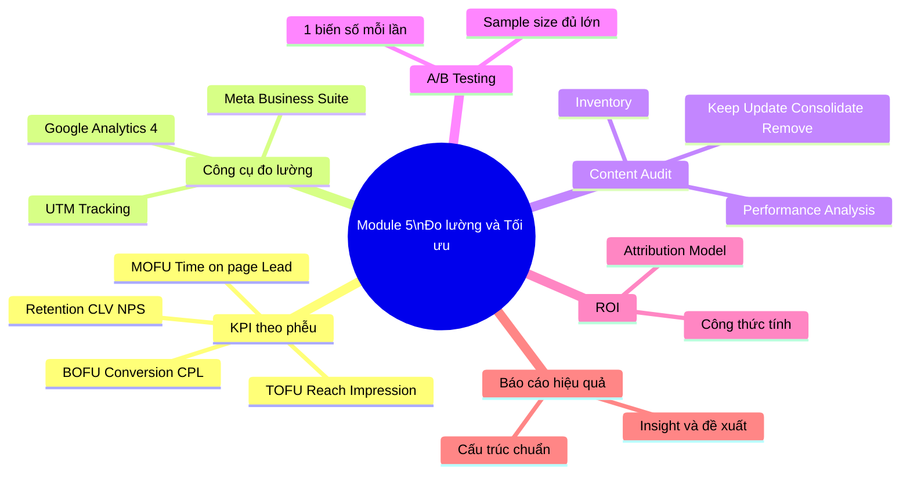

# MODULE 5: ĐO LƯỜNG & TỐI ƯU NỘI DUNG (MEASUREMENT & OPTIMIZATION)
## (Buổi học 8 | Thời lượng: 3 giờ)

---

## 1. MỤC TIÊU HỌC TẬP

Sau khi hoàn thành Module 5, học viên có thể:

- Xây dựng hệ thống KPI đo lường hiệu quả content theo từng tầng phễu (TOFU-MOFU-BOFU).
- Đọc hiểu và diễn giải báo cáo cơ bản từ Google Analytics 4 (GA4) và Meta Business Suite.
- Thực hiện Content Audit (kiểm toán nội dung đã xuất bản) để xác định nội dung nào cần giữ, cập nhật, hoặc gỡ bỏ.
- Thiết kế và thực hiện A/B Testing cơ bản cho content.
- Tính toán ROI (Return on Investment) của một chiến dịch content marketing.
- Xây dựng báo cáo tổng kết chiến dịch (Content Performance Report) chuyên nghiệp, có đề xuất tối ưu.

---

## 2. NỘI DUNG LÝ THUYẾT CHI TIẾT

### 2.1. Vì sao đo lường Content Marketing khó hơn Performance Marketing?

Khác với quảng cáo trả phí (Performance Marketing) có thể đo trực tiếp "chi bao nhiêu, ra bao nhiêu đơn", Content Marketing thường có **độ trễ (lag effect)** — khách hàng đọc bài blog hôm nay nhưng có thể 2-3 tháng sau mới ra quyết định mua. Vì vậy, cần một hệ thống KPI đa tầng thay vì chỉ nhìn vào doanh số trực tiếp.

**Nguyên tắc vàng**: "Đo đúng chỉ số cho đúng mục tiêu, đúng giai đoạn phễu" — không nên lấy KPI của TOFU (Reach, Impression) để đánh giá thất bại/thành công của toàn bộ chiến lược content.

### 2.2. Hệ thống KPI theo từng tầng phễu

| Tầng phễu | Mục tiêu | KPI chính | Công cụ đo |
|---|---|---|---|
| **TOFU (Awareness)** | Tăng độ nhận diện, tiếp cận | Reach, Impressions, Video Views, Follower Growth Rate, Brand Mention | Meta Business Suite, TikTok Analytics, Google Alerts |
| **MOFU (Consideration)** | Xây dựng niềm tin, thu thập lead | Time on Page, Bounce Rate, Email Subscribe Rate, Download Rate, Comment/Share có ý nghĩa | Google Analytics 4, Email platform (Mailchimp) |
| **BOFU (Decision/Action)** | Thúc đẩy chuyển đổi | Conversion Rate, CTR (Click Through Rate), Cost per Lead (CPL), Add to Cart Rate | GA4 Conversion tracking, Facebook Pixel, TikTok Pixel |
| **Retention/Advocacy** | Giữ chân, tạo ủng hộ | Repeat Purchase Rate, Customer Lifetime Value (CLV), Net Promoter Score (NPS), Referral Rate | CRM, Email platform, khảo sát NPS |

### 2.3. Định nghĩa chi tiết các chỉ số quan trọng

| Chỉ số | Công thức | Ý nghĩa |
|---|---|---|
| **Engagement Rate (Tỷ lệ tương tác)** | (Like + Comment + Share) / Reach × 100% | Đo mức độ nội dung "chạm" được người xem |
| **CTR (Click Through Rate)** | Số click / Số impression × 100% | Đo sức hấp dẫn của tiêu đề/hình ảnh khiến người dùng click |
| **Conversion Rate (Tỷ lệ chuyển đổi)** | Số hành động mục tiêu / Tổng số truy cập × 100% | Đo hiệu quả thúc đẩy hành động cụ thể (mua hàng, đăng ký) |
| **Bounce Rate (Tỷ lệ thoát trang)** | Số phiên chỉ xem 1 trang rồi rời đi / Tổng số phiên × 100% | Đo mức độ nội dung có giữ chân người đọc không (bounce rate cao = nội dung không đáp ứng kỳ vọng) |
| **CPL (Cost per Lead)** | Tổng chi phí / Số lead thu được | Đo hiệu quả chi phí thu thập khách hàng tiềm năng |
| **CLV (Customer Lifetime Value)** | Giá trị trung bình đơn hàng × Số lần mua trung bình × Thời gian gắn bó trung bình | Đo giá trị dài hạn 1 khách hàng mang lại, quan trọng để đánh giá ROI dài hạn của content |
| **NPS (Net Promoter Score)** | % Người ủng hộ (Promoter) − % Người phản đối (Detractor) | Đo mức độ khách hàng sẵn sàng giới thiệu thương hiệu |

### 2.4. Đọc hiểu Google Analytics 4 (GA4) cơ bản

GA4 là công cụ miễn phí quan trọng nhất để đo lường traffic và hành vi người dùng trên website. Các báo cáo cơ bản cần nắm:

| Báo cáo | Thông tin cung cấp | Ứng dụng cho Content Marketer |
|---|---|---|
| **Báo cáo Traffic Acquisition** | Nguồn traffic đến từ đâu (Organic Search, Social, Direct, Referral) | Đánh giá kênh nào đang mang lại traffic tốt nhất, phân bổ nguồn lực hợp lý |
| **Báo cáo Engagement (Pages and Screens)** | Trang nào được xem nhiều nhất, thời gian trung bình trên trang | Xác định content nào đang hiệu quả để nhân rộng/tối ưu |
| **Báo cáo Conversions** | Số lượng và tỷ lệ hoàn thành mục tiêu đã thiết lập (mua hàng, điền form) | Đánh giá content nào thực sự dẫn đến chuyển đổi |
| **Báo cáo Demographics** | Độ tuổi, giới tính, khu vực người truy cập | Đối chiếu với Persona đã xây dựng, kiểm tra có đúng đối tượng mục tiêu không |
| **Realtime Report** | Người dùng đang hoạt động theo thời gian thực | Theo dõi hiệu quả ngay sau khi xuất bản/chạy chiến dịch |

**Lưu ý kỹ thuật quan trọng**: Cần thiết lập **UTM tracking** (UTM Source, Medium, Campaign) cho mọi link chia sẻ trên các kênh khác nhau để GA4 có thể phân biệt chính xác traffic đến từ kênh nào, chiến dịch nào — đây là kỹ năng bắt buộc, tránh tình trạng "không biết khách từ đâu ra".

### 2.5. Đọc hiểu Meta Business Suite (Facebook/Instagram Insight)

| Chỉ số | Ý nghĩa |
|---|---|
| **Reach (Tiếp cận)** | Số người dùng duy nhất nhìn thấy nội dung |
| **Impressions (Số lần hiển thị)** | Tổng số lần nội dung được hiển thị (1 người có thể xem nhiều lần) |
| **Engagement (Tương tác)** | Tổng like, comment, share, click |
| **Video Average Watch Time** | Thời gian xem trung bình của video — chỉ số quan trọng đánh giá chất lượng nội dung video |
| **Audience Insight** | Thông tin nhân khẩu học của người theo dõi (đối chiếu với Persona) |
| **Best Time to Post** | Khung giờ follower hoạt động nhiều nhất (dựa trên dữ liệu thực tế của từng fanpage) |

### 2.6. Content Audit (Kiểm toán nội dung)

**Định nghĩa**: Là quá trình rà soát toàn bộ nội dung đã xuất bản để đánh giá hiệu quả, từ đó quyết định: **Giữ nguyên (Keep) – Cập nhật (Update) – Gộp lại (Consolidate) – Gỡ bỏ (Remove)**.

**Quy trình Content Audit 4 bước:**

1. **Kiểm kê (Inventory)**: Liệt kê toàn bộ nội dung đã xuất bản (URL, ngày đăng, chủ đề, tác giả).
2. **Phân tích hiệu quả (Performance Analysis)**: Gắn dữ liệu traffic, engagement, conversion cho từng nội dung.
3. **Đánh giá chất lượng (Quality Assessment)**: Kiểm tra nội dung có còn chính xác/cập nhật không (đặc biệt quan trọng với bài viết có số liệu, giá cả, chính sách).
4. **Quyết định hành động (Action Plan)**:
   - **Keep**: Nội dung vẫn hiệu quả, giữ nguyên.
   - **Update**: Nội dung có tiềm năng nhưng cần cập nhật thông tin/tối ưu SEO lại.
   - **Consolidate**: Nhiều bài viết trùng lặp chủ đề → gộp thành 1 bài chuyên sâu hơn (giải quyết Keyword Cannibalization).
   - **Remove/Redirect**: Nội dung lỗi thời, không còn giá trị → gỡ bỏ hoặc chuyển hướng (301 redirect) sang bài liên quan.

**Tần suất thực hiện Content Audit đề xuất**: 6 tháng/lần đối với website có xuất bản đều đặn.

### 2.7. A/B Testing cho Content

**Định nghĩa**: Là phương pháp so sánh 2 (hoặc nhiều) phiên bản nội dung khác nhau trên cùng 1 đối tượng để xác định phiên bản nào hiệu quả hơn, dựa trên dữ liệu thực tế thay vì phỏng đoán.

**Các yếu tố có thể A/B Test trong Content Marketing:**

| Yếu tố | Ví dụ biến thể |
|---|---|
| Tiêu đề (Headline) | "5 mẹo chăm da mùa hè" vs "Đừng bỏ lỡ 5 mẹo chăm da mùa hè này" |
| Hình ảnh/Thumbnail | Ảnh sản phẩm đơn giản vs ảnh có người mẫu sử dụng |
| CTA | "Mua ngay" vs "Khám phá ngay" vs "Nhận ưu đãi" |
| Thời điểm đăng | 12h trưa vs 20h tối |
| Định dạng | Video vs Hình ảnh tĩnh cho cùng 1 thông điệp |
| Độ dài nội dung | Caption ngắn vs Caption dài kể chuyện |

**Nguyên tắc thực hiện A/B Test đúng chuẩn:**
1. Chỉ thay đổi **1 biến số** mỗi lần test (nếu đổi cả tiêu đề lẫn hình ảnh cùng lúc, không biết yếu tố nào quyết định kết quả).
2. Đảm bảo mẫu đủ lớn (sample size) để kết quả có ý nghĩa thống kê, tránh kết luận vội vàng từ số liệu quá nhỏ.
3. Chạy test trong cùng khung thời gian/điều kiện tương đương để tránh yếu tố nhiễu (ví dụ không so sánh bài đăng ngày thường với ngày lễ).
4. Ghi nhận và lưu trữ kết quả để xây dựng "thư viện học hỏi" (learning repository) áp dụng lâu dài.

### 2.8. Tính toán ROI của Content Marketing

**Công thức cơ bản:**

$$ROI (\%) = \frac{Doanh\ thu\ từ\ Content - Chi\ phí\ đầu\ tư\ Content}{Chi\ phí\ đầu\ tư\ Content} \times 100\%$$

**Cách xác định "Doanh thu từ Content" (phần khó nhất):**
- Sử dụng mô hình phân bổ (Attribution Model): Last-click Attribution (gán 100% công cho điểm chạm cuối cùng trước khi mua) hoặc Multi-touch Attribution (phân bổ công theo tỷ lệ cho nhiều điểm chạm trong hành trình).
- Với doanh nghiệp nhỏ chưa có hệ thống Attribution phức tạp, có thể ước tính qua: UTM tracking kết hợp mã giảm giá riêng theo từng kênh/chiến dịch content.

**Chi phí đầu tư Content bao gồm:**
- Chi phí nhân sự (thời gian viết, thiết kế, dựng video).
- Chi phí công cụ (phần mềm thiết kế, lịch đăng bài, SEO tool).
- Chi phí sản xuất (chụp ảnh, quay video, thuê KOL).
- Chi phí quảng cáo hỗ trợ phân phối (nếu có boost bài).

**Lưu ý quan trọng cho học viên**: ROI của Content Marketing nên được đánh giá trong khung thời gian dài hơn (3-12 tháng) so với quảng cáo trả phí thuần túy, vì bản chất là xây dựng tài sản tích lũy (compound asset) — một bài blog SEO tốt có thể tiếp tục mang traffic/khách hàng sau 1-2 năm mà không cần đầu tư thêm.

### 2.9. Xây dựng Content Performance Report (Báo cáo hiệu quả)

**Cấu trúc báo cáo chuẩn:**

```
1. Tóm tắt điều hành (Executive Summary) - 3-5 dòng nêu kết quả chính
2. Mục tiêu chiến dịch (Campaign Objectives)
3. Tổng quan số liệu (Overview Metrics) - bảng/biểu đồ các KPI chính
4. Phân tích chi tiết theo kênh (Channel Breakdown)
5. Top nội dung hiệu quả nhất (Top Performing Content) - kèm phân tích lý do thành công
6. Nội dung chưa hiệu quả (Underperforming Content) - kèm phân tích nguyên nhân
7. So sánh với kỳ trước/mục tiêu đề ra (Benchmark Comparison)
8. Bài học rút ra (Key Learnings)
9. Đề xuất tối ưu cho kỳ tiếp theo (Recommendations & Next Steps)
```

**Nguyên tắc trình bày báo cáo hiệu quả:**
- Luôn đi kèm **biểu đồ trực quan** (line chart cho xu hướng theo thời gian, bar chart để so sánh, pie chart cho tỷ trọng kênh).
- Không chỉ liệt kê số liệu mà phải có **diễn giải insight** ("Vì sao số liệu này tăng/giảm, ý nghĩa gì với chiến lược").
- Luôn kết thúc bằng **đề xuất hành động cụ thể**, không chỉ dừng ở báo cáo mô tả.

---

## 3. PHÂN TÍCH CASE STUDY THỰC TIỄN

### Case Study 1: Bài học từ việc đo sai KPI

Một fanpage bán hàng thời trang online chạy chiến dịch content trong 2 tháng, đạt 500,000 reach, 20,000 like — nhưng doanh số không tăng. Khi phân tích sâu, phát hiện: nội dung chủ yếu là meme/giải trí (tốt cho TOFU) nhưng thiếu hoàn toàn nội dung MOFU-BOFU (review, hướng dẫn chọn size, chính sách đổi trả) để dẫn dắt khách hàng đến quyết định mua.

**Bài học**: Reach/Like cao không đồng nghĩa hiệu quả kinh doanh — cần đo đúng KPI cho đúng mục tiêu và đảm bảo đủ nội dung ở mọi tầng phễu, không chỉ tập trung 1 tầng.

### Case Study 2: A/B Testing tiêu đề email tăng Open Rate

Một doanh nghiệp giáo dục online test 2 tiêu đề email: "Khóa học mới đã ra mắt" vs "Bạn đã sẵn sàng thay đổi sự nghiệp trong 30 ngày?". Kết quả: tiêu đề thứ 2 (gợi cảm xúc, đặt câu hỏi cá nhân hóa) có Open Rate cao hơn 45% so với tiêu đề thứ nhất (thông báo thuần túy).

**Bài học**: Những thay đổi nhỏ (cách diễn đạt tiêu đề) có thể tạo khác biệt lớn về hiệu quả — đây là giá trị của việc kiên trì thực hiện A/B Testing thay vì đoán mò.

### Case Study 3: Bài tập thực hành đọc báo cáo GA4 mẫu

Giảng viên cung cấp ảnh chụp màn hình báo cáo GA4 mẫu (ẩn danh dữ liệu thật) của 1 website bán hàng. Học viên làm việc nhóm để trả lời:
1. Kênh traffic nào đang mang lại lượng truy cập lớn nhất?
2. Trang nào có Bounce Rate cao bất thường? Đề xuất nguyên nhân và giải pháp.
3. Dựa trên Conversion Rate theo từng nguồn, nên ưu tiên đầu tư thêm vào kênh nào?

---

## 4. TỔNG KẾT MODULE 5

### 4.1. Tóm tắt kiến thức cốt lõi

1. Cần đo lường KPI phù hợp với từng tầng phễu (TOFU-MOFU-BOFU-Retention), tránh dùng sai chỉ số để đánh giá hiệu quả tổng thể.
2. GA4 và Meta Business Suite là 2 công cụ miễn phí bắt buộc phải thành thạo để đọc hiểu hiệu quả content.
3. UTM Tracking là kỹ năng kỹ thuật bắt buộc để xác định chính xác nguồn gốc traffic/chuyển đổi.
4. Content Audit định kỳ (6 tháng/lần) giúp duy trì và tối ưu tài sản nội dung đã có, tránh lãng phí nội dung cũ.
5. A/B Testing phải tuân thủ nguyên tắc chỉ thay đổi 1 biến số mỗi lần để có kết luận chính xác.
6. ROI Content Marketing cần được đánh giá trong khung thời gian dài hạn hơn Performance Marketing thuần túy.
7. Báo cáo hiệu quả phải luôn đi kèm insight diễn giải và đề xuất hành động cụ thể, không chỉ là con số khô khan.

### 4.2. Bộ Keyword cần ghi nhớ

`KPI theo phễu` • `Engagement Rate` • `CTR` • `Conversion Rate` • `Bounce Rate` • `CPL (Cost per Lead)` • `CLV (Customer Lifetime Value)` • `NPS` • `Google Analytics 4 (GA4)` • `UTM Tracking` • `Meta Business Suite` • `Content Audit` • `Keep-Update-Consolidate-Remove` • `A/B Testing` • `Sample Size` • `ROI` • `Attribution Model` • `Last-click Attribution` • `Multi-touch Attribution` • `Content Performance Report`

### 4.3. Sơ đồ tư duy tổng kết Module 5



---

## 5. BÀI TẬP THỰC HÀNH (Buổi 8)

### Bài tập 1 (Cá nhân — tại lớp, 30 phút)

Xây dựng bảng KPI đo lường hoàn chỉnh cho thương hiệu đồ án: xác định KPI cụ thể cho từng tầng phễu (TOFU-MOFU-BOFU-Retention), kèm mục tiêu số liệu dự kiến (target) cho tháng đầu tiên.

### Bài tập 2 (Cá nhân — về nhà)

Thiết lập UTM link mẫu cho 3 kênh phân phối khác nhau (ví dụ: Facebook Organic, Email, TikTok Bio) trỏ về cùng 1 nội dung, giải thích ý nghĩa từng tham số UTM đã thiết lập.

### Bài tập 3 (Nhóm — tại lớp)

Thực hành đọc báo cáo GA4 mẫu do giảng viên cung cấp, trả lời bộ câu hỏi phân tích (đã nêu ở Case Study 3), trình bày phát hiện trước lớp.

### Bài tập 4 (Cá nhân — về nhà)

Thiết kế 1 kịch bản A/B Testing hoàn chỉnh cho 1 nội dung trong đồ án cá nhân: xác định biến số test, giả thuyết (hypothesis), cách đo lường kết quả, tiêu chí kết luận thắng/thua.

### Bài tập 5 (Cá nhân — về nhà, nộp cuối module)

Xây dựng 1 Content Performance Report mẫu hoàn chỉnh (giả định số liệu hợp lý nếu chưa có dữ liệu thật) theo đúng cấu trúc 9 phần đã học cho chiến dịch 1 tháng của đồ án cá nhân.

**Tiêu chí chấm điểm (Rubric):**

| Tiêu chí | Điểm tối đa |
|---|---|
| Bảng KPI đầy đủ, đúng logic theo từng tầng phễu | 2 điểm |
| UTM Link thiết lập đúng kỹ thuật, giải thích rõ ràng | 2 điểm |
| Kịch bản A/B Testing khả thi, có giả thuyết rõ ràng | 2 điểm |
| Content Performance Report đầy đủ cấu trúc, có insight và đề xuất | 4 điểm |
| **Tổng** | **10 điểm** |

---

## 6. CÂU HỎI TỰ ĐÁNH GIÁ NHANH (Self-Check Quiz — 10 câu)

1. Vì sao không nên chỉ dùng Reach/Impression để đánh giá toàn bộ hiệu quả chiến dịch content?
2. Nêu công thức tính Engagement Rate và CTR.
3. UTM Tracking gồm những tham số cơ bản nào? Vì sao cần thiết lập UTM cho mọi link chia sẻ?
4. Content Audit là gì? Nêu 4 hành động có thể áp dụng sau khi audit (Keep-Update-Consolidate-Remove).
5. Nguyên tắc quan trọng nhất khi thực hiện A/B Testing là gì? Vì sao?
6. CLV (Customer Lifetime Value) khác gì so với giá trị 1 đơn hàng đơn lẻ? Vì sao quan trọng khi đánh giá ROI content?
7. Last-click Attribution và Multi-touch Attribution khác nhau như thế nào?
8. Nêu 5 phần bắt buộc phải có trong 1 Content Performance Report chuyên nghiệp.
9. Bounce Rate cao có luôn là dấu hiệu xấu không? Cho ví dụ trường hợp ngoại lệ.
10. Vì sao ROI của Content Marketing cần đánh giá trong khung thời gian dài hơn so với quảng cáo trả phí?

---

## 7. KIẾN THỨC BỔ SUNG CẦN ĐỌC THÊM

- Google Analytics Academy (miễn phí, có chứng chỉ GA4 cơ bản) — skillshop.exceedlms.com/student/catalog.
- Tài liệu chính thức Meta Business Help Center về đọc hiểu Insight.
- Khái niệm Marketing Attribution Models — tài liệu của HubSpot/Google về các mô hình phân bổ (First-touch, Last-touch, Linear, Time-decay, U-shaped).
- Sách "Lean Analytics" — Alistair Croll & Benjamin Yoskovitz (tư duy đo lường tinh gọn, phù hợp startup/doanh nghiệp nhỏ).
- Công cụ Google Optimize (lưu ý: đã ngừng hoạt động, học viên nên tìm hiểu công cụ thay thế như VWO, hoặc tính năng A/B Test tích hợp sẵn trong Meta Ads Manager/TikTok Ads Manager).

---

## 8. LƯU Ý CHO GIẢNG VIÊN

- Module này đòi hỏi học viên có tư duy số liệu (data literacy) — nếu lớp đa số là người mới hoàn toàn, nên dành thêm thời gian giải thích các công thức tính toán bằng ví dụ số cụ thể, dễ hình dung (ví dụ: minh họa bằng bảng Excel tính tay Engagement Rate từ số liệu giả định).
- Nên chuẩn bị sẵn tài khoản GA4 demo (Google cung cấp GA4 Demo Account công khai cho mục đích học tập) để học viên thực hành trực tiếp thay vì chỉ xem ảnh chụp màn hình.
- Khuyến khích học viên có website/fanpage thật tự thiết lập UTM và theo dõi trong 1-2 tuần thực tế để cảm nhận rõ giá trị của việc đo lường, thay vì làm bài tập lý thuyết đơn thuần.
- Bài tập Content Performance Report nên được xem là "bước đệm" chuẩn bị cho đồ án tốt nghiệp — nhấn mạnh học viên cần làm nghiêm túc vì sẽ tái sử dụng cấu trúc này ở phần cuối khóa.

---

*(Hết Module 5. Tiếp tục với file 06-MODULE-6-NANG-CAO-AI-MARKETING-4.0.md)*
