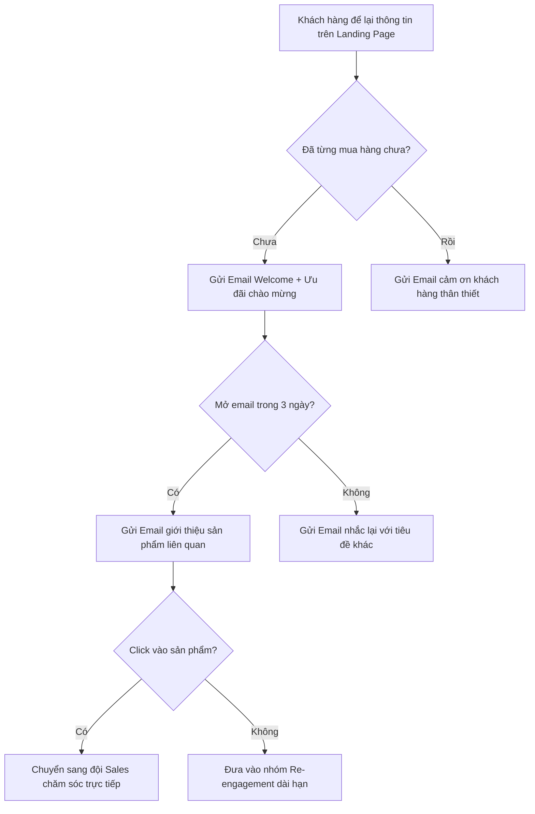
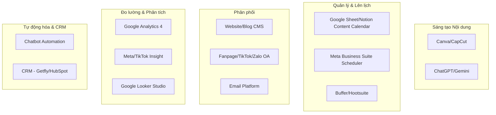
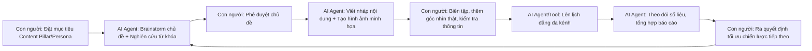
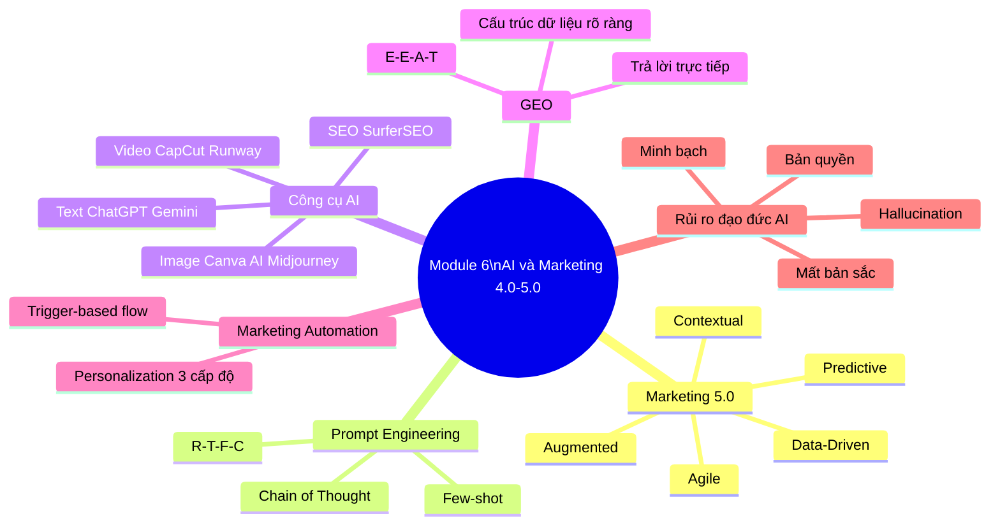

# MODULE 6: NÂNG CAO — AI & MARKETING 4.0/5.0 TRONG CONTENT MARKETING
## (Buổi học 9 - 10 | Thời lượng: 6 giờ)

---

## 1. MỤC TIÊU HỌC TẬP

Sau khi hoàn thành Module 6, học viên có thể:

- Hiểu vai trò của AI trong chuyển đổi Content Marketing từ 4.0 sang 5.0.
- Áp dụng kỹ thuật Prompt Engineering cơ bản để tăng tốc sáng tạo nội dung với ChatGPT/Gemini/Claude.
- Sử dụng thành thạo tối thiểu 5 công cụ AI hỗ trợ sản xuất nội dung (viết, hình ảnh, video, âm thanh).
- Hiểu khái niệm GEO (Generative Engine Optimization) — tối ưu nội dung để được các công cụ AI trích dẫn.
- Hiểu và thiết kế được quy trình Marketing Automation cơ bản.
- Hiểu khái niệm Personalization (cá nhân hóa nội dung) và Martech Stack.
- Xây dựng đề xuất hệ thống content vận hành bán tự động (Agentic AI Workflow) cho đồ án cá nhân.
- Nhận diện rủi ro đạo đức và hạn chế khi sử dụng AI trong content marketing.

---

## 2. NỘI DUNG LÝ THUYẾT CHI TIẾT

### 2.1. Từ Marketing 4.0 đến Marketing 5.0 — Vai trò của AI

Như đã đề cập ở Module 1, Marketing 5.0 là giai đoạn công nghệ (AI, Big Data, IoT, Blockchain) được ứng dụng để phục vụ trải nghiệm con người tốt hơn — không thay thế con người mà khuếch đại năng lực con người ("Augmented Marketing").

**5 thành phần cốt lõi của Marketing 5.0 (theo Kotler):**

| Thành phần | Mô tả | Ứng dụng trong Content Marketing |
|---|---|---|
| **Data-Driven Marketing** | Ra quyết định dựa trên dữ liệu lớn | Phân tích hành vi để dự đoán chủ đề nội dung sẽ hiệu quả |
| **Predictive Marketing** | Dự đoán hành vi khách hàng trước khi xảy ra | AI dự đoán thời điểm khách hàng sẵn sàng mua để gửi content phù hợp |
| **Contextual Marketing** | Cá nhân hóa theo ngữ cảnh thời gian thực | Website hiển thị nội dung khác nhau tùy theo hành vi, vị trí, thiết bị người dùng |
| **Augmented Marketing** | Công nghệ hỗ trợ con người (chatbot, AI content) | Chatbot AI trả lời khách hàng 24/7, AI hỗ trợ viết nháp nội dung |
| **Agile Marketing** | Thử nghiệm nhanh, học hỏi liên tục, điều chỉnh linh hoạt | Áp dụng A/B Testing liên tục với tốc độ nhanh nhờ AI tạo nhiều biến thể content |

### 2.2. Prompt Engineering cơ bản cho Content Marketing

**Định nghĩa**: Prompt Engineering là kỹ năng thiết kế câu lệnh (prompt) để khai thác tối đa khả năng của công cụ AI tạo sinh (Generative AI) như ChatGPT, Gemini, Claude.

**Công thức Prompt hiệu quả — Mô hình R-T-F-C (Role – Task – Format – Context):**

| Thành phần | Giải thích | Ví dụ |
|---|---|---|
| **Role (Vai trò)** | Yêu cầu AI đóng vai một chuyên gia cụ thể | "Bạn là một chuyên gia content marketing 10 năm kinh nghiệm trong ngành mỹ phẩm" |
| **Task (Nhiệm vụ)** | Mô tả rõ nhiệm vụ cần AI thực hiện | "Hãy viết 5 tiêu đề bài blog về chủ đề chăm sóc da mùa hè" |
| **Format (Định dạng)** | Yêu cầu định dạng đầu ra cụ thể | "Trình bày dạng bảng, mỗi tiêu đề kèm 1 dòng giải thích lý do hấp dẫn" |
| **Context (Bối cảnh)** | Cung cấp thông tin nền để AI hiểu đúng đối tượng | "Đối tượng là nữ văn phòng 25-35 tuổi, tone giọng gần gũi, không quá học thuật" |

**Ví dụ Prompt hoàn chỉnh áp dụng R-T-F-C:**
> "Bạn là một chuyên gia content marketing 10 năm kinh nghiệm trong ngành F&B tại Việt Nam. Hãy viết 5 caption Facebook quảng bá món trà sữa vị mới ra mắt, mỗi caption tối đa 80 từ, áp dụng công thức Hook-Story-CTA, tone giọng trẻ trung hài hước, đối tượng là học sinh sinh viên 16-22 tuổi. Trình bày kết quả dạng danh sách đánh số."

**Kỹ thuật Prompt nâng cao cần biết:**

1. **Few-shot Prompting**: Cung cấp 1-2 ví dụ mẫu để AI học theo văn phong/cấu trúc mong muốn trước khi tạo nội dung mới.
2. **Chain of Thought Prompting**: Yêu cầu AI "suy nghĩ từng bước" trước khi đưa kết quả cuối (phù hợp cho brainstorm chiến lược phức tạp: "Hãy phân tích từng bước: đầu tiên xác định persona, sau đó liệt kê pain point, cuối cùng đề xuất content pillar").
3. **Iterative Refinement (Tinh chỉnh lặp lại)**: Không kỳ vọng kết quả hoàn hảo ngay lần đầu — tiếp tục yêu cầu AI chỉnh sửa: "Hãy làm caption này ngắn gọn hơn, thêm 1 câu hỏi tương tác ở cuối".
4. **Negative Prompting**: Chỉ rõ điều KHÔNG muốn: "Không dùng từ ngữ quá formal, không dùng emoji quá nhiều (tối đa 2 emoji)".

### 2.3. Bộ công cụ AI hỗ trợ sản xuất nội dung (Content AI Toolstack)

| Nhóm | Công cụ tiêu biểu | Chức năng chính |
|---|---|---|
| **AI viết văn bản (Text Generation)** | ChatGPT, Gemini, Claude, Copy.ai | Viết nháp bài blog, caption, kịch bản, brainstorm ý tưởng, viết lại (rewrite), tóm tắt |
| **AI thiết kế hình ảnh (Image Generation)** | Canva AI (Magic Studio), Midjourney, Adobe Firefly, Leonardo AI | Tạo hình ảnh minh họa, poster, thay đổi background, mở rộng ảnh (generative fill) |
| **AI dựng video (Video Generation/Editing)** | CapCut AI, Runway ML, Pictory, HeyGen (AI Avatar) | Tự động tạo phụ đề, cắt ghép theo kịch bản, tạo avatar AI đọc kịch bản |
| **AI SEO & Nghiên cứu từ khóa** | SurferSEO, Frase, ChatGPT (kết hợp Search) | Phân tích đối thủ, gợi ý cấu trúc bài viết chuẩn SEO |
| **AI giọng nói (Voice/Audio)** | ElevenLabs, Google Text-to-Speech | Tạo voice-over cho video mà không cần thu âm thực tế |
| **AI Chatbot & Automation** | ManyChat, Zalo OA Chatbot, Chatfuel | Tự động trả lời tin nhắn, phân loại khách hàng tiềm năng theo kịch bản |
| **AI phân tích dữ liệu** | ChatGPT Data Analysis, Google Looker Studio (kết hợp AI insight) | Phân tích nhanh dữ liệu GA4/Meta xuất ra, tự động tạo báo cáo tóm tắt |

**Nguyên tắc sử dụng AI Tool hiệu quả (quan trọng — tránh lạm dụng)**:
- AI là **trợ lý tăng tốc (co-pilot)**, không phải người thay thế hoàn toàn tư duy chiến lược của Content Marketer.
- Luôn **biên tập lại (edit)** nội dung AI tạo ra để phù hợp Brand Voice, kiểm tra tính chính xác thông tin (AI có thể "ảo giác" - hallucination, tạo ra thông tin sai nhưng nghe hợp lý).
- Không nên đăng nguyên văn 100% nội dung AI tạo — cần thêm trải nghiệm/góc nhìn thật (yếu tố "Experience" trong E-E-A-T) để nội dung có giá trị khác biệt.

### 2.4. GEO (Generative Engine Optimization) — Xu hướng SEO mới

**Bối cảnh**: Ngày càng nhiều người dùng tìm kiếm thông tin trực tiếp qua ChatGPT, Google AI Overview, Gemini thay vì cách tìm kiếm truyền thống (gõ từ khóa, click vào link xanh). Điều này đòi hỏi content marketer phải tối ưu nội dung để được các công cụ AI này **trích dẫn và tổng hợp lại** khi trả lời người dùng.

**Nguyên tắc tối ưu GEO cơ bản:**

| Nguyên tắc | Giải thích |
|---|---|
| **Trả lời trực tiếp, rõ ràng** | Đặt câu trả lời ngắn gọn ngay đầu đoạn (giống Featured Snippet trước đây), AI dễ trích xuất |
| **Cấu trúc dữ liệu rõ ràng** | Dùng bảng, danh sách, heading rõ ràng giúp AI dễ "đọc hiểu" và tổng hợp |
| **Trích dẫn nguồn/số liệu cụ thể** | AI ưu tiên trích dẫn nội dung có số liệu, nghiên cứu, dẫn chứng rõ ràng thay vì ý kiến chung chung |
| **Đa dạng hóa nơi xuất hiện thông tin** | Không chỉ đăng trên website riêng, cần xuất hiện trên nhiều nguồn uy tín khác (báo chí, diễn đàn, Wikipedia nếu có thể) để tăng khả năng được AI "học" và trích dẫn |
| **Duy trì E-E-A-T mạnh** | AI có xu hướng ưu tiên trích dẫn nguồn có độ uy tín cao, giống nguyên tắc SEO truyền thống |

**Lưu ý cho học viên**: GEO không thay thế SEO truyền thống mà là lớp bổ sung song song — content marketer hiện đại cần tối ưu đồng thời cho cả người đọc, công cụ tìm kiếm truyền thống (Google) và công cụ AI tạo sinh.

### 2.5. Marketing Automation — Tự động hóa quy trình content

**Định nghĩa**: Là việc sử dụng phần mềm để tự động thực hiện các tác vụ marketing lặp lại (gửi email, đăng bài, phân loại khách hàng) dựa trên hành vi/điều kiện được thiết lập sẵn (trigger-based).

**Ví dụ một luồng Automation cơ bản (Email + Chatbot):**

**Công cụ Marketing Automation phổ biến tại Việt Nam:**
- **Email**: Mailchimp, GetResponse, ActiveCampaign.
- **Chatbot Zalo/Facebook**: Zalo OA Automation, ManyChat, Harasocial, Bizfly Chat.
- **CRM tích hợp**: HubSpot (bản free có giới hạn), Bitrix24, Getfly CRM (phổ biến tại VN).

### 2.6. Personalization (Cá nhân hóa nội dung)

**Định nghĩa**: Là việc điều chỉnh nội dung hiển thị phù hợp với từng cá nhân/phân khúc khách hàng dựa trên dữ liệu hành vi, sở thích, lịch sử tương tác — thay vì hiển thị 1 nội dung giống nhau cho tất cả mọi người.

**3 cấp độ Personalization:**

| Cấp độ | Mô tả | Ví dụ |
|---|---|---|
| **Cấp 1 — Segmentation (Phân khúc)** | Chia khách hàng thành nhóm theo tiêu chí chung (độ tuổi, khu vực, hành vi mua) | Gửi email khác nhau cho nhóm khách VIP và khách mới |
| **Cấp 2 — Behavioral Personalization** | Cá nhân hóa dựa trên hành vi cụ thể đã thực hiện | Gợi ý sản phẩm dựa trên lịch sử xem/mua hàng (giống Shopee, Tiki gợi ý "có thể bạn thích") |
| **Cấp 3 — Real-time AI Personalization** | Cá nhân hóa theo thời gian thực bằng AI, thay đổi linh hoạt theo từng phiên truy cập | Website thay đổi nội dung trang chủ ngay lập tức dựa trên hành vi vừa xảy ra của người dùng trong phiên đó |

**Lưu ý về đạo đức và quyền riêng tư (Privacy)**: Khi cá nhân hóa dựa trên dữ liệu người dùng, cần tuân thủ nguyên tắc minh bạch (thông báo rõ việc thu thập dữ liệu, có chính sách bảo mật rõ ràng) và tuân thủ quy định pháp luật liên quan đến bảo vệ dữ liệu cá nhân tại Việt Nam (Nghị định về bảo vệ dữ liệu cá nhân).

### 2.7. Martech Stack — Hệ sinh thái công nghệ Marketing

**Định nghĩa**: Là tập hợp các công cụ/phần mềm công nghệ được một doanh nghiệp sử dụng để thực hiện, quản lý và đo lường hoạt động marketing.

**Mô hình Martech Stack cơ bản cho doanh nghiệp nhỏ/content marketer mới bắt đầu:**

### 2.8. Agentic AI Content Workflow — Xu hướng tương lai (2025-2026 trở đi)

**Khái niệm mới nổi**: "Agentic AI" là các hệ thống AI có khả năng tự動 lập kế hoạch và thực hiện chuỗi nhiệm vụ phức tạp (không chỉ trả lời 1 câu hỏi đơn lẻ), ví dụ: tự nghiên cứu chủ đề → viết bài nháp → tạo hình ảnh minh họa → lên lịch đăng → theo dõi hiệu quả → đề xuất tối ưu, với sự giám sát/phê duyệt của con người ở các bước quan trọng (Human-in-the-loop).

**Mô hình quy trình Agentic AI Content Workflow đề xuất cho học viên tham khảo:**

**Lưu ý quan trọng**: Con người vẫn giữ vai trò quyết định ở các bước chiến lược (đặt mục tiêu, phê duyệt, kiểm tra chất lượng cuối) — AI đảm nhiệm phần thực thi lặp lại, tốn thời gian. Đây chính là tư duy "Augmented Marketing" đã đề cập ở Marketing 5.0.

### 2.9. Rủi ro đạo đức và hạn chế khi dùng AI trong Content Marketing

| Rủi ro | Giải thích | Cách phòng tránh |
|---|---|---|
| **AI Hallucination (Ảo giác AI)** | AI tạo ra thông tin sai nhưng trình bày tự tin, hợp lý | Luôn kiểm chứng số liệu/thông tin quan trọng từ nguồn chính thống trước khi xuất bản |
| **Mất bản sắc thương hiệu (Generic Content)** | Nội dung AI tạo hàng loạt dễ bị "nhạt", giống nhau giữa các thương hiệu nếu không biên tập kỹ | Luôn thêm góc nhìn/trải nghiệm thật, chỉnh sửa theo đúng Brand Voice đã xây dựng |
| **Vi phạm bản quyền hình ảnh/nội dung** | Một số công cụ AI tạo hình ảnh có thể vô tình tạo ra nội dung giống tác phẩm có bản quyền | Kiểm tra điều khoản sử dụng của từng công cụ AI, ưu tiên công cụ có cam kết bản quyền rõ ràng (Adobe Firefly cam kết dữ liệu train hợp pháp) |
| **Lạm dụng AI làm giảm chất lượng tư duy** | Phụ thuộc hoàn toàn vào AI khiến content marketer mất khả năng tư duy chiến lược độc lập | Luôn tự xây dựng chiến lược/insight trước, chỉ dùng AI để tăng tốc thực thi |
| **Thiếu minh bạch với người dùng** | Một số trường hợp cần công khai nội dung có sử dụng AI (ví dụ hình ảnh AI, giọng nói AI) để tránh gây hiểu lầm | Tuân thủ quy định minh bạch, gắn nhãn nội dung AI khi cần thiết theo quy định nền tảng/pháp luật |

---

## 3. PHÂN TÍCH CASE STUDY THỰC TIỄN

### Case Study 1: Doanh nghiệp nhỏ tăng năng suất content nhờ AI

Một shop mỹ phẩm nhỏ tại Việt Nam (1-2 nhân sự marketing) áp dụng quy trình: dùng ChatGPT để brainstorm 30 ý tưởng content/tháng theo Content Pillar đã xây dựng, dùng Canva AI để tạo hình ảnh nhanh, dùng CapCut AI để tự động tạo phụ đề video. Kết quả: tăng số lượng nội dung xuất bản từ 8 bài/tháng lên 25 bài/tháng mà không cần tuyển thêm nhân sự, đồng thời vẫn dành thời gian biên tập kỹ để giữ Brand Voice nhất quán.

**Bài học**: AI giúp giải quyết bài toán nguồn lực hạn chế của doanh nghiệp nhỏ, nhưng vai trò biên tập/kiểm soát chất lượng của con người vẫn là yếu tố quyết định thành công.

### Case Study 2: Rủi ro khi lạm dụng AI không kiểm chứng

Một trang tin/blog đăng bài viết do AI tạo hoàn toàn tự động, chứa số liệu sai lệch về công dụng sản phẩm (do AI "ảo giác" tạo ra thông tin không có thật). Bài viết bị cộng đồng phát hiện, gây khủng hoảng truyền thông nhỏ, ảnh hưởng uy tín thương hiệu.

**Bài học**: Đây là ví dụ điển hình về rủi ro AI Hallucination — nhấn mạnh nguyên tắc bắt buộc kiểm chứng thông tin trước khi xuất bản, đặc biệt với nội dung liên quan sức khỏe, tài chính, pháp lý (nhóm YMYL - Your Money Your Life mà Google đặc biệt khắt khe về E-E-A-T).

### Case Study 3: Bài tập thực hành Prompt Engineering trên lớp

Học viên thực hành trực tiếp trên ChatGPT/Gemini (miễn phí) tại lớp:
1. Viết 1 prompt "tệ" (thiếu Role-Task-Format-Context) và ghi nhận kết quả.
2. Viết lại prompt theo đúng công thức R-T-F-C cho cùng 1 yêu cầu.
3. So sánh chất lượng đầu ra giữa 2 lần, rút ra bài học về tầm quan trọng của Prompt Engineering.

---

## 4. TỔNG KẾT MODULE 6

### 4.1. Tóm tắt kiến thức cốt lõi

1. Marketing 5.0 lấy công nghệ (đặc biệt AI) làm công cụ khuếch đại năng lực con người, không thay thế hoàn toàn con người ("Augmented Marketing").
2. Prompt Engineering theo công thức R-T-F-C (Role-Task-Format-Context) giúp khai thác tối đa hiệu quả từ công cụ AI tạo sinh.
3. Cần thành thạo tối thiểu 5-7 công cụ AI phục vụ các khâu khác nhau: viết, thiết kế, dựng video, SEO, phân tích dữ liệu.
4. GEO (Generative Engine Optimization) là xu hướng tối ưu mới, song song với SEO truyền thống, để nội dung được các công cụ AI trích dẫn.
5. Marketing Automation và Personalization giúp vận hành content ở quy mô lớn hơn mà không cần tăng nhân sự tương ứng.
6. Agentic AI Content Workflow là xu hướng tương lai, nhưng con người vẫn cần giữ vai trò quyết định chiến lược (Human-in-the-loop).
7. Cần nhận diện và phòng tránh các rủi ro đạo đức khi dùng AI: Hallucination, mất bản sắc thương hiệu, vi phạm bản quyền, thiếu minh bạch.

### 4.2. Bộ Keyword cần ghi nhớ

`Marketing 5.0` • `Augmented Marketing` • `Predictive Marketing` • `Contextual Marketing` • `Prompt Engineering` • `R-T-F-C Framework` • `Few-shot Prompting` • `Chain of Thought Prompting` • `GEO (Generative Engine Optimization)` • `AI Hallucination` • `Marketing Automation` • `Trigger-based Workflow` • `Personalization` • `Martech Stack` • `Agentic AI` • `Human-in-the-loop` • `YMYL (Your Money Your Life)`

### 4.3. Sơ đồ tư duy tổng kết Module 6

---

## 5. BÀI TẬP THỰC HÀNH (Buổi 9-10)

### Bài tập 1 (Cá nhân — tại lớp, 30 phút)

Thực hành viết 3 prompt khác nhau theo công thức R-T-F-C cho 3 mục đích: (1) brainstorm chủ đề content, (2) viết caption social, (3) viết outline bài blog SEO — áp dụng cho thương hiệu đồ án cá nhân.

### Bài tập 2 (Cá nhân — về nhà)

Sử dụng tối thiểu 3 công cụ AI khác nhau (1 công cụ viết, 1 công cụ hình ảnh, 1 công cụ video/audio) để sản xuất 1 bộ nội dung hoàn chỉnh cho đồ án (bài viết + hình ảnh + video ngắn), sau đó viết báo cáo ngắn (300 từ) mô tả quy trình sử dụng và đánh giá ưu-nhược điểm mỗi công cụ.

### Bài tập 3 (Cá nhân — về nhà)

Chọn 1 bài blog đã viết ở Module 3, áp dụng nguyên tắc GEO để tối ưu lại: thêm câu trả lời trực tiếp đầu đoạn, cấu trúc lại dạng bảng/danh sách, bổ sung số liệu/dẫn chứng cụ thể.

### Bài tập 4 (Cá nhân — về nhà)

Thiết kế 1 luồng Marketing Automation cơ bản (dạng sơ đồ flowchart) cho thương hiệu đồ án, tối thiểu 5 bước có điều kiện rẽ nhánh (trigger-based).

### Bài tập 5 (Cá nhân — về nhà, chuẩn bị cho đồ án tốt nghiệp)

Đề xuất mô hình Agentic AI Content Workflow áp dụng cho thương hiệu đồ án: xác định rõ những bước nào AI đảm nhiệm, những bước nào con người phải kiểm soát/phê duyệt (Human-in-the-loop).

**Tiêu chí chấm điểm (Rubric):**

| Tiêu chí | Điểm tối đa |
|---|---|
| Prompt viết đúng công thức R-T-F-C, hiệu quả rõ ràng | 2 điểm |
| Sử dụng thành thạo tối thiểu 3 công cụ AI, có đánh giá khách quan | 3 điểm |
| Bài blog tối ưu GEO đúng nguyên tắc | 2 điểm |
| Luồng Marketing Automation logic, khả thi | 2 điểm |
| Đề xuất Agentic AI Workflow hợp lý, phân định rõ vai trò người-AI | 1 điểm |
| **Tổng** | **10 điểm** |

---

## 6. CÂU HỎI TỰ ĐÁNH GIÁ NHANH (Self-Check Quiz — 10 câu)

1. Nêu 5 thành phần cốt lõi của Marketing 5.0 theo Kotler.
2. Công thức R-T-F-C trong Prompt Engineering là viết tắt của gì? Giải thích từng thành phần.
3. Phân biệt Few-shot Prompting và Chain of Thought Prompting.
4. GEO là gì? Khác gì so với SEO truyền thống? Vì sao content marketer cần quan tâm cả hai?
5. AI Hallucination là gì? Rủi ro cụ thể nào có thể xảy ra nếu không kiểm chứng thông tin AI tạo ra?
6. Nêu 3 cấp độ Personalization và cho ví dụ mỗi cấp độ.
7. Martech Stack là gì? Kể tên tối thiểu 4 nhóm công cụ nên có trong Martech Stack cơ bản của content marketer mới.
8. Agentic AI Workflow khác gì so với việc dùng ChatGPT trả lời từng câu hỏi đơn lẻ?
9. "Human-in-the-loop" nghĩa là gì? Vì sao nguyên tắc này quan trọng khi ứng dụng AI vào content marketing?
10. Nêu 2 ví dụ về nội dung thuộc nhóm YMYL (Your Money Your Life) cần đặc biệt cẩn trọng khi dùng AI hỗ trợ viết.

---

## 7. KIẾN THỨC BỔ SUNG CẦN ĐỌC THÊM

- Sách "Marketing 5.0: Technology for Humanity" — Philip Kotler, Hermawan Kartajaya, Iwan Setiawan.
- Tài liệu chính thức OpenAI/Anthropic/Google về Prompt Engineering best practices.
- Nghiên cứu về "Generative Engine Optimization (GEO)" — các bài nghiên cứu học thuật và blog ngành marketing công nghệ cập nhật năm 2024-2026.
- Google's Search Quality Rater Guidelines — phần về YMYL content để hiểu rõ mức độ khắt khe cần có khi viết nội dung nhạy cảm.
- Các khóa học miễn phí về AI cơ bản: "Prompt Engineering for Everyone" (Coursera/DeepLearning.AI).
- Tìm hiểu quy định pháp luật Việt Nam về bảo vệ dữ liệu cá nhân và quảng cáo có yếu tố AI (cập nhật liên tục do đây là lĩnh vực pháp lý mới).

---

## 8. LƯU Ý CHO GIẢNG VIÊN

- Đây là module hấp dẫn nhất với học viên trẻ nhưng cũng dễ khiến học viên ảo tưởng "AI làm được tất cả" — cần liên tục nhấn mạnh vai trò tư duy chiến lược của con người đã học ở Module 1-2 là nền tảng không thể thay thế.
- Nên demo trực tiếp trên lớp sự khác biệt giữa 1 prompt "tệ" và 1 prompt chuẩn R-T-F-C để học viên thấy ngay hiệu quả (rất trực quan và thuyết phục).
- Cảnh báo học viên về rủi ro chia sẻ thông tin nhạy cảm/bảo mật của khách hàng, doanh nghiệp khi dùng các công cụ AI miễn phí (dữ liệu có thể được dùng để huấn luyện mô hình) — đặc biệt quan trọng khi học viên áp dụng cho công ty thật đang làm việc.
- Vì đây là lĩnh vực thay đổi nhanh, giảng viên nên cập nhật danh sách công cụ AI mới nhất trước mỗi khóa học (công cụ được liệt kê trong tài liệu có thể thay đổi tính năng/giá cả theo thời gian).
- Bài tập 5 (Agentic AI Workflow) nên được xem là bước chuẩn bị trực tiếp cho đồ án tốt nghiệp — khuyến khích học viên đầu tư kỹ vì đây sẽ là điểm nhấn khác biệt trong bài thuyết trình bảo vệ.

---

*(Hết Module 6 — Kết thúc toàn bộ 6 Module kiến thức chính. Tiếp tục với file 07-KE-HOACH-DAO-TAO-CHI-TIET.md để xem giáo án vận hành chi tiết từng buổi học.)*
