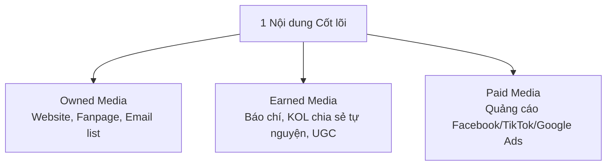
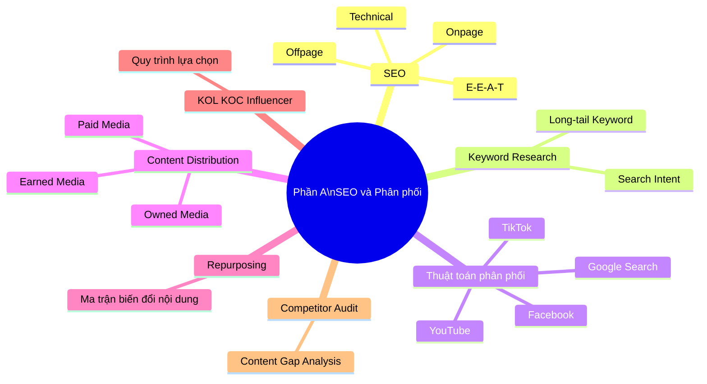
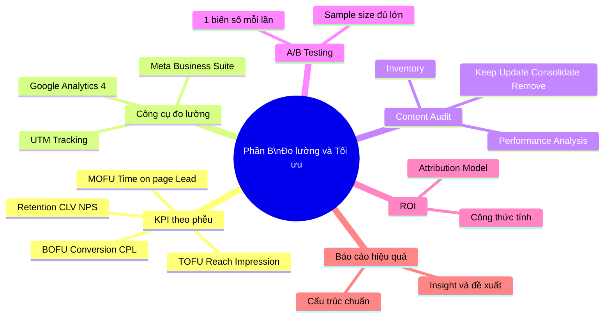
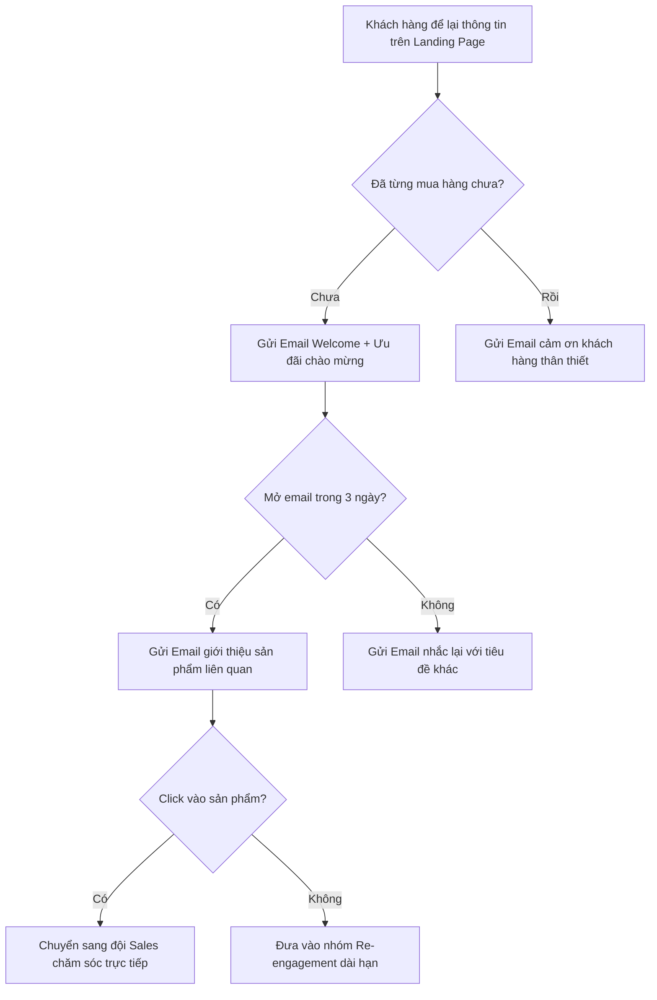
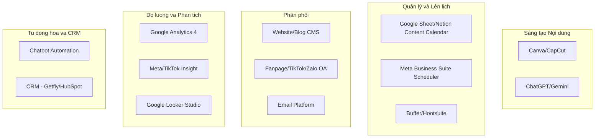
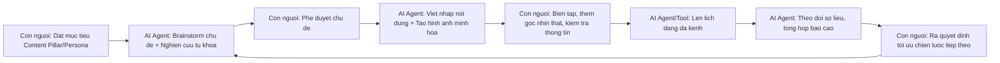
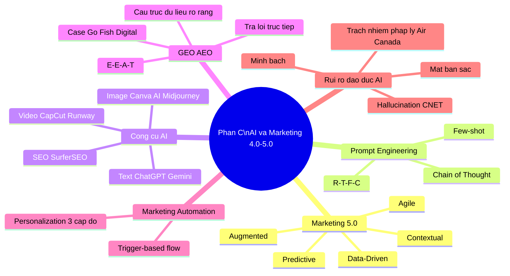
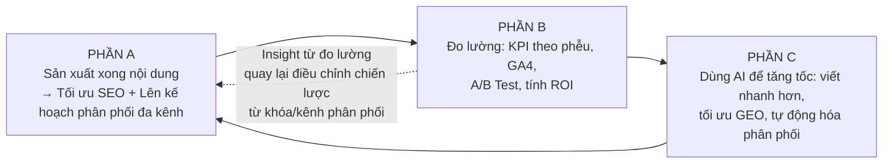
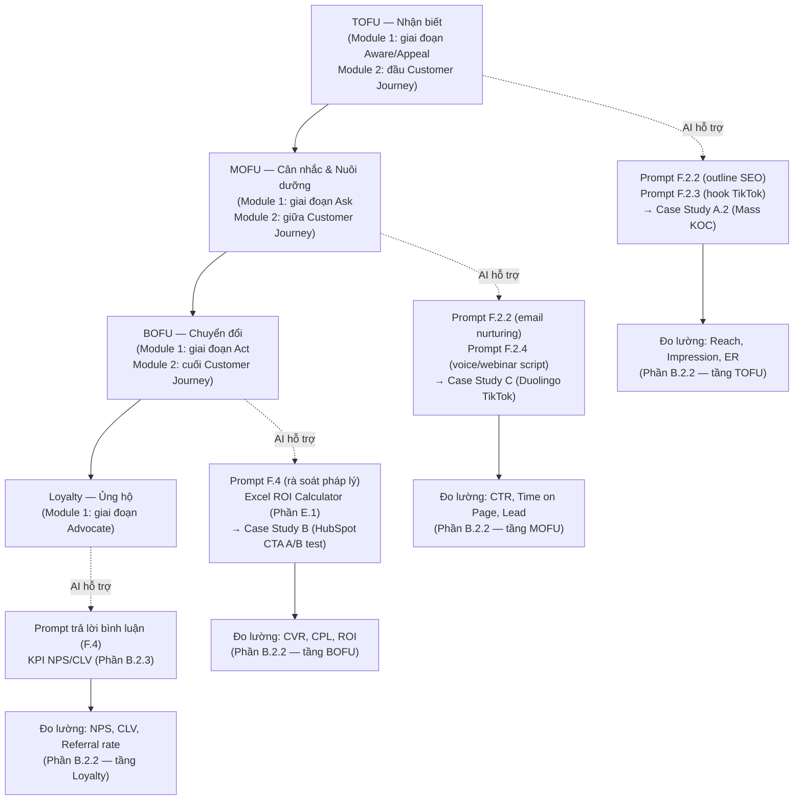
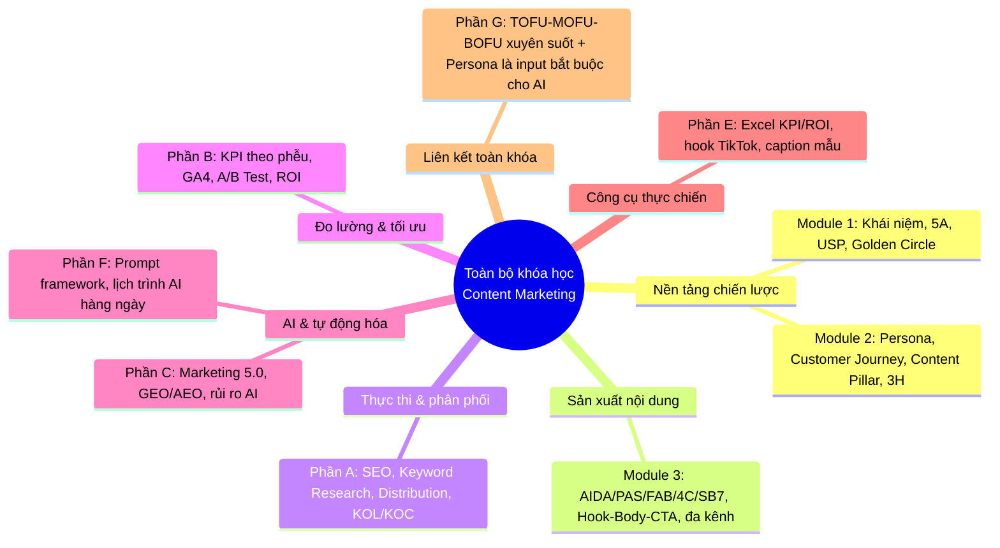

# TÀI LIỆU GIẢNG DẠY TỔNG HỢP
# SEO & PHÂN PHỐI — ĐO LƯỜNG & TỐI ƯU — AI & MARKETING 4.0/5.0 TRONG CONTENT MARKETING
## (Gộp và biên tập lại từ Module 4, Module 5, Module 6 — bản dành cho giảng dạy và ứng dụng thực tiễn)

---

## LỜI DẪN CỦA NGƯỜI BIÊN TẬP

Tài liệu này gộp 3 module gốc (Module 4 – SEO & Phân phối, Module 5 – Đo lường & Tối ưu, Module 6 – AI & Marketing 4.0/5.0) thành **1 file duy nhất**, vì trên thực tế đây là **một chuỗi vận hành liên tục và không thể tách rời**:

> **Sản xuất nội dung (Module 1-3) → Đưa nội dung đến đúng người qua đúng kênh (SEO & Phân phối) → Đo xem nội dung có hiệu quả không (Đo lường & Tối ưu) → Dùng AI để làm cả 2 việc trên nhanh hơn, rẻ hơn, thông minh hơn (AI & Marketing 5.0).**

So với 3 file gốc, bản gộp này đã được **review, phản biện và bổ sung** theo 4 nguyên tắc:

1. **Chính xác hóa**: sửa các lỗi kỹ thuật nhỏ, làm rõ những khái niệm dễ gây hiểu nhầm (ví dụ: framework "R-T-F-C" là cách đặt tên riêng của chương trình học này, không phải chuẩn quốc tế duy nhất — cần biết thêm các biến thể phổ biến khác).
2. **Giải thích thuật ngữ cho người mới**: mọi từ viết tắt/thuật ngữ chuyên ngành khi xuất hiện lần đầu đều có phần giải thích bằng tiếng Việt dễ hiểu, đặt trong hộp 📘 **Giải thích cho người mới**.
3. **Case study thực tế, có nguồn dẫn chứng**: thay toàn bộ case study giả định ("một shop mỹ phẩm nào đó...", "một fanpage nào đó...") bằng case study **có tên thương hiệu thật, số liệu thật, nguồn trích dẫn cụ thể** (HubSpot, Duolingo, Air Canada, CNET, các case GEO 2024-2025, thị trường KOC Việt Nam...). Case study giả định mang tính minh họa sư phạm vẫn được giữ lại nhưng gắn nhãn rõ **"Tình huống minh họa (giả định)"** để không gây nhầm lẫn với case thật.
4. **Bổ sung phần còn thiếu**: thêm ví dụ số liệu tính tay cho các công thức (Engagement Rate, CTR, ROI...), thêm bảng so sánh framework, thêm phần đáp án gợi ý cho câu hỏi tự đánh giá, thêm phần liên kết 3 phần lại thành 1 quy trình vận hành duy nhất.

---

## MỤC LỤC

- **PHẦN 0** — Bảng thuật ngữ nhanh (tra cứu nhanh trước khi học)
- **PHẦN A** — SEO & Phân phối nội dung *(Module 4 cũ)*
- **PHẦN B** — Đo lường & Tối ưu nội dung *(Module 5 cũ)*
- **PHẦN C** — AI & Marketing 4.0/5.0 trong Content Marketing *(Module 6 cũ)*
- **PHẦN D** — Tổng kết chung: Liên kết 3 phần thành 1 quy trình vận hành + Dự án tổng hợp cuối khóa + Đáp án gợi ý
- **PHẦN E** — Cẩm nang thực chiến: Bảng tính KPI/ROI có công thức Excel thật + Cách làm nội dung TikTok/Facebook ngành Bất động sản (hook, kịch bản video, caption mẫu, checklist)
- **PHẦN F** — Ứng dụng AI tự động hóa công việc hàng ngày: Cấu trúc Prompt chuẩn nâng cao + AI kiểm tra số liệu/làm nội dung Text-Video-Voice + Lịch trình chi tiết 1 ngày/1 tuần kèm prompt sẵn dùng
- **PHẦN G** — Liên kết Module 1-2-3 với Module 4-5-6: Nhắc lại Persona/Customer Journey/Content Pillar/TOFU-MOFU-BOFU đã học, và quy trình ứng dụng AI xuyên suốt phễu TOFU→MOFU→BOFU→Loyalty cho ngành Bất động sản

---

## PHẦN 0. BẢNG THUẬT NGỮ NHANH (dành cho người mới, tra cứu trước khi đọc)

> 📘 **Cách dùng bảng này**: Nếu bạn là người mới hoàn toàn với Content Marketing, hãy đọc lướt qua bảng này trước. Mỗi thuật ngữ đều được giải thích lại chi tiết hơn ngay tại phần nội dung tương ứng — bảng này chỉ giúp bạn có hình dung ban đầu, không cần học thuộc.

| Thuật ngữ | Viết tắt của | Giải thích ngắn gọn |
|---|---|---|
| SEO | Search Engine Optimization | Tối ưu để nội dung/website xuất hiện thứ hạng cao trên Google một cách tự nhiên (không trả tiền) |
| SERP | Search Engine Result Page | Trang kết quả tìm kiếm — nơi hiển thị các link khi bạn gõ từ khóa trên Google |
| E-E-A-T | Experience – Expertise – Authoritativeness – Trustworthiness | Bộ 4 tiêu chí Google dùng để đánh giá "nội dung này có đáng tin, có chuyên môn thật không" |
| KOL | Key Opinion Leader | Người có chuyên môn/uy tín trong 1 lĩnh vực cụ thể (bác sĩ, chuyên gia...) |
| KOC | Key Opinion Consumer | Người tiêu dùng bình thường nhưng review chân thực, có ảnh hưởng vì "giống người thật" |
| TOFU / MOFU / BOFU | Top/Middle/Bottom of Funnel | 3 tầng của "phễu marketing": Nhận biết → Cân nhắc → Quyết định mua |
| KPI | Key Performance Indicator | Chỉ số đo lường hiệu quả then chốt, dùng để biết công việc có đạt mục tiêu hay không |
| GA4 | Google Analytics 4 | Công cụ miễn phí của Google để đo lường traffic và hành vi người dùng trên website |
| UTM | Urchin Tracking Module (tên gọi lịch sử, nay hiểu đơn giản là "mã theo dõi nguồn traffic") | Đoạn mã gắn vào cuối link để biết traffic đến từ kênh nào, chiến dịch nào |
| CTR | Click Through Rate | Tỷ lệ người thấy nội dung mà bấm vào (click) |
| CPL | Cost per Lead | Chi phí trung bình để có được 1 khách hàng tiềm năng (lead) |
| CLV | Customer Lifetime Value | Tổng giá trị 1 khách hàng mang lại trong suốt thời gian gắn bó với thương hiệu |
| NPS | Net Promoter Score | Chỉ số đo mức độ khách hàng sẵn sàng giới thiệu thương hiệu cho người khác |
| ROI | Return On Investment | Tỷ suất lợi nhuận trên chi phí đã bỏ ra |
| A/B Testing | (không viết tắt) | Phương pháp so sánh 2 phiên bản nội dung để biết phiên bản nào hiệu quả hơn, dựa trên số liệu thật |
| AI | Artificial Intelligence | Trí tuệ nhân tạo |
| Prompt | (không viết tắt, mượn tiếng Anh) | Câu lệnh/yêu cầu bạn gõ vào để "ra lệnh" cho AI tạo sinh (ChatGPT, Gemini...) |
| GEO | Generative Engine Optimization | Tối ưu nội dung để được các công cụ AI (ChatGPT, Google AI Overview...) trích dẫn khi trả lời người dùng — "SEO cho thời đại AI" |
| AEO | Answer Engine Optimization | Tên gọi khác, gần như đồng nghĩa với GEO, nhấn mạnh việc tối ưu để được chọn làm "câu trả lời" |
| YMYL | Your Money Your Life | Nhóm nội dung nhạy cảm (sức khỏe, tài chính, pháp lý) mà Google yêu cầu độ chính xác/uy tín rất cao |
| Hallucination (AI) | (không viết tắt) | Hiện tượng AI "bịa" ra thông tin sai nhưng trình bày rất tự tin, nghe có vẻ đúng |

---

*(Nội dung chi tiết bắt đầu từ PHẦN A bên dưới)*

---
---

# PHẦN A. SEO & PHÂN PHỐI NỘI DUNG (SEO & CONTENT DISTRIBUTION)

## A.1. MỤC TIÊU HỌC TẬP

Sau khi hoàn thành Phần A, học viên có thể:

- Hiểu nguyên lý hoạt động cơ bản của công cụ tìm kiếm (Google) và thuật toán phân phối nội dung mạng xã hội.
- Thực hiện nghiên cứu từ khóa (Keyword Research) cơ bản bằng công cụ miễn phí.
- Phân biệt và áp dụng SEO Onpage, Offpage, Technical SEO ở mức cơ bản.
- Xây dựng kế hoạch phân phối nội dung đa kênh (Content Distribution Plan).
- Hiểu và áp dụng Content Repurposing (tái sử dụng nội dung) để tối ưu nguồn lực sản xuất.
- Đánh giá và lựa chọn hình thức hợp tác với KOL/KOC/Influencer phù hợp ngân sách và mục tiêu.
- Thực hiện Competitor Content Audit (kiểm toán nội dung đối thủ) cơ bản.

---

## A.2. NỘI DUNG LÝ THUYẾT CHI TIẾT

### A.2.1. Nguyên lý hoạt động của SEO (Search Engine Optimization)

> 📘 **Giải thích cho người mới**: **SEO** = *Search Engine Optimization* (Tối ưu hóa công cụ tìm kiếm). Hiểu đơn giản: khi bạn gõ 1 câu hỏi lên Google, Google sẽ trả về hàng ngàn kết quả — SEO là tập hợp kỹ thuật giúp trang của bạn xuất hiện ở **vị trí cao** trong danh sách đó **mà không phải trả tiền quảng cáo** cho vị trí hiển thị (khác với chạy quảng cáo Google Ads — phải trả tiền cho mỗi lượt click).

**SEO là gì?** Là tập hợp các kỹ thuật giúp nội dung/website xuất hiện thứ hạng cao trên trang kết quả tìm kiếm (**SERP** — *Search Engine Result Page*, tức trang kết quả tìm kiếm) một cách tự nhiên (organic — không trả phí trực tiếp cho vị trí hiển thị).

**3 trụ cột của SEO:**

| Trụ cột | Nội dung | Ví dụ hành động |
|---|---|---|
| **Onpage SEO** | Tối ưu ngay trên trang nội dung | Tối ưu Title, Meta description, Heading, mật độ từ khóa, hình ảnh, tốc độ tải trang, cấu trúc URL |
| **Offpage SEO** | Tối ưu các yếu tố bên ngoài trang | Backlink (liên kết từ website khác trỏ về), guest post, PR, social signal |
| **Technical SEO** | Tối ưu kỹ thuật nền tảng website | Tốc độ tải trang (Core Web Vitals), responsive di động, sitemap.xml, robots.txt, HTTPS |

> 📘 **Giải thích thêm các từ trong bảng trên (cho người mới)**:
> - **Backlink**: một link từ website khác trỏ về website của bạn — giống như "lời giới thiệu" từ bên thứ ba, càng nhiều website uy tín giới thiệu bạn thì Google càng tin bạn uy tín.
> - **Core Web Vitals**: bộ 3 chỉ số Google dùng đo "trải nghiệm tải trang" (tốc độ hiển thị nội dung chính, độ ổn định giao diện khi tải, tốc độ phản hồi khi bấm) — trang tải chậm/giật sẽ bị Google đánh giá thấp.
> - **Sitemap.xml / robots.txt**: 2 file kỹ thuật giúp Google biết website có những trang nào và trang nào nên/không nên thu thập dữ liệu (crawl).
> - **HTTPS**: giao thức bảo mật, website có HTTPS sẽ có biểu tượng ổ khóa trên trình duyệt — Google ưu tiên website an toàn.

**Khái niệm E-E-A-T (Google's Quality Rater Guidelines — Hướng dẫn đánh giá chất lượng của Google):**

> 📘 **Giải thích cho người mới**: **E-E-A-T** là 4 chữ cái đầu của 4 tiêu chí tiếng Anh: Experience, Expertise, Authoritativeness, Trustworthiness. Đây **không phải là 1 thuật toán tính điểm tự động**, mà là **bộ hướng dẫn** Google đưa ra cho đội ngũ đánh giá chất lượng tìm kiếm (Quality Raters — con người thật) và cũng được các hệ thống xếp hạng tự động học theo tinh thần đó.

Google đánh giá chất lượng nội dung dựa trên 4 tiêu chí:
- **Experience (Trải nghiệm)**: Người viết có trải nghiệm thực tế với chủ đề không?
- **Expertise (Chuyên môn)**: Người viết có kiến thức chuyên sâu không?
- **Authoritativeness (Uy tín)**: Trang web/tác giả có được công nhận là nguồn uy tín trong ngành không?
- **Trustworthiness (Đáng tin cậy)**: Thông tin có chính xác, minh bạch, có nguồn dẫn chứng không?

Đây là lý do vì sao content chỉ viết hay chưa đủ — cần có yếu tố chuyên môn thật, dẫn nguồn rõ ràng, tác giả có thông tin minh bạch (Author Bio).

> ⚠️ **Lưu ý phản biện (review bổ sung)**: Nhiều tài liệu SEO phổ thông nhầm lẫn E-E-A-T là "yếu tố xếp hạng trực tiếp" (ranking factor) giống Core Web Vitals. Trên thực tế, Google xác nhận E-E-A-T **không phải một con số/tín hiệu xếp hạng đơn lẻ** mà là **khung tư duy** để đánh giá tổng thể độ tin cậy của nội dung — nó ảnh hưởng gián tiếp qua nhiều tín hiệu khác (backlink từ nguồn uy tín, thông tin tác giả, độ chính xác nội dung...). Giảng viên nên làm rõ điểm này để học viên không hiểu sai rằng "thêm Author Bio là auto lên top".

### A.2.2. Quy trình Nghiên cứu từ khóa (Keyword Research) cơ bản

> 📘 **Giải thích cho người mới**: **Keyword Research** (nghiên cứu từ khóa) là việc tìm hiểu xem khách hàng mục tiêu đang **gõ những câu/từ gì lên Google** khi họ tìm sản phẩm/dịch vụ liên quan đến bạn, để từ đó biết nên viết bài về chủ đề gì.

**Quy trình 5 bước:**

1. **Bước 1 — Xác định Seed Keyword (từ khóa hạt giống)**: Từ khóa gốc liên quan trực tiếp đến sản phẩm/ngành hàng (ví dụ: "kem chống nắng").
2. **Bước 2 — Mở rộng từ khóa**: Dùng Google Suggest (gõ từ khóa và xem gợi ý tự động), People Also Ask (mục "Mọi người cũng hỏi" hiện ra trên trang kết quả Google), Google Keyword Planner (miễn phí khi có tài khoản Google Ads), Google Trends, AnswerThePublic (bản free giới hạn).
3. **Bước 3 — Phân loại từ khóa theo Search Intent (mục đích tìm kiếm — tức là "người gõ từ khóa này đang muốn gì")**:
   - **Informational** (tìm hiểu thông tin): "kem chống nắng là gì", "cách chọn kem chống nắng"
   - **Navigational** (tìm thương hiệu cụ thể): "kem chống nắng Anessa"
   - **Commercial Investigation** (so sánh trước khi mua): "kem chống nắng nào tốt nhất 2026", "so sánh kem chống nắng A và B"
   - **Transactional** (sẵn sàng mua): "mua kem chống nắng Anessa chính hãng", "kem chống nắng giá rẻ"
4. **Bước 4 — Đánh giá độ khó và lượng tìm kiếm**: Ưu tiên từ khóa có lượng tìm kiếm ổn định, độ cạnh tranh phù hợp với năng lực website (website mới nên ưu tiên **long-tail keyword** — từ khóa dài, cụ thể, ít cạnh tranh hơn từ khóa ngắn/chung chung).
5. **Bước 5 — Ánh xạ từ khóa vào Content Pillar/Calendar**: Mỗi từ khóa chính nên gắn với 1 bài viết cụ thể, tránh 2 bài cùng nhắm 1 từ khóa (**keyword cannibalization** — hiện tượng "tự cạnh tranh với chính mình": 2 bài của cùng 1 website cùng nhắm 1 từ khóa sẽ khiến Google phân vân nên xếp hạng bài nào, kết quả cả 2 bài đều bị xếp hạng kém hơn tiềm năng thật).

**Bảng phân loại Search Intent và loại Content tương ứng:**

| Search Intent | Loại Content phù hợp | Vị trí trong phễu |
|---|---|---|
| Informational | Bài blog giáo dục, hướng dẫn, định nghĩa | TOFU (Top of Funnel — đỉnh phễu, giai đoạn nhận biết) |
| Commercial Investigation | Bài so sánh, review, bảng xếp hạng "Top 10..." | MOFU (Middle of Funnel — giữa phễu, giai đoạn cân nhắc) |
| Transactional | Trang sản phẩm, landing page, trang danh mục | BOFU (Bottom of Funnel — đáy phễu, giai đoạn quyết định mua) |
| Navigational | Trang chủ, trang thương hiệu | Nhận diện/Retention (giữ chân khách hàng cũ) |

### A.2.3. Thuật toán phân phối nội dung trên mạng xã hội (Distribution Algorithm)

Mỗi nền tảng có thuật toán riêng nhưng đều dựa trên nguyên lý chung: **ưu tiên nội dung giữ người dùng ở lại nền tảng lâu nhất và tạo tương tác thật.**

| Nền tảng | Yếu tố thuật toán ưu tiên | Điều nên làm | Điều nên tránh |
|---|---|---|---|
| **Facebook** | Thời gian xem, bình luận có ý nghĩa (meaningful comment), share, native video | Đặt câu hỏi mở, khuyến khích bình luận, hạn chế để link ngoài trong bài viết chính | Đăng liên tục nội dung giống nhau, spam link, dùng "engagement bait" bị cấm |
| **Instagram** | Save, share qua tin nhắn, thời gian xem Reels, tỷ lệ theo dõi từ Explore | Nội dung có giá trị lưu lại (tips, infographic), Reels bắt trend âm thanh | Hình ảnh chất lượng thấp, hashtag không liên quan |
| **TikTok** | Watch time (thời gian xem), completion rate (tỷ lệ xem hết video), re-watch, chia sẻ | Hook mạnh, video ngắn gọn đúng trọng tâm, tương tác trả lời bình luận bằng video | Quảng cáo lộ liễu ngay đầu video, nội dung vi phạm cộng đồng |
| **YouTube** | Watch time, session time (giữ chân người xem sang video khác), CTR thumbnail | Thumbnail hấp dẫn, tiêu đề rõ giá trị, playlist giữ chân người xem | Thumbnail sai sự thật (clickbait quá đà), tiêu đề giật gân không đúng nội dung |
| **Google Search** | Relevance, E-E-A-T, tốc độ tải trang, trải nghiệm di động | Nội dung chuyên sâu, cập nhật thường xuyên, backlink chất lượng | Nội dung sao chép, nhồi nhét từ khóa, mua backlink kém chất lượng |

> 📘 **Giải thích cho người mới**: **"Engagement bait"** (câu tương tác) là các câu như "Tag 3 người bạn vào đây", "Comment số 1 nếu bạn đồng ý" — trước đây được dùng nhiều để tăng tương tác giả, nhưng Facebook đã cập nhật thuật toán để **phát hiện và giảm hiển thị** loại nội dung này vì nó không phản ánh sự quan tâm thật.

### A.2.4. Content Distribution Plan — Kế hoạch phân phối nội dung

**Mô hình phân phối theo 3 loại kênh (Owned – Earned – Paid Media):**

> 📘 **Giải thích cho người mới**: Đây là 3 chữ tiếng Anh rất phổ biến trong ngành truyền thông:
> - **Owned Media** (kênh sở hữu): kênh của chính thương hiệu, tự kiểm soát hoàn toàn (website, fanpage, danh sách email).
> - **Earned Media** (kênh "kiếm được"): không phải trả tiền, mà do người khác tự nguyện lan tỏa (báo chí viết về bạn, khách hàng chia sẻ, KOL nhắc đến bạn miễn phí vì thích sản phẩm).
> - **Paid Media** (kênh trả phí): quảng cáo trả tiền để hiển thị (Facebook Ads, TikTok Ads, Google Ads).



| Loại kênh | Định nghĩa | Ưu điểm | Nhược điểm |
|---|---|---|---|
| **Owned Media** | Kênh thương hiệu tự sở hữu và kiểm soát | Miễn phí, kiểm soát hoàn toàn thông điệp | Cần thời gian xây dựng lượng theo dõi/traffic |
| **Earned Media** | Được bên thứ ba lan tỏa tự nguyện (báo chí, khách hàng chia sẻ) | Độ tin cậy cao nhất, chi phí thấp | Không kiểm soát được nội dung/thời điểm |
| **Paid Media** | Trả phí để hiển thị | Kiểm soát tốc độ và đối tượng tiếp cận | Chi phí liên tục, dừng chi là dừng hiệu quả |

**Chiến lược phân phối 1 nội dung Hero (ví dụ áp dụng thực tế):**
1. Xuất bản bản đầy đủ trên Website (Owned) — bài blog Pillar Page chuẩn SEO.
2. Cắt thành 3-5 đoạn video ngắn đăng TikTok/Reels (Owned, tối ưu cho từng nền tảng).
3. Tóm tắt thành carousel đăng Instagram/LinkedIn (Owned).
4. Gửi email đến danh sách khách hàng hiện tại giới thiệu nội dung (Owned).
5. Gửi cho 2-3 KOL/nhóm cộng đồng liên quan để chia sẻ (Earned).
6. Chạy quảng cáo boost bài viết/video hiệu quả nhất đến đối tượng mục tiêu mở rộng (Paid).

### A.2.5. Content Repurposing (Tái sử dụng nội dung)

> 📘 **Giải thích cho người mới**: **Repurpose** nghĩa đen là "dùng lại cho mục đích khác". Trong content marketing, đây là kỹ thuật lấy **1 nội dung gốc** đã đầu tư công sức, rồi "cắt/biến đổi" thành **nhiều định dạng khác nhau** để đăng ở nhiều nơi, thay vì mỗi lần đăng lại phải nghĩ ý tưởng hoàn toàn mới.

**Ma trận Repurposing — Từ 1 bài viết dài thành 10+ nội dung:**

| Nội dung gốc | Có thể biến đổi thành |
|---|---|
| 1 bài blog 1500 từ | → 1 video YouTube dài giải thích chi tiết |
| | → 3-5 video TikTok/Reels ngắn (mỗi đoạn 1 ý chính) |
| | → 1 carousel Instagram/LinkedIn (mỗi slide 1 ý) |
| | → 1 infographic tóm tắt |
| | → 3-5 caption Facebook (trích đoạn hay nhất) |
| | → 1 email newsletter |
| | → 1 câu hỏi thảo luận đăng lên group cộng đồng |
| | → 1 podcast episode (đọc và mở rộng bàn luận) |
| | → Slide thuyết trình/webinar |

**Lợi ích của Content Repurposing:**
- Tiết kiệm đáng kể thời gian sản xuất so với làm nội dung mới hoàn toàn mỗi lần (nhiều agency ước tính tiết kiệm 50-70% thời gian tùy mức độ biến đổi — con số này thay đổi theo từng trường hợp cụ thể, nên xem là ước lượng tham khảo chứ không phải số liệu cố định).
- Tăng tần suất xuất hiện trước khách hàng trên nhiều kênh mà không cần nhiều ý tưởng mới.
- Tối đa hóa ROI của công sức nghiên cứu/sản xuất ban đầu (đặc biệt với nội dung cần đầu tư nhiều: phỏng vấn chuyên gia, nghiên cứu số liệu...).

### A.2.6. Hợp tác KOL – KOC – Influencer

| Loại | Đặc điểm | Lượng theo dõi | Chi phí | Phù hợp mục tiêu |
|---|---|---|---|---|
| **KOL (Key Opinion Leader — Người dẫn dắt dư luận)** | Người có chuyên môn/uy tín trong lĩnh vực cụ thể (bác sĩ da liễu, chuyên gia tài chính...) | Đa dạng, không nhất thiết follow lớn | Trung bình - Cao | Xây dựng niềm tin, độ uy tín (Trust) |
| **Celebrity/Influencer lớn** | Người nổi tiếng, follow triệu | Rất lớn (>1 triệu) | Rất cao | Nhận diện thương hiệu (Awareness) diện rộng |
| **Micro-Influencer** | Follow vừa phải, cộng đồng gắn kết cao | 10,000 - 100,000 | Trung bình | Tương tác chất lượng, target theo ngách (niche) |
| **KOC (Key Opinion Consumer — Người tiêu dùng có ảnh hưởng)** | Người tiêu dùng có ảnh hưởng qua trải nghiệm thật, review chân thực | Đa dạng, có thể follow nhỏ (thậm chí micro/nano <10,000 follow) | Thấp - Trung bình | Độ tin cậy cao, thúc đẩy quyết định mua (Decision) |

**Quy trình lựa chọn KOL/KOC (5 bước):**
1. Xác định mục tiêu chiến dịch (Awareness/Consideration/Conversion).
2. Xác định persona mục tiêu → tìm KOL/KOC có tệp follow trùng khớp.
3. Đánh giá chất lượng tương tác thật (không chỉ số follow) — kiểm tra tỷ lệ tương tác thực (Engagement Rate), soi bình luận có phải người thật không.
4. Thương lượng nội dung: cho KOL sáng tạo theo phong cách riêng (native), tránh ép kịch bản cứng nhắc gây phản cảm.
5. Đo lường qua mã giảm giá riêng/link tracking riêng cho từng KOL để đánh giá hiệu quả thực tế.

### A.2.7. Competitor Content Audit (Kiểm toán nội dung đối thủ)

> 📘 **Giải thích cho người mới**: **Audit** nghĩa là "kiểm toán/rà soát có hệ thống". Competitor Content Audit là việc **rà soát có bài bản** nội dung của đối thủ (không phải chỉ "lướt fanpage đối thủ cho biết") để tìm ra chỗ họ làm tốt, chỗ họ còn bỏ trống.

**Quy trình thực hiện:**
1. Liệt kê 3-5 đối thủ cạnh tranh trực tiếp và gián tiếp.
2. Thu thập dữ liệu: tần suất đăng bài, loại nội dung, engagement trung bình, top 5 bài viết hiệu quả nhất trong 3-6 tháng gần nhất.
3. Phân tích Content Pillar của đối thủ đang tập trung vào đâu.
4. Xác định khoảng trống (**Content Gap** — chủ đề đối thủ chưa khai thác hoặc khai thác chưa tốt).
5. Đề xuất chiến lược khác biệt hóa (không sao chép, mà học hỏi + làm khác biệt).

**Mẫu bảng Competitor Content Audit:**

| Tiêu chí | Đối thủ A | Đối thủ B | Thương hiệu của bạn |
|---|---|---|---|
| Tần suất đăng bài/tuần | | | |
| Kênh mạnh nhất | | | |
| Content Pillar chính | | | |
| Engagement Rate trung bình | | | |
| Điểm mạnh nổi bật | | | |
| Điểm yếu/khoảng trống | | | |

---

## A.3. PHÂN TÍCH CASE STUDY THỰC TIỄN (đã cập nhật — có nguồn dẫn chứng thật)

### Case Study A.1 (thật, có nguồn): HubSpot — cắt bỏ 3.000 bài blog cũ để tăng traffic SEO

**Bối cảnh**: HubSpot (công ty phần mềm marketing/CRM hàng đầu thế giới, cũng là công ty tiên phong khái niệm Inbound Marketing) sở hữu kho blog khổng lồ hơn 15.000 bài viết tích lũy nhiều năm. Đội SEO của họ phát hiện: rất nhiều bài cũ, trùng chủ đề, ít traffic đang **kéo tụt hiệu suất SEO tổng thể** của cả website thay vì đóng góp giá trị.

**Hành động cụ thể**: HubSpot thực hiện Content Audit bài bản — kiểm kê toàn bộ bài viết, đo traffic/backlink/tỷ lệ chuyển đổi từng bài, sau đó **gỡ bỏ (prune) hơn 3.000 bài** có traffic thấp/nội dung lỗi thời/trùng chủ đề, đồng thời **gộp (consolidate)** nhiều bài nhỏ trùng chủ đề thành 1 bài chuyên sâu duy nhất.

**Kết quả đo được (theo công bố chính thức của HubSpot)**:
- Traffic blog tăng khoảng **12% ngay tháng kế tiếp** sau đợt gỡ bài đầu tiên.
- Số URL bị Google thu thập dữ liệu (crawl) giảm khoảng **38%**, giúp Google tập trung "ngân sách crawl" vào các trang giá trị cao.
- Các bài được **gộp lại** (3-5 bài yếu gộp thành 1 bài mạnh) ghi nhận trung bình tăng **89% traffic organic** trong 90 ngày sau khi gộp.

**Bài học cho học viên**: "Nhiều nội dung hơn" không đồng nghĩa "SEO tốt hơn". Một website có ít bài nhưng mỗi bài đều chuyên sâu, được cập nhật, không trùng lặp chủ đề (tránh keyword cannibalization) thường hiệu quả hơn nhiều so với kho nội dung dàn trải, lỗi thời. Đây chính là ứng dụng thực tế của khái niệm Content Audit (sẽ học sâu hơn ở Phần B).

*Nguồn tham khảo: HubSpot Blog — "Why We Removed 3,000 Pieces of Outdated Content From the HubSpot Blog" (blog.hubspot.com/marketing/remove-outdated-content).*

### Case Study A.2 (thật, có nguồn): Chiến lược "Mass KOC" trên TikTok Shop tại Việt Nam

**Bối cảnh**: Thị trường TikTok Shop tại Việt Nam giai đoạn 2023-2025 chứng kiến sự dịch chuyển rõ rệt từ mô hình dựa vào vài KOL/Celebrity lớn sang mô hình **"Mass KOC"** — hợp tác cùng lúc hàng trăm, thậm chí hàng nghìn KOC nhỏ (follow từ vài nghìn đến vài chục nghìn).

**Số liệu thị trường thực tế**: Theo các khảo sát ngành được trích dẫn trên các báo cáo influencer marketing Việt Nam, tỷ lệ người tiêu dùng Việt Nam mua hàng dựa trên gợi ý của KOL/KOC đã tăng từ khoảng **66% (2022) lên 77%** trong các khảo sát gần đây — cho thấy vai trò ngày càng lớn của hình thức này.

**Ví dụ thực tế — Yody (thương hiệu thời trang Việt Nam)**: Yody đã tận dụng livestream kết hợp mạng lưới nhà sáng tạo nội dung trên TikTok Shop, đạt hơn 90.000 người theo dõi và ghi nhận tăng trưởng doanh thu đáng kể nhờ chiến lược livestream tương tác thời gian thực kết hợp hợp tác influencer, thay vì chỉ dựa vào quảng cáo trả phí truyền thống.

**Nguyên lý đằng sau chiến lược này**: mỗi KOC review chân thực tạo ra "bằng chứng xã hội" (**social proof**) phân tán trên nhiều cộng đồng nhỏ; tổng hiệu ứng tin cậy cộng dồn từ hàng trăm review nhỏ thường tạo niềm tin bền vững hơn 1 quảng cáo lớn từ celebrity (vốn dễ bị người xem nhận diện là "quảng cáo trả tiền").

**Bài học**: Với ngân sách hạn chế (phù hợp người mới bắt đầu/doanh nghiệp nhỏ), chiến lược "nhiều KOC nhỏ, có kiểm soát chất lượng nội dung" thường hiệu quả hơn về ROI so với dồn toàn bộ ngân sách cho 1 Influencer lớn — nhưng cần đầu tư vào hệ thống quản lý/đào tạo mạng lưới KOC để đảm bảo chất lượng đồng đều.

*Nguồn tham khảo: Vietnam Influencer X — "Vietnam KOL Ecosystem: The Rise of KOL and KOC Programs" (2024); Feedforce Vietnam — phân tích TikTok Shop và thương mại điện tử Việt Nam.*

### Case Study A.3 (tình huống minh họa — giả định, dùng để luyện tập): Chiến lược SEO của trang tin tức/blog tài chính tại Việt Nam

Các trang như CafeF, VnExpress Kinh doanh xây dựng lượng lớn bài viết informational với mật độ xuất bản dày đặc và backlink tự nhiên từ độ uy tín lâu năm — đây là ví dụ về **Domain Authority** cao (chỉ số ước lượng mức độ uy tín tổng thể của 1 tên miền, do các công cụ SEO bên thứ ba như Ahrefs/Moz tính toán, không phải chỉ số chính thức của Google). Với người mới bắt đầu/website nhỏ, học viên cần hiểu chiến lược khả thi hơn: tập trung **long-tail keyword** (từ khóa dài, ít cạnh tranh) thay vì cạnh tranh trực tiếp với các "ông lớn" ở từ khóa ngắn, cạnh tranh cao.

### Bài tập thực hành Competitor Audit (tại lớp)

Học viên thực hành audit trực tiếp 3 đối thủ của thương hiệu đồ án cá nhân (dùng fanpage/website thật, không dùng dữ liệu giả định), điền đầy đủ bảng Competitor Content Audit, trình bày 5 phút kết quả phát hiện Content Gap.

---

## A.4. TỔNG KẾT PHẦN A

### A.4.1. Tóm tắt kiến thức cốt lõi

1. SEO gồm 3 trụ cột: Onpage, Offpage, Technical — cần hiểu tổng thể dù không chuyên sâu kỹ thuật.
2. E-E-A-T là khung đánh giá chất lượng nội dung hiện đại của Google (không phải 1 tín hiệu xếp hạng đơn lẻ) — chuyên môn thật và độ tin cậy ngày càng quan trọng hơn kỹ thuật SEO thuần túy.
3. Search Intent quyết định loại nội dung cần sản xuất cho mỗi từ khóa — sai Intent thì dù SEO tốt cũng không chuyển đổi được.
4. Mỗi nền tảng mạng xã hội có thuật toán riêng, cần hiểu để tối ưu phân phối tự nhiên (organic).
5. Content Repurposing giúp tối đa hóa giá trị từ 1 nội dung gốc, tiết kiệm nguồn lực đáng kể (bằng chứng: case HubSpot khi tối ưu/gộp nội dung).
6. Lựa chọn KOL/KOC cần dựa trên mục tiêu chiến dịch và persona, không chỉ dựa vào số lượng follow — thị trường Việt Nam đang chứng minh hiệu quả rõ rệt của chiến lược Mass KOC.
7. Competitor Content Audit giúp tìm ra khoảng trống thị trường (Content Gap) để tạo khác biệt.

### A.4.2. Bộ Keyword cần ghi nhớ

`Onpage SEO` • `Offpage SEO` • `Technical SEO` • `E-E-A-T` • `Search Intent` • `Long-tail Keyword` • `Keyword Cannibalization` • `SERP` • `Core Web Vitals` • `Owned/Earned/Paid Media` • `Content Distribution Plan` • `Content Repurposing` • `KOL` • `KOC` • `Micro-Influencer` • `Engagement Rate` • `Competitor Content Audit` • `Content Gap` • `Domain Authority` • `Backlink`

### A.4.3. Sơ đồ tư duy tổng kết Phần A



---

## A.5. BÀI TẬP THỰC HÀNH

### Bài tập A.1 (Cá nhân — tại lớp, 30 phút)

Thực hiện nghiên cứu từ khóa cơ bản cho thương hiệu đồ án: xác định 1 Seed Keyword, mở rộng thành tối thiểu 10 từ khóa liên quan (dùng Google Suggest/People Also Ask), phân loại theo 4 loại Search Intent.

### Bài tập A.2 (Cá nhân — về nhà)

Xây dựng Content Distribution Plan cho 1 nội dung Hero đã có trong Content Calendar: liệt kê chi tiết cách phân phối qua Owned/Earned/Paid Media, tối thiểu 6 hình thức phân phối cụ thể.

### Bài tập A.3 (Cá nhân — về nhà)

Áp dụng Ma trận Content Repurposing: từ 1 bài blog đã viết, đề xuất tối thiểu 8 định dạng nội dung khác có thể tái sử dụng.

### Bài tập A.4 (Nhóm — tại lớp, 45 phút)

Thực hiện Competitor Content Audit hoàn chỉnh cho 3 đối thủ (dùng bảng mẫu đã học), xác định tối thiểu 2 Content Gap và đề xuất chiến lược khai thác.

### Bài tập A.5 (Cá nhân — về nhà)

Đề xuất kế hoạch hợp tác KOL/KOC: chọn 3 KOL/KOC phù hợp persona (có thể là ví dụ thực tế trên mạng xã hội), giải thích lý do lựa chọn và ngân sách/hình thức hợp tác dự kiến. Tham khảo case study A.2 (Mass KOC) để cân nhắc giữa chiến lược "1 KOL lớn" và "nhiều KOC nhỏ".

**Tiêu chí chấm điểm (Rubric):**

| Tiêu chí | Điểm tối đa |
|---|---|
| Nghiên cứu từ khóa đầy đủ, phân loại đúng Search Intent | 2 điểm |
| Content Distribution Plan chi tiết, đa dạng kênh | 2 điểm |
| Ma trận Repurposing sáng tạo, khả thi | 2 điểm |
| Competitor Audit đầy đủ, phát hiện Content Gap có căn cứ | 3 điểm |
| Đề xuất KOL/KOC hợp lý, có lý do rõ ràng | 1 điểm |
| **Tổng** | **10 điểm** |

---

## A.6. CÂU HỎI TỰ ĐÁNH GIÁ NHANH (10 câu — có đáp án gợi ý ở Phần D)

1. Nêu 3 trụ cột của SEO và cho ví dụ mỗi trụ cột.
2. E-E-A-T là viết tắt của gì? Vì sao đây là "khung đánh giá" chứ không phải "1 tín hiệu xếp hạng đơn lẻ"?
3. Kể tên 4 loại Search Intent và loại content phù hợp mỗi loại.
4. Keyword Cannibalization là gì? Hậu quả của nó? Liên hệ với case study HubSpot.
5. Phân biệt Owned Media, Earned Media, Paid Media — cho ví dụ mỗi loại.
6. Content Repurposing mang lại lợi ích gì? Cho ví dụ biến đổi 1 bài blog thành 3 định dạng khác.
7. Phân biệt KOL và KOC. Vì sao chiến lược "Mass KOC" lại hiệu quả tại thị trường Việt Nam?
8. Micro-Influencer có ưu điểm gì so với Celebrity/Influencer lớn về mặt ngân sách và hiệu quả?
9. Competitor Content Audit giúp phát hiện điều gì quan trọng nhất cho chiến lược content?
10. Thuật toán TikTok ưu tiên yếu tố nào nhất? Vì sao "Completion Rate" quan trọng hơn cả lượt xem?

---

## A.7. KIẾN THỨC BỔ SUNG CẦN ĐỌC THÊM

- Google Search Central Documentation (developers.google.com/search) — tài liệu chính thức của Google về SEO.
- Google Search Quality Rater Guidelines (bản PDF công khai) — tài liệu gốc về E-E-A-T.
- Ahrefs Blog, Backlinko Blog (Brian Dean) — nguồn tham khảo SEO uy tín hàng đầu.
- HubSpot Blog — bài "Why We Removed 3,000 Pieces of Outdated Content" (case study A.1 ở trên).
- TikTok for Business — tài liệu chính thức về thuật toán và best practice nội dung.
- Báo cáo "Influencer Marketing Vietnam" hàng năm của các công ty nghiên cứu thị trường để cập nhật mức giá và xu hướng hợp tác KOL/KOC tại Việt Nam.

---

## A.8. LƯU Ý CHO GIẢNG VIÊN

- Phần này có tính kỹ thuật cao hơn — nên chuẩn bị demo trực tiếp trên máy chiếu (gõ từ khóa trên Google để xem gợi ý tự động, mở Google Search Console mẫu) để học viên hình dung trực quan.
- Nếu lớp học có học viên đã có website/fanpage thật, khuyến khích demo trực tiếp Google Search Console hoặc Meta Business Suite của chính học viên đó.
- Với bài tập Competitor Audit, nên giới hạn thời gian thực hành ngay tại lớp để đảm bảo tính thời sự và thực tế của dữ liệu thu thập.
- Nhấn mạnh cho học viên: SEO là "cuộc chơi dài hạn" (3-6 tháng mới thấy kết quả rõ rệt) — case study HubSpot cho thấy ngay cả doanh nghiệp lớn cũng cần rà soát/điều chỉnh liên tục, không có "công thức 1 lần là xong mãi mãi".

---
---

# PHẦN B. ĐO LƯỜNG & TỐI ƯU NỘI DUNG (MEASUREMENT & OPTIMIZATION)

## B.1. MỤC TIÊU HỌC TẬP

Sau khi hoàn thành Phần B, học viên có thể:

- Xây dựng hệ thống KPI đo lường hiệu quả content theo từng tầng phễu (TOFU-MOFU-BOFU).
- Đọc hiểu và diễn giải báo cáo cơ bản từ Google Analytics 4 (GA4) và Meta Business Suite.
- Thực hiện Content Audit (kiểm toán nội dung đã xuất bản) để xác định nội dung nào cần giữ, cập nhật, hoặc gỡ bỏ.
- Thiết kế và thực hiện A/B Testing cơ bản cho content.
- Tính toán ROI (Return on Investment) của một chiến dịch content marketing.
- Xây dựng báo cáo tổng kết chiến dịch (Content Performance Report) chuyên nghiệp, có đề xuất tối ưu.

---

## B.2. NỘI DUNG LÝ THUYẾT CHI TIẾT

### B.2.1. Vì sao đo lường Content Marketing khó hơn Performance Marketing?

> 📘 **Giải thích cho người mới**: **Performance Marketing** là hình thức marketing có thể đo trực tiếp "chi bao nhiêu tiền → ra bao nhiêu đơn hàng" gần như ngay lập tức (ví dụ chạy quảng cáo Google Ads/Facebook Ads dạng trả tiền theo click). **Content Marketing** thì khác — khách hàng đọc 1 bài blog hôm nay nhưng có thể 2-3 tháng sau mới quay lại mua hàng. Khoảng thời gian trễ này gọi là **lag effect (hiệu ứng độ trễ)**.

Vì vậy, cần một hệ thống KPI đa tầng thay vì chỉ nhìn vào doanh số trực tiếp.

**Nguyên tắc vàng**: "Đo đúng chỉ số cho đúng mục tiêu, đúng giai đoạn phễu" — không nên lấy KPI của TOFU (Reach, Impression) để đánh giá thất bại/thành công của toàn bộ chiến lược content.

### B.2.2. Hệ thống KPI theo từng tầng phễu

> 📘 **Giải thích cho người mới về "phễu marketing" (Marketing Funnel)**: Hình dung hành trình khách hàng giống 1 cái phễu — trên miệng phễu rất nhiều người biết đến bạn (TOFU), qua quá trình sàng lọc chỉ còn một phần quan tâm thật sự (MOFU), và cuối cùng chỉ 1 phần nhỏ thực sự mua hàng (BOFU). Sau khi mua, còn 1 giai đoạn nữa là giữ chân/biến họ thành người ủng hộ thương hiệu (Retention/Advocacy).

| Tầng phễu | Mục tiêu | KPI chính | Công cụ đo |
|---|---|---|---|
| **TOFU (Top of Funnel — Đỉnh phễu/Nhận biết)** | Tăng độ nhận diện, tiếp cận | Reach, Impressions, Video Views, Follower Growth Rate, Brand Mention | Meta Business Suite, TikTok Analytics, Google Alerts |
| **MOFU (Middle of Funnel — Giữa phễu/Cân nhắc)** | Xây dựng niềm tin, thu thập lead | Time on Page, Bounce Rate, Email Subscribe Rate, Download Rate, Comment/Share có ý nghĩa | Google Analytics 4, Email platform (Mailchimp) |
| **BOFU (Bottom of Funnel — Đáy phễu/Quyết định)** | Thúc đẩy chuyển đổi | Conversion Rate, CTR (Click Through Rate), Cost per Lead (CPL), Add to Cart Rate | GA4 Conversion tracking, Facebook Pixel, TikTok Pixel |
| **Retention/Advocacy (Giữ chân/Ủng hộ)** | Giữ chân, tạo ủng hộ | Repeat Purchase Rate, Customer Lifetime Value (CLV), Net Promoter Score (NPS), Referral Rate | CRM, Email platform, khảo sát NPS |

### B.2.3. Định nghĩa chi tiết các chỉ số quan trọng (kèm ví dụ tính tay cụ thể)

> 📘 **Giải thích cho người mới**: Đừng lo nếu thấy công thức "khó nuốt" — mỗi công thức bên dưới đều có 1 ví dụ số liệu cụ thể ngay sau đó để bạn hình dung cách tính thực tế.

| Chỉ số | Công thức | Ý nghĩa |
|---|---|---|
| **Engagement Rate (Tỷ lệ tương tác)** | (Like + Comment + Share) / Reach × 100% | Đo mức độ nội dung "chạm" được người xem |
| **CTR (Click Through Rate — Tỷ lệ click)** | Số click / Số impression × 100% | Đo sức hấp dẫn của tiêu đề/hình ảnh khiến người dùng click |
| **Conversion Rate (Tỷ lệ chuyển đổi)** | Số hành động mục tiêu / Tổng số truy cập × 100% | Đo hiệu quả thúc đẩy hành động cụ thể (mua hàng, đăng ký) |
| **Bounce Rate (Tỷ lệ thoát trang)** | Số phiên chỉ xem 1 trang rồi rời đi / Tổng số phiên × 100% | Đo mức độ nội dung có giữ chân người đọc không |
| **CPL (Cost per Lead — Chi phí trên mỗi lead)** | Tổng chi phí / Số lead thu được | Đo hiệu quả chi phí thu thập khách hàng tiềm năng |
| **CLV (Customer Lifetime Value — Giá trị vòng đời khách hàng)** | Giá trị trung bình đơn hàng × Số lần mua trung bình × Thời gian gắn bó trung bình | Đo giá trị dài hạn 1 khách hàng mang lại |
| **NPS (Net Promoter Score — Điểm ủng hộ ròng)** | % Người ủng hộ (Promoter) − % Người phản đối (Detractor) | Đo mức độ khách hàng sẵn sàng giới thiệu thương hiệu |

**Ví dụ tính tay (dành cho người mới, dùng số liệu giả định đơn giản):**

- Một bài đăng Facebook tiếp cận (Reach) **10.000 người**, nhận được **300 like + 50 comment + 20 share**.
  → Engagement Rate = (300 + 50 + 20) / 10.000 × 100% = **3,7%**
- Một quảng cáo hiển thị (Impression) **50.000 lần**, có **1.000 lượt click**.
  → CTR = 1.000 / 50.000 × 100% = **2%**
- Trong 1.000 người click vào landing page, có **40 người điền form đăng ký**.
  → Conversion Rate = 40 / 1.000 × 100% = **4%**
- Chi 5.000.000đ chạy quảng cáo, thu được **25 lead**.
  → CPL = 5.000.000 / 25 = **200.000đ/lead**
- Khách hàng trung bình mua 500.000đ/lần, mua trung bình 4 lần/năm, gắn bó trung bình 3 năm.
  → CLV = 500.000 × 4 × 3 = **6.000.000đ**
- Khảo sát 100 khách hàng: 60 người là Promoter (cho điểm 9-10), 25 người trung lập, 15 người là Detractor (cho điểm 0-6).
  → NPS = 60% − 15% = **45 điểm** (thang NPS từ -100 đến +100, trên 0 được xem là tích cực, trên 50 được xem là rất tốt).

### B.2.4. Đọc hiểu Google Analytics 4 (GA4) cơ bản

> 📘 **Giải thích cho người mới**: **GA4 (Google Analytics 4)** là phiên bản mới nhất (từ 2020, bắt buộc thay thế Universal Analytics từ 7/2023) của công cụ phân tích website miễn phí nổi tiếng nhất của Google. Nó cho biết: ai đang vào website bạn, họ từ đâu tới, họ làm gì trên đó, và có bao nhiêu người thực hiện hành động bạn mong muốn (mua hàng, điền form...).

| Báo cáo | Thông tin cung cấp | Ứng dụng cho Content Marketer |
|---|---|---|
| **Báo cáo Traffic Acquisition** | Nguồn traffic đến từ đâu (Organic Search, Social, Direct, Referral) | Đánh giá kênh nào đang mang lại traffic tốt nhất, phân bổ nguồn lực hợp lý |
| **Báo cáo Engagement (Pages and Screens)** | Trang nào được xem nhiều nhất, thời gian trung bình trên trang | Xác định content nào đang hiệu quả để nhân rộng/tối ưu |
| **Báo cáo Conversions** | Số lượng và tỷ lệ hoàn thành mục tiêu đã thiết lập (mua hàng, điền form) | Đánh giá content nào thực sự dẫn đến chuyển đổi |
| **Báo cáo Demographics** | Độ tuổi, giới tính, khu vực người truy cập | Đối chiếu với Persona đã xây dựng, kiểm tra có đúng đối tượng mục tiêu không |
| **Realtime Report** | Người dùng đang hoạt động theo thời gian thực | Theo dõi hiệu quả ngay sau khi xuất bản/chạy chiến dịch |

**Lưu ý kỹ thuật quan trọng**: Cần thiết lập **UTM tracking** (UTM Source, Medium, Campaign — 3 tham số cơ bản gắn vào cuối 1 đường link để đánh dấu "link này tôi chia sẻ ở đâu, qua kênh nào, thuộc chiến dịch nào") cho mọi link chia sẻ trên các kênh khác nhau để GA4 có thể phân biệt chính xác traffic đến từ kênh nào, chiến dịch nào — đây là kỹ năng bắt buộc, tránh tình trạng "không biết khách từ đâu ra".

> 📘 **Ví dụ 1 link UTM hoàn chỉnh cho người mới**:
> `https://tenwebsite.com/bai-viet?utm_source=facebook&utm_medium=social&utm_campaign=khuyenmai_thang9`
> - `utm_source=facebook`: link này chia sẻ trên Facebook.
> - `utm_medium=social`: hình thức là mạng xã hội (phân biệt với `email`, `cpc` - quảng cáo trả tiền theo click...).
> - `utm_campaign=khuyenmai_thang9`: link này thuộc chiến dịch khuyến mãi tháng 9.

### B.2.5. Đọc hiểu Meta Business Suite (Facebook/Instagram Insight)

| Chỉ số | Ý nghĩa |
|---|---|
| **Reach (Tiếp cận)** | Số người dùng duy nhất nhìn thấy nội dung |
| **Impressions (Số lần hiển thị)** | Tổng số lần nội dung được hiển thị (1 người có thể xem nhiều lần) |
| **Engagement (Tương tác)** | Tổng like, comment, share, click |
| **Video Average Watch Time** | Thời gian xem trung bình của video |
| **Audience Insight** | Thông tin nhân khẩu học của người theo dõi |
| **Best Time to Post** | Khung giờ follower hoạt động nhiều nhất |

### B.2.6. Content Audit (Kiểm toán nội dung)

**Định nghĩa**: Là quá trình rà soát toàn bộ nội dung đã xuất bản để đánh giá hiệu quả, từ đó quyết định: **Giữ nguyên (Keep) – Cập nhật (Update) – Gộp lại (Consolidate) – Gỡ bỏ (Remove)**.

> 📘 **Xem lại Case Study A.1 (HubSpot)** ở Phần A — đó chính là 1 ví dụ thực tế quy mô lớn của quy trình Content Audit sắp trình bày dưới đây.

**Quy trình Content Audit 4 bước:**

1. **Kiểm kê (Inventory)**: Liệt kê toàn bộ nội dung đã xuất bản (URL, ngày đăng, chủ đề, tác giả).
2. **Phân tích hiệu quả (Performance Analysis)**: Gắn dữ liệu traffic, engagement, conversion cho từng nội dung.
3. **Đánh giá chất lượng (Quality Assessment)**: Kiểm tra nội dung có còn chính xác/cập nhật không.
4. **Quyết định hành động (Action Plan)**:
   - **Keep**: Nội dung vẫn hiệu quả, giữ nguyên.
   - **Update**: Nội dung có tiềm năng nhưng cần cập nhật thông tin/tối ưu SEO lại.
   - **Consolidate**: Nhiều bài viết trùng lặp chủ đề → gộp thành 1 bài chuyên sâu hơn (giải quyết Keyword Cannibalization).
   - **Remove/Redirect**: Nội dung lỗi thời → gỡ bỏ hoặc chuyển hướng (**301 redirect** — lệnh kỹ thuật báo cho Google và trình duyệt biết "trang này đã chuyển vĩnh viễn sang địa chỉ mới") sang bài liên quan.

**Tần suất thực hiện Content Audit đề xuất**: 6 tháng/lần đối với website có xuất bản đều đặn.

### B.2.7. A/B Testing cho Content

> 📘 **Giải thích cho người mới**: **A/B Testing** (hay "split testing") là việc cho **2 nhóm khách hàng khác nhau** xem **2 phiên bản khác nhau** (Phiên bản A và Phiên bản B) của cùng 1 nội dung, để xem phiên bản nào tạo ra kết quả tốt hơn — thay vì đoán mò theo cảm tính "tôi thấy cái này hay hơn".

**Các yếu tố có thể A/B Test trong Content Marketing:**

| Yếu tố | Ví dụ biến thể |
|---|---|
| Tiêu đề (Headline) | "5 mẹo chăm da mùa hè" vs "Đừng bỏ lỡ 5 mẹo chăm da mùa hè này" |
| Hình ảnh/Thumbnail | Ảnh sản phẩm đơn giản vs ảnh có người mẫu sử dụng |
| CTA (Call to Action — lời kêu gọi hành động) | "Mua ngay" vs "Khám phá ngay" vs "Nhận ưu đãi" |
| Thời điểm đăng | 12h trưa vs 20h tối |
| Định dạng | Video vs Hình ảnh tĩnh cho cùng 1 thông điệp |
| Độ dài nội dung | Caption ngắn vs Caption dài kể chuyện |

**Nguyên tắc thực hiện A/B Test đúng chuẩn:**
1. Chỉ thay đổi **1 biến số** mỗi lần test.
2. Đảm bảo mẫu đủ lớn (**sample size**) để kết quả có ý nghĩa thống kê.
3. Chạy test trong cùng khung thời gian/điều kiện tương đương.
4. Ghi nhận và lưu trữ kết quả để xây dựng "thư viện học hỏi" (learning repository) áp dụng lâu dài.

> ⚠️ **Lưu ý phản biện (bổ sung)**: **Google Optimize** (công cụ A/B Testing miễn phí phổ biến trước đây) đã chính thức **ngừng hoạt động từ tháng 9/2023**. Học viên cần biết công cụ thay thế: tính năng A/B Test tích hợp sẵn trong Meta Ads Manager, TikTok Ads Manager, các nền tảng Email Marketing (Mailchimp A/B test subject line), hoặc công cụ chuyên biệt như VWO, Convert, hoặc Optimizely.

### B.2.8. Tính toán ROI của Content Marketing

**Công thức cơ bản:**

$$ROI (\%) = \frac{Doanh\ thu\ từ\ Content - Chi\ phí\ đầu\ tư\ Content}{Chi\ phí\ đầu\ tư\ Content} \times 100\%$$

**Ví dụ tính tay cho người mới**: Một chiến dịch content trong 1 tháng tốn tổng chi phí (nhân sự + công cụ + quảng cáo hỗ trợ) là **20.000.000đ**. Nhờ UTM tracking + mã giảm giá riêng, xác định được doanh thu từ khách hàng đến qua content là **50.000.000đ**.
→ ROI = (50.000.000 − 20.000.000) / 20.000.000 × 100% = **150%** (nghĩa là cứ 1 đồng bỏ ra, thu về 1,5 đồng lợi nhuận, chưa kể vốn gốc).

**Cách xác định "Doanh thu từ Content" (phần khó nhất):**

> 📘 **Giải thích cho người mới về Attribution Model (mô hình phân bổ công)**: Một khách hàng thường tiếp xúc với thương hiệu qua **nhiều điểm chạm** trước khi mua (xem 1 bài TikTok → đọc 1 bài blog → nhận 1 email → mới mua hàng). Vậy "công" của việc bán được hàng này nên tính cho điểm chạm nào? Đó là lý do cần Attribution Model:
> - **Last-click Attribution**: gán 100% công cho điểm chạm **cuối cùng** trước khi mua (đơn giản nhất, nhưng dễ đánh giá sai — bỏ qua công của các điểm chạm TOFU/MOFU trước đó).
> - **Multi-touch Attribution**: phân bổ công theo tỷ lệ cho **nhiều điểm chạm** trong hành trình (chính xác hơn nhưng phức tạp hơn để thiết lập).

Với doanh nghiệp nhỏ chưa có hệ thống Attribution phức tạp, có thể ước tính qua: UTM tracking kết hợp mã giảm giá riêng theo từng kênh/chiến dịch content.

**Chi phí đầu tư Content bao gồm:** chi phí nhân sự, chi phí công cụ, chi phí sản xuất, chi phí quảng cáo hỗ trợ phân phối.

**Lưu ý quan trọng**: ROI của Content Marketing nên được đánh giá trong khung thời gian dài hơn (3-12 tháng) so với quảng cáo trả phí thuần túy, vì bản chất là xây dựng tài sản tích lũy (**compound asset**) — case study A.1 (HubSpot) là minh chứng: 1 bài blog SEO tốt tiếp tục mang traffic 89% cao hơn ngay cả sau khi được gộp lại, không cần đầu tư sản xuất mới.

### B.2.9. Xây dựng Content Performance Report (Báo cáo hiệu quả)

**Cấu trúc báo cáo chuẩn:**

```
1. Tóm tắt điều hành (Executive Summary) - 3-5 dòng nêu kết quả chính
2. Mục tiêu chiến dịch (Campaign Objectives)
3. Tổng quan số liệu (Overview Metrics) - bảng/biểu đồ các KPI chính
4. Phân tích chi tiết theo kênh (Channel Breakdown)
5. Top nội dung hiệu quả nhất (Top Performing Content)
6. Nội dung chưa hiệu quả (Underperforming Content)
7. So sánh với kỳ trước/mục tiêu đề ra (Benchmark Comparison)
8. Bài học rút ra (Key Learnings)
9. Đề xuất tối ưu cho kỳ tiếp theo (Recommendations & Next Steps)
```

**Nguyên tắc trình bày báo cáo hiệu quả:**
- Luôn đi kèm **biểu đồ trực quan** (line chart cho xu hướng theo thời gian, bar chart để so sánh, pie chart cho tỷ trọng kênh).
- Không chỉ liệt kê số liệu mà phải có **diễn giải insight**.
- Luôn kết thúc bằng **đề xuất hành động cụ thể**.

---

## B.3. PHÂN TÍCH CASE STUDY THỰC TIỄN (đã cập nhật — có nguồn dẫn chứng thật)

### Case Study B.1 (thật, có nguồn): HubSpot A/B Testing nút CTA — thay đổi nhỏ, kết quả lớn

**Bối cảnh**: HubSpot thử nghiệm A/B Testing cho nút kêu gọi hành động (CTA) trên trang đăng ký dùng thử sản phẩm, so sánh 2 phiên bản chữ trên nút:
- Phiên bản A: **"Start your free 30-day trial"** (Bắt đầu dùng thử miễn phí 30 ngày) — nghe có vẻ cụ thể nhưng tạo cảm giác "cam kết" nặng nề.
- Phiên bản B: **"Get started"** (Bắt đầu ngay) — ngắn gọn, ít tạo cảm giác ràng buộc.

**Kết quả**: Phiên bản B ("Get started") có tỷ lệ click/chuyển đổi **cao hơn** phiên bản A. Trong các đợt test khác trên trang landing page (kết hợp thử nghiệm cả tiêu đề, hình ảnh, nút CTA qua nhiều vòng lặp), HubSpot ghi nhận mức tăng **tới 42% tỷ lệ chuyển đổi** tích lũy qua các vòng tối ưu.

**Bài học cho học viên**: Ngôn ngữ nghe "nặng cam kết" (dù thực chất là miễn phí) có thể khiến người dùng ngần ngại click. Đây là ví dụ thực tế cho nguyên tắc "chỉ thay đổi 1 biến số mỗi lần test" — HubSpot test riêng CTA trước, sau đó mới test tiếp headline/hình ảnh ở vòng khác, không trộn lẫn để biết chính xác yếu tố nào tạo ra khác biệt.

*Nguồn tham khảo: các case study A/B Testing tổng hợp từ HubSpot và các nền tảng phân tích SaaS (datadrivengrowthstudio.com, optibase.io).*

### Case Study B.2 (tình huống minh họa — giả định, dùng để luyện tập): Bài học từ việc đo sai KPI

Một fanpage bán hàng thời trang online (tình huống minh họa) chạy chiến dịch content trong 2 tháng, đạt 500.000 reach, 20.000 like — nhưng doanh số không tăng. Khi phân tích sâu, phát hiện: nội dung chủ yếu là meme/giải trí (tốt cho TOFU) nhưng thiếu hoàn toàn nội dung MOFU-BOFU (review, hướng dẫn chọn size, chính sách đổi trả) để dẫn dắt khách hàng đến quyết định mua.

**Bài học**: Reach/Like cao không đồng nghĩa hiệu quả kinh doanh — cần đo đúng KPI cho đúng mục tiêu và đảm bảo đủ nội dung ở mọi tầng phễu.

### Bài tập thực hành đọc báo cáo GA4 mẫu (tại lớp)

Giảng viên cung cấp ảnh chụp màn hình báo cáo GA4 mẫu (ẩn danh dữ liệu thật, hoặc dùng **GA4 Demo Account** công khai của Google — search "Google Analytics Demo Account" để lấy quyền truy cập miễn phí). Học viên làm việc nhóm để trả lời:
1. Kênh traffic nào đang mang lại lượng truy cập lớn nhất?
2. Trang nào có Bounce Rate cao bất thường? Đề xuất nguyên nhân và giải pháp.
3. Dựa trên Conversion Rate theo từng nguồn, nên ưu tiên đầu tư thêm vào kênh nào?

---

## B.4. TỔNG KẾT PHẦN B

### B.4.1. Tóm tắt kiến thức cốt lõi

1. Cần đo lường KPI phù hợp với từng tầng phễu (TOFU-MOFU-BOFU-Retention), tránh dùng sai chỉ số để đánh giá hiệu quả tổng thể.
2. GA4 và Meta Business Suite là 2 công cụ miễn phí bắt buộc phải thành thạo.
3. UTM Tracking là kỹ năng kỹ thuật bắt buộc để xác định chính xác nguồn gốc traffic/chuyển đổi.
4. Content Audit định kỳ (6 tháng/lần) giúp duy trì và tối ưu tài sản nội dung — case HubSpot chứng minh hiệu quả rõ rệt (+12% traffic, +89% cho bài được gộp).
5. A/B Testing phải tuân thủ nguyên tắc chỉ thay đổi 1 biến số mỗi lần — case HubSpot CTA là ví dụ thực tế.
6. ROI Content Marketing cần được đánh giá trong khung thời gian dài hạn hơn Performance Marketing thuần túy.
7. Báo cáo hiệu quả phải luôn đi kèm insight diễn giải và đề xuất hành động cụ thể.

### B.4.2. Bộ Keyword cần ghi nhớ

`KPI theo phễu` • `Engagement Rate` • `CTR` • `Conversion Rate` • `Bounce Rate` • `CPL (Cost per Lead)` • `CLV (Customer Lifetime Value)` • `NPS` • `Google Analytics 4 (GA4)` • `UTM Tracking` • `Meta Business Suite` • `Content Audit` • `Keep-Update-Consolidate-Remove` • `A/B Testing` • `Sample Size` • `ROI` • `Attribution Model` • `Last-click Attribution` • `Multi-touch Attribution` • `Content Performance Report`

### B.4.3. Sơ đồ tư duy tổng kết Phần B



---

## B.5. BÀI TẬP THỰC HÀNH

### Bài tập B.1 (Cá nhân — tại lớp, 30 phút)

Xây dựng bảng KPI đo lường hoàn chỉnh cho thương hiệu đồ án: xác định KPI cụ thể cho từng tầng phễu, kèm mục tiêu số liệu dự kiến (target) cho tháng đầu tiên.

### Bài tập B.2 (Cá nhân — về nhà)

Thiết lập UTM link mẫu cho 3 kênh phân phối khác nhau trỏ về cùng 1 nội dung, giải thích ý nghĩa từng tham số UTM đã thiết lập.

### Bài tập B.3 (Nhóm — tại lớp)

Thực hành đọc báo cáo GA4 mẫu do giảng viên cung cấp, trả lời bộ câu hỏi phân tích, trình bày phát hiện trước lớp.

### Bài tập B.4 (Cá nhân — về nhà)

Thiết kế 1 kịch bản A/B Testing hoàn chỉnh (tham khảo case study B.1): xác định biến số test, giả thuyết (hypothesis), cách đo lường kết quả, tiêu chí kết luận thắng/thua.

### Bài tập B.5 (Cá nhân — về nhà, nộp cuối phần)

Xây dựng 1 Content Performance Report mẫu hoàn chỉnh (giả định số liệu hợp lý nếu chưa có dữ liệu thật) theo đúng cấu trúc 9 phần đã học cho chiến dịch 1 tháng của đồ án cá nhân.

**Tiêu chí chấm điểm (Rubric):**

| Tiêu chí | Điểm tối đa |
|---|---|
| Bảng KPI đầy đủ, đúng logic theo từng tầng phễu | 2 điểm |
| UTM Link thiết lập đúng kỹ thuật, giải thích rõ ràng | 2 điểm |
| Kịch bản A/B Testing khả thi, có giả thuyết rõ ràng | 2 điểm |
| Content Performance Report đầy đủ cấu trúc, có insight và đề xuất | 4 điểm |
| **Tổng** | **10 điểm** |

---

## B.6. CÂU HỎI TỰ ĐÁNH GIÁ NHANH (10 câu — có đáp án gợi ý ở Phần D)

1. Vì sao không nên chỉ dùng Reach/Impression để đánh giá toàn bộ hiệu quả chiến dịch content?
2. Nêu công thức tính Engagement Rate và CTR, cho ví dụ số liệu tính tay.
3. UTM Tracking gồm những tham số cơ bản nào? Vì sao cần thiết lập UTM cho mọi link chia sẻ?
4. Content Audit là gì? Nêu 4 hành động có thể áp dụng sau khi audit.
5. Nguyên tắc quan trọng nhất khi thực hiện A/B Testing là gì? Vì sao? (liên hệ case HubSpot CTA)
6. CLV khác gì so với giá trị 1 đơn hàng đơn lẻ? Vì sao quan trọng khi đánh giá ROI content?
7. Last-click Attribution và Multi-touch Attribution khác nhau như thế nào?
8. Nêu 5 phần bắt buộc phải có trong 1 Content Performance Report chuyên nghiệp.
9. Bounce Rate cao có luôn là dấu hiệu xấu không? Cho ví dụ trường hợp ngoại lệ.
10. Vì sao ROI của Content Marketing cần đánh giá trong khung thời gian dài hơn so với quảng cáo trả phí?

---

## B.7. KIẾN THỨC BỔ SUNG CẦN ĐỌC THÊM

- Google Analytics Academy/Skillshop (miễn phí, có chứng chỉ GA4 cơ bản) — skillshop.withgoogle.com.
- Tài liệu chính thức Meta Business Help Center về đọc hiểu Insight.
- Khái niệm Marketing Attribution Models — tài liệu của HubSpot/Google (First-touch, Last-touch, Linear, Time-decay, U-shaped).
- Sách "Lean Analytics" — Alistair Croll & Benjamin Yoskovitz.
- Lưu ý: Google Optimize đã ngừng hoạt động (9/2023) — tìm hiểu công cụ thay thế như VWO, Convert, hoặc tính năng A/B Test tích hợp sẵn trong Meta Ads Manager/TikTok Ads Manager.

---

## B.8. LƯU Ý CHO GIẢNG VIÊN

- Phần này đòi hỏi học viên có tư duy số liệu (data literacy) — nếu lớp đa số là người mới hoàn toàn, nên dành thêm thời gian giải thích các công thức tính toán bằng ví dụ số cụ thể (đã bổ sung sẵn trong mục B.2.3 ở trên).
- Nên chuẩn bị sẵn tài khoản GA4 demo (Google cung cấp GA4 Demo Account công khai cho mục đích học tập) để học viên thực hành trực tiếp.
- Khuyến khích học viên có website/fanpage thật tự thiết lập UTM và theo dõi trong 1-2 tuần thực tế.
- Bài tập Content Performance Report nên được xem là "bước đệm" chuẩn bị cho đồ án tốt nghiệp.

---
---

# PHẦN C. AI & MARKETING 4.0/5.0 TRONG CONTENT MARKETING

## C.1. MỤC TIÊU HỌC TẬP

Sau khi hoàn thành Phần C, học viên có thể:

- Hiểu vai trò của AI trong chuyển đổi Content Marketing từ 4.0 sang 5.0.
- Áp dụng kỹ thuật Prompt Engineering cơ bản để tăng tốc sáng tạo nội dung với ChatGPT/Gemini/Claude.
- Sử dụng thành thạo tối thiểu 5 công cụ AI hỗ trợ sản xuất nội dung (viết, hình ảnh, video, âm thanh).
- Hiểu khái niệm GEO (Generative Engine Optimization) — tối ưu nội dung để được các công cụ AI trích dẫn.
- Hiểu và thiết kế được quy trình Marketing Automation cơ bản.
- Hiểu khái niệm Personalization (cá nhân hóa nội dung) và Martech Stack.
- Xây dựng đề xuất hệ thống content vận hành bán tự động (Agentic AI Workflow) cho đồ án cá nhân.
- Nhận diện rủi ro đạo đức và hạn chế khi sử dụng AI trong content marketing — có dẫn chứng pháp lý/thực tế cụ thể.

---

## C.2. NỘI DUNG LÝ THUYẾT CHI TIẾT

### C.2.1. Từ Marketing 4.0 đến Marketing 5.0 — Vai trò của AI

> 📘 **Giải thích cho người mới**: **Marketing 4.0** (khái niệm của Philip Kotler) nói về việc marketing chuyển dịch từ truyền thống sang kỹ thuật số (digital), kết hợp cả offline và online. **Marketing 5.0** là bước tiếp theo — giai đoạn công nghệ (AI, Big Data, IoT, Blockchain) được ứng dụng để phục vụ trải nghiệm con người tốt hơn — **không thay thế con người mà khuếch đại năng lực con người** ("**Augmented Marketing**" — Marketing được khuếch đại/tăng cường bởi công nghệ).

**5 thành phần cốt lõi của Marketing 5.0 (theo sách "Marketing 5.0: Technology for Humanity" — Philip Kotler, Hermawan Kartajaya, Iwan Setiawan, xuất bản 2021):**

| Thành phần | Mô tả | Ứng dụng trong Content Marketing |
|---|---|---|
| **Data-Driven Marketing** (Marketing dựa trên dữ liệu) | Ra quyết định dựa trên dữ liệu lớn | Phân tích hành vi để dự đoán chủ đề nội dung sẽ hiệu quả |
| **Predictive Marketing** (Marketing dự đoán) | Dự đoán hành vi khách hàng trước khi xảy ra | AI dự đoán thời điểm khách hàng sẵn sàng mua để gửi content phù hợp |
| **Contextual Marketing** (Marketing theo ngữ cảnh) | Cá nhân hóa theo ngữ cảnh thời gian thực | Website hiển thị nội dung khác nhau tùy theo hành vi, vị trí, thiết bị người dùng |
| **Augmented Marketing** (Marketing được khuếch đại) | Công nghệ hỗ trợ con người (chatbot, AI content) | Chatbot AI trả lời khách hàng 24/7, AI hỗ trợ viết nháp nội dung |
| **Agile Marketing** (Marketing linh hoạt) | Thử nghiệm nhanh, học hỏi liên tục, điều chỉnh linh hoạt | Áp dụng A/B Testing liên tục với tốc độ nhanh nhờ AI tạo nhiều biến thể content |

### C.2.2. Prompt Engineering cơ bản cho Content Marketing

> 📘 **Giải thích cho người mới**: **Prompt** là câu lệnh/yêu cầu bạn gõ vào ô chat của ChatGPT/Gemini/Claude. **Prompt Engineering** là kỹ năng **thiết kế câu lệnh đó cho khéo** để AI hiểu đúng ý và trả ra kết quả chất lượng cao — giống như biết cách "đặt câu hỏi thông minh" thay vì hỏi chung chung.

**Công thức Prompt hiệu quả — Mô hình R-T-F-C (Role – Task – Format – Context):**

> ⚠️ **Lưu ý phản biện quan trọng (bổ sung)**: "R-T-F-C" là cách đặt tên và hệ thống hóa của **chương trình đào tạo này**, giúp học viên dễ nhớ. Đây **không phải framework duy nhất hay "chuẩn quốc tế chính thức"** — trong thực tế ngành, có nhiều framework tương tự với cách gọi khác nhau mà học viên nên biết để không bị bỡ ngỡ khi đọc tài liệu nước ngoài:
> - **RTF (Role – Task – Format)**: phiên bản rút gọn, phổ biến trong nhiều khóa học prompt engineering.
> - **CO-STAR (Context – Objective – Style – Tone – Audience – Response format)**: framework phổ biến khác, chi tiết hơn về giọng văn và đối tượng.
> - **CRISPE (Capacity/Role – Insight – Statement – Personality – Experiment)**: framework nhấn mạnh việc thử nghiệm lặp lại.
> Bản chất tất cả các framework này đều xoay quanh 1 nguyên lý chung: **"AI cần biết nó đang đóng vai gì, làm gì, cho ai, và trình bày ra sao"** — R-T-F-C là cách đơn giản hóa dễ nhớ nhất cho người mới bắt đầu.

| Thành phần | Giải thích | Ví dụ |
|---|---|---|
| **Role (Vai trò)** | Yêu cầu AI đóng vai một chuyên gia cụ thể | "Bạn là một chuyên gia content marketing 10 năm kinh nghiệm trong ngành mỹ phẩm" |
| **Task (Nhiệm vụ)** | Mô tả rõ nhiệm vụ cần AI thực hiện | "Hãy viết 5 tiêu đề bài blog về chủ đề chăm sóc da mùa hè" |
| **Format (Định dạng)** | Yêu cầu định dạng đầu ra cụ thể | "Trình bày dạng bảng, mỗi tiêu đề kèm 1 dòng giải thích lý do hấp dẫn" |
| **Context (Bối cảnh)** | Cung cấp thông tin nền để AI hiểu đúng đối tượng | "Đối tượng là nữ văn phòng 25-35 tuổi, tone giọng gần gũi, không quá học thuật" |

**Ví dụ Prompt hoàn chỉnh áp dụng R-T-F-C:**

* Role: Bạn là một chuyên gia content marketing 10 năm kinh nghiệm trong ngành F&B tại Việt Nam. 
* Task: Hãy viết 5 caption Facebook quảng bá món trà sữa vị mới ra mắt, mỗi caption tối đa 80 từ, áp dụng công thức * Hook-Story-CTA, tone giọng trẻ trung hài hước.
* Context: Đối tượng là học sinh sinh viên 16-22 tuổi. 
* Format: Trình bày kết quả dạng danh sách đánh số.

**Kỹ thuật Prompt nâng cao cần biết:**

1. **Few-shot Prompting** (mớm ví dụ mẫu): Cung cấp 1-2 ví dụ mẫu để AI học theo văn phong/cấu trúc mong muốn trước khi tạo nội dung mới.
2. **Chain of Thought Prompting** (yêu cầu suy luận từng bước): Yêu cầu AI "suy nghĩ từng bước" trước khi đưa kết quả cuối.
3. **Iterative Refinement** (tinh chỉnh lặp lại): Không kỳ vọng kết quả hoàn hảo ngay lần đầu — tiếp tục yêu cầu AI chỉnh sửa.
4. **Negative Prompting** (chỉ rõ điều không muốn): "Không dùng từ ngữ quá formal, không dùng emoji quá nhiều (tối đa 2 emoji)".

### C.2.3. Bộ công cụ AI hỗ trợ sản xuất nội dung (Content AI Toolstack)

| Nhóm | Công cụ tiêu biểu | Chức năng chính |
|---|---|---|
| **AI viết văn bản (Text Generation)** | ChatGPT, Gemini, Claude, Copy.ai | Viết nháp bài blog, caption, kịch bản, brainstorm ý tưởng, viết lại (rewrite), tóm tắt |
| **AI thiết kế hình ảnh (Image Generation)** | Canva AI (Magic Studio), Midjourney, Adobe Firefly, Leonardo AI | Tạo hình ảnh minh họa, poster, thay đổi background, mở rộng ảnh (generative fill) |
| **AI dựng video (Video Generation/Editing)** | CapCut AI, Runway ML, Pictory, HeyGen (AI Avatar) | Tự động tạo phụ đề, cắt ghép theo kịch bản, tạo avatar AI đọc kịch bản |
| **AI SEO & Nghiên cứu từ khóa** | SurferSEO, Frase, ChatGPT (kết hợp Search) | Phân tích đối thủ, gợi ý cấu trúc bài viết chuẩn SEO |
| **AI giọng nói (Voice/Audio)** | ElevenLabs, Google Text-to-Speech | Tạo voice-over cho video mà không cần thu âm thực tế |
| **AI Chatbot & Automation** | ManyChat, Zalo OA Chatbot, Chatfuel | Tự động trả lời tin nhắn, phân loại khách hàng tiềm năng theo kịch bản |
| **AI phân tích dữ liệu** | ChatGPT Data Analysis, Google Looker Studio | Phân tích nhanh dữ liệu GA4/Meta xuất ra, tự động tạo báo cáo tóm tắt |

**Nguyên tắc sử dụng AI Tool hiệu quả (quan trọng — tránh lạm dụng)**:
- AI là **trợ lý tăng tốc (co-pilot)**, không phải người thay thế hoàn toàn tư duy chiến lược của Content Marketer.
- Luôn **biên tập lại (edit)** nội dung AI tạo ra để phù hợp Brand Voice, kiểm tra tính chính xác thông tin (AI có thể "ảo giác" - **hallucination**, tạo ra thông tin sai nhưng nghe hợp lý — xem case study C.2 bên dưới để hiểu rõ hậu quả thực tế).
- Không nên đăng nguyên văn 100% nội dung AI tạo — cần thêm trải nghiệm/góc nhìn thật (yếu tố "Experience" trong E-E-A-T).

### C.2.4. GEO (Generative Engine Optimization) — Xu hướng SEO mới

> 📘 **Giải thích cho người mới**: Ngày càng nhiều người tìm thông tin bằng cách hỏi thẳng ChatGPT/Google AI Overview/Gemini thay vì gõ từ khóa rồi tự click vào từng link. **GEO (Generative Engine Optimization)** là việc tối ưu nội dung để **được chính các AI này trích dẫn/tổng hợp lại** khi trả lời người dùng — có thể hiểu nôm na là "**SEO cho thời đại AI**". Một tên gọi khác gần như đồng nghĩa hay gặp là **AEO (Answer Engine Optimization)**.

**Nguyên tắc tối ưu GEO cơ bản:**

| Nguyên tắc | Giải thích |
|---|---|
| **Trả lời trực tiếp, rõ ràng** | Đặt câu trả lời ngắn gọn ngay đầu đoạn, AI dễ trích xuất |
| **Cấu trúc dữ liệu rõ ràng** | Dùng bảng, danh sách, heading rõ ràng giúp AI dễ "đọc hiểu" và tổng hợp |
| **Trích dẫn nguồn/số liệu cụ thể** | AI ưu tiên trích dẫn nội dung có số liệu, nghiên cứu, dẫn chứng rõ ràng |
| **Đa dạng hóa nơi xuất hiện thông tin** | Không chỉ đăng trên website riêng, cần xuất hiện trên nhiều nguồn uy tín khác |
| **Duy trì E-E-A-T mạnh** | AI có xu hướng ưu tiên trích dẫn nguồn có độ uy tín cao |

**Case study thực tế minh chứng hiệu quả GEO** (xem chi tiết ở mục C.3 bên dưới, case study C.1) cho thấy đây không còn là lý thuyết — nhiều agency đã đo được traffic/lead tăng hàng chục đến hàng nghìn phần trăm nhờ tối ưu GEO trong năm 2024-2025.

**Lưu ý cho học viên**: GEO không thay thế SEO truyền thống mà là lớp bổ sung song song.

### C.2.5. Marketing Automation — Tự động hóa quy trình content

> 📘 **Giải thích cho người mới**: **Automation** = tự động hóa. Marketing Automation là dùng phần mềm để **tự động** thực hiện các tác vụ lặp lại (gửi email, đăng bài, phân loại khách hàng) dựa trên hành vi/điều kiện được thiết lập sẵn (**trigger-based** — "kích hoạt theo điều kiện", ví dụ: NẾU khách mở email THÌ gửi tiếp email khác).



**Công cụ Marketing Automation phổ biến tại Việt Nam:**
- **Email**: Mailchimp, GetResponse, ActiveCampaign.
- **Chatbot Zalo/Facebook**: Zalo OA Automation, ManyChat, Harasocial, Bizfly Chat.
- **CRM tích hợp**: HubSpot (bản free có giới hạn), Bitrix24, Getfly CRM (phổ biến tại VN).

### C.2.6. Personalization (Cá nhân hóa nội dung)

**3 cấp độ Personalization:**

| Cấp độ | Mô tả | Ví dụ |
|---|---|---|
| **Cấp 1 — Segmentation (Phân khúc)** | Chia khách hàng thành nhóm theo tiêu chí chung | Gửi email khác nhau cho nhóm khách VIP và khách mới |
| **Cấp 2 — Behavioral Personalization** (Cá nhân hóa theo hành vi) | Cá nhân hóa dựa trên hành vi cụ thể đã thực hiện | Gợi ý sản phẩm dựa trên lịch sử xem/mua hàng (giống Shopee, Tiki gợi ý "có thể bạn thích") |
| **Cấp 3 — Real-time AI Personalization** (Cá nhân hóa thời gian thực bằng AI) | Cá nhân hóa theo thời gian thực, thay đổi linh hoạt theo từng phiên truy cập | Website thay đổi nội dung trang chủ ngay lập tức dựa trên hành vi vừa xảy ra |

**Lưu ý về đạo đức và quyền riêng tư (Privacy)**: Khi cá nhân hóa dựa trên dữ liệu người dùng, cần tuân thủ nguyên tắc minh bạch và tuân thủ quy định pháp luật. Tại Việt Nam, văn bản pháp lý quan trọng nhất hiện nay là **Nghị định số 13/2023/NĐ-CP về Bảo vệ dữ liệu cá nhân** (có hiệu lực từ 1/7/2023) — quy định rõ trách nhiệm của doanh nghiệp khi thu thập, xử lý dữ liệu cá nhân khách hàng cho mục đích marketing, bao gồm yêu cầu về sự đồng ý (consent) của chủ thể dữ liệu.

### C.2.7. Martech Stack — Hệ sinh thái công nghệ Marketing

> 📘 **Giải thích cho người mới**: **Martech** = ghép từ "Marketing" + "Technology". **Martech Stack** là toàn bộ "chồng công cụ" (stack) công nghệ mà 1 đội marketing dùng để làm việc — giống như bộ dụng cụ của thợ mộc, mỗi công cụ phục vụ 1 công đoạn khác nhau.



### C.2.8. Agentic AI Content Workflow — Xu hướng tương lai

> 📘 **Giải thích cho người mới**: **"Agentic AI"** (AI dạng tác nhân/tự hành) là các hệ thống AI có khả năng **tự lập kế hoạch và thực hiện chuỗi nhiệm vụ phức tạp** (không chỉ trả lời 1 câu hỏi đơn lẻ như ChatGPT thông thường), ví dụ: tự nghiên cứu chủ đề → viết bài nháp → tạo hình ảnh minh họa → lên lịch đăng → theo dõi hiệu quả → đề xuất tối ưu, với sự giám sát/phê duyệt của con người ở các bước quan trọng (**Human-in-the-loop** — "con người nằm trong vòng lặp", nghĩa là AI không được tự quyết định hoàn toàn, luôn cần điểm dừng để con người kiểm tra/phê duyệt).



**Lưu ý quan trọng**: Con người vẫn giữ vai trò quyết định ở các bước chiến lược — AI đảm nhiệm phần thực thi lặp lại, tốn thời gian. Đây chính là tư duy "Augmented Marketing".

### C.2.9. Rủi ro đạo đức và hạn chế khi dùng AI trong Content Marketing (đã bổ sung dẫn chứng thực tế có nguồn)

| Rủi ro | Giải thích | Cách phòng tránh |
|---|---|---|
| **AI Hallucination (Ảo giác AI)** | AI tạo ra thông tin sai nhưng trình bày tự tin, hợp lý — xem case study C.2 (CNET) và C.3 (Air Canada) bên dưới, đây là 2 sự việc **có thật, đã được ghi nhận báo chí/pháp lý**, không phải giả định | Luôn kiểm chứng số liệu/thông tin quan trọng từ nguồn chính thống trước khi xuất bản |
| **Mất bản sắc thương hiệu (Generic Content)** | Nội dung AI tạo hàng loạt dễ bị "nhạt", giống nhau giữa các thương hiệu nếu không biên tập kỹ | Luôn thêm góc nhìn/trải nghiệm thật, chỉnh sửa theo đúng Brand Voice |
| **Vi phạm bản quyền hình ảnh/nội dung** | Một số công cụ AI tạo hình ảnh có thể vô tình tạo ra nội dung giống tác phẩm có bản quyền | Kiểm tra điều khoản sử dụng, ưu tiên công cụ có cam kết bản quyền rõ ràng (Adobe Firefly) |
| **Trách nhiệm pháp lý của chatbot AI** | Doanh nghiệp phải chịu trách nhiệm pháp lý cho thông tin do chatbot AI của mình cung cấp, kể cả khi thông tin đó sai (xem case study C.3 — Air Canada) | Thiết lập cơ chế giám sát/cập nhật knowledge base chatbot thường xuyên, có escalation (chuyển) sang nhân viên thật khi câu hỏi phức tạp/nhạy cảm |
| **Lạm dụng AI làm giảm chất lượng tư duy** | Phụ thuộc hoàn toàn vào AI khiến content marketer mất khả năng tư duy chiến lược độc lập | Luôn tự xây dựng chiến lược/insight trước, chỉ dùng AI để tăng tốc thực thi |
| **Thiếu minh bạch với người dùng** | Cần công khai nội dung có sử dụng AI để tránh gây hiểu lầm | Tuân thủ quy định minh bạch, gắn nhãn nội dung AI khi cần thiết |

---

## C.3. PHÂN TÍCH CASE STUDY THỰC TIỄN (đã cập nhật — có nguồn dẫn chứng thật, kiểm chứng được)

### Case Study C.1 (thật, có nguồn): GEO tạo ra tăng trưởng traffic/lead đo được trong thực tế (2024-2025)

**Bối cảnh**: Từ 2024, nhiều agency SEO/marketing bắt đầu đo lường riêng biệt lượng traffic đến từ các nguồn AI (ChatGPT, Copilot, Google AI Overview) tách biệt với traffic Google Search truyền thống, và áp dụng các kỹ thuật GEO có hệ thống.

**Số liệu thực tế từ 2 case được công bố:**
- **Go Fish Digital (agency SEO/GEO, 2025)**: sau 3 tháng áp dụng chiến lược GEO có hệ thống (tạo nội dung dày đặc dữ kiện, tối ưu cho các câu hỏi người dùng thường hỏi AI, đo lường qua GA4 kết hợp phân tích log file), ghi nhận: **traffic từ AI tăng 43%/tháng**, **số chuyển đổi từ traffic AI tăng 83%/tháng**, và đặc biệt: **tỷ lệ chuyển đổi từ lead qua AI cao gấp 25 lần** so với lead từ tìm kiếm truyền thống.
- **The Rank Masters (agency, 2025)**: sau khi tái cấu trúc website với 42 trang nội dung được thiết kế riêng để AI dễ trích dẫn, ghi nhận lượng truy cập được AI (ChatGPT) giới thiệu tới tăng **8.337%** so với 90 ngày trước đó, thời gian tương tác trung bình tăng **2.527%**.

**Bài học cho học viên**: Traffic đến từ AI tuy hiện tại còn nhỏ về số lượng tuyệt đối so với Google Search truyền thống, nhưng có **tỷ lệ chuyển đổi rất cao** (vì người dùng hỏi AI thường đã có nhu cầu rõ ràng, cụ thể — giống "high-intent traffic"). Đây là lý do content marketer hiện đại không thể bỏ qua GEO, dù vẫn cần duy trì song song SEO truyền thống.

*Nguồn tham khảo: Go Fish Digital — "Generative Engine Optimization (GEO) Case Study" (gofishdigital.com); The Rank Masters — case study GEO 2025 (therankmasters.com).*

### Case Study C.2 (thật, có nguồn): CNET và bài học về AI Hallucination trong báo chí tài chính

**Bối cảnh**: Cuối 2022 - đầu 2023, trang tin công nghệ **CNET** (thuộc Red Ventures) âm thầm xuất bản **77 bài viết tài chính cá nhân** do một công cụ AI nội bộ viết, gắn bút danh mơ hồ như "CNET Money Staff" mà không công khai rõ ràng là nội dung do AI tạo.

**Sự việc bị phát hiện**: Trang tin công nghệ *Futurism* phát hiện và công khai vào tháng 1/2023 rằng nhiều bài viết chứa **lỗi kiến thức tài chính cơ bản** — ví dụ 1 bài giải thích sai hoàn toàn cách tính lãi suất tiết kiệm (nhầm lẫn giữa "số dư mới" và "tiền lãi thực nhận").

**Hậu quả đo được**: CNET buộc phải rà soát và **đính chính 41/77 bài** (hơn 50% số bài AI viết có lỗi cần sửa), một số bài còn bị phát hiện có đoạn văn giống nội dung đã xuất bản ở nơi khác (nghi vấn đạo văn). Sự việc gây khủng hoảng truyền thông, ảnh hưởng uy tín CNET và công ty mẹ Red Ventures, buộc CNET phải tạm dừng chương trình viết bài bằng AI để rà soát lại toàn bộ quy trình và thay đổi chính sách công khai minh bạch việc dùng AI.

**Bài học cho học viên**: Đây là ví dụ **kinh điển, có thật** về rủi ro AI Hallucination trong nội dung thuộc nhóm **YMYL (Your Money Your Life — "Tiền bạc và cuộc sống của bạn"**, tức các chủ đề nhạy cảm về sức khỏe, tài chính, pháp lý mà Google đặc biệt khắt khe về độ chính xác/E-E-A-T). Nội dung tài chính/sức khỏe do AI viết **bắt buộc phải được chuyên gia con người kiểm chứng** trước khi xuất bản, không thể chỉ dựa vào việc "AI viết trôi chảy, nghe hợp lý".

*Nguồn tham khảo: The Desk — "CNET rolls back AI-created articles over errors" (thedesk.net); OECD.AI Incidents Database — "CNET's AI-Generated Articles Lead to Errors and Plagiarism".*

### Case Study C.3 (thật, có nguồn — bản án cụ thể): Air Canada thua kiện vì chatbot AI cung cấp sai thông tin

**Bối cảnh**: Năm 2022, ông Jake Moffatt liên hệ chatbot AI trên website Air Canada để hỏi về chính sách giá vé tang lễ (bereavement fare). Chatbot trả lời sai: nói rằng khách có thể mua vé thường trước, sau đó **xin hoàn lại phần chênh lệch theo giá vé tang lễ trong vòng 90 ngày** — trong khi chính sách thật của Air Canada (đăng trên trang khác của chính website đó) lại **không cho phép áp dụng hồi tố** như vậy.

**Diễn biến pháp lý**: Khi bị từ chối hoàn tiền, ông Moffatt kiện ra **Civil Resolution Tribunal (Tòa án Giải quyết Tranh chấp Dân sự) tỉnh British Columbia, Canada**. Air Canada biện luận rằng chatbot là "một thực thể riêng biệt, công ty không chịu trách nhiệm cho lời chatbot nói". Tòa án đã **bác bỏ lập luận này**.

**Phán quyết (vụ *Moffatt v. Air Canada*, 2024 BCCRT 149, tháng 2/2024)**: Tòa xác định Air Canada có nghĩa vụ đảm bảo thông tin chính xác trên **toàn bộ giao diện website của mình, bao gồm cả chatbot** — công ty không thể vin cớ "khách hàng phải tự kiểm tra lại ở trang khác". Air Canada bị buộc bồi thường khoản chênh lệch giá vé cho khách hàng.

**Bài học cho học viên**: Đây là 1 trong những **án lệ đầu tiên trên thế giới** xác lập nguyên tắc: **doanh nghiệp chịu trách nhiệm pháp lý đầy đủ cho thông tin do AI/chatbot của mình cung cấp**, y hệt như nếu nhân viên thật nói ra. Với content marketer đang triển khai chatbot AI (Marketing Automation, mục C.2.5), đây là lời cảnh báo bắt buộc phải thiết lập cơ chế giám sát, cập nhật dữ liệu huấn luyện chatbot thường xuyên và có luồng chuyển tiếp (escalation) sang nhân viên thật với câu hỏi nhạy cảm về chính sách/giá cả.

*Nguồn tham khảo: Moffatt v. Air Canada, 2024 BCCRT 149 (British Columbia Civil Resolution Tribunal, 14/2/2024); American Bar Association — "BC Tribunal Confirms Companies Remain Liable for Information Provided by AI Chatbot".*

### Case Study C.4 (thật, có nguồn): Duolingo — AI và nhân sự trẻ tạo ra tăng trưởng thương hiệu bùng nổ trên TikTok

**Bối cảnh**: Trước 2021, Duolingo (ứng dụng học ngoại ngữ) được biết đến nhưng thiếu độ "viral"/gắn kết cảm xúc với giới trẻ. Đội ngũ social media (quy mô nhỏ, chủ yếu nhân sự trẻ Gen Z) được trao quyền tự chủ sáng tạo cao, biến linh vật (mascot) chú cú xanh Duo thành 1 "nhân vật" có cá tính hài hước, hơi "lầy lội" trên TikTok, bắt trend cực nhanh (đăng nội dung bắt kịp xu hướng chỉ trong vài giờ).

**Kết quả đo được**: Kênh TikTok của Duolingo tăng từ gần như 0 lên **hơn 16 triệu follower** (tính đến cuối 2024) gần như hoàn toàn bằng nội dung tự nhiên (organic), gần như không dùng ngân sách quảng cáo trả phí để mua follower. Số người dùng hoạt động hàng ngày (DAU) của ứng dụng tăng từ khoảng **4,9 triệu (2019) lên hơn 80 triệu (cuối 2024)**.

**Bài học cho học viên**: Case này không trực tiếp về "dùng công cụ AI" mà minh họa nguyên lý cốt lõi của Module 6 — **trao quyền và tốc độ**: đội ngũ trẻ được trao quyền quyết định nhanh (ít khâu duyệt rườm rà), hiểu rõ "ngôn ngữ nền tảng" TikTok, dùng nhân vật/mascot nhất quán làm trung tâm nội dung thay vì quảng cáo sản phẩm trực diện — đây chính xác là điều mà Agentic AI Workflow (mục C.2.8) hướng tới: để AI/quy trình tự động hóa xử lý phần lặp lại tốn thời gian, giải phóng con người tập trung vào sáng tạo có cá tính và ra quyết định nhanh.

*Nguồn tham khảo: tổng hợp phân tích case study marketing công khai về chiến lược TikTok của Duolingo giai đoạn 2021-2024 (nhiều nguồn phân tích ngành, bao gồm các bài case study marketing công nghệ nổi tiếng).*

### Bài tập thực hành Prompt Engineering (tại lớp)

Học viên thực hành trực tiếp trên ChatGPT/Gemini (miễn phí) tại lớp:
1. Viết 1 prompt "tệ" (thiếu Role-Task-Format-Context) và ghi nhận kết quả.
2. Viết lại prompt theo đúng công thức R-T-F-C cho cùng 1 yêu cầu.
3. So sánh chất lượng đầu ra giữa 2 lần, rút ra bài học về tầm quan trọng của Prompt Engineering.

---

## C.4. TỔNG KẾT PHẦN C

### C.4.1. Tóm tắt kiến thức cốt lõi

1. Marketing 5.0 lấy công nghệ (đặc biệt AI) làm công cụ khuếch đại năng lực con người, không thay thế hoàn toàn con người.
2. Prompt Engineering theo công thức R-T-F-C (1 trong nhiều framework phổ biến, cùng họ với RTF/CO-STAR/CRISPE) giúp khai thác tối đa hiệu quả từ AI tạo sinh.
3. Cần thành thạo tối thiểu 5-7 công cụ AI phục vụ các khâu khác nhau: viết, thiết kế, dựng video, SEO, phân tích dữ liệu.
4. GEO/AEO là xu hướng tối ưu mới, đã có bằng chứng thực tế đo được (case Go Fish Digital, The Rank Masters) về tăng trưởng traffic/lead.
5. Marketing Automation và Personalization giúp vận hành content ở quy mô lớn hơn mà không cần tăng nhân sự tương ứng — nhưng phải tuân thủ Nghị định 13/2023/NĐ-CP về bảo vệ dữ liệu cá nhân tại Việt Nam.
6. Agentic AI Content Workflow là xu hướng tương lai, nhưng con người vẫn cần giữ vai trò quyết định chiến lược (Human-in-the-loop) — case Air Canada là lời cảnh báo pháp lý cụ thể về hậu quả nếu bỏ qua nguyên tắc này.
7. Rủi ro AI Hallucination là có thật và đã gây hậu quả nghiêm trọng trong thực tế (case CNET, case Air Canada) — không phải rủi ro lý thuyết.

### C.4.2. Bộ Keyword cần ghi nhớ

`Marketing 5.0` • `Augmented Marketing` • `Predictive Marketing` • `Contextual Marketing` • `Prompt Engineering` • `R-T-F-C Framework` • `CO-STAR` • `Few-shot Prompting` • `Chain of Thought Prompting` • `GEO (Generative Engine Optimization)` • `AEO (Answer Engine Optimization)` • `AI Hallucination` • `Marketing Automation` • `Trigger-based Workflow` • `Personalization` • `Martech Stack` • `Agentic AI` • `Human-in-the-loop` • `YMYL (Your Money Your Life)` • `Nghị định 13/2023/NĐ-CP`

### C.4.3. Sơ đồ tư duy tổng kết Phần C



---

## C.5. BÀI TẬP THỰC HÀNH

### Bài tập C.1 (Cá nhân — tại lớp, 30 phút)

Thực hành viết 3 prompt khác nhau theo công thức R-T-F-C cho 3 mục đích: (1) brainstorm chủ đề content, (2) viết caption social, (3) viết outline bài blog SEO.

### Bài tập C.2 (Cá nhân — về nhà)

Sử dụng tối thiểu 3 công cụ AI khác nhau để sản xuất 1 bộ nội dung hoàn chỉnh, sau đó viết báo cáo ngắn (300 từ) mô tả quy trình sử dụng và đánh giá ưu-nhược điểm mỗi công cụ.

### Bài tập C.3 (Cá nhân — về nhà)

Chọn 1 bài blog đã viết, áp dụng nguyên tắc GEO để tối ưu lại: thêm câu trả lời trực tiếp đầu đoạn, cấu trúc lại dạng bảng/danh sách, bổ sung số liệu/dẫn chứng cụ thể.

### Bài tập C.4 (Cá nhân — về nhà)

Thiết kế 1 luồng Marketing Automation cơ bản (dạng sơ đồ flowchart), tối thiểu 5 bước có điều kiện rẽ nhánh (trigger-based).

### Bài tập C.5 (Cá nhân — về nhà, chuẩn bị cho đồ án tốt nghiệp)

Đề xuất mô hình Agentic AI Content Workflow: xác định rõ những bước nào AI đảm nhiệm, những bước nào con người phải kiểm soát/phê duyệt (Human-in-the-loop). Tham khảo case study C.3 (Air Canada) để lý giải vì sao 1 số bước bắt buộc phải có con người giám sát.

**Tiêu chí chấm điểm (Rubric):**

| Tiêu chí | Điểm tối đa |
|---|---|
| Prompt viết đúng công thức R-T-F-C, hiệu quả rõ ràng | 2 điểm |
| Sử dụng thành thạo tối thiểu 3 công cụ AI, có đánh giá khách quan | 3 điểm |
| Bài blog tối ưu GEO đúng nguyên tắc | 2 điểm |
| Luồng Marketing Automation logic, khả thi | 2 điểm |
| Đề xuất Agentic AI Workflow hợp lý, phân định rõ vai trò người-AI | 1 điểm |
| **Tổng** | **10 điểm** |

---

## C.6. CÂU HỎI TỰ ĐÁNH GIÁ NHANH (10 câu — có đáp án gợi ý ở Phần D)

1. Nêu 5 thành phần cốt lõi của Marketing 5.0 theo Kotler.
2. Công thức R-T-F-C trong Prompt Engineering là viết tắt của gì? Kể tên 1 framework khác tương tự.
3. Phân biệt Few-shot Prompting và Chain of Thought Prompting.
4. GEO là gì? Nêu 1 số liệu thực tế (case study C.1) chứng minh hiệu quả của GEO.
5. AI Hallucination là gì? Liên hệ case study CNET (C.2) để giải thích hậu quả cụ thể.
6. Nêu 3 cấp độ Personalization và cho ví dụ mỗi cấp độ.
7. Martech Stack là gì? Kể tên tối thiểu 4 nhóm công cụ nên có.
8. Agentic AI Workflow khác gì so với việc dùng ChatGPT trả lời từng câu hỏi đơn lẻ?
9. Vụ kiện Air Canada (case study C.3) dạy cho content marketer/doanh nghiệp bài học pháp lý gì khi triển khai chatbot AI?
10. Nêu 2 ví dụ về nội dung thuộc nhóm YMYL cần đặc biệt cẩn trọng khi dùng AI hỗ trợ viết.

---

## C.7. KIẾN THỨC BỔ SUNG CẦN ĐỌC THÊM

- Sách "Marketing 5.0: Technology for Humanity" — Philip Kotler, Hermawan Kartajaya, Iwan Setiawan.
- Tài liệu chính thức OpenAI/Anthropic/Google về Prompt Engineering best practices.
- Go Fish Digital, The Rank Masters — case study GEO 2025 (nguồn của case study C.1).
- Vụ án Moffatt v. Air Canada, 2024 BCCRT 149 — toàn văn phán quyết (nguồn của case study C.3).
- Google's Search Quality Rater Guidelines — phần về YMYL content.
- Nghị định 13/2023/NĐ-CP về Bảo vệ dữ liệu cá nhân (Việt Nam).
- Các khóa học miễn phí về AI cơ bản: "Prompt Engineering for Everyone" (Coursera/DeepLearning.AI).

---

## C.8. LƯU Ý CHO GIẢNG VIÊN

- Đây là phần hấp dẫn nhất với học viên trẻ nhưng cũng dễ khiến học viên ảo tưởng "AI làm được tất cả" — cần liên tục nhấn mạnh vai trò tư duy chiến lược của con người, đặc biệt dùng case study C.2 (CNET) và C.3 (Air Canada) làm ví dụ cảnh tỉnh có thật, có nguồn kiểm chứng được — không phải "dọa suông".
- Nên demo trực tiếp trên lớp sự khác biệt giữa 1 prompt "tệ" và 1 prompt chuẩn R-T-F-C.
- Cảnh báo học viên về rủi ro chia sẻ thông tin nhạy cảm/bảo mật khi dùng công cụ AI miễn phí.
- Vì đây là lĩnh vực thay đổi nhanh, giảng viên nên cập nhật danh sách công cụ AI và case study mới nhất trước mỗi khóa học.
- Bài tập C.5 (Agentic AI Workflow) nên được xem là bước chuẩn bị trực tiếp cho đồ án tốt nghiệp.

---
---

# PHẦN D. TỔNG KẾT CHUNG — LIÊN KẾT 3 PHẦN THÀNH 1 QUY TRÌNH VẬN HÀNH

## D.1. Vì sao 3 phần này phải học và vận hành cùng nhau

Nhiều học viên mới dễ hiểu nhầm SEO/Phân phối, Đo lường/Tối ưu, và AI là "3 kỹ năng riêng biệt". Trên thực tế, đây là **1 vòng lặp vận hành khép kín**:



**Ví dụ 1 vòng lặp thực tế hoàn chỉnh (kết hợp cả 3 case study đã học):**

1. Viết 1 bài blog chuẩn SEO (Phần A — Onpage SEO, Search Intent đúng) → dùng AI hỗ trợ viết nháp + tạo hình ảnh (Phần C — Prompt Engineering + Content AI Toolstack).
2. Phân phối đa kênh: Owned (website, fanpage) + Earned (gửi KOC review — tham khảo case A.2) + Paid (boost bài hiệu quả nhất) (Phần A).
3. Gắn UTM Tracking cho từng kênh phân phối, theo dõi KPI đúng tầng phễu qua GA4 (Phần B).
4. Sau 1-3 tháng, thực hiện Content Audit (Phần B — tham khảo case B.1/HubSpot): bài nào hiệu quả thì giữ/nhân rộng, bài nào không hiệu quả thì cập nhật/gộp/gỡ.
5. Tối ưu thêm cho GEO để được AI trích dẫn, mở thêm 1 kênh traffic mới (Phần C — tham khảo case C.1).
6. Toàn bộ chu trình trên có thể được bán tự động hóa qua Agentic AI Workflow (Phần C.2.8), nhưng **con người luôn kiểm soát bước phê duyệt chiến lược và kiểm tra chất lượng cuối** (bài học từ case C.2 - CNET và case C.3 - Air Canada).

---

## D.2. DỰ ÁN TỔNG HỢP CUỐI KHÓA (áp dụng cả 3 phần)

**Yêu cầu**: Học viên chọn 1 thương hiệu đồ án cá nhân (đã xây dựng xuyên suốt các module trước), thực hiện đầy đủ:

1. **(Phần A)** Nghiên cứu từ khóa + Content Distribution Plan cho 1 nội dung Hero, kèm đề xuất hợp tác KOL/KOC cụ thể.
2. **(Phần B)** Bảng KPI đo lường theo phễu + thiết lập UTM mẫu + 1 kịch bản A/B Testing + Content Performance Report hoàn chỉnh (giả định số liệu hợp lý nếu chưa có dữ liệu thật).
3. **(Phần C)** Tối thiểu 3 prompt R-T-F-C thực chiến + 1 bài viết được tối ưu GEO + 1 đề xuất Agentic AI Workflow cho vận hành content của thương hiệu.
4. **(Tổng hợp)** Viết 1 trang tóm tắt (1 trang A4) mô tả **vòng lặp vận hành khép kín** (theo sơ đồ D.1) áp dụng cụ thể cho thương hiệu của mình — đây là phần thể hiện tư duy hệ thống, không phải chỉ liệt kê từng phần rời rạc.

**Rubric tổng hợp (tham khảo, giảng viên có thể điều chỉnh theo thang điểm khóa học):**

| Tiêu chí | Điểm tối đa |
|---|---|
| Phần A hoàn chỉnh, đúng logic Search Intent & Content Distribution | 25 điểm |
| Phần B hoàn chỉnh, KPI đúng phễu, Report có insight | 25 điểm |
| Phần C hoàn chỉnh, prompt hiệu quả, GEO đúng nguyên tắc | 25 điểm |
| Trang tóm tắt thể hiện tư duy hệ thống (liên kết 3 phần thành vòng lặp) | 25 điểm |
| **Tổng** | **100 điểm** |

---

## D.3. ĐÁP ÁN GỢI Ý CHO CÂU HỎI TỰ ĐÁNH GIÁ (Phần A, B, C)

> Lưu ý: đây là đáp án **gợi ý mức đạt yêu cầu tối thiểu**, giảng viên/học viên nên mở rộng thêm bằng ví dụ thực tế của riêng mình.

### Đáp án gợi ý — Phần A

1. Onpage (tối ưu Title/Heading/tốc độ tải), Offpage (backlink/PR), Technical (Core Web Vitals/sitemap/HTTPS).
2. E-E-A-T = Experience, Expertise, Authoritativeness, Trustworthiness. Ngày càng quan trọng vì Google ưu tiên chống nội dung AI/spam hàng loạt thiếu chiều sâu — đây là khung đánh giá tổng thể, không phải 1 tín hiệu xếp hạng đơn lẻ.
3. Informational (bài giáo dục - TOFU), Navigational (trang thương hiệu), Commercial Investigation (bài so sánh - MOFU), Transactional (trang sản phẩm - BOFU).
4. Là hiện tượng 2 bài cùng website nhắm cùng 1 từ khóa, khiến Google phân vân xếp hạng, cả 2 bài đều bị suy yếu thứ hạng. Case HubSpot minh chứng: gộp các bài trùng lặp giúp tăng 89% traffic.
5. Owned (website/fanpage tự sở hữu), Earned (báo chí/khách hàng tự chia sẻ), Paid (quảng cáo trả phí).
6. Tiết kiệm nguồn lực, tăng tần suất xuất hiện. Ví dụ: 1 bài blog → 1 video YouTube + 3 caption Facebook + 1 infographic.
7. KOL có chuyên môn/uy tín; KOC là người tiêu dùng review chân thực. Mass KOC hiệu quả tại VN vì tạo social proof phân tán, chi phí thấp, phù hợp ngân sách hạn chế (case A.2).
8. Chi phí thấp hơn, tương tác/cộng đồng gắn kết cao hơn, phù hợp target theo ngách.
9. Phát hiện Content Gap — khoảng trống chủ đề đối thủ chưa khai thác tốt.
10. Completion Rate (tỷ lệ xem hết video) — vì TikTok ưu tiên giữ chân người dùng trên nền tảng lâu nhất, video được xem hết chứng tỏ nội dung thực sự hấp dẫn, không chỉ "câu view" đầu video.

### Đáp án gợi ý — Phần B

1. Vì Reach/Impression chỉ đo TOFU, không phản ánh việc có chuyển đổi thành doanh số hay không (case B.2).
2. Engagement Rate = (Like+Comment+Share)/Reach×100%; CTR = Click/Impression×100%. Ví dụ: 300 like, Reach 10.000 → 3%.
3. UTM Source, Medium, Campaign — cần thiết lập để biết chính xác traffic/chuyển đổi đến từ kênh/chiến dịch nào, tránh "không biết khách từ đâu ra".
4. Content Audit là rà soát nội dung đã xuất bản để quyết định Keep/Update/Consolidate/Remove.
5. Chỉ thay đổi 1 biến số mỗi lần — vì nếu đổi nhiều biến cùng lúc sẽ không biết yếu tố nào tạo ra khác biệt (case B.1 - HubSpot CTA).
6. CLV tính giá trị dài hạn của 1 khách hàng (nhiều lần mua), khác với giá trị 1 đơn hàng đơn lẻ — quan trọng vì ROI content thường có độ trễ, khách quay lại nhiều lần mới "hoàn vốn" hết công sức content.
7. Last-click gán 100% công cho điểm chạm cuối; Multi-touch phân bổ công cho nhiều điểm chạm trong hành trình.
8. Executive Summary, Overview Metrics, Channel Breakdown, Top Performing Content, Recommendations (chọn 5/9 phần).
9. Không luôn xấu — ví dụ trang landing page 1 nội dung info ngắn (như bảng giá, số điện thoại liên hệ) có bounce cao nhưng vẫn đạt mục đích (khách xem xong rồi gọi điện ngay).
10. Vì content có "lag effect" — khách đọc nội dung hôm nay nhưng có thể vài tháng sau mới ra quyết định mua.

### Đáp án gợi ý — Phần C

1. Data-Driven, Predictive, Contextual, Augmented, Agile Marketing.
2. R-T-F-C = Role-Task-Format-Context. Framework tương tự: RTF (Role-Task-Format) hoặc CO-STAR (Context-Objective-Style-Tone-Audience-Response format).
3. Few-shot: cho AI ví dụ mẫu để bắt chước văn phong. Chain of Thought: yêu cầu AI suy luận từng bước trước khi kết luận.
4. GEO là tối ưu nội dung để được AI (ChatGPT, Google AI Overview...) trích dẫn. Case Go Fish Digital: traffic AI tăng 43%, chuyển đổi tăng 83% trong 3 tháng.
5. AI Hallucination là AI bịa thông tin sai nhưng trình bày tự tin. Case CNET: 41/77 bài tài chính AI viết phải đính chính vì lỗi kiến thức cơ bản, gây khủng hoảng truyền thông.
6. Cấp 1 Segmentation (email khác nhau theo nhóm khách), Cấp 2 Behavioral (gợi ý sản phẩm theo lịch sử mua), Cấp 3 Real-time AI (website đổi nội dung theo hành vi tức thời).
7. Martech Stack là hệ sinh thái công cụ marketing. 4 nhóm: Sáng tạo nội dung, Quản lý/lên lịch, Phân phối, Đo lường/CRM.
8. Agentic AI tự thực hiện 1 chuỗi nhiệm vụ nối tiếp nhau có kế hoạch, còn ChatGPT thường trả lời từng câu hỏi rời rạc, không tự động nối bước tiếp theo.
9. Bài học: doanh nghiệp chịu trách nhiệm pháp lý đầy đủ cho thông tin chatbot AI cung cấp — không thể nói "chatbot tự trả lời, công ty không liên quan". Cần giám sát/cập nhật dữ liệu chatbot thường xuyên.
10. Ví dụ YMYL: bài tư vấn đầu tư tài chính cá nhân, bài hướng dẫn dùng thuốc/điều trị bệnh.

---

## D.4. GHI CHÚ PHƯƠNG PHÁP LUẬN (dành cho giảng viên sử dụng lại tài liệu này)

- File này được biên soạn lại từ 3 file gốc: `04-MODULE-4-SEO-PHAN-PHOI-NOI-DUNG.md`, `05-MODULE-5-DO-LUONG-TOI-UU.md`, `06-MODULE-6-NANG-CAO-AI-MARKETING-4.0.md`. 3 file gốc vẫn được giữ nguyên trong thư mục để tham chiếu song song nếu cần giảng dạy theo buổi riêng lẻ (buổi 7, 8, 9-10).
- Các case study có nhãn **"(thật, có nguồn)"** đã được kiểm tra qua tìm kiếm thông tin thực tế tính đến thời điểm biên soạn — giảng viên nên cập nhật lại số liệu/nguồn nếu giảng dạy sau thời gian dài (đặc biệt các case về GEO vì đây là lĩnh vực thay đổi rất nhanh).
- Các case study có nhãn **"(tình huống minh họa — giả định)"** được giữ lại từ tài liệu gốc vì có giá trị sư phạm tốt (dễ hình dung, dùng để luyện tập phân tích), nhưng đã gắn nhãn rõ ràng để tránh học viên nhầm là case thật khi trích dẫn ra ngoài.
- Khuyến khích giảng viên khi giảng dạy thực tế, tiếp tục cập nhật thêm case study mới, ưu tiên case có nguồn Việt Nam gần đây để tăng tính liên quan cho học viên.

---
---

# PHẦN E. CẨM NANG THỰC CHIẾN — BẢNG TÍNH KPI/ROI CÓ CÔNG THỨC THẬT & CÁCH LÀM NỘI DUNG TIKTOK/FACEBOOK NGÀNH BẤT ĐỘNG SẢN

> 📌 **Vì sao có thêm Phần E?** Phần A-B-C ở trên cung cấp *nguyên lý*. Phần E này cung cấp **công cụ cầm tay chỉ việc (hands-on)**: file Excel có công thức tính sẵn, và các "công thức nội dung" (content formula) đã điền sẵn ví dụ thật ngành bất động sản để copy-chỉnh-dùng ngay, không cần tự nghĩ từ đầu.

---

## E.1. BẢNG TÍNH EXCEL KÈM THEO TÀI LIỆU (đã tạo sẵn, có công thức sống)

**File đính kèm**: `EXCEL/KPI_ROI_Dashboard_BatDongSan.xlsx` (cùng thư mục cha `CONTENT-MARKETING/`, nằm cạnh file `.md` này). Mở bằng Excel/Google Sheets (upload lên Google Drive rồi mở bằng Google Sheets nếu không có Excel).

File gồm **5 sheet**, mọi ô có nền **vàng** là ô để bạn nhập số liệu thật, mọi ô còn lại **tự động tính** bằng công thức — bạn không cần biết Excel giỏi, chỉ cần đổi số trong ô vàng là toàn bộ bảng cập nhật theo:

| Sheet | Nội dung | Công thức chính đã cài sẵn |
|---|---|---|
| **1. KPI Theo Pheu** | Bảng Engagement Rate (TOFU), CTR (MOFU), Conversion Rate Lead→Booking→Hợp đồng (BOFU) cho 1 chiến dịch bán căn hộ mẫu | `=IFERROR(C/B*100,0)` cho Engagement Rate & CTR; `=AVERAGE(...)` cho trung bình |
| **2. ROI Calculator** | Máy tính ROI đầy đủ: từ Chi phí → Lead → Booking → Hợp đồng → Doanh thu → ROI% | `=SUM(...)` tổng chi phí; `=ROUND(B12*B13/100,0)` phễu chuyển đổi; `=(Doanh_thu-Chi_phi)/Chi_phi*100` ROI |
| **3. UTM Builder** | Tự ghép link UTM chuẩn từ 5 ô nhập, kèm bảng quy ước utm_source/utm_medium dùng chung cho cả team | `=B&"?utm_source="&B&"&utm_medium="&B&...` (nối chuỗi CONCATENATE) |
| **4. AB Test Tracker** | So sánh 2 phiên bản thumbnail TikTok, tự tính % chênh lệch và tự động kết luận "A thắng/B thắng" | `=IF(D>0,"B thắng...","A thắng")` |
| **5. Lich Dang Tuan Mau BDS** | Lịch đăng 1 tuần đầy đủ Hook, CTA, khung giờ cho Fanpage/TikTok/Zalo OA môi giới BĐS | (dữ liệu mẫu điền sẵn, không cần công thức) |

> 📘 **Giải thích cho người mới về công thức Excel dùng trong file**:
> - `=B5+B6+B7+B8`: cộng 4 ô lại — dùng để cộng tổng chi phí.
> - `=IFERROR(công_thức, 0)`: nếu công thức bị lỗi (ví dụ chia cho 0) thì hiển thị số 0 thay vì báo lỗi `#DIV/0!`.
> - `=ROUND(số, 0)`: làm tròn số về số nguyên (vì "0,6 hợp đồng" không có nghĩa thực tế).
> - `=IF(điều_kiện, "kết quả nếu đúng", "kết quả nếu sai")`: công thức điều kiện, giống câu "nếu... thì...".

### Cách dùng nhanh Sheet "2. ROI Calculator" (ví dụ đọc số ra từ file):

Với số liệu mẫu đã điền sẵn: Tổng chi phí = 25tr + 1,5tr + 12tr + 40tr = **78.500.000đ**; 288 lead → tỷ lệ 20% ra booking = **58 booking**; 58 booking → tỷ lệ 10,3% ký hợp đồng = **6 hợp đồng**; 6 hợp đồng × 45.000.000đ hoa hồng/hợp đồng = **270.000.000đ doanh thu**.
→ **CPL = 78.500.000 / 288 ≈ 272.569đ/lead** ; **CAC = 78.500.000 / 6 ≈ 13.083.333đ/hợp đồng** ; **ROI = (270tr − 78,5tr) / 78,5tr × 100% ≈ 244%**.

Chỉ cần đổi bất kỳ số nào trong ô vàng (ví dụ tăng ngân sách quảng cáo, hoặc tỷ lệ chốt thực tế thấp hơn), toàn bộ kết quả CPL/CAC/ROI cập nhật ngay lập tức — dùng để **dự báo trước khi chạy chiến dịch thật**, không chỉ báo cáo sau khi đã tiêu tiền.

### Công thức Google Sheets/Excel tham khảo nhanh (dùng khi tự làm bảng tính riêng)

> 📘 Giả sử: ô B2 = Reach, C2 = Like+Comment+Share, D2 = Impression, E2 = Click, F2 = Số truy cập, G2 = Số hành động mục tiêu, H2 = Chi phí, I2 = Số Lead.

| Chỉ số | Công thức Excel/Google Sheets |
|---|---|
| Engagement Rate (%) | `=C2/B2*100` |
| CTR (%) | `=E2/D2*100` |
| Conversion Rate (%) | `=G2/F2*100` |
| CPL (VNĐ) | `=H2/I2` |
| Bounce Rate — cần thêm ô "Số phiên 1 trang" (J2), "Tổng phiên" (K2) | `=J2/K2*100` |
| CLV — cần ô "Giá trị TB đơn" (L2), "Số lần mua TB" (M2), "Số năm gắn bó" (N2) | `=L2*M2*N2` |
| ROI (%) — cần ô "Doanh thu" (O2) | `=(O2-H2)/H2*100` |
| Tăng trưởng theo kỳ (%) — so kỳ này (P2) với kỳ trước (Q2) | `=(P2-Q2)/Q2*100` |
| Xếp hạng nội dung hiệu quả nhất (dùng khi có nhiều dòng dữ liệu) | `=RANK(C2,$C$2:$C$20,0)` |
| Lọc nhanh bài có Engagement Rate > 5% (định dạng có điều kiện) | Conditional Formatting → Format cells if → Greater than → `5` |

---

## E.2. CÔNG THỨC LÀM NỘI DUNG TIKTOK/FACEBOOK THỰC CHIẾN — NGÀNH BẤT ĐỘNG SẢN

### E.2.1. Bộ 20 câu Hook mở đầu video TikTok (3 giây đầu quyết định 70% khả năng người xem có dừng lại xem tiếp hay không)

> 📘 **Giải thích cho người mới**: **Hook** là câu/hình ảnh mở đầu để "móc" sự chú ý người xem trong 1-3 giây đầu tiên — trước khi họ lướt qua video khác. Với TikTok, đây là yếu tố quan trọng nhất quyết định **Completion Rate** (đã học ở Phần A.2.3).

**Nhóm Hook "Cảnh báo/Sai lầm" (tạo FOMO — Fear Of Missing Out, nỗi sợ bỏ lỡ):**
1. "Đừng xuống tiền mua căn hộ nào trước khi xem hết video này!"
2. "3 sai lầm 90% người mua nhà lần đầu đều mắc phải — sai lầm số 2 tốn hàng trăm triệu."
3. "Nếu môi giới nói câu này với bạn, hãy cẩn thận!"
4. "Đây là lý do vì sao nhiều người mua nhà xong lại hối hận sau 6 tháng."

**Nhóm Hook "Con số/Sự thật gây sốc":**
5. "Giá căn hộ khu này đã tăng 35% chỉ trong 18 tháng — đây là lý do."
6. "Chỉ với 30% vốn tự có, đây là cách sở hữu căn hộ 2 tỷ ở tuổi 28."
7. "Tôi đã xem 47 căn hộ trong tháng này — đây là 1 căn khiến tôi phải quay video ngay."

**Nhóm Hook "Câu hỏi tương tác":**
8. "Bạn sẽ chọn căn nào: view sông hay view công viên? Comment ngay!"
9. "Đoán xem căn hộ này giá bao nhiêu? Đáp án ở cuối video sẽ khiến bạn bất ngờ."

**Nhóm Hook "Sau hậu trường/Minh bạch" (tăng E-E-A-T, tạo lòng tin thật):**
10. "Đây là tiến độ thi công THẬT của dự án — không dàn dựng, quay trực tiếp hôm nay."
11. "Khách hàng thật trả lời — không kịch bản: Vì sao anh chị chọn mua ở đây?"
12. "Tôi là môi giới 8 năm kinh nghiệm, đây là sự thật về pháp lý dự án mà ít ai nói với bạn."

**Nhóm Hook "So sánh":**
13. "Thuê nhà 15 năm hay mua trả góp — con số sẽ khiến bạn suy nghĩ lại."
14. "Dự án A vs Dự án B: cùng tầm giá, khác biệt nằm ở đâu?"

**Nhóm Hook "Cảm xúc/Câu chuyện":**
15. "Sau 10 năm ở trọ, đây là ngày gia đình tôi nhận chìa khóa căn hộ đầu tiên."
16. "Bố tôi từng nói: nhà là nơi duy nhất không ai lấy đi được của con."

**Nhóm Hook "Trực quan gây tò mò":**
17. "Đợi đến giây thứ 15 để xem toàn cảnh từ tầng cao nhất dự án." (kèm flycam)
18. "Căn hộ 45m² này bố trí nội thất thế nào mà vẫn đủ 2 phòng ngủ?"

**Nhóm Hook "Ưu đãi/Khan hiếm" (dùng đúng lúc, tránh lạm dụng gây phản cảm):**
19. "Chỉ còn 8 căn view đẹp nhất dự án — đây là những căn cuối cùng."
20. "Chính sách ưu đãi này chỉ áp dụng đến hết tuần này."

### E.2.2. Template kịch bản video TikTok 30 giây — điền sẵn ví dụ thật "Tour căn hộ mẫu"

| Thời gian | Hình ảnh/Hành động | Lời thoại/Voice over | Chữ trên màn hình | Nhạc/SFX |
|---|---|---|---|---|
| 0:00-0:03 | Cận cảnh mở cửa căn hộ, ánh sáng tự nhiên tràn vào | (Hook) "Đây là căn hộ mẫu đẹp nhất tôi từng quay!" | "CĂN HỘ MẪU - 2PN 68M²" | Nhạc trend đang hot, tiếng "click" mở cửa |
| 0:03-0:10 | Lia máy quét phòng khách → bếp, nhấn mạnh ánh sáng/không gian mở | "Phòng khách liền bếp, tối ưu ánh sáng tự nhiên cả ngày" | "Ánh sáng tự nhiên 100%" | Nhạc tiếp tục, nhịp nhanh |
| 0:10-0:18 | Vào phòng ngủ chính, mở cửa sổ/ban công, quay ra view | "View trực diện công viên trung tâm, không nhà nào che chắn" | "VIEW CÔNG VIÊN - Không đối diện" | Nhấn nhạc khi mở cửa sổ |
| 0:18-0:24 | Quay nhà vệ sinh + tủ đồ, nhấn mạnh nội thất bàn giao | "Bàn giao đầy đủ nội thất cao cấp, dọn vào ở ngay" | "Bàn giao Full nội thất" | Giữ nhịp nhạc |
| 0:24-0:30 | Cắt cảnh cuối: mặt tiền dự án + thông tin liên hệ hiện lên | (CTA) "Nhắn tin 'XEM NHÀ' để đặt lịch tham quan miễn phí ngay hôm nay" | "Nhắn 'XEM NHÀ' - Tư vấn miễn phí" | Nhạc hạ nhẹ, dễ đọc chữ CTA |

### E.2.3. 3 công thức Caption Facebook điền sẵn ví dụ thật (áp dụng công thức đã học ở Module 3, không lặp lại lý thuyết — chỉ đưa ví dụ thực chiến)

**Công thức PAS (Problem – Agitate – Solution — Vấn đề – Khoét sâu – Giải pháp):**
> "Bạn đã tính tiền thuê nhà 10 năm qua chưa? Ước tính trung bình 6 triệu/tháng × 120 tháng = **720 triệu đồng** — số tiền đó biến mất, không để lại gì cho bạn. 😟
> Trong khi đó, với gói vay ưu đãi lãi suất cố định 24 tháng đầu, bạn hoàn toàn có thể trả góp căn hộ 2PN với số tiền tương đương, và sau 20 năm — căn nhà đó là CỦA BẠN.
> 👉 Nhắn tin ngay để nhận bảng tính chi tiết so sánh Thuê vs Mua, miễn phí, không ràng buộc."

**Công thức AIDA (Attention – Interest – Desire – Action):**
> "🔥 CHỈ CÒN 8 CĂN VIEW ĐẸP NHẤT DỰ ÁN (Attention)
> Căn hộ 2PN, 68m², view công viên trung tâm không bị che chắn — hiếm có dự án nào trong khu vực có view này. (Interest)
> Tưởng tượng buổi sáng thức dậy, mở cửa sổ là thấy mảng xanh công viên, không khói bụi, không tiếng ồn. (Desire)
> 👉 Đặt lịch xem căn hộ mẫu ngay tuần này — chỉ 15 phút để xác nhận đây có phải căn hộ mơ ước của bạn. Nhắn 'XEM NHÀ' ngay dưới bình luận. (Action)"

**Công thức FAB (Feature – Advantage – Benefit — Tính năng – Lợi thế – Lợi ích):**
> "Căn hộ có hệ thống lọc không khí trung tâm (Feature) — nghĩa là không cần lắp thêm máy lọc không khí riêng cho từng phòng, tiết kiệm 5-10 triệu chi phí ban đầu (Advantage) — để gia đình bạn, đặc biệt là trẻ nhỏ và người lớn tuổi, luôn hít thở không khí trong lành mà không phải lo lắng ô nhiễm ngoài trời (Benefit).
> 👉 Tìm hiểu thêm 5 tiện ích "ẩn" khác của dự án tại link bên dưới."

### E.2.4. Checklist nhanh trước khi đăng 1 bài Facebook/TikTok bất động sản (bổ sung riêng cho ngành, khác checklist chung ở file 09)

- [ ] Đã kiểm tra thông tin pháp lý dự án đề cập trong bài (sổ hồng, tiến độ, chủ đầu tư) **chính xác 100%** — đây là nội dung YMYL, sai thông tin có thể dẫn đến hậu quả pháp lý nghiêm trọng (liên hệ case study C.2, C.3 ở Phần C).
- [ ] Giá bán/ưu đãi nêu trong bài còn hiệu lực tại thời điểm đăng (giá BĐS thay đổi nhanh, tránh để thông tin lỗi thời gây khiếu nại).
- [ ] Đã gắn UTM link (dùng Sheet "3. UTM Builder") nếu bài có link dẫn về website/landing page.
- [ ] Hook 3 giây đầu đã đủ mạnh (test đọc to hook trước khi quay — nếu không muốn nghe tiếp thì cần viết lại).
- [ ] Có ít nhất 1 yếu tố "thật" (Experience) trong bài: hình ảnh/video quay thực tế, không dùng toàn ảnh phối cảnh 3D dễ gây hiểu lầm.
- [ ] CTA rõ ràng, chỉ 1 hành động duy nhất được yêu cầu (tránh vừa "nhắn tin" vừa "gọi hotline" vừa "để lại SĐT" cùng lúc gây phân tán).

---

## E.3. GHI CHÚ SỬ DỤNG FILE EXCEL ĐÍNH KÈM

- Đường dẫn: `/home/worker/R-Estate/DOC/CONTENT-MARKETING/EXCEL/KPI_ROI_Dashboard_BatDongSan.xlsx`
- File được tạo bằng script Python `generate_kpi_roi_dashboard_batdongsan.py` (cùng thư mục) — giảng viên/học viên có thể chỉnh sửa script này để tạo bản mẫu riêng cho thương hiệu/dự án khác, không cần biết lập trình sâu (chỉ cần sửa các con số/text mẫu trong phần `tofu_rows`, `mofu_rows`, `plan`...).
- Khi mở file trên Google Sheets: chọn **File → Import → Upload**, chọn "Replace spreadsheet" hoặc "Insert new sheet(s)" — toàn bộ công thức Excel đều tương thích Google Sheets vì dùng cú pháp chuẩn (SUM, IF, ROUND, IFERROR, RANK).
- Khuyến khích học viên **nhân bản (duplicate) sheet "2. ROI Calculator"** cho mỗi chiến dịch/dự án riêng để so sánh ROI giữa các dự án theo thời gian.

---

---

*(Nội dung tiếp tục ở PHẦN F bên dưới — chuyên sâu về tự động hóa công việc hàng ngày bằng AI.)*

---
---

# PHẦN F. ỨNG DỤNG AI TỰ ĐỘNG HÓA CÔNG VIỆC HÀNG NGÀY CỦA MỘT CONTENT MARKETER

> 📌 **Mục tiêu Phần F**: Nếu Phần C trả lời câu hỏi "AI là gì, gồm những khái niệm nào", thì Phần F trả lời câu hỏi thực dụng hơn: **"8 tiếng làm việc mỗi ngày của 1 content marketer ngành BĐS, cụ thể giờ nào dùng AI gì, gõ prompt gì?"** Toàn bộ prompt trong phần này đều **viết sẵn bằng tiếng Việt, copy dán dùng ngay**, chỉ cần thay các phần in `[TRONG NGOẶC VUÔNG]`.

---

## F.1. NGUYÊN TẮC VIẾT PROMPT CHUẨN CHỈNH — CẤU TRÚC MẪU NÂNG CAO

### F.1.1. Vì sao 1 prompt "hay" lại quan trọng hơn việc "dùng ChatGPT bản trả phí"?

> 📘 **Giải thích cho người mới**: Nhiều người nghĩ ChatGPT trả lời "dở" là do bản miễn phí yếu hơn bản trả phí. Thực tế, **90% chất lượng đầu ra phụ thuộc vào cách đặt câu hỏi (prompt)**, không phải phiên bản AI. Một prompt mơ hồ ("viết bài về căn hộ") sẽ luôn cho kết quả chung chung dù dùng AI xịn nhất; một prompt rõ ràng (đủ Role-Task-Format-Context) cho ra kết quả dùng được ngay dù chỉ dùng bản miễn phí.

### F.1.2. Bảng so sánh các framework Prompt phổ biến (mở rộng thêm so với Phần C.2.2)

| Framework | Cấu trúc | Phù hợp nhất cho |
|---|---|---|
| **R-T-F-C** (đã học Phần C) | Role – Task – Format – Context | Tác vụ sáng tạo nội dung nói chung (caption, bài blog, kịch bản) |
| **RACE** | Role – Action – Context – Expectation (Vai trò – Hành động – Bối cảnh – Kỳ vọng đầu ra) | Khi cần AI hiểu rõ "tiêu chuẩn thành công" của kết quả (ví dụ: "kỳ vọng: khách đọc xong phải để lại SĐT") |
| **CO-STAR** | Context – Objective – Style – Tone – Audience – Response format | Khi cần kiểm soát chặt giọng văn/phong cách cho nội dung thương hiệu lớn, nhiều người viết cùng dùng chung 1 khung |
| **TAG** | Task – Action – Goal (Nhiệm vụ – Hành động cụ thể – Mục tiêu cuối) | Tác vụ ngắn gọn, cần nhanh (ví dụ: sửa 1 câu caption) |
| **APE** | Action – Purpose – Expectation (Hành động – Mục đích – Kỳ vọng) | Khi giao việc nhanh cho AI như giao việc cho 1 trợ lý |

> ⚠️ **Lưu ý**: Không cần học thuộc cả 5 framework. Học viên chỉ cần thành thạo **R-T-F-C** (Phần C) cho 80% công việc, và biết thêm **CO-STAR** cho các tình huống cần kiểm soát giọng văn chặt chẽ (ví dụ: nội dung pháp lý dự án, thông cáo báo chí).

### F.1.3. "Master Prompt Template" — 1 khung prompt vạn năng dùng được cho mọi tác vụ marketing

```
Bạn là [VAI TRÒ CHUYÊN GIA CỤ THỂ, ví dụ: "chuyên gia content marketing bất động sản 10 năm kinh nghiệm, chuyên viết cho phân khúc căn hộ trung cấp"].

NHIỆM VỤ: [Mô tả chính xác việc cần làm, 1-2 câu, có động từ hành động rõ ràng: viết/tóm tắt/phân tích/dịch/liệt kê].

DỮ LIỆU ĐẦU VÀO (nếu có):
[Dán dữ liệu thô: số liệu, bài viết cũ, thông tin dự án...]

YÊU CẦU ĐỊNH DẠNG ĐẦU RA:
- Độ dài: [ví dụ: tối đa 100 từ / bảng 5 dòng / 3 phương án]
- Cấu trúc: [ví dụ: đánh số, có tiêu đề in đậm, dạng bảng]
- Ngôn ngữ/giọng văn: [ví dụ: tiếng Việt, thân thiện, không dùng từ Hán Việt phức tạp]

BỐI CẢNH THÊM (Context):
- Đối tượng đọc: [persona cụ thể]
- Điều CẦN có: [ví dụ: phải có số liệu cụ thể, phải có CTA]
- Điều CẦN TRÁNH (Negative Prompt): [ví dụ: không cam kết lợi nhuận/tăng giá vì vi phạm quy định quảng cáo BĐS, không dùng từ "tốt nhất/số 1" nếu không có căn cứ]

Sau khi trả lời, hãy tự hỏi lại tôi 1 câu nếu thông tin tôi cung cấp chưa đủ để bạn làm tốt nhiệm vụ này.
```

> 📘 **Giải thích dòng cuối cùng "hãy tự hỏi lại tôi..."**: Đây là kỹ thuật nâng cao gọi là **"Clarifying Question Prompting"** — thay vì để AI đoán mò khi thiếu thông tin (dễ dẫn đến hallucination), ta chủ động yêu cầu AI hỏi lại, giống như 1 nhân viên mới hỏi lại sếp trước khi làm việc quan trọng.

### F.1.4. 3 lỗi prompt phổ biến nhất của marketer mới và cách sửa

| Lỗi thường gặp | Ví dụ prompt tệ | Sửa thành |
|---|---|---|
| Quá chung chung | "Viết caption bán căn hộ" | "Viết 3 caption Facebook bán căn hộ 2PN dự án X, đối tượng gia đình trẻ 28-35 tuổi đã có 1 con, áp dụng công thức PAS, tối đa 100 từ, có 1 CTA nhắn tin" |
| Không cho AI biết "đã làm gì rồi" | Hỏi lại câu tương tự nhiều lần, AI lặp lại ý cũ | Thêm câu: "Tôi đã có 5 caption theo hướng X rồi, hãy viết 3 caption theo hướng KHÁC hoàn toàn, ví dụ góc nhìn tài chính thay vì cảm xúc" |
| Yêu cầu số liệu cụ thể mà AI không có dữ liệu thật | "Giá căn hộ khu Đông tăng bao nhiêu % năm nay?" (AI có thể bịa số — hallucination) | Tự cung cấp số liệu thật: "Dựa trên số liệu tôi cung cấp: [dán số liệu thật], hãy phân tích xu hướng" — **không hỏi AI những số liệu thị trường thời sự mà AI không thể biết chắc chắn** |

---

## F.2. ỨNG DỤNG AI THEO TỪNG NHÓM CÔNG VIỆC CỦA MARKETER

### F.2.1. Dùng AI để KIỂM TRA/PHÂN TÍCH SỐ LIỆU

> 📘 **Giải thích cho người mới**: Các AI Chat hiện đại (ChatGPT có tính năng "Data Analysis"/Code Interpreter, Claude, Gemini) có thể **đọc trực tiếp file Excel/CSV bạn tải lên** và tự tính toán, vẽ biểu đồ, tìm insight — thay vì bạn phải tự dò từng dòng số liệu bằng mắt.

**Quy trình 4 bước dùng AI phân tích báo cáo GA4/Meta hàng tuần:**

1. Xuất file CSV/Excel từ GA4 (Báo cáo → Xuất dữ liệu) hoặc Meta Business Suite (Insight → Xuất báo cáo).
2. Tải file lên ChatGPT (biểu tượng kẹp giấy) hoặc Claude.
3. Dùng prompt phân tích (mẫu bên dưới).
4. Đối chiếu lại kết quả AI đưa ra với hiểu biết thực tế của bạn — **không copy paste 100% insight của AI vào báo cáo mà không kiểm tra logic**.

**📋 Prompt mẫu — Phân tích số liệu GA4 tuần:**
```
Bạn là chuyên gia phân tích dữ liệu marketing cho ngành bất động sản.

NHIỆM VỤ: Phân tích file GA4 tôi vừa tải lên (dữ liệu traffic website dự án căn hộ tuần này).

Hãy trả lời theo đúng cấu trúc:
1. Kênh traffic nào đang dẫn đầu, chiếm bao nhiêu % tổng traffic?
2. Trang nào có Bounce Rate cao bất thường (>70%)? Liệt kê tối đa 5 trang.
3. So với tuần trước (nếu có dữ liệu), chỉ số nào tăng/giảm đáng kể nhất (>20%)?
4. Đưa ra 3 giả thuyết (hypothesis) giải thích nguyên nhân cho điểm bất thường ở câu 2 và 3.
5. Đề xuất 2 hành động cụ thể nên làm trong tuần tới.

Trình bày dạng bảng cho câu 1-3, dạng danh sách đánh số cho câu 4-5.
Nếu dữ liệu không đủ để trả lời chính xác câu nào, hãy nói rõ "không đủ dữ liệu" thay vì suy đoán.
```

**📋 Prompt mẫu — Kiểm tra tính hợp lý của số liệu trước khi đưa vào báo cáo (chống sai sót do nhập liệu):**
```
Đây là bảng số liệu KPI tuần tôi vừa tổng hợp: [dán bảng số liệu]

Hãy kiểm tra giúp tôi:
1. Có con số nào bất thường/phi logic không (ví dụ: Conversion Rate > 100%, CTR âm, Engagement Rate cao hơn 100%)?
2. Có phép tính nào trong bảng tôi cộng/chia có thể bị sai không? Chỉ ra cụ thể ô nào.
3. Không tự sửa số liệu — chỉ liệt kê nghi vấn để tôi tự kiểm tra lại nguồn.
```

**📋 Prompt mẫu — Tính ROI nhanh khi chưa có Excel bên cạnh:**
```
Tôi có số liệu sau cho 1 chiến dịch content 1 tháng:
- Tổng chi phí: [X đồng]
- Tổng lead thu được: [Y lead]
- Tỷ lệ lead thành booking xem nhà: [Z%]
- Tỷ lệ booking thành hợp đồng: [W%]
- Hoa hồng trung bình/hợp đồng: [H đồng]

Hãy tính giúp tôi: số booking, số hợp đồng, tổng doanh thu, CPL, CAC, và ROI (%).
Trình bày từng bước tính (Chain of Thought) để tôi kiểm tra lại logic, không chỉ đưa kết quả cuối.
```

### F.2.2. Dùng AI để làm NỘI DUNG DẠNG TEXT (bài viết, caption, email, ads)

**📋 Prompt mẫu — Viết outline bài blog chuẩn SEO (áp dụng Phần A):**
```
Bạn là chuyên gia SEO content ngành bất động sản.

NHIỆM VỤ: Xây dựng outline (dàn ý) cho 1 bài blog nhắm từ khóa chính "[TỪ KHÓA, ví dụ: mua căn hộ trả góp lãi suất thấp]".

YÊU CẦU:
- Search Intent của từ khóa này là gì? Xác định trước khi viết outline.
- Outline gồm: 1 tiêu đề H1 hấp dẫn, tối thiểu 5 heading H2, mỗi H2 có 2-3 gạch đầu dòng ý chính.
- Đoạn mở đầu phải trả lời trực tiếp câu hỏi ngay trong 2-3 câu đầu (tối ưu GEO — xem Phần C.2.4).
- Gợi ý 3 vị trí nên chèn số liệu/bảng so sánh để tăng độ tin cậy (E-E-A-T).
- Đề xuất 3 từ khóa phụ (long-tail) nên lồng ghép tự nhiên trong bài.
```

**📋 Prompt mẫu — Viết 5 phiên bản caption A/B Test cho cùng 1 nội dung:**
```
Viết 5 caption Facebook cho cùng 1 thông điệp: "Mở bán căn hộ 2PN view công viên, ưu đãi chiết khấu 3% thanh toán sớm".

Mỗi caption áp dụng 1 công thức khác nhau để tôi so sánh A/B Test:
1. Công thức PAS (Problem-Agitate-Solution)
2. Công thức AIDA
3. Công thức kể chuyện (Storytelling) - góc nhìn khách hàng đã mua
4. Công thức đặt câu hỏi mở đầu
5. Công thức con số/thống kê gây chú ý

Mỗi caption tối đa 100 từ, đối tượng là gia đình trẻ 28-40 tuổi đã có con nhỏ, có 1 CTA rõ ràng ở cuối.
Đánh số rõ caption nào theo công thức nào để tôi dễ so sánh khi lên lịch A/B Test (xem Phần B.2.7).
```

**📋 Prompt mẫu — Viết email chăm sóc khách hàng tiềm năng (nurturing email) theo chuỗi tự động hóa:**
```
Bạn là chuyên gia Email Marketing ngành bất động sản.

Viết chuỗi 3 email nurturing cho khách hàng đã để lại thông tin nhưng chưa đặt lịch xem nhà, gửi cách nhau 3 ngày/email:

Email 1 (gửi ngay sau khi để lại thông tin): Cảm ơn + cung cấp thêm 1 tài liệu hữu ích (ví dụ: "Bảng so sánh chi phí Thuê vs Mua").
Email 2 (3 ngày sau, nếu chưa mở lịch xem nhà): Nhấn mạnh yếu tố khan hiếm/ưu đãi có thời hạn, kèm 1 câu hỏi mời phản hồi.
Email 3 (6 ngày sau, nếu vẫn chưa phản hồi): Đổi góc tiếp cận — mời tham gia 1 sự kiện/webinar thay vì mời xem nhà trực tiếp (giảm áp lực).

Mỗi email: tiêu đề (subject line) tối đa 8 từ, nội dung tối đa 150 từ, có 1 CTA rõ ràng.
```

### F.2.3. Dùng AI để làm NỘI DUNG DẠNG VIDEO

> 📘 **Giải thích cho người mới**: AI hỗ trợ video theo 3 lớp: **(1) Viết kịch bản** (dùng ChatGPT/Gemini — thuần text), **(2) Dựng/biên tập tự động** (CapCut AI tự tạo phụ đề, cắt cảnh theo nhịp nhạc, Runway ML xóa vật thể/mở rộng khung hình), **(3) Tạo nhân vật ảo đọc kịch bản** (HeyGen/Synthesia — AI Avatar, không cần quay mặt thật, phù hợp khi môi giới không có thời gian quay).

**📋 Prompt mẫu — Viết kịch bản video TikTok đầy đủ theo timing (mở rộng ví dụ ở Phần E.2.2):**
```
Bạn là chuyên gia sản xuất video ngắn TikTok ngành bất động sản.

NHIỆM VỤ: Viết kịch bản chi tiết cho video TikTok 30 giây, chủ đề: "[CHỦ ĐỀ, ví dụ: Tại sao nên mua căn hộ tầng cao]"

YÊU CẦU ĐỊNH DẠNG: Trình bày dạng bảng 5 cột: Thời gian | Hình ảnh/Hành động quay | Lời thoại/Voice over | Chữ trên màn hình | Gợi ý nhạc nền.

RÀNG BUỘC:
- 3 giây đầu phải có Hook mạnh (tham khảo phong cách ở Phần E.2.1: cảnh báo/con số/câu hỏi).
- Giây cuối cùng phải có CTA rõ ràng, chỉ 1 hành động duy nhất.
- Lời thoại viết theo văn nói tự nhiên, không văn viết trang trọng.
- Độ dài lời thoại mỗi đoạn phải khớp với thời lượng (khoảng 2,5 từ/giây khi đọc bình thường).
```

**📋 Prompt mẫu — Viết kịch bản cho AI Avatar (HeyGen/Synthesia) khi môi giới không có thời gian quay mặt:**
```
Viết kịch bản 45 giây cho video AI Avatar (nhân vật ảo) đóng vai chuyên gia tư vấn bất động sản, giải thích chủ đề: "[CHỦ ĐỀ, ví dụ: Quy trình vay mua nhà ngân hàng gồm mấy bước]"

YÊU CẦU:
- Văn phong: nói chuyện trực tiếp với người xem (dùng "bạn"), tốc độ vừa phải vì Avatar AI đọc chậm hơn người thật khoảng 10-15%.
- Chia thành các câu ngắn (dưới 20 từ/câu) để AI Avatar phát âm tự nhiên, tránh câu quá dài gây đọc vấp/nghe máy móc.
- Kết thúc bằng lời mời để lại thông tin liên hệ.
- Không dùng từ viết tắt/tiếng lóng vì công cụ AI Avatar có thể đọc sai.
```

**📋 Prompt mẫu — Tạo prompt hình ảnh AI minh họa cho video (dùng cho Midjourney/Canva AI/Adobe Firefly):**
```
Hãy viết 3 prompt bằng tiếng Anh (vì đa số công cụ AI tạo ảnh hiểu tiếng Anh tốt hơn) để tạo hình ảnh minh họa cho bài blog chủ đề "[CHỦ ĐỀ]", phong cách: hiện đại, tông màu ấm, ánh sáng tự nhiên, không có người thật trong ảnh (tránh vi phạm bản quyền hình ảnh người), phù hợp dùng làm ảnh bìa bài blog kích thước 1200x630px.
```

### F.2.4. Dùng AI để làm NỘI DUNG DẠNG VOICE/ÂM THANH

> 📘 **Giải thích cho người mới**: **Text-to-Speech (TTS — chuyển văn bản thành giọng nói)** là công nghệ AI đọc văn bản bạn viết ra thành giọng nói tự nhiên, không cần thuê phòng thu/diễn viên lồng tiếng. Công cụ phổ biến: **ElevenLabs** (giọng tự nhiên nhất, hỗ trợ tiếng Việt), **Google Text-to-Speech**, tính năng Voice có sẵn trong **CapCut**.

**📋 Prompt mẫu — Viết kịch bản voice-over tối ưu cho TTS (tránh lỗi đọc sai số/từ viết tắt):**
```
Viết lại đoạn văn sau thành kịch bản voice-over phù hợp để đưa vào công cụ Text-to-Speech (ElevenLabs):

[Dán đoạn văn gốc]

YÊU CẦU CHỈNH SỬA:
- Viết số ra chữ đầy đủ thay vì số (ví dụ: "hai tỷ năm trăm triệu đồng" thay vì "2.5 tỷ").
- Viết tắt/ký hiệu chuyển thành chữ đầy đủ (ví dụ: "mét vuông" thay vì "m²", "phần trăm" thay vì "%").
- Thêm dấu phẩy/dấu chấm ở những chỗ cần AI ngắt hơi tự nhiên khi đọc.
- Câu không quá 25 từ để tránh AI đọc dồn dập, mất tự nhiên.
```

**📋 Prompt mẫu — Chọn tông giọng phù hợp nội dung:**
```
Tôi có 1 đoạn kịch bản voice-over cho video "[MÔ TẢ VIDEO]". Đối tượng người nghe là "[PERSONA]".
Hãy gợi ý: (1) nên chọn giọng nam hay nữ, (2) tốc độ đọc nên nhanh/chậm/vừa, (3) cảm xúc giọng đọc nên là gì (ấm áp/chuyên nghiệp/hào hứng) — giải thích ngắn gọn lý do cho mỗi lựa chọn.
```

---

## F.3. LỊCH TRÌNH CHI TIẾT ỨNG DỤNG AI CHO 1 NGÀY LÀM VIỆC CỦA CONTENT MARKETER (NGÀNH BĐS)

> 📘 **Cách dùng lịch trình này**: Đây là ví dụ **1 ngày làm việc mẫu** của 1 marketer/content executive phụ trách 1 dự án BĐS, thể hiện rõ **khung giờ nào làm gì, dùng công cụ AI nào, gõ prompt kiểu gì** — để học viên hình dung cụ thể việc "ứng dụng AI" trong thực tế công việc hàng ngày, không chỉ là lý thuyết.

### F.3.1. Lịch trình mẫu 1 NGÀY (8 tiếng làm việc)

| Khung giờ | Công việc | Công cụ AI sử dụng | Prompt/Thao tác cụ thể |
|---|---|---|---|
| **8:00-8:30** | Kiểm tra số liệu 24h qua (Fanpage, TikTok, website) | ChatGPT/Claude (Data Analysis) | Dùng **Prompt phân tích số liệu GA4** ở mục F.2.1 — dán số liệu Insight qua đêm, hỏi "có gì bất thường không?" |
| **8:30-9:00** | Họp nhanh đầu ngày, chốt kế hoạch nội dung trong ngày | (Không dùng AI — họp người thật) | Đối chiếu Content Calendar (Phần A.2.4) |
| **9:00-10:00** | Viết outline + nháp 1 bài blog SEO | ChatGPT/Gemini | Dùng **Prompt viết outline blog chuẩn SEO** ở mục F.2.2, sau đó yêu cầu AI viết nháp full bài theo outline đã duyệt |
| **10:00-10:30** | Biên tập lại bài blog AI viết — thêm số liệu thật, kiểm tra thông tin pháp lý | Con người (không AI) | ⚠️ Bắt buộc: đối chiếu case study C.2 (CNET) — không đăng nguyên văn AI viết về nội dung YMYL |
| **10:30-11:30** | Sản xuất 3 caption Facebook A/B Test cho bài đăng chiều nay | ChatGPT | Dùng **Prompt 5 phiên bản caption A/B Test** ở mục F.2.2 |
| **11:30-12:00** | Tạo prompt hình ảnh AI minh họa cho bài blog + caption | Canva AI/Midjourney | Dùng **Prompt tạo ảnh AI** ở mục F.2.3, sau đó biên tập lại trên Canva cho khớp Brand Kit |
| **12:00-13:00** | Nghỉ trưa | — | — |
| **13:00-14:30** | Viết kịch bản + quay video TikTok tour căn hộ mẫu | ChatGPT viết kịch bản, CapCut AI dựng phụ đề tự động | Dùng **Prompt kịch bản video TikTok** ở mục F.2.3; sau khi quay xong, dùng CapCut AI tự tạo phụ đề, cắt theo nhịp nhạc |
| **14:30-15:00** | Đăng bài Facebook đã lên lịch từ sáng, gắn UTM | Excel/Sheet UTM Builder (Phần E.1) | Dùng Sheet "3. UTM Builder" để tạo link, dán vào bài đăng |
| **15:00-16:00** | Viết chuỗi email nurturing cho 15 lead mới hôm qua | ChatGPT | Dùng **Prompt chuỗi email nurturing** ở mục F.2.2 |
| **16:00-16:30** | Kiểm tra hiệu quả A/B Test caption đăng hôm qua | Excel Sheet "4. AB Test Tracker" (Phần E.1) | Nhập số liệu Reach/Click/Lead vào Sheet, đọc kết luận tự động |
| **16:30-17:00** | Tổng hợp báo cáo nhanh cuối ngày gửi trưởng nhóm | ChatGPT (tóm tắt) | Prompt: "Tóm tắt các số liệu và công việc sau thành 5 dòng báo cáo cuối ngày gửi sếp: [dán số liệu/công việc trong ngày]" |
| **17:00-17:30** | Lên kế hoạch nội dung ngày mai, brainstorm ý tưởng mới | ChatGPT (Chain of Thought) | Prompt: "Dựa trên hiệu quả các bài đăng tuần này [dán tóm tắt], hãy đề xuất 5 ý tưởng content ngày mai, sắp xếp theo tầng phễu TOFU-MOFU-BOFU" |

### F.3.2. Lịch trình mẫu 1 TUẦN (nhìn tổng thể, lồng ghép các tác vụ định kỳ)

| Thứ | Trọng tâm chính trong tuần | Việc dùng AI nổi bật |
|---|---|---|
| **Thứ 2** | Lên kế hoạch tuần, brainstorm content pillar | Prompt Chain of Thought brainstorm ý tưởng (dựa trên báo cáo tuần trước) |
| **Thứ 3** | Sản xuất nội dung Hero (video/bài viết lớn trong tuần) | Kết hợp cả 3: ChatGPT viết kịch bản, CapCut dựng, ElevenLabs làm voice-over nếu cần |
| **Thứ 4** | Sản xuất nội dung Hub (đều đặn: blog, carousel) | Prompt viết outline SEO + Content Repurposing (biến bài Hero thành 5-8 định dạng khác — Phần A.2.5) |
| **Thứ 5** | Chăm sóc kênh, trả lời tương tác, gửi email nurturing | Prompt viết chuỗi email + prompt gợi ý trả lời bình luận nhanh (xem mục F.4) |
| **Thứ 6** | Đo lường, Content Audit định kỳ, họp tổng kết tuần | Prompt phân tích số liệu GA4/Meta tuần (mục F.2.1) + đối chiếu Sheet KPI (Phần E.1) |
| **Cuối tuần** | (Tùy công ty) Lên lịch đăng bài tự động cho tuần sau qua Meta Business Suite Scheduler | Không cần AI — chỉ cần lên lịch sẵn nội dung đã duyệt |

> ⚠️ **Nguyên tắc vàng khi áp dụng lịch trình trên**: AI giúp marketer làm nhanh hơn ở bước **soạn thảo/nháp/phân tích sơ bộ** — nhưng **bước biên tập cuối, kiểm tra thông tin pháp lý/giá cả, và quyết định đăng hay không đăng luôn phải là con người** (Human-in-the-loop — Phần C.2.8). Không có khung giờ nào trong lịch trình trên cho phép "AI tự đăng bài mà không qua kiểm duyệt của người".

---

## F.4. BỘ PROMPT NHANH BỔ SUNG CHO CÁC TÌNH HUỐNG THƯỜNG GẶP

**📋 Trả lời bình luận/tin nhắn khách hàng nhanh (gợi ý, không tự động gửi):**
```
Khách hàng bình luận: "[DÁN NGUYÊN VĂN BÌNH LUẬN CỦA KHÁCH]"

Hãy gợi ý cho tôi 2 cách trả lời:
1. Trả lời ngắn gọn, thân thiện, mời khách nhắn tin riêng (inbox) để tư vấn kỹ hơn.
2. Trả lời có thêm 1 thông tin hữu ích liên quan đến câu hỏi của khách.
Không tự ý cam kết giá cả/ưu đãi cụ thể nếu tôi chưa cung cấp thông tin đó trong prompt.
```

**📋 Rút gọn/viết lại nội dung theo nhiều độ dài khác nhau cho nhiều kênh:**
```
Đây là bài viết gốc: [dán bài viết]

Hãy viết lại thành 3 phiên bản độ dài khác nhau để đăng đa kênh:
1. Bản 300 từ cho Facebook.
2. Bản 60 từ cho caption Instagram/TikTok.
3. Bản 3 gạch đầu dòng cho tin nhắn Zalo OA gửi khách.
Giữ nguyên thông điệp cốt lõi và CTA ở cả 3 bản.
```

**📋 Kiểm tra nội dung trước khi đăng có vi phạm quy định quảng cáo BĐS không (rà soát sơ bộ, không thay thế tư vấn pháp lý):**
```
Đọc giúp tôi đoạn quảng cáo sau: [dán nội dung]

Hãy chỉ ra các từ ngữ có nguy cơ bị xem là cam kết/quảng cáo quá mức (ví dụ: cam kết tăng giá, cam kết lợi nhuận, dùng "duy nhất/số 1/tốt nhất" mà không có căn cứ) theo tinh thần thận trọng của quảng cáo bất động sản.
Đây chỉ là bước rà soát sơ bộ bằng AI — tôi vẫn sẽ cho bộ phận pháp lý/quản lý kiểm tra lại trước khi đăng chính thức.
```

---

## F.5. GHI CHÚ KIỂM SOÁT RỦI RO KHI TỰ ĐỘNG HÓA (nhắc lại có chọn lọc từ Phần C, áp dụng trực tiếp vào lịch trình F.3)

| Bước trong lịch trình F.3 | Rủi ro nếu bỏ qua kiểm soát con người | Cách kiểm soát |
|---|---|---|
| AI viết nháp bài blog (9:00-10:00) | AI Hallucination về số liệu thị trường/pháp lý (case CNET, C.2) | Bắt buộc bước biên tập con người 10:00-10:30 trước khi đăng |
| AI viết chuỗi email nurturing (15:00-16:00) | AI có thể vô tình tạo cam kết sai với khách hàng (case Air Canada, C.3) | Người quản lý duyệt nội dung email trước khi gửi hàng loạt |
| AI trả lời gợi ý bình luận (F.4) | AI tự ý cam kết giá/ưu đãi không có thật | Prompt đã ràng buộc rõ "không tự ý cam kết" + nhân viên tự đọc lại trước khi gửi |
| AI rà soát vi phạm quảng cáo (F.4) | AI không phải luật sư, có thể bỏ sót vi phạm thật | Prompt đã ghi rõ "không thay thế tư vấn pháp lý" — chỉ dùng làm bước lọc sơ bộ |

---

---

# PHẦN G. LIÊN KẾT MODULE 1-2-3 VỚI MODULE 4-5-6 — TỪ NỀN TẢNG CHIẾN LƯỢC ĐẾN VẬN HÀNH AI XUYÊN SUỐT PHỄU

> **Vì sao cần Phần G?** Các Phần A-B-C-D-E-F (gộp từ Module 4-5-6) tập trung vào *thực thi* (SEO, đo lường, AI, Excel, prompt). Nhưng thực thi mà không gắn lại với *chiến lược nền tảng* đã học ở Module 1 (khái niệm, 5A, TOFU-MOFU-BOFU), Module 2 (Persona, Customer Journey, Content Pillar) và Module 3 (5 công thức copywriting, sản xuất nội dung đa kênh) thì rất dễ rơi vào tình trạng "làm content theo phong trào" — có công cụ AI trong tay nhưng không biết *dùng cho ai, ở giai đoạn nào, với thông điệp gì*. Phần G này đóng vai trò **bản đồ liên kết**, giúp học viên nhìn thấy toàn bộ hành trình môn học như MỘT quy trình duy nhất, không phải 6 module rời rạc.

## G.1. NHẮC LẠI NHANH — BẠN ĐÃ HỌC GÌ Ở MODULE 1, 2, 3?

### G.1.1. Bảng tổng hợp kiến thức nền tảng cần nhớ trước khi đọc tiếp

| Module | Khái niệm cốt lõi | Vai trò trong quy trình thực chiến (Phần A-F) |
|---|---|---|
| **Module 1** | Định nghĩa Content Marketing (CMI), phân biệt với Copywriting/Advertising/PR/Branding/SEO | Giúp hiểu vì sao Phần A không chỉ là "viết bài chuẩn SEO" mà là chiến lược dài hạn xây giá trị |
| **Module 1** | Marketing 1.0 → 5.0, mô hình 5A (Aware–Appeal–Ask–Act–Advocate) | Là "trục thời gian" mà Phễu TOFU-MOFU-BOFU (Module 2) và AI Marketing 5.0 (Phần C) đều bám theo |
| **Module 1** | Marketing Funnel / **TOFU-MOFU-BOFU** (giới thiệu khái niệm) | Là xương sống nối toàn bộ Phần G — xem chi tiết G.2 |
| **Module 1** | USP (3 vòng tròn), Golden Circle (Why-How-What) | Là "chất liệu" phải có trước khi viết bất kỳ Content Brief hay prompt AI nào (nếu không có USP rõ, AI sẽ viết chung chung) |
| **Module 1** | Owned/Earned/Paid Media | Được vận hành cụ thể ở Phần A.2.4 (Content Distribution Plan) |
| **Module 2** | Buyer Persona / Persona Canvas (8 thành phần) | Là input bắt buộc của mọi prompt AI ở Phần F (xem G.3 — prompt sẽ hỏi lại persona nếu thiếu) |
| **Module 2** | Customer Journey Map (5 giai đoạn) | Chính là "trục ngang" để đặt từng loại nội dung TikTok/Facebook ở Phần E vào đúng vị trí |
| **Module 2** | Content Pillar & Topic Cluster | Là nguồn đề tài cho Keyword Research ở Phần A.2.2, và cho outline SEO ở Phần F.2.2 |
| **Module 2** | Content Mix 3H (Hero-Hub-Hygiene) | Quyết định loại KPI nào cần theo dõi ở Phần B (Hero đo Reach/Awareness, Hygiene đo CTR/Organic Traffic) |
| **Module 3** | 5 công thức copywriting: AIDA, PAS, FAB, 4C, StoryBrand SB7 | Chính là "khung sườn" đằng sau caption mẫu ở Phần E.4 và outline prompt ở Phần F.2.2 |
| **Module 3** | Hook-Body-CTA cho video ngắn | Là cấu trúc gốc của 20 hook TikTok và kịch bản video ở Phần E.3 |
| **Module 3** | Email nurturing flow | Là tiền đề của prompt "chuỗi email nurturing" ở Phần F.2.2 |

📘 **Giải thích cho người mới:** Nếu bạn đọc file này (10.md) mà chưa học Module 1-2-3, bạn vẫn có thể làm theo được, nhưng sẽ giống như "học nấu ăn theo công thức mà không biết vì sao chọn nguyên liệu đó". Khuyến nghị: đọc nhanh phần "Tổng kết module" (mục 4 trong mỗi file gốc: `01-MODULE-1...md`, `02-MODULE-2...md`, `03-MODULE-3...md`) trước khi học sâu Phần A-F.

## G.2. TOFU → MOFU → BOFU → LOYALTY: TỪ KHÁI NIỆM (MODULE 1-2) ĐẾN QUY TRÌNH AI THỰC CHIẾN (PHẦN A-F)

Đây là phần quan trọng nhất của Phần G. Module 1 giới thiệu khái niệm phễu, Module 2 dạy cách gắn nội dung vào từng tầng phễu theo Customer Journey, nhưng **Module 2 chưa dạy cách dùng AI để sản xuất và đo lường nội dung đó**. Phần G.2 lấp đầy khoảng trống này bằng một quy trình đầu-cuối (end-to-end) áp dụng AI cho từng tầng phễu, dành riêng cho ngành bất động sản.

### G.2.1. Sơ đồ tổng quan quy trình AI xuyên suốt phễu



### G.2.2. Bảng chi tiết: Nội dung — AI hỗ trợ — Đo lường cho từng tầng phễu (ngành Bất động sản)

| Tầng phễu | Mục tiêu (theo Module 1 — mô hình 5A) | Loại nội dung (theo Module 2) | Công thức copywriting gợi ý (Module 3) | Prompt AI tương ứng (Phần F) | KPI đo lường (Phần B) |
|---|---|---|---|---|---|
| **TOFU** (Aware – Appeal) | Khách hàng *biết đến* dự án/thương hiệu, thấy *thu hút* ban đầu | Video ngắn TikTok/Reels giới thiệu khu vực, infographic so sánh giá, bài blog "Có nên mua nhà ở [khu vực] năm 2026?" | AIDA (Attention → Interest), Hook 3 giây | F.2.3 (kịch bản TikTok theo timing), F.2.2 (outline SEO) | Reach, Impression, Engagement Rate (ER), Video Completion Rate |
| **MOFU** (Ask) | Khách hàng *tìm hiểu sâu*, so sánh, cần được *nuôi dưỡng* thông tin | Ebook "Cẩm nang vay mua nhà", webinar tư vấn tài chính, email chuỗi nurturing, bài so sánh 3 dự án | PAS (Problem–Agitate–Solve), StoryBrand SB7 | F.2.2 (chuỗi email nurturing), F.2.4 (kịch bản voice cho webinar) | CTR, Thời gian trên trang, Số lead thu được (Form fill), Email Open Rate |
| **BOFU** (Act) | Khách hàng *ra quyết định*, cần điểm chạm cuối để chốt | Video testimonial khách hàng thật, class demo/tham quan nhà mẫu, ưu đãi giới hạn thời gian, so sánh chi phí trả góp cụ thể | FAB (Feature–Advantage–Benefit), 4C (Clear-Concise-Compelling-Credible) | F.4 (rà soát pháp lý trước khi đăng ưu đãi), Excel ROI Calculator (Phần E.1) | Conversion Rate (CVR), Cost Per Lead (CPL), ROI |
| **Loyalty** (Advocate) | Khách hàng *giới thiệu* thêm người mua khác, quay lại giao dịch tiếp | Cộng đồng cư dân, chăm sóc sau bán hàng cá nhân hóa, chương trình giới thiệu (referral) | Không cần công thức bán hàng — dùng giọng văn chân thành, cá nhân hóa | Prompt trả lời bình luận/tin nhắn cá nhân hóa (F.4) | Net Promoter Score (NPS), Customer Lifetime Value (CLV), Referral Rate |

📘 **Giải thích cho người mới — vì sao bảng này quan trọng?** Đây chính là câu trả lời trực tiếp cho câu hỏi "làm sao dùng AI để làm content từ TOFU tới BOFU?" — Module 2 dạy bạn *khái niệm* 4 tầng phễu, nhưng không dạy bạn *dùng công cụ nào, prompt nào, đo bằng chỉ số nào*. Bảng trên nối liền 3 lớp: **Chiến lược (Module 1-2) → Sản xuất bằng AI (Phần F) → Đo lường (Phần B)**.

### G.2.3. Case Study minh họa quy trình phễu đầy đủ có AI hỗ trợ (tình huống minh họa — giả định, tổng hợp từ thực tiễn ngành)

**Bối cảnh:** Một sàn giao dịch bất động sản chuẩn bị ra mắt một dự án căn hộ mới. Đội content gồm 1 người, có hỗ trợ AI.

1. **Tuần 1 (TOFU):** Dùng Persona Canvas từ Module 2 (đối tượng: cặp vợ chồng trẻ 28-35 tuổi, thu nhập trung bình, đang thuê nhà) → viết prompt theo Master Prompt Template (Phần F.1) yêu cầu AI tạo 10 hook TikTok theo nhóm "câu hỏi gây tò mò" (danh sách hook có sẵn ở Phần E.3) → biên tập, quay 3 video/tuần → đo Reach và ER hàng tuần theo công thức ở Phần B.2.3.
2. **Tuần 3-4 (MOFU):** Với những người đã tương tác ở TOFU, dùng prompt "chuỗi email nurturing" (Phần F.2.2) để tạo 5 email giải đáp thắc mắc về vay mua nhà, kết hợp CTA đăng ký webinar → theo dõi CTR và số lead qua Form.
3. **Tuần 5 (BOFU):** Với lead đã đăng ký webinar, gửi video testimonial (biên tập từ AI Avatar theo prompt F.2.3) + ưu đãi giới hạn 48 giờ → trước khi gửi, dùng prompt rà soát pháp lý (F.4) để kiểm tra câu chữ ưu đãi không vi phạm quy định quảng cáo → đo Conversion Rate và tính ROI bằng Excel (Phần E.1).
4. **Sau bán hàng (Loyalty):** Dùng prompt trả lời cá nhân hóa (F.4) để chăm sóc khách hàng cũ, mời tham gia chương trình giới thiệu bạn bè → đo NPS định kỳ mỗi quý.

> ⚠️ **Lưu ý:** Case study này là *tình huống minh họa tổng hợp* để dạy quy trình, không phải trích dẫn từ một chiến dịch thật cụ thể — khác với các case study có nguồn thật ở Phần A.3, B.5, C.4 (đã dán nhãn rõ ràng).

## G.3. PERSONA VÀ CONTENT PILLAR (MODULE 2) LÀ "DỮ LIỆU ĐẦU VÀO" BẮT BUỘC CHO MỌI PROMPT AI

Một sai lầm phổ biến khi học viên bắt đầu dùng AI (Phần F) là **bỏ qua bước Persona và Content Pillar đã học ở Module 2**, dẫn đến prompt AI tạo ra nội dung chung chung, không đúng đối tượng.

### G.3.1. Quy tắc bắt buộc: Mọi prompt phải mang theo 3 dữ liệu từ Module 2

| Dữ liệu Module 2 cần mang theo | Vị trí đã học | Cách đưa vào prompt (Phần F.1 Master Prompt Template) |
|---|---|---|
| Persona Canvas (8 thành phần) | Module 2, mục Persona Canvas | Đưa vào phần "Context" của R-T-F-C: mô tả tuổi, nghề nghiệp, nỗi đau (pain point), mong muốn |
| Giai đoạn trên Customer Journey Map | Module 2, mục Customer Journey Map | Đưa vào phần "Task": nêu rõ đây là nội dung cho giai đoạn nào (TOFU/MOFU/BOFU) |
| Content Pillar liên quan | Module 2, mục Content Pillar & Topic Cluster | Đưa vào phần "Format/Context": chủ đề lớn mà bài viết này thuộc về, để AI không viết lạc đề tài |

### G.3.2. Ví dụ prompt "trước và sau" khi bổ sung dữ liệu Module 2

**❌ Prompt thiếu dữ liệu nền tảng (kết quả sẽ chung chung):**
```
Viết cho tôi 1 bài blog về mua nhà chung cư.
```

**✅ Prompt đã bổ sung Persona + Customer Journey + Content Pillar (theo đúng R-T-F-C):**
```
Vai trò: Bạn là chuyên gia content marketing bất động sản, giọng văn thân thiện, đáng tin cậy.
Nhiệm vụ: Viết 1 bài blog chuẩn SEO (800-1000 từ) cho giai đoạn MOFU (khách đang cân nhắc, đã biết dự án nhưng chưa quyết định).
Định dạng: Có H2/H3, có 1 đoạn FAQ cuối bài, giọng văn theo công thức PAS (Problem-Agitate-Solve).
Bối cảnh:
- Persona: cặp vợ chồng trẻ 28-35 tuổi, thu nhập 25-35 triệu/tháng, đang thuê nhà, nỗi đau lớn nhất là "sợ vay ngân hàng lãi suất cao, sợ mua nhầm dự án chậm tiến độ".
- Content Pillar liên quan: "Hướng dẫn tài chính mua nhà lần đầu" (thuộc cụm chủ đề đã xây ở Module 2).
- Từ khóa chính cần lồng ghép tự nhiên: "vay mua nhà lần đầu", "kinh nghiệm mua chung cư".
Sau khi viết xong, hãy tự chấm điểm bài viết theo 4C (Clear - Concise - Compelling - Credible) và chỉ ra điểm cần sửa nếu có.
```

📘 **Giải thích cho người mới:** Bạn thấy prompt thứ 2 dài hơn nhiều — đó chính là vì nó đã "nạp" lại toàn bộ kiến thức Persona (Module 2), giai đoạn phễu (Module 1-2), và Content Pillar (Module 2) vào trong yêu cầu gửi AI. Đây là lý do Phần G khẳng định: **Module 1-2-3 không phải kiến thức "học xong rồi để đó" — chúng là nguyên liệu bắt buộc để prompt AI ở Phần F thực sự hiệu quả.**

## G.4. BẢNG ĐỐI CHIẾU: 5 CÔNG THỨC COPYWRITING (MODULE 3) VỚI CÁC PROMPT/TEMPLATE Ở PHẦN E-F

| Công thức (Module 3) | Bản chất | Đã dùng ở đâu trong Phần E-F | Gợi ý mở rộng bằng AI |
|---|---|---|---|
| **AIDA** (Attention-Interest-Desire-Action) | Thu hút → gây hứng thú → khơi khao khát → thúc đẩy hành động | Caption mẫu 1, Phần E.4 | Prompt F.2.2 "5 biến thể caption A/B test" có thể yêu cầu AI tạo riêng 1 biến thể theo AIDA |
| **PAS** (Problem-Agitate-Solve) | Nêu vấn đề → khoét sâu → giải pháp | Caption mẫu 2, Phần E.4; ví dụ prompt G.3.2 | Dùng cho content MOFU — nơi khách hàng đã nhận ra vấn đề nhưng chưa có giải pháp |
| **FAB** (Feature-Advantage-Benefit) | Tính năng → lợi thế → lợi ích thực tế cho khách | Caption mẫu 3, Phần E.4 | Dùng cho content BOFU — khi cần nhấn mạnh lợi ích cụ thể để chốt đơn |
| **4C** (Clear-Concise-Compelling-Credible) | Không phải công thức viết mà là **bộ tiêu chí chấm điểm** | Dùng làm checklist trước khi đăng, Phần E.5 | Có thể yêu cầu AI tự chấm điểm bài viết theo 4C (xem ví dụ prompt G.3.2) |
| **StoryBrand SB7** | Khách hàng là "người hùng", thương hiệu là "người dẫn đường" | Chưa có ví dụ điền sẵn ở Phần E — đây là khoảng trống cần bổ sung | Prompt gợi ý: *"Viết kịch bản video 60 giây theo mô hình StoryBrand SB7, trong đó khách hàng [persona] là nhân vật chính đang gặp vấn đề [nỗi đau], và thương hiệu R-Estate đóng vai người dẫn đường đưa ra kế hoạch 3 bước để giải quyết."* |

## G.5. BÀI TẬP TỔNG HỢP LIÊN MODULE (dành cho buổi học cuối khóa, ghép Module 1→6)

### Bài tập G.1 (Nhóm — tại lớp, 60 phút)
Chia nhóm 3-4 người. Mỗi nhóm chọn 1 dự án bất động sản có thật hoặc giả định. Yêu cầu:
1. Xây 1 Persona Canvas hoàn chỉnh (Module 2).
2. Xác định 3 nội dung cụ thể cho 3 tầng TOFU/MOFU/BOFU (Module 1-2), mỗi nội dung ghi rõ công thức copywriting sẽ dùng (Module 3).
3. Viết đủ 3 prompt AI theo Master Prompt Template (Phần F.1) để tạo ra 3 nội dung đó — prompt phải có đủ Persona, giai đoạn phễu, và Content Pillar như hướng dẫn ở G.3.
4. Chọn 3 KPI phù hợp để đo từng nội dung (Phần B.2.2).
5. Trình bày 5 phút/nhóm, các nhóm khác phản biện bằng 2 câu hỏi: "Prompt này có nguy cơ AI Hallucination không?" và "Nội dung có đúng tầng phễu như đã khai báo không?"

**Tiêu chí chấm điểm:** Persona đầy đủ (20đ) — Đúng tầng phễu (20đ) — Prompt đủ 4 thành phần R-T-F-C (30đ) — KPI phù hợp (20đ) — Phản biện có căn cứ (10đ).

## G.6. TỔNG KẾT PHẦN G

### G.6.1. Sơ đồ tư duy toàn khóa học (Module 1 → 6 như MỘT quy trình)



### G.6.2. Ba nguyên tắc cốt lõi rút ra từ Phần G

1. **AI không thay thế chiến lược — AI chỉ tăng tốc thực thi.** Nếu bỏ qua Persona (Module 2) và giai đoạn phễu (Module 1) khi viết prompt, AI sẽ tạo ra nội dung đúng ngữ pháp nhưng sai đối tượng và sai mục tiêu.
2. **Mỗi tầng phễu cần công thức copywriting và KPI riêng** — không thể dùng 1 loại nội dung, 1 công thức, 1 chỉ số đo cho tất cả các giai đoạn khách hàng.
3. **Quy trình khép kín:** Chiến lược (Module 1-2) → Sản xuất bằng AI có kiểm soát (Module 3 + Phần C-F) → Đo lường (Phần B) → Quay lại điều chỉnh chiến lược. Đây chính là "vòng lặp vận hành" đã nêu ở Phần D.1, nay được bổ sung đầy đủ gốc rễ từ Module 1-2-3.

---

*(Hết tài liệu gộp Phần A-B-C-D-E-F-G. Phần G đóng vai trò "bản lề" giúp học viên không học Module 4-5-6 như kiến thức tách rời, mà thấy toàn bộ 6 module là một quy trình liên tục: Chiến lược nền tảng → Sáng tạo nội dung → SEO/Phân phối → Đo lường → AI tự động hóa. Khuyến nghị giảng viên dùng Bài tập G.1 làm bài tổng kết cuối khóa, chấm điểm dựa trên khả năng học viên liên kết đúng cả 6 module chứ không chỉ module gần nhất.)*
