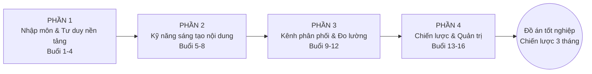

# ĐẠI CƯƠNG KHÓA HỌC: CONTENT MARKETING MASTERCLASS
## (16 Buổi học — Từ Nhập môn đến Chuyên gia)

> Tài liệu này được xây dựng dựa trên đề cương gợi ý tại [PROMPT AND SESSION/goi-y-dai-cuong-mon-hoc.md](../PROMPT%20AND%20SESSION/goi-y-dai-cuong-mon-hoc.md), kết hợp bổ sung chiều sâu lý thuyết, khung năng lực, timeline vận hành và hệ thống đánh giá dựa trên bộ khung 6 Module đã xây dựng tại thư mục [CONTENT-FRAME](../CONTENT-FRAME/). Đây là tài liệu **đại cương môn học (course syllabus)** chính thức, dùng làm căn cứ pháp lý/chuyên môn để triển khai giảng dạy.

---

## 1. THÔNG TIN CHUNG MÔN HỌC

| Thuộc tính | Nội dung |
|---|---|
| Tên môn học | Content Marketing Masterclass — Từ Nhập môn đến Chuyên gia |
| Tổng số buổi | 16 buổi |
| Thời lượng/buổi | 120 phút (2 giờ) |
| Tổng thời lượng | 32 giờ học trực tiếp + tối thiểu 24 giờ tự học/làm bài tập |
| Hình thức | Offline/Online kết hợp thực hành tại lớp (Workshop-based learning) |
| Tỷ lệ Lý thuyết : Thực hành | 40% : 60% |
| Đối tượng | Người mới bắt đầu, chưa có/có ít kinh nghiệm về Content Marketing |
| Điều kiện tiên quyết | Không yêu cầu kiến thức nền; cần có laptop và tài khoản Google/Gmail |
| Ngôn ngữ giảng dạy | Tiếng Việt |
| Hình thức đánh giá cuối khóa | Đồ án tốt nghiệp — Chiến lược nội dung 3 tháng cho thương hiệu thật |

---

## 2. MỤC TIÊU MÔN HỌC (COURSE OBJECTIVES)

Sau khi hoàn thành 16 buổi học, học viên có khả năng:

1. **Về tư duy (Mindset)**: Hiểu đúng bản chất Content Marketing hiện đại, phân biệt rõ với quảng cáo truyền thống, nắm được mô hình phễu nội dung TOFU-MOFU-BOFU và cách tư duy insight khách hàng có hệ thống.
2. **Về kỹ năng sáng tạo (Creation Skills)**: Thành thạo các công thức viết tiêu đề, copywriting (AIDA/PAS/BAB), kỹ thuật storytelling (Hero's Journey), và sản xuất nội dung đa định dạng (bài viết, kịch bản video ngắn, PR, hình ảnh).
3. **Về kỹ thuật phân phối (Distribution & Technical Skills)**: Biết viết bài chuẩn SEO, hiểu thuật toán mạng xã hội cơ bản, xây dựng chuỗi email marketing tự động, và đọc hiểu số liệu phân tích (GA4, Facebook Insight, TikTok Analytics).
4. **Về tư duy chiến lược & quản trị (Strategy & Management)**: Xây dựng được chiến lược nội dung tổng thể gắn với mục tiêu kinh doanh, vận hành lịch nội dung và quy trình làm việc nhóm, xây dựng thương hiệu cá nhân, và ứng dụng AI để tối ưu năng suất làm content.
5. **Sản phẩm đầu ra cụ thể**: Một bộ Chiến lược nội dung 3 tháng hoàn chỉnh (bao gồm nghiên cứu, Brand Voice, Content Calendar, sản phẩm mẫu, hệ thống KPI đo lường) cho một thương hiệu/dự án thực tế do chính học viên lựa chọn ngay từ đầu khóa học.

---

## 3. CẤU TRÚC 4 PHẦN — 16 BUỔI HỌC

| Phần | Buổi | Chủ đề trọng tâm | Cấp độ | Tài liệu chi tiết |
|---|---|---|---|---|
| **Phần 1** | 1-4 | Nhập môn & Tư duy nền tảng | Cơ bản | [01-PHAN-1-NHAP-MON-TU-DUY-NEN-TANG.md](01-PHAN-1-NHAP-MON-TU-DUY-NEN-TANG.md) |
| **Phần 2** | 5-8 | Kỹ năng sáng tạo nội dung thực chiến | Trung cấp | [02-PHAN-2-KY-NANG-SANG-TAO-NOI-DUNG.md](02-PHAN-2-KY-NANG-SANG-TAO-NOI-DUNG.md) |
| **Phần 3** | 9-12 | Kênh phân phối & Đo lường hiệu suất | Nâng cao | [03-PHAN-3-KENH-PHAN-PHOI-DO-LUONG.md](03-PHAN-3-KENH-PHAN-PHOI-DO-LUONG.md) |
| **Phần 4** | 13-16 | Chiến lược & Quản trị Content | Chuyên gia | [04-PHAN-4-CHIEN-LUOC-QUAN-TRI.md](04-PHAN-4-CHIEN-LUOC-QUAN-TRI.md) |
| **Phụ lục** | — | Bài tập, chấm điểm, timeline, checklist, prompt AI | — | [05-PHU-LUC-BAI-TAP-CHAM-DIEM-TIMELINE.md](05-PHU-LUC-BAI-TAP-CHAM-DIEM-TIMELINE.md) |

**Bảng chi tiết 16 buổi học:**

| Buổi | Tên bài học |
|---|---|
| 1 | Định nghĩa lại Content Marketing thế kỷ 21 |
| 2 | Giải mã Phễu nội dung (Content Funnel) |
| 3 | Nghiên cứu Insight & Phác họa chân dung khách hàng |
| 4 | Tư duy thiết kế cấu trúc bài viết Logic |
| 5 | Nghệ thuật viết Tiêu đề (Headline) và 10 công thức giật tít |
| 6 | Làm chủ các công thức sao chép (Copywriting Formulas) |
| 7 | Kỹ thuật kể chuyện thương hiệu (Storytelling) |
| 8 | Sản xuất nội dung đa nền tảng (Multimedia Content) |
| 9 | Content SEO – Viết bài chuẩn SEO lên top Google |
| 10 | Xây dựng Content Social Media (Facebook/LinkedIn) |
| 11 | Email Marketing & Chuỗi nội dung tự động |
| 12 | Đọc hiểu số liệu và Tối ưu hóa (Analytics) |
| 13 | Thiết lập Chiến lược nội dung tổng thể (Content Strategy) |
| 14 | Vận hành Lịch nội dung (Content Calendar) & Quản lý Team |
| 15 | Định hình Thương hiệu cá nhân qua nội dung (Personal Branding) |
| 16 | Tối ưu hiệu suất Content bằng AI + Bảo vệ đồ án tốt nghiệp |

---

## 4. KHUNG NĂNG LỰC ĐẦU RA (LEARNING OUTCOMES MAPPING)

| Nhóm năng lực | Buổi liên quan | Mức độ đánh giá |
|---|---|---|
| Tư duy nền tảng & Insight khách hàng | 1, 2, 3, 4 | Bài tập cá nhân sau Buổi 3-4 |
| Copywriting & Storytelling | 5, 6, 7, 8 | Bài tập cá nhân sau Buổi 7-8 |
| SEO & Đo lường dữ liệu | 9, 10, 11, 12 | Bài tập cá nhân sau Buổi 9-11 |
| Chiến lược & Quản trị | 13, 14, 15, 16 | Đồ án tốt nghiệp (Buổi 16) |

---

## 5. LIÊN KẾT VỚI BỘ KHUNG 6 MODULE (CONTENT-FRAME)

Đề cương 16 buổi này được thiết kế thực hành-hóa (workshop-based) từ bộ khung lý thuyết 6 Module đã xây dựng trước đó. Bảng đối chiếu dưới đây giúp giảng viên tra cứu nhanh phần lý thuyết chuyên sâu tương ứng khi cần bổ sung:

| Buổi 16-session | Module tương ứng trong CONTENT-FRAME |
|---|---|
| Buổi 1-2 (Định nghĩa CM, Phễu nội dung) | [01-MODULE-1-NEN-TANG-CO-BAN.md](../CONTENT-FRAME/01-MODULE-1-NEN-TANG-CO-BAN.md) |
| Buổi 3-4 (Insight, Persona, cấu trúc bài viết) | [02-MODULE-2-CHIEN-LUOC-NOI-DUNG.md](../CONTENT-FRAME/02-MODULE-2-CHIEN-LUOC-NOI-DUNG.md) |
| Buổi 5-8 (Copywriting, Storytelling, đa nền tảng) | [03-MODULE-3-SANG-TAO-NOI-DUNG-DA-KENH.md](../CONTENT-FRAME/03-MODULE-3-SANG-TAO-NOI-DUNG-DA-KENH.md) |
| Buổi 9-12 (SEO, Social, Email, Analytics) | [04-MODULE-4-SEO-PHAN-PHOI-NOI-DUNG.md](../CONTENT-FRAME/04-MODULE-4-SEO-PHAN-PHOI-NOI-DUNG.md), [05-MODULE-5-DO-LUONG-TOI-UU.md](../CONTENT-FRAME/05-MODULE-5-DO-LUONG-TOI-UU.md) |
| Buổi 13-15 (Chiến lược, Calendar, Personal Branding) | [02-MODULE-2-CHIEN-LUOC-NOI-DUNG.md](../CONTENT-FRAME/02-MODULE-2-CHIEN-LUOC-NOI-DUNG.md) |
| Buổi 16 (AI & Marketing 4.0) | [06-MODULE-6-NANG-CAO-AI-MARKETING-4.0.md](../CONTENT-FRAME/06-MODULE-6-NANG-CAO-AI-MARKETING-4.0.md) |

*Giảng viên có thể sử dụng CONTENT-FRAME như "ngân hàng kiến thức nền" (knowledge base) khi cần giảng sâu hơn phần lý thuyết của bất kỳ buổi học nào trong 16 buổi.*

---

## 6. HỆ THỐNG ĐÁNH GIÁ TỔNG QUAN

| Thành phần | Trọng số | Thời điểm |
|---|---|---|
| Điểm danh & tham gia thảo luận tại lớp | 10% | Xuyên suốt |
| Bài tập Phần 1 (sau Buổi 3-4) | 15% | Sau Buổi 4 |
| Bài tập Phần 2 (sau Buổi 7-8) | 15% | Sau Buổi 8 |
| Bài tập Phần 3 (sau Buổi 9-11) | 15% | Sau Buổi 11 |
| Đồ án tốt nghiệp (Buổi 16) | 35% | Buổi 16 |
| Thuyết trình & phản biện đồ án | 10% | Buổi 16 |
| **Tổng** | **100%** | |

*Chi tiết mẫu bài tập, tiêu chí chấm điểm, timeline chuẩn từng buổi và checklist học viên xem tại* [05-PHU-LUC-BAI-TAP-CHAM-DIEM-TIMELINE.md](05-PHU-LUC-BAI-TAP-CHAM-DIEM-TIMELINE.md).

---

## 7. NGUYÊN TẮC SƯ PHẠM XUYÊN SUỐT

1. **Học đến đâu, ra sản phẩm đến đó**: Mỗi buổi học đều gắn với 1 dự án thực chiến duy nhất mà học viên chọn ngay từ đầu khóa (xem Checklist học viên, Chặng 2) — tránh tình trạng "học lý thuyết suông".
2. **40/60 Lý thuyết/Thực hành**: Không buổi học nào giảng lý thuyết quá 45 phút liên tục; luôn có workshop thực hành và feedback trực tiếp ngay tại lớp.
3. **Case study thật, không lý thuyết suông**: Mỗi buổi tối thiểu 1 case study thực tế (thương hiệu Việt Nam hoặc quốc tế) minh họa khái niệm vừa học.
4. **Feedback vòng lặp nhanh (Fast Feedback Loop)**: Cuối mỗi buổi dành 15 phút sửa bài trực tiếp 2-3 học viên ngẫu nhiên trước lớp để cả lớp cùng học từ lỗi sai của nhau.
5. **Tích lũy đồ án dần dần (Cumulative Project-Based Learning)**: Đồ án tốt nghiệp Buổi 16 không phải làm từ đầu — mà là tổng hợp toàn bộ sản phẩm nhỏ học viên đã làm xuyên suốt 15 buổi trước.

---

*(Tiếp tục với file [01-PHAN-1-NHAP-MON-TU-DUY-NEN-TANG.md](01-PHAN-1-NHAP-MON-TU-DUY-NEN-TANG.md))*
