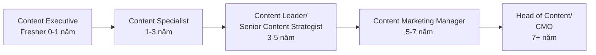
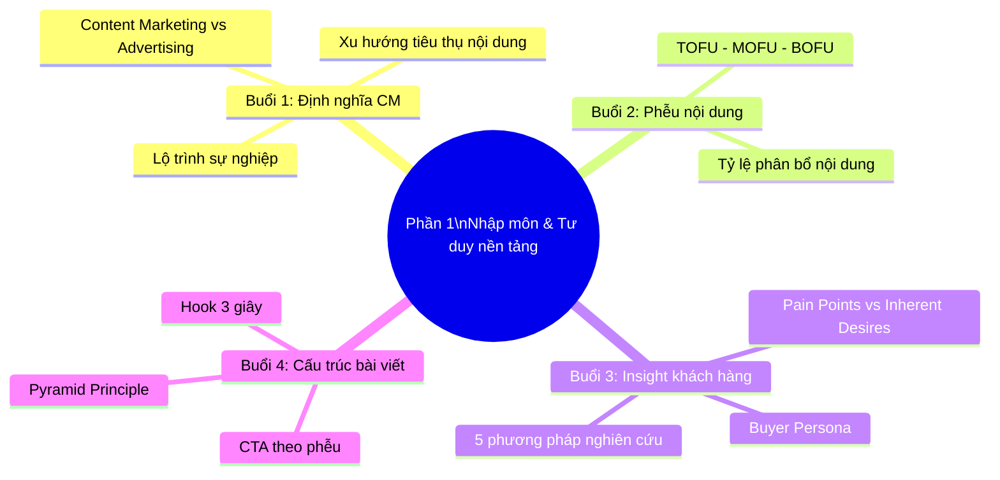

# PHẦN 1: NHẬP MÔN & TƯ DUY NỀN TẢNG (CƠ BẢN)
## (Buổi 1 - 4 | Cấp độ: Cơ bản)

---

## MỤC TIÊU PHẦN 1

Sau khi hoàn thành Phần 1, học viên có thể:
- Định nghĩa chính xác Content Marketing và phân biệt với quảng cáo truyền thống.
- Hiểu và áp dụng mô hình phễu nội dung TOFU-MOFU-BOFU để phân loại nội dung theo giai đoạn nhận thức khách hàng.
- Thực hiện nghiên cứu insight khách hàng bằng 5 phương pháp cụ thể và xây dựng được 1 Buyer Persona hoàn chỉnh.
- Tư duy và trình bày một bài viết theo cấu trúc logic (Pyramid Principle) với mở bài giữ chân người đọc và CTA hiệu quả.

---

## BUỔI 1: ĐỊNH NGHĨA LẠI CONTENT MARKETING THẾ KỶ 21

### 1.1. Mục tiêu buổi học
- Hiểu bản chất Content Marketing và phân biệt rõ với quảng cáo truyền thống (Advertising).
- Nhận diện xu hướng tiêu thụ nội dung hiện đại của người dùng Việt Nam.
- Định hướng lộ trình phát triển sự nghiệp ngành Content.

### 1.2. Nội dung lý thuyết chi tiết

**a) Bản chất của Content Marketing**

Content Marketing là quá trình lập kế hoạch, sáng tạo và phân phối nội dung có giá trị, liên quan và nhất quán nhằm thu hút và giữ chân một nhóm đối tượng xác định — từ đó thúc đẩy hành động sinh lời cho doanh nghiệp (định nghĩa cải biên từ Content Marketing Institute - CMI).

**Điểm khác biệt cốt lõi so với Quảng cáo (Advertising):**

| Tiêu chí | Content Marketing | Quảng cáo truyền thống |
|---|---|---|
| Mối quan hệ với người xem | Người xem chủ động tìm đến, tự nguyện theo dõi | Bị gián đoạn, ép xem (interruption-based) |
| Giá trị mang lại | Giáo dục, giải trí, giải quyết vấn đề trước | Thúc đẩy mua ngay, tập trung vào sản phẩm |
| Thời gian phát huy hiệu quả | Dài hạn, tích lũy niềm tin | Ngắn hạn, hiệu quả tức thời rồi giảm dần |
| Chi phí duy trì | Thấp hơn về dài hạn (tài sản tồn tại lâu) | Cao, dừng chi tiền là dừng hiệu quả |
| Ví dụ | Bài blog hướng dẫn, video giáo dục, podcast | Banner ads, TVC ngắt quãng, quảng cáo popup |

**b) Xu hướng tiêu thụ nội dung hiện đại (2024-2026)**

1. **Video ngắn thống trị** (TikTok, Reels, Shorts) — thời lượng chú ý trung bình của người dùng giảm còn 8 giây, nội dung phải "hook" trong 3 giây đầu.
2. **Nội dung chân thực (Authentic Content)** lên ngôi — người dùng ngày càng nghi ngờ nội dung "làm màu", ưu tiên UGC (User Generated Content) và nội dung behind-the-scenes.
3. **Tìm kiếm chuyển dịch sang nền tảng mạng xã hội**: Gen Z tìm kiếm thông tin trên TikTok/Instagram nhiều hơn Google truyền thống cho các chủ đề tiêu dùng, ăn uống, du lịch.
4. **AI hỗ trợ sáng tạo nội dung** trở thành kỹ năng bắt buộc — không thay thế người làm content nhưng thay đổi quy trình làm việc.
5. **Nội dung tương tác (Interactive Content)**: poll, quiz, livestream tăng trưởng mạnh vì tạo cảm giác tham gia thay vì chỉ tiêu thụ thụ động.

**c) Lộ trình phát triển sự nghiệp ngành Content**



| Cấp bậc | Công việc chính | Kỹ năng cần có |
|---|---|---|
| Content Executive | Viết bài, lên caption, hỗ trợ sản xuất | Viết cơ bản, hiểu brand voice |
| Content Specialist | Chuyên sâu 1 mảng (SEO/Social/Email) | Kỹ thuật chuyên sâu, phân tích số liệu cơ bản |
| Content Leader | Điều phối team, xây chiến lược | Quản lý, tư duy chiến lược, đọc số liệu |
| Content Marketing Manager | Chịu trách nhiệm KPI toàn bộ kênh content | Ngân sách, chiến lược đa kênh, lãnh đạo |
| Head of Content/CMO | Định hướng thương hiệu tổng thể | Tầm nhìn kinh doanh, xây dựng văn hóa đội ngũ |

### 1.3. Case study minh họa

**Duolingo trên TikTok**: Thay vì quảng cáo tính năng ứng dụng, Duolingo xây dựng nhân vật linh vật (con cú Duo) với nội dung hài hước, trend-jacking liên tục — biến một app học ngôn ngữ khô khan thành thương hiệu giải trí được yêu thích trên mạng xã hội, đạt hàng chục triệu follower mà gần như không cần quảng cáo trả phí trực tiếp cho nội dung này.

**Bài học**: Content Marketing thành công không phải vì "nói về sản phẩm hay" mà vì "tạo giá trị giải trí/thông tin khiến người dùng tự nguyện theo dõi".

### 1.4. Hoạt động tại lớp (Workshop 35 phút)
- Học viên chia nhóm 3-4 người, mỗi nhóm được giao 1 cặp ví dụ (1 quảng cáo, 1 content marketing) và phải chỉ ra 3 điểm khác biệt cụ thể.
- Đại diện nhóm trình bày 2 phút/nhóm, giảng viên nhận xét trực tiếp.

### 1.5. Từ khóa cần ghi nhớ
`Content Marketing` • `Advertising` • `Authentic Content` • `UGC` • `Interruption-based Marketing` • `Content Career Path`

---

## BUỔI 2: GIẢI MÃ PHỄU NỘI DUNG (CONTENT FUNNEL)

### 2.1. Mục tiêu buổi học
- Hiểu rõ cấu trúc phễu nội dung TOFU-MOFU-BOFU.
- Biết thiết kế loại nội dung phù hợp cho từng giai đoạn của phễu.

### 2.2. Nội dung lý thuyết chi tiết

**a) Cấu trúc phễu nội dung**

| Giai đoạn | Tên gọi đầy đủ | Tâm lý khách hàng | Mục tiêu nội dung | Định dạng phù hợp |
|---|---|---|---|---|
| **TOFU** (Top of Funnel) | Nhận biết (Awareness) | "Tôi có vấn đề gì đó..." | Thu hút sự chú ý, giáo dục | Video viral, bài blog giải trí/kiến thức chung, infographic |
| **MOFU** (Middle of Funnel) | Cân nhắc (Consideration) | "Có giải pháp nào cho vấn đề này?" | Xây dựng niềm tin, so sánh giải pháp | Bài so sánh, case study, webinar, ebook |
| **BOFU** (Bottom of Funnel) | Chuyển đổi (Conversion) | "Tôi nên chọn ai?" | Thúc đẩy hành động mua | Demo sản phẩm, testimonial, ưu đãi, tư vấn 1-1 |

**b) Nguyên tắc thiết kế nội dung theo phễu**

1. Không đưa nội dung BOFU (bán hàng trực tiếp) vào giai đoạn TOFU — sẽ gây phản cảm và mất người xem ngay từ đầu.
2. Tỷ lệ nội dung đề xuất: TOFU chiếm 50-60% khối lượng nội dung, MOFU chiếm 25-30%, BOFU chiếm 10-20% (vì đối tượng ở đáy phễu luôn nhỏ hơn đỉnh phễu).
3. Mỗi nội dung nên có 1 CTA duy nhất, phù hợp đúng giai đoạn (TOFU: theo dõi trang; MOFU: tải tài liệu/đăng ký nhận tư vấn; BOFU: mua ngay/đặt lịch demo).
4. Phễu không phải đường thẳng — khách hàng có thể quay lại giai đoạn trước đó (ví dụ đọc lại nội dung MOFU trước khi quyết định mua ở BOFU).

**c) Ví dụ áp dụng thực tế — ngành mỹ phẩm**

| Giai đoạn | Ví dụ nội dung cụ thể |
|---|---|
| TOFU | Video TikTok "5 dấu hiệu da bạn đang bị lão hóa sớm" |
| MOFU | Bài blog "So sánh Retinol và Vitamin C: Nên dùng loại nào trước?" |
| BOFU | Video review thật từ KOC + mã giảm giá giới hạn 48 giờ |

### 2.3. Case study minh họa

**The Coffee House — chuỗi storytelling theo phễu**: TOFU là các video ngắn kể chuyện đời thường tại quán cà phê (không nhắc sản phẩm), MOFU là bài viết về quy trình chọn hạt cà phê chất lượng, BOFU là chương trình thành viên tích điểm với ưu đãi cụ thể. Cấu trúc này giúp thương hiệu vừa giữ hình ảnh gần gũi vừa có điểm chuyển đổi rõ ràng.

### 2.4. Hoạt động tại lớp (Workshop 35 phút)

Học viên nhận 1 sản phẩm giả định, viết 3 ý tưởng tiêu đề nội dung tương ứng với 3 giai đoạn TOFU/MOFU/BOFU cho sản phẩm đó, sau đó chéo nhóm phản biện xem tiêu đề có đúng "tâm lý giai đoạn" hay bị lẫn lộn.

### 2.5. Từ khóa cần ghi nhớ
`TOFU` • `MOFU` • `BOFU` • `Content Funnel` • `CTA theo giai đoạn` • `Tỷ lệ phân bổ nội dung`

---

## BUỔI 3: NGHIÊN CỨU INSIGHT & PHÁC HỌA CHÂN DUNG KHÁCH HÀNG

### 3.1. Mục tiêu buổi học
- Nắm được 5 phương pháp nghiên cứu hành vi khách hàng mục tiêu trên môi trường số.
- Định vị được nỗi đau (Pain Points) và mong muốn thầm kín (Inherent Desires) của khách hàng.
- Thực hành điền hoàn chỉnh bảng Chân dung khách hàng (Buyer Persona).

### 3.2. Nội dung lý thuyết chi tiết

**a) 5 phương pháp nghiên cứu insight khách hàng trên môi trường số**

| # | Phương pháp | Cách thực hiện | Công cụ hỗ trợ |
|---|---|---|---|
| 1 | Phân tích bình luận/review thực tế | Đọc 20-30 bình luận trên fanpage, Shopee, Google Maps của thương hiệu/đối thủ, ghi nhận từ khóa lặp lại | Excel/Google Sheet để tổng hợp |
| 2 | Nghiên cứu từ khóa tìm kiếm | Xem người dùng đang tìm câu hỏi gì liên quan đến ngành hàng | Google Trends, AnswerThePublic |
| 3 | Khảo sát trực tiếp | Gửi form khảo sát ngắn 5-7 câu cho khách hàng hiện tại | Google Form, Typeform |
| 4 | Phỏng vấn sâu (In-depth Interview) | Phỏng vấn trực tiếp 3-5 khách hàng thân thiết, hỏi mở về trải nghiệm | Ghi âm + note tay |
| 5 | Phân tích đối thủ cạnh tranh | Xem đối thủ đang nói gì, khách hàng của họ phản hồi ra sao | Theo dõi fanpage/website đối thủ trực tiếp |

**b) Phân biệt Pain Points và Inherent Desires**

- **Pain Points (Nỗi đau)**: Vấn đề cụ thể, hữu hình khách hàng đang gặp phải (ví dụ: "da bị mụn", "không có thời gian nấu ăn").
- **Inherent Desires (Mong muốn thầm kín)**: Động lực tâm lý sâu xa đằng sau hành vi mua (ví dụ: mua mỹ phẩm không chỉ để hết mụn mà để "tự tin hơn khi giao tiếp"; mua đồ ăn sẵn không chỉ vì tiện mà để "có thêm thời gian cho gia đình").

**Nguyên tắc**: Content hiệu quả nhất khi giải quyết đồng thời cả Pain Point (lý trí) lẫn Inherent Desire (cảm xúc) trong cùng một thông điệp.

**c) Mẫu bảng Chân dung khách hàng (Buyer Persona) thực hành tại lớp**

```
1. Tên gọi Persona: ___________________________
2. Nhân khẩu học (tuổi, giới tính, nghề nghiệp, thu nhập): ___________________________
3. Mục tiêu/Mong muốn thầm kín: ___________________________
4. Nỗi đau cụ thể (tối thiểu 3): ___________________________
5. Hành vi tiêu dùng/tìm kiếm thông tin: ___________________________
6. Kênh thông tin ưa thích: ___________________________
7. Rào cản khi mua hàng: ___________________________
8. Câu nói điển hình: ___________________________
```

### 3.3. Case study minh họa

**Katinat**: Phân tích bình luận khách hàng trên mạng xã hội cho thấy insight không chỉ là "muốn đồ uống ngon" mà là "muốn có không gian đẹp để chụp ảnh check-in" — Inherent Desire về thể hiện bản thân trên mạng xã hội. Đây là cơ sở để Katinat xây dựng USP dựa trên trải nghiệm không gian thay vì chỉ chất lượng đồ uống.

### 3.4. Hoạt động tại lớp (Workshop 35 phút)

Học viên thực hành thu thập tối thiểu 10 bình luận thật của thương hiệu/đối thủ đã chọn, phân loại theo Pain Point và Inherent Desire, sau đó điền vào bảng Persona mẫu ở trên.

### 3.5. Công cụ thực hành
- Nghiên cứu Insight: Google Trends, AnswerThePublic, HubSpot Make My Persona.
- Lên ý tưởng: XMind, MindMeister (vẽ sơ đồ tư duy hệ thống ý).

### 3.6. Tài liệu bổ trợ
- Sách: *Inbound Marketing* (Brian Halligan & Dharmesh Shah).
- Chuỗi bài "Content Marketing Strategy" trên blog HubSpot Academy.

### 3.7. Từ khóa cần ghi nhớ
`Pain Points` • `Inherent Desires` • `Buyer Persona` • `In-depth Interview` • `Insight Research`

---

## BUỔI 4: TƯ DUY THIẾT KẾ CẤU TRÚC BÀI VIẾT LOGIC

### 4.1. Mục tiêu buổi học
- Áp dụng kỹ thuật tư duy hình tháp (Pyramid Principle) để sắp xếp ý tưởng bài viết.
- Viết được mở bài giữ chân người đọc trong 3 giây đầu.
- Viết kết bài chuẩn CTA kích thích tương tác.

### 4.2. Nội dung lý thuyết chi tiết

**a) Kỹ thuật tư duy hình tháp (Pyramid Principle — Barbara Minto)**

Nguyên tắc: Đưa ra **kết luận/ý chính trước**, sau đó mới triển khai các luận điểm/luận cứ bổ trợ theo thứ tự quan trọng giảm dần — giúp người đọc nắm được thông điệp cốt lõi ngay cả khi chỉ đọc lướt.

```
        [Ý CHÍNH / KẾT LUẬN]
         /       |        \
   [Luận điểm 1] [Luận điểm 2] [Luận điểm 3]
      /    \         |            /    \
  [Dẫn chứng] [Dẫn chứng]  [Dẫn chứng] [Dẫn chứng]
```

**So sánh với lối viết truyền thống (Bottom-up)**: Văn phong học thuật truyền thống thường dẫn dắt từ chi tiết nhỏ đến kết luận cuối — không phù hợp với thói quen đọc lướt trên môi trường số, nơi người đọc quyết định "đọc tiếp hay không" trong vài giây đầu.

**b) Kỹ thuật viết mở bài giữ chân người đọc trong 3 giây đầu (Hook)**

| Kỹ thuật Hook | Mô tả | Ví dụ |
|---|---|---|
| Đặt câu hỏi gây tò mò | Khơi gợi vấn đề người đọc đang quan tâm | "Bạn có đang mắc phải sai lầm này khi chăm da mỗi tối?" |
| Con số/thống kê gây sốc | Dùng dữ liệu bất ngờ | "90% người dùng bỏ qua bước này khi skincare" |
| Kể chuyện ngắn (Micro-story) | Mở đầu bằng 1-2 câu chuyện cá nhân/khách hàng | "3 tháng trước, tôi suýt bỏ cuộc vì làn da liên tục nổi mụn..." |
| Phản bác quan niệm sai | Thách thức niềm tin phổ biến | "Không phải cứ đắt tiền là serum sẽ hiệu quả" |

**c) Cấu trúc kết bài chuẩn CTA (Call-to-Action)**

Nguyên tắc CTA hiệu quả: **Rõ ràng — Cụ thể — Phù hợp giai đoạn phễu — Tạo cảm giác cấp bách (nếu cần)**.

| Giai đoạn phễu | Ví dụ CTA phù hợp |
|---|---|
| TOFU | "Theo dõi trang để nhận thêm mẹo mỗi tuần" |
| MOFU | "Tải ngay bộ tài liệu miễn phí để so sánh chi tiết" |
| BOFU | "Đặt lịch tư vấn miễn phí ngay hôm nay — chỉ còn 5 suất trong tuần này" |

### 4.3. Case study minh họa

Phân tích 1 bài blog SEO thực tế của một thương hiệu tài chính Việt Nam: mở bài dùng câu hỏi gây tò mò, thân bài triển khai theo hình tháp (kết luận trước, luận cứ sau), kết bài có CTA rõ ràng dẫn về trang tư vấn — minh họa toàn bộ quy trình áp dụng lý thuyết vào thực tế.

### 4.4. Hoạt động tại lớp (Workshop 35 phút)

Học viên viết mở bài (Hook) 2-3 câu cho chủ đề đồ án cá nhân theo 2 kỹ thuật khác nhau (ví dụ: đặt câu hỏi + con số gây sốc), sau đó nhóm bình chọn hook nào hấp dẫn hơn và giải thích lý do.

### 4.5. Từ khóa cần ghi nhớ
`Pyramid Principle` • `Hook 3 giây` • `CTA theo phễu` • `Micro-story` • `Bottom-up vs Top-down writing`

---

## TỔNG KẾT PHẦN 1

### Sơ đồ tư duy tổng kết



### Bài tập tổng hợp Phần 1

Xem chi tiết đề bài và tiêu chí chấm điểm tại [05-PHU-LUC-BAI-TAP-CHAM-DIEM-TIMELINE.md](05-PHU-LUC-BAI-TAP-CHAM-DIEM-TIMELINE.md), mục "Phần 1: Nhập môn & Tư duy nền tảng".

**Tóm tắt đề bài**: Chọn 1 sản phẩm bất kỳ, xây dựng Buyer Persona (tối thiểu 3 Pain Points + 3 Desires) và lập cấu trúc 1 bài viết dài theo Pyramid Principle giải quyết 1 nỗi đau đã tìm thấy.

---

*(Hết Phần 1. Tiếp tục với file [02-PHAN-2-KY-NANG-SANG-TAO-NOI-DUNG.md](02-PHAN-2-KY-NANG-SANG-TAO-NOI-DUNG.md))*
