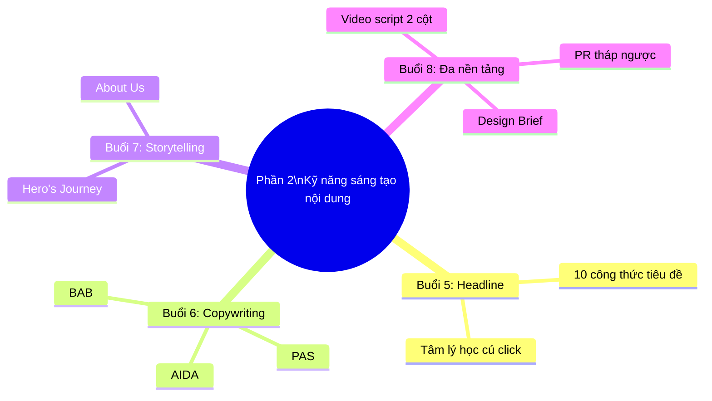

# PHẦN 2: KỸ NĂNG SÁNG TẠO NỘI DUNG THỰC CHIẾN (TRUNG CẤP)
## (Buổi 5 - 8 | Cấp độ: Trung cấp)

---

## MỤC TIÊU PHẦN 2

Sau khi hoàn thành Phần 2, học viên có thể:
- Viết tiêu đề hấp dẫn bằng 10 công thức giật tít kinh điển.
- Thành thạo 3 công thức copywriting cốt lõi: AIDA, PAS, BAB.
- Kể chuyện thương hiệu theo cấu trúc Hero's Journey.
- Sản xuất nội dung đa định dạng: PR báo chí, kịch bản video ngắn, brief thiết kế hình ảnh.

---

## BUỔI 5: NGHỆ THUẬT VIẾT TIÊU ĐỀ (HEADLINE) VÀ 10 CÔNG THỨC GIẬT TÍT

### 5.1. Mục tiêu buổi học
- Hiểu tâm lý học đằng sau quyết định click chuột của người dùng.
- Nắm vững 10 công thức tiêu đề kinh điển.
- Thực hành sửa lỗi các tiêu đề nhàm chán.

### 5.2. Nội dung lý thuyết chi tiết

**a) Tâm lý học đằng sau cú click**

Con người bị thôi thúc click vào tiêu đề khi tiêu đề đó kích hoạt một trong các yếu tố tâm lý sau: **Tò mò (Curiosity Gap)** — cảm giác "thiếu thông tin" cần được lấp đầy; **Lợi ích cá nhân (Self-interest)** — "tôi sẽ được gì"; **Sợ bỏ lỡ (FOMO)** — sợ mất cơ hội/thông tin quan trọng; **Cảm xúc mạnh (Emotional Trigger)** — ngạc nhiên, phẫn nộ, hài hước.

**b) 10 công thức tiêu đề kinh điển**

| # | Công thức | Ví dụ |
|---|---|---|
| 1 | Số + Tính từ + Danh từ + Lời hứa | "7 Bí quyết đơn giản giúp da sáng mịn sau 2 tuần" |
| 2 | Câu hỏi trực tiếp đánh trúng nỗi đau | "Vì sao da bạn vẫn nổi mụn dù đã dùng đủ loại kem?" |
| 3 | Cách làm (How-to) | "Cách viết content chuẩn SEO chỉ trong 15 phút" |
| 4 | So sánh/Đối đầu | "Serum Vitamin C hay Retinol: Ai mới là 'vua' trị nám?" |
| 5 | Cảnh báo/Rủi ro | "3 sai lầm khiến bạn tốn tiền oan khi mua mỹ phẩm" |
| 6 | Bí mật/Sự thật ít ai biết | "Sự thật ít người biết về ngành mỹ phẩm organic" |
| 7 | Câu chuyện cá nhân gây tò mò | "Tôi đã bỏ 3 năm học tiếng Anh sai cách như thế nào" |
| 8 | Danh sách + Deadline/Cấp bách | "5 xu hướng content 2026 bạn cần biết ngay trước khi lỗi thời" |
| 9 | Trước - Sau (Before - After) | "Từ 0 follow đến 100K chỉ sau 6 tháng làm content" |
| 10 | Thách thức niềm tin phổ biến | "Đắt chưa chắc đã tốt: Sự thật về giá mỹ phẩm cao cấp" |

**c) Nguyên tắc tối ưu độ dài tiêu đề**

- Tiêu đề bài blog/SEO: 50-60 ký tự (tránh bị cắt trên kết quả tìm kiếm Google).
- Tiêu đề mạng xã hội: Ngắn gọn, tối đa 1-2 dòng hiển thị trước khi bị thu gọn ("Xem thêm").
- Tránh "Clickbait" quá đà — tiêu đề hứa hẹn nhưng nội dung không đáp ứng sẽ làm giảm uy tín thương hiệu về dài hạn.

### 5.3. Case study minh họa

So sánh 2 tiêu đề cho cùng 1 bài viết về serum dưỡng da: Tiêu đề A "Serum dưỡng da mới ra mắt" (nhàm chán, không có yếu tố tâm lý) vs Tiêu đề B "Vì sao da bạn vẫn xỉn màu dù đã dùng đủ loại serum đắt tiền?" (đánh trúng Pain Point + câu hỏi trực tiếp) — Tiêu đề B có tỷ lệ click cao hơn đáng kể trong thực tế benchmark ngành.

### 5.4. Hoạt động tại lớp (Workshop 35 phút)

Giảng viên đưa ra 5 tiêu đề nhàm chán, học viên áp dụng tối thiểu 2 công thức khác nhau để viết lại mỗi tiêu đề, sau đó nhóm bình chọn phiên bản tốt nhất.

### 5.5. Từ khóa cần ghi nhớ
`Curiosity Gap` • `FOMO` • `Clickbait` • `Headline Formula` • `Emotional Trigger`

---

## BUỔI 6: LÀM CHỦ CÁC CÔNG THỨC SAO CHÉP (COPYWRITING FORMULAS)

### 6.1. Mục tiêu buổi học
- Ứng dụng thành thạo công thức AIDA, PAS, BAB vào các ngành hàng khác nhau.

### 6.2. Nội dung lý thuyết chi tiết

**a) AIDA (Attention - Interest - Desire - Action)**

| Bước | Mục đích | Kỹ thuật |
|---|---|---|
| Attention | Thu hút sự chú ý | Hook mở đầu gây tò mò/sốc |
| Interest | Duy trì sự quan tâm | Đưa thông tin/lợi ích liên quan trực tiếp đến người đọc |
| Desire | Khơi gợi mong muốn sở hữu | Nhấn mạnh lợi ích cảm xúc, minh chứng xã hội (social proof) |
| Action | Thúc đẩy hành động | CTA rõ ràng, cụ thể |

**Ví dụ ứng dụng (ngành khóa học online):**
> (A) "Bạn có biết 80% người học tiếng Anh bỏ cuộc chỉ sau 2 tuần?" (I) "Không phải vì bạn lười, mà vì phương pháp học sai ngay từ đầu." (D) "Với lộ trình 15 phút/ngày, hàng nghìn học viên đã tự tin giao tiếp chỉ sau 3 tháng." (A) "Đăng ký học thử miễn phí ngay hôm nay."

**b) PAS (Problem - Agitate - Solve)** — phù hợp ngành dịch vụ

| Bước | Mục đích |
|---|---|
| Problem | Nêu rõ vấn đề khách hàng đang gặp |
| Agitate | Khoét sâu hậu quả nếu không giải quyết vấn đề |
| Solve | Đưa ra giải pháp (sản phẩm/dịch vụ) |

**Ví dụ (ngành dịch vụ tư vấn tài chính):**
> (P) "Bạn để tiền trong tài khoản tiết kiệm nhưng lạm phát vẫn đang âm thầm 'ăn mòn' giá trị tiền của bạn mỗi ngày." (A) "Nếu không hành động, sau 10 năm số tiền đó có thể chỉ còn giá trị bằng một nửa hiện tại." (S) "Dịch vụ tư vấn đầu tư của chúng tôi giúp bạn xây dựng danh mục tăng trưởng bền vững, phù hợp khẩu vị rủi ro cá nhân."

**c) BAB (Before - After - Bridge)** — phù hợp ngành làm đẹp/sức khỏe

| Bước | Mục đích |
|---|---|
| Before | Mô tả tình trạng hiện tại (chưa có giải pháp) |
| After | Vẽ ra viễn cảnh sau khi có giải pháp |
| Bridge | Giải pháp/sản phẩm là "cầu nối" giữa 2 trạng thái |

**Ví dụ (ngành mỹ phẩm):** *(Before)* "Da bạn xỉn màu, không đều màu mỗi khi makeup." *(After)* "Hãy tưởng tượng làn da rạng rỡ tự nhiên, không cần lớp nền dày." *(Bridge)* "Serum Vitamin C này chính là bước cầu nối giúp bạn đạt được điều đó chỉ sau 4 tuần."

**d) Bảng lựa chọn công thức theo tình huống**

| Tình huống kinh doanh | Công thức phù hợp nhất |
|---|---|
| Sản phẩm mới, cần tạo nhận biết nhanh | AIDA |
| Dịch vụ giải quyết vấn đề cấp bách (tài chính, sức khỏe, pháp lý) | PAS |
| Sản phẩm cải thiện ngoại hình/trải nghiệm cá nhân | BAB |

### 6.3. Case study minh họa

Phân tích 1 quảng cáo Facebook thực tế ngành mỹ phẩm áp dụng BAB, chỉ rõ từng phần Before-After-Bridge trong bài viết gốc và giải thích vì sao cấu trúc này tạo được tỷ lệ chuyển đổi cao.

### 6.4. Hoạt động tại lớp (Workshop 35 phút)

Học viên chọn 1 trong 3 công thức phù hợp với sản phẩm đồ án cá nhân, viết 1 đoạn copywriting hoàn chỉnh (150-200 từ), sau đó đổi bài cho bạn cùng lớp để phản biện xem đã đúng cấu trúc công thức chưa.

### 6.5. Từ khóa cần ghi nhớ
`AIDA` • `PAS` • `BAB` • `Social Proof` • `Copywriting Formula Selection`

---

## BUỔI 7: KỸ THUẬT KỂ CHUYỆN THƯƠNG HIỆU (STORYTELLING)

### 7.1. Mục tiêu buổi học
- Áp dụng cấu trúc "Hành trình anh hùng" (Hero's Journey) vào viết lách thương hiệu.
- Lồng ghép thông điệp sản phẩm vào câu chuyện một cách tự nhiên.
- Viết câu chuyện "Về chúng tôi" (About Us) cho thương hiệu giả định.

### 7.2. Nội dung lý thuyết chi tiết

**a) Cấu trúc Hero's Journey (Joseph Campbell) áp dụng cho Content Marketing**

| Giai đoạn gốc | Áp dụng vào Storytelling thương hiệu |
|---|---|
| Thế giới thường nhật | Mô tả tình trạng ban đầu của khách hàng/nhà sáng lập trước khi có giải pháp |
| Lời triệu gọi phiêu lưu | Sự kiện/vấn đề khiến nhân vật (khách hàng/founder) nhận ra cần thay đổi |
| Từ chối lời gọi | Những nghi ngờ, rào cản ban đầu (thể hiện tính chân thực) |
| Gặp người dẫn đường | Xuất hiện giải pháp/sản phẩm/người hướng dẫn |
| Vượt qua thử thách | Quá trình áp dụng giải pháp, có khó khăn xen lẫn |
| Phần thưởng | Kết quả đạt được sau khi vượt qua thử thách |
| Trở về & Chia sẻ | Nhân vật lan tỏa bài học/kết quả cho cộng đồng |

**Lưu ý quan trọng**: Trong Storytelling thương hiệu, **khách hàng luôn là nhân vật anh hùng chính** — thương hiệu chỉ đóng vai "người dẫn đường" (mentor), không phải nhân vật chính. Đây là nguyên tắc StoryBrand (Donald Miller) bổ trợ cho Hero's Journey.

**b) Kỹ thuật lồng ghép thông điệp sản phẩm tự nhiên**

- Không mở đầu câu chuyện bằng việc giới thiệu sản phẩm — bắt đầu bằng vấn đề/cảm xúc của nhân vật.
- Sản phẩm chỉ nên xuất hiện ở giai đoạn "Gặp người dẫn đường" — đúng lúc nhân vật cần giải pháp, không sớm hơn.
- Kết thúc câu chuyện bằng kết quả cụ thể (định lượng nếu có thể) thay vì lời khen chung chung.

**c) Cấu trúc bài "Về chúng tôi" (About Us) chuẩn**

```
1. Mở đầu: Vấn đề/động lực khiến founder bắt đầu (1 đoạn ngắn, giàu cảm xúc)
2. Hành trình: Khó khăn ban đầu, những gì đã thử và thất bại
3. Bước ngoặt: Khoảnh khắc tìm ra giải pháp/công thức đúng
4. Hiện tại: Thương hiệu đang mang lại giá trị gì cho khách hàng
5. Lời cam kết: Thương hiệu hứa hẹn điều gì cho khách hàng trong tương lai
```

### 7.3. Case study minh họa

**Biti's Hunter — "Đi Để Trở Về"**: Chiến dịch không nói về sản phẩm giày mà kể câu chuyện về hành trình tuổi trẻ, những chuyến đi xa và cảm giác nhớ nhà — khách hàng (người trẻ Việt Nam) là nhân vật chính, sản phẩm chỉ xuất hiện như "người bạn đồng hành" trong hành trình đó. Chiến dịch tạo hiệu ứng lan tỏa cực lớn dù thông điệp không hề "bán hàng" trực tiếp.

### 7.4. Hoạt động tại lớp (Workshop 35 phút)

Học viên viết bài "Về chúng tôi" (300-400 từ) cho thương hiệu đồ án cá nhân theo cấu trúc 5 phần ở trên, đảm bảo khách hàng/founder là nhân vật chính, sản phẩm chỉ là "người dẫn đường".

### 7.5. Từ khóa cần ghi nhớ
`Hero's Journey` • `StoryBrand` • `About Us` • `Nhân vật chính vs Người dẫn đường`

---

## BUỔI 8: SẢN XUẤT NỘI DUNG ĐA NỀN TẢNG (MULTIMEDIA CONTENT)

### 8.1. Mục tiêu buổi học
- Viết bài PR báo chí chuẩn cấu trúc tháp ngược (Inverted Pyramid).
- Tư duy viết kịch bản video ngắn (TikTok/Reels) 30-60 giây.
- Lập Brief thiết kế hình ảnh bổ trợ cho bài viết.

### 8.2. Nội dung lý thuyết chi tiết

**a) Cấu trúc tháp ngược (Inverted Pyramid) cho bài PR báo chí**

```
[Thông tin quan trọng nhất — Ai, Cái gì, Khi nào, Ở đâu]
              ↓
[Chi tiết bổ sung quan trọng thứ 2]
              ↓
[Thông tin nền/bối cảnh]
              ↓
[Chi tiết ít quan trọng nhất — có thể cắt bỏ nếu thiếu chỗ đăng]
```

Nguyên tắc: Đoạn mở đầu (lead) phải trả lời đủ 5W1H (Who, What, When, Where, Why, How) trong 1-2 câu đầu tiên — vì biên tập viên báo chí có thể cắt bớt phần cuối bài mà không ảnh hưởng đến thông tin cốt lõi.

**b) Tư duy viết kịch bản video ngắn 30-60 giây**

| Phần | Thời lượng | Nội dung |
|---|---|---|
| Hook | 0-3 giây | Câu mở đầu/hình ảnh gây chú ý ngay lập tức |
| Nội dung chính | 4-45 giây | Giải quyết 1 ý chính duy nhất, không lan man |
| CTA | 45-60 giây | Kêu gọi hành động cụ thể (theo dõi, để lại bình luận, mua ngay) |

**Mẫu bảng phân cảnh kịch bản 2 cột:**

| Cột Hình ảnh (B-roll/Diễn xuất) | Cột Lời thoại (Voice-over/Audio) |
|---|---|
| Cận cảnh sản phẩm, ánh sáng tự nhiên | "Bạn có biết vì sao da vẫn xỉn màu dù skincare đều đặn?" |
| Chuyển cảnh nhanh, chữ động (text animation) | "Đây là 3 sai lầm phổ biến nhất..." |
| Cảnh sử dụng sản phẩm thực tế | "Và đây là cách khắc phục chỉ trong 1 bước" |
| Logo + CTA hiện trên màn hình | "Theo dõi ngay để xem thêm mẹo mỗi tuần" |

**c) Brief thiết kế hình ảnh bổ trợ (mẫu chuẩn)**

```
1. Mục đích hình ảnh (minh họa bài viết/quảng cáo/social post):
2. Kích thước/tỷ lệ (1:1, 4:5, 9:16...):
3. Thông điệp chính cần truyền tải qua hình ảnh:
4. Tông màu/phong cách (theo Brand Guideline):
5. Yếu tố bắt buộc có (logo, text, sản phẩm...):
6. Nguồn ảnh/tài liệu tham khảo đính kèm:
7. Deadline:
```

### 8.3. Case study minh họa

Phân tích 1 bài PR thực tế về ra mắt sản phẩm được đăng trên báo điện tử Việt Nam — chỉ rõ đoạn lead trả lời đủ 5W1H, so sánh với 1 bài PR viết sai cấu trúc (dẫn dắt dài dòng, thông tin quan trọng nằm ở cuối bài).

### 8.4. Hoạt động tại lớp (Workshop 35 phút)

Học viên chuyển thể bài viết PAS/AIDA/BAB đã viết ở Buổi 6 thành 1 kịch bản video ngắn dưới 60 giây theo mẫu bảng 2 cột.

### 8.5. Công cụ thực hành
- Đo lường tiêu đề: Thử nghiệm các dòng tiêu đề trên tiêu chuẩn độ dài ký tự của Google.
- Hỗ trợ kịch bản: CapCut (phân tích mẫu video thịnh hành), Google Docs để phân chia cột phân cảnh.

### 8.6. Tài liệu bổ trợ
- Sách: *Thôi miên bằng ngôn từ* (Joe Vitale), *Nghệ thuật câu chữ* (Sói Già).
- Khóa học miễn phí: "Copywriting Course" trên Copyblogger.

### 8.7. Từ khóa cần ghi nhớ
`Inverted Pyramid` • `5W1H` • `Video Script 2 cột` • `Design Brief`

---

## TỔNG KẾT PHẦN 2



### Bài tập tổng hợp Phần 2

Xem chi tiết đề bài và tiêu chí chấm điểm tại [05-PHU-LUC-BAI-TAP-CHAM-DIEM-TIMELINE.md](05-PHU-LUC-BAI-TAP-CHAM-DIEM-TIMELINE.md), mục "Phần 2: Kỹ năng sáng tạo nội dung thực chiến".

**Tóm tắt đề bài**: Viết 1 bài bán hàng Facebook (300-500 từ) áp dụng đúng công thức PAS/AIDA kèm 3 tiêu đề thử nghiệm, sau đó chuyển thể thành kịch bản video ngắn dưới 60 giây (2 cột hình ảnh/lời thoại).

---

*(Hết Phần 2. Tiếp tục với file [03-PHAN-3-KENH-PHAN-PHOI-DO-LUONG.md](03-PHAN-3-KENH-PHAN-PHOI-DO-LUONG.md))*
