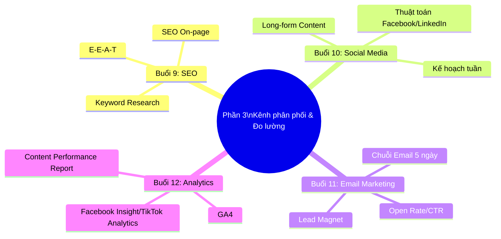

# PHẦN 3: KÊNH PHÂN PHỐI & ĐO LƯỜNG HIỆU SUẤT (NÂNG CAO)
## (Buổi 9 - 12 | Cấp độ: Nâng cao)

---

## MỤC TIÊU PHẦN 3

Sau khi hoàn thành Phần 3, học viên có thể:
- Viết bài blog chuẩn SEO có khả năng lên top Google.
- Xây dựng nội dung Social Media phù hợp thuật toán Facebook/LinkedIn.
- Thiết kế chuỗi Email Marketing nuôi dưỡng khách hàng tự động.
- Đọc hiểu số liệu phân tích (GA4, Facebook Insight, TikTok Analytics) và lập báo cáo hiệu suất nội dung.

---

## BUỔI 9: CONTENT SEO – VIẾT BÀI CHUẨN SEO LÊN TOP GOOGLE

### 9.1. Mục tiêu buổi học
- Nghiên cứu từ khóa (Keyword Research) bằng công cụ.
- Tối ưu SEO On-page: Title, Meta Description, Heading, mật độ từ khóa.
- Nắm tiêu chuẩn E-E-A-T (Experience, Expertise, Authoritativeness, Trustworthiness).

### 9.2. Nội dung lý thuyết chi tiết

**a) Quy trình nghiên cứu từ khóa (Keyword Research) 4 bước**

1. **Xác định chủ đề gốc** liên quan đến sản phẩm/dịch vụ (Seed Keyword).
2. **Mở rộng từ khóa** bằng công cụ (Google Keyword Planner, Ahrefs, SEMrush, hoặc gợi ý tự động của Google/YouTube).
3. **Phân loại theo Search Intent**: Informational (tìm hiểu thông tin), Navigational (tìm thương hiệu cụ thể), Commercial (so sánh trước khi mua), Transactional (sẵn sàng mua).
4. **Ưu tiên từ khóa dài (Long-tail Keyword)** cho người mới bắt đầu — cạnh tranh thấp hơn, tỷ lệ chuyển đổi cao hơn do rất cụ thể (ví dụ: "cách trị mụn ẩn cho da dầu tại nhà" thay vì chỉ "trị mụn").

**b) Tối ưu SEO On-page**

| Yếu tố | Tiêu chuẩn tối ưu |
|---|---|
| Title Tag | 50-60 ký tự, chứa từ khóa chính, đặt gần đầu tiêu đề |
| Meta Description | 140-160 ký tự, tóm tắt hấp dẫn kèm từ khóa, có CTA ngắn |
| Heading (H1, H2, H3) | Chỉ 1 H1/trang, các H2/H3 chứa từ khóa liên quan (LSI keyword) |
| Mật độ từ khóa | 1-2%, tự nhiên, tránh nhồi nhét (keyword stuffing) |
| URL | Ngắn gọn, chứa từ khóa chính, không dấu, phân cách bằng gạch ngang |
| Internal Link | Liên kết đến 2-3 bài viết liên quan trong cùng website |
| Alt Text hình ảnh | Mô tả hình ảnh có chứa từ khóa liên quan (hỗ trợ SEO hình ảnh) |

**c) Tiêu chuẩn E-E-A-T**

| Yếu tố | Ý nghĩa | Cách thể hiện trong bài viết |
|---|---|---|
| Experience (Trải nghiệm) | Người viết có trải nghiệm thực tế với chủ đề | Chia sẻ trải nghiệm cá nhân, hình ảnh/video tự chụp |
| Expertise (Chuyên môn) | Kiến thức chuyên sâu, chính xác | Trích dẫn nguồn uy tín, số liệu cụ thể |
| Authoritativeness (Thẩm quyền) | Được công nhận trong lĩnh vực | Tác giả có bio rõ ràng, backlink từ trang uy tín |
| Trustworthiness (Đáng tin cậy) | Thông tin minh bạch, không gây hiểu lầm | Có chính sách bảo mật, thông tin liên hệ rõ ràng, cập nhật ngày đăng |

**Lưu ý quan trọng**: Google đặc biệt siết chặt tiêu chuẩn E-E-A-T với các chủ đề **YMYL (Your Money Your Life)** — sức khỏe, tài chính, pháp lý — nội dung sai lệch có thể ảnh hưởng trực tiếp đến quyết định quan trọng của người đọc.

### 9.3. Case study minh họa

Phân tích 1 bài blog SEO tài chính cá nhân Việt Nam xếp hạng top Google: cấu trúc H2/H3 rõ ràng theo từng câu hỏi phụ, có trích dẫn số liệu nguồn chính thống (Ngân hàng Nhà nước, Tổng cục Thống kê), tác giả có bio chuyên môn tài chính — minh họa việc áp dụng đúng E-E-A-T giúp bài viết được Google tin tưởng xếp hạng cao.

### 9.4. Hoạt động tại lớp (Workshop 35 phút)

Học viên chọn 1 từ khóa dài liên quan đến đồ án cá nhân, lập outline bài viết chuẩn SEO gồm: Title, Meta Description, cấu trúc H1-H2-H3, kèm ít nhất 3 vị trí sẽ chèn LSI keyword.

### 9.5. Từ khóa cần ghi nhớ
`Keyword Research` • `Search Intent` • `Long-tail Keyword` • `SEO On-page` • `E-E-A-T` • `YMYL`

---

## BUỔI 10: XÂY DỰNG CONTENT SOCIAL MEDIA (FACEBOOK/LINKEDIN)

### 10.1. Mục tiêu buổi học
- Hiểu thuật toán hiển thị của Facebook và LinkedIn ảnh hưởng thế nào đến định dạng bài viết.
- Viết bài dạng dài (Long-form) tạo độ thảo luận cao.
- Lập kế hoạch nội dung tuần cho Fanpage doanh nghiệp.

### 10.2. Nội dung lý thuyết chi tiết

**a) Nguyên tắc thuật toán cơ bản của Facebook/LinkedIn**

| Nền tảng | Yếu tố thuật toán ưu tiên | Hàm ý cho người viết content |
|---|---|---|
| Facebook | Thời gian dừng lại đọc (dwell time), bình luận có ý nghĩa, chia sẻ | Viết bài đủ dài để giữ chân người đọc, đặt câu hỏi mở cuối bài để kích thích bình luận |
| LinkedIn | Tương tác trong "giờ vàng" đầu tiên (golden hour), bình luận chuyên sâu | Đăng vào khung giờ hành chính, viết nội dung có giá trị chuyên môn, tránh gắn link ngoài trực tiếp trong bài (thuật toán hạn chế reach) |

**Lưu ý quan trọng**: Cả 2 nền tảng đều **giảm reach tự nhiên (organic reach)** đối với bài viết gắn link dẫn ra ngoài nền tảng ngay trong nội dung chính — nên đặt link ở phần bình luận đầu tiên thay vì trong bài viết.

**b) Kỹ thuật viết bài Long-form tạo thảo luận cao**

1. Mở đầu bằng 1 quan điểm/câu chuyện cá nhân gây đồng cảm hoặc tranh luận nhẹ.
2. Chia đoạn ngắn (2-3 câu/đoạn), dùng khoảng trắng nhiều để dễ đọc trên di động.
3. Kết thúc bằng câu hỏi mở, mời gọi người đọc chia sẻ quan điểm/trải nghiệm cá nhân.
4. Tránh viết bài chỉ mang tính quảng cáo thuần túy — nên lồng ghép giá trị/góc nhìn cá nhân.

**c) Mẫu kế hoạch nội dung tuần cho Fanpage**

| Thứ | Loại nội dung | Mục tiêu phễu |
|---|---|---|
| Thứ 2 | Bài kiến thức/mẹo ngắn | TOFU |
| Thứ 3 | Hình ảnh sản phẩm/behind-the-scenes | TOFU |
| Thứ 4 | Bài Long-form chia sẻ góc nhìn/case study | MOFU |
| Thứ 5 | Poll/câu hỏi tương tác | TOFU |
| Thứ 6 | Testimonial/review khách hàng thật | MOFU/BOFU |
| Thứ 7 | Ưu đãi/chương trình khuyến mãi cuối tuần | BOFU |
| Chủ nhật | Nội dung giải trí nhẹ nhàng, gắn kết cộng đồng | TOFU |

### 10.3. Case study minh họa

Phân tích 1 bài Long-form LinkedIn thực tế của một chuyên gia ngành marketing tại Việt Nam đạt tương tác cao: mở đầu bằng câu chuyện thất bại cá nhân, chia đoạn ngắn dễ đọc, kết bằng câu hỏi mời chia sẻ kinh nghiệm — không có link ngoài trong bài viết chính.

### 10.4. Hoạt động tại lớp (Workshop 35 phút)

Học viên viết 1 bài Long-form (400-600 từ) cho Fanpage đồ án cá nhân theo cấu trúc mục 10.2b, đăng thử ở chế độ nháp và nhận feedback từ giảng viên.

### 10.5. Từ khóa cần ghi nhớ
`Organic Reach` • `Dwell Time` • `Golden Hour` • `Long-form Content` • `Engagement Bait (cần tránh lạm dụng)`

---

## BUỔI 11: EMAIL MARKETING & CHUỖI NỘI DUNG TỰ ĐỘNG

### 11.1. Mục tiêu buổi học
- Thu thập dữ liệu email khách hàng chất lượng (Lead Magnet).
- Thiết kế chuỗi Email nuôi dưỡng (Nurturing Email Sequence) 5 ngày.
- Tối ưu tỷ lệ mở email (Open Rate) và tỷ lệ nhấp chuột (CTR).

### 11.2. Nội dung lý thuyết chi tiết

**a) Lead Magnet — công cụ thu thập email chất lượng**

Lead Magnet là tài nguyên miễn phí có giá trị đủ lớn để khách hàng sẵn sàng đổi lấy bằng thông tin liên hệ (email). Ví dụ theo ngành: Ebook hướng dẫn (giáo dục), Checklist/Template (B2B, dịch vụ), Mã giảm giá lần đầu (bán lẻ, F&B), Mini-course email 5 ngày (khóa học online).

**Nguyên tắc Lead Magnet hiệu quả**: Giải quyết 1 vấn đề cụ thể, nhỏ, có thể tiêu thụ nhanh (dưới 10 phút đọc/xem) — không nên làm Lead Magnet quá dài khiến người dùng không hoàn thành.

**b) Cấu trúc chuỗi Email nuôi dưỡng 5 ngày**

| Ngày | Mục tiêu Email | Nội dung chính |
|---|---|---|
| Ngày 1 | Chào mừng + Giao Lead Magnet | Cảm ơn đã đăng ký, gửi tài nguyên đã hứa, giới thiệu ngắn gọn về thương hiệu |
| Ngày 2 | Xây dựng niềm tin | Chia sẻ câu chuyện thương hiệu/giá trị cốt lõi, không bán hàng |
| Ngày 3 | Cung cấp giá trị bổ sung | Mẹo/kiến thức hữu ích liên quan đến vấn đề khách hàng đang gặp |
| Ngày 4 | Minh chứng xã hội (Social Proof) | Testimonial, case study khách hàng thực tế đã thành công |
| Ngày 5 | Lời đề nghị + CTA rõ ràng | Giới thiệu sản phẩm/dịch vụ kèm ưu đãi có thời hạn |

**c) Tối ưu Open Rate và CTR**

| Chỉ số | Cách tối ưu |
|---|---|
| Open Rate | Dòng tiêu đề (Subject Line) ngắn gọn, cá nhân hóa tên người nhận, tránh từ ngữ bị đánh dấu spam ("miễn phí 100%", "!!!", toàn chữ hoa) |
| CTR (Click-through Rate) | Chỉ 1 CTA chính/email, nút bấm rõ ràng, nội dung ngắn gọn đi thẳng vào giá trị |
| Tỷ lệ hủy đăng ký (Unsubscribe Rate) | Không gửi quá dày (tối đa 1 email/1-2 ngày), luôn có link hủy đăng ký rõ ràng |

### 11.3. Case study minh họa

Phân tích 1 chuỗi email nuôi dưỡng thực tế của một nền tảng khóa học online: Ngày 1 giao ebook miễn phí, Ngày 3 chia sẻ câu chuyện học viên thành công, Ngày 5 mời tham gia lớp học thử có giới hạn thời gian — kết quả tỷ lệ chuyển đổi từ email sang đăng ký học thử đạt mức cao hơn đáng kể so với quảng cáo trực tiếp.

### 11.4. Hoạt động tại lớp (Workshop 35 phút)

Học viên thiết kế 1 Lead Magnet phù hợp với đồ án cá nhân và viết hoàn chỉnh nội dung Email Ngày 1 (chào mừng + giao tài nguyên) theo mẫu.

### 11.5. Công cụ thực hành
- SEO: Ahrefs, SEMrush, Google Keyword Planner.
- Email: Mailchimp, GetResponse.

### 11.6. Tài liệu bổ trợ
- Tài liệu: SEO Starter Guide của Google.
- Blog chuyên ngành: Backlinko (Brian Dean), Neil Patel Blog.

### 11.7. Từ khóa cần ghi nhớ
`Lead Magnet` • `Nurturing Email Sequence` • `Open Rate` • `CTR` • `Unsubscribe Rate`

---

## BUỔI 12: ĐỌC HIỂU SỐ LIỆU VÀ TỐI ƯU HÓA (ANALYTICS)

### 12.1. Mục tiêu buổi học
- Đọc các chỉ số cơ bản trên Google Analytics 4 (GA4).
- Đọc số liệu từ Facebook Insight và TikTok Analytics.
- Lập báo cáo hiệu suất nội dung (Content Performance Report).

### 12.2. Nội dung lý thuyết chi tiết

**a) Các chỉ số cơ bản trên GA4**

| Chỉ số | Ý nghĩa | Ngưỡng tham khảo cần lưu ý |
|---|---|---|
| Time on Page | Thời gian trung bình người dùng ở lại trang | Càng cao càng tốt (nội dung giữ chân được người đọc) |
| Bounce Rate/Engagement Rate | Tỷ lệ người dùng rời trang mà không tương tác thêm | Bounce Rate cao bất thường (>70%) cần xem lại nội dung/tốc độ tải trang |
| Traffic Source | Nguồn truy cập đến từ đâu (Organic, Social, Direct, Referral) | Giúp đánh giá kênh nào đang hiệu quả nhất |
| Conversion | Số lượng hoàn thành mục tiêu đã thiết lập (đăng ký, mua hàng) | Chỉ số quan trọng nhất để đánh giá ROI content |

**b) Đọc số liệu Facebook Insight và TikTok Analytics**

| Nền tảng | Chỉ số cần theo dõi | Ý nghĩa |
|---|---|---|
| Facebook Insight | Reach, Engagement Rate, Click | Reach = số người tiếp cận; Engagement Rate = mức độ tương tác/reach; Click = số lượt click vào nội dung/link |
| TikTok Analytics | Average Watch Time, Completion Rate, Shares | Average Watch Time thấp cho thấy Hook chưa đủ mạnh; Completion Rate cao là tín hiệu tốt để thuật toán đẩy video |

**c) Cấu trúc Báo cáo hiệu suất nội dung (Content Performance Report) chuẩn**

```
1. Tổng quan giai đoạn báo cáo (thời gian, số lượng bài đăng)
2. Top 5 nội dung hiệu suất cao nhất (kèm lý do phân tích)
3. Top 3 nội dung hiệu suất thấp nhất (kèm bài học rút ra)
4. So sánh hiệu suất theo từng loại nội dung/kênh
5. Đề xuất điều chỉnh cho giai đoạn tiếp theo
```

### 12.3. Case study minh họa

Phân tích 1 tình huống thực tế: một fanpage đăng bài đều đặn nhưng Reach giảm dần theo thời gian — qua phân tích Facebook Insight phát hiện nguyên nhân là nội dung lặp lại định dạng, ít Engagement Rate thực sự (chỉ có like ảo, không có bình luận/chia sẻ thật) — từ đó đề xuất đa dạng hóa định dạng và tăng nội dung khơi gợi thảo luận.

### 12.4. Hoạt động tại lớp (Workshop 35 phút)

Giảng viên cung cấp 1 bộ số liệu giả định (đã ẩn danh) từ GA4/Facebook Insight, học viên thực hành lập báo cáo hiệu suất nội dung theo cấu trúc 5 phần ở trên.

### 12.5. Công cụ thực hành
- Đo lường: Google Analytics 4, Looker Studio, Facebook Business Suite, TikTok Analytics.

### 12.6. Từ khóa cần ghi nhớ
`GA4` • `Bounce Rate` • `Engagement Rate` • `Completion Rate` • `Content Performance Report`

---

## TỔNG KẾT PHẦN 3



### Bài tập tổng hợp Phần 3

Xem chi tiết đề bài và tiêu chí chấm điểm tại [05-PHU-LUC-BAI-TAP-CHAM-DIEM-TIMELINE.md](05-PHU-LUC-BAI-TAP-CHAM-DIEM-TIMELINE.md), mục "Phần 3: Kênh phân phối & Đo lường hiệu suất".

**Tóm tắt đề bài**: Viết 1 bài blog chuẩn SEO (tối thiểu 1000 từ) cho 1 từ khóa tự chọn, tối ưu đầy đủ Title/Meta/Heading, kèm 1 email trong chuỗi nuôi dưỡng gửi cho người đã đọc bài blog nhưng chưa mua hàng.

---

*(Hết Phần 3. Tiếp tục với file [04-PHAN-4-CHIEN-LUOC-QUAN-TRI.md](04-PHAN-4-CHIEN-LUOC-QUAN-TRI.md))*
