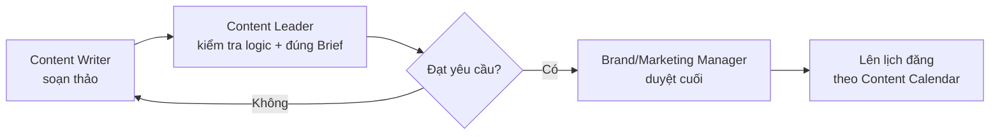
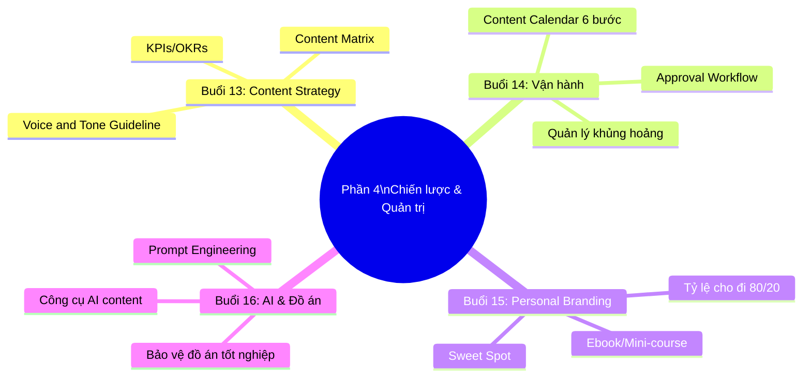

# PHẦN 4: CHIẾN LƯỢC & QUẢN TRỊ CONTENT (CHUYÊN GIA)
## (Buổi 13 - 16 | Cấp độ: Chuyên gia)

---

## MỤC TIÊU PHẦN 4

Sau khi hoàn thành Phần 4, học viên có thể:
- Thiết lập chiến lược nội dung tổng thể gắn với mục tiêu kinh doanh (KPIs/OKRs).
- Vận hành Lịch nội dung (Content Calendar) và quản lý quy trình làm việc nhóm.
- Xây dựng thương hiệu cá nhân qua nội dung (Personal Branding).
- Ứng dụng AI để tối ưu hiệu suất làm content và hoàn thiện đồ án tốt nghiệp.

---

## BUỔI 13: THIẾT LẬP CHIẾN LƯỢC NỘI DUNG TỔNG THỂ (CONTENT STRATEGY)

### 13.1. Mục tiêu buổi học
- Xác định mục tiêu nội dung gắn liền với mục tiêu kinh doanh (KPIs/OKRs).
- Định vị phong cách ngôn ngữ thương hiệu (Brand Voice & Tone).
- Xây dựng Ma trận nội dung (Content Matrix) để phân bổ ngân sách sản xuất.

### 13.2. Nội dung lý thuyết chi tiết

**a) Gắn mục tiêu nội dung với mục tiêu kinh doanh (KPIs/OKRs)**

Nguyên tắc: Mọi chiến lược nội dung phải xuất phát từ câu hỏi "Nội dung này giúp doanh nghiệp đạt được mục tiêu kinh doanh cụ thể nào?" trước khi hỏi "Nội dung này nên viết về gì?".

| Mục tiêu kinh doanh | Mục tiêu nội dung tương ứng | KPI đo lường |
|---|---|---|
| Tăng nhận diện thương hiệu | Tăng Reach, Impression trên các kênh | Reach, Impression, Follower Growth Rate |
| Tăng lead/khách hàng tiềm năng | Tăng số lượt tải Lead Magnet, đăng ký form | Số lead thu được, Cost per Lead (CPL) |
| Tăng doanh số | Thúc đẩy nội dung BOFU, remarketing | Conversion Rate, Doanh thu quy về từ content |
| Giữ chân khách hàng cũ | Nội dung chăm sóc sau bán (email, group VIP) | Retention Rate, Customer Lifetime Value (CLV) |

**Khung OKR mẫu cho phòng Content:**
```
Objective: Trở thành nguồn thông tin tin cậy số 1 trong ngành [X] đối với nhóm khách hàng [Y]
Key Result 1: Đạt 50,000 lượt organic traffic/tháng từ blog trong quý tới
Key Result 2: Tăng tỷ lệ Engagement Rate trung bình từ 2% lên 5% trên Fanpage
Key Result 3: Thu về 500 lead chất lượng/tháng từ chuỗi nội dung TOFU-MOFU
```

**b) Định vị Brand Voice & Tone**

Nhắc lại và mở rộng khái niệm đã học ở Phần 1-2: Brand Voice là tính cách cố định, Tone linh hoạt theo ngữ cảnh. Ở cấp độ chiến lược, cần xây dựng **Bộ hướng dẫn giọng điệu (Voice & Tone Guideline)** chính thức cho toàn đội ngũ, gồm:

```
1. 3-5 tính từ mô tả Brand Voice
2. Danh sách từ/cụm từ NÊN dùng và KHÔNG NÊN dùng
3. Ví dụ minh họa: cùng 1 thông điệp viết theo đúng Voice và viết sai Voice
4. Bảng điều chỉnh Tone theo từng kênh/tình huống (bình thường, khủng hoảng, chúc mừng...)
```

**c) Ma trận nội dung (Content Matrix)**

Content Matrix là công cụ giúp phân loại nội dung theo 2 trục: **Mục tiêu người xem** (Giáo dục/Giải trí) và **Định dạng cảm xúc/lý trí** (Cảm xúc/Lý trí) — từ đó phân bổ ngân sách sản xuất hợp lý.

| | Thiên về Lý trí | Thiên về Cảm xúc |
|---|---|---|
| **Giáo dục** | Hướng dẫn sử dụng, so sánh kỹ thuật, số liệu | Câu chuyện truyền cảm hứng có bài học |
| **Giải trí** | Trivia, thử thách kiến thức | Video hài hước, trend, behind-the-scenes |

**Nguyên tắc phân bổ ngân sách theo Content Matrix**: Doanh nghiệp B2B thường ưu tiên góc phần tư "Giáo dục - Lý trí"; thương hiệu tiêu dùng nhanh (FMCG) thường ưu tiên "Giải trí - Cảm xúc".

### 13.3. Case study minh họa

Phân tích chiến lược nội dung của Vinamilk: mục tiêu kinh doanh dài hạn "gắn thương hiệu với sự phát triển thể chất người Việt" được cụ thể hóa thành các Content Pillar xuyên suốt (dinh dưỡng học đường, thể thao, sức khỏe gia đình) — mọi nội dung dù ở kênh nào cũng phục vụ mục tiêu chiến lược này, không sản xuất nội dung ngẫu hứng.

### 13.4. Hoạt động tại lớp (Workshop 35 phút)

Học viên viết 1 khung OKR đơn giản (1 Objective + 2-3 Key Result) cho đồ án cá nhân, sau đó xác định vị trí ưu tiên trong Content Matrix (góc phần tư nào cần đầu tư nhiều nhất).

### 13.5. Từ khóa cần ghi nhớ
`OKR` • `KPI Content` • `Voice & Tone Guideline` • `Content Matrix`

---

## BUỔI 14: VẬN HÀNH LỊCH NỘI DUNG (CONTENT CALENDAR) & QUẢN LÝ TEAM

### 14.1. Mục tiêu buổi học
- Nắm quy trình xây dựng Content Calendar chạy mượt mà trong 1 tháng.
- Biết cách giao việc, thiết lập Deadline và quy trình phê duyệt (Workflow).
- Quản lý rủi ro khủng hoảng truyền thông liên quan đến chữ nghĩa (câu từ nhạy cảm, dễ gây hiểu lầm).

### 14.2. Nội dung lý thuyết chi tiết

**a) Quy trình xây dựng Content Calendar 1 tháng (6 bước)**

1. Rà soát lại Content Pillar và Ma trận nội dung đã có.
2. Xác định các sự kiện/mùa vụ trong tháng (lễ Tết, sự kiện ngành, ngày kỷ niệm thương hiệu).
3. Phân bổ tỷ lệ nội dung theo mô hình 3H (Hero-Hub-Hygiene) đã học.
4. Gán từng nội dung vào kênh phù hợp và khung giờ đăng tối ưu.
5. Phân công người phụ trách (viết, thiết kế, duyệt) cho từng nội dung.
6. Rà soát toàn bộ lịch để đảm bảo cân bằng giữa các Pillar, không trùng lặp chủ đề liên tiếp.

**b) Quy trình phê duyệt nội dung (Approval Workflow) chuẩn**



**Nguyên tắc quản lý Deadline**: Luôn có buffer tối thiểu 2-3 ngày giữa thời điểm hoàn thành nội dung và thời điểm đăng thực tế — để có thời gian phê duyệt và xử lý phát sinh.

**c) Quản lý rủi ro khủng hoảng truyền thông liên quan đến chữ nghĩa**

| Loại rủi ro | Ví dụ | Cách phòng tránh |
|---|---|---|
| Ngôn từ nhạy cảm về văn hóa/tôn giáo/chính trị | Đùa cợt về vấn đề nhạy cảm để "bắt trend" | Luôn có bước rà soát bởi người thứ 2 trước khi đăng |
| Số liệu/thông tin sai lệch | Đưa ra cam kết/số liệu không thể kiểm chứng | Luôn có nguồn dẫn chứng, kiểm tra fact trước khi đăng |
| Ngữ cảnh gây hiểu lầm (newsjacking phản cảm) | Lồng ghép thương hiệu vào sự kiện thương tâm/nhạy cảm | Đánh giá kỹ ngữ cảnh trước khi bắt trend, có quy trình duyệt nhanh trong 30 phút cho nội dung thời sự |
| Xử lý khủng hoảng khi đã xảy ra | Bài đăng gây tranh cãi lan truyền | Có kịch bản phản hồi mẫu (xin lỗi/giải thích), gỡ bài nếu cần, không im lặng kéo dài |

### 14.3. Case study minh họa

Phân tích 1 tình huống khủng hoảng truyền thông thực tế: một thương hiiệu đăng nội dung newsjacking không phù hợp về mặt ngữ cảnh, gây phản ứng tiêu cực trên mạng xã hội — phân tích quy trình phản hồi khủng hoảng (xin lỗi công khai, gỡ bài, cam kết rà soát quy trình duyệt nội dung chặt chẽ hơn).

### 14.4. Hoạt động tại lớp (Workshop 35 phút)

Học viên hoàn thiện Content Calendar 1 tháng cho đồ án cá nhân (đã bắt đầu từ Phần 2), bổ sung cột "Người phụ trách" và "Trạng thái duyệt", áp dụng quy trình Approval Workflow.

### 14.5. Công cụ thực hành
- Quản trị: Notion, Trello, Asana (xây dựng Content Workspace).

### 14.6. Từ khóa cần ghi nhớ
`Content Calendar` • `Approval Workflow` • `Buffer Deadline` • `Khủng hoảng truyền thông` • `Newsjacking rủi ro`

---

## BUỔI 15: ĐỊNH HÌNH THƯƠNG HIỆU CÁ NHÂN QUA NỘI DUNG (PERSONAL BRANDING)

### 15.1. Mục tiêu buổi học
- Tìm ra "Điểm ngọt" (Sweet Spot) để viết về bản thân.
- Phân phối nội dung cá nhân trên LinkedIn/Facebook thu hút đối tác, khách hàng.
- Biến kiến thức chuyên môn thành tài sản nội dung (Ebook, khóa học nhỏ).

### 15.2. Nội dung lý thuyết chi tiết

**a) Công thức tìm "Điểm ngọt" (Sweet Spot) cho Personal Branding**

Sweet Spot nằm ở giao điểm của 3 yếu tố:

```
[Điều bạn giỏi/có chuyên môn] ∩ [Điều thị trường/nhà tuyển dụng cần] ∩ [Điều bạn thực sự muốn chia sẻ lâu dài]
```

Nếu chỉ có 1-2 yếu tố mà thiếu yếu tố còn lại: có chuyên môn nhưng thị trường không cần → khó thu hút; thị trường cần nhưng bạn không thích chia sẻ → khó duy trì lâu dài, dễ burnout.

**b) Chiến lược phân phối nội dung cá nhân trên LinkedIn/Facebook**

| Loại nội dung cá nhân | Tần suất đề xuất | Mục đích |
|---|---|---|
| Chia sẻ bài học/kinh nghiệm chuyên môn | 2-3 lần/tuần | Xây dựng uy tín chuyên môn (Authority) |
| Câu chuyện thất bại/học được điều gì | 1 lần/tuần | Tạo sự đồng cảm, gần gũi (Relatability) |
| Bình luận về xu hướng ngành | 1 lần/tuần | Thể hiện tư duy cập nhật, chủ động |
| Giới thiệu công việc/dự án đang làm (khéo léo) | 1-2 lần/tháng | Tạo cơ hội hợp tác/công việc mới mà không phô trương |

**Nguyên tắc quan trọng**: Tỷ lệ nội dung "cho đi" (chia sẻ giá trị) nên chiếm tối thiểu 80%, chỉ 20% nội dung liên quan trực tiếp đến "quảng bá bản thân/công việc" — tránh gây cảm giác phô trương quá mức.

**c) Biến kiến thức chuyên môn thành tài sản nội dung**

Quy trình 3 bước: (1) Liệt kê 5-10 câu hỏi thường được hỏi nhất trong lĩnh vực chuyên môn của bạn; (2) Viết câu trả lời chi tiết cho từng câu hỏi dưới dạng bài viết/ghi chú; (3) Tổng hợp thành Ebook/mini-course có cấu trúc để chia sẻ miễn phí (xây dựng uy tín) hoặc bán như sản phẩm nhỏ.

### 15.3. Case study minh họa

Phân tích hành trình xây dựng thương hiệu cá nhân của 1 chuyên gia marketing Việt Nam trên LinkedIn: bắt đầu từ việc chia sẻ đều đặn bài học thực chiến hàng tuần, dần xây dựng uy tín, sau đó ra mắt khóa học/ebook dựa trên chính những nội dung đã chia sẻ miễn phí trước đó.

### 15.4. Hoạt động tại lớp (Workshop 35 phút)

Học viên viết ra Sweet Spot cá nhân (giao điểm 3 yếu tố), sau đó liệt kê 5 câu hỏi thường gặp nhất trong lĩnh vực chuyên môn/sở thích của bản thân — đây sẽ là nguyên liệu cho 1 mini-Ebook cá nhân.

### 15.5. Từ khóa cần ghi nhớ
`Personal Branding` • `Sweet Spot` • `Authority` • `Relatability` • `Tỷ lệ cho đi 80/20`

---

## BUỔI 16: TỐI ƯU HIỆU SUẤT CONTENT BẰNG AI + BẢO VỆ ĐỒ ÁN TỐT NGHIỆP

### 16.1. Mục tiêu buổi học
- Viết Prompt nâng cao để AI hỗ trợ nghiên cứu, lên dàn ý.
- Ứng dụng AI tạo ảnh minh họa, biên tập video thô tự động.
- Tổng kết khóa học và bảo vệ Đồ án tốt nghiệp: Chiến lược nội dung 3 tháng cho doanh nghiệp thực tế.

### 16.2. Nội dung lý thuyết chi tiết

**a) Kỹ thuật viết Prompt nâng cao cho AI hỗ trợ Content Marketing**

Khung Prompt hiệu quả gồm 4 thành phần: **Vai trò (Role)** — AI đóng vai chuyên gia gì; **Bối cảnh (Context)** — thông tin về sản phẩm/khách hàng/mục tiêu; **Nhiệm vụ (Task)** — yêu cầu cụ thể cần AI thực hiện; **Định dạng đầu ra (Format)** — cách trình bày kết quả mong muốn (bảng, danh sách, kịch bản...).

Xem mẫu Prompt đầy đủ tái sử dụng được tại file [prompt-tai-su-dung-content-marketing.md](../PROMPT%20AND%20SESSION/prompt-tai-su-dung-content-marketing.md).

**b) Ứng dụng AI trong sản xuất nội dung**

| Công cụ AI | Ứng dụng trong Content Marketing |
|---|---|
| ChatGPT/Claude/Gemini | Nghiên cứu chủ đề, lên dàn ý, viết nháp đầu tiên, brainstorm tiêu đề |
| Midjourney/Canva AI | Tạo ảnh minh họa, thiết kế banner/thumbnail nhanh |
| CapCut AI/Runway | Biên tập video thô tự động, tạo phụ đề tự động, cắt ghép theo trend |

**Lưu ý đạo đức khi dùng AI**: Luôn kiểm tra lại (fact-check) thông tin AI tạo ra trước khi đăng (tránh AI Hallucination — AI tự "bịa" thông tin sai); AI chỉ nên là công cụ hỗ trợ tăng tốc độ, không thay thế hoàn toàn tư duy sáng tạo và trải nghiệm thật của người viết (đặc biệt quan trọng với tiêu chuẩn E-E-A-T đã học ở Buổi 9).

**c) Cấu trúc Đồ án tốt nghiệp — Chiến lược nội dung 3 tháng**

```
Phần A. Nghiên cứu & Chiến lược (30 điểm)
  - Nghiên cứu thị trường & đối thủ
  - Brand Voice & Tone nhất quán
  - Ma trận nội dung
Phần B. Thực thi & Quản trị (40 điểm)
  - Content Calendar 1 tháng chi tiết
  - Sản phẩm mẫu (bài viết/kịch bản hoàn chỉnh)
  - Quy trình vận hành & phân bổ nhân sự
Phần C. Hệ thống đo lường KPI (15 điểm)
  - Bộ chỉ số đo lường đề xuất
Phần D. Thuyết trình & Phản biện (15 điểm)
```

*(Chi tiết đầy đủ tiêu chí chấm điểm xem tại* [05-PHU-LUC-BAI-TAP-CHAM-DIEM-TIMELINE.md](05-PHU-LUC-BAI-TAP-CHAM-DIEM-TIMELINE.md)*)*

### 16.3. Case study minh họa

Một chủ shop nhỏ dùng AI để rút ngắn thời gian lên kế hoạch content từ 1 ngày xuống còn 2 giờ mỗi tuần, nhờ dùng Prompt có cấu trúc rõ ràng (Role-Context-Task-Format) thay vì hỏi AI chung chung — minh họa giá trị thực tế của kỹ năng Prompt Engineering đối với người làm content một mình (solo content creator).

### 16.4. Hoạt động tại lớp

- 90 phút: Học viên/nhóm thuyết trình Đồ án tốt nghiệp (5-7 phút/nhóm + 3 phút phản biện).
- 30 phút cuối: Giảng viên tổng kết khóa học, trao chứng nhận, định hướng lộ trình phát triển tiếp theo cho từng học viên.

### 16.5. Công cụ thực hành
- AI hỗ trợ: ChatGPT, Claude, Midjourney, Canva.

### 16.6. Tài liệu bổ trợ
- Sách: *Epic Content Marketing* (Joe Pulizzi).
- Báo cáo: *State of Content Marketing* hàng năm do Semrush công bố.

### 16.7. Từ khóa cần ghi nhớ
`Prompt Engineering` • `Role-Context-Task-Format` • `AI Hallucination` • `Đồ án tốt nghiệp`

---

## TỔNG KẾT PHẦN 4 VÀ TOÀN KHÓA HỌC



### Bài tập tổng hợp Phần 4 — Đồ án tốt nghiệp

Xem chi tiết đề bài, tiêu chí chấm điểm và thang xếp loại tại [05-PHU-LUC-BAI-TAP-CHAM-DIEM-TIMELINE.md](05-PHU-LUC-BAI-TAP-CHAM-DIEM-TIMELINE.md), mục "Tiêu chí chấm Đồ án tốt nghiệp".

---

*(Hết Phần 4 — Kết thúc nội dung 16 buổi học. Xem phụ lục vận hành tại file [05-PHU-LUC-BAI-TAP-CHAM-DIEM-TIMELINE.md](05-PHU-LUC-BAI-TAP-CHAM-DIEM-TIMELINE.md))*
